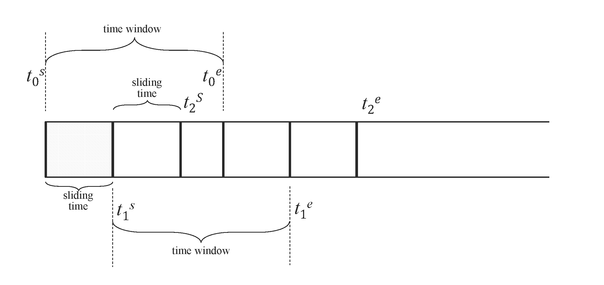
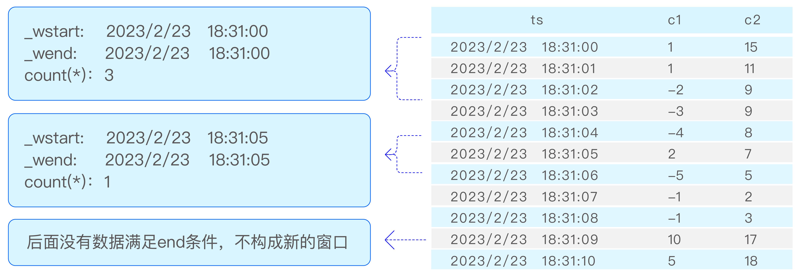
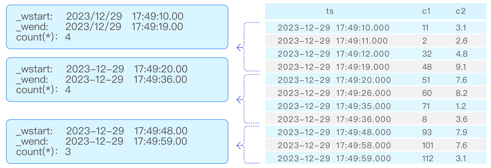

TDengine, in addition to supporting standard SQL, also offers a series of specialized query syntaxes tailored for time-series business scenarios, which greatly facilitate the development of applications in time-series contexts.

TDengine's featured queries include data partitioning queries and time window partitioning queries.

## Data Partitioning Queries

Data partitioning clauses are used when it is necessary to partition data according to certain dimensions and then perform a series of calculations within the partitioned data space. The syntax for data partitioning statements is as follows:

```sql
PARTITION BY part_list
```

`part_list` can be any scalar expression, including columns, constants, scalar functions, and their combinations. For example, grouping data by the `location` tag and calculating the average voltage for each group:

```sql
select location, avg(voltage) from meters partition by location
```

TDengine processes the data partitioning clause as follows:

- The data partitioning clause is located after the WHERE clause.
- The data partitioning clause divides the table data according to the specified dimensions, and each partitioned slice undergoes the specified calculations. These calculations are defined by subsequent clauses (window clause, GROUP BY clause, or SELECT clause).
- The data partitioning clause can be used together with a window partitioning clause (or GROUP BY clause), where the subsequent clauses apply to each partitioned slice. For example, grouping data by the `location` tag and downsampling each group every 10 minutes to get the maximum value.

```sql
select _wstart, location, max(current) from meters partition by location interval(10m)
```

The most common use of the data partitioning clause is in supertable queries, where subtable data is partitioned by tags and then calculated separately. Especially the `PARTITION BY TBNAME` usage, which isolates the data of each subtable, forming independent time-series, greatly facilitating statistical analysis in various time-series scenarios. For example, calculating the average voltage of each electric meter every 10 minutes:

```sql
select _wstart, tbname, avg(voltage) from meters partition by tbname interval(10m)
```

## Window Partitioning Queries

TDengine supports aggregation result queries using time window partitioning, such as when a temperature sensor collects data every second, but the average temperature every 10 minutes is needed. In such scenarios, a window clause can be used to obtain the desired query results. The window clause is used to divide the data set being queried into subsets for aggregation based on the window, including time window, state window, session window, event window, count window, and external window. Time windows can further be divided into sliding time windows and tumbling time windows.

The syntax for the window clause is as follows:

```sql
window_clause: {
    SESSION(ts_col, tol_val)
  | STATE_WINDOW(state_expr [, state_expr ...]) [EXTEND(extend_val)] [ZEROTH_STATE(zeroth_val [, zeroth_val ...])] [TRUE_FOR(true_for_expr)]
  | INTERVAL(interval_val [, interval_offset]) [SLIDING (sliding_val)] [fill_clause]
  | EXTERNAL_WINDOW ((subquery) window_alias) [fill_clause]
  | EVENT_WINDOW START WITH start_trigger_condition END WITH end_trigger_condition [TRUE_FOR(true_for_expr)]
  | COUNT_WINDOW(count_val[, sliding_val][, col_name ...])
}
```

Here, `interval_val` and `sliding_val` both represent time periods, and `interval_offset` represents the window offset, which must be less than `interval_val`. The syntax supports three forms, explained as follows:

- INTERVAL(1s, 500a) SLIDING(1s), with time units in single character form. See [Time Units](./01-datatype.md#time-units).
- INTERVAL(1000, 500) SLIDING(1000), without time units, using the time precision of the query library as the default time unit, and when multiple libraries are present, the one with higher precision is used by default.
- INTERVAL('1s', '500a') SLIDING('1s'), with time units in string form, where the string must not contain any spaces or other characters.

### Rules for Window Clause

The following rules apply to the five window types SESSION, STATE_WINDOW, INTERVAL, EVENT_WINDOW, and COUNT_WINDOW. EXTERNAL_WINDOW has different rules from other window types; see the [External Window](#external-window) section for details.

- The window clause is placed after the data segmentation clause and cannot be used together with the GROUP BY clause.
- The window clause divides the data by windows and calculates the expressions in the SELECT list for each window. The expressions in the SELECT list can only include:
  - Constants.
  - Pseudocolumns _wstart,_wend, and _wduration.
  - Aggregate functions (including selection functions, time-series specific functions whose output row count is determined by parameters, and window calculation / time-weighted statistics functions among the time-series specific functions).
  - Expressions containing the above expressions.
  - And must include at least one aggregate function(this limitation no longer exists after version 3.4.0.0).
- The window clause cannot be used together with the GROUP BY clause.
- WHERE statements can specify the start and end time of the query and other filtering conditions.

### Time Windows

Time windows can be divided into sliding time windows and tumbling time windows.

The INTERVAL clause is used to generate windows of equal time periods, and SLIDING is used to specify the time the window slides forward. Each executed query is a time window, and the time window slides forward as time flows. When defining continuous queries, it is necessary to specify the size of the time window (time window) and the forward sliding times for each execution. As shown, [t0s, t0e], [t1s, t1e], [t2s, t2e] are the time window ranges for three continuous queries, and the sliding time range is indicated by sliding time. Query filtering, aggregation, and other operations are performed independently for each time window. When SLIDING is equal to INTERVAL, the sliding window becomes a tumbling window. By default, windows begin at Unix time 0 (1970-01-01 00:00:00 UTC). If interval_offset is specified, the windows start from "Unix time 0 + interval_offset".

When the query object is a super table, the aggregate functions will apply to all data that meets the filtering conditions from all tables under that super table, and the results will be strictly monotonically increasing according to the window start time.
If the query uses a PARTITION BY statement for grouping, the results will be strictly monotonically increasing according to the window start time within each PARTITION.



The INTERVAL and SLIDING clauses need to be used in conjunction with aggregation and selection functions. The following SQL statement is illegal:

```sql
SELECT * FROM temp_tb_1 INTERVAL(1m);
```

The forward sliding time of SLIDING cannot exceed the time range of one window. The following statement is illegal:

```sql
SELECT COUNT(*) FROM temp_tb_1 INTERVAL(1m) SLIDING(2m);
```

The INTERVAL clause allows the use of the AUTO keyword to specify the window offset (Supported in version 3.3.5.0 and later). If the WHERE condition provides a clear applicable start time limit, the required offset will be automatically calculated, dividing the time window from that point; otherwise, it defaults to an offset of 0. Here are some simple examples:

```sql
-- With a start time limit, divide the time window from '2018-10-03 14:38:05'
SELECT COUNT(*) FROM meters WHERE _rowts >= '2018-10-03 14:38:05' INTERVAL (1m, AUTO);

-- Without a start time limit, defaults to an offset of 0
SELECT COUNT(*) FROM meters WHERE _rowts < '2018-10-03 15:00:00' INTERVAL (1m, AUTO);

-- Unclear start time limit, defaults to an offset of 0
SELECT COUNT(*) FROM meters WHERE _rowts - voltage > 1000000;
```

The INTERVAL clause supports using the FILL clause to specify the data
filling method when data is missing, except for the NEAR filling mode. For how to use the FILL clause,
please refer to [FILL Clause](./20-select.md#fill-clause).

When using time windows, note:

- The window width of the aggregation period is specified by the keyword INTERVAL, with the shortest interval being 10 milliseconds (10a); it also supports an offset (the offset must be less than the interval), which is the offset of the time window division compared to "UTC moment 0". The SLIDING statement is used to specify the forward increment of the aggregation period, i.e., the duration of each window slide forward.
- When using the INTERVAL statement, unless in very special cases, it is required to configure the timezone parameter in the taos.cfg configuration files of both the client and server to the same value to avoid frequent cross-time zone conversions by time processing functions, which can cause severe performance impacts.
- The returned results have a strictly monotonically increasing time-series.
- When using AUTO as the window offset, if the WHERE time condition is complex, such as multiple AND/OR/IN combinations, AUTO may not take effect. In such cases, you can manually specify the window offset to resolve the issue.
- When using AUTO as the window offset, if the window width unit is d (day), n (month), w (week), y (year), such as: INTERVAL(1d, AUTO), INTERVAL(3w, AUTO), the TSMA optimization cannot take effect. If TSMA is manually created on the target table, the statement will report an error and exit; in this case, you can explicitly specify the Hint SKIP_TSMA or not use AUTO as the window offset.

### State Window

State windows are divided according to the continuity of one or more state keys. Multiple state keys have been supported since v3.4.2.0. State keys support integers, booleans, and strings, and can also be `CASE WHEN` or `IF` expressions that return these types. Adjacent rows compare state keys in the order they are written in SQL. If any key changes, the current window closes and a new one starts. The diagram below shows a single-key example, where the two resulting windows are [2019-04-28 14:22:07, 2019-04-28 14:22:10] and [2019-04-28 14:22:11, 2019-04-28 14:22:12].


The syntax is:

```sql
STATE_WINDOW(state_expr [, state_expr ...])
  [EXTEND(extend_val)]
  [ZEROTH_STATE(zeroth_val [, zeroth_val ...])]
  [TRUE_FOR(true_for_expr)]
```

Where:

- `state_expr` is one or more state keys. It can be a column reference or an expression such as `CASE WHEN`, `IF`, or `CAST`. The result type must be integer, boolean, or `VARCHAR`, and tag columns are not supported.
- `EXTEND(extend_val)` optionally specifies the boundary extension strategy. `0` is the default behavior. `EXTEND(1)` keeps the window start unchanged and extends the window end forward to just before the next window starts. `EXTEND(2)` keeps the window end unchanged and extends the window start backward to just after the previous window ends.
- `ZEROTH_STATE(...)` optionally specifies the zero state. A zero state is a baseline state value that the user does not care about. State-window queries often produce many windows in default, idle, or normal states, while users usually care only about exceptional or target states. By specifying these baseline values with `ZEROTH_STATE`, matching windows are filtered out automatically and are neither calculated nor returned, which keeps the result set focused. The number of arguments must match the number of state keys. Any argument other than `NO_ZEROTH` must be a constant and convertible to the corresponding state-key type. `NO_ZEROTH` means the corresponding position does not participate in zero-state matching. A window is filtered only when all constrained positions match their zero-state values.
- `TRUE_FOR(true_for_expr)` optionally filters windows by duration, row count, or both.

`NULL` values in state keys are handled as follows:

- Consecutive rows with the same state key pattern, meaning the `NULL` positions are the same and the non-`NULL` state-key values are also identical, are handled as a whole. Depending on `EXTEND`, that whole segment may merge into the previous window, merge into the next window, or become an independent window.
- Two state windows are considered compatible when all non-`NULL` state-key positions are identical. Compatible windows may merge under the effect of `EXTEND`.
- All-`NULL` rows enclosed by a consecutive same-pattern state-key segment are handled together with that segment.
- When all state-key columns are `NULL`, the row itself does not trigger a state change. Its ownership depends on surrounding data and the selected `EXTEND` mode.
- When only some state-key columns are `NULL`, which only happens in the multi-key case, those `NULL` positions do not participate in key-by-key comparison and the remaining non-`NULL` positions determine the window split.

The table below shows the most common merge outcomes. In each row, “merge into previous”, “merge into next”, and “independent window” all refer to the consecutive partial-`NULL` rows in the middle:

| Input sequence (state keys) | `EXTEND(0)` | `EXTEND(1)` | `EXTEND(2)` |
| --- | --- | --- | --- |
| `(1, 10) -> (1, NULL) -> (1, 20)` | Merge into previous | Merge into previous | Merge into next |
| `(1, 'a') -> (1, NULL) -> (2, 'a')` | Merge into previous | Merge into previous | Independent window |
| `(1, 'a') -> (NULL, 'b') -> (1, 'b')` | Merge into next | Independent window | Merge into next |
| `(1, 'a') -> (NULL, 'b') -> (2, 'a')` | Independent window | Independent window | Independent window |
| `(NULL, 'b') -> (1, 'b') -> (1, 'b')` | Merge into next | Independent window | Merge into next |
| `(1, 'a') -> (1, 'a') -> (1, NULL)` | Merge into previous | Merge into previous | Independent window |

If multiple consecutive rows belong to the same partial-`NULL` run, the same rule still applies. For example, in `(1, 'a') -> (1, NULL) -> (NULL, NULL) -> (1, NULL) -> (2, 'a')`, the three middle rows are handled together: `EXTEND(0)` and `EXTEND(1)` merge them into the previous window, while `EXTEND(2)` keeps them as an independent window.

#### Examples

##### State Key Examples

Single-key example:

```sql
SELECT COUNT(*), FIRST(ts), status FROM temp_tb_1 STATE_WINDOW(status);
```

If you are interested only in windows where `status = 2`, you can still filter in an outer query:

```sql
SELECT * FROM (SELECT COUNT(*) AS cnt, FIRST(ts) AS fst, status FROM temp_tb_1 STATE_WINDOW(status)) t WHERE status = 2;
```

Multi-key example:

```sql
SELECT _wstart, _wend, count(*), c_int, c_bool
FROM ntb1
STATE_WINDOW(c_int, c_bool);
```

The query above uses `c_int` and `c_bool` together as the state key. The current window closes when either `c_int` or `c_bool` changes.

TDengine also supports using `CASE` or `IF` expressions as state keys. For example, the normal voltage range for a smart meter is 205V to 235V, so you can monitor the voltage to determine whether the circuit is normal. Multiple discrete status dimensions can also be combined in the same `STATE_WINDOW(...)` clause.

```sql
SELECT tbname, _wstart, CASE WHEN voltage >= 205 and voltage <= 235 THEN 1 ELSE 0 END status FROM meters PARTITION BY tbname STATE_WINDOW(CASE WHEN voltage >= 205 and voltage <= 235 THEN 1 ELSE 0 END);
```

The same logic can be expressed more concisely with `IF`:

```sql
SELECT tbname, _wstart, IF(voltage >= 205 AND voltage <= 235, 1, 0) AS status FROM meters PARTITION BY tbname STATE_WINDOW(IF(voltage >= 205 AND voltage <= 235, 1, 0));
```

In supertable queries, or in subqueries where tag columns are available, the state expression can also reference tag columns visible in the current query context, as long as the final expression result type is still integer, boolean, or string. For example, you can adjust the threshold dynamically with the `groupId` tag:

```sql
SELECT tbname, _wstart, _wend,
       CASE WHEN voltage >= 220 + groupId THEN 'high' ELSE 'normal' END AS status
FROM meters
PARTITION BY tbname
STATE_WINDOW(CASE WHEN voltage >= 220 + groupId THEN 'high' ELSE 'normal' END);
```

Note that `STATE_WINDOW(groupId)` is still not supported. If you want to use a tag column, it must participate in an expression instead of being used directly as the state expression.

##### EXTEND Parameter

Take the following data as an example to show how `EXTEND` affects window splitting and the ownership of `NULL` rows:

```text
taos> select * from state_window_example;
           ts            |   status    |
========================================
 2025-01-01 00:00:00.000 | NULL        |
 2025-01-01 00:00:01.000 |           1 |
 2025-01-01 00:00:02.000 | NULL        |
 2025-01-01 00:00:03.000 |           1 |
 2025-01-01 00:00:04.000 | NULL        |
 2025-01-01 00:00:05.000 |           2 |
 2025-01-01 00:00:06.000 |           2 |
 2025-01-01 00:00:07.000 |           1 |
 2025-01-01 00:00:08.000 | NULL        |
```

The `EXTEND` parameter controls the extension strategy for the start and end of a window, with possible values `0` (default), `1`, and `2`.

When `extend` is 0:

The start and end timestamps of a window are the first and last non-`NULL` rows of the current state. Leading `NULL` rows, trailing `NULL` rows, and `NULL` rows between different states are discarded, while `NULL` rows enclosed by the same state value remain in the current window.

```text
taos> select _wstart, _wduration, _wend, count(*) from state_window_example state_window(status) extend(0);
         _wstart         |      _wduration       |          _wend          |       count(*)        |
====================================================================================================
 2025-01-01 00:00:01.000 |                  2000 | 2025-01-01 00:00:03.000 |                     3 |
 2025-01-01 00:00:05.000 |                  1000 | 2025-01-01 00:00:06.000 |                     2 |
 2025-01-01 00:00:07.000 |                     0 | 2025-01-01 00:00:07.000 |                     1 |
```

When `extend` is 1:

The window start remains unchanged, while the window end extends forward to just before the next window starts. `NULL` rows between different states and trailing `NULL` rows are merged into the previous window, while leading `NULL` rows are discarded.

```text
taos> select _wstart, _wduration, _wend, count(*) from state_window_example state_window(status) extend(1);
         _wstart         |      _wduration       |          _wend          |       count(*)        |
====================================================================================================
 2025-01-01 00:00:01.000 |                  3999 | 2025-01-01 00:00:04.999 |                     4 |
 2025-01-01 00:00:05.000 |                  1999 | 2025-01-01 00:00:06.999 |                     2 |
 2025-01-01 00:00:07.000 |                  1000 | 2025-01-01 00:00:08.000 |                     2 |
```

When `extend` is 2:

The window end remains unchanged, while the window start extends backward to just after the previous window ends. `NULL` rows between different states and leading `NULL` rows are merged into the next window, while trailing `NULL` rows are discarded.

```text
taos> select _wstart, _wduration, _wend, count(*) from state_window_example state_window(status) extend(2);
         _wstart         |      _wduration       |          _wend          |       count(*)        |
====================================================================================================
 2025-01-01 00:00:00.000 |                  3000 | 2025-01-01 00:00:03.000 |                     4 |
 2025-01-01 00:00:03.001 |                  2999 | 2025-01-01 00:00:06.000 |                     3 |
 2025-01-01 00:00:06.001 |                   999 | 2025-01-01 00:00:07.000 |                     1 |
```

##### ZEROTH_STATE Parameter

The `ZEROTH_STATE` parameter specifies the "zero state". A zero state is a baseline state value that the user does not care about. State-window queries often produce many windows in default, idle, or normal states, while users usually care only about exceptional or target states. Windows whose state expression result equals this value will not be calculated or output, and the input must be an integer, boolean, or string constant. In the multi-key case, a window is filtered only when every participating position equals its configured zero-state value. If a position uses `NO_ZEROTH`, that position is excluded from zero-state matching.

For a single-key example, `ZEROTH_STATE` filters out windows whose state is `2`:

```text
taos> select _wstart, _wduration, _wend, count(*) from state_window_example state_window(status) extend(0) zeroth_state(2);
         _wstart         |      _wduration       |          _wend          |       count(*)        |
====================================================================================================
 2025-01-01 00:00:00.000 |                  3000 | 2025-01-01 00:00:03.000 |                     4 |
 2025-01-01 00:00:07.000 |                  1000 | 2025-01-01 00:00:08.000 |                     2 |
```

Multi-key `ZEROTH_STATE` example:

```sql
SELECT _wstart, _wend, count(*), c1, c2
FROM ntb_null
STATE_WINDOW(c1, c2) EXTEND(0) ZEROTH_STATE(1, 10);
```

The query above filters windows whose state key is exactly `(1, 10)`, but keeps windows such as `(1, 20)` and `(2, 20)`. If only one position should be constrained, use `NO_ZEROTH`, for example `ZEROTH_STATE(1, NO_ZEROTH)`.

##### TRUE_FOR Parameter

The state window supports using the TRUE_FOR parameter to set the filtering condition for windows. Only windows that meet the condition will return calculation results. Supports the following four modes:

- `TRUE_FOR(duration_time)`: Filters based on duration only. The window duration must be greater than or equal to `duration_time`.
- `TRUE_FOR(COUNT n)`: Filters based on row count only. The window row count must be greater than or equal to `n`.
- `TRUE_FOR(duration_time AND COUNT n)`: Both duration and row count conditions must be satisfied.
- `TRUE_FOR(duration_time OR COUNT n)`: Either duration or row count condition must be satisfied.

For example, setting the minimum duration to 3 seconds:

```sql
SELECT COUNT(*), FIRST(ts), status FROM temp_tb_1 STATE_WINDOW(status) TRUE_FOR (3s);
```

Or setting the minimum row count to 100:

```sql
SELECT COUNT(*), FIRST(ts), status FROM temp_tb_1 STATE_WINDOW(status) TRUE_FOR (COUNT 100);
```

Or requiring both duration and row count conditions:

```sql
SELECT COUNT(*), FIRST(ts), status FROM temp_tb_1 STATE_WINDOW(status) TRUE_FOR (3s AND COUNT 50);
```

### Session Window

The session window is determined based on the timestamp primary key values of the records. As shown in the diagram below, if the continuous interval of the timestamps is set to be less than or equal to 12 seconds, the following 6 records form 2 session windows, which are: [2019-04-28 14:22:10, 2019-04-28 14:22:30] and [2019-04-28 14:23:10, 2019-04-28 14:23:30]. This is because the interval between 2019-04-28 14:22:30 and 2019-04-28 14:23:10 is 40 seconds, exceeding the continuous interval (12 seconds).


Results within the tol_value time interval are considered to belong to the same window; if the time between two consecutive records exceeds tol_val, the next window automatically starts.

```sql
SELECT COUNT(*), FIRST(ts) FROM temp_tb_1 SESSION(ts, tol_val);
```

### Event Window

The event window is defined by start and end conditions. The window starts when the start_trigger_condition is met and closes when the end_trigger_condition is met. start_trigger_condition and end_trigger_condition can be any condition expressions supported by TDengine and can include different columns.

In supertable queries, or in subqueries where tag columns are available, the start/end condition expressions can also reference tag columns. For example, you can use different voltage thresholds based on the `groupId` tag:

```sql
SELECT tbname, _wstart, _wend, count(*)
FROM meters
PARTITION BY tbname
EVENT_WINDOW START WITH voltage >= 220 + groupId END WITH voltage < 220 + groupId;
```

Event windows can contain only one data point. That is, when a data point simultaneously meets both the start_trigger_condition and end_trigger_condition, and is not currently within a window, it alone constitutes a window.

Event windows that cannot be closed do not form a window and will not be output. That is, if data meets the start_trigger_condition and the window opens, but subsequent data does not meet the end_trigger_condition, the window cannot be closed, and this data does not form a window and will not be output.

If event window queries are performed directly on a supertable, TDengine will aggregate the data of the supertable into a single timeline and then perform the event window calculation.
If you need to perform event window queries on the result set of a subquery, then the result set of the subquery needs to meet the requirements of outputting by timeline and can output a valid timestamp column.

Take the following SQL statement as an example, the event window segmentation is shown in the diagram:

```sql
select _wstart, _wend, count(*) from t event_window start with c1 > 0 end with c2 < 10 
```



The event window supports using the TRUE_FOR parameter to set the filtering condition for windows. Only windows that meet the condition will return calculation results. Supports the following four modes:

- `TRUE_FOR(duration_time)`: Filters based on duration only. The window duration must be greater than or equal to `duration_time`.
- `TRUE_FOR(COUNT n)`: Filters based on row count only. The window row count must be greater than or equal to `n`.
- `TRUE_FOR(duration_time AND COUNT n)`: Both duration and row count conditions must be satisfied.
- `TRUE_FOR(duration_time OR COUNT n)`: Either duration or row count condition must be satisfied.

For example, setting the minimum duration to 3 seconds:

```sql
select _wstart, _wend, count(*) from t event_window start with c1 > 0 end with c2 < 10 true_for (3s);
```

Or setting the minimum row count to 100:

```sql
select _wstart, _wend, count(*) from t event_window start with c1 > 0 end with c2 < 10 true_for (COUNT 100);
```

Or requiring both duration and row count conditions:

```sql
select _wstart, _wend, count(*) from t event_window start with c1 > 0 end with c2 < 10 true_for (3s AND COUNT 50);
```

### Count Window

Count windows divide data into windows based on a fixed number of data rows. By default, data is sorted by timestamp, then divided into multiple windows based on the value of count_val, and aggregate calculations are performed. count_val represents the maximum number of data rows in each count window; if the total number of data rows is not divisible by count_val, the last window will have fewer rows than count_val. sliding_val is a constant that represents the number of rows the window slides, similar to the SLIDING in interval. The col_name parameter starts to be supported after version 3.3.7.0. col_name specifies one or more columns. When counting in the count_window, for each row of data in the window, at least one of the specified columns must be non-null; otherwise, that row of data is not included in the counting window. If col_name is not specified, it means there is no non-null restriction.

Take the following SQL statement as an example, the count window segmentation is shown in the diagram:

```sql
select _wstart, _wend, count(*) from t count_window(4);
```



### External Window

External Window is used to "define windows first, then calculate within the windows." Unlike built-in windows such as INTERVAL and EVENT_WINDOW, the time range of an external window is explicitly defined by a subquery, which is suitable for complex analysis such as cross-event correlation, window reuse, and layered filtering.

The syntax of external windows is:

```sql
SELECT ...
FROM table_name
[PARTITION BY expr_list]
EXTERNAL_WINDOW (
  (subquery_that_defines_windows) window_alias
)
[FILL(fill_mode_and_val)]
[HAVING condition]
[ORDER BY ...]
```

Where:

- The first two columns of the subquery must be of timestamp type, representing the window start time and window end time respectively.
- Columns from the third column onward become "window attribute columns".
- The outer query performs calculations independently within each window range.

#### Key Features

1. **Flexibility of subquery-defined windows:** The subquery used to define windows supports several patterns, including ordinary subqueries, INTERVAL, EVENT_WINDOW, SESSION, and others, allowing users to generate the required window ranges flexibly.

2. **Aggregation and computation within windows:** The outer query calculates independently within each window range and supports aggregation and scalar expressions.

3. **Pseudo-column support:** `_wstart` (window start time), `_wend` (window end time), and `_wduration` (window duration) can be used in the SELECT, HAVING, and ORDER BY clauses.

4. **Grouping and alignment**

- The subquery can use `PARTITION BY` or `GROUP BY` for grouping, while the outer query can only use `PARTITION BY` for grouping.
- When both the subquery and the outer query use grouping, matching is aligned by grouping key: data from the same group only matches windows from the same group.
- If a group has no matching data within a window, that group naturally produces no result row for that window.
- When the subquery does not use grouping, it generates one shared set of windows. If the outer query uses grouping, each outer group calculates independently on that same shared window set.
- When the subquery uses grouping but the outer query does not, the syntax is invalid.
- **Current limitation and caveat:** When both inner and outer queries use grouping, and the window subquery also uses `ORDER BY`, the sorting may disturb the original organization of each grouped window stream. The outer query may then operate on a merged window stream, causing the inner grouping semantics to become ineffective, as if there were no grouping, and the one-to-one alignment between inner and outer groups is lost.

5. **Nested calls support:** Multiple layers of external window nesting are supported. That is, the subquery of an external window can itself use EXTERNAL_WINDOW, enabling layered aggregation. For example, a first-level external window can define event-based time ranges and aggregate intermediate metrics, then a second-level external window can aggregate those intermediate metrics again within a new set of time ranges.

#### Rules for Referencing Window Attribute Columns

Columns after the first two columns in the subquery, such as `groupid` and `location`, become window attribute columns. The reference rules are:

1. They must be referenced column by column with the window alias in the form `window_alias.column_name`, for example `w.groupid` and `w.location`.
2. Window attribute columns can only appear as `w.column_name` in the outer query's SELECT, HAVING, and ORDER BY clauses.
3. **They cannot be referenced in the WHERE clause** because WHERE filters rows from the outer table before windows are generated. Window attributes become available only after window definition and should be used in HAVING instead.
4. In the current implementation, the window alias is not a complete "virtual table". The `w.*` wildcard is **not** supported to expand all window attribute columns, and `w` also cannot be referenced as a standalone table in FROM or JOIN. If needed, explicitly select the required columns in the subquery and reference them one by one in the outer query.

#### Examples

**Example 1** - Use an INTERVAL subquery to generate windows and aggregate values within each window:

```sql
SELECT _wstart, _wend, COUNT(*), AVG(voltage)
FROM meters
EXTERNAL_WINDOW (
  (SELECT _wstart, _wend FROM meters INTERVAL(10m)) w
);
```

The SQL above first uses the inner subquery to divide the timeline into 10-minute windows, and then the outer query independently counts rows and calculates the average voltage in `meters` for each window.

**Example 2** - Generate windows in an event-driven way and compute alert statistics across tables:

The table creation statement for smart meters is as follows:

```sql
CREATE TABLE meters (ts TIMESTAMP, current FLOAT, voltage INT, phase FLOAT) TAGS (location BINARY(64), groupId INT);
```

Assume there is also an alert events table `alerts` (a supertable), containing columns `ts`, `alert_code`, and `alert_value`, with tags `groupid` and `location`.

Goal: use the voltage anomaly events of each meter group as time windows, that is, the 60 seconds after a voltage value >= 225V occurs, then count the alerts within each window. The output should include group information, the number of alerts in the window, and the maximum alert value, while filtering to windows where alerts were generated and sorting by group and time.

```sql
SELECT
  w.groupid,
  w.location,
  _wstart                AS event_start_time,
  COUNT(*)               AS alert_count,
  MAX(a.alert_value)     AS max_alert_value,
  AVG(a.alert_value)     AS avg_alert_value
FROM alerts a
PARTITION BY a.groupid
EXTERNAL_WINDOW (
  (SELECT ts, ts + 60s, groupid, location
   FROM meters
   WHERE voltage >= 225
   PARTITION BY groupid
  ) w
)
HAVING COUNT(*) > 0
ORDER BY w.groupid, event_start_time;
```

**Result explanation:**

- Each row represents one voltage anomaly event window, driven by records in `meters` where `voltage >= 225`, and each window lasts 60 seconds after the event occurs.
- `alert_count`, `max_alert_value`, and `avg_alert_value` are the statistical metrics from `alerts` within the window.
- `w.groupid` and `w.location` are window attribute columns from the tag columns of the subquery and are used to display grouping information.
- The `HAVING` condition uses the aggregate function `COUNT` to filter out windows with fewer than one alert.
- `PARTITION BY` alignment means that both inner and outer queries are grouped by `groupid`, ensuring that each meter group's alerts only match that group's anomaly windows.

#### FILL for Empty Windows

EXTERNAL_WINDOW supports using `FILL` to control how empty windows are handled. By default, if a window has no matching rows from the outer table, it produces no result row. Adding `FILL` allows the query to keep that window and populate aggregate columns according to the selected mode.

Supported modes in EXTERNAL_WINDOW are:

| Mode | Behavior |
|:----:|:---------|
| `NONE` | Default behavior; empty windows do not produce result rows |
| `NULL` | Empty windows produce one row with aggregate columns filled as `NULL`, but no output is produced when the full query range has no data |
| `NULL_F` | Same as `NULL`, but empty-window rows are still produced when the full query range has no data |
| `VALUE` | Empty windows produce one row with user-specified fill values, but no output is produced when the full query range has no data |
| `VALUE_F` | Same as `VALUE`, but empty-window rows are still produced when the full query range has no data |
| `PREV` | Empty windows use the aggregate result from the previous non-empty window; `NULL` is used if no previous value exists |
| `NEXT` | Empty windows use the aggregate result from the next non-empty window; `NULL` is used if no next value exists |

`LINEAR`, `NEAR`, and `SURROUND` are not supported in EXTERNAL_WINDOW.

`FILL` is evaluated before `HAVING`, so rows generated by filling also participate in `HAVING` filtering.

For the general FILL syntax, see [FILL Clause](./20-select.md#fill-clause).

Example:

```sql
SELECT _wstart, AVG(voltage) AS avg_vol, COUNT(*) AS cnt
FROM meters
EXTERNAL_WINDOW (
  (SELECT '2022-01-01 00:00:00'::TIMESTAMP,
     '2022-01-01 00:01:00'::TIMESTAMP
   UNION ALL
   SELECT '2022-01-01 00:01:00'::TIMESTAMP,
     '2022-01-01 00:02:00'::TIMESTAMP
   UNION ALL
   SELECT '2022-01-01 00:02:00'::TIMESTAMP,
     '2022-01-01 00:03:00'::TIMESTAMP
  ) w
)
FILL(VALUE, 0, 0)
ORDER BY _wstart;
```

The SQL above defines three one-minute external windows. If a window contains no data from `meters`, `avg_vol` and `cnt` are both filled with `0`.

#### Constraints and Limitations

- It is currently not supported in stream processing or subscriptions.
- The first two columns of the window subquery must be of timestamp type, representing the window start and end times respectively.
- The window rows returned by the subquery must remain ordered: in the ungrouped case, they must be sorted by window start time, that is, the first column, in ascending order; in the grouped case, they must be sorted by window start time in ascending order within each group. If this requirement is not met, execution fails with an error.
- If the external window, meaning the inner subquery, uses grouping, the outer query must also use PARTITION BY; otherwise, a syntax error is raised.
- Variable-row functions such as DIFF and INTERP are not supported within window scope.

### Timestamp Pseudo Columns

In window aggregate query results, if the SQL statement does not specify the output of the timestamp column in the query results, the final results will not automatically include the window's time column information. If you need to output the time window information corresponding to the aggregate results in the results, you need to use timestamp-related pseudocolumns in the SELECT clause: window start time (\_WSTART), window end time (\_WEND), window duration (\_WDURATION), and overall query window related pseudo columns: query window start time (\_QSTART) and query window end time (\_QEND). It should be noted that, except that the end time of the INTERVAL window is an open interval, the start time and end time of other time windows are both closed intervals, and the window duration is the numerical value under the current time resolution of the data. For example, if the current database's time resolution is milliseconds, then 500 in the results represents the duration of the current time window is 500 milliseconds (500 ms).

### Example

The table creation statement for smart meters is as follows:

```sql
CREATE TABLE meters (ts TIMESTAMP, current FLOAT, voltage INT, phase FLOAT) TAGS (location BINARY(64), groupId INT);
```

For data collected from smart meters, calculate the average, maximum, and median current over the past 24 hours in 10-minute intervals. If there is no calculated value, fill with the previous non-NULL value. The query statement used is as follows:

```sql
SELECT _WSTART, _WEND, AVG(current), MAX(current), APERCENTILE(current, 50) FROM meters
  WHERE ts>=NOW-1d and ts<=now
  INTERVAL(10m)
  FILL(PREV);
```
