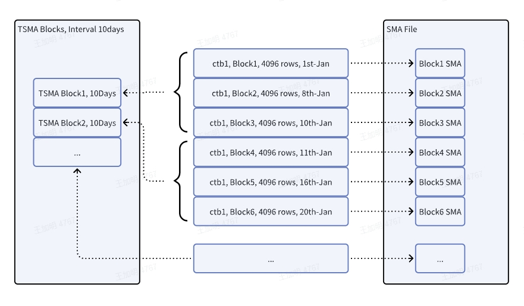

In scenarios with large amounts of data, it is often necessary to query summary results for a certain period. As historical data increases or the time range expands, query time will also increase accordingly. By using materialized aggregation, the calculation results can be stored in advance, allowing subsequent queries to directly read the aggregated results without scanning the original data, such as the SMA (Small Materialized Aggregates) information within the current block.

The SMA information within a block has a small granularity. If the query time range is in days, months, or even years, the number of blocks will be large. Therefore, TSMA (Time-Range Small Materialized Aggregates) supports users to specify a time window for materialized aggregation. By pre-calculating the data within a fixed time window and storing the calculation results, queries can be performed on the pre-calculated results to improve query performance.



## Creating TSMA

```sql
-- Create tsma based on supertables or basic tables
CREATE TSMA tsma_name ON [dbname.]table_name FUNCTION (func_name(func_param) [, ...] ) INTERVAL(time_duration);
-- Create a larger window tsma based on a smaller window tsma
CREATE RECURSIVE TSMA tsma_name ON [db_name.]tsma_name1 INTERVAL(time_duration);

time_duration:
    number unit
```

When creating a TSMA, you need to specify the TSMA name, table name, function list, and window size. When creating a new TSMA based on an existing TSMA, use the `RECURSIVE` keyword but do not specify `FUNCTION()`. The new TSMA will have the same function list as the existing TSMA, and the specified INTERVAL must be at least an integer multiple of the window length of the based TSMA, and cannot be based on 2h or 3h, only 1h, and months can only be based on 1d instead of 2d or 3d.

The naming rules for TSMA are similar to table names, with the maximum length being the table name length limit minus the output table suffix length, where the table name length limit is 193, and the output table suffix is `_tsma_res_stb_`, making the maximum TSMA name length 178.

TSMA can only be created based on supertables and basic tables, not on subtables.

The function list can only include supported aggregate functions (see below), and the function parameters must be a single one, even if the current function supports multiple parameters. Function parameters must be ordinary column names, not tag columns. Identical functions and columns in the function list will be deduplicated, e.g., if two avg(c1) are created simultaneously, only one output will be calculated. TSMA calculation will output all `intermediate results` of functions to another supertable, which also includes all tag columns of the original table. The number of functions in the function list can support up to the maximum number of columns of the table (including tag columns) minus four additional columns used in TSMA calculation, namely `_wstart`, `_wend`, `_wduration`, and a new tag column `tbname`, minus the number of tag columns of the original table. If the number of columns exceeds the limit, a `Too many columns` error will be reported.

Since the TSMA output is a supertable, the row length of the output table is subject to the maximum row length limit. The size of the `intermediate results` of different functions varies, generally larger than the original data size. If the row length of the output table exceeds the maximum row length limit, a `Row length exceeds max length` error will be reported. In this case, reduce the number of functions or group commonly used functions into multiple TSMAs.

The window size limit is [1m ~ 1y/12n]. The units for INTERVAL are the same as those used in the INTERVAL clause in queries, such as a (milliseconds), b (nanoseconds), h (hours), m (minutes), s (seconds), u (microseconds), d (days), w (weeks), n (months), y (years).

TSMA is an object within the library, but its name is globally unique. The total number of TSMAs that can be created within a cluster is limited by the parameter `maxTsmaNum`, with a default value of 10, range: [0-10]. Note, since TSMA background calculation uses stream computing, each TSMA creation will create a stream, thus the number of TSMAs that can be created is also limited by the current number of existing streams and the maximum number of streams that can be created.

## Supported Function List

| Function |  Note |
|---|---|
|min||
|max||
|sum||
|first||
|last||
|avg||
|count| If you want to use count(*), you should create the count(ts) function|
|spread||
|stddev||
|||

## Deleting TSMA

```sql
DROP TSMA [db_name.]tsma_name;
```

If other TSMAs are created based on the TSMA to be deleted, the deletion operation will report an `Invalid drop base tsma, drop recursive tsma first` error. Therefore, all Recursive TSMAs must be deleted first.

## TSMA Calculation

The TSMA calculation results in a supertable in the same library as the original table, which is invisible to the user. It cannot be deleted and is automatically deleted during `DROP TSMA`. TSMA calculation is completed through stream computing, this process is a background asynchronous process, and the TSMA calculation results do not guarantee real-time accuracy, but can ensure ultimate correctness.

When calculating TSMA, if there is no data in the original subtable, the corresponding output subtable may not be created. Therefore, in a count query, even if `countAlwaysReturnValue` is configured, the result of that table will not be returned.

When there is a large amount of historical data, after creating TSMA, stream computing will first calculate the historical data, during which the newly created TSMA will not be used. Data updates, deletions, or expired data will automatically recalculate the affected data. During the recalculation period, the TSMA query results do not guarantee real-time accuracy. If you wish to query real-time data, you can query from the original data by adding the hint `/*+ skip_tsma() */` in SQL or by turning off the parameter `querySmaOptimize`.

## Usage and Limitations of TSMA

Client configuration parameter: `querySmaOptimize`, used to control whether to use TSMA during queries, `True` to use, `False` to not use and query from the original data instead.

Client configuration parameter: `maxTsmaCalcDelay`, in seconds, used to control the acceptable TSMA calculation delay for users. If the TSMA calculation progress is within this range from the latest time, then that TSMA will be used. If it exceeds this range, it will not be used. Default value: 600 (10 minutes), Minimum value: 600 (10 minutes), Maximum value: 86400 (1 day).

Client configuration parameter: `tsmaDataDeleteMark`, in milliseconds, consistent with the stream computing parameter `deleteMark`, used to control the retention time of intermediate results in stream computing. The default value is: 1d, the minimum value is 1h. Therefore, historical data that is older than the configured parameter from the last data will not retain intermediate results in stream computing. Thus, if you modify data within these time windows, the TSMA calculation results will not include the updated results. That is, they will be inconsistent with the results of querying the original data.

### Querying Using TSMA

Agg functions defined in TSMA can be directly used in most query scenarios. If multiple TSMAs are available, the one with the larger window is preferred. Unsealed windows are calculated by querying smaller window TSMAs or the original data. There are also some scenarios where TSMA cannot be used (see below). When unavailable, the entire query will use the original data for calculation.

Queries that do not specify a window size by default prioritize using the largest window TSMA that includes all the query aggregation functions. For example, `SELECT COUNT(*) FROM stable GROUP BY tbname` will use the TSMA that includes count(ts) and has the largest window. Therefore, if aggregate queries are frequently used, it is advisable to create TSMAs with large windows as much as possible.

When specifying window size, i.e., `INTERVAL` statement, use the largest divisible window TSMA. In window queries, the window size of `INTERVAL`, `OFFSET`, and `SLIDING` all affect the usable TSMA window size. A divisible window TSMA is a TSMA window size that can be divided by the `INTERVAL, OFFSET, SLIDING` of the query statement. Therefore, if window queries are used frequently, consider the commonly queried window sizes, as well as the sizes of offset and sliding, to create TSMAs.

Example 1. If creating TSMA window sizes `5m` and `10m`, when querying `INTERVAL(30m)`, the `10m` TSMA will be prioritized. If the query is `INTERVAL(30m, 10m) SLIDING(5m)`, then only the `5m` TSMA can be used for querying.

### Query Limitations

When the parameter `querySmaOptimize` is enabled and there is no `skip_tsma()` hint, the following query scenarios cannot use TSMA:

- When an agg function defined in a TSMA does not cover the current query's function list
- Non-`INTERVAL` windows, or `INTERVAL` query window sizes (including `INTERVAL, SLIDING, OFFSET`) that are not integer multiples of the defined window, e.g., defined window is 2m, query uses a 5-minute window, but if there is a 1m window, it can be used.
- Queries where the `WHERE` condition includes filtering on any ordinary column (non-primary key time column).
- `PARTITION` or `GROUP BY` includes any ordinary column or its expression
- When other faster optimization logic can be used, such as last cache optimization. If conditions meet the last optimization, it will proceed with last optimization first, and if it cannot proceed with last, then it will determine if TSMA optimization can be used.
- When the current TSMA calculation progress delay exceeds the configured parameter `maxTsmaCalcDelay`

Below are some examples:

```sql
SELECT agg_func_list [, pseudo_col_list] FROM stable WHERE exprs [GROUP/PARTITION BY [tbname] [, tag_list]] [HAVING ...] [INTERVAL(time_duration, offset) SLIDING(duration)]...;

-- Creation
CREATE TSMA tsma1 ON stable FUNCTION(COUNT(ts), SUM(c1), SUM(c3), MIN(c1), MIN(c3), AVG(c1)) INTERVAL(1m);
-- Query
SELECT COUNT(*), SUM(c1) + SUM(c3) FROM stable; ---- use tsma1
SELECT COUNT(*), AVG(c1) FROM stable GROUP/PARTITION BY tbname, tag1, tag2;  --- use tsma1
SELECT COUNT(*), MIN(c1) FROM stable INTERVAL(1h);  ---use tsma1
SELECT COUNT(*), MIN(c1), SPREAD(c1) FROM stable INTERVAL(1h); ----- can't use, spread func not defined, although SPREAD can be calculated by MIN and MAX which are defined.
SELECT COUNT(*), MIN(c1) FROM stable INTERVAL(30s); ----- can't use tsma1, time_duration not fit. Normally, query_time_duration should be multiple of create_duration.
SELECT COUNT(*), MIN(c1) FROM stable where c2 > 0; ---- can't use tsma1, can't do c2 filtering
SELECT COUNT(*) FROM stable GROUP BY c2; ---- can't use any tsma
SELECT MIN(c3), MIN(c2) FROM stable INTERVAL(1m); ---- can't use tsma1, c2 is not defined in tsma1.

-- Another tsma2 created with INTERVAL(1h) based on tsma1
CREATE RECURSIVE TSMA tsma2 on tsma1 INTERVAL(1h);
SELECT COUNT(*), SUM(c1) FROM stable; ---- use tsma2
SELECT COUNT(*), AVG(c1) FROM stable GROUP/PARTITION BY tbname, tag1, tag2;  --- use tsma2
SELECT COUNT(*), MIN(c1) FROM stable INTERVAL(2h);  ---use tsma2
SELECT COUNT(*), MIN(c1) FROM stable WHERE ts < '2023-01-01 10:10:10' INTERVAL(30m); --use tsma1
SELECT COUNT(*), MIN(c1) + MIN(c3) FROM stable INTERVAL(30m);  ---use tsma1
SELECT COUNT(*), MIN(c1) FROM stable INTERVAL(1h) SLIDING(30m);  ---use tsma1
SELECT COUNT(*), MIN(c1), SPREAD(c1) FROM stable INTERVAL(1h); ----- can't use tsma1 or tsma2, spread func not defined
SELECT COUNT(*), MIN(c1) FROM stable INTERVAL(30s); ----- can't use tsma1 or tsma2, time_duration not fit. Normally, query_time_duration should be multiple of create_duration.
SELECT COUNT(*), MIN(c1) FROM stable where c2 > 0; ---- can't use tsma1 or tsam2, can't do c2 filtering
```

### Usage Restrictions

After creating a TSMA, there are the following restrictions on operations on the original supertable:

- All TSMAs must be deleted before the table can be deleted.
- All tag columns of the original table cannot be deleted, nor can the tag column names or the tag values of the subtables be modified. TSMAs must be deleted first before deleting a tag column.
- If some columns are used by a TSMA, these columns cannot be deleted. TSMAs must be deleted first. Adding columns is not affected, but newly added columns are not included in any TSMA. Therefore, if you want to compute the new columns, you need to create other TSMAs.

## View TSMA

```sql
SHOW [db_name.]TSMAS;
SELECT * FROM information_schema.ins_tsma;
```

If a large number of functions are specified during creation, and the column names are long, the function list display may be truncated (currently supports a maximum output of 256KB).
