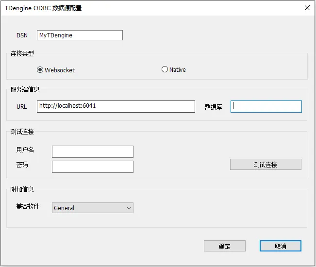
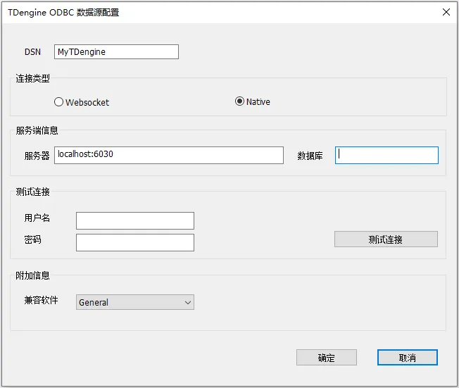

TDengine ODBC is an ODBC driver implemented for TDengine, allowing applications on Windows systems (such as [PowerBI](https://powerbi.microsoft.com/)) to access tables/views in the TDengine database through the ODBC standard interface, whether they are local, remote, or cloud-based.

TDengine ODBC offers two connection methods to the TDengine database: WebSocket (recommended) and Native connections. When using it, different connection methods can be set for the TDengine data source. When accessing cloud services, the WebSocket connection method must be used.

Note: TDengine ODBC supports both 32-bit and 64-bit Windows systems, and calling TDengine ODBC requires using the appropriate bit version of the ODBC driver manager. In a 32-bit Windows system or a 64-bit Windows system running a 32-bit application, only the WebSocket connection method is supported to access the TDengine database.

## ODBC Version Compatibility

- Supports all versions up to ODBC 3.8.

## Installation

1. Only supports the Windows platform. The VC runtime library must be installed on Windows. You can download and install the [VC runtime library](https://learn.microsoft.com/en-us/cpp/windows/latest-supported-vc-redist?view=msvc-170). If you have already installed the VS development tools, you can skip this step.  

2. Install the TDengine Windows client. The version should be 3.2.1.0 or higher, which includes the TDengine ODBC 64-bit driver; for version 3.3.3.0 or higher, it includes the TDengine ODBC 32/64-bit driver.

## Configure Data Source

### Data Source Connection Types and Differences

TDengine ODBC supports two connection methods to the TDengine database: WebSocket connection and Native connection, with the following differences:

1. Cloud services only support using the WebSocket connection method.

2. 32-bit applications only support using the WebSocket connection method.

3. The WebSocket connection has better compatibility and generally does not require upgrading the client library when the TDengine database server is upgraded.

4. Native connections usually offer slightly better performance, but must be consistent with the version of the TDengine database server.

5. For general users, it is recommended to use the **WebSocket** connection method, as the performance difference from Native is minimal and compatibility is better.

### WebSocket Connection

1. Search for and open the **ODBC Data Source (32-bit)** or **ODBC Data Source (64-bit)** management tool from the **Start** menu.

2. Select the **User DSN** tab and click the **Add (D)** button to enter the "Create Data Source" interface.

3. Choose the data source you want to add, here we select **TDengine**.

4. Click Finish to enter the TDengine ODBC data source configuration page and fill in the following necessary information.

    

    4.1 **DSN**: Data Source Name (mandatory), name the newly added ODBC data source.

    4.2 **Connection Type**: (mandatory), select the connection type, here we choose **WebSocket**.

    4.3 **URL**: (mandatory), ODBC data source URL, for example: `http://localhost:6041`, for cloud service the URL example is: `https://gw.cloud.tdengine.com?token=your_token`.

    4.4 **Database**: (optional), the default database to connect to.

    4.5 **Username**: Only for testing the connection in step 5, optional, database username. If not provided, TDengine defaults to root.

    4.6 **Password**: Only for testing the connection in step 5, optional, database user password. If not provided, TDengine defaults to taosdata.

    4.7 **Compatible Software**: Supports compatibility adaptations for industrial software such as KingSCADA, Kepware, etc. Typically, you can choose the default value General.

5. Click **Test Connection** to check the connection status; if successful, a message "Successfully connected to URL" will appear.

6. Click **OK** to save the configuration and exit.

7. You can also select an already configured data source name in step 2 and click the **Configure** button to enter the configuration page to modify the existing configuration.

### Native Connection (Does Not Support Cloud Services and 32-bit Applications)

1. Search for and open the **ODBC Data Source (64-bit)** management tool from the **Start** menu (be sure not to choose ODBC Data Source (32-bit)).

2. Select the **User DSN** tab and click the **Add (D)** button to enter the "Create Data Source" interface.

3. Choose the data source you want to add, here we select **TDengine**.

4. Click Finish to enter the TDengine ODBC data source configuration page and fill in the following necessary information.

    

    4.1 **DSN**: Data Source Name (mandatory), name the newly added ODBC data source.

    4.2 **Connection Type**: (mandatory), select the connection type, here we choose **Native**.

    4.3 **Server**: (mandatory), the ODBC data source server address, for example: `localhost:6030`.

    4.4 **Database**: (optional), the default database to connect to.

    4.5 **Username**: Only for testing the connection in step 5, optional, database username. If not provided, TDengine defaults to root.

    4.6 **Password**: Only for testing the connection in step 5, optional, database user password. If not provided, TDengine defaults to taosdata.

    4.7 **Compatible Software**: Supports compatibility adaptations for industrial software such as KingSCADA, Kepware, etc. Typically, you can choose the default value General.

5. Click **Test Connection** to check the connection status; if successful, a message "Connection successful" will appear.

6. Click **OK** to save the configuration and exit.

7. You can also select an already configured data source name in step 2 and click the **Configure** button to enter the configuration page to modify the existing configuration.

## Supported Platforms

The platform support for the native connection method is consistent with that of the TDengine Windows X64 client driver. In addition to that, the WebSocket connection method also supports the use of 32-bit applications running on Windows X64 systems.

## Version History

| taos_odbc Version | Major Changes                                                                                          | TDengine Version    |
| :---------------- | :----------------------------------------------------------------------------------------------------- | :------------------ |
|      v1.1.0      | 1. Supports view functionality; 2. Supports VARBINARY/GEOMETRY data types;                      | 3.3.3.0 and higher |
|      v1.0.2      | Supports CP1252 character encoding;                                                                     | 3.2.3.0 and higher |
|      v1.0.1      | 1. Supports DSN setting for BI mode, under which TDengine database does not return system database and supertable subtable information; 2. Refactored character set conversion module to improve read/write performance; 3. Changed the default connection method to “WebSocket” in the ODBC data source configuration dialog; 4. Added "Test Connection" control in the ODBC data source configuration dialog; 5. ODBC data source configuration supports Chinese/English interfaces; |         -          |
|    v1.0.0.0      | Released initial version, supports interaction with TDengine database for reading and writing data; see the "API Reference" section for details. | 3.2.2.0 and higher |

## Data Type Mapping

The table below explains how the ODBC connector maps server data types to default SQL and C data types.

| TDengine Type      | SQL Type          | C Type            |
|--------------------|-------------------|-------------------|
| TIMESTAMP          | SQL_TYPE_TIMESTAMP| SQL_C_TIMESTAMP   |
| INT                | SQL_INTEGER       | SQL_C_SLONG       |
| INT UNSIGNED       | SQL_INTEGER       | SQL_C_ULONG       |
| BIGINT             | SQL_BIGINT        | SQL_C_SBIGINT     |
| BIGINT UNSIGNED    | SQL_BIGINT        | SQL_C_UBIGINT     |
| FLOAT              | SQL_REAL          | SQL_C_FLOAT       |
| DOUBLE             | SQL_REAL          | SQL_C_DOUBLE      |
| BINARY             | SQL_BINARY        | SQL_C_BINARY      |
| SMALLINT           | SQL_SMALLINT      | SQL_C_SSHORT      |
| SMALLINT UNSIGNED  | SQL_SMALLINT      | SQL_C_USHORT      |
| TINYINT            | SQL_TINYINT       | SQL_C_STINYINT    |
| TINYINT UNSIGNED   | SQL_TINYINT       | SQL_C_UTINYINT    |
| BOOL               | SQL_BIT           | SQL_C_BIT         |
| NCHAR              | SQL_VARCHAR       | SQL_C_CHAR        |
| JSON               | SQL_VARCHAR       | SQL_C_CHAR        |
| VARCHAR            | SQL_VARCHAR       | SQL_C_CHAR        |
| GEOMETRY           | SQL_VARBINARY     | SQL_C_BINARY      |
| VARBINARY          | SQL_VARBINARY     | SQL_C_BINARY      |

## API Reference

This section categorizes and summarizes the ODBC API functions. For a complete reference of the ODBC API, please visit the [ODBC Programmer's Reference](http://msdn.microsoft.com/en-us/library/ms714177.aspx).

### Data Source and Driver Management

- API: ConfigDSN
  - **Supported**: Yes
  - **Standard**: ODBC
  - **Purpose**: Configure the data source
  
- API: ConfigDriver
  - **Supported**: Yes
  - **Standard**: ODBC
  - **Purpose**: Used to perform installation and configuration tasks related to a specific driver
  
- API: ConfigTranslator
  - **Supported**: Yes
  - **Standard**: ODBC
  - **Purpose**: Used to parse the configuration of DSN, translating or converting between the DSN configuration and the actual database driver configuration

### Connecting to a Data Source

- API: SQLAllocHandle
  - **Supported**: Yes
  - **Standard**: ISO 92
  - **Purpose**: Allocate environment, connection, statement, or descriptor handles

- API: SQLConnect
  - **Supported**: Yes
  - **Standard**: ISO 92
  - **Purpose**: Connect to a specific driver using the data source name, user ID, and password

- API: SQLDriverConnect
  - **Supported**: Yes
  - **Standard**: ODBC
  - **Purpose**: Connect to a specific driver using a connection string, supporting more connection information

- API: SQLBrowseConnect
  - **Supported**: No
  - **Standard**: ODBC
  - **Purpose**: Used to discover and enumerate the features and property values required to connect to the data source. Each call to SQLBrowseConnect returns a successive level of attributes and attribute values.

- API: SQLAllocEnv
  - **Supported**: No
  - **Standard**: Deprecated
  - **Purpose**: In ODBC 3.x, the ODBC 2.x function SQLAllocEnv has been replaced by SQLAllocHandle.

- API: SQLAllocConnect
  - **Supported**: No
  - **Standard**: Deprecated
  - **Purpose**: In ODBC 3.x, the ODBC 2.x function SQLAllocConnect has been replaced by SQLAllocHandle.

### Getting Information About Drivers and Data Sources

- API: SQLDataSources
  - **Supported**: No
  - **Standard**: ISO 92
  - **Purpose**: Returns a list of available data sources, handled by the driver manager.

- API: SQLDrivers
  - **Supported**: No
  - **Standard**: ISO 92
  - **Purpose**: Returns a list of installed drivers processed by the driver manager, along with their attributes.

- API: SQLGetInfo
  - **Supported**: Yes
  - **Standard**: ISO 92
  - **Purpose**: Returns detailed information about the database environment, such as database product name, driver name, SQL syntax characteristics of the database, connection capabilities, etc.

- API: SQLGetFunctions
  - **Supported**: No
  - **Standard**: ISO 92
  - **Purpose**: Used to query functions supported by the driver.

- API: SQLGetTypeInfo
  - **Supported**: Yes
  - **Standard**: ISO 92
  - **Purpose**: Returns information about the supported data types.

### Setting and Retrieving Driver Properties

- API: SQLSetConnectAttr
  - **Supported**: Yes
  - **Standard**: ISO 92
  - **Purpose**: Set connection attributes; when setting the SQL_ATTR_AUTOCOMMIT attribute, it is used to control the auto-commit mode.

- API: SQLGetConnectAttr
  - **Supported**: Yes
  - **Standard**: ISO 92
  - **Purpose**: Returns the value of connection attributes.

- API: SQLSetConnectOption
  - **Supported**: No
  - **Standard**: Deprecated
  - **Purpose**: In ODBC 3.x, the ODBC 2.0 function SQLSetConnectOption has been replaced by SQLSetConnectAttr.

- API: SQLGetConnectOption
  - **Supported**: No
  - **Standard**: Deprecated
  - **Purpose**: In ODBC 3.x, the ODBC 2.0 function SQLGetConnectOption has been replaced by SQLGetConnectAttr.

- API: SQLSetEnvAttr
  - **Supported**: Yes
  - **Standard**: ISO 92
  - **Purpose**: Set attributes that control the environment.

- API: SQLGetEnvAttr
  - **Supported**: Yes
  - **Standard**: ISO 92
  - **Purpose**: Returns the current settings of environment attributes.

- API: SQLSetStmtAttr
  - **Supported**: Yes
  - **Standard**: ISO 92
  - **Purpose**: Set attributes related to statements.

- API: SQLGetStmtAttr
  - **Supported**: Yes
  - **Standard**: ISO 92
  - **Purpose**: Returns the current settings of statement attributes.

- API: SQLSetStmtOption
  - **Supported**: No
  - **Standard**: Deprecated
  - **Purpose**: In ODBC 3.x, the ODBC 2.0 function SQLSetStmtOption has been replaced by SQLSetStmtAttr.

- API: SQLGetStmtOption
  - **Supported**: No
  - **Standard**: Deprecated
  - **Purpose**: In ODBC 3.x, the ODBC 2.0 function SQLGetStmtOption has been replaced by SQLGetStmtAttr.

### Preparing SQL Requests

- API: SQLAllocStmt
  - **Supported**: No
  - **Standard**: Deprecated
  - **Purpose**: In ODBC 3.x, the ODBC 2.x function SQLAllocStmt has been replaced by SQLAllocHandle.

- API: SQLPrepare
  - **Supported**: Yes
  - **Standard**: ISO 92
  - **Purpose**: Used to preprocess SQL statements, which is typically a step before SQLExecute.

- API: SQLBindCol
  - **Supported**: Yes
  - **Standard**: ODBC
  - **Purpose**: Used to bind columns in the result set to application buffers.

- API: SQLBindParameter
  - **Supported**: Yes
  - **Standard**: ODBC
  - **Purpose**: Used to bind parameters of SQL statements to application buffers.

- API: SQLGetCursorName
  - **Supported**: No
  - **Standard**: ISO 92
  - **Purpose**: Returns the cursor name associated with the specified statement.

- API: SQLSetCursorName
  - **Supported**: No
  - **Standard**: ISO 92
  - **Purpose**: Sets the cursor name, allowing named cursors to be used in queries.

- API: SQLSetScrollOptions
  - **Supported**: No
  - **Standard**: ODBC
  - **Purpose**: Sets options that control cursor behavior.

### Submitting Requests

- API: SQLExecute
  - **Supported**: Yes
  - **Standard**: ISO 92
  - **Purpose**: Used to execute the SQL statement that has been prepared using SQLPrepare.

- API: SQLExecDirect
  - **Supported**: Yes
  - **Standard**: ISO 92
  - **Purpose**: Used to execute a string containing an SQL statement.

- API: SQLNativeSql
  - **Supported**: No
  - **Standard**: ODBC
  - **Purpose**: Used to convert SQL statements provided by the application into the native SQL syntax of the database driver.

- API: SQLDescribeParam
  - **Supported**: Yes
  - **Standard**: ODBC
  - **Purpose**: Returns the description of a specific parameter in a statement.

- API: SQLNumParams
  - **Supported**: Yes
  - **Standard**: ISO 92
  - **Purpose**: Used to query the number of parameters in a prepared SQL statement.

- API: SQLParamData
  - **Supported**: No
  - **Standard**: ISO 92
  - **Purpose**: Used to retrieve the next parameter value from a parameter data stream.

- API: SQLPutData
  - **Supported**: No
  - **Standard**: ISO 92
  - **Purpose**: When using stream input, can be used to send data blocks to output parameters.

### Retrieving Results and Information About Results

- API: SQLRowCount
  - **Supported**: Yes
  - **Standard**: ISO 92
  - **Purpose**: Returns the number of rows affected by insert or delete requests.

- API: SQLNumResultCols
  - **Supported**: Yes
  - **Standard**: ISO 92
  - **Purpose**: Returns the number of columns in the result set.

- API: SQLDescribeCol
  - **Supported**: Yes
  - **Standard**: ISO 92
  - **Purpose**: Used to describe the attributes of columns in the result set. It provides information about the data type of the column, column name, maximum width of the column, decimal places, and whether it can be null.

- API: SQLColAttribute
  - **Supported**: Yes
  - **Standard**: ISO 92
  - **Purpose**: Returns descriptor information for columns in the result set, such as title, collation, etc.

- API: SQLColAttributes
  - **Supported**: No
  - **Standard**: Deprecated
  - **Purpose**: In ODBC 3.x, the ODBC 2.0 function SQLColAttributes has been replaced by SQLColAttribute.

- API: SQLGetData
  - **Supported**: Yes
  - **Standard**: ODBC
  - **Purpose**: Used to retrieve specific column data from the current row in the result set.

- API: SQLMoreResults
  - **Supported**: Yes
  - **Standard**: ODBC
  - **Purpose**: After executing an SQL statement that produces multiple result sets (e.g., a batch or stored procedure), moves to the next result set.

- API: SQLFetch
  - **Supported**: Yes
  - **Standard**: ISO 92
  - **Purpose**: Used to extract the next row of data from the result set and returns all bound column data.

- API: SQLFetchScroll
  - **Supported**: Yes
  - **Standard**: ISO 92
  - **Purpose**: Used to extract specified rows from the result set and returns all bound column data.

- API: SQLExtendedFetch
  - **Supported**: No
  - **Standard**: Deprecated
  - **Purpose**: In ODBC 3.x, SQLExtendedFetch has been replaced by SQLFetchScroll.

- API: SQLSetPos
  - **Supported**: Yes
  - **Standard**: ODBC
  - **Purpose**: Sets the cursor position in the row set and allows the application to update rows in the data set.

### Retrieving Error or Diagnostic Information

- API: SQLError
  - **Supported**: No
  - **Standard**: Deprecated
  - **Purpose**: In ODBC 3.x, the ODBC 2.x function SQLError has been replaced by SQLGetDiagRec.

- API: SQLGetDiagField
  - **Supported**: Yes
  - **Standard**: ISO 92
  - **Purpose**: Returns additional diagnostic information (a single diagnostic record).

- API: SQLGetDiagRec
  - **Supported**: Yes
  - **Standard**: ISO 92
  - **Purpose**: Returns additional diagnostic information (multiple diagnostic records).

### Getting Information About System Table Items for Data Sources

- API: SQLColumnPrivileges
  - **Supported**: No
  - **Standard**: ODBC
  - **Purpose**: Used to retrieve permission information for columns in a specified table, such as which users or roles have read, insert, update, or delete permissions on specific columns.

- API: SQLColumns
  - **Supported**: Yes
  - **Standard**: X/Open
  - **Purpose**: Returns a list of column names in the specified table.

- API: SQLForeignKeys
  - **Supported**: No
  - **Standard**: ODBC
  - **Purpose**: Retrieves detailed information about foreign key relationships.

- API: SQLPrimaryKeys
  - **Supported**: Yes
  - **Standard**: ODBC
  - **Purpose**: Returns a list of column names that make up the primary key of the table.

- API: SQLSpecialColumns
  - **Supported**: No
  - **Standard**: X/Open
  - **Purpose**: Returns information about special columns in the database, such as unique keys or index columns.

- API: SQLStatistics
  - **Supported**: No
  - **Standard**: ISO 92
  - **Purpose**: Returns statistical information about the table, such as the number of rows, number of columns, average row width, etc.

- API: SQLTablePrivileges
  - **Supported**: No
  - **Standard**: ODBC
  - **Purpose**: Returns the permissions that a user has on a specific table, such as SELECT, INSERT, UPDATE, etc.

- API: SQLTables
  - **Supported**: Yes
  - **Standard**: X/Open
  - **Purpose**: Returns information about the tables stored in the current database of the data source.

- API: SQLProcedures
  - **Supported**: No
  - **Standard**: ODBC
  - **Purpose**: Returns information about the available stored procedures in the database, including their names and types.

- API: SQLProcedureColumns
  - **Supported**: No
  - **Standard**: ODBC
  - **Purpose**: Returns information about the columns in a stored procedure, including details about input and output parameters.

### Executing Transactions

- API: SQLTransact
  - **Supported**: No
  - **Standard**: Deprecated
  - **Purpose**: In ODBC 3.x, the ODBC 2.x function SQLTransact has been replaced by SQLEndTran.

- API: SQLEndTran
  - **Supported**: Yes
  - **Standard**: ISO 92
  - **Purpose**: Used to commit or roll back transactions; TDengine does not support transactions, thus rollbacks are not supported.

### Terminating Connections

- API: SQLDisconnect
  - **Supported**: Yes
  - **Standard**: ISO 92
  - **Purpose**: Disconnect from the database.

- API: SQLFreeHandle
  - **Supported**: Yes
  - **Standard**: ISO 92
  - **Purpose**: Free resources associated with a specific environment, connection, statement, or descriptor handle.

- API: SQLFreeConnect
  - **Supported**: No
  - **Standard**: Deprecated
  - **Purpose**: In ODBC 3.x, the ODBC 2.0 function SQLFreeConnect has been replaced by SQLFreeHandle.

- API: SQLFreeEnv
  - **Supported**: No
  - **Standard**: Deprecated
  - **Purpose**: In ODBC 3.x, the ODBC 2.0 function SQLFreeEnv has been replaced by SQLFreeHandle.

- API: SQLFreeStmt
  - **Supported**: Yes
  - **Standard**: ODBC
  - **Purpose**: End statement processing, discard pending results, and optionally free all resources associated with the statement handle.

- API: SQLCloseCursor
  - **Supported**: Yes
  - **Standard**: ODBC
  - **Purpose**: Close the cursor associated with the current statement handle and free all resources used by the cursor.

## Integration with Third Parties

As an example of using the TDengine ODBC driver, you can analyze time-series data with Power BI. For more details, please refer to [Power BI](../../../third-party-tools/analytics/power-bi/).
