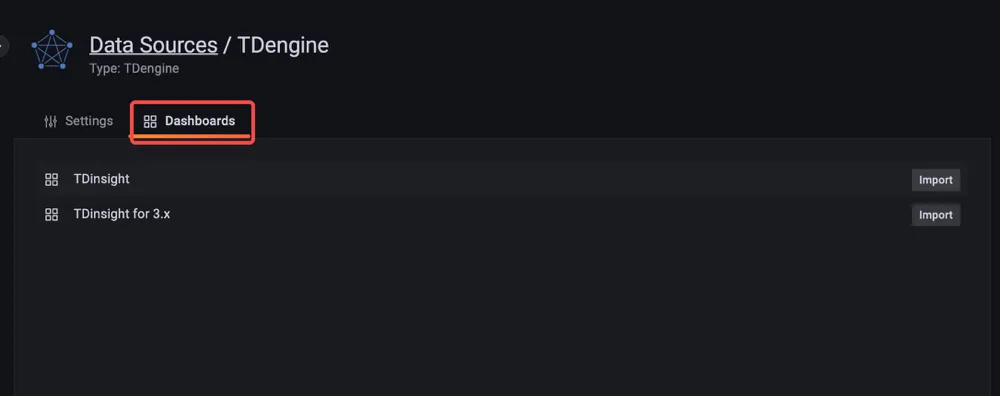
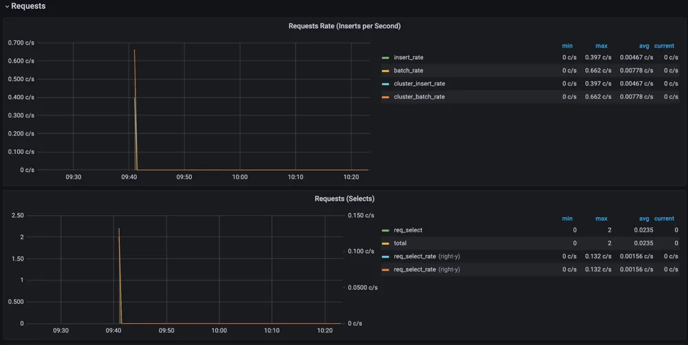
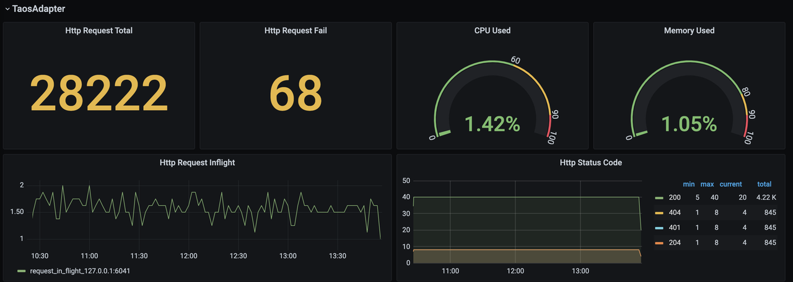

TDinsight is a solution for monitoring TDengine using the builtin native monitoring database and [Grafana].

After TDengine starts, it automatically writes many metrics in specific intervals into a designated database. The metrics may include the server's CPU, memory, hard disk space, network bandwidth, number of requests, disk read/write speed, slow queries, other information like important system operations (user login, database creation, database deletion, etc.), and error alarms. With [Grafana] and [TDengine Data Source Plugin](https://github.com/taosdata/grafanaplugin/releases), TDinsight can visualize cluster status, node information, insertion and query requests, resource usage, vnode, dnode, and mnode status, exception alerts and many other metrics. This is very convenient for developers who want to monitor TDengine cluster status in real-time. This article will guide users to install the Grafana server, automatically install the TDengine data source plug-in, and deploy the TDinsight visualization panel using the `TDinsight.sh` installation script.

## System Requirements

To deploy TDinsight, we need
- a single-node TDengine server or a multi-node TDengine cluster and a [Grafana] server are required. This dashboard requires TDengine 3.0.1.0 and above, with the monitoring feature enabled. For detailed configuration, please refer to [TDengine monitoring configuration](../config/#monitoring-parameters).
- taosAdapter has been installed and running, please refer to [taosAdapter](../taosadapter).
- taosKeeper has been installed and running, please note the monitor-related items in taos.cfg file need be configured. Refer to [taosKeeper](../taosKeeper) for details.

Please record
- The endpoint of taosAdapter REST service, for example `http://tdengine.local:6041`
- Authentication of taosAdapter, e.g. user name and password
- The database name used by taosKeeper to store monitoring data

## Installing Grafana

We recommend using the latest [Grafana] version 8 or 9 here. You can install Grafana on any [supported operating system](https://grafana.com/docs/grafana/latest/installation/requirements/#supported-operating-systems) by following the [official Grafana documentation Instructions](https://grafana.com/docs/grafana/latest/installation/) to install [Grafana].

### Installing Grafana on Debian or Ubuntu

For Debian or Ubuntu operating systems, we recommend the Grafana image repository and using the following command to install from scratch.

```bash
sudo apt-get install -y apt-transport-https
sudo apt-get install -y software-properties-common wget
wget -q -O - https://packages.grafana.com/gpg.key |\
  sudo apt-key add -
echo "deb https://packages.grafana.com/oss/deb stable main" |\
  sudo tee -a /etc/apt/sources.list.d/grafana.list
sudo apt-get update
sudo apt-get install grafana
```

### Install Grafana on CentOS / RHEL

You can install it from its official YUM repository.

```bash
sudo tee /etc/yum.repos.d/grafana.repo << EOF
[grafana]
name=grafana
baseurl=https://packages.grafana.com/oss/rpm
repo_gpgcheck=1
enabled=1
gpgcheck=1
gpgkey=https://packages.grafana.com/gpg.key
sslverify=1
sslcacert=/etc/pki/tls/certs/ca-bundle.crt
EOF
sudo yum install grafana
```

Or install it with RPM package.

```bash
wget https://dl.grafana.com/oss/release/grafana-7.5.11-1.x86_64.rpm
sudo yum install grafana-7.5.11-1.x86_64.rpm
# or
sudo yum install \
  https://dl.grafana.com/oss/release/grafana-7.5.11-1.x86_64.rpm
```

## Automated deployment of TDinsight

We provide an installation script [`TDinsight.sh`](https://github.com/taosdata/grafanaplugin/releases/latest/download/TDinsight.sh) to allow users to configure the installation automatically and quickly.

You can download the script via `wget` or other tools:

```bash
wget https://github.com/taosdata/grafanaplugin/releases/latest/download/TDinsight.sh
chmod +x TDinsight.sh
./TDinsight.sh
```

This script will automatically download the latest [Grafana TDengine data source plugin](https://github.com/taosdata/grafanaplugin/releases/latest) and [TDinsight dashboard](https://github.com/taosdata/grafanaplugin/blob/master/dashboards/TDinsightV3.json) with configurable parameters for command-line options to the [Grafana Provisioning](https://grafana.com/docs/grafana/latest/administration/provisioning/) configuration file to automate deployment and updates, etc.

Assume you use TDengine and Grafana's default services on the same host. Run `. /TDinsight.sh` and open the Grafana browser window to see the TDinsight dashboard.

The following is a description of TDinsight.sh usage.

```text
Usage:
   ./TDinsight.sh
   ./TDinsight.sh -h|--help
   ./TDinsight.sh -n <ds-name> -a <api-url> -u <user> -p <password>

Install and configure TDinsight dashboard in Grafana on Ubuntu 18.04/20.04 system.

-h, -help,          --help                  Display help

-V, -verbose,       --verbose               Run script in verbose mode. Will print out each step of execution.

-v, --plugin-version <version>              TDengine datasource plugin version, [default: latest]

-P, --grafana-provisioning-dir <dir>        Grafana provisioning directory, [default: /etc/grafana/provisioning/]
-G, --grafana-plugins-dir <dir>             Grafana plugins directory, [default: /var/lib/grafana/plugins]
-O, --grafana-org-id <number>               Grafana organization id. [default: 1]

-n, --tdengine-ds-name <string>             TDengine datasource name, no space. [default: TDengine]
-a, --tdengine-api <url>                    TDengine REST API endpoint. [default: http://127.0.0.1:6041]
-u, --tdengine-user <string>                TDengine user name. [default: root]
-p, --tdengine-password <string>            TDengine password. [default: taosdata]

-i, --tdinsight-uid <string>                Replace with a non-space ASCII code as the dashboard id. [default: tdinsight]
-t, --tdinsight-title <string>              Dashboard title. [default: TDinsight]
-e, --tdinsight-editable                    If the provisioning dashboard could be editable. [default: false]
```

Most command-line options can take effect the same as environment variables.

| Short Options | Long Options | Environment Variables | Description |
| ------ | -------------------------- | ---------------------------- | ------------------------------------------------------------------ --------- |
| -v | --plugin-version | TDENGINE_PLUGIN_VERSION | The TDengine data source plugin version, the latest version is used by default.                                   | -P
| -P | --grafana-provisioning-dir | GF_PROVISIONING_DIR | The Grafana configuration directory, defaults to `/etc/grafana/provisioning/` |
| -G | --grafana-plugins-dir | GF_PLUGINS_DIR | The Grafana plugin directory, defaults to `/var/lib/grafana/plugins`.                        | -O
| -O | --grafana-org-id | GF_ORG_ID | The Grafana organization ID, default is 1. |
| -n | --tdengine-ds-name | TDENGINE_DS_NAME | The name of the TDengine data source, defaults to TDengine. | -a | --tdengine-ds-name | The name of the TDengine data source, defaults to TDengine.
| -a | --tdengine-api | TDENGINE_API | The TDengine REST API endpoint. Defaults to `http://127.0.0.1:6041`.                     | -u
| -u | --tdengine-user | TDENGINE_USER | TDengine username. [default: root] |
| -p | --tdengine-password | TDENGINE_PASSWORD | TDengine password. [default: tadosdata] | -i | --tdengine-password
| -i | --tdinsight-uid | TDINSIGHT_DASHBOARD_UID | TDinsight `uid` of the dashboard. [default: tdinsight] |
| -t | --tdinsight-title | TDINSIGHT_DASHBOARD_TITLE | TDinsight dashboard title. [Default: TDinsight] | -e | -tdinsight-title
| -e | --tdinsight-editable | TDINSIGHT_DASHBOARD_EDITABLE | If the dashboard is configured to be editable. [Default: false] | -e | --external

:::note
The `-E` option is deprecated. We use Grafana unified alerting function instead.
:::

Suppose you start a TDengine database on host `tdengine` with HTTP API port `6041`, user `root1`, and password `pass5ord`. Execute the script.

```bash
sudo . /TDinsight.sh -a http://tdengine:6041 -u root1 -p pass5ord
```

If you want to monitor multiple TDengine clusters, you need to set up numerous TDinsight dashboards. Setting up non-default TDinsight requires some changes: the `-n` `-i` `-t` options need to be changed to non-default names, and `-N` and `-L` should also be changed if using the built-in SMS alerting feature.

```bash
sudo . /TDengine.sh -n TDengine-Env1 -a http://another:6041 -u root -p taosdata -i tdinsight-env1 -t 'TDinsight Env1'
```

Please note that the configuration data source, notification channel, and dashboard are not changeable on the front end. You should update the configuration again via this script or manually change the configuration file in the `/etc/grafana/provisioning` directory (this is the default directory for Grafana, use the `-P` option to change it as needed).

Specifically, `-O` can be used to set the organization ID when you are using Grafana Cloud or another organization. `-G` specifies the Grafana plugin installation directory. The `-e` parameter sets the dashboard to be editable.

## Set up TDinsight manually

### Install the TDengine data source plugin

Install the latest version of the TDengine Data Source plugin from GitHub.

```bash
get_latest_release() {
  curl --silent "https://api.github.com/repos/taosdata/grafanaplugin/releases/latest" |
    grep '"tag_name":' |
    sed -E 's/.*"v([^"]+)".*/\1/'
}
TDENGINE_PLUGIN_VERSION=$(get_latest_release)
sudo grafana-cli \
  --pluginUrl https://github.com/taosdata/grafanaplugin/releases/download/v$TDENGINE_PLUGIN_VERSION/tdengine-datasource-$TDENGINE_PLUGIN_VERSION.zip \
  plugins install tdengine-datasource
```

:::note
The 3.1.6 and earlier version plugins require the following setting in the configuration file `/etc/grafana/grafana.ini` to enable unsigned plugins.

```ini
[plugins]
allow_loading_unsigned_plugins = tdengine-datasource
```
:::

### Start the Grafana service

```bash
sudo systemctl start grafana-server
sudo systemctl enable grafana-server
```

### Logging into Grafana

Open the default Grafana URL in a web browser: ``http://localhost:3000``.
The default username/password is `admin`. Grafana will require a password change after the first login.

### Adding a TDengine Data Source

Point to the **Configurations** -> **Data Sources** menu, and click the **Add data source** button.


Search for and select **TDengine**.


Configure the TDengine datasource.


Save and test. It will report 'TDengine Data source is working' under normal circumstances.


### Importing dashboards

In the page of configuring data source, click **Dashboards** tab.



Choose `TDengine for 3.x` and click `import`.

After the importing is done, `TDinsight for 3.x` dashboard is available on the page of `search dashboards by name`.


In the `TDinsight for 3.x` dashboard, choose the database used by taosKeeper to store monitoring data, you can see the monitoring result.


## TDinsight dashboard details

The TDinsight dashboard is designed to provide the usage and status of TDengine-related resources, e.g. dnodes, mnodes, vnodes and databases.

Details of the metrics are as follows.

### Cluster Status


This section contains the current information and status of the cluster, the alert information is also here (from left to right, top to bottom).

- **First EP**: the `firstEp` setting in the current TDengine cluster.
- **Version**: TDengine server version (leader mnode).
- **Leader Uptime**: The time elapsed since the current Leader MNode was elected as Leader.
- **Expire Time** - Enterprise version expiration time.
- **Used Measuring Points** - The number of measuring points used by the Enterprise Edition.
- **Databases** - The number of databases.
- **Connections** - The number of current connections.
- **DNodes/MNodes/VGroups/VNodes** - Total number of each resource and the number of survivors.
- **DNodes/MNodes/VGroups/VNodes Alive Percent**: The ratio of the number of alive/total for each resource, enabling the alert rule and triggering it when the resource liveness rate (the average percentage of healthy resources in 1 minute) is less than 100%.
- **Measuring Points Used**: The number of measuring points used to enable the alert rule (no data available in the community version, healthy by default).
- **Grants Expire Time**: the expiration time of the enterprise version of the enabled alert rule (no data available for the community version, healthy by default).
- **Error Rate**: Aggregate error rate (average number of errors per second) for alert-enabled clusters.

### DNodes Status


- **DNodes Status**: simple table view of `show dnodes`.
- **DNodes Lifetime**: the time elapsed since the dnode was created.
- **DNodes Number**: the number of DNodes changes.

### MNode Overview


1. **MNodes Status**: a simple table view of `show mnodes`.
2. **MNodes Number**: similar to `DNodes Number`, the number of MNodes changes.

### Request



1. **Requests Rate(Inserts per Second)**: average number of inserts per second.
2. **Requests (Selects)**: number of query requests and change rate (count of second).

### Database


Database usage, repeated for each value of the variable `$database` i.e. multiple rows per database.

1. **STables**: number of super tables.
2. **Total Tables**: number of all tables.
3. **Tables**: number of normal tables.
4. **Table number for each vgroup**: number of tables per vgroup.

### DNode Resource Usage


Data node resource usage display with repeated multiple rows for the variable `$fqdn` i.e., each data node. Includes.

1. **Uptime**: the time elapsed since the dnode was created.
2. **Has MNodes?**: whether the current dnode is a mnode.
3. **CPU Cores**: the number of CPU cores.
4. **VNodes Number**: the number of VNodes in the current dnode.
5. **VNodes Masters**: the number of vnodes in the leader role.
6. **Current CPU Usage of taosd**: CPU usage rate of taosd processes.
7. **Current Memory Usage of taosd**: memory usage of taosd processes.
8. **Disk Used**: The total disk usage percentage of the taosd data directory.
9. **CPU Usage**: Process and system CPU usage.
10. **RAM Usage**: Time series view of RAM usage metrics.
11. **Disk Used**: Disks used at each level of multi-level storage (default is level0).
12. **Disk Increasing Rate per Minute**: Percentage increase or decrease in disk usage per minute.
13. **Disk IO**: Disk IO rate.
14. **Net IO**: Network IO, the aggregate network IO rate in addition to the local network.

### Login History


Currently, only the number of logins per minute is reported.

### Monitoring taosAdapter



Support monitoring taosAdapter request statistics and status details. Includes.

1. **Http Request Total**: number of total requests.
2. **Http Request Fail**: number of failed requests.
3. **CPU Used**: CPU usage of taosAdapter.
4. **Memory Used**: Memory usage of taosAdapter.
5. **Http Request Inflight**: number of real-time requests.
6. **Http Status Code**: taosAdapter http status code.

## Upgrade

TDinsight installed via the `TDinsight.sh` script can be upgraded to the latest Grafana plugin and TDinsight Dashboard by re-running the script.

In the case of a manual installation, follow the steps above to install the new Grafana plugin and Dashboard yourself.

## Uninstall

TDinsight installed via the `TDinsight.sh` script can be cleaned up using the command line `TDinsight.sh -R` to clean up the associated resources.

To completely uninstall TDinsight during a manual installation, you need to clean up the following.

1. the TDinsight Dashboard in Grafana.
2. the Data Source in Grafana.
3. remove the `tdengine-datasource` plugin from the plugin installation directory.

## Integrated Docker Example

```bash
git clone --depth 1 https://github.com/taosdata/grafanaplugin.git
cd grafanaplugin
```

Change as needed in the ``docker-compose.yml`` file to

```yaml
version: '3.7'

services:
  grafana:
    image: grafana/grafana:7.5.10
    volumes:
      - . /dist:/var/lib/grafana/plugins/tdengine-datasource
      - . /grafana/grafana.ini:/etc/grafana/grafana.ini
      - . /grafana/provisioning/:/etc/grafana/provisioning/
      - grafana-data:/var/lib/grafana
    environment:
      TDENGINE_API: ${TDENGINE_API}
      TDENGINE_USER: ${TDENGINE_USER}
      TDENGINE_PASS: ${TDENGINE_PASS}
    ports:
      - 3000:3000
volumes:
  grafana-data:
```

Replace the environment variables in `docker-compose.yml` or save the environment variables to the `.env` file, then start Grafana with `docker-compose up`. See [Docker Compose Reference](https://docs.docker.com/compose/)

```bash
docker-compose up -d
```

Then the TDinsight was deployed via Provisioning. Go to http://localhost:3000/d/tdinsight/ to view the dashboard.

[grafana]: https://grafana.com
[tdengine]: https://tdengine.com
