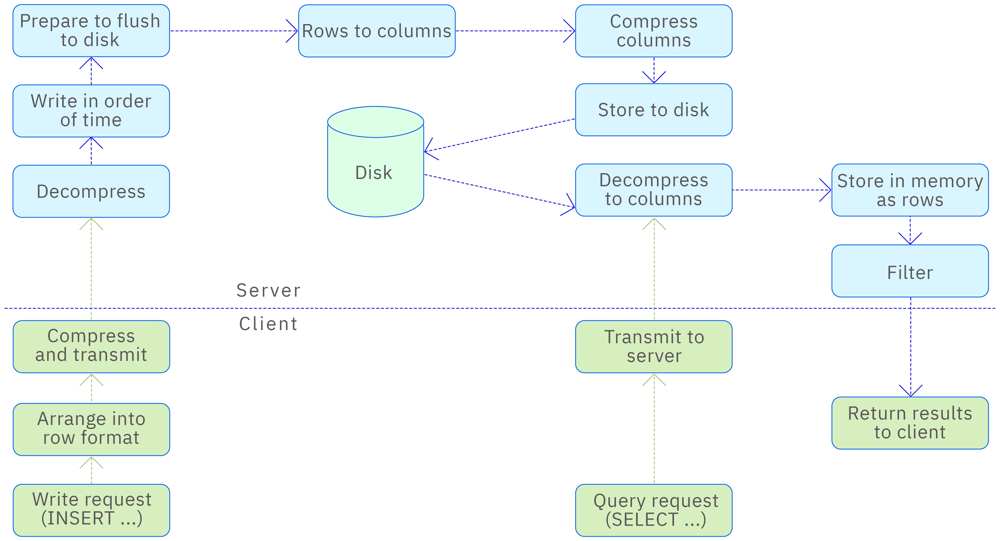

Data compression is a technology that reorganizes and processes data using specific algorithms without losing effective information, aiming to reduce the storage space occupied by data and improve data transmission efficiency. TDengine employs this technology in both the storage and transmission processes to optimize the use of storage resources and accelerate data exchange.

## Storage Compression

TDengine adopts columnar storage technology in its storage architecture, meaning that data is stored continuously by column in the storage medium. This is different from traditional row-based storage, where data is stored continuously by row in the storage medium. Columnar storage, combined with the characteristics of time-series data, is particularly suitable for handling steadily changing time-series data.

To further improve storage efficiency, TDengine uses differential encoding technology. This technique stores data by calculating the difference between adjacent data points, rather than storing the raw values, thereby significantly reducing the amount of information needed for storage. After differential encoding, TDengine also uses general compression techniques to further compress the data, achieving a higher compression rate.

For stable time-series data collected by devices, TDengine's compression effect is particularly significant, with compression rates typically within 10%, and even higher in some cases. This efficient compression technology saves users a significant amount of storage costs while also improving the efficiency of data storage and access.

### Primary Compression

After time-series data is collected from devices, following TDengine's data modeling rules, each collection device is constructed as a subtable. Thus, all time-series data generated by a device is recorded in the same subtable. During the data storage process, data is stored in blocks, each block containing data from only one subtable. Compression is also performed on a block basis, compressing each column of data in the subtable separately, and the compressed data is still stored on the disk by block.

The stability of time-series data is one of its main characteristics, such as collected atmospheric temperature, water temperature, etc., which usually fluctuate within a certain range. Using this characteristic, data can be re-encoded, and different encoding techniques can be adopted according to different data types to achieve the highest compression efficiency. The following introduces the compression methods for various data types.

- Timestamp type: Since the timestamp column usually records the moments of continuous data collection by devices, and the collection frequency is fixed, it is only necessary to record the difference between adjacent time points. Since the difference is usually small, this method saves more storage space than storing the original timestamps directly.
- Boolean type: A boolean value is represented by one bit, and one byte can store 8 boolean values. Through compact encoding, storage space can be significantly reduced.
- Numeric type: Numeric data produced by IoT devices, such as temperature, humidity, air pressure, vehicle speed, fuel consumption, etc., are usually not large and fluctuate within a certain range. For this type of data, zigzag encoding technology is uniformly used. This technology maps signed integers to unsigned integers, moving the highest bit of the integer's complement to the low position, inverting all bits other than the sign bit for negative numbers, and keeping positive numbers unchanged. This concentrates the effective data bits and increases the number of leading zeros, thereby obtaining better compression effects in subsequent compression steps.
- Floating-point type: For the two types of floating-point numbers, float and double, the delta-delta encoding method is used.
- String type: String type data uses dictionary compression algorithm, which replaces frequently occurring long strings in the original string with short identifiers, thereby reducing the length of stored information.

### Secondary Compression

After completing the specialized compression for specific data types, TDengine further uses general compression techniques to compress the data as undifferentiated binary data for a second time. Compared to primary compression, the focus of secondary compression is on eliminating information redundancy between data blocks. This dual compression technique, focusing on local data simplification on one hand and overall data overlap elimination on the other, works together to achieve the ultra-high compression rate in TDengine.

TDengine supports multiple compression algorithms, including LZ4, ZLIB, ZSTD, XZ, etc. Users can flexibly balance between compression rate and write speed according to specific application scenarios and needs, choosing the most suitable compression scheme.

#### Using Hardware-Accelerated Secondary Compression Libraries (Optional)

Secondary compression is linked by default to the static zlib/zstd/lz4 bundled with TDengine. If the deployment environment provides ABI-compatible hardware-accelerated replacements (for example, Intel QAT/IAA-accelerated zlib, ISA-L's libz, or SVE-optimized zstd on ARM), taosd can load those replacements into the secondary-compression dispatch table at startup and accelerate compression without changing any SQL. If a replacement is unavailable, TDengine automatically falls back to the bundled static implementation.

This capability is available only on Linux and only when TDengine is built with `BUILD_WITH_ACCEL_COMPRESS` explicitly enabled:

```bash
# Build
mkdir build && cd build
cmake -DBUILD_WITH_ACCEL_COMPRESS=ON ..
make -j$(nproc)
```

At startup, use environment variables to tell taosd where to load the replacement libraries:

| Environment variable | Value | Description |
|---|---|---|
| `TAOS_COMPRESS_ACCEL` | Directory path / unset | When set to a directory, libraries are loaded by convention from `<dir>/libz.so`, `<dir>/libzstd.so`, and `<dir>/liblz4.so`. When unset (or set to empty), the built-in implementations are used. |
| `TAOS_COMPRESS_ACCEL_ZLIB` | Full path to a `.so` | Overrides the zlib path and takes precedence over `TAOS_COMPRESS_ACCEL`. |
| `TAOS_COMPRESS_ACCEL_ZSTD` | Full path to a `.so` | Same as above, for zstd. |
| `TAOS_COMPRESS_ACCEL_LZ4` | Full path to a `.so` | Same as above, for lz4. |

**Symbol contract**: A replacement library must export the same public symbols as upstream. TDengine resolves them with `dlsym` at startup:

- libz: `compress2`, `uncompress`
- libzstd: `ZSTD_compress`, `ZSTD_decompress`
- liblz4: `LZ4_compress_default`, `LZ4_decompress_safe`

The ABI must match upstream (parameter order and return-value semantics). Most hardware-accelerated builds are drop-in replacements, so no extra work is required.

**Failure fallback**: If any step fails (environment variable unset, file missing, `dlopen` failure, or a missing symbol), taosd startup is not interrupted. That codec continues to use the bundled static implementation, and a log line `UTL WARN  accel <codec>: ...` is written.

**Confirm a successful load**: The taosd startup log includes lines similar to:

```text
UTL INFO  accel zlib: loaded from /opt/qat-zlib/libz.so, L2_ZLIB dispatch patched
UTL INFO  accel zstd: loaded from /opt/qat-zlib/libzstd.so, L2_ZSTD dispatch patched
```

If no environment variables are set, you will see:

```text
UTL INFO  accel compression: TAOS_COMPRESS_ACCEL{,_ZLIB,_ZSTD,_LZ4} unset; using stock L2 implementations
```

**Measure the speedup**: Building with `BUILD_TOOLS=ON` also produces `compressBench`, which micro-benchmarks the secondary-compression dispatch table directly (bypassing SQL, the network, and WAL so the numbers reflect compression only):

```bash
# Stock baseline (do not set TAOS_COMPRESS_ACCEL)
./build/bin/compressBench --codec all --size 1 --iters 30 --warmup 5 \
    --shape mixed --label stock --csv result.csv

# Switch to the accelerated libraries and run again to compare throughput for the same codec
export TAOS_COMPRESS_ACCEL=/opt/qat-zlib
./build/bin/compressBench --codec all --size 1 --iters 30 --warmup 5 \
    --shape mixed --label accel --csv result.csv
```

The output reports mean / p50 / p95 / stdev, MB/s throughput, and compression ratio for each codec, and tags each line with `backend=stock|accel` for comparison. `--shape` provides four data patterns — `random / repeating / sequential / mixed` — so you can evaluate high-entropy, low-entropy, monotonic-timestamp, and mixed workloads separately. `--size` accepts values such as 0.004 (4 KiB), 0.0625 (64 KiB), and 1 (1 MiB), covering typical column-block sizes. Run at least 30 measurement iterations plus 5 warmup iterations, and repeat twice during different idle periods to exclude transient noise.

**Notes**:

- The replacement library is `dlopen`ed once and stays loaded for the entire taosd lifetime, so do not replace or delete the file on disk while taosd is running.
- If the replacement library itself depends on other shared libraries (for example, a QAT user-space driver), those libraries must also be discoverable by `dlopen`. Standard mechanisms (`/etc/ld.so.conf.d/`, `LD_LIBRARY_PATH`) all apply.
- TSZ (lossy floating-point compression) and XZ are not switchable: the former is a TDengine-internal implementation, and the latter uses fast-lzma2 rather than mainstream xz, so there is no common drop-in accelerated counterpart.

### Lossy Compression

TDengine engine provides two modes for floating-point type data: lossless compression and lossy compression. The precision of floating-point numbers is usually determined by the number of digits after the decimal point. In some cases, the precision of floating-point numbers collected by devices is high, but the precision of interest in actual applications is low. In such cases, using lossy compression can effectively save storage space. TDengine's lossy compression algorithm is based on a prediction model, the core idea of which is to use the trend of previous data points to predict the trend of subsequent data points. This algorithm can significantly improve the compression rate, and its compression effect far exceeds that of lossless compression. The name of the lossy compression algorithm is TSZ.

## Transmission Compression

TDengine provides compression functionality during data transmission to reduce network bandwidth consumption. When using native connections to transmit data from the client (such as taosc) to the server, compression transmission can be configured to save bandwidth. In the configuration file taos.cfg, the compressMsgSize option can be set to achieve this goal. The configurable values are as follows:

- 0: Indicates that compression transmission is disabled.
- 1: Indicates that compression transmission is enabled, but only for data packets larger than 1KB.
- 2: Indicates that compression transmission is enabled for all data packets.

When using RESTful and WebSocket connections to communicate with taosAdapter, taosAdapter supports industry-standard compression protocols, allowing the connecting end to enable or disable compression during the transmission process according to industry-standard protocols. Here are the specific implementation methods:

- RESTful interface using compression: The client specifies Accept-Encoding in the HTTP request header to inform the server of the acceptable compression types, such as gzip, deflate, etc. When returning results, the server will specify the compression algorithm used in the Content-Encoding header and return the compressed data.
- WebSocket interface using compression: Refer to the WebSocket protocol standard document RFC7692 to understand how to implement compression in WebSocket connections.
- Data backup migration tool taosX and taosX Agent communication can also enable compression transmission. In the agent.toml configuration file, setting the compression switch option compression=true will enable the compression function.

## Compression Process

The diagram below shows the compression and decompression process of the TDengine engine in the entire transmission and storage process of time-series data, to better understand the entire handling process.


