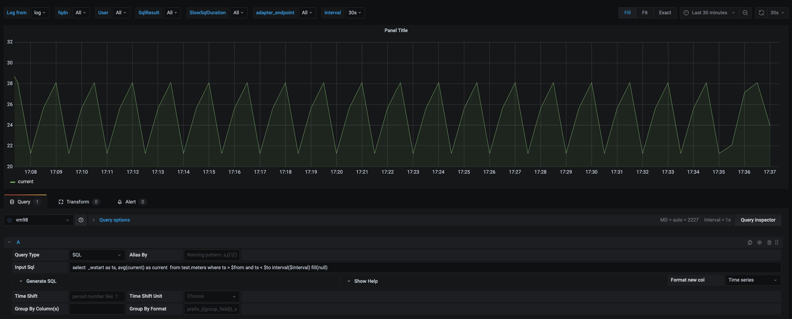

import Tabs from "@theme/Tabs";
import TabItem from "@theme/TabItem";

TDengine can be quickly integrated with the open-source data visualization system [Grafana](https://www.grafana.com/) to build a data monitoring and alerting system. The whole process does not require any code development. And you can visualize the contents of the data tables in TDengine on a dashboard. You can learn more about using the TDengine plugin on [GitHub](https://github.com/taosdata/grafanaplugin/blob/master/README.md).

## Prerequisites

In order for Grafana to add the TDengine data source successfully, the following preparations are required:

1. Grafana server is installed and running properly. TDengine currently supports Grafana versions 7.5 and above. Users can go to the Grafana official website to download the installation package and execute the installation according to the current operating system. The download address is as follows: [https://grafana.com/grafana/download](https://grafana.com/grafana/download).
2. The TDengine cluster is deployed and functioning properly
3. taosAdapter is installed and running properly. Please refer to the taosAdapter manual for details.

Record these values:

- TDengine REST API url: `http://tdengine.local:6041`.
- TDengine cluster authorization, with user + password.

## Install Grafana Plugin and Configure Data Source

<Tabs defaultValue="script">
<TabItem value="gui" label="With GUI">

Under Grafana 8, plugin catalog allows you to [browse and manage plugins within Grafana](https://grafana.com/docs/grafana/next/administration/plugin-management/#plugin-catalog) (but for Grafana 7.x, use **With Script** or **Install & Configure Manually**). Find the page at **Configurations > Plugins**, search **TDengine** and click it to install.

Installation may cost some minutes, you can **Create a TDengine data source** when installation finished.
Then you can add a TDengine data source by filling up the configuration options.

- Host: IP address of the server where the components of the TDengine cluster provide REST service and the port number of the TDengine REST service (6041), by default use `http://localhost:6041`.
- User: TDengine user name.
- Password: TDengine user password.

Click `Save & Test` to test. You should see a success message if the test worked.

You can create dashboards with TDengine now.

</TabItem>
<TabItem value="script" label="With Script">

On a server with Grafana installed, run `install.sh` with TDengine url and username/passwords will install TDengine data source plugin and add a data source named TDengine. This is the recommended way for Grafana 7.x or [Grafana provisioning](https://grafana.com/docs/grafana/latest/administration/provisioning/) users.

```sh
bash -c "$(curl -fsSL \
  https://raw.githubusercontent.com/taosdata/grafanaplugin/master/install.sh)" -- \
  -a http://localhost:6041 \
  -u root \
  -p taosdata
```

Restart Grafana service and open Grafana in web-browser, usually `http://localhost:3000`.

Save the script and type `./install.sh --help` for the full usage of the script.

</TabItem>
<TabItem value="manual" label="Install & Configure Manually">

Follow the installation steps in [Grafana](https://grafana.com/grafana/plugins/tdengine-datasource/?tab=installation) with the [``grafana-cli`` command-line tool](https://grafana.com/docs/grafana/latest/administration/cli/) for plugin installation.

```bash
grafana-cli plugins install tdengine-datasource
# with sudo
sudo -u grafana grafana-cli plugins install tdengine-datasource
```

You can also download zip files from [GitHub](https://github.com/taosdata/grafanaplugin/releases/latest) or [Grafana](https://grafana.com/grafana/plugins/tdengine-datasource/?tab=installation) and install manually. The commands are as follows:

```bash
GF_VERSION=3.5.2
# from GitHub
wget https://github.com/taosdata/grafanaplugin/releases/download/v$GF_VERSION/tdengine-datasource-$GF_VERSION.zip
# from Grafana
wget -O tdengine-datasource-$GF_VERSION.zip https://grafana.com/api/plugins/tdengine-datasource/versions/$GF_VERSION/download
```

Take CentOS 7.2 for example, extract the plugin package to /var/lib/grafana/plugins directory, and restart grafana.

```bash
sudo unzip tdengine-datasource-$GF_VERSION.zip -d /var/lib/grafana/plugins/
```

If Grafana is running in a Docker environment, the TDengine plugin can be automatically installed and set up using the following environment variable settings:

```bash
GF_INSTALL_PLUGINS=tdengine-datasource
```

Now users can log in to the Grafana server (username/password: admin/admin) directly through the URL `http://localhost:3000` and add a datasource through `Configuration -> Data Sources` on the left side.

Click `Add data source` to enter the Add data source page, and enter TDengine in the query box to add it.
Enter the datasource configuration page, and follow the default prompts to modify the corresponding configuration.

- Host: IP address of the server where the components of the TDengine cluster provide REST service and the port number of the TDengine REST service (6041), by default use `http://localhost:6041`.
- User: TDengine user name.
- Password: TDengine user password.

Click `Save & Test` to test. You should see a success message if the test worked.

</TabItem>
<TabItem value="container" label="Container">

Please refer to [Install plugins in the Docker container](https://grafana.com/docs/grafana/next/setup-grafana/installation/docker/#install-plugins-in-the-docker-container). This will install `tdengine-datasource` plugin when Grafana container starts:

```bash
docker run -d \
  -p 3000:3000 \
  --name=grafana \
  -e "GF_INSTALL_PLUGINS=tdengine-datasource" \
  grafana/grafana
```

You can setup a zero-configuration stack for TDengine + Grafana by [docker-compose](https://docs.docker.com/compose/) and [Grafana provisioning](https://grafana.com/docs/grafana/latest/administration/provisioning/) file:

1. Save the provisioning configuration file to `tdengine.yml`.

    ```yml
    apiVersion: 1
    datasources:
    - name: TDengine
      type: tdengine-datasource
      orgId: 1
      url: "$TDENGINE_API"
      isDefault: true
      secureJsonData:
        url: "$TDENGINE_URL"
        basicAuth: "$TDENGINE_BASIC_AUTH"
        token: "$TDENGINE_CLOUD_TOKEN"
      version: 1
      editable: true
    ```

2. Write `docker-compose.yml` with [TDengine](https://hub.docker.com/r/tdengine/tdengine) and [Grafana](https://hub.docker.com/r/grafana/grafana) image.

    ```yml
    version: "3.7"

    services:
      tdengine:
        image: tdengine/tdengine:3.3.0.0
        environment:
          TAOS_FQDN: tdengine
        volumes:
          - tdengine-data:/var/lib/taos/
      grafana:
        image: grafana/grafana:9.3.6
        volumes:
          - ./tdengine.yml/:/etc/grafana/provisioning/tdengine.yml
          - grafana-data:/var/lib/grafana
        environment:
          # install tdengine plugin at start
          GF_INSTALL_PLUGINS: "tdengine-datasource"
          TDENGINE_URL: "http://tdengine:6041"
          #printf "$TDENGINE_USER:$TDENGINE_PASSWORD" | base64
          TDENGINE_BASIC_AUTH: "cm9vdDp0YmFzZTEyNQ=="
        ports:
          - 3000:3000
    volumes:
      grafana-data:
      tdengine-data:
    ```

3. Start TDengine and Grafana services: `docker-compose up -d`.

Open Grafana (http://localhost:3000), and you can add dashboard with TDengine now.

</TabItem>
</Tabs>

:::info

In the following introduction, we take Grafana v11.0.0 as an example. Other versions may have different features, please refer to [Grafana's official website](https://grafana.com/docs/grafana/latest/).

:::

## Built-in Variables and Custom Variables
The Variable feature in Grafana is very powerful. It can be used in queries, panel titles, labels, etc., to create more dynamic and interactive Dashboards, improving user experience and efficiency.

The main functions and characteristics of variables include:

- Dynamic data query: Variables can be used in query statements, allowing users to dynamically change query conditions by selecting different variable values, thus viewing different data views. This is very useful for scenarios that need to dynamically display data based on user input.

- Improved reusability: By defining variables, the same configuration or query logic can be reused in multiple places without the need to rewrite the same code. This makes the maintenance and updating of Dashboards simpler and more efficient.

- Flexible configuration options: Variables offer a variety of configuration options, such as predefined static value lists, dynamic value querying from data sources, regular expression filtering, etc., making the application of variables more flexible and powerful.


Grafana provides both built-in variables and custom variables, which can be referenced in SQL writing. We can use `$variableName` to reference the variable, where `variableName` is the name of the variable. For detailed reference, please refer to [Variable reference](https://grafana.com/docs/grafana/latest/dashboards/variables/variable-syntax/).

### Built-in Variables
Grafana has built-in variables such as `from`, `to`, and `interval`, all derived from Grafana plugin panels. Their meanings are as follows:
- `from` is the start time of the query range
- `to` is the end time of the query range
- `interval` represent time spans

It is recommended to set the start and end times of the query range for each query, which can effectively reduce the amount of data scanned by the TDengine server during query execution. `interval` is the size of the window split, which in Grafana version 11, is calculated based on the time range and the number of return points.
In addition to the above three common variables, Grafana also provides variables such as `__timezone`, `__org`, `__user`, etc. For details, please refer to [Built-in Variables](https://grafana.com/docs/grafana/latest/dashboards/variables/add-template-variables/#global-variables).

### Custom Variables
We can add custom variables in the Dashboard. The usage of custom variables is no different from that of built-in variables; they are referenced in SQL with `$variableName`.  
Custom variables support multiple types, such as `Query`, `Constant`, `Interval`, `Data source`, etc.  
Custom variables can reference other custom variables, for example, one variable represents a region, and another variable can reference the value of the region to query devices in that region.  

#### Adding Query Type Variables
In the Dashboard configuration, select `Variables`, then click `New variable`:
1. In the `Name` field, enter your variable name, here we set the variable name as `selected_groups`.
2. In the `Select variable type` dropdown menu, select `Query`.
Depending on the selected variable type, configure the corresponding options. For example, if you choose `Query`, you need to specify the data source and the query statement for obtaining variable values. Here, taking smart meters as an example, we set the query type, select the data source, and configure the SQL as `select distinct(groupid) from power.meters where groupid < 3 and ts > $from and ts < $to;`
3. After clicking `Run Query` at the bottom, you can see the variable values generated based on your configuration in the `Preview of values` section.
4. Other configurations are not detailed here. After completing the configuration, click the `Apply` button at the bottom of the page, then click `Save dashboard` in the top right corner to save.

After completing the above steps, we have successfully added a new custom variable `$selected_groups` to the Dashboard. We can later reference this variable in the Dashboard's queries with `$selected_groups`.

We can also add another custom variable to reference this `selected_groups` variable, for example, we add a query variable named `tbname_max_current`, with the SQL as `select tbname from power.meters where groupid = $selected_groups and ts > $from and ts < $to;`

#### Adding Interval Type Variables
We can customize the time window interval to better fit business needs.
1. In the `Name` field, enter the variable name as `interval`.
2. In the `Select variable type` dropdown menu, select `Interval`.
3. In the `Interval options` enter `1s,2s,5s,10s,15s,30s,1m`.
4. Other configurations are not detailed here. After completing the configuration, click the `Apply` button at the bottom of the page, then click `Save dashboard` in the top right corner to save.

After completing the above steps, we have successfully added a new custom variable `$interval` to the Dashboard. We can later reference this variable in the Dashboard's queries with `$interval`.

## TDengine Time Series Query Support
On top of supporting standard SQL, TDengine also provides a series of special query syntaxes that meet the needs of time series business scenarios, bringing great convenience to the development of applications in time series scenarios.
- `partition by` this clause can split data by certain dimensions and then perform a series of calculations within the split data space, which can replace `group by` in most cases.
- `interval` this clause is used to generate time windows of the same time interval.
- `fill` this clause is used to specify how to fill when there is data missing in any window.
- `Window Pseudocolumns` If you need to output the time window information corresponding to the aggregation result in the results, you need to use window pseudocolumns in the SELECT clause: the start time of the time window (_wstart), the end time of the time window (_wend), etc.

For a detailed introduction to these features, please refer to [Time-Series Extensions](../../reference/taos-sql/distinguished/).


## Create Dashboard

Return to the main interface to create a Dashboard, click Add Query to enter the panel query page:


As shown above, select the `TDengine` data source in the `Query` and enter the corresponding SQL in the query box below for query. We will continue to use power meters as an example. In order to demonstrate the beautiful curves, **virtual data** is used here.

## Time Series Data Display
Suppose we want to query the average current size over a period of time, with the time window divided by $interval, and fill with null if data is missing in any time window interval.
- INPUT SQL: Enter the statement to be queried (the result set of this SQL statement should be two columns and multiple rows), here enter: `select _wstart as ts, avg(current) as current from power.meters where groupid in ($selected_groups) and ts > $from and ts < $to interval($interval) fill(null)`, where from, to, and interval are built-in variables of the Grafana, selected_groups is a custom variable.
- ALIAS BY: You can set the current query alias.
- GENERATE SQL: Clicking this button will automatically replace the corresponding variables and generate the final execution statement.

In the custom variables at the top, if the value of `selected_groups` is selected as 1, then the query for the average value change of all device currents in the `meters` supertable where `groupid` is 1 is as shown in the following figure:



:::note

Since the REST interface is stateless, it is not possible to use the `use db` statement to switch databases. In the SQL statement in the Grafana plugin, you can use \<db_name>.\<table_name> to specify the database.

:::

## Time Series Data Group Display
Suppose we want to query the average current value over a period of time, displayed by `groupid` grouping, we can modify the previous SQL to `select _wstart as ts, groupid, avg(current) as current from power.meters where ts > $from and ts < $to partition by groupid interval($interval) fill(null)`

- Group by column(s): **Half-width** comma-separated `group by` or `partition by` column names. If it is a `group by` or `partition by` query statement, setting the `Group by` column can display multidimensional data. Here, set the Group by column name to `groupid`, which can display data grouped by `groupid`.
- Group By Format: Legend formatting format for multidimensional data in Group by or Partition by scenarios. For example, the above INPUT SQL, setting `Group By Format` to `groupid-{{groupid}}`, the displayed legend name is the formatted group name.

After completing the settings, the data is displayed grouped by `groupid` as shown in the following figure:


> For more information on how to use Grafana to create the appropriate monitoring interface and for more details on using Grafana, refer to the official Grafana [documentation](https://grafana.com/docs/).

## Performance Suggestions
- **Include time range in all queries**, in time series databases, if the time range is not included in the query, it will lead to table scanning and poor performance. A common SQL writing example is `select column_name from db.table where ts > $from and ts < $to;`
- For queries of the latest status type, we generally recommend **enabling cache when creating the database** (`CACHEMODEL` set to last_row or both), a common SQL writing example is `select last(column_name) from db.table where ts > $from and ts < $to;`

## Importing the Dashboard

You can install TDinsight dashboard in data source configuration page (like `http://localhost:3000/datasources/edit/1/dashboards`) as a monitoring visualization tool for TDengine cluster. Ensure that you use TDinsight for 3.x. Please note TDinsight for 3.x needs to configure and run taoskeeper correctly. 


A dashboard for TDengine 2.x has been published on Grafana: [Dashboard 15167 - TDinsight](https://grafana.com/grafana/dashboards/15167).

For more dashboards using TDengine data source, [search here in Grafana](https://grafana.com/grafana/dashboards/?dataSource=tdengine-datasource). Here is a sub list:

- [15146](https://grafana.com/grafana/dashboards/15146): Monitor multiple TDengine clusters.
- [15155](https://grafana.com/grafana/dashboards/15155): TDengine alert demo.
- [15167](https://grafana.com/grafana/dashboards/15167): TDinsight.
- [16388](https://grafana.com/grafana/dashboards/16388): Telegraf node metrics dashboard using TDengine data source.


## Alert Configuration Introduction
### Alert Configuration Steps
The TDengine Grafana plugin supports alerts. To configure alerts, the following steps are required:
1. Configure Contact Points: Set up notification channels, including DingDing, Email, Slack, WebHook, Prometheus Alertmanager, etc.
2. Configure Notification Policies: Set up routing for which channel to send alerts to, as well as the timing and frequency of notifications.
3. Configure "Alert rules": Set up detailed alert rules.  
    3.1 Configure alert name.  
    3.2 Configure query and alert trigger conditions.  
    3.3 Configure evaluation behavior.  
    3.4 Configure labels and notifications.  
    3.5 Configure annotations.  

### Alert Configuration Web UI
In Grafana 11, the alert Web UI has 6 tabs: "Alert rules", "Contact points", "Notification policies", "Silences", "Groups", and "Settings".
- "Alert rules" displays and configures alert rules.
- "Contact points" support notification channels such as DingDing, Email, Slack, WebHook, Prometheus Alertmanager, etc.
- "Notification policies" sets up routing for which channel to send alerts to, as well as the timing and frequency of notifications.
- "Silences" configures silent periods for alerts.
- "Groups" displays grouped alerts after they are triggered.
- "Admin" allows modifying alert configurations through JSON.

## Configuring Email Contact Point
### Modifying Grafana Server Configuration File
Add SMTP/Emailing and Alerting modules to the Grafana service configuration file. For Linux systems, the configuration file is usually located at `/etc/grafana/grafana.ini`.
Add the following content to the configuration file:

```ini
#################################### SMTP / Emailing ##########################
[smtp]
enabled = true
host = smtp.qq.com:465      #Email service used
user = receiver@foxmail.com
password = ***********      #Use mail authorization code
skip_verify = true
from_address = sender@foxmail.com
```

Then restart the Grafana service. For example, on a Linux system, execute `systemctl restart grafana-server.service`

### Grafana Configuration for Email Contact Point

Find "Home" -> "Alerting" -> "Contact points" on the Grafana page to create a new contact point  
"Name": Email Contact Point  
"Integration": Select the contact type, here choose Email, fill in the email receiving address, and save the contact point after completion  


## Configuring Feishu Contact Point  

### Feishu Robot Configuration
1. "Feishu Workspace" -> "Get Apps" -> "Search for Feishu Robot Assistant" -> "Create Command"
2. Choose Trigger: Grafana
3. Choose Action: Send a message through the official robot, fill in the recipient and message content


### Grafana Configuration for Feishu Contact Point

Find "Home" -> "Alerting" -> "Contact points" on the Grafana page to create a new contact point  
"Name": Feishu Contact Point  
"Integration": Select the contact type, here choose Webhook, and fill in the URL (the Grafana trigger Webhook address in Feishu Robot Assistant), then save the contact point  


## Notification Policy
After configuring the contact points, you can see there is a Default Policy


Click on the "..." on the right -> "Edit", then edit the default notification policy, a configuration window pops up:


Configure the parameters as shown in the screenshot above.

## Configuring Alert Rules  

### Define Query and Alert Conditions 

Select "Edit" -> "Alert" -> "New alert rule" in the panel where you want to configure the alert.

1. "Enter alert rule name": Here, enter `power meters alert` as an example for smart meters.
2. "Define query and alert condition":  
    2.1 Choose data source: `TDengine Datasource`  
    2.2 Query statement:
    ```sql
    select _wstart as ts, groupid, avg(current) as current from power.meters where ts > $from and ts < $to partition by groupid interval($interval) fill(null)
    ```
    2.3 Set "Expression": `Threshold is above 100`  
    2.4 Click "Set as alert condition"  
    2.5 "Preview": View the results of the set rules  

After completing the settings, you can see the image displayed below:


### Configuring Expressions and Calculation Rules 

Grafana's "Expression" supports various operations and calculations on data, which are divided into:
1. "Reduce": Aggregates the values of a time series within the selected time range into a single value  
    1.1 "Function" is used to set the aggregation method, supporting Min, Max, Last, Mean, Sum, and Count.     
    1.2 "Mode" supports the following three:  
        - "Strict": If no data is queried, the data will be assigned NaN.  
        - "Drop Non-numeric Value": Remove illegal data results.  
        - "Replace Non-numeric Value": If it is illegal data, replace it with a constant value.  
2. "Threshold": Checks whether the time series data meets the threshold judgment condition. Returns 0 when the condition is false, and 1 when true. Supports the following methods:
    - Is above (x > y)
    - Is below (x < y)
    - Is within range (x > y1 AND x < y2)
    - Is outside range (x < y1 AND x > y2)
3. "Math": Performs mathematical operations on the data of the time series.
4. "Resample": Changes the timestamps in each time series to have a consistent interval, so that mathematical operations can be performed between them.
5. "Classic condition (legacy)": Multiple logical conditions can be configured to determine whether to trigger an alert.

As shown in the screenshot above, here we set the alert to trigger when the maximum value exceeds 100.

### Configuring Evaluation behavior


Configure the parameters as shown in the screenshot above.

### Configuring Labels and Notifications


Configure the parameters as shown in the screenshot above.

### Configuring annotations


After setting "Summary" and "Description", you will receive an alert notification if the alert is triggered.
