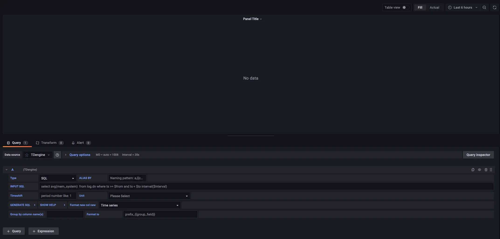

import Tabs from "@theme/Tabs";
import TabItem from "@theme/TabItem";

TDengine can be quickly integrated with the open-source data visualization system [Grafana](https://www.grafana.com/) to build a data monitoring and alerting system. The whole process does not require any code development. And you can visualize the contents of the data tables in TDengine on a dashboard. You can learn more about using the TDengine plugin on [GitHub](https://github.com/taosdata/grafanaplugin/blob/master/README.md).

## Prerequisites

In order for Grafana to add the TDengine data source successfully, the following preparations are required:

1. The TDengine cluster is deployed and functioning properly
2. taosAdapter is installed and running properly. Please refer to the taosAdapter manual for details.

Record these values:

- TDengine REST API url: `http://tdengine.local:6041`.
- TDengine cluster authorization, with user + password.

## Installing Grafana

TDengine currently supports Grafana versions 7.5 and above. Users can go to the Grafana official website to download the installation package and execute the installation according to the current operating system. The download address is as follows: [https://grafana.com/grafana/download](https://grafana.com/grafana/download).

## Configuring Grafana

### Install Grafana Plugin and Configure Data Source

<Tabs defaultValue="script">
<TabItem value="gui" label="With GUI">

Under Grafana 8, plugin catalog allows you to [browse and manage plugins within Grafana](https://grafana.com/docs/grafana/next/administration/plugin-management/#plugin-catalog) (but for Grafana 7.x, use **With Script** or **Install & Configure Manually**). Find the page at **Configurations > Plugins**, search **TDengine** and click it to install.


Installation may cost some minutes, then you can **Create a TDengine data source**:


Then you can add a TDengine data source by filling up the configuration options.


You can create dashboards with TDengine now.

</TabItem>
<TabItem value="script" label="With Script">

On a server with Grafana installed, run `install.sh` with TDengine url and username/passwords will install TDengine data source plugin and add a data source named TDengine. This is the recommended way for Grafana 7.x or [Grafana provisioning](https://grafana.com/docs/grafana/latest/administration/provisioning/) users.

```sh
bash -c "$(curl -fsSL \
  https://raw.githubusercontent.com/taosdata/grafanaplugin/master/install.sh)" -- \
  -a http://localhost:6041 \
  -u root \
  -p taosdata
```

Restart Grafana service and open Grafana in web-browser, usually `http://localhost:3000`.

Save the script and type `./install.sh --help` for the full usage of the script.

</TabItem>
<TabItem value="manual" label="Install & Configure Manually">

Follow the installation steps in [Grafana](https://grafana.com/grafana/plugins/tdengine-datasource/?tab=installation) with the [``grafana-cli`` command-line tool](https://grafana.com/docs/grafana/latest/administration/cli/) for plugin installation.

```bash
grafana-cli plugins install tdengine-datasource
# with sudo
sudo -u grafana grafana-cli plugins install tdengine-datasource
```

You can also download zip files from [GitHub](https://github.com/taosdata/grafanaplugin/releases/latest) or [Grafana](https://grafana.com/grafana/plugins/tdengine-datasource/?tab=installation) and install manually. The commands are as follows:

```bash
GF_VERSION=3.3.1
# from GitHub
wget https://github.com/taosdata/grafanaplugin/releases/download/v$GF_VERSION/tdengine-datasource-$GF_VERSION.zip
# from Grafana
wget -O tdengine-datasource-$GF_VERSION.zip https://grafana.com/api/plugins/tdengine-datasource/versions/$GF_VERSION/download
```

Take CentOS 7.2 for example, extract the plugin package to /var/lib/grafana/plugins directory, and restart grafana.

```bash
sudo unzip tdengine-datasource-$GF_VERSION.zip -d /var/lib/grafana/plugins/
```

If Grafana is running in a Docker environment, the TDengine plugin can be automatically installed and set up using the following environment variable settings:

```bash
GF_INSTALL_PLUGINS=tdengine-datasource
```

Now users can log in to the Grafana server (username/password: admin/admin) directly through the URL `http://localhost:3000` and add a datasource through `Configuration -> Data Sources` on the left side, as shown in the following figure.


Click `Add data source` to enter the Add data source page, and enter TDengine in the query box to add it, as shown in the following figure.


Enter the datasource configuration page, and follow the default prompts to modify the corresponding configuration.


- Host: IP address of the server where the components of the TDengine cluster provide REST service (offered by taosd before 2.4 and by taosAdapter since 2.4) and the port number of the TDengine REST service (6041), by default use `http://localhost:6041`.
- User: TDengine user name.
- Password: TDengine user password.

Click `Save & Test` to test. You should see a success message if the test worked.


</TabItem>
<TabItem value="container" label="Container">

Please refer to [Install plugins in the Docker container](https://grafana.com/docs/grafana/next/setup-grafana/installation/docker/#install-plugins-in-the-docker-container). This will install `tdengine-datasource` plugin when Grafana container starts:

```bash
docker run -d \
  -p 3000:3000 \
  --name=grafana \
  -e "GF_INSTALL_PLUGINS=tdengine-datasource" \
  grafana/grafana
```

You can setup a zero-configuration stack for TDengine + Grafana by [docker-compose](https://docs.docker.com/compose/) and [Grafana provisioning](https://grafana.com/docs/grafana/latest/administration/provisioning/) file:

1. Save the provisioning configuration file to `tdengine.yml`.

    ```yml
    apiVersion: 1
    datasources:
    - name: TDengine
      type: tdengine-datasource
      orgId: 1
      url: "$TDENGINE_API"
      isDefault: true
      secureJsonData:
        url: "$TDENGINE_URL"
        basicAuth: "$TDENGINE_BASIC_AUTH"
        token: "$TDENGINE_CLOUD_TOKEN"
      version: 1
      editable: true
    ```

2. Write `docker-compose.yml` with [TDengine](https://hub.docker.com/r/tdengine/tdengine) and [Grafana](https://hub.docker.com/r/grafana/grafana) image.

    ```yml
    version: "3.7"

    services:
      tdengine:
        image: tdengine/tdengine:3.0.2.4
        environment:
          TAOS_FQDN: tdengine
        volumes:
          - tdengine-data:/var/lib/taos/
      grafana:
        image: grafana/grafana:9.3.6
        volumes:
          - ./tdengine.yml/:/etc/grafana/provisioning/tdengine.yml
          - grafana-data:/var/lib/grafana
        environment:
          # install tdengine plugin at start
          GF_INSTALL_PLUGINS: "tdengine-datasource"
          TDENGINE_URL: "http://tdengine:6041"
          #printf "$TDENGINE_USER:$TDENGINE_PASSWORD" | base64
          TDENGINE_BASIC_AUTH: "cm9vdDp0YmFzZTEyNQ=="
        ports:
          - 3000:3000
    volumes:
      grafana-data:
      tdengine-data:
    ```

3. Start TDengine and Grafana services: `docker-compose up -d`.

Open Grafana (http://localhost:3000), and you can add dashboard with TDengine now.

</TabItem>
</Tabs>

### Create Dashboard

Go back to the main interface to create a dashboard and click Add Query to enter the panel query page:



As shown above, select the `TDengine` data source in the `Query` and enter the corresponding SQL in the query box below for query.

- INPUT SQL: Enter the desired query (the results being two columns and multiple rows), such as `select _wstart, avg(mem_system) from log.dnodes_info where ts >= $from and ts < $to interval($interval)`. In this statement, $from, $to, and $interval are variables that Grafana replaces with the query time range and interval. In addition to the built-in variables, custom template variables are also supported.
- ALIAS BY: This allows you to set the current query alias.
- GENERATE SQL: Clicking this button will automatically replace the corresponding variables and generate the final executed statement.
- Group by column name(s): `group by` or `partition by` columns name split by comma. By setting `Group by column name(s)`, it can show multi-dimension data if Sql is `group by` or `partition by`. Such as, it can show data by `dnode_ep` if sql is  `select _wstart as ts, avg(mem_system), dnode_ep from log.dnodes_info where ts>=$from and ts<=$to partition by dnode_ep interval($interval)` and `Group by column name(s)` is `dnode_ep`.
- Format to: format legend for `group by` or `partition by`. Such as it can display series data by `dnode_ep` if sql is `select _wstart as ts, avg(mem_system), dnode_ep from log.dnodes_info where ts>=$from and ts<=$to partition by dnode_ep interval($interval)` and `Group by column name(s)` is `dnode_ep` and `Format to` is `mem_system_{{dnode_ep}}`.

:::note

Since the REST connection because is stateless. Grafana plugin can use &lt;db_name&gt;.&lt;table_name&gt; in the SQL command to specify the database name.

:::

Follow the default prompt to query the average system memory usage for the specified interval on the server where the current TDengine deployment is located as follows.


The example to query the average system memory usage for the specified interval on each server as follows.


> For more information on how to use Grafana to create the appropriate monitoring interface and for more details on using Grafana, refer to the official Grafana [documentation](https://grafana.com/docs/).

### Importing the Dashboard

You can install TDinsight dashboard in data source configuration page (like `http://localhost:3000/datasources/edit/1/dashboards`) as a monitoring visualization tool for TDengine cluster. Ensure that you use TDinsight for 3.x. Please note TDinsight for 3.x needs to configure and run taoskeeper correctly. 


A dashboard for TDengine 2.x has been published on Grafana: [Dashboard 15167 - TDinsight](https://grafana.com/grafana/dashboards/15167)).

For more dashboards using TDengine data source, [search here in Grafana](https://grafana.com/grafana/dashboards/?dataSource=tdengine-datasource). Here is a sub list:

- [15146](https://grafana.com/grafana/dashboards/15146): Monitor multiple TDengine clusters.
- [15155](https://grafana.com/grafana/dashboards/15155): TDengine alert demo.
- [15167](https://grafana.com/grafana/dashboards/15167): TDinsight.
- [16388](https://grafana.com/grafana/dashboards/16388): Telegraf node metrics dashboard using TDengine data source.
