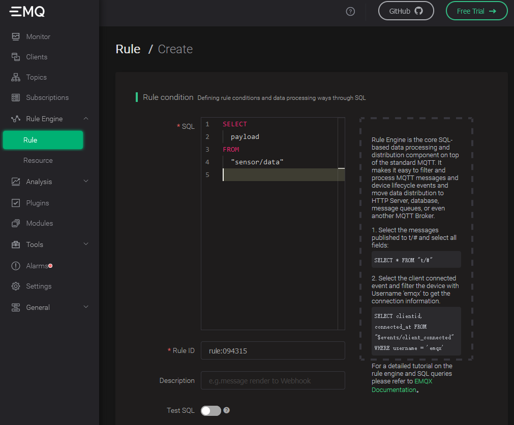

MQTT is a popular IoT data transfer protocol. [EMQX](https://github.com/emqx/emqx) is an open-source MQTT Broker software. You can write MQTT data directly to TDengine without any code. You only need to setup "rules" in EMQX Dashboard to create a simple configuration. EMQX supports saving data to TDengine by sending data to a web service and provides a native TDengine driver for direct saving in the Enterprise Edition. Please refer to the [EMQX official documentation](https://www.emqx.io/docs/en/v4.4/rule/rule-engine.html) for details on how to use it.).

## Prerequisites

The following preparations are required for EMQX to add TDengine data sources correctly.
- The TDengine cluster is deployed and working properly
- taosAdapter is installed and running properly. Please refer to the [taosAdapter manual](../../reference/taosadapter) for details.
- If you use the emulated writers described later, you need to install the appropriate version of Node.js. V12 is recommended.

## Install and start EMQX

Depending on the current operating system, users can download the installation package from the [EMQX official website](https://www.emqx.io/downloads) and execute the installation. After installation, use `sudo emqx start` or `sudo systemctl start emqx` to start the EMQX service.

Note: this chapter is based on EMQX v4.4.5. Other version of EMQX probably change its user interface, configuration methods or functions.

## Create Database and Table

In this step we create the appropriate database and table schema in TDengine for receiving MQTT data. Open TDengine CLI and execute SQL bellow: 

```sql
CREATE DATABASE test;
USE test;
CREATE TABLE sensor_data (ts TIMESTAMP, temperature FLOAT, humidity FLOAT, volume FLOAT, pm10 FLOAT, pm25 FLOAT, so2 FLOAT, no2 FLOAT, co FLOAT, sensor_id NCHAR(255), area TINYINT, coll_time TIMESTAMP);
```

## Configuring EMQX Rules

Since the configuration interface of EMQX differs from version to version, here is v4.4.5 as an example. For other versions, please refer to the corresponding official documentation.

### Login EMQX Dashboard

Use your browser to open the URL `http://IP:18083` and log in to EMQX Dashboard. The initial installation username is `admin` and the password is: `public`.


### Creating Rule

Select "Rule" in the "Rule Engine" on the left and click the "Create" button: !


### Edit SQL fields

Copy SQL bellow and paste it to the SQL edit area:

```sql
SELECT
  payload
FROM
  "sensor/data"
```



### Add "action handler"


### Add "Resource"


Select "Data to Web Service" and click the "New Resource" button.

### Edit "Resource"

Select "WebHook" and fill in the request URL as the address and port of the server running taosAdapter (default is 6041). Leave the other properties at their default values.


### Edit "action"

Edit the resource configuration to add the key/value pairing for Authorization. If you use the default TDengine username and password then the value of key Authorization is:

```
Basic cm9vdDp0YW9zZGF0YQ==
```

Please refer to the [ TDengine REST API documentation ](../../reference/rest-api/) for the authorization in details. 
 
Enter the rule engine replacement template in the message body:

```sql
INSERT INTO test.sensor_data VALUES(
  now,
  ${payload.temperature},
  ${payload.humidity},
  ${payload.volume},
  ${payload.PM10},
  ${payload.pm25},
  ${payload.SO2},
  ${payload.NO2},
  ${payload.CO},
  '${payload.id}',
  ${payload.area},
  ${payload.ts}
)
```


Finally, click the "Create" button at bottom left corner saving the rule.
## Compose program to mock data

```javascript
{{#include docs/examples/other/mock.js}}
```

Note: `CLIENT_NUM` in the code can be set to a smaller value at the beginning of the test to avoid hardware performance be not capable to handle a more significant number of concurrent clients.


## Execute tests to simulate sending MQTT data

```
npm install mqtt mockjs --save ---registry=https://registry.npm.taobao.org
node mock.js
```


## Verify that EMQX is receiving data

Refresh the EMQX Dashboard rules engine interface to see how many records were received correctly:


## Verify that data writing to TDengine

Use the TDengine CLI program to log in and query the appropriate databases and tables to verify that the data is being written to TDengine correctly:


Please refer to the [TDengine official documentation](https://docs.tdengine.com/) for more details on how to use TDengine.
EMQX Please refer to the [EMQX official documentation](https://www.emqx.io/docs/en/v4.4/rule/rule-engine.html) for details on how to use EMQX.
