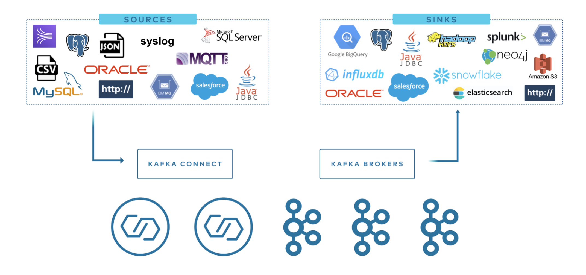

TDengine Kafka Connector contains two plugins: TDengine Source Connector and TDengine Sink Connector. Users only need to provide a simple configuration file to synchronize the data of the specified topic in Kafka (batch or real-time) to TDengine or synchronize the data (batch or real-time) of the specified database in TDengine to Kafka.

## What is Kafka Connect?

Kafka Connect is a component of [Apache Kafka](https://kafka.apache.org/) that enables other systems, such as databases, cloud services, file systems, etc., to connect to Kafka easily. Data can flow from other software to Kafka via Kafka Connect and Kafka to other systems via Kafka Connect. Plugins that read data from other software are called Source Connectors, and plugins that write data to other software are called Sink Connectors. Neither Source Connector nor Sink Connector will directly connect to Kafka Broker, and Source Connector transfers data to Kafka Connect. Sink Connector receives data from Kafka Connect.


TDengine Source Connector is used to read data from TDengine in real-time and send it to Kafka Connect. Users can use The TDengine Sink Connector to receive data from Kafka Connect and write it to TDengine.



## Prerequisites

1. Linux operating system
2. Java 8 and Maven installed
3. Git/curl/vi is installed
4. TDengine is installed and started.

## Install Kafka

Execute in any directory:

```shell
curl -O https://downloads.apache.org/kafka/3.4.0/kafka_2.13-3.4.0.tgz
tar xzf kafka_2.13-3.4.0.tgz -C /opt/
ln -s /opt/kafka_2.13-3.4.0 /opt/kafka
```

Then you need to add the `$KAFKA_HOME/bin` directory to the PATH.

```title=".profile"
export KAFKA_HOME=/opt/kafka
export PATH=$PATH:$KAFKA_HOME/bin
```

Users can append the above script to the current user's profile file (~/.profile or ~/.bash_profile)

## Install TDengine Connector plugin

### Install from source code

```shell
git clone --branch 3.0 https://github.com/taosdata/kafka-connect-tdengine.git
cd kafka-connect-tdengine
mvn clean package -Dmaven.test.skip=true
unzip -d $KAFKA_HOME/components/ target/components/packages/taosdata-kafka-connect-tdengine-*.zip
```

The above script first clones the project source code and then compiles and packages it with Maven. After the package is complete, the zip package of the plugin is generated in the `target/components/packages/` directory. Unzip this zip package to plugin path. We used `$KAFKA_HOME/components/` above because it's a build in plugin path.

### Add configuration file

add kafka-connect-tdengine plugin path to `plugin.path` in `$KAFKA_HOME/config/connect-distributed.properties`.

```properties
plugin.path=/usr/share/java,/opt/kafka/components
```

## Start Kafka Services

Use command bellow to start all services:

```shell
zookeeper-server-start.sh -daemon $KAFKA_HOME/config/zookeeper.properties

kafka-server-start.sh -daemon $KAFKA_HOME/config/server.properties

connect-distributed.sh -daemon $KAFKA_HOME/config/connect-distributed.properties

```

### Check Successfully Loaded Plugin

After Kafka Connect was completely started, you can use bellow command to check if our plugins are installed successfully:

```shell
curl http://localhost:8083/connectors
```

The output as bellow:

```txt
[]
```

## The use of TDengine Sink Connector

The role of the TDengine Sink Connector is to synchronize the data of the specified topic to TDengine. Users do not need to create databases and super tables in advance. The name of the target database can be specified manually (see the configuration parameter connection.database), or it can be generated according to specific rules (see the configuration parameter connection.database.prefix).

TDengine Sink Connector internally uses TDengine [modeless write interface](../../client-libraries/cpp#modeless write-api) to write data to TDengine, currently supports data in three formats: [InfluxDB line protocol format](../../develop/insert-data/influxdb-line), [OpenTSDB Telnet protocol format](../../develop/insert-data/opentsdb-telnet), and [OpenTSDB JSON protocol format](../../develop/insert-data/opentsdb-json).

The following example synchronizes the data of the topic meters to the target database power. The data format is the InfluxDB Line protocol format.

### Add Sink Connector configuration file

```shell
mkdir ~/test
cd ~/test
vi sink-demo.json
```

sink-demo.json' content is following:

```json title="sink-demo.json"
{
  "name": "TDengineSinkConnector",
  "config": {
    "connector.class":"com.taosdata.kafka.connect.sink.TDengineSinkConnector",
    "tasks.max": "1",
    "topics": "meters",
    "connection.url": "jdbc:TAOS://127.0.0.1:6030",
    "connection.user": "root",
    "connection.password": "taosdata",
    "connection.database": "power",
    "db.schemaless": "line",
    "data.precision": "ns",
    "key.converter": "org.apache.kafka.connect.storage.StringConverter",
    "value.converter": "org.apache.kafka.connect.storage.StringConverter",
    "errors.tolerance": "all",
    "errors.deadletterqueue.topic.name": "dead_letter_topic",
    "errors.deadletterqueue.topic.replication.factor": 1
  }
}
```

Key configuration instructions:

1. `"topics": "meters"` and `"connection.database": "power"` means to subscribe to the data of the topic meters and write to the database power.
2. `"db.schemaless": "line"` means the data in the InfluxDB Line protocol format.

### Create Sink Connector instance

````shell
curl -X POST -d @sink-demo.json http://localhost:8083/connectors -H "Content-Type: application/json"
````

If the above command is executed successfully, the output is as follows:

```json
{
  "name": "TDengineSinkConnector",
  "config": {
    "connection.database": "power",
    "connection.password": "taosdata",
    "connection.url": "jdbc:TAOS://127.0.0.1:6030",
    "connection.user": "root",
    "connector.class": "com.taosdata.kafka.connect.sink.TDengineSinkConnector",
    "data.precision": "ns",
    "db.schemaless": "line",
    "key.converter": "org.apache.kafka.connect.storage.StringConverter",
    "tasks.max": "1",
    "topics": "meters",
    "value.converter": "org.apache.kafka.connect.storage.StringConverter",
    "name": "TDengineSinkConnector",
    "errors.tolerance": "all",
    "errors.deadletterqueue.topic.name": "dead_letter_topic",
    "errors.deadletterqueue.topic.replication.factor": "1",  
  },
  "tasks": [],
  "type": "sink"
}
```

### Write test data

Prepare text file as test data, its content is following:

```txt title="test-data.txt"
meters,location=California.LoSangeles,groupid=2 current=11.8,voltage=221,phase=0.28 1648432611249000000
meters,location=California.LoSangeles,groupid=2 current=13.4,voltage=223,phase=0.29 1648432611250000000
meters,location=California.LoSangeles,groupid=3 current=10.8,voltage=223,phase=0.29 1648432611249000000
meters,location=California.LoSangeles,groupid=3 current=11.3,voltage=221,phase=0.35 1648432611250000000
```

Use kafka-console-producer to write test data to the topic `meters`.

```shell
cat test-data.txt | kafka-console-producer.sh --broker-list localhost:9092 --topic meters
```

:::note
TDengine Sink Connector will automatically create the database if the target database does not exist. The time precision used to create the database automatically is nanoseconds, which requires that the timestamp precision of the written data is also nanoseconds. An exception will be thrown if the timestamp precision of the written data is not nanoseconds.
:::

### Verify that the sync was successful

Use the TDengine CLI to verify that the sync was successful.

```sql
taos> use power;
Database changed.

taos> select * from meters;
              _ts               |          current          |          voltage          |           phase           | groupid |            location            |
===============================================================================================================================================================
 2022-03-28 09:56:51.249000000 |              11.800000000 |             221.000000000 |               0.280000000 | 2       | California.LosAngeles          |
 2022-03-28 09:56:51.250000000 |              13.400000000 |             223.000000000 |               0.290000000 | 2       | California.LosAngeles          |
 2022-03-28 09:56:51.249000000 |              10.800000000 |             223.000000000 |               0.290000000 | 3       | California.LosAngeles          |
 2022-03-28 09:56:51.250000000 |              11.300000000 |             221.000000000 |               0.350000000 | 3       | California.LosAngeles          |
Query OK, 4 row(s) in set (0.004208s)
```

If you see the above data, the synchronization is successful. If not, check the logs of Kafka Connect. For detailed description of configuration parameters, see [Configuration Reference](#configuration-reference).

## The use of TDengine Source Connector

The role of the TDengine Source Connector is to push all the data of a specific TDengine database after a particular time to Kafka. The implementation principle of TDengine Source Connector is to first pull historical data in batches and then synchronize incremental data with the strategy of the regular query. At the same time, the changes in the table will be monitored, and the newly added table can be automatically synchronized. If Kafka Connect is restarted, synchronization will resume where it left off.

TDengine Source Connector will convert the data in TDengine data table into [InfluxDB Line protocol format](../../develop/insert-data/influxdb-line/) or [OpenTSDB JSON protocol format](../../develop/insert-data/opentsdb-json ) and then write to Kafka.

The following sample program synchronizes the data in the database test to the topic tdengine-test-meters.

### Add Source Connector configuration file

```shell
vi source-demo.json
```

Input following content:

```json title="source-demo.json"
{
  "name":"TDengineSourceConnector",
    "config":{
    "connector.class": "com.taosdata.kafka.connect.source.TDengineSourceConnector",
    "tasks.max": 1,
    "connection.url": "jdbc:TAOS://127.0.0.1:6030",
    "connection.username": "root",
    "connection.password": "taosdata",
    "connection.database": "test",
    "connection.attempts": 3,
    "connection.backoff.ms": 5000,
    "topic.prefix": "tdengine",
    "topic.delimiter": "-",
    "poll.interval.ms": 1000,
    "fetch.max.rows": 100,
    "topic.per.stable": true,
    "topic.ignore.db": false,
    "out.format": "line",
    "key.converter": "org.apache.kafka.connect.storage.StringConverter",
    "value.converter": "org.apache.kafka.connect.storage.StringConverter"
    }
}
```

### Prepare test data

Prepare SQL script file to generate test data

```sql title="prepare-source-data.sql"
DROP DATABASE IF EXISTS test;
CREATE DATABASE test;
USE test;
CREATE STABLE meters (ts TIMESTAMP, current FLOAT, voltage INT, phase FLOAT) TAGS (location BINARY(64), groupId INT);

INSERT INTO d1001 USING meters TAGS('California.SanFrancisco', 2) VALUES('2018-10-03 14:38:05.000',10.30000,219,0.31000) \
            d1001 USING meters TAGS('California.SanFrancisco', 2) VALUES('2018-10-03 14:38:15.000',12.60000,218,0.33000) \
            d1001 USING meters TAGS('California.SanFrancisco', 2) VALUES('2018-10-03 14:38:16.800',12.30000,221,0.31000) \
            d1002 USING meters TAGS('California.SanFrancisco', 3) VALUES('2018-10-03 14:38:16.650',10.30000,218,0.25000) \
            d1003 USING meters TAGS('California.LosAngeles', 2)   VALUES('2018-10-03 14:38:05.500',11.80000,221,0.28000) \
            d1003 USING meters TAGS('California.LosAngeles', 2)   VALUES('2018-10-03 14:38:16.600',13.40000,223,0.29000) \
            d1004 USING meters TAGS('California.LosAngeles', 3)   VALUES('2018-10-03 14:38:05.000',10.80000,223,0.29000) \
            d1004 USING meters TAGS('California.LosAngeles', 3)   VALUES('2018-10-03 14:38:06.500',11.50000,221,0.35000);
```

Use TDengine CLI to execute SQL script

```shell
taos -f prepare-source-data.sql
```

### Create Connector instance

```shell
curl -X POST -d @source-demo.json http://localhost:8083/connectors -H "Content-Type: application/json"
```

### View topic data

Use the kafka-console-consumer command-line tool to monitor data in the topic tdengine-test-meters. In the beginning, all historical data will be output. After inserting two new data into TDengine, kafka-console-consumer immediately outputs the two new data. The output is in InfluxDB line protocol format.

````shell
kafka-console-consumer.sh --bootstrap-server localhost:9092 --from-beginning --topic tdengine-test-meters
````

output:

```txt
......
meters,location="California.SanFrancisco",groupid=2i32 current=10.3f32,voltage=219i32,phase=0.31f32 1538548685000000000
meters,location="California.SanFrancisco",groupid=2i32 current=12.6f32,voltage=218i32,phase=0.33f32 1538548695000000000
......
```

All historical data is displayed. Switch to the TDengine CLI and insert two new pieces of data:

```sql
USE test;
INSERT INTO d1001 VALUES (now, 13.3, 229, 0.38);
INSERT INTO d1002 VALUES (now, 16.3, 233, 0.22);
```

Switch back to kafka-console-consumer, and the command line window has printed out the two pieces of data just inserted.

### unload plugin

After testing, use the unload command to stop the loaded connector.

View currently active connectors:

```shell
curl http://localhost:8083/connectors
```

You should now have two active connectors if you followed the previous steps. Use the following command to unload:

```shell
curl -X DELETE http://localhost:8083/connectors/TDengineSinkConnector
curl -X DELETE http://localhost:8083/connectors/TDengineSourceConnector
```

## Configuration reference

### General configuration

The following configuration items apply to TDengine Sink Connector and TDengine Source Connector.

1. `name`: The name of the connector.
2. `connector.class`: The full class name of the connector, for example: com.taosdata.kafka.connect.sink.TDengineSinkConnector.
3. `tasks.max`: The maximum number of tasks, the default is 1.
4. `topics`: A list of topics to be synchronized, separated by commas, such as `topic1,topic2`.
5. `connection.url`: TDengine JDBC connection string, such as `jdbc:TAOS://127.0.0.1:6030`.
6. `connection.user`: TDengine username, default root.
7. `connection.password`: TDengine user password, default taosdata.
8. `connection.attempts` : The maximum number of connection attempts. Default 3.
9. `connection.backoff.ms`: The retry interval for connection creation failure, the unit is ms. Default is 5000.

### TDengine Sink Connector specific configuration

1. `connection.database`: The name of the target database. If the specified database does not exist, it will be created automatically. The time precision used for automatic library building is nanoseconds. The default value is null. When it is NULL, refer to the description of the `connection.database.prefix` parameter for the naming rules of the target database
2. `connection.database.prefix`: When `connection.database` is null, the prefix of the target database. Can contain placeholder '$&lcub;topic&rcub;'. For example, kafka_$&lcub;topic&rcub;, for topic 'orders' will be written to database 'kafka_orders'. Default null. When null, the name of the target database is the same as the name of the topic.
3. `batch.size`: Write the number of records in each batch in batches. When the data received by the sink connector at one time is larger than this value, it will be written in some batches.
4. `max.retries`: The maximum number of retries when an error occurs. Defaults to 1.
5. `retry.backoff.ms`: The time interval for retry when sending an error. The unit is milliseconds. The default is 3000.
6. `db.schemaless`: Data format, could be one of `line`, `json`, and `telnet`. Represent InfluxDB line protocol format, OpenTSDB JSON format, and OpenTSDB Telnet line protocol format.
7. `data.precision`: The time precision when use InfluxDB line protocol format data, could be one of `ms`, `us` and `ns`. The default is `ns`.

### TDengine Source Connector specific configuration

1. `connection.database`: source database name, no default value.
2. `topic.prefix`: topic name prefix used when importing data into kafka. Its defaults value is empty string "".
3. `timestamp.initial`: Data synchronization start time. The format is 'yyyy-MM-dd HH:mm:ss'. If it is not set, the data importing to Kafka will be started from the first/oldest row in the database.
4. `poll.interval.ms`: The time interval for checking newly created tables or removed tables, default value is 1000.
5. `fetch.max.rows`: The maximum number of rows retrieved when retrieving the database, default is 100.
6. `query.interval.ms`: The time range of reading data from TDengine each time, its unit is millisecond. It should be adjusted according to the data flow in rate, the default value is 0, this means to get all the data to the latest time.
7. `out.format`: Result output format. `line` indicates that the output format is InfluxDB line protocol format, `json` indicates that the output format is json. The default is line.
8. `topic.per.stable`: If it's set to true, it means one super table in TDengine corresponds to a topic in Kafka, the topic naming rule is `<topic.prefix><topic.delimiter><connection.database><topic.delimiter><stable.name>`; if it's set to false, it means the whole DB corresponds to a topic in Kafka, the topic naming rule is `<topic.prefix><topic.delimiter><connection.database>`.
9. `topic.ignore.db`: Whether the topic naming rule contains the database name: true indicates that the rule is `<topic.prefix><topic.delimiter><stable.name>`, false indicates that the rule is `<topic.prefix><topic.delimiter><connection.database><topic.delimiter><stable.name>`, and the default is false. Does not take effect when `topic.per.stable` is set to false.
10. `topic.delimiter`: topic name delimiter，default is `-`.
11. `read.method`: read method for query TDengine data, query or subscription. default is subscription.
12. `subscription.group.id`: subscription group id for subscription data from TDengine, this field is required when `read.method` is subscription.
13. `subscription.from`: subscription from latest or earliest. default is latest。

## Other notes

1. To use Kafka Connect, refer to [https://kafka.apache.org/documentation/#connect](https://kafka.apache.org/documentation/#connect).

## Feedback

[https://github.com/taosdata/kafka-connect-tdengine/issues](https://github.com/taosdata/kafka-connect-tdengine/issues)

## Reference

1. For more information, see [https://kafka.apache.org/documentation/](https://kafka.apache.org/documentation/).
