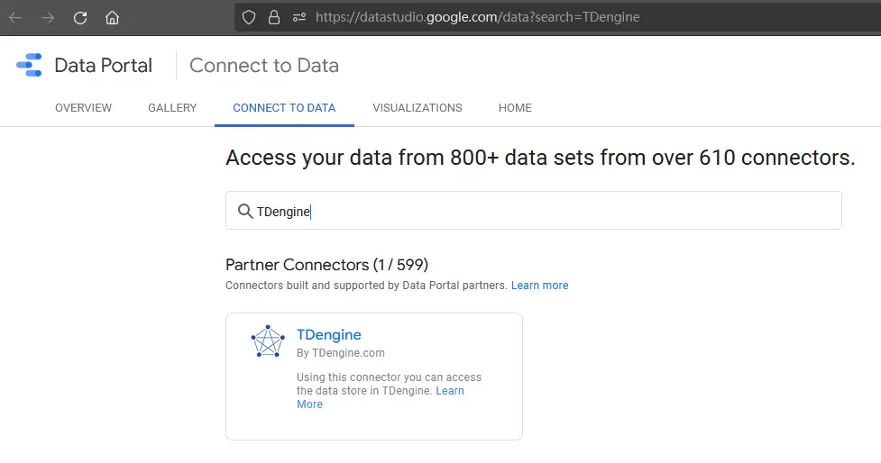
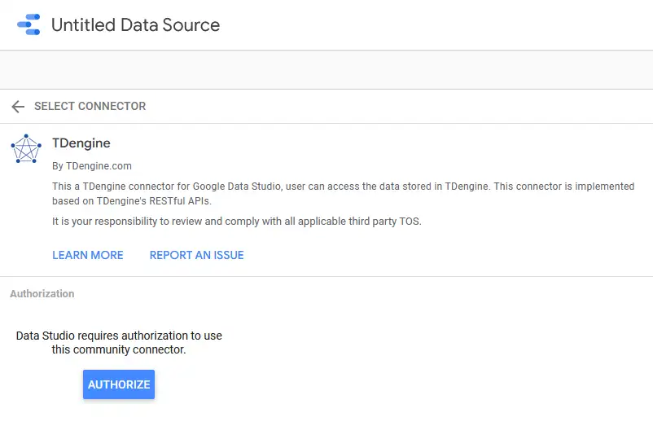
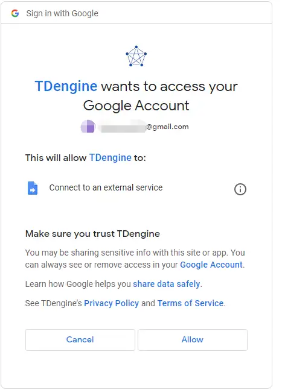
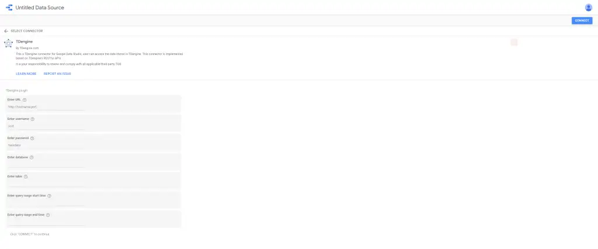

Data Studio is a powerful tool for reporting and visualization, offering a wide variety of charts and connectors and making it easy to generate reports based on predefined templates. Its ease of use and robust ecosystem have made it one of the first choices for people working in data analysis.

TDengine is a high-performance, scalable time-series database that supports SQL. Many businesses and developers in fields spanning from IoT and Industry Internet to IT and finance are using TDengine as their time-series database management solution.

The TDengine team immediately saw the benefits of using TDengine to process time-series data with Data Studio to analyze it, and they got to work to create a connector for Data Studio.

With the release of the TDengine connector in Data Studio, you can now get even more out of your data. To obtain the connector, first go to the Data Studio Connector Gallery, click Connect to Data, and search for "TDengine".

Select the TDengine connector and click Authorize.

Then sign in to your Google Account and click Allow to enable the connection to TDengine.

In the Enter URL field, type the hostname and port of the server running the TDengine REST service. In the following fields, type your username, password, database name, table name, and the start and end times of your query range. Then, click Connect.

After the connection is established, you can use Data Studio to process your data and create reports.

In Data Studio, TDengine timestamps and tags are considered dimensions, and all other items are considered metrics. You can create all kinds of custom charts with your data - some examples are shown below.

With the ability to process petabytes of data per day and provide monitoring and alerting in real time, TDengine is a great solution for time-series data management. Now, with the Data Studio connector, we're sure you'll be able to gain new insights and obtain even more value from your data.
