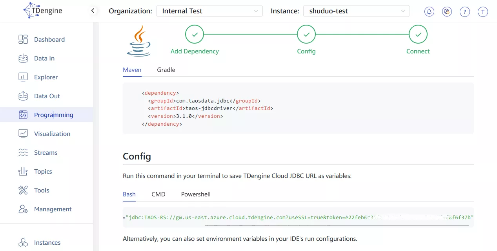
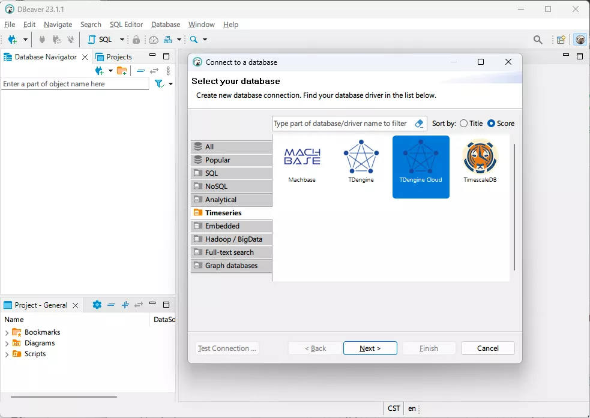
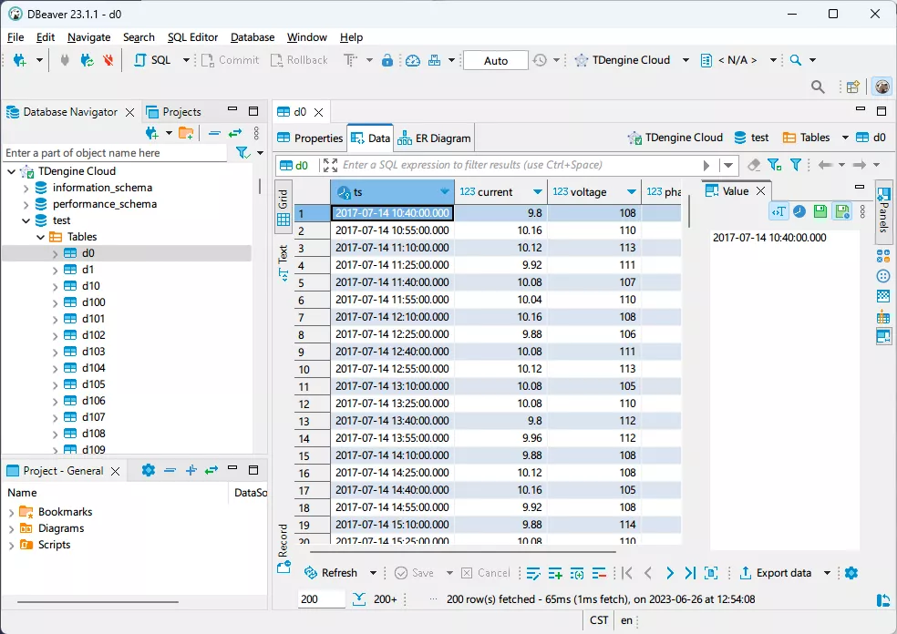
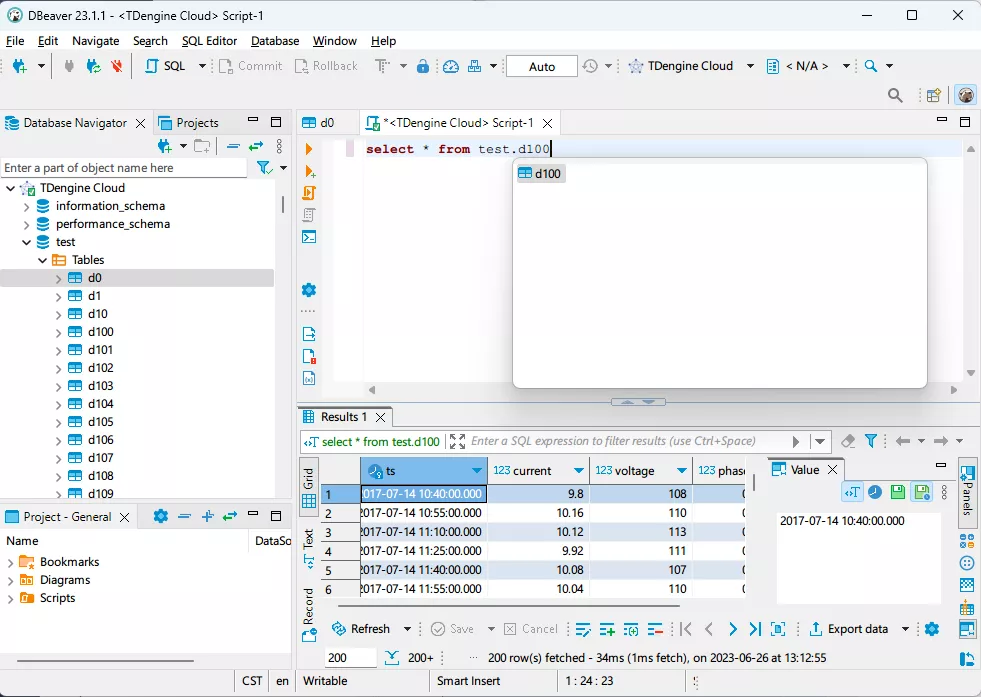

DBeaver is a popular cross-platform database management tool that facilitates data management for developers, database administrators, data analysts, and other users. Starting from version 23.1.1, DBeaver natively supports TDengine and can be used to manage TDengine Cloud as well as on-premise TDengine clusters deployed.

## Prerequisites

### Install DBeaver

To use DBeaver to manage TDengine, you need to prepare the following:

- Install DBeaver. DBeaver supports mainstream operating systems including Windows, macOS, and Linux. Please make sure you download and install the correct version (23.1.1+) and platform package. Please refer to the DBeaver official document (https://github.com/dbeaver/dbeaver/wiki/Installation) for detailed installation steps.
- If you use an on-premis TDengine cluster deployed, please make sure that TDengine is deployed and running correctly, and that taosAdapter is installed and running properly. For detailed information, please refer to the taosAdapter User Manual.
- If you use TDengine Cloud, please register (https://cloud.tdengine.com/) for the corresponding account.

## Usage

### Use DBeaver to access on-premise TDengine cluster

1. Start the DBeaver application, click the button or menu item to choose "connect to database", and then select TDengine in the time series category.

2. Configure the TDengine connection by filling in the host address, port number, username, and password. If TDengine is deployed on the local machine, you can only fill in the username and password. The default username is root and the default password is taosdata. Click "Test Connection" to check whether the connection is workable. If you do not have the TDengine Java connector installed on the local machine, DBeaver will prompt you to download and install it.

)

3. If the connection is successful, it will be displayed as shown in the following figure. If the connection fails, please check whether the TDengine service and taosAdapter are running correctly, and whether the host address, port number, username, and password are correct.

4. Use DBeaver to select databases and tables to browse TDengine service data.

5. You can also maniplate TDengine data by executing SQL commands.

### Use DBeaver to access TDengine Cloud

1. Log in to the TDengine Cloud service, select "Programming" and "Java" in the management console, and then copy the string value of TDENGINE_JDBC_URL.

2. Start the DBeaver application, click the button or menu item to choose "connect to a database", and then select TDengine Cloud in the time series category.

3. Configure the TDengine Cloud connection by filling in the JDBC_URL value. Click "Test Connection". If you do not have the TDengine Java connector installed on the local machine, DBeaver will prompt you to download and install it. If the connection is successful, it will be displayed as shown in the following figure. If the connection fails, please check whether the TDengine Cloud service is running properly and whether the JDBC_URL is correct.

4. Use DBeaver to select databases and tables to browse TDengine Cloud service data.

5. You can also operate TDengine Cloud data by executing SQL commands

