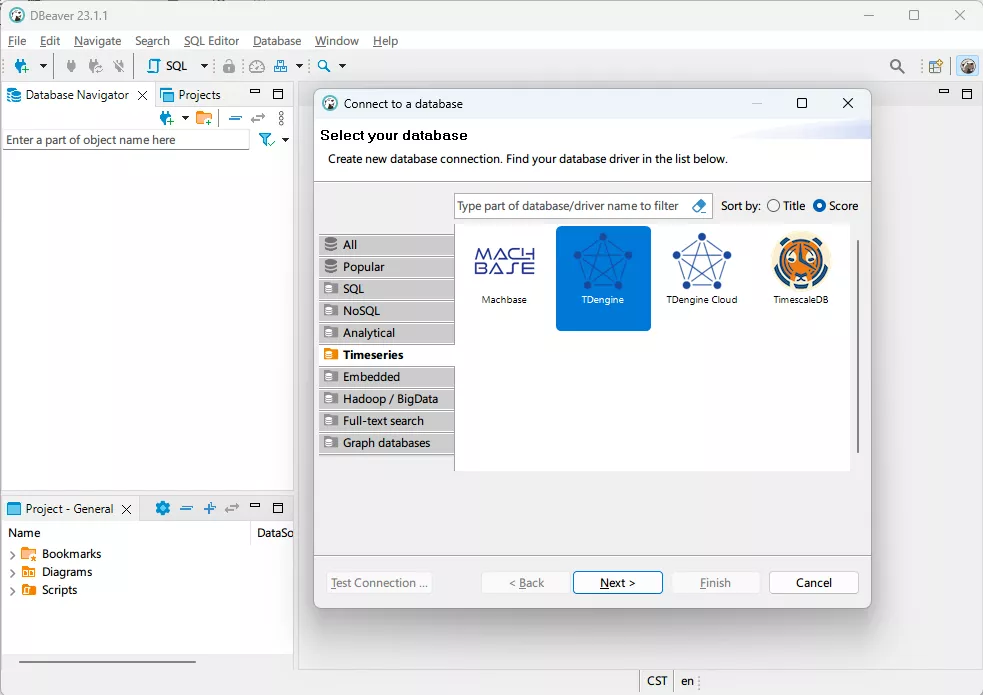
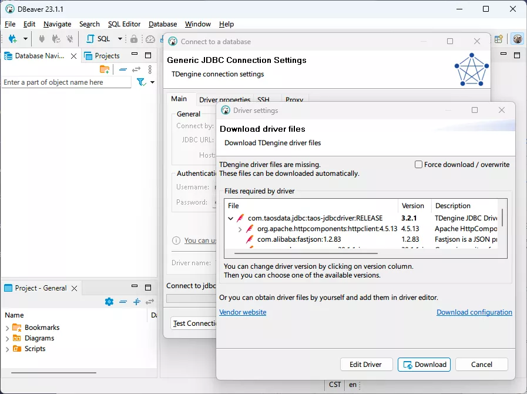
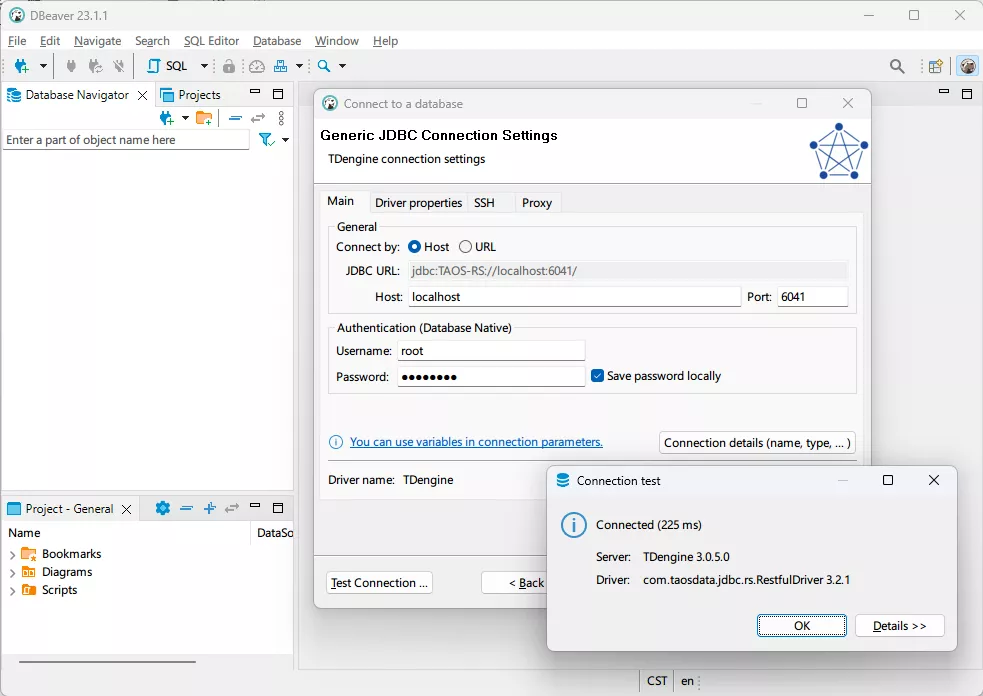
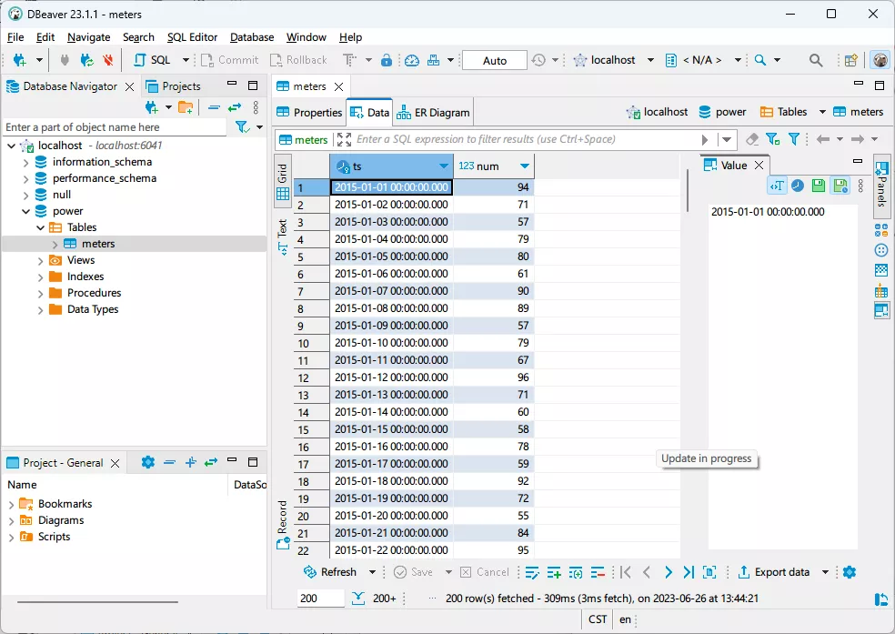
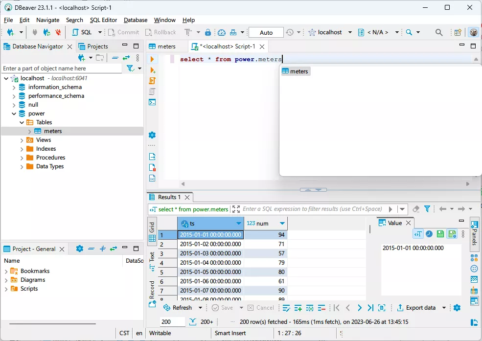

[DBeaver](https://dbeaver.io/) is a popular cross-platform database management tool that facilitates data management for developers, database administrators, data analysts, and other users. Starting from version 23.1.1, DBeaver natively supports TDengine and can be used to manage TDengine Cloud as well as TDengine clusters deployed on-premises.

## Prerequisites

To use DBeaver to manage TDengine, you need to prepare the following:

- Install DBeaver. DBeaver supports mainstream operating systems including Windows, macOS, and Linux. Please make sure you download and install the correct version (23.1.1+) and platform package. Please refer to the [official DBeaver documentation](https://github.com/dbeaver/dbeaver/wiki/Installation) for detailed installation steps.
- If you use an on-premises TDengine cluster, please make sure that TDengine and taosAdapter are deployed and running properly. For detailed information, please refer to the taosAdapter User Manual.

## Use DBeaver to access on-premises TDengine cluster

1. Start the DBeaver application, click the button or menu item to choose **New Database Connection**, and then select **TDengine** in the **Timeseries** category.

 

2. Configure the TDengine connection by filling in the host address, port number, username, and password. If TDengine is deployed on the local machine, you are only required to fill in the username and password. The default username is root and the default password is taosdata. Click **Test Connection** to check whether the connection is workable. If you do not have the TDengine Java client library installed on the local machine, DBeaver will prompt you to download and install it.

 )

3. If the connection is successful, it will be displayed as shown in the following figure. If the connection fails, please check whether the TDengine service and taosAdapter are running correctly and whether the host address, port number, username, and password are correct.

 

4. Use DBeaver to select databases and tables and browse your data stored in TDengine.

 

5. You can also manipulate TDengine data by executing SQL commands.

 
