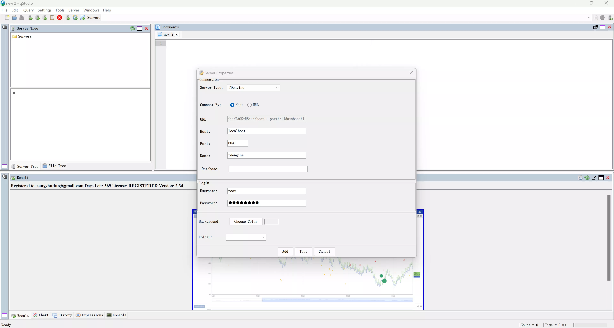
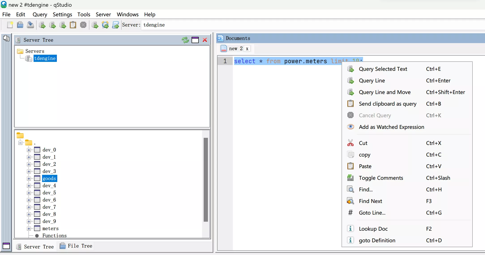

qStudio is a free cross-platform SQL data analysis tool that allows easy browsing of tables, variables, functions, and configuration settings in a database. The latest version of qStudio includes built-in support for TDengine.

## Prerequisites

To connect TDengine using qStudio, you need to complete the following preparations:

- Install qStudio: qStudio supports major operating systems, including Windows, macOS, and Linux. Please ensure you download the correct installation package for your platform from the [download page](https://www.timestored.com/qstudio/download/).
- Set up TDengine instance: Make sure TDengine is installed and running correctly, and the taosAdapter is installed and running. For detailed information, refer to the taosAdapter User Manual.

## Connecting to TDengine with qStudio

1. Launch the qStudio application and select "Server" and then "Add Server..." from the menu. Choose TDengine from the Server Type dropdown.

 

2. Configure the TDengine connection by entering the host address, port number, username, and password. If TDengine is deployed on the local machine, you can fill in the username and password only. The default username is "root," and the default password is "taosdata." Click "Test" to test the connection's availability. If the TDengine Java client library is not installed on the local machine, qStudio will prompt you to download and install it.

 

3. Once connected successfully, the screen will display as shown below. If the connection fails, check that the TDengine service and taosAdapter are running correctly, and ensure that the host address, port number, username, and password are correct.

 

4. Use qStudio to select databases and tables to browse data from the TDengine server.

 

5. You can also perform operations on TDengine data by executing SQL commands.

 

6. qStudio supports charting functions based on the data. For more information, please refer to the [qStudio documentation](https://www.timestored.com/qstudio/help).

 
