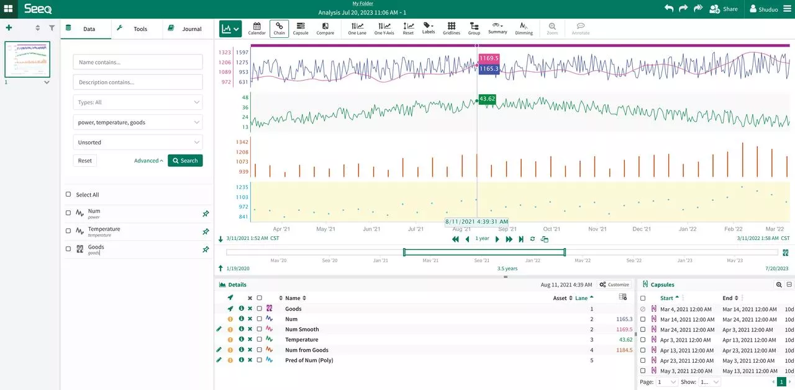
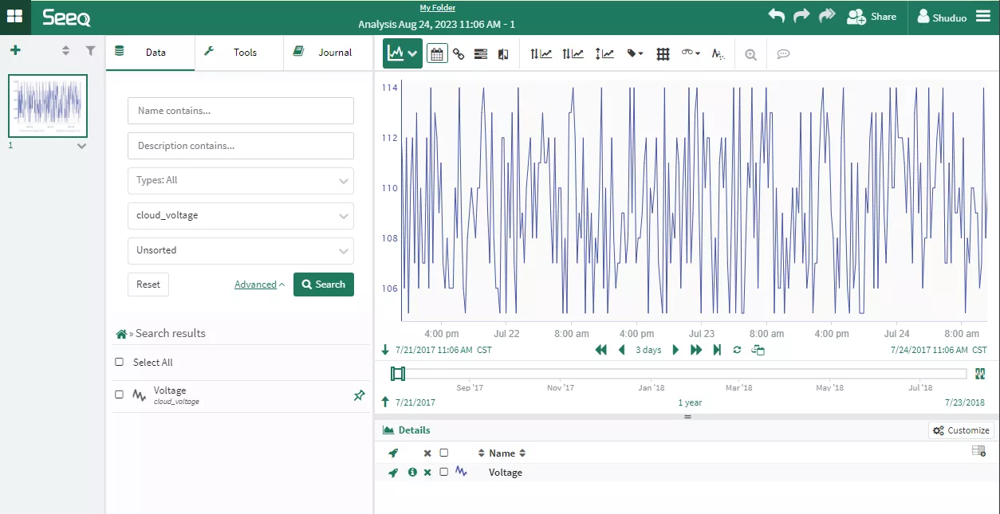

# How to use Seeq and TDengine to perform time series data analysis

## Introduction

Seeq is an advanced analytics software for the manufacturing industry and the Industrial Internet of Things (IIoT). Seeq supports the use of machine learning innovations within process manufacturing organizations. These capabilities enable organizations to deploy their own or third-party machine learning algorithms into advanced analytics applications used by frontline process engineers and subject matter experts, thus extending the efforts of a single data scientist to many frontline workers.

With the TDengine Java connector, Seeq effortlessly supports querying time series data provided by TDengine and offers functionalities such as data visualization, analysis, and forecasting.

### Install Seeq

Please download Seeq Server and Seeq Data Lab software installation package from the [Seeq official website](https://www.seeq.com/customer-download).

### Install and start Seeq Server

```
tar xvzf seeq-server-xxx.tar.gz
cd seeq-server-installer
sudo ./install

sudo seeq service enable
sudo seeq start
```

### Install and start Seeq Data Lab Server

Seeq Data Lab needs to be installed on a separate server from Seeq Server and connected to Seeq Server through configuration. For detailed installation and configuration instructions, please refer to [the official documentation](https://support.seeq.com/space/KB/1034059842).

```
tar xvf seeq-data-lab-<version>-64bit-linux.tar.gz
sudo seeq-data-lab-installer/install -f /opt/seeq/seeq-data-lab -g /var/opt/seeq -u seeq
sudo seeq config set Network/DataLab/Hostname localhost
sudo seeq config set Network/DataLab/Port 34231 # the port of the Data Lab server (usually 34231)
sudo seeq config set Network/Hostname <value> # the host IP or URL of the main Seeq Server

# If the main Seeq server is configured to listen over HTTPS
sudo seeq config set Network/Webserver/SecurePort 443 # the secure port of the main Seeq Server (usually 443)

# If the main Seeq server is NOT configured to listen over HTTPS
sudo seeq config set Network/Webserver/Port <value>

#On the main Seeq server, open a Seeq Command Prompt and set the hostname of the Data Lab server:
sudo seeq config set Network/DataLab/Hostname <value> # the host IP (not URL) of the Data Lab server
sudo seeq config set Network/DataLab/Port 34231 # the port of the Data Lab server (usually 34231
```

### Install TDengine on-premise instance

See [Quick Install from Package](../../get-started).

### Or use TDengine Cloud

Register for a [TDengine Cloud](https://cloud.tdengine.com) account and log in to your account.

## Make Seeq be able to access TDengine

1. Get data location configuration

```
sudo seeq config get Folders/Data
```

2. Download TDengine Java connector from maven.org. Please use the latest version (Current is 3.2.5, https://repo1.maven.org/maven2/com/taosdata/jdbc/taos-jdbcdriver/3.2.5/taos-jdbcdriver-3.2.5-dist.jar).

3. Restart Seeq server

```
sudo seeq restart
```

4. Input License

Use a browser to access ip:34216 and input the license according to the guide.

## How to use Seeq to analyze time-series data that TDengine serves

This chapter demonstrates how to use Seeq software in conjunction with TDengine for time series data analysis.

### Scenario Overview

The example scenario involves a power system where users collect electricity consumption data from metering devices at a power station on a daily basis. This data is stored in a TDengine cluster. The user now wants to predict how the electricity consumption will develop and purchase additional equipment to support it. The electricity consumption varies with monthly orders, and seasonal variations also affect the power consumption. Since the city is located in the Northern Hemisphere, more electricity is consumed during the summer. We will use simulated data to reflect these assumptions.

### Schema

```
CREATE STABLE meters (ts TIMESTAMP, num INT, temperature FLOAT, goods INT) TAGS (device NCHAR(20));
CREATE TABLE goods (ts1 TIMESTAMP, ts2 TIMESTAMP, goods FLOAT);
```


### Mock data

```
python mockdata.py
taos -s "insert into power.goods select _wstart, _wstart + 10d, avg(goods) from power.meters interval(10d);"
```

The source code is hosted at [GitHub Repository](https://github.com/sangshuduo/td-forecasting).

### Using Seeq for data analysis

#### Data Source configuration

Please login with Seeq administrator and create a few data sources as following.

- Power

```
{
    "QueryDefinitions": [
        {
            "Name": "PowerNum",
            "Type": "SIGNAL",
            "Sql": "SELECT  ts, num FROM meters",
            "Enabled": true,
            "TestMode": false,
            "TestQueriesDuringSync": true,
            "InProgressCapsulesEnabled": false,
            "Variables": null,
            "Properties": [
                {
                    "Name": "Name",
                    "Value": "Num",
                    "Sql": null,
                    "Uom": "string"
                },
                {
                    "Name": "Interpolation Method",
                    "Value": "linear",
                    "Sql": null,
                    "Uom": "string"
                },
                {
                    "Name": "Maximum Interpolation",
                    "Value": "2day",
                    "Sql": null,
                    "Uom": "string"
                }
            ],
            "CapsuleProperties": null
        }
    ],
    "Type": "GENERIC",
    "Hostname": null,
    "Port": 0,
    "DatabaseName": null,
    "Username": "root",
    "Password": "taosdata",
    "InitialSql": null,
    "TimeZone": null,
    "PrintRows": false,
    "UseWindowsAuth": false,
    "SqlFetchBatchSize": 100000,
    "UseSSL": false,
    "JdbcProperties": null,
    "GenericDatabaseConfig": {
        "DatabaseJdbcUrl": "jdbc:TAOS-RS://127.0.0.1:6041/power?user=root&password=taosdata",
        "SqlDriverClassName": "com.taosdata.jdbc.rs.RestfulDriver",
        "ResolutionInNanoseconds": 1000,
        "ZonedColumnTypes": []
    }
}
```

- Goods

```
{
    "QueryDefinitions": [
        {
            "Name": "PowerGoods",
            "Type": "CONDITION",
            "Sql": "SELECT ts1, ts2, goods FROM power.goods",
            "Enabled": true,
            "TestMode": false,
            "TestQueriesDuringSync": true,
            "InProgressCapsulesEnabled": false,
            "Variables": null,
            "Properties": [
                {
                    "Name": "Name",
                    "Value": "Goods",
                    "Sql": null,
                    "Uom": "string"
                },
                {
                    "Name": "Maximum Duration",
                    "Value": "10days",
                    "Sql": null,
                    "Uom": "string"
                }
            ],
            "CapsuleProperties": [
                {
                    "Name": "goods",
                    "Value": "${columnResult}",
                    "Column": "goods",
                    "Uom": "string"
                }
            ]
        }
    ],
    "Type": "GENERIC",
    "Hostname": null,
    "Port": 0,
    "DatabaseName": null,
    "Username": "root",
    "Password": "taosdata",
    "InitialSql": null,
    "TimeZone": null,
    "PrintRows": false,
    "UseWindowsAuth": false,
    "SqlFetchBatchSize": 100000,
    "UseSSL": false,
    "JdbcProperties": null,
    "GenericDatabaseConfig": {
        "DatabaseJdbcUrl": "jdbc:TAOS-RS://127.0.0.1:6041/power?user=root&password=taosdata",
        "SqlDriverClassName": "com.taosdata.jdbc.rs.RestfulDriver",
        "ResolutionInNanoseconds": 1000,
        "ZonedColumnTypes": []
    }
}
```

- Temperature

```
{
    "QueryDefinitions": [
        {
            "Name": "PowerNum",
            "Type": "SIGNAL",
            "Sql": "SELECT  ts, temperature FROM meters",
            "Enabled": true,
            "TestMode": false,
            "TestQueriesDuringSync": true,
            "InProgressCapsulesEnabled": false,
            "Variables": null,
            "Properties": [
                {
                    "Name": "Name",
                    "Value": "Temperature",
                    "Sql": null,
                    "Uom": "string"
                },
                {
                    "Name": "Interpolation Method",
                    "Value": "linear",
                    "Sql": null,
                    "Uom": "string"
                },
                {
                    "Name": "Maximum Interpolation",
                    "Value": "2day",
                    "Sql": null,
                    "Uom": "string"
                }
            ],
            "CapsuleProperties": null
        }
    ],
    "Type": "GENERIC",
    "Hostname": null,
    "Port": 0,
    "DatabaseName": null,
    "Username": "root",
    "Password": "taosdata",
    "InitialSql": null,
    "TimeZone": null,
    "PrintRows": false,
    "UseWindowsAuth": false,
    "SqlFetchBatchSize": 100000,
    "UseSSL": false,
    "JdbcProperties": null,
    "GenericDatabaseConfig": {
        "DatabaseJdbcUrl": "jdbc:TAOS-RS://127.0.0.1:6041/power?user=root&password=taosdata",
        "SqlDriverClassName": "com.taosdata.jdbc.rs.RestfulDriver",
        "ResolutionInNanoseconds": 1000,
        "ZonedColumnTypes": []
    }
}
```

#### Launch Seeq Workbench

Please login to Seeq server with IP:port and create a new Seeq Workbench, then select data sources and choose the correct tools to do data visualization and analysis. Please refer to [the official documentation](https://support.seeq.com/space/KB/146440193/Seeq+Workbench) for the details.



#### Use Seeq Data Lab Server for advanced data analysis

Please login to the Seeq service with IP:port and create a new Seeq Data Lab. Then you can use advanced tools including Python environment and machine learning add-ons for more complex analysis.

```Python
from seeq import spy
spy.options.compatibility = 189
import pandas as pd
import matplotlib
import matplotlib.pyplot as plt
import mlforecast
import lightgbm as lgb
from mlforecast.target_transforms import Differences
from sklearn.linear_model import LinearRegression

ds = spy.search({'ID': "8C91A9C7-B6C2-4E18-AAAF-XXXXXXXXX"})
print(ds)

sig = ds.loc[ds['Name'].isin(['Num'])]
print(sig)

data = spy.pull(sig, start='2015-01-01', end='2022-12-31', grid=None)
print("data.info()")
data.info()
print(data)
#data.plot()

print("data[Num].info()")
data['Num'].info()
da = data['Num'].index.tolist()
#print(da)

li = data['Num'].tolist()
#print(li)

data2 = pd.DataFrame()
data2['ds'] = da
print('1st data2 ds info()')
data2['ds'].info()

#data2['ds'] = pd.to_datetime(data2['ds']).to_timestamp()
data2['ds'] = pd.to_datetime(data2['ds']).astype('int64')
data2['y'] = li
print('2nd data2 ds info()')
data2['ds'].info()
print(data2)

data2.insert(0, column = "unique_id", value="unique_id")

print("Forecasting ...")

forecast = mlforecast.MLForecast(
    models = lgb.LGBMRegressor(),
    freq = 1,
    lags=[365],
    target_transforms=[Differences([365])],
)

forecast.fit(data2)
predicts = forecast.predict(365)

pd.concat([data2, predicts]).set_index("ds").plot(title = "current data with forecast")
plt.show()
```

Example output:


### How to configure Seeq data source to access TDengine Cloud

Configuring a Seeq data source connection to TDengine Cloud or a local installation instance does not have any essential differences. After logging in to TDengine Cloud, select "Programming - Java" and copy the JDBC URL string with the token provided. Then, use this JDBC URL string to fill in the DatabaseJdbcUrl value in the Seeq Data Source configuration.

Please note that when using TDengine Cloud, you need to specify the database name in your SQL commands.

#### The data source of TDengine Cloud example

```
{
    "QueryDefinitions": [
        {
            "Name": "CloudVoltage",
            "Type": "SIGNAL",
            "Sql": "SELECT  ts, voltage FROM test.meters",
            "Enabled": true,
            "TestMode": false,
            "TestQueriesDuringSync": true,
            "InProgressCapsulesEnabled": false,
            "Variables": null,
            "Properties": [
                {
                    "Name": "Name",
                    "Value": "Voltage",
                    "Sql": null,
                    "Uom": "string"
                },
                {
                    "Name": "Interpolation Method",
                    "Value": "linear",
                    "Sql": null,
                    "Uom": "string"
                },
                {
                    "Name": "Maximum Interpolation",
                    "Value": "2day",
                    "Sql": null,
                    "Uom": "string"
                }
            ],
            "CapsuleProperties": null
        }
    ],
    "Type": "GENERIC",
    "Hostname": null,
    "Port": 0,
    "DatabaseName": null,
    "Username": "root",
    "Password": "taosdata",
    "InitialSql": null,
    "TimeZone": null,
    "PrintRows": false,
    "UseWindowsAuth": false,
    "SqlFetchBatchSize": 100000,
    "UseSSL": false,
    "JdbcProperties": null,
    "GenericDatabaseConfig": {
        "DatabaseJdbcUrl": "jdbc:TAOS-RS://gw.cloud.taosdata.com?useSSL=true&token=41ac9d61d641b6b334e8b76f45f5a8XXXXXXXXXX",
        "SqlDriverClassName": "com.taosdata.jdbc.rs.RestfulDriver",
        "ResolutionInNanoseconds": 1000,
        "ZonedColumnTypes": []
    }
}
```

#### Seeq Workbench with TDengine Cloud data source example



## Conclusion

By integrating Seeq and TDengine, it is possible to leverage the efficient storage and querying performance of TDengine while also benefiting from Seeq's powerful data visualization and analysis capabilities provided to users.

This integration allows users to take advantage of TDengine's high-performance time-series data storage and retrieval, ensuring efficient handling of large volumes of data. At the same time, Seeq provides advanced analytics features such as data visualization, anomaly detection, correlation analysis, and predictive modeling, enabling users to gain valuable insights and make data-driven decisions.

Together, Seeq and TDengine provide a comprehensive solution for time series data analysis in diverse industries such as manufacturing, IIoT, and power systems. The combination of efficient data storage and advanced analytics empowers users to unlock the full potential of their time series data, driving operational improvements, and enabling predictive and prescriptive analytics applications.
