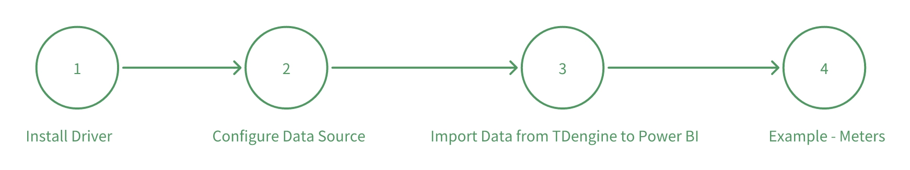

## Introduction

With the TDengine ODBC driver, PowerBI can access time series data stored in TDengine. You can import tag data, original time series data, or aggregated data into PowerBI from TDengine, to create reports or dashboard without any coding effort.

## Steps

### Prerequisites

1. TDengine server has been installed and running well.
2. Power BI Desktop has been installed and running. You can download and install the latest version for Windows X64 from [PowerBI](https://www.microsoft.com/download/details.aspx?id=58494).

## Install Driver

Depending on your TDengine server version, download the appropriate version of the TDengine Client package from the TDengine website [Download Link](https://docs.taosdata.com/get-started/package/). If you are using a local TDengine cluster the link to download the appropriate package can be found in Taos Explorer in the Tools->Power BI menu. Install the TDengine client package on same Windows machine where PowerBI is running.

### Configure Data Source

Please refer to [ODBC](../../client-libraries/odbc) to configure TDengine ODBC Driver with WebSocket connection.

### Import Data from TDengine to Power BI

1. Open Power BI and logon. Then add the data source by clicking on "Home Page" -> "Get Data" -> "Others" -> "ODBC" -> "Connect"

2. Choose a data source name, connect to the configured data source, go to the navigator, browse the tables of the selected database and load data.

3. If you want to input some specific SQL, click "Advanced Options", and input your SQL in the open dialog box and load the data.

To better use Power BI to analyze the data stored in TDengine, you need to understand the concepts of dimension, metric, time series, correlation, and use your own SQL to import data. 

1. dimension: Dimension is a category (text) data to describe such information as device, collection point, model. In the supertable template of TDengine, we use tag columns to store dimension information. You can use SQL such as `select distinct tbname, tag1, tag2 from supertable` to get dimensions. 

2. Metric: quantitive (numeric) fields that can be calculated, like SUM, AVERAGE, MINIMUM. If the collection frequency is 1 second, then there are 31,536,000 records in one year. It will be very inefficient to import so much data into Power BI. In TDengine, you can use data partition query, window partition query, in combination with pseudo columns related to window queries, to import downsampled data into Power BI. For more details, please refer to [TDengine Specialized Queries](https://docs.taosdata.com/taos-sql/distinguished/)。

  - Window partition query: For example, thermal meters collect at 1Hz, but you need to query the average temperature every 10 minutes. You can use the window subclause to get the downsampled data you need. The corresponding SQL is like `select tbname, _wstart date，avg(temperature) temp from table interval(10m)`, in which _wstart is a pseudo column indicating the start time of a widow, 10m is the duration of the window, `avg(temperature)` indicates the aggregate value inside a window. 

  - Data partition query: If you want to get the aggregate value across a lot of thermal meters, you can first partition the data and then perform a series of calculations in the partitioned data spaces. The SQL you need to use is `partition by part_list`. The most common use of partitioning is when querying a supertable. You can partition data by subtable according to tags to form the data of each subtable into a single time series to facilitate analytical processing of time series data.

3. Time Series: When curve plotting or aggregating data based on time lines, date is normally required. Data or time can be imported from Excel, or retrieved from TDengine using SQL statement like `select _wstart date, count(*) cnt from test.meters where ts between A and B interval(1d) fill(0)`, in which the fill() subclause indicates the fill mode when there is data missing. The pseudo column _wstart indicates the beginning of the time interval, in this case the date. 

4. Correlation: Indicates how to correlate data. Dimensions and metrics can be correlated by tbname or dates.

### Example - Meters

TDengine has its own specific data model which uses a "supertable" as a template and creates a specific table for each device. Each table can have maximum 4,096 data columns and 128 tags. In the example of smart meters, assuming each meter generates one record per second, there will be 86,400 records each day and 31,536,000 records every year. 1,000 meters will take up 500GB disk space. So, the common usage of Power BI should be mapping tags to dimension columns, mapping the aggregation of data columns to metric columns, to provide reports for decision makers.

1. Import dimensions

Import the tags of tables in PowerBI, and name as "tags", the SQL is like `select distinct tbname, groupid, location from test.meters;`. 

2. Import Metrics

In Power BI, import the average current, average voltage, average phase with 1 hour window, and name it as "data", the SQL is like `select tbname, _wstart ws, avg(current), avg(voltage), avg(phase) from test.meters PARTITION by tbname interval(1h)` .

3. Correlate dimensions and Metrics

In Power BI, open model view, correlate "tags" and "data", and set "tabname" as the correlation column, then you can use the data in histogram, pie chart, etc. For more information about building visual reports in PowerBI, please refer to [Power BI](https://learn.microsoft.com/power-bi/)。
