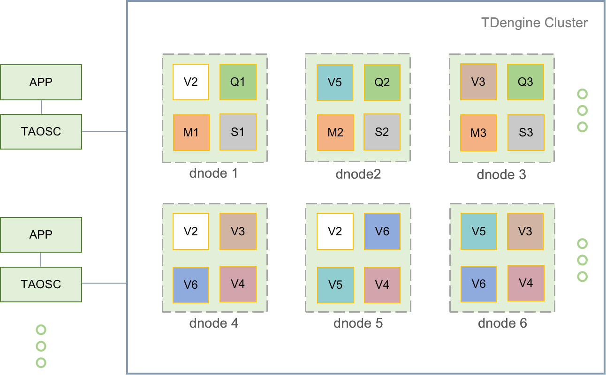
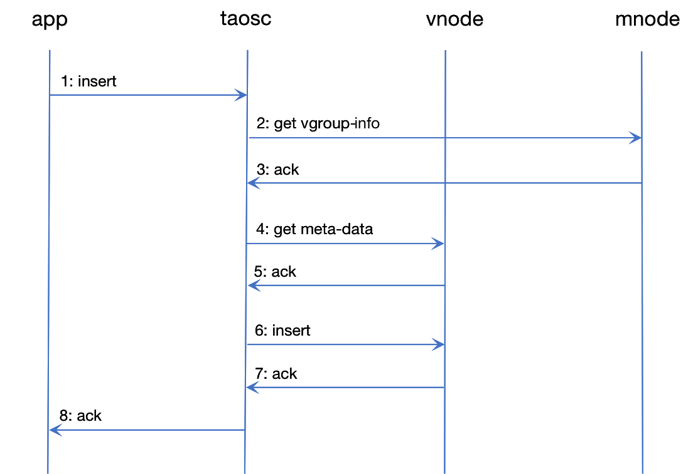
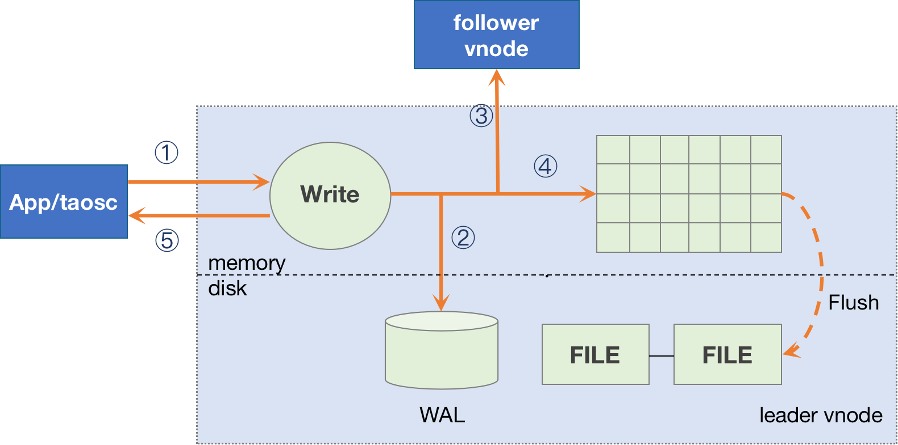
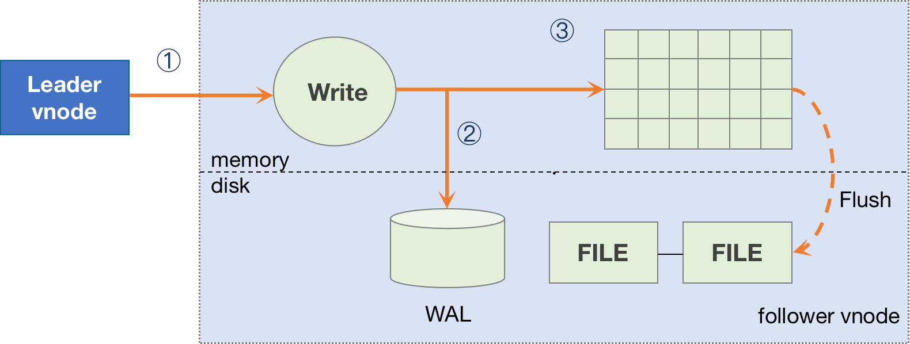

## Cluster and Primary Logic Unit

The design of TDengine is based on the assumption that any hardware or software system is not 100% reliable and that no single node can provide sufficient computing and storage resources to process massive data. Therefore, since day one, TDengine has been designed as a natively distributed system, with high-reliability architecture, and can be scaled out easily. Hardware failure or software failure of a single, or even multiple servers will not affect the availability and reliability of the system. At the same time, through node virtualization and automatic load-balancing technology, TDengine can make the most efficient use of computing and storage resources in heterogeneous clusters to reduce hardware resource needs significantly.

### Primary Logic Unit

Logical structure diagram of TDengine's distributed architecture is as follows:



<center> Figure 1: TDengine architecture diagram </center>

A complete TDengine system runs on one or more physical nodes. Logically, a complete system includes data node (dnode), TDengine client driver (TAOSC) and application (app). There are one or more data nodes in the system, which form a cluster. The application interacts with the TDengine cluster through TDengine client driver (TAOSC). The following is a brief introduction to each logical unit.

**Physical node (pnode)**: A pnode is a computer that runs independently and has its own computing, storage and network capabilities. It can be a physical machine, virtual machine, or Docker container installed with OS. The physical node is identified by its configured FQDN (Fully Qualified Domain Name). TDengine relies entirely on FQDN for network communication. If you don't know about FQDN, please check [wikipedia](https://en.wikipedia.org/wiki/Fully_qualified_domain_name).

**Data node (dnode):** A dnode is a running instance of the TDengine server `taosd` on a physical node (pnode). A working system must have at least one data node. A dnode contains zero to multiple virtual nodes (VNODE) and zero or at most one management node (mnode). The unique identification of a dnode in the system is determined by the instance's End Point (EP). EP is a combination of FQDN (Fully Qualified Domain Name) of the physical node where the dnode is located and the network port number (Port) configured by the system. By configuring different ports, a physical node (a physical machine, virtual machine or container) can run multiple instances or have multiple data nodes.

**Virtual node (vnode)**: To better support data sharding, load balancing and prevent data from overheating or skewing, data nodes are virtualized into multiple virtual nodes (vnode, V2, V3, V4, etc. in the figure). Each vnode is a relatively independent work unit, which is the basic unit of time-series data storage and has independent running threads, memory space and persistent storage path. A vnode contains a certain number of tables (data collection points). When a database is created, some vnodes are created for the database. The number of vnodes that can be created on a specific dnode depends on the available system resources. Each vnode must belong to a single DB, while each DB can have multiple vnodes. Each vnodes stores time series data plus the schema, tags of the tables hosted by it. A vnode is identified by the EP of the dnode it belongs to and the unique ID of the vgruop it belongs to. Vgroups are created and managed by mnode.

**Management node (mnode)**: A virtual logical unit (M in the figure) responsible for monitoring and maintaining the running status of all data nodes and load balancing among nodes. At the same time, the management node is also responsible for the storage and management of metadata (including users, databases, tables, static tags, etc.), so it is also called Meta Node. Multiple (up to 3) mnodes can be configured in a TDengine cluster, and they are automatically constructed into a virtual management node group (M0, M1, M2 in the figure). mnode adopts RAFT protocol to guarantee high data availability and high data reliability. Any data operation can only be performed through the Leader in the RAFT group. The first mnode in the mnode RAFT group is created automatically when the first dnode of the cluster is deployed. Other two follower mnodes need to be created through SQL command in TDengine CLI. There can be at most one mnode in a single dnode, and the mnode is identified by the EP of the dnode where it's located. Each dnode can communicate with each other to automatically get the EP of all mnodes. 

**Computation node (qnode)**: A virtual logical unit (Q in the figure) responsible for executing query and computing tasks including the `show` commands based on system built-in tables. There can be multiple qnodes configured in a TDengine cluster to share the query and computing tasks. A qnode is not coupled with a specific database, that means each qnode can execute the query tasks for multiple databases in parallel. There can be at most one qnode in a single dnode, and the qnode is identified by the EP of the dnode. TDengine client driver can get the list of qnodes through the communication with mnode. If there is no qnode available in the system, query and computing tasks are executed by vnodes. When a query task is executed, according to the execution plan, one or more qnodes may be scheduled by the scheduler to execute the task. qnode can get data from vnode, and send the execution result to other qnodes for further processing. With introducing qnodes, TDengine achieves the separation between storage and computing.

**Stream Processing node (snode)**: A virtual logical unit (S in the figure) responsible for stream processing tasks is introduced in TDengine. There can be multiple snodes configured in a TDengine cluster to share the burden of stream processing tasks. snode is not coupled with a specific stream, that means a single snode can execute the tasks of multiple streams. There can be at most one snode in a single dnode, it's identified by the EP of the dnode. mnode schedules available snodes to perform the stream processing tasks. If there is no snode available in the system, stream processing tasks are executed in vnodes.

**Virtual node group (VGroup)**: Vnodes on different data nodes can form a virtual node group to ensure the high availability of the system. The virtual node group is managed using RAFT protocol. Write operations can only be performed on the leader vnode, and then replicated to follower vnodes, thus ensuring that one single replica of data is copied on multiple physical nodes. The number of virtual nodes in a vgroup equals the number of data replicas. If the number of replicas of a DB is N, the system must have at least N data nodes. The number of replicas can be specified by the parameter `replica` when creating a DB, and the default is 1. Using the multiple replication feature of TDengine, the same high data reliability can be achieved without the need for expensive storage devices such as disk arrays. Virtual node groups are created and managed by the management node, and the management node assigns a system unique ID, aka VGroup ID, to each vgroup. Virtual nodes with the same vnode group ID belong to the same vgroup. If `replica` is set to 1, it means no data replication. The number of replication for a database can be dynamically changed to 3 for high data reliability. Even if a virtual node group is deleted, its ID will not be reused.

**TDengine client driver**: TAOSC is the abbreviation for TDengine client driver provided by TDengine to applications. It is responsible for dealing with the interaction between applications and the cluster, and provides the native interface for the C/C++ language. It is also embedded in the JDBC, C #, Python, Go, Node.js language connection libraries. Applications interact with the whole cluster through TDengine client driver instead of directly connecting to data nodes in the cluster. This module is responsible for obtaining and caching metadata; forwarding requests for insertion, query, etc, to the correct data node; when returning the results to the application, TAOSC also needs to be responsible for the final aggregation, sorting, filtering and other operations. For JDBC, C/C++/C#/Python/Go/Node.js interfaces, this module runs on the physical node where the application is located. Another critical component in TDengine product, named `taosAdapter` which provides fully distributed RESTful interface, also invokes TDengine client driver to communicate with TDengine cluster.

### Node Communication

**Communication mode**: The communication among data nodes of TDengine system, and among the client driver and each data node is carried out through TCP. TDengine automatically compress/decompress data and sign/authorize according to configuration and data packets.

**FQDN configuration:** A data node may have one or more FQDNs, which can be specified with the parameter `fqdn` in the system configuration file `taos.cfg`. If it is not specified, TDengine will automatically use the hostname of the computer as its FQDN. IP address also can be used to configure `fqdn` but it's not a recommended way because IP address may vary. Once the IP address is changed, the whole TDengine cluster will not work. The end point of a data node is composed of FQDN and prot number. It is necessary to ensure the DNS service is running or hosts files on nodes are configured properly to make sure FQDN works.

**Port configuration**: The port of a data node is configured with parameter `serverPort` in `taosc.cfg`.

**Cluster external connection**: TDengine cluster can accommodate a single, multiple or even thousands of data nodes. The application only needs to initiate a connection to any data node in the cluster. The network parameter required for connection is the End Point (FQDN plus configured port number) of a data node. When starting TDengine CLI `taos`, the FQDN of the data node can be specified through the option `-h`, and the configured port number can be specified through `-p`. If the port is not configured, the configuration parameter `serverPort` of TDengine will be used.

**Inter-cluster communication**: Data nodes connect with each other through TCP. When a data node starts, it will obtain the EP of the dnode where the mnode is located, and then establish a connection with the mnode to exchange information. There are three steps to obtain EP information of the mnode:

1. Check whether `dnode.json` file exists, if it does not exist or cannot be opened normally, skip to the second step;
2. Check the system configuration file `taos.cfg` to obtain node configuration parameters `firstEp` and `secondEp` (the nodes specified by these two parameters can be a normal node without mnode, in this case the node will try to redirect to the mnode node when connected). If these two configuration parameters do not exist or do not exist in taos.cfg or are invalid, skip to the third step;
3. Set your own EP as a mnode EP and run it independently. 

After obtaining the mnode EP list, the data node initiates the connection. It will successfully join the working cluster after connection is established successfully. If not successful, it will try the next item in the mnode EP list. If all attempts failed, the dnode will sleep for a few seconds and try again.

**Create MNODE**: The management node (mnode) in TDengine is a logical node without specific process. In other words, mnode also runs in a dnode, which is a real process on operating system. So which data node will be the management node? This is determined automatically by the system without any manual intervention. The principle is as follows: when the first dnode in the cluster starts, it becomes mnode automatically, and the other mnodes need to be created using SQL in TDengine CLI.

**Add new data nodes:** After the first data node starts successfully, the system can begin to work. There are two steps to add a new data node into the cluster.

- Step : Connect to the existing working data node using TDengine CLI, and then add the End Point of the new data node with the command "create dnode"
- Step 2: In the system configuration parameter file `taos.cfg` of the new data node, set the `firstEp` and `secondEp` parameters to the EP of any two data nodes in the existing cluster. If there is only one existing data node in the system, skip parameter `secondEp`. Please refer to the user tutorial for detailed steps. In this way, the cluster will be established step by step.

**Redirection**: Regardless of dnode or TAOSC, the connection to the mnode is initiated first. The mnode is automatically created and maintained by the system, so the user does not know which dnode is running the mnode. TDengine only requires a connection to any working dnode in the system. Because any running dnode maintains the currently running mnode EP List, when receiving a connecting request from the newly started dnode or TAOSC, if it's not an mnode itself, it will reply to the connection initiator with the mnode EP List. After receiving this list, TAOSC or the newly started dnode will try to establish the connection again with mnode. When the mnode EP List changes, each data node quickly obtains the latest list and notifies TAOSC through messaging interaction among nodes.

### A Typical Data Writing Process

To explain the relationship between vnode, mnode, TAOSC and application and their respective roles, the following is an analysis of a typical data writing process.



<center> Figure 2: Typical process of TDengine </center>

1. Application initiates a request to insert data through JDBC, or other APIs.
2. TAOSC checks the cache to see if the vgroups-info for the database being requested to insert data exists. If the vgroups-info exists, it goes straight to Step 4. Otherwise, TAOSC sends a get meta-data request to mnode.
3. Mnode returns the vgroups-info of the database to TAOSC. The vgroups-info contains the distribution of the vgroups of the database, and also the vgroup information to which the table belongs (the vnode ID and the End Point of the dnode where the table belongs. If the number of replicas is N, there will be N groups of End Points). If TAOSC does not receive a response from the mnode for a long time, and there are multiple mnodes, TAOSC will send a request to the next mnode.
4. TAOSC checks to see whether the metadata for the table to be inserted is in cache. If yes, skip to step 6; otherwise taosc sends a request to corresponding to get the metadata for the table.
5. vnode returns the metadata for the table to TAOSC, the metadata includes the table's schema.
6. TAOSC initiates an insert request to leader vnode of the table.
7. After vnode inserts the data, it gives a reply to TAOSC, indicating that the insertion is successful. If TAOSC doesn't get a response from vnode for a long time, TAOSC will treat this node as offline. In this case, if there are multiple replicas of the inserted database, TAOSC will issue an insert request to the next vnode in vgroup.
8. TAOSC notifies APP that writing is successful.

For Step 2, when TAOSC starts, it does not know the End Point of mnode, so it will directly initiate a request to the configured serving End Point of the cluster. If the dnode that receives the request does not have a mnode configured, it will reply with the mnode EP list, so that TAOSC will re-issue a request to the EP of another mnode to obtain meta-data .

For Step 4 and 6, without caching, TAOSC can't recognize the leader in the virtual node group, so assumes that the first vnode is the leader and sends a request to it. If this vnode is not the leader, it will reply to TAOSC with the actual leader, then TAOC will send a request to the true leader. Once a response of successful insertion is obtained, TAOSC will cache the information of leader node for further use.

The above flow describes the process of inserting data. The process of querying and computing are similar. TAOSC encapsulates and hides all these complicated processes so that it is transparent to applications.

Through TAOSC caching mechanism, mnode needs to be accessed only when a table is accessed for the first time, so mnode will not become a system bottleneck. However, because schema and vgroup may change (such as load balancing), TAOSC will interact with mnode regularly to automatically update the cache.

## Storage Model and Data Partitioning/Sharding

### Storage Model

The data stored by TDengine includes collected time-series data, metadata and tag data related to database and tablesetc. All of the data is specifically divided into three parts:

- Time-series data: stored in vnode and composed of data, head and last files. Normally the amount of time series data is very huge and query amount depends on the application scenario. Out-of-order writing is allowed. By adopting the model with **one table for each data collection point**, the data of a given time period is continuously stored, and the writing against one single table is a simple appending operation. Multiple records can be read at one time, thus ensuring the best performance for both insert and query operations of a single data collection point.
- Table Metadata: table meta data includes tags and table schema and is stored in meta file in each vnode. CRUD can be operated on table metadata. There is a specific record for each table, so the amount of table meta data depends on the number of tables. Table meta data is stored in LRU model and supports index for tag data. TDengine can support multiple queries in parallel. As long as the memory resource is enough, meta data is all stored in memory for quick access. The filtering on tens of millions of tags can be finished in a few milliseconds. Even though when the memory resource is not sufficient, TDengine can still perform high speed query on tens of millions of tables.
- Database Metadata: stored in mnode and includes system node, user, DB, table schema and other information. Four standard operations of create, delete, update and read are supported. The amount of this data is not large and can be stored in memory. Moreover, the number of queries is not large because of client cache. Even though TDengine uses centralized storage management, because of the architecture, there is no performance bottleneck.

Compared with the typical NoSQL storage model, TDengine stores tag data and time-series data completely separately. This has two major advantages:

- Reduces the redundancy of tag data storage significantly. General NoSQL database or time-series database adopts K-V (key-value) storage, in which the key includes a timestamp, a device ID and various tags. Each record carries these duplicated tags, so much storage space is wasted. Moreover, if the application needs to add, modify or delete tags on historical data, it has to traverse the data and rewrite them again, which is an extremely expensive operation.
- Aggregate data efficiently between multiple tables: when aggregating data between multiple tables, it first finds the tables which satisfy the filtering conditions, and then finds the corresponding data blocks of these tables. This greatly reduces the data sets to be scanned which in turn improves the aggregation efficiency. Moreover, tag data is managed and maintained in a full-memory structure, and tag data queries in tens of millions can return in milliseconds.

### Data Sharding

For large-scale data management, to achieve scale-out, it is generally necessary to adopt a Partitioning or Sharding strategy. TDengine implements data sharding via vnode, and time-series data partitioning via one data file for a time range.

VNode (Virtual Data Node) is responsible for providing writing, query and computing functions for collected time-series data. To facilitate load balancing, data recovery and support heterogeneous environments, TDengine splits a data node into multiple vnodes according to its computing and storage resources. The management of these vnodes is done automatically by TDengine and is completely transparent to the application.

For a single data collection point, regardless of the amount of data, a vnode (or vnode group, if the number of replicas is greater than 1) has enough computing resource and storage resource to process (if a 16-byte record is generated per second, the original data generated in one year will be less than 0.5 G). So TDengine stores all the data of a table (a data collection point) in one vnode instead of distributing the data to two or more dnodes. Moreover, a vnode can store data from multiple data collection points (tables), and the upper limit of the tables' quantity for a vnode is one million. By design, all tables in a vnode belong to the same DB. On a data node, unless specially configured, the number of vnodes owned by a DB will not exceed the number of system cores.

When creating a DB, the system does not allocate resources immediately. However, when creating a table, the system will check if there is an allocated vnode with free tablespace. If so, the table will be created in the vacant vnode immediately. If not, the system will create a new vnode on a dnode from the cluster according to the current workload, and then a table. If there are multiple replicas of a DB, the system does not create only one vnode, but a vgroup (virtual data node group). The system has no limit on the number of vnodes, which is just limited by the computing and storage resources of physical nodes.

The meta data of each table (including schema, tags, etc.) is also stored in vnode instead of centralized storage in mnode. In fact, this means sharding of meta data, which is good for efficient and parallel tag filtering operations.

### Data Partitioning

In addition to vnode sharding, TDengine partitions the time-series data by time range. Each data file contains only one time range of time-series data, and the length of the time range is determined by the database configuration parameter `duration`. This method of partitioning by time range is also convenient to efficiently implement data retention policies. As long as the data file exceeds the specified number of days (system configuration parameter `keep`), it will be automatically deleted. Moreover, different time ranges can be stored in different paths and storage media, so as to facilitate tiered-storage. Cold/hot data can be stored in different storage media to significantly reduce storage costs.

In general, **TDengine splits big data by vnode and time range in two dimensions** to manage the data efficiently with horizontal scalability.

## Data Writing and Replication Process

TDengine utilizes RAFT protocol to replicate data. If a database has N replicas, a virtual node group has N virtual nodes, N can be either 1 or 3. In each vnode group,  only one is the Leader and all others are followers. When the application writes a new record to system, only the Leader vnode can accept the writing request. If a follower vnode receives a writing request, the system will notify TAOSC to redirect the request to the leader.

### Leader vnode Writing Process

Leader Vnode uses a writing process as follows:



<center> Figure 3: TDengine Leader writing process </center>

1. Leader vnode receives the application data insertion request, verifies, and moves to next step;
2. Leader vnode will write the original request packet into database log file WAL. If the database configuration parameter `"wal_level"` is set to 1, vnode doesn't invoked fsync. If `wal_level` is set to 2, fsync is invoked according to another database parameter `wal_fsync_period`.
3. If there are multiple replicas, the leader vnode will forward data packet to follower vnodes in the same virtual node group, and the forwarded packet has a version number with data;
4. Leader vnode Writes the data into memory and add the record to "skip list";
5. Leader vnode returns a confirmation message to the application, indicating a successful write.
6. If any of Step 2, 3 or 4 fails, the error will directly return to the application.

### Follower vnode Writing Process

For a follower vnode, the write process as follows:



<center> Figure 4: TDengine Follower Writing Process </center>

1. Follower vnode receives a data insertion request forwarded by Leader vnode;
2. The behavior regarding `wal_level` and `wal_fsync_period` in a follower vnode is same as the leader vnode.
3. Write into memory and add the record to "skip list".

Compared with Leader vnode, follower vnode has no forwarding or reply confirmation step. But writing into memory and WAL is exactly the same.

### Leader/follower Selection

Vnode maintains a version number. When memory data is persisted, the version number is also persisted. For each data update operation, whether it is time-series data or metadata, this version number will be increased by one.

When a vnode starts, its role (leader, follower) is uncertain, and the data is in an unsynchronized state. It's necessary to establish TCP connections with other vnodes in the virtual node group and exchange status, including version and its own role. Through the exchange, the system implements a leader-selection process according to standard RAFT protocol.

### Synchronous Replication

For scenarios with strong data consistency requirements, asynchronous data replication is not enough, because there is a small probability of data loss. So, TDengine provides a synchronous replication mechanism for users to choose. When creating a database, in addition to specifying the number of replicas by parameter `replica`, user also needs to specify a new parameter `strict`. If `strict` is set to 1, it means the leader vnode can return success to the client only after over half of the followers vnodes have confirmed the data has been replicated to them. If any follower vnode is offline and the leader vnode can't get confirmation from over half of follower vnodes, the leader vnode will return failure to the client.

With synchronous replication, the system performance will decrease and latency will increase. Because metadata needs strong consistency, the default policy for data replication between mnodes is synchronous mode.

## Caching and Persistence

### Caching

TDengine adopts a time-driven cache management strategy (First-In-First-Out, FIFO), also known as a Write-driven Cache Management Mechanism. This strategy is different from the read-driven data caching mode (Least-Recent-Used, LRU), it directly puts the most recently written data in the system buffer. When the buffer reaches a threshold, the earliest data are written to disk in batches. Generally speaking, for the use of IoT data, users are most concerned about the most recently generated data, that is, the current status. TDengine takes full advantage of this feature to put the most recently arrived (current state) data in the buffer.

TDengine provides millisecond-level data collecting capability to users through query functions. Putting the recently arrived data directly in the buffer can respond to users' analysis query for the latest piece or batch of data more quickly, and provide faster database query response capability as a whole. In this sense, **TDengine can be used as a data cache by setting appropriate configuration parameters without deploying Redis or other additional cache systems**. This can significantly simplify the system architecture and reduce operational costs. It should be noted that after TDengine is restarted, the buffer of the system will be emptied, the previously cached data will be written to disk in batches, and the previously cached data will not be reloaded into the buffer. In this sense, TDengine's cache differs from proprietary key-value cache systems.

Each vnode has its own independent memory composed of multiple memory blocks of fixed size, and the memory of different vnodes are completely isolated. When writing data, similar to the writing of logs, data is sequentially added to memory, but each vnode maintains its own skip list for quick search. When more than one third of the memory block are used, the data will be persisted to disk storage, and the subsequent writing operation will be carried out in a new memory block. By this design, one third of the memory blocks in a vnode keeps the latest data, so as to achieve the purpose of caching and quick search. The number of memory blocks of a vnode is determined by the configuration parameter `buffer`.

### Persistent Storage

TDengine uses a data-driven method to write the data from buffer into hard disk for persistent storage. When the cached data in vnode reaches a certain amount, TDengine will pull up the disk-writing thread to write the cached data into persistent storage so that subsequent data writing is not blocked. TDengine will open a new database log file when the data is written, and delete the old database log file after successful persistence, to avoid unlimited log growth.

To make full use of the characteristics of time-series data, TDengine splits the data stored in persistent storage by a vnode into multiple files, each file only saves data for a fixed number of days, which is determined by the system configuration parameter `duration`. Thus for given start and end dates of a query, you can locate the data files to open immediately without any index. This greatly speeds up read operations.

For time-series data, there is generally a retention policy, which is determined by the system configuration parameter `keep`. Data files exceeding this set number of days will be automatically deleted by the system to free up storage space.

Given `duration` and `keep` parameters, the total number of data files in a vnode is: round up of (keep/duration+1). The total number of data files should not be too large or too small. 10 to 100 is appropriate. Based on this principle, reasonable `duration` can be set. In the current version, parameter `keep` can be modified, but parameter `duration` cannot be modified once it is set.

In each data file, the data of a table is stored in blocks. A table can have one or more data file blocks. In a file block, data is stored in columns, occupying a continuous storage space, thus greatly improving the reading speed. The size of file block is determined by the system parameter `maxRows` (the maximum number of records per block), and the default value is 4096. This value should not be too large or too small. If it is too large, data location for queries will take a longer time. If it is too small, the index of data block is too large, and the compression efficiency will be low with slower reading speed.

Each data file (with a .data postfix) has a corresponding index file (with a .head postfix). The index file has summary information of a data block for each table, recording the offset of each data block in the data file, start and end time of data and other information which allows the system to locate the data to be found very quickly. Each data file also has a corresponding last file (with a .last postfix), which is designed to prevent data block fragmentation when written in disk. If the number of written records from a table does not reach the system configuration parameter `minRows` (minimum number of records per block), it will be stored in the last file first. At the next write operation to the disk, the newly written records will be merged with the records in last file and then written into data file.

When data is written to disk, the system decides whether to compress the data based on the database configuration parameter `comp`. TDengine provides three compression options: no compression, one-stage compression and two-stage compression, corresponding to comp values of 0, 1 and 2 respectively. One-stage compression is carried out according to the type of data. Compression algorithms include delta-delta coding, simple 8B method, zig-zag coding, LZ4 and other algorithms. Two-stage compression is based on one-stage compression and compressed by general compression algorithm, which has higher compression ratio.

### Tiered Storage

By default, TDengine saves all data in /var/lib/taos directory, and the data files of each vnode are saved in a different directory under this directory. In order to expand the storage space, minimize the bottleneck of file reading and improve the data throughput rate, TDengine can configure the system parameter "dataDir" to allow multiple mounted hard disks to be used by system at the same time. In addition, TDengine also provides the function of tiered data storage, i.e. storage on different storage media according to the time stamps of data files. For example, the latest data is stored on SSD, the data older than a week is stored on local hard disk, and data older than four weeks is stored on network storage device. This reduces storage costs and ensures efficient data access. The movement of data on different storage media is automatically done by the system and is completely transparent to applications. Tiered storage of data is also configured through the system parameter "dataDir".

dataDir format is as follows:

```
dataDir data_path [tier_level]
```

Where data_path is the folder path of mount point and tier_level is the media storage-tier. The higher the media storage-tier, means the older the data file. Multiple hard disks can be mounted at the same storage-tier, and data files on the same storage-tier are distributed on all hard disks within the tier. TDengine supports up to 3 tiers of storage, so tier_level values are 0, 1, and 2. When configuring dataDir, there must be only one mount path without specifying tier_level, which is called special mount disk (path). The mount path defaults to level 0 storage media and contains special file links, which cannot be removed, otherwise it will have a devastating impact on the written data.

Suppose there is a physical node with six mountable hard disks/mnt/disk1,/mnt/disk2, ..., /mnt/disk6, where disk1 and disk2 need to be designated as level 0 storage media, disk3 and disk4 are level 1 storage media, and disk5 and disk6 are level 2 storage media. Disk1 is a special mount disk, you can configure it in/etc/taos/taos.cfg as follows:

```
dataDir /mnt/disk1/taos
dataDir /mnt/disk2/taos 0
dataDir /mnt/disk3/taos 1
dataDir /mnt/disk4/taos 1
dataDir /mnt/disk5/taos 2
dataDir /mnt/disk6/taos 2
```

Mounted disks can also be a non-local network disk, as long as the system can access it.

Note: Tiered Storage is only supported in Enterprise Edition

## Data Query

TDengine provides a variety of query processing functions for tables and STables. In addition to common aggregation queries, TDengine also provides window queries and statistical aggregation functions for time-series data. Query processing in TDengine needs the collaboration of client, vnode, qnode and mnode. A complex aggregate query on a super table may need multiple vnodes and multiple qnodes to share the query and computing tasks.

### Query Process

1. TDengine client driver `taosc` parses the SQL statement and generates an abstract syntax tree (AST), then checks and verifies the AST according to metadata. During this stage, the metadata management module in `taosc` (Catalog) requests the metadata of the involved database and table from mnode and vnode.
2. After the verification passes, `taosc` generates distributed query plan and optimizes the plan.
3. `taosc` schedules the tasks according to configured query policy, a query sub-task may be scheduled to a vnode or qnode according to data relative and system load. Please be noted that both vnode and qnode are logic execution unit, the physical execution node is dnode (data node).
4. When a dnode receives a query request, it identifies which vnode or qnode this query request is targeted, and forwards the request to the query execution queue of the identified vnode or qnode.
5. The query execution thread of the vnode or qnode establishes fundamental query execution context, and executes the query, and notifies the client once obtaining a part of result data.
6. TDengine client driver `taosc` will initiate next level query tasks or obtain the result simply.

### Aggregation by Time Axis, Downsampling, Interpolation

Time-series data is different from ordinary data in that each record has a timestamp. So aggregating data by timestamps on the time axis is an important and distinct feature of time-series databases compared with common databases. It is similar to the window query of stream computing engines.

The keyword `interval` is introduced into TDengine to split fixed length time windows on the time axis. The data is aggregated based on time windows, and the data within time window ranges is aggregated as needed. For example:

```mysql
select count(*) from d1001 interval(1h);
```

For the data collected by device D1001, the number of records stored per hour is returned by a 1-hour time window.

In application scenarios where query results need to be obtained continuously, if there is data missing in a given time interval, the data results in this interval will also be lost. TDengine provides a strategy to interpolate the results of timeline aggregation calculation. The results of time axis aggregation can be interpolated by using keyword Fill. For example:

```mysql
select count(*) from d1001 interval(1h) fill(prev);
```

In case that the query result needs to be obtained continuously, if there is data loss in a given time range, the resulting data for the time range may be lost too. TDengine provides interpolation for the aggregation result by time window, using `fill` keyword. For example:

```sql
SELECT COUNT(*) FROM d1001 WHERE ts >= '2017-7-14 00:00:00' AND ts < '2017-7-14 23:59:59' INTERVAL(1h) FILL(PREV);
```

For the data collected by device D1001, the number of records per hour is counted. If there is no data in a certain hour, statistical data of the previous hour is returned. TDengine provides forward interpolation (prev), linear interpolation (linear), NULL value filling (NULL), and specific value filling (value).

### Multi-table Aggregation Query

TDengine creates a separate table for each data collection point, but in practical applications, it is often necessary to aggregate data from different data collection points. In order to perform aggregation operations efficiently, TDengine introduces the concept of STable (super table). STable is used to represent a specific type of data collection points. It is a table set containing multiple tables. The schema of each table in the set is the same, but each table has its own static tags. There can be multiple tags which can be added, deleted and modified at any time. Applications can aggregate or statistically operate on all or a subset of tables under a STable by specifying tag filters. This greatly simplifies the development of applications. The process for aggregation across multiple tables is shown in the following figure:


<center> Figure 5: Diagram of multi-table aggregation query </center>

1. Client requests the metadata for the database and tables from mnode
2. mnode returns the requested metadata
3. Client sends query requests to every vnode of the STable
4. Each vnode performs query locally, and returns the query response to client
5. Client sends query request to aggregation node, i.e. qnode
6. qnode requests the query result data from the vnodes involved 
7. Each vnode returns its local query result data
8. qnode aggregates the result and returns the final result to the client

Since TDengine stores tag data and time-series data separately in vnode, filtering tag data in memory and finding the set of tables that need to participate in aggregation operation can reduce the volume of data to be scanned and improves aggregation speed. At the same time, because the data is distributed in multiple vnodes/dnodes, the aggregation operation is carried out concurrently in multiple vnodes, which further improves the aggregation speed. Aggregation functions and most operations for ordinary tables are applicable to STables. The syntax is exactly the same. Please see TDengine SQL for details.

### Precomputation

In order to effectively improve the performance of query processing, based-on the unchangeable feature of IoT data, statistical information of data stored in data block is recorded in the head of data block, including max value, min value, and sum. We call it a precomputing unit. If the query processing involves all the data of a whole data block, the pre-calculated results are directly used, and no need to read the data block contents at all. Since the amount of pre-calculated data is much smaller than the actual size of data block stored on disk, for query processing with disk IO as bottleneck, the use of pre-calculated results can greatly reduce the pressure of reading IO and accelerate the query process. The precomputation mechanism is similar to the BRIN (Block Range Index) of PostgreSQL.
