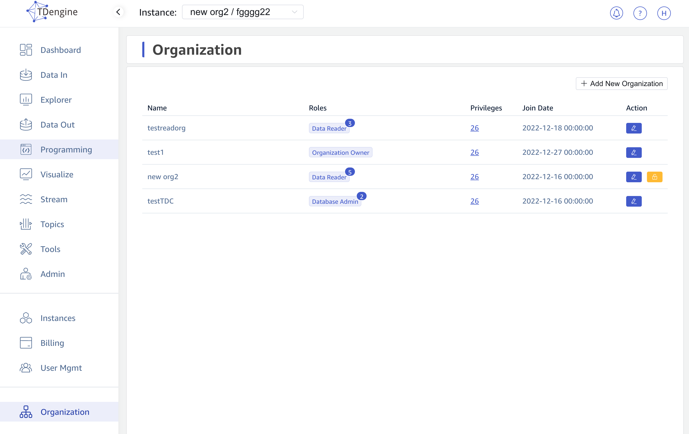

TDengine Cloud provides a list page for the user to manage his organizations. On this page, you can get all the organizations which you can have permission to view or edit.  In each line of the organization list, you can get the name of the organization, roles which you have in the organization and the actions you can operate.

In the **Role** column, click the value will pop up the details of the roles you assiged in the current selected organization. And in the **Privileges** column, click the value will also pop up the details of the privileges you owned in the organization level.

## Add New Organization

You can click **Add New Organization** button on the right top of the organization list to open the **Add New Organization** dialog. In the opened dialog, input the specific name then click **Create** button to create a new organization.

## Change Organization Name

You can click **Edit** icon of each organization **Action** area to open the **Change Organization** dialog to change the name of the selected organization. In the opened dialog, change the name text and then click **Change** button to save the changed name.

## Transfer Organization Owner

If you select the organization in the left header and you are the owner of it, the same organization line will show you the **Transfer Organization Owner** aciton icon. Then click the icon will show you the **Transfer Organization Owner** dialog. In the opened dialog, you can select another active user of the organization. Then the selected active user will receive a notification email about the tranformation operation.

