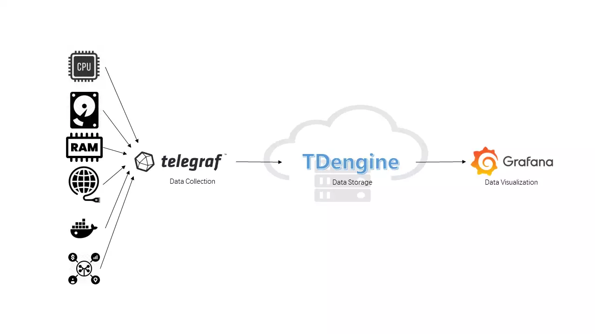

## Background

TDengine is a big data platform designed and optimized for IoT (Internet of Things), Vehicle Telemetry, Industrial Internet, IT DevOps and other applications. Since it was open-sourced in July 2019, it has won the favor of a large number of time-series data developers with its innovative data modeling design, convenient installation, easy-to-use programming interface, and powerful data writing and query performance.

IT DevOps metric data usually are time sensitive, for example:

- System resource metrics: CPU, memory, IO, bandwidth, etc.
- Software system metrics: health status, number of connections, number of requests, number of timeouts, number of errors, response time, service type, and other business-related metrics.

Current mainstream IT DevOps system usually include a data collection module, a data persistent module, and a visualization module; Telegraf and Grafana are one of the most popular data collection modules and visualization modules, respectively. The data persistence module is available in a wide range of options, with OpenTSDB or InfluxDB being the most popular. TDengine, as an emerging time-series big data platform, has the advantages of high performance, high reliability, easy management and easy maintenance.

This article introduces how to quickly build a TDengine + Telegraf + Grafana based IT DevOps visualization system without writing even a single line of code and by simply modifying a few lines in configuration files. The architecture is as follows.



## Installation steps

### Installing Telegraf, Grafana and TDengine

To install Telegraf, Grafana, and TDengine, please refer to the relevant official documentation.

### Telegraf

Please refer to the [official documentation](https://portal.influxdata.com/downloads/).

### Grafana

Please refer to the [official documentation](https://grafana.com/grafana/download).

### TDengine

Download and install the [latest version of TDengine](https://docs.tdengine.com/releases/tdengine/).

## Data Connection Setup

### Install Grafana Plugin and Configure Data Source

Please refer to [Install Grafana Plugin and Configure Data Source](../../third-party/grafana/#install-grafana-plugin-and-configure-data-source)

### Modify /etc/telegraf/telegraf.conf

For the configuration method, add the following text to `/etc/telegraf/telegraf.conf`, where `database name` should be the name where you want to store Telegraf data in TDengine, `TDengine server/cluster host`, `username` and `password` please fill in the actual TDengine values.

```text
[[outputs.http]]
  url = "http://<TDengine server/cluster host>:6041/influxdb/v1/write?db=<database name>"
  method = "POST"
  timeout = "5s"
  username = "<TDengine's username>"
  password = "<TDengine's password>"
  data_format = "influx"
```

Then restart telegraf:

```bash
sudo systemctl start telegraf
```

### Importing the Dashboard

Log in to the Grafana interface using a web browser at `IP:3000`, with the system's initial username and password being `admin/admin`.
Click on the gear icon on the left and select `Plugins`, you should find the TDengine data source plugin icon.
Click on the plus icon on the left and select `Import` to get the data from `https://github.com/taosdata/grafanaplugin/blob/master/examples/telegraf/grafana/dashboards/telegraf-dashboard-v3.json` (for TDengine 3.0. for TDengine 2.x, please use `telegraf-dashboard-v2.json`), download the dashboard JSON file and import it. You will then see the dashboard in the following screen.


## Wrap-up

The above demonstrates how to quickly build a IT DevOps visualization system. Thanks to the schemaless protocol parsing feature in TDengine and ability to integrate easily with a large software ecosystem, users can build an efficient and easy-to-use IT DevOps visualization system in just a few minutes.
Please refer to the official documentation and product implementation cases for other features.
