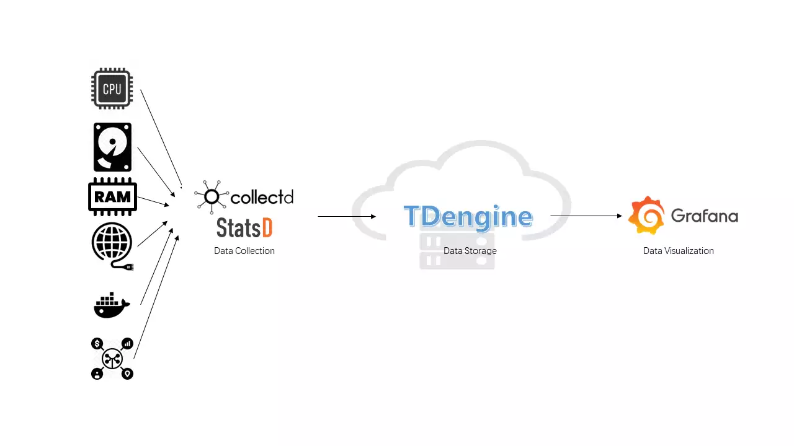
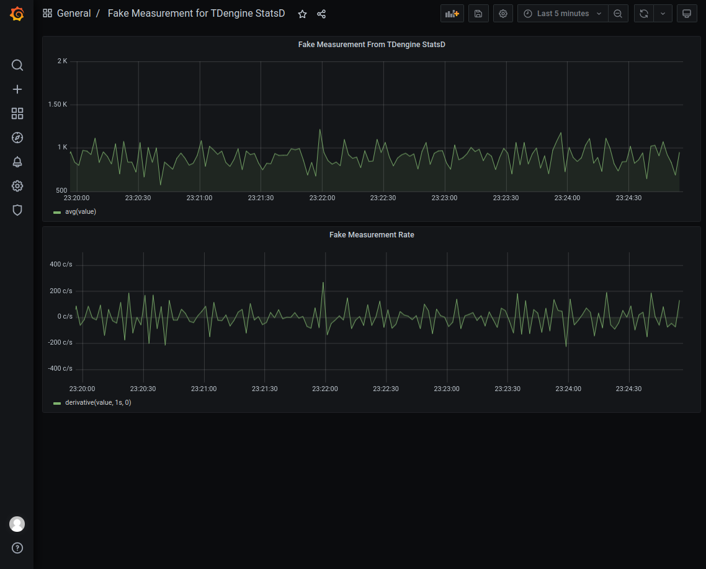

## Background

TDengine is a big data platform designed and optimized for IoT (Internet of Things), Vehicle Telemetry, Industrial Internet, IT DevOps and other applications. Since it was open-sourced in July 2019, it has won the favor of a large number of time-series data developers with its innovative data modeling design, convenient installation, easy-to-use programming interface, and powerful data writing and query performance.

IT DevOps metric data usually are time sensitive, for example:

- System resource metrics: CPU, memory, IO, bandwidth, etc.
- Software system metrics: health status, number of connections, number of requests, number of timeouts, number of errors, response time, service type, and other business-related metrics.

The current mainstream IT DevOps visualization system usually contains a data collection module, a data persistence module, and a visual display module. collectd/StatsD, as an old-fashion open source data collection tool, has a wide user base. However, collectd/StatsD has limited functionality, and often needs to be combined with Telegraf, Grafana, and a time-series database to build a complete monitoring system.
The new version of TDengine supports multiple data protocols and can accept data from collectd and StatsD directly, and provides Grafana dashboard for graphical display.

This article introduces how to quickly build an IT DevOps visualization system based on TDengine + collectd / StatsD + Grafana without writing even a single line of code but by simply modifying a few lines in configuration files. The architecture is shown in the following figure.



## Installation Steps

To install collectd, StatsD, Grafana, and TDengine, please refer to the official documentation.

### Installing collectd

Please refer to the [official documentation](https://collectd.org/documentation.shtml).

### Installing StatsD

Please refer to the [official documentation](https://github.com/statsd/statsd).

### Install Grafana

Please refer to the [official documentation](https://grafana.com/grafana/download).

### Install TDengine

Download and install the [latest version of TDengine](https://docs.tdengine.com/releases/tdengine/).

## Data Connection Setup

### Install Grafana Plugin and Configure Data Source

Please refer to [Install Grafana Plugin and Configure Data Source](../../third-party/grafana/#install-grafana-plugin-and-configure-data-source)

### Configure collectd

Add the following to the `/etc/collectd/collectd.conf` file, where the `host` and `port` should be the actual values of the TDengine and taosAdapter configurations.

```text
LoadPlugin network
<Plugin network>
  Server "<TDengine cluster/server host>" "<port for collectd>"
</Plugin>

sudo systemctl start collectd
```

### Configure StatsD

Start StatsD after adding the following to the `config.js` file, where the `host` and `port` are the actual values of the TDengine and taosAdapter configurations.

```text
backends section add ". /backends/repeater"
Add { host:'<TDengine server/cluster host>', port: <port for StatsD>} to the repeater section
```

### Importing the Dashboard

Use a web browser to access the server running Grafana on port 3000 `host:3000` to log into the Grafana interface with the initial system username and password of `admin/admin`.
Click on the gear icon on the left and select `Plugins`, you should find the TDengine data source plugin icon.

#### Importing the collectd dashboard

Download the dashboard json from `https://github.com/taosdata/grafanaplugin/blob/master/examples/collectd/grafana/dashboards/collect-metrics-with-tdengine-v0.1.0.json`, click the plus icon on the left and select Import, follow the instructions to import the JSON file. After that, you can see
The dashboard can be seen in the following screen.


#### import collectd dashboard

Download the dashboard json file from `https://github.com/taosdata/grafanaplugin/blob/master/examples/collectd/grafana/dashboards/collect-metrics-with-tdengine-v0.1.0.json`. Download the dashboard json file, click the plus icon on the left side and select `Import`, and follow the interface prompts to select the JSON file to import. After that, you can see
dashboard with the following interface.


#### Importing the StatsD dashboard

Download the dashboard json from `https://github.com/taosdata/grafanaplugin/blob/master/examples/statsd/dashboards/statsd-with-tdengine-v0.1.0.json`. Click on the plus icon on the left and select `Import`, and follow the interface prompts to import the JSON file. You will then see the dashboard in the following screen.


## Wrap-up

TDengine, as an emerging time-series big data platform, has the advantages of high performance, high reliability, easy management and easy maintenance. Thanks to the new schemaless protocol parsing feature in TDengine and ability to integrate easily with a large software ecosystem, users can build an efficient and easy-to-use IT DevOps visualization system, or adapt an existing system, in just a few minutes.

For TDengine's powerful data writing and querying performance and other features, please refer to the official documentation and successful product implementation cases.
