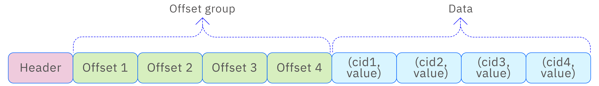
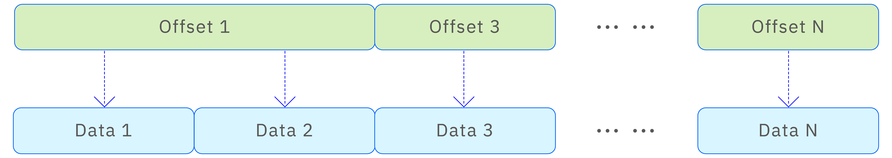
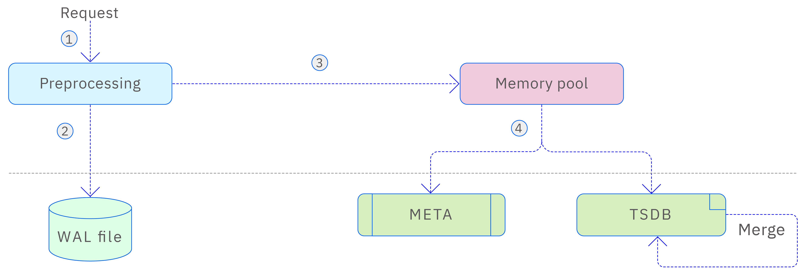
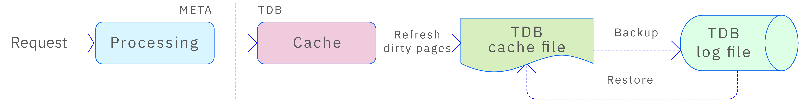
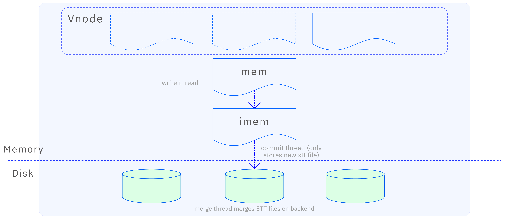
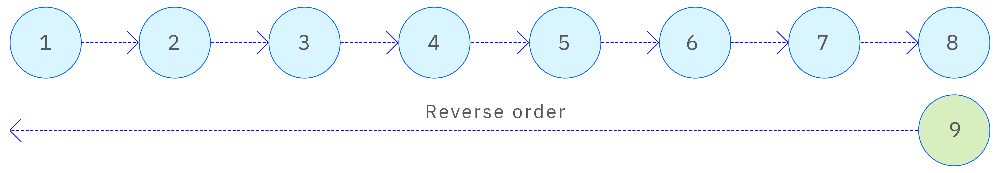
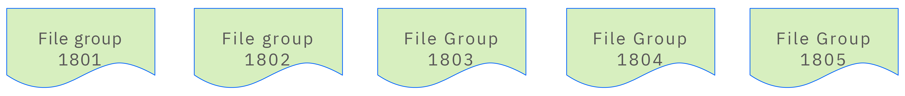
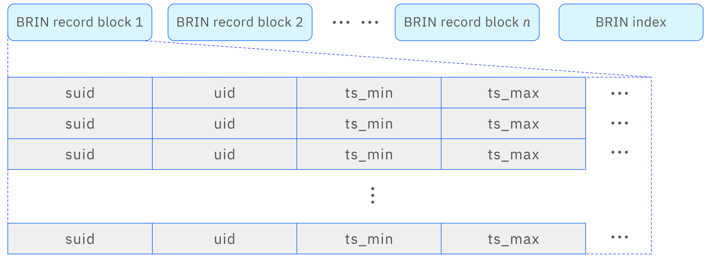

The core competitiveness of TDengine lies in its **outstanding write and query performance**. Unlike traditional general-purpose databases, TDengine has focused from its inception on the unique characteristics of time-series data. It fully leverages the time-order, continuity, and high concurrency of time-series data, developing a custom **write and storage algorithm** tailored specifically for time-series data.

This algorithm pre-processes and compresses time-series data, significantly boosting write speed while reducing storage space consumption. This optimized design ensures that even in scenarios with massive inflows of real-time data, TDengine can maintain **ultra-high throughput and rapid response times**.

## Row and Column Formats

The **row and column format** is one of the most important data structures in TDengine. Although several open-source, standardized libraries exist (like Apache Arrow), TDengine's highly specific focus and higher performance requirements prompted it to design its own format library. This custom design allows TDengine to fully utilize the characteristics of time-series scenarios, achieving high performance with minimal space usage. Key requirements of this format include:

- **Support for distinguishing between unspecified values (NONE) and null values (NULL).**
- **Handling mixed scenarios** where NONE, NULL, and actual values coexist.
- **Efficient processing of both sparse and dense data.**

### Row Formats

TDengine supports two encoding formats for rows: **Tuple Encoding** and **Key-Value Encoding**. The encoding method used depends on the characteristics of the data, ensuring the most efficient handling of different scenarios.

1. **Tuple Encoding**

   Tuple encoding is ideal for non-sparse data scenarios, such as when all columns contain non-NONE data or have only a few NONE values. With tuple encoding, columns are accessed directly based on **offsets provided by the table schema** with **O(1) time complexity**, enabling fast access. See the diagram below:

   

2. **Key-Value Encoding**

   Key-value encoding is well-suited for sparse data scenarios where tables have **thousands of columns** but only a few contain actual values. Using traditional tuple encoding in such cases would lead to significant space waste. Key-value encoding drastically reduces the storage space used for rows. As shown below:

   

   Key-value encoded rows use an **offset array** to index column values. Although this access method is slower than direct column access, it saves substantial storage space. Additionally, **space optimization** is achieved through flag options. Specifically:
   - If all offsets are < 256, the array uses **uint8_t**.
   - If all offsets are < 65,536, it uses **uint16_t**.
   - In other cases, it uses **uint32_t**.

   This design further enhances space utilization efficiency.

### Column Formats

In TDengine, fixed-length column data can be treated as arrays. However, since NONE, NULL, and actual values can coexist, the column format requires a **bitmap** to indicate whether each indexed value is NONE, NULL, or has a value. For variable-length data, the column format differs. In addition to the data array, it includes an **offset array** to mark the starting position of each data segment. The length of variable-length data is determined by the difference between adjacent offsets. This design ensures efficient data storage and access, as shown below:

## `vnode` Storage

### `vnode` Storage Architecture

The **vnode** is the basic unit of data storage, querying, and backup in TDengine. Each vnode stores metadata for some tables along with all time-series data belonging to those tables. The distribution of tables across vnodes is determined by **consistent hashing**, with each vnode functioning like a standalone database. A vnode’s storage is divided into three parts, as shown below:

- **WAL (Write-Ahead Log) storage**
- **Metadata storage**
- **Time-series data storage**

When a vnode receives a **write request**, it first performs **pre-processing** to ensure data consistency across multiple replicas. This pre-processing ensures data safety and consistency. Once pre-processing is complete, the data is written to the **WAL** to guarantee durability. The data is also stored in the **vnode’s memory pool**. When the memory pool reaches a certain threshold, a **background thread** flushes the data to disk for persistence (both metadata and time-series data). The corresponding WAL entry is then marked as flushed.

The **time-series data** in TDengine uses an **LSM (Log-Structured Merge-Tree) storage structure**. When accessing low-frequency parameters across multiple tables, the system merges TSDB data files in the background to reduce the number of files and improve query performance. This design ensures efficient data storage and access.

### Metadata Storage

The metadata stored in a vnode mainly includes table metadata information, such as the name of the supertable, the schema definition of the supertable, the tag schema definition, the names of child tables, the tag information of child tables, and the index of tags. Since metadata queries are much more frequent than write operations, TDengine uses B+Tree as the storage structure for metadata. B+Tree, with its efficient query performance and stable insertion and deletion operations, is well-suited for handling such read-heavy and write-light scenarios, ensuring the efficiency and stability of metadata management. The metadata writing process is illustrated in the following diagram:

When the META module receives a metadata write request, it generates multiple key-value data pairs and stores these pairs in the underlying TDB storage engine. TDB is a B+Tree-based storage engine developed by TDengine to meet its specific needs. It consists of three main components—an internal cache, the main TDB storage file, and TDB's log file. When writing data to TDB, the data is first written to the internal cache. If the cache memory is insufficient, the system requests additional memory from the vnode's memory pool. If the write operation involves modifying existing data pages, the system writes the unchanged data pages to the TDB log file as a backup before making modifications. This ensures atomicity and data integrity by allowing rollback to the original data in the event of power loss or other failures.

Since vnodes store various metadata information and metadata queries are diverse, multiple B+Trees are created within the vnode to store index information from different dimensions. All these B+Trees are stored in a shared storage file and indexed by a root B+Tree with a root page number of 1, as shown in the diagram below:

The B+Tree page structure is illustrated in the following diagram:

In TDB, both keys and values are variable-length. To handle cases where keys or values exceed the size of a file page, TDB uses overflow pages to store the excess data. Additionally, to effectively control the height of the B+Tree, TDB limits the maximum length of keys and values in non-overflow pages, ensuring that the fan-out degree of the B+Tree is at least 4.

### Time-Series Data Storage

Time-series data in a vnode is stored through the TSDB engine. Given the massive nature of time-series data and its continuous write traffic, using traditional B+Tree structures would lead to rapid tree height growth as the data volume increases, significantly degrading query and write performance, potentially rendering the engine unusable. Therefore, TDengine employs the LSM (Log-Structured Merge-Tree) storage structure to manage time-series data. LSM optimizes write performance through log-structured storage and reduces storage space usage while improving query efficiency through background merging operations, ensuring the storage and access performance of time-series data. The TSDB engine's write process is illustrated below:

In the MemTable, data is indexed using a combination of Red-Black Trees and SkipLists. Data from different tables is stored in Red-Black Trees, while data within the same table is indexed using SkipLists. This design leverages the characteristics of time-series data to enhance storage and access efficiency.

A Red-Black Tree is a self-balancing binary tree that maintains balance through node coloring and rotation operations, ensuring query, insertion, and deletion operations have a time complexity of O(log n). In the MemTable, Red-Black Trees are used to store data from different tables.

A SkipList is a data structure based on ordered linked lists, with multiple levels of indexes added to enable fast lookups. SkipLists provide query, insertion, and deletion operations with a time complexity of O(log n), comparable to Red-Black Trees. In the MemTable, SkipLists are used to index data within the same table, enabling quick location of data within specific time ranges to support efficient time-series data queries and writes.

By combining Red-Black Trees and SkipLists, TDengine implements an efficient data indexing mechanism within the MemTable, enabling fast access to data from different tables and quick location of data within specific time ranges within the same table. The SkipList index structure is shown below:

In the TSDB engine, data is sorted by (ts, version) tuples, both in memory and on disk. To better manage and organize this time-ordered data, the TSDB engine divides data files into multiple file sets based on time ranges. Each file set covers data from a specific time range, ensuring data continuity and completeness while facilitating data sharding and partitioning operations. By organizing data into multiple file sets based on time, the TSDB engine effectively manages and accesses data stored on disk. The file set structure is shown below:

When querying data, the file set number can be quickly calculated based on the query's time range, enabling fast location of the target file set. This design significantly improves query performance by reducing unnecessary file scans and data loading, directly pinpointing the file set containing the required data. The following sections describe the contents of the file sets:

#### Head File

The head file is the Block Range Index (BRIN) file for the time-series data storage files (data files). It stores the time range, offset, and length information for each data block.

Using the information in the head file, the query engine can efficiently filter data blocks based on the queried time range and obtain the location of these data blocks.

The head file contains multiple BRIN record blocks and their indexes. The BRIN record blocks use columnar compression, significantly reducing space usage while maintaining high query performance. The BRIN index structure is illustrated below:

#### Data File

The data file stores the actual time-series data. Data is stored in blocks, with each block containing columnar storage of a certain amount of data. Depending on the data type and compression configuration, different compression algorithms are used for data blocks to reduce storage space usage and improve data transmission efficiency.

Unlike stt files, each data block is independently stored within the data file, representing the data of a table for a specific time range. This design ensures flexible and efficient data management and querying. By storing data in blocks and combining columnar storage with compression techniques, the TSDB engine effectively handles and accesses time-series data, meeting the demands of large data volumes and fast queries.

#### SMA File

The SMA file stores precomputed results for each column in the data blocks, such as the sum, minimum value, and maximum value of the data. By using these precomputed results, the query engine can directly utilize them for certain queries, avoiding the need to access the raw data.

#### Tomb File

The tomb file stores deletion records in the form of (suid, uid, start_timestamp, end_timestamp, version) tuples.

#### STT File

In scenarios with a small number of high-frequency tables, the system maintains only one stt file. This file stores the fragmented data remaining after each data flush. During the next data flush, the fragmented data is merged with new data from memory to form larger data blocks, which are then written to the data file. This mechanism effectively avoids data fragmentation, ensuring continuous and efficient data storage.

In scenarios with multiple low-frequency tables, it is recommended to configure multiple stt files. The core idea in such scenarios is that although individual tables may not generate large amounts of data during each flush, the accumulated data from all child tables under the same supertable can be substantial. By merging this data, larger data blocks can be generated, reducing data fragmentation. This improves write efficiency and significantly enhances query performance, as continuous data storage facilitates faster data retrieval and access.
