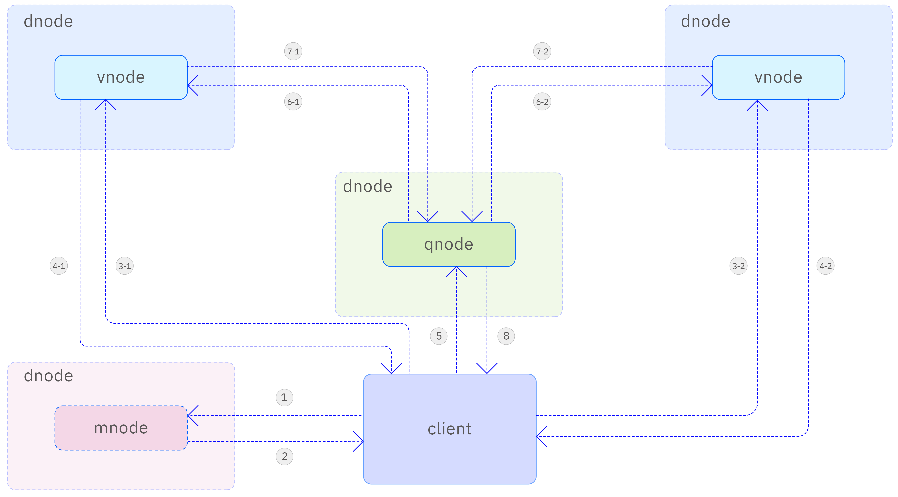
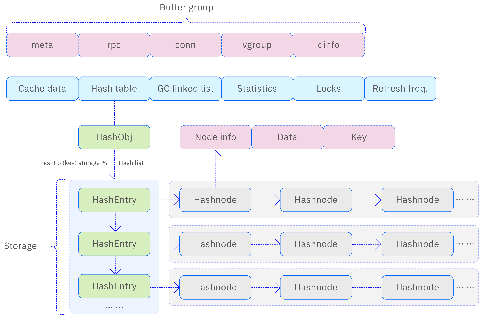

As a high-performance time-series big data platform, TDengine’s query and computation capabilities are core components. The platform offers rich query processing features, including not only standard aggregate queries but also advanced functionalities like time-series window queries and statistical aggregation. These query tasks require close collaboration between taosc, vnode, qnode, and mnode. In a complex supertable aggregation query scenario, multiple vnodes and qnodes may need to work together to handle the query and computation tasks. For definitions and introductions to vnode, qnode, and mnode, please refer to [Architecture](../architecture/).

## Roles of Modules in Query Computation

### taosc

taosc is responsible for parsing and executing SQL. For `insert` SQL types, taosc uses a streaming read-and-parse strategy to improve efficiency. For other SQL types, taosc first breaks down the SQL into an Abstract Syntax Tree (AST) using a syntax parser, performing initial syntax checks. If syntax errors are detected, taosc returns an error message along with the specific location of the error to help users quickly identify and correct it.

The parsed AST is further converted into a logical query plan, which, after optimization, is transformed into a physical query plan. The taosc scheduler then converts the physical query plan into tasks and assigns them to selected vnodes or qnodes for execution. Once the query results are ready, taosc retrieves them from the corresponding vnode or qnode and returns them to the user.

The taosc execution process can be summarized as: parse SQL into AST, generate and optimize the logical query plan, convert it into a physical query plan, schedule query tasks to vnode or qnode, and retrieve query results.

### mnode

In a TDengine cluster, supertable information and basic information about the metadata database are well managed. As a metadata server, mnode responds to taosc’s metadata query requests. When taosc needs to retrieve metadata like vgroup information, it sends a request to mnode. Upon receiving the request, mnode promptly returns the necessary information, ensuring smooth operation for taosc.

Additionally, mnode is responsible for receiving heartbeat messages from taosc, helping maintain the connection between taosc and mnode and ensuring seamless communication.

### vnode

In the TDengine cluster, vnodes act as virtual nodes and play a critical role. They receive query requests distributed from physical nodes through task queues and execute the respective query processes. Each vnode has its independent task queue to manage and schedule query requests.

When a vnode receives a query request, it fetches the request from the task queue and processes it. Upon completion, the vnode returns the query result either to the query queue worker thread on the physical node or directly to taosc.

### Executor

The executor module implements various query operators by invoking the TSDB data reading API to retrieve data content. The data is returned to the executor in the form of data blocks. TSDB is a time-series database responsible for retrieving required information from memory or disk, including data blocks, metadata, and statistical data.

TSDB abstracts the underlying storage mechanisms (disk and memory buffers), allowing the executor to focus on query processing for column-based data blocks. This design enables the executor to efficiently handle various query requests while simplifying data access and management.

### UDF Daemon

In a distributed database system, UDF execution nodes handle query requests involving user-defined functions (UDFs). When a query utilizes a UDF, the query module schedules the UDF Daemon to perform the computation and obtain the result.

The UDF Daemon is an independent computation component responsible for executing user-defined functions. It can process various data types, including time-series data and tabular data. By offloading UDF computation to the UDF Daemon, the query module can separate the computational load from the main query processing flow, improving system performance and scalability.

Throughout the UDF execution process, the query module collaborates closely with the UDF Daemon to ensure the tasks are correctly executed and results are returned promptly.

## Query Strategy

To better meet user needs, TDengine provides the query strategy configuration option `queryPolicy`, allowing users to choose the query execution framework according to their needs. This configuration item is located in taosc’s configuration file and applies to individual instances. Different strategies can be mixed across various taosc instances within the same cluster.

The values of `queryPolicy` and their meanings are as follows:

- 1: Use only vnode for all queries (default).
- 2: Use a mix of vnode and qnode (mixed mode).
- 3: Use qnode for all query calculations except table scans, which use vnode.
- 4: Use client-side aggregation mode.

With the appropriate query strategy, users can flexibly allocate query resources across nodes, achieving storage-computation separation or extreme performance optimization.

## SQL Explanation

By adopting SQL as the query language, TDengine significantly reduces the learning curve for users. While following standard SQL, it introduces several extensions tailored to the characteristics of time-series databases to support specific query needs.

- **Grouping Extension:** TDengine extends standard SQL’s grouping function by introducing the `partition by` clause. Users can segment input data based on custom dimensions and perform any type of query operation within each group, such as constants, aggregations, scalars, and expressions.
- **Limiting Extension:** To meet the need for limiting output in grouped queries, TDengine introduces the `slimit` and `soffset` clauses to restrict the number of groups. When used with the `partition by` clause, the limit applies within each group rather than globally.
- **Tag Query Support:** TDengine supports tag queries. Tags, as attributes of subtables, can be used as pseudo-columns in queries. For scenarios focusing only on tag columns without time-series data, TDengine introduces tag keywords to accelerate queries, avoiding time-series data scans.
- **Window Query Support:** TDengine supports various window queries, including time windows, state windows, session windows, event windows, and count windows. It will also support more flexible user-defined windows in the future.
- **Join Query Extensions:** In addition to traditional joins like inner, outer, semi, and anti-semi joins, TDengine supports time-series-specific joins, such as ASOF Join and Window Join, providing users with more convenient and flexible join capabilities.

## Query Process

The complete query process is as follows:

1. taosc parses SQL and generates an AST. The Catalog module requests metadata from vnode or mnode for the specified table in the query. It then performs permission checks, syntax validation, and legality checks.
2. After passing legality checks, a logical query plan is generated. All optimization strategies are applied sequentially, scanning and rewriting the execution plan. Based on the number of vgroups and qnodes in the metadata, a physical query plan is created from the logical query plan.
3. The query scheduler on the client starts task scheduling. A query subtask is assigned to a vnode or qnode based on data affinity or load information.
4. Upon receiving the query task, the dnode identifies the target vnode or qnode and forwards the message to the corresponding query execution queue.
5. The query execution thread on the vnode or qnode retrieves task information, establishes the query execution environment, and executes the query. When partial results are available, the scheduler is notified.
6. The client scheduler completes all task scheduling according to the execution plan. Driven by the user API, it sends data requests to the upstream operator and retrieves the results.
7. Operators retrieve data from downstream operators based on their relationships and return the results.
8. taosc returns the collected query results to the application.

## Multi-Table Aggregation Query Process

To efficiently aggregate data from different data collection points, TDengine introduces the concept of a supertable. A supertable is a special structure representing a class of data collection points with the same data schema. It is essentially a collection of tables with identical field definitions but unique static tags. These tags can be added, deleted, or modified at any time.

Using supertables, applications can easily perform aggregation or statistical operations on all or part of the tables under a supertable by specifying tag filtering conditions. This design simplifies application development and improves data processing efficiency and flexibility. The multi-table aggregation query process is illustrated below:

The steps are as follows:

1. taosc retrieves library and table metadata from mnode.
2. mnode returns the requested metadata.
3. taosc sends query requests to each vnode under the supertable.
4. vnodes perform local queries and return the results.
5. taosc sends the query request to the aggregation node (qnode in this case).
6. qnode requests data from each vnode.
7. vnodes return the query results to the qnode.
8. qnode completes multi-node data aggregation and returns the final result to the client.

TDengine separates tag data from time-series data within vnodes to enhance aggregation speed. It first filters tag data in memory to determine the set of tables participating in the aggregation, significantly reducing the data to be scanned and speeding up aggregation.

Additionally, aggregation operations can run concurrently across multiple vnodes, further improving speed and enabling TDengine to handle large-scale time-series data efficiently.

Note that the aggregation process and most operations for basic tables also apply to supertables, with identical syntax. Please refer to the reference manual for details.

## Query Cache

Caching plays a crucial role in improving query and computation efficiency. TDengine extensively leverages caching throughout the query and computation process to optimize system performance.

TDengine applies caching at various stages, including data storage, query optimization, execution plan generation, and data retrieval. By caching hot data and computation results, TDengine reduces access to underlying storage, lowers computational overhead, and enhances query and computation efficiency.

TDengine’s caching mechanism is also intelligent, dynamically adjusting cache strategies based on data access patterns and system load, ensuring consistent performance under varying query demands.

### Cached Data Types

There are four types of cached data:

- Metadata (database, table meta, stable vgroup).
- Connection data (RPC session, HTTP session).
- Time-series data (buffer pool, multilevel storage).
- Latest data (last, last_row).

### Cache Scheme

TDengine uses appropriate cache management strategies for different cache objects. It manages metadata, RPC objects, and query objects using hash caching. This management approach employs a list where each element is a cache structure containing information, a hash table, a garbage collection list, statistics, locks, and refresh frequencies.

To ensure cache validity and system performance, TDengine periodically checks the cache list for expired data and deletes it. This regular cleaning mechanism prevents excessive useless data from accumulating, conserving system resources while maintaining cache data accuracy. The cache scheme is illustrated below:

- **Metadata Cache:** Includes information about databases, supertables, users, nodes, views, and virtual nodes, as well as table schemas and their mapping to virtual nodes. Caching metadata in taosc avoids frequent requests to mnode/vnode. taosc uses a fixed-size cache, following a first-come-first-served policy until the cache is full. When the cache is full, some entries are evicted to accommodate new requests.
- **Time-Series Data Cache:** Time-series data is first cached in vnode memory as a SkipList. When the flush condition is met, the data is compressed and written to storage files, then cleared from the cache.
- **Latest Data Cache (last/last_row):** Caches the latest data to improve query efficiency. Latest data is organized in a key-value format, where the key is the subtable ID, and the value is the last non-null row and the latest row in the subtable.
