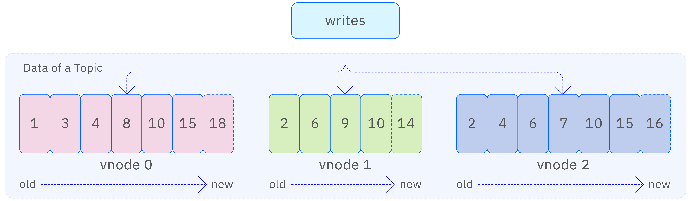
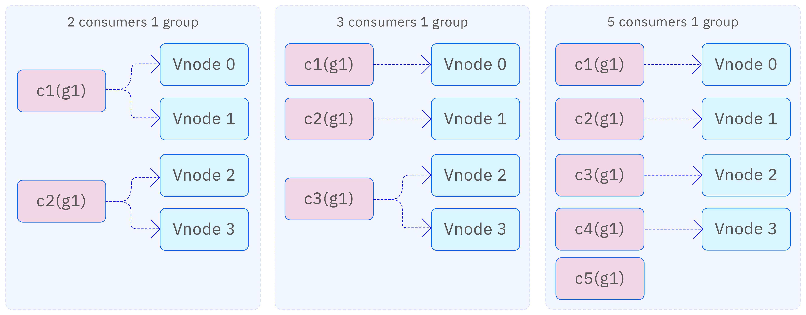
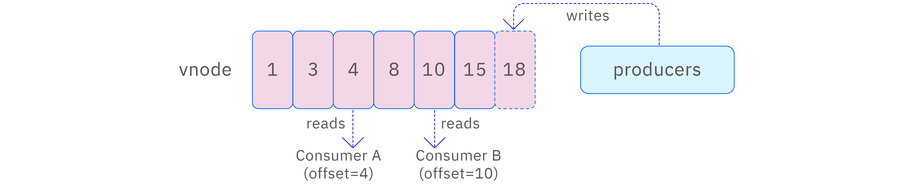
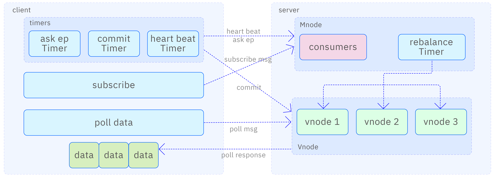
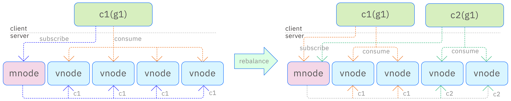
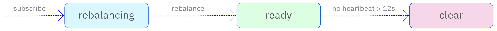
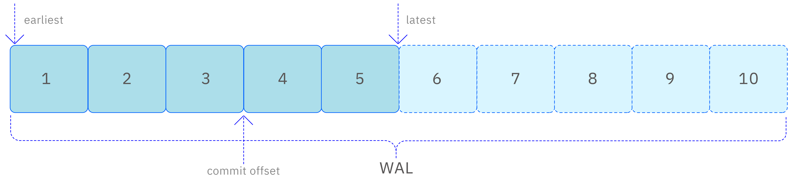

Data subscription, as a core function of TDengine, provides users with the ability to flexibly acquire the data they need. By understanding its internal principles, users can utilize this feature more effectively to meet various real-time data processing and monitoring needs.

## Basic Concepts

### Topic

Similar to Kafka, using TDengine data subscription requires defining a topic. A TDengine topic can be a database, a supertable, or a query statement. Database subscriptions and supertable subscriptions are mainly used for data migration, allowing an entire database or supertable to be restored in another cluster. Query statement subscriptions are a highlight of TDengine data subscriptions, providing greater flexibility since data filtering and preprocessing are handled by TDengine rather than the application, effectively reducing the amount of data transferred and the complexity of the application.

As shown in the figure below, the data tables involved in each topic are distributed across multiple vnodes (equivalent to Kafka's partitions), with each vnode's data stored in WAL files, where the data in the WAL files is written sequentially. Since the WAL files store not only data but also metadata and write messages, the version numbers of the data are not continuous.

TDengine automatically creates indexes for WAL files to support fast random access. Through flexible and configurable file switching and retention mechanisms, users can specify the retention time and size of WAL files as needed. In this way, the WAL is transformed into a persistent storage engine that maintains the order of event arrivals.

For query statement subscriptions, during consumption, TDengine reads data directly from the WAL file according to the current consumption progress and performs filtering, transformation, and other operations using a unified query engine, then pushes the data to the consumers.

### Producer

A producer is an application that writes data to the data tables associated with the subscribed topics. Producers can generate data in various ways and write it to the WAL files of the vnodes where the data tables are located. These methods include SQL, Stmt, Schemaless, CSV, stream computing, etc.

### Consumer

Consumers are responsible for retrieving data from the topics. After subscribing to a topic, consumers can consume all data allocated to them in the vnodes. To achieve efficient and ordered data retrieval, consumers use a combination of push and pull methods.

When there is a large amount of unconsumed data in the vnode, consumers will sequentially send push requests to the vnode to pull a large amount of data at once. At the same time, consumers will record the consumption position of each vnode locally, ensuring that all data is pushed sequentially.

When there is no data to consume in the vnode, the consumer will be in a waiting state. Once new data is written to the vnode, the system will immediately push the data to the consumer, ensuring real-time data availability.

### Consumer Group

When creating consumers, a consumer group must be specified. Consumers within the same consumer group will share the consumption progress, ensuring that data is evenly distributed among consumers. As mentioned earlier, the data of a topic is distributed across multiple vnodes. To improve consumption speed and enable multi-threaded, distributed data consumption, multiple consumers can be added to the same consumer group. These consumers will first evenly divide the vnodes and then consume the vnodes allocated to them. For example, if the data is distributed across 4 vnodes:

- With 2 consumers, each will consume 2 vnodes;
- With 3 consumers, 2 will consume 1 vnode each, while the remaining 1 consumer will consume the remaining 2 vnodes;
- With 5 consumers, 4 will each consume 1 vnode, while the remaining 1 consumer will not participate in consumption.

When a new consumer is added to a consumer group, the system will automatically reallocate consumers through a rebalancing mechanism. This process is transparent to users and requires no manual intervention. The rebalancing mechanism ensures that data is redistributed among consumers, achieving load balancing.

Moreover, a consumer can subscribe to multiple topics to meet different data processing needs. The data subscription feature of TDengine can still guarantee at least once consumption in the face of complex environments such as crashes and restarts, ensuring data integrity and reliability.

### Consumption Progress

The consumer group records the consumption progress in the vnode, allowing accurate recovery of the consumption position when a consumer restarts or recovers from a failure. Consumers can submit their consumption progress, which corresponds to the version number of the WAL on the vnode (equivalent to the offset in Kafka). Progress submission can be performed manually or set to be automatically submitted periodically.

When a consumer first consumes data, it can determine the consumption position based on subscription parameters, which can specify whether to consume the latest data or the oldest data. For the same topic and any consumer group, each vnode's consumption progress is unique. Therefore, when a consumer for a vnode submits its consumption progress and exits, other consumers in that consumer group will continue to consume from that vnode, starting from the progress submitted by the previous consumer. If the previous consumer did not submit its progress, the new consumer will determine the starting position based on the value set in the subscription parameters.

It is important to note that consumers in different consumer groups do not share consumption progress even if they consume the same topic. This design ensures the independence of each consumer group, allowing them to process data independently without interference from each other. The figure below illustrates this process clearly.

## Data Subscription Architecture

The data subscription system can be logically divided into two core modules: the client and the server. The client is responsible for creating consumers, obtaining the vnode list exclusive to these consumers, and retrieving the required data from the server while maintaining necessary state information. The server focuses on managing topic and consumer-related information, processing subscription requests from the client. It dynamically allocates consumption nodes through the implementation of a rebalancing mechanism to ensure continuity of the consumption process and consistency of the data while tracking and managing consumption progress. The data subscription architecture is shown in the figure below:

After successfully establishing a connection with the server, the user must first specify a consumer group and a topic to create the corresponding consumer instance. Subsequently, the client submits a subscription request to the server. At this point, the consumer's status is marked as rebalancing, indicating that it is in the rebalance phase. The consumer will then periodically send requests to the server to retrieve the vnode list pending consumption until the server allocates the corresponding vnode to it. Once the allocation is complete, the consumer's status is updated to ready, marking the successful completion of the subscription process. At this point, the client can officially start sending consumption data requests to the vnode.

During the data consumption process, the consumer continuously sends requests to each allocated vnode in an attempt to retrieve new data. Upon receiving data, the consumer continues to send requests to the vnode after completing the consumption to maintain ongoing consumption. If no data is received within a preset time, the consumer will register a consumption handle on the vnode. This way, once new data is generated on the vnode, it will be immediately pushed to the consumer, ensuring the timeliness of data consumption and effectively reducing the performance loss caused by the consumer frequently pulling data. Thus, it can be seen that the way consumers retrieve data from vnodes is an efficient mode that combines both pulling and pushing.

When the consumer receives data, it will also receive the version number of the data and record it as the current consumption progress on each vnode. This progress is only stored in memory within the consumer, ensuring it is only valid for that consumer. This design guarantees that the consumer can continue from where it left off during the last consumption when it starts up each time, avoiding duplicate data processing. However, if the consumer needs to exit and wishes to resume its last consumption progress later, it must submit the consumption progress to the server before exiting, performing what is called a commit operation. This operation will persist the consumption progress on the server, supporting both automatic and manual submission methods.

Additionally, to maintain the consumer's active status, the client implements a heartbeat mechanism. By periodically sending heartbeat signals to the server, consumers can prove to the server that they are still online. If the server does not receive a heartbeat from a consumer within a certain period, it will consider that the consumer has gone offline. For consumers that do not pull data for a certain period (which can be controlled by parameters), the server will also mark them as offline and remove them from the consumer group. The server relies on the heartbeat mechanism to monitor the status of all consumers, effectively managing the entire group of consumers.

The mnode is primarily responsible for handling control messages during the subscription process, including creating and deleting topics, subscription messages, querying endpoint messages, and heartbeat messages. The vnode focuses on processing consumption messages and commit messages. When the mnode receives a subscription message from a consumer, if the consumer has not subscribed before, its status will be set to rebalancing. If the consumer has already subscribed but the topic has changed, the consumer's status will also be set to rebalancing. The mnode will then perform a rebalance operation on consumers in the rebalancing state. Consumers that have exceeded a fixed heartbeat time or those that actively shut down will be deleted.

Consumers will periodically send query endpoint messages to the mnode to obtain the latest vnode allocation results after rebalancing. At the same time, consumers will also regularly send heartbeat messages to inform the mnode of their active status. Additionally, some consumer information will also be reported to the mnode through heartbeat messages, allowing users to query this information on the mnode to monitor the status of each consumer. This design helps achieve effective management and monitoring of consumers.

## Rebalance Process

The data of each topic may be distributed across multiple vnodes. The server executes the rebalance process to reasonably allocate these vnodes to various consumers, ensuring an even distribution of data and efficient consumption.

As shown in the figure below, c1 represents consumer 1, c2 represents consumer 2, and g1 represents consumer group 1. Initially, g1 has only c1 consuming data. c1 sends subscription information to the mnode, which allocates all 4 vnodes containing data to c1. When c2 is added to g1, c2 sends subscription information to the mnode. The mnode detects that g1 needs to be redistributed and starts the rebalance process, after which c2 will consume two of the vnodes. The allocation information will also be sent to the vnodes through the mnode, while both c1 and c2 will obtain their vnode information and start consuming.

The rebalance timer checks every 2 seconds to see if rebalancing is needed. During the rebalancing process, if the state obtained by the consumer is not ready, it cannot consume data. Only after the rebalance is successfully completed and the consumer obtains the allocated vnode's offset can it consume normally; otherwise, the consumer will retry a specified number of times before reporting an error.

## Consumer State Handling

The consumer's state transition process is shown in the figure below. In the initial state, the consumer that has just initiated a subscription is in a rebalancing state, indicating that the consumer is not yet ready for data consumption. Once the mnode detects a consumer in the rebalancing state, it will initiate the rebalance process, and upon success, the consumer's state will change to ready, indicating that the consumer is prepared. Subsequently, when the consumer obtains its ready status and the allocated vnode list through timed query endpoint messages, it can officially start consuming data.

If the consumer's heartbeat is lost for more than 12 seconds, after the rebalance process, its state will be updated to clear, and the consumer will be deleted from the system.

When a consumer actively exits, it will send an unsubscribe message. This message will clear all topics subscribed by the consumer and set its status to rebalancing. Subsequently, when a consumer in the rebalancing state is detected, the rebalance process will be initiated, and upon success, its state will be updated to clear, and the consumer will be deleted from the system. This series of measures ensures the orderly exit of consumers and the stability of the system.

## Consuming Data

Time series data is stored on vnodes, and the essence of consumption is to read data from the WAL files on the vnodes. The WAL files are equivalent to a message queue, and consumers record the version numbers of WAL data, which actually tracks their consumption progress. The data in the WAL files includes data data and metadata (such as create table and alter table operations), and subscriptions obtain the corresponding data based on the type and parameters of the topic. If the subscription involves queries with filtering conditions, the subscription logic will filter out data that does not meet the criteria through a generic query engine.

As shown in the figure below, the vnode can automatically commit consumption progress by setting parameters or manually commit consumption progress after the client processes the data. If the consumption progress is stored in the vnode, then when consumers in the same consumer group change, they will still continue from the previous progress of consumption. Otherwise, depending on the configuration parameters, consumers can choose to consume the oldest or latest data.

The earliest parameter indicates that the consumer starts consuming from the oldest data in the WAL files, while the latest parameter indicates that consumption starts from the latest data (i.e., the newly written data) in the WAL files. These two parameters only take effect when the consumer first consumes data or has not submitted consumption progress. If progress is submitted during the consumption process, such as submitting the progress when consuming the 3rd data in the WAL file (i.e., commit offset=3), then the next time a new consumer in the same consumer group and topic consumes the same vnode, it will start from the 4th data. This design ensures that consumers can flexibly choose the starting position for consuming data according to their needs while maintaining the persistence of consumption progress and synchronization between consumers.
