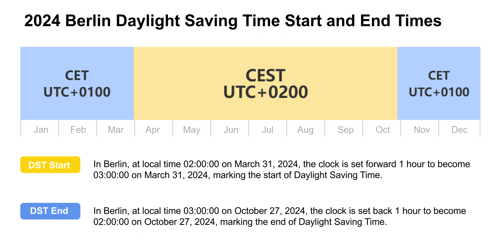
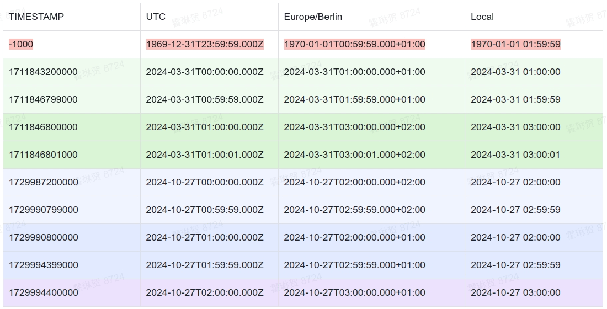
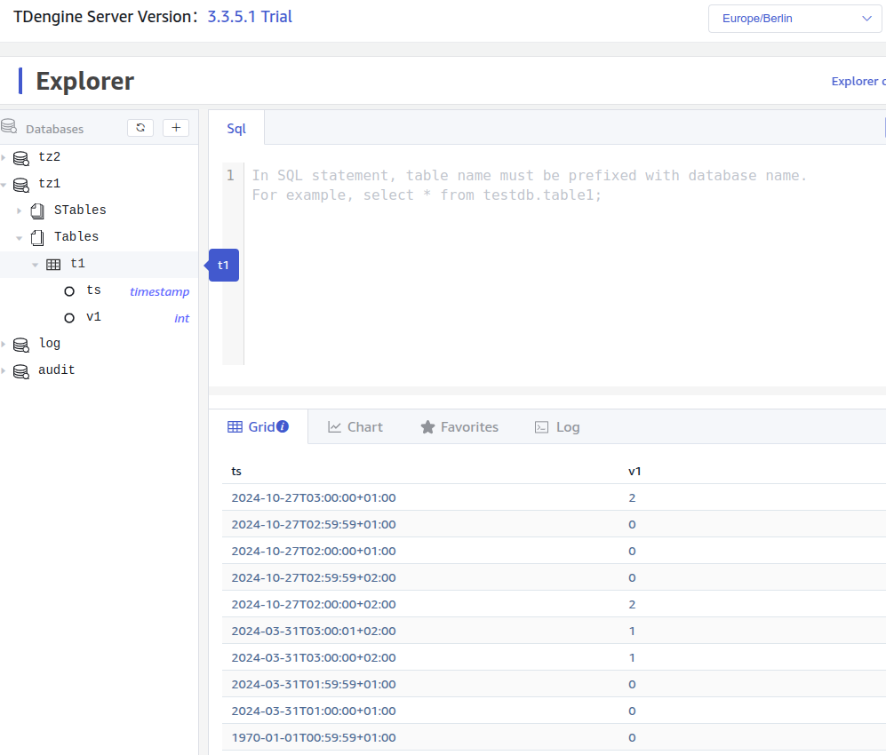

## Background

In the use of time-series databases, there are times when Daylight Saving Time (DST) is encountered. We analyze and explain the use and issues of DST in TDengine to help you use TDengine more smoothly.

## Definitions

### Time Zone

A time zone is a region on Earth that uses the same standard time. Due to the Earth's rotation, to ensure that the time in each place is coordinated with the local sunrise and sunset, the world is divided into multiple time zones.

### IANA Time Zone

The IANA (Internet Assigned Numbers Authority) time zone database, also known as the tz database, provides a standard reference for global time zone information. It is the basis for modern systems and software to handle time zone-related operations.

IANA uses the "Region/City" format (e.g., Europe/Berlin) to clearly identify time zones.

TDengine supports the use of IANA time zones in different components (except for the time zone settings in Windows taos.cfg).

### Standard Time and Local Time

Standard time is the time determined based on a fixed meridian on Earth. It provides a unified reference point for each time zone.

- Greenwich Mean Time (GMT): Historically used reference time, located at the 0° meridian.
- Coordinated Universal Time (UTC): The modern time standard, similar to GMT but more precise.

The relationship between standard time and time zones is as follows:

- Reference: Standard time (e.g., UTC) is the reference point for setting time zones.
- Offset: Different time zones are defined by their offset from standard time. For example, UTC+1 means 1 hour ahead of UTC.
- Regional Division: The world is divided into multiple time zones, each using one or more standard times.

Relative to standard time, each region sets its local time based on its time zone:

- Time Zone Offset: Local time equals standard time plus the offset of the time zone. For example, UTC+2 means 2 hours ahead of UTC.
- Daylight Saving Time (DST): Some regions adjust their local time during specific periods, such as moving the clock forward by one hour. See the next section for details.

### Daylight Saving Time

Daylight Saving Time (DST) is a system that advances the time by one hour to make better use of daylight and save energy. It usually starts in spring and ends in autumn. The specific start and end times of DST vary by region. The following explanation uses Berlin time as an example to illustrate DST and its effects.



According to this rule, you can see:

- The time between 02:00:00 and 03:00:00 (excluding 03:00:00) on March 31, 2024, in Berlin local time does not exist (jump).
- The time between 02:00:00 and 03:00:00 (excluding 03:00:00) on October 27, 2024, in Berlin local time appears twice.

#### DST and the IANA Time Zone Database

- Recording Rules: The IANA time zone database records detailed DST rules for each region, including the start and end dates and times.
- Automatic Adjustment: Many operating systems and software use the IANA database to automatically handle DST adjustments.
- Historical Changes: The IANA database also tracks historical DST changes to ensure accuracy.

#### DST and Timestamp Conversion

- Converting a timestamp to local time is deterministic. For example, 1729990654 is Berlin time DST 2024-10-27 02:57:34, and 1729994254 is Berlin time standard time 2024-10-27 02:57:34 (these two local times are the same except for the time offset).
- Without specifying the time offset, converting local time to a timestamp is indeterminate. The time skipped during DST does not exist and cannot be converted to a timestamp, such as Berlin time 2024-03-31 02:34:56 does not exist and cannot be converted to a timestamp. The repeated time during the end of DST cannot determine which timestamp it is, such as 2024-10-27 02:57:34 without specifying the time offset cannot determine whether it is 1729990654 or 1729994254. Specifying the time offset can determine the timestamp, such as 2024-10-27 02:57:34 CEST(+02:00), specifying DST 2024-10-27 02:57:34 timestamp 1729990654.

### RFC3339 Time Format

RFC 3339 is an internet time format standard used to represent dates and times. It is based on the ISO 8601 standard but specifies some format details more specifically.

The format is as follows:

- Basic Format: `YYYY-MM-DDTHH:MM:SSZ`
- Time Zone Representation:
  - Z represents Coordinated Universal Time (UTC).
  - Offset format, such as +02:00, represents the time difference from UTC.

With explicit time zone offsets, the RFC 3339 format can accurately parse and compare times globally.

The advantages of RFC 3339 include:

- Standardization: Provides a unified format for easy cross-system data exchange.
- Clarity: Clearly indicates time zone information, avoiding time misunderstandings.

TDengine uses the RFC3339 format for display in REST API and Explorer UI. In SQL statements, you can use the RFC3339 format to write timestamp data:

```sql
insert into t1 values('2024-10-27T01:59:59.000Z', 0);
select * from t1 where ts >= '2024-10-27T01:59:59.000Z';
```

### Undefined Behavior

Undefined behavior refers to specific code or operations that do not have a clearly defined result and do not guarantee compatibility with that result. TDengine may modify the current behavior in a future version without notifying users. Therefore, users should not rely on the current undefined behavior for judgment or application in TDengine.

## Writing and Querying DST in TDengine

We use the following table to show the impact of DST on writing and querying.



### Table Explanation

- **TIMESTAMP**: TDengine uses a 64-bit integer to store raw timestamps.
- **UTC**: The UTC time representation corresponding to the timestamp.
- **Europe/Berlin**: The RFC3339 format time corresponding to the Europe/Berlin time zone.
- **Local**: The local time corresponding to the Europe/Berlin time zone (without time zone).

### Table Analysis

- At the **start of DST** (Berlin time March 31, 02:00), the time jumps directly from 02:00 to 03:00 (one hour forward).
  - Light green is the timestamp one hour before the start of DST;
  - Dark green is the timestamp one hour after the start of DST;
  - Red indicates that the nonexistent local time was inserted into the TDengine database:
    - Using SQL `INSERT INTO t1 values('2024-03-31 02:59:59',..)` to insert data from `2024-03-31 02:00:00` to `2024-03-31 02:59:59` will be automatically adjusted to -1000 (in TDengine, this is undefined behavior, currently this value is related to the database precision, millisecond database is -1000, microsecond database is -1000000, nanosecond database is -1000000000), because that moment does not exist in local time;
- At the **end of DST** (Berlin time October 27, 03:00), the time jumps from 03:00 to 02:00 (one hour back).
  - Light blue indicates the timestamp one hour before the clock jump;
  - Dark blue indicates the timestamp within one hour after the clock jump, its local time without time zone is the same as the previous hour.
  - Purple indicates the timestamp one hour after the clock jump;
- **Local Time Changes**: It can be seen that due to the adjustment of DST, local time changes, which may cause some time periods to appear repeated or missing.
- **UTC Time Unchanged**: UTC time remains unchanged, ensuring the consistency and order of time.
- **RFC3339**: The RFC3339 format time shows the change in time offset, changing to +02:00 after the start of DST and to +01:00 after the end of DST.
- **Conditional Query**:
  - At the **start of DST**, the skipped time (`[03-31 02:00:00,03-31 03:00:00)`) does not exist, so using that time for queries results in undefined behavior: `SELECT ts FROM t1 WHERE ts BETWEEN '2024-03-31 02:00:00' AND '2024-03-31 02:59:59'` (the nonexistent local timestamp is converted to `-1000`):

    ```sql
    taos> SELECT ts FROM t1 WHERE ts BETWEEN '2024-03-31 02:00:00' AND '2024-03-31 02:59:59';
           ts       |
    =================
     -1000 |
    Query OK, 1 row(s) in set (0.003635s)
    ```

    When the nonexistent timestamp is used together with the existing timestamp, the result is also not as expected, as shown below where the start local time does not exist:

    ```sql
    taos> SELECT ts, to_iso8601(ts,'Z') FROM t1 WHERE ts BETWEEN '2024-03-31 02:00:00' AND '2024-03-31 03:59:59';
         ts       |       to_iso8601(ts,'Z')       |
    ==================================================
    -1000 | 1969-12-31T23:59:59.000Z       |
    1711843200000 | 2024-03-31T00:00:00.000Z       |
    1711846799000 | 2024-03-31T00:59:59.000Z       |
    1711846800000 | 2024-03-31T01:00:00.000Z       |
    1711846801000 | 2024-03-31T01:00:01.000Z       |
    Query OK, 5 row(s) in set (0.003339s)
    ```

    In the following statements, the first SQL query end time does not exist, and the second end time exists. The first SQL query result is not as expected:

    ```sql
    taos> SELECT ts, to_iso8601(ts,'Z') FROM t1 WHERE ts BETWEEN '2024-03-31 01:00:00' AND '2024-03-31 02:00:00';
    Query OK, 0 row(s) in set (0.000930s)

    taos> SELECT ts, to_iso8601(ts,'Z') FROM t1 WHERE ts BETWEEN '2024-03-31 01:00:00' AND '2024-03-31 01:59:59';
           ts       |       to_iso8601(ts,'Z')       |
    ==================================================
     1711843200000 | 2024-03-31T00:00:00.000Z       |
     1711846799000 | 2024-03-31T00:59:59.000Z       |
    Query OK, 2 row(s) in set (0.001227s)
    ```

  - At the end of DST, the repeated time (`[10-27 02:00:00,10-27 03:00:00)` excluding `10-27 03:00:00`) appears twice, and using that time range for queries in TDengine is also undefined behavior.
    - Querying the data between `[2024-10-27 02:00:00, 2024-10-27 03:00:00]` includes the repeated timestamps and the data at `2024-10-27 03:00:00`:

        ```sql
        taos> SELECT ts, to_iso8601(ts,'Z'), TO_CHAR(ts, 'YYYY-MM-DD HH:mi:ss') FROM t1 WHERE ts BETWEEN '2024-10-27 02:00:00' AND '2024-10-27 03:00:00';
               ts       |       to_iso8601(ts,'Z')       | to_char(ts, 'YYYY-MM-DD HH:mi:ss') |
        =======================================================================================
         1729987200000 | 2024-10-27T00:00:00.000Z       | 2024-10-27 02:00:00                |
         1729990799000 | 2024-10-27T00:59:59.000Z       | 2024-10-27 02:59:59                |
         1729990800000 | 2024-10-27T01:00:00.000Z       | 2024-10-27 02:00:00                |
         1729994399000 | 2024-10-27T01:59:59.000Z       | 2024-10-27 02:59:59                |
         1729994400000 | 2024-10-27T02:00:00.000Z       | 2024-10-27 03:00:00                |
        Query OK, 5 row(s) in set (0.001370s)
        ```

    - However, the following query for the range [2024-10-27 02:00:00.000,2024-10-27 02:57:34.999] can only find the data at the first 2024-10-27 02:00:00 time point:

        ```sql
        taos> SELECT ts, to_iso8601(ts,'Z'), TO_CHAR(ts, 'YYYY-MM-DD HH:mi:ss') FROM t1 WHERE ts >= '2024-10-27 02:00:00' AND ts <= '2024-10-27 02:57:00.999';
               ts       |       to_iso8601(ts,'Z')       | to_char(ts, 'YYYY-MM-DD HH:mi:ss') |
        =======================================================================================
         1729987200000 | 2024-10-27T00:00:00.000Z       | 2024-10-27 02:00:00                |
        Query OK, 1 row(s) in set (0.004480s)
        ```

    - The following query for the range [2024-10-27 02:00:01,2024-10-27 02:57:35] can find 3 rows of data (including one row of local time data at 02:59:59):

        ```sql
        taos> SELECT ts, to_iso8601(ts,'Z'), TO_CHAR(ts, 'YYYY-MM-DD HH:mi:ss') FROM t1 WHERE ts >= '2024-10-27 02:00:00' AND ts <= '2024-10-27 02:57:35';;
                   ts            |       to_iso8601(ts,'Z')       | to_char(ts, 'YYYY-MM-DD HH:mi:ss') |
        ===============================================================================================
         2024-10-27 02:00:00.000 | 2024-10-27T00:00:00.000Z       | 2024-10-27 02:00:00                |
         2024-10-27 02:59:59.000 | 2024-10-27T00:59:59.000Z       | 2024-10-27 02:59:59                |
         2024-10-27 02:00:00.000 | 2024-10-27T01:00:00.000Z       | 2024-10-27 02:00:00                |
        Query OK, 3 row(s) in set (0.004428s)
        ```

## Summary and Suggestions

### Summary

This explanation only addresses the impact of using local time. Using UNIX timestamps or RFC3339 has no impact.

- Writing:
  - It is not possible to write data for nonexistent times during the DST transition.
  - Writing data for repeated times during the DST transition is undefined behavior.
- Querying:
  - Querying with conditions that specify the skipped time during the start of DST results in undefined behavior.
  - Querying with conditions that specify the repeated time during the end of DST results in undefined behavior.
- Display:
  - Displaying with time zones is not affected.
  - Displaying local time is accurate, but repeated times during the end of DST cannot be distinguished.
  - Users should be cautious when using time without time zones for display and application.

### Suggestions

To avoid unnecessary impacts of DST on querying and writing in TDengine, it is recommended to use explicit time offsets for writing and querying.

- Use UNIX Timestamps: Using UNIX timestamps can avoid time zone issues.

  |     TIMESTAMP |           UTC            |         Europe/Berlin         |        Local        |
  | ------------: | :----------------------: | :---------------------------: | :-----------------: |
  | 1711846799000 | 2024-03-31T00:59:59.000Z | 2024-03-31T01:59:59.000+01:00 | 2024-03-31 01:59:59 |
  | 1711846800000 | 2024-03-31T01:00:00.000Z | 2024-03-31T03:00:00.000+02:00 | 2024-03-31 03:00:00 |

  ```sql
  taos> insert into t1 values(1711846799000, 1)(1711846800000, 2);
  Insert OK, 2 row(s) affected (0.001434s)

  taos> select * from t1 where ts between 1711846799000 and 1711846800000;
         ts       |     v1      |
  ===============================
   1711846799000 |           1 |
   1711846800000 |           2 |
  Query OK, 2 row(s) in set (0.003503s)
  ```

- Use RFC3339 Time Format: The RFC3339 time format with time zone offsets can effectively avoid the uncertainty of DST.

  |     TIMESTAMP |           UTC            |         Europe/Berlin         |        Local        |
  | ------------: | :----------------------: | :---------------------------: | :-----------------: |
  | 1729987200000 | 2024-10-27T00:00:00.000Z | 2024-10-27T02:00:00.000+02:00 | 2024-10-27 02:00:00 |
  | 1729990799000 | 2024-10-27T00:59:59.000Z | 2024-10-27T02:59:59.000+02:00 | 2024-10-27 02:59:59 |
  | 1729990800000 | 2024-10-27T01:00:00.000Z | 2024-10-27T02:00:00.000+01:00 | 2024-10-27 02:00:00 |
  | 1729994399000 | 2024-10-27T01:59:59.000Z | 2024-10-27T02:59:59.000+01:00 | 2024-10-27 02:59:59 |

  ```sql
  taos> insert into t1 values ('2024-10-27T02:00:00.000+02:00', 1)
                              ('2024-10-27T02:59:59.000+02:00', 2)
                              ('2024-10-27T02:00:00.000+01:00', 3)
                              ('2024-10-27T02:59:59.000+01:00', 4);
  Insert OK, 4 row(s) affected (0.001514s)

  taos> SELECT *,
               to_iso8601(ts,'Z'),
               to_char(ts, 'YYYY-MM-DD HH:mi:ss') FROM t1
        WHERE ts >= '2024-10-27T02:00:00.000+02:00'
          AND ts <= '2024-10-27T02:59:59.000+01:00';
         ts      |     v1  |       to_iso8601(ts,'Z')       | to_char(ts, 'YYYY-MM-DD HH:mi:ss') |
  =====================================================================================================
   1729987200000 |       1 | 2024-10-27T00:00:00.000Z       | 2024-10-27 02:00:00                |
   1729990799000 |       2 | 2024-10-27T00:59:59.000Z       | 2024-10-27 02:59:59                |
   1729990800000 |       3 | 2024-10-27T01:00:00.000Z       | 2024-10-27 02:00:00                |
   1729994399000 |       4 | 2024-10-27T01:59:59.000Z       | 2024-10-27 02:59:59                |
  Query OK, 4 row(s) in set (0.004275s)

  taos> SELECT *,
               to_iso8601(ts,'Z'),
               to_char(ts, 'YYYY-MM-DD HH:mi:ss') FROM t1
        WHERE ts >= '2024-10-27T02:00:00.000+02:00'
          AND ts <= '2024-10-27T02:59:59.000+02:00';
         ts      |     v1  |       to_iso8601(ts,'Z')       | to_char(ts, 'YYYY-MM-DD HH:mi:ss') |
  =====================================================================================================
   1729987200000 |       1 | 2024-10-27T00:00:00.000Z       | 2024-10-27 02:00:00                |
   1729990799000 |       2 | 2024-10-27T00:59:59.000Z       | 2024-10-27 02:59:59                |
  Query OK, 2 row(s) in set (0.004275s)
  ```

- Pay Attention to Time Zone Settings When Querying: When querying and displaying, if local time is needed, be sure to consider the impact of DST.
  - taosAdapter: When using the REST API, it supports setting the IANA time zone, and the result is returned in RFC3339 format.

    ```shell
    $ curl -uroot:taosdata 'localhost:6041/rest/sql?tz=Europe/Berlin'\
      -d "select ts from tz1.t1"
    {"code":0,"column_meta":[["ts","TIMESTAMP",8]],"data":[["1970-01-01T00:59:59.000+01:00"],["2024-03-31T01:00:00.000+01:00"],["2024-03-31T01:59:59.000+01:00"],["2024-03-31T03:00:00.000+02:00"],["2024-03-31T03:00:01.000+02:00"],["2024-10-27T02:00:00.000+02:00"],["2024-10-27T02:59:59.000+02:00"],["2024-10-27T02:00:00.000+01:00"],["2024-10-27T02:59:59.000+01:00"],["2024-10-27T03:00:00.000+01:00"]],"rows":10}
    ```

  - Explorer: When using the Explorer page for SQL queries, users can configure the client time zone to display in RFC3339 format.

    

## Reference Documents

- IANA Time Zone Database: [https://www.iana.org/time-zones](https://www.iana.org/time-zones)
- RFC3339: [https://datatracker.ietf.org/doc/html/rfc3339](https://datatracker.ietf.org/doc/html/rfc3339)
