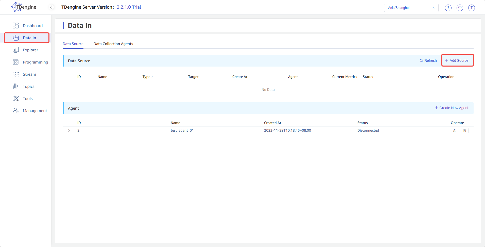
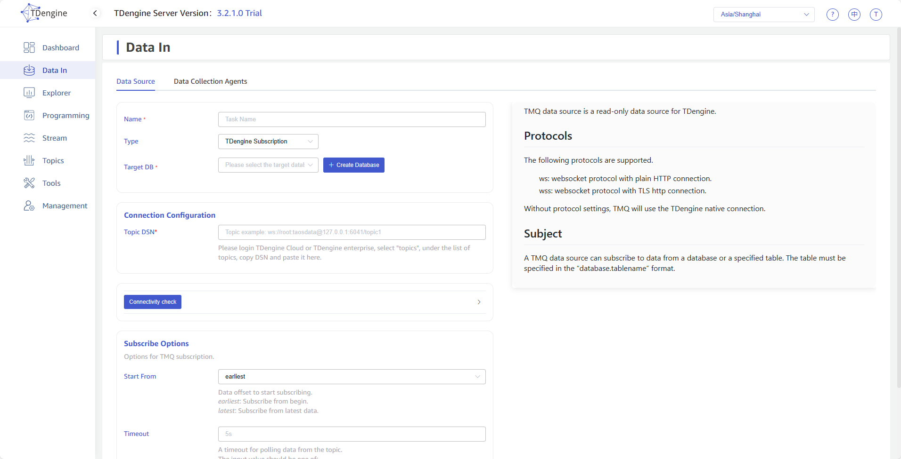
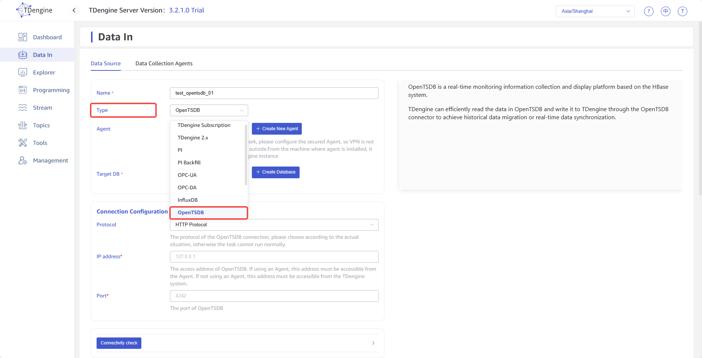
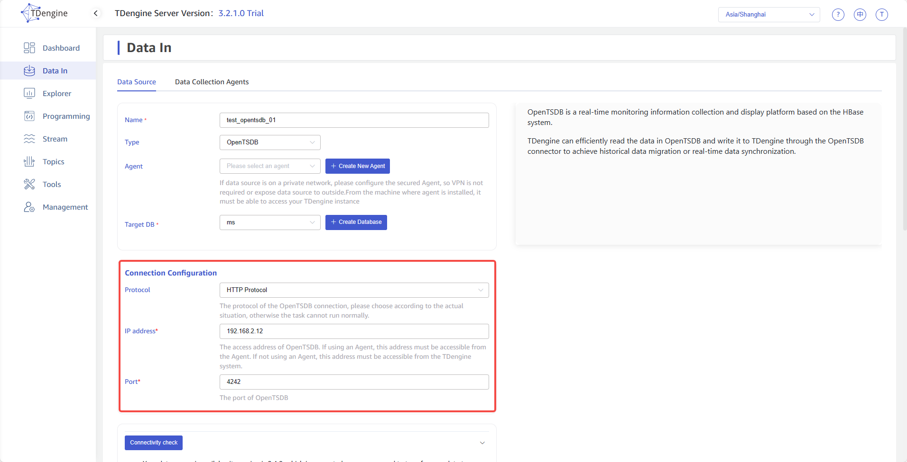
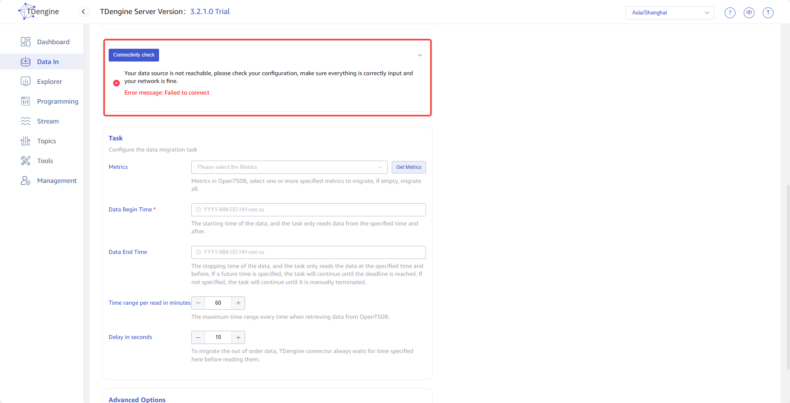
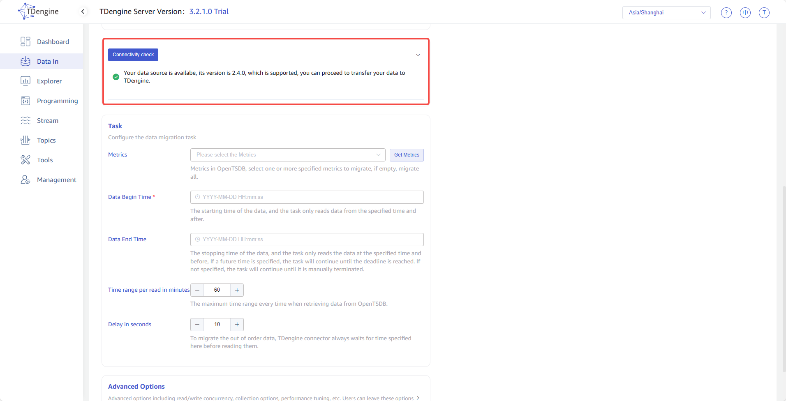
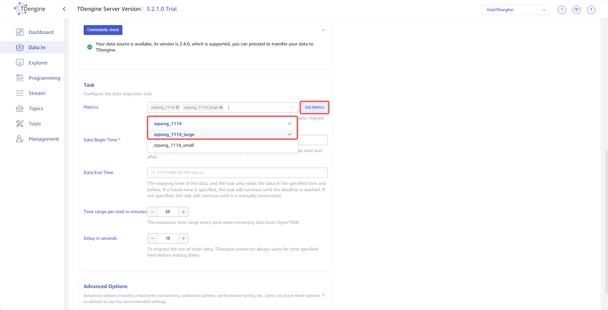
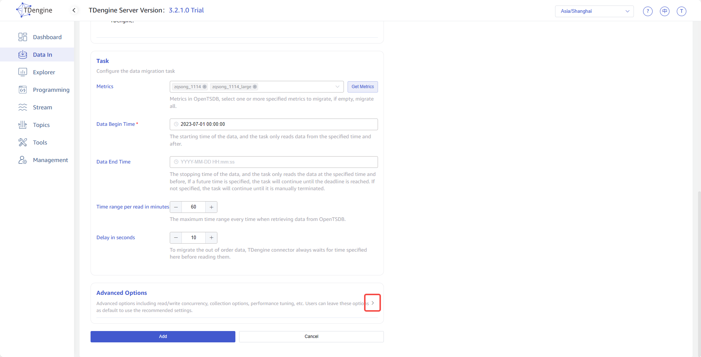
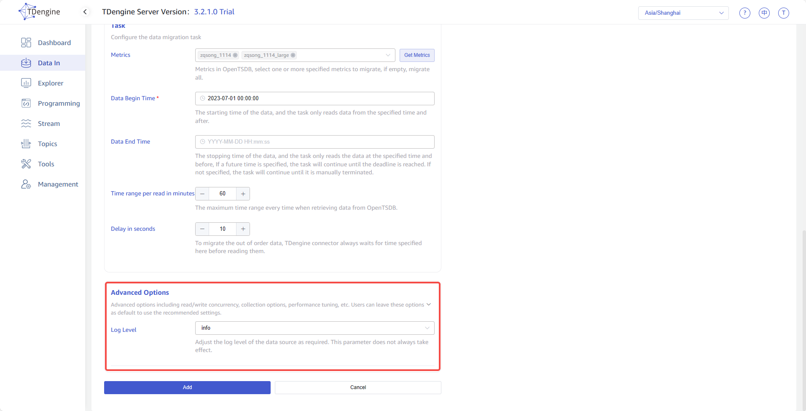
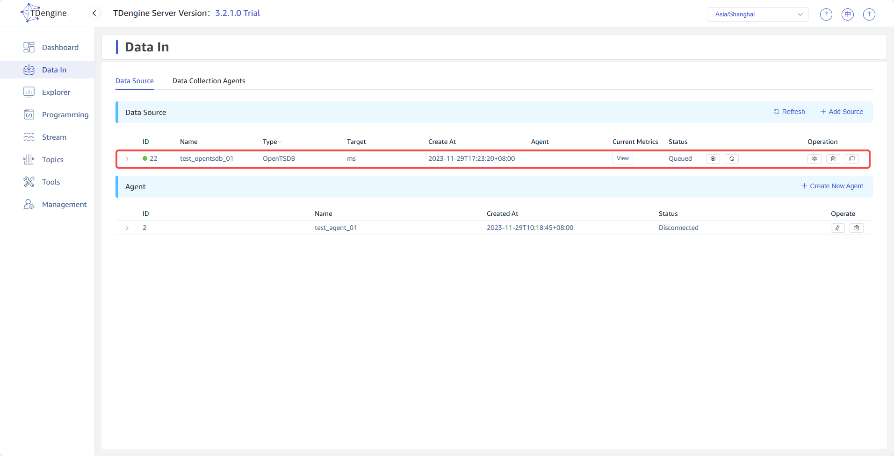

### OpenTSDB
1. Click the <button style="color: #4259ce">+Add Source</button> button in the upper left corner of the Data In page to enter the data source page, as shown below:
  
  

2. Enter the task name in the **Name** field, for example *`test_opentsdb_01`* .

3. Select *`OpenTSDB`* from the dropdown list in the **Type** field, as shown below(after the selection is made, the fields on the page will change):
  

4. **Agent** is not a mandatory field, if needed, you can select a specified agent from the dropdown list, or click the <button style="color: #4259ce">+Create New Agent</button> button on the right to [create a new one](#CreateAgent) .

5. **Target DB** is a required field, since the time precision of data in OpenTSDB is millisecond, it is necessary to select a *`millisecond precision db`* . Alternatively, you can click the <button style="color: #4259ce">+Create Database</button> button on the right to [create a new one](#CreateDatabase) .

6. Fill in the *`Connection information of the source OpenTSDB`* in the **Connection Configuration** area, as shown below:
  

7. There is a button <button style="color: #4259ce">Connectivity check</button> below the **Connection Configuration** area, you can click this button to check whether the information filled in above can obtain data from the source OpenTSDB normally. the inspection results are shown below:  
  **Failed**
  
  **Successful**
  

8. **Metrics** is the list of data in the OpenTSDB, select one or more specified metrics to migrate, if empty, migrate all. You need to first click on the button <button style="color: #4259ce">Get Metrics</button> on the right to obtain the metrics, and then select from the dropdown list, as shown below:
  

9. **Data Begin Time** is the starting time of the data, the task only reads data from the specified time and after, The timezone used is consistent with explorer.

10. **Data End Time** is the stopping time of the data, the task only reads the data at the specified time and before, If a future time is specified, the task will continue until the deadline is reached. If not specified, the task will continue until it is manually terminated. The timezone used is consistent with explorer.

11. **Time range per read in minutes** is a maximum time range every time when retrieving data from OpenTSDB, it's an important parameter that needs to be determined by the user in combination with server performance and data storage density. If the range is too small, the execution speed of synchronization tasks will be slow; If the range is too large, it may cause the OpenTSDB system to malfunction due to excessive memory usage.

12. **Delay in seconds** is an integer ranging from 1 to 30, to migrate the out of order data, connector always waits for time specified here before reading them.

13. **Advanced Options** is folded by default, and clicking on the right side can expand it, as shown below:
  
  

16. **Log Level** is defaulted to info level, you can select other levels from the dropdown list.

17. After completing the above information, click the submit button to directly initiate data synchronization from OpenTSDB to TDengine, as shown below:
  
  