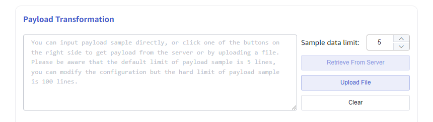
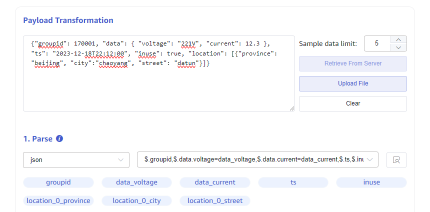
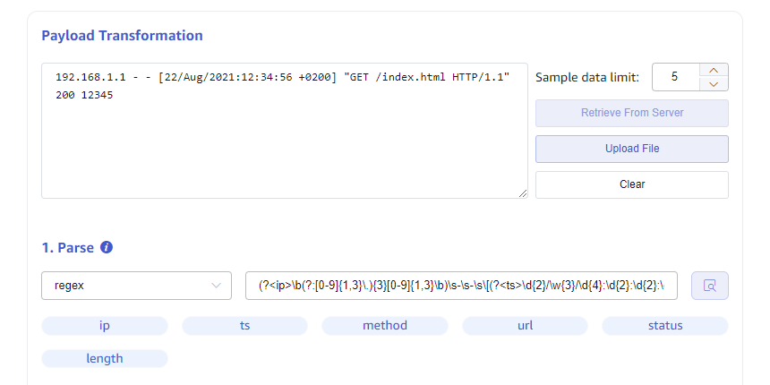
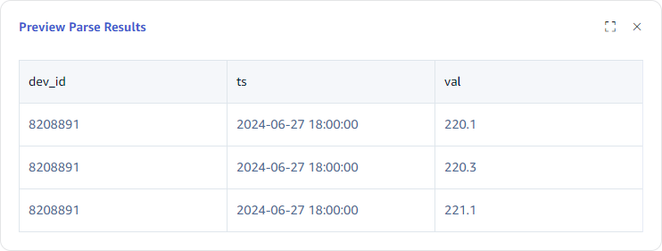

Transformer is the core of data in. After reading data from the data source, it is parsed, extracted/split, filtered, mapped, and finally written into the TDengine data table. TaosX abstracts the Transformer process into four steps:

1. **parse**：The process of data structuring is to transform unstructured data into structured data that can be described using a unified schema. From data sources such as MQTT/Kafka, messages are often ordinary strings that require some formatting to parse. However, if the data source itself is structured data, there is no need for parsing.
2. **extract/split**：The process of further refining and splitting some fields, for example, if the data source uses one field to describe the weight of "5kg", and the target library uses two fields to describe the weight: weight and unit, then the source field needs to be split.
3. **filter**：Set filtering conditions so that only data rows that meet the conditions are written to the target table.
4. **mapping**：Map the source fields that have gone through the above process to the target TDengine data table fields.

Currently, TaosExplorer supports transformer configurations for writing to most data sources. The next four sections provide a detailed explanation of the four steps: **parsing**, **extract/splitting**, **data filtering**, and **mapping** visualization configuration methods.

## 1 parse

This step is only required for unstructured data sources. Currently, MQTT and Kafka data sources use the rules provided in this step to parse unstructured data and obtain preliminary structured data, which can be described as row and column data in fields. In Explorer, you need to provide sample data and parsing rules to preview and parse structured data presented in a table.

### 1.1 Sample Data



As shown in the figure, the textarea input box contains sample data, which can be obtained in three ways:

1. Directly input sample data into textarea;
2. Click the "Retrieve from Server" button on the right to retrieve sample data from the configured server and fill it in the textarea;
3. Upload the file and fill the file content into the textarea
If there is too much sample data, the preview data quantity shall be based on the upper limit of sample data rows.

### 1.2 parse<a name="parse"></a>

Parsing is the process of parsing unstructured strings into structured data through parsing rules.

The processing of message bodies currently supports three methods: JSON, regex regularization and UDT.

#### 1. JSON

The following JSON example data can automatically parse out fields: `groupid`、`voltage`、`current`、`ts`、`inuse`、`location`.

``` json
{"groupid": 170001, "voltage": "221V", "current": 12.3, "ts": "2023-12-18T22:12:00", "inuse": true, "location": "beijing.chaoyang.datun"}
{"groupid": 170001, "voltage": "220V", "current": 12.2, "ts": "2023-12-18T22:12:02", "inuse": true, "location": "beijing.chaoyang.datun"}
{"groupid": 170001, "voltage": "216V", "current": 12.5, "ts": "2023-12-18T22:12:04", "inuse": false, "location": "beijing.chaoyang.datun"}
```

The JSON data with the following nested structure can automatically parse out fields: `groupid`、`data_voltage`、`data_current`、`ts`、`inuse`、`location_0_province`、`location_0_city`、`location_0_datun`：

``` json
{"groupid": 170001, "data": { "voltage": "221V", "current": 12.3 }, "ts": "2023-12-18T22:12:00", "inuse": true, "location": [{"province": "beijing", "city":"chaoyang", "street": "datun"}]}
```



#### 2. Regex <a name="regex"></a>

Multiple fields can be extracted from any string (text) field using the **named capture group** of regular expressions. As shown in the figure, extract fields such as access IP, timestamp, and URL from the nginx log.

``` re
(?<ip>\b(?:[0-9]{1,3}\.){3}[0-9]{1,3}\b)\s-\s-\s\[(?<ts>\d{2}/\w{3}/\d{4}:\d{2}:\d{2}:\d{2}\s\+\d{4})\]\s"(?<method>[A-Z]+)\s(?<url>[^\s"]+).*(?<status>\d{3})\s(?<length>\d+)
```



3. UDT: User-Defined Transform

Use Rhai syntax script to parse input data, please refer to `https://rhai.rs/book/`. The input data must be in JSON format.

**input**：The parameter `data` can be used in the script, which is the Object Map parsed from the original data.

**output**：the scipt must return an array.


For example, for data, report the three-phase voltage values at once and input them into three sub tables.

``` json
{
    "ts": "2024-06-27 18:00:00", 
    "voltage": "220.1,220.3,221.1", 
    "dev_id": "8208891"
}
```

So you can use the following script to extract three voltage data.

```
let v3 = data["voltage"].split(",");

[
#{"ts": data["ts"], "val": v3[0], "dev_id": data["dev_id"]},
#{"ts": data["ts"], "val": v3[1], "dev_id": data["dev_id"]},
#{"ts": data["ts"], "val": v3[2], "dev_id": data["dev_id"]}
]
```

The final parsing result is as follows:



## 2 extract/split

The parsed data may not yet meet the data requirements of the target table. For example, the raw data collected by the smart table is as follows (in JSON format):

``` json
{"groupid": 170001, "voltage": "221V", "current": 12.3, "ts": "2023-12-18T22:12:00", "inuse": true, "location": "beijing.chaoyang.datun"}
{"groupid": 170001, "voltage": "220V", "current": 12.2, "ts": "2023-12-18T22:12:02", "inuse": true, "location": "beijing.chaoyang.datun"}
{"groupid": 170001, "voltage": "216V", "current": 12.5, "ts": "2023-12-18T22:12:04", "inuse": false, "location": "beijing.chaoyang.datun"}
```

The voltage parsed using JSON rules is in the unit form expressed as a string. In the final storage, it is hoped that the voltage and current values can be recorded using an int type for statistical analysis. At this point, it is necessary to further split the voltage; In addition, the date is expected to be split into date and time for storage.

As shown in the figure below, the source field `ts` can be split into date and time using the split rule, and the voltage value and voltage unit can be extracted from the field `voltage` using regex. The split rule requires setting **delimiter** and **splitting quantity**. The naming convention for the split field is`{original field name}_{sequence number}`. The Regex rule is the same as in the parsing process, using **named capture group** to name and extract the field.

## 3 filter<a name="filter"></a>

The filtering function can set filtering conditions, and only data rows that meet the conditions will be written to the target table. The result of the filter condition expression must be of type boolean. Before writing the filter conditions, it is necessary to determine the type of the parsed field. Based on the type of the parsed field, the judgment function and comparison operators (`>`,`>=`,`<=`,`<`,`==`,`!=`) can be used to determine.

### 3.1 data type

Only by specifying the type of each field parsed can the correct syntax be used for data filtering. Use JSON rules to parse fields and automatically set types based on attribute values:

1. bool："inuse": true
2. int："voltage": 220
3. float："current" : 12.2
4. String："location": "MX001"

The data parsed using regex rules is of type string.
The data extracted or split using split and regex is of type string.

If the extracted data type is not the expected type, data type conversion can be performed. The commonly used data type conversion is to convert a string to a numerical type. The supported conversion functions are as follows:

|Function|From type|To type|e.g.|
|:----|:----|:----|:----|
| parse_int  | string | int | parse_int("56")  // result: 56 |
| parse_float  | string | float | parse_float("12.3")  // result: 12.3 |

### 3.2 Judging expressions

Different data types have their own way of writing judgment expressions.

#### 1. BOOL type

You can use variables or the operator `!`, For example, for the field "inuse": true, the following expression can be written:

> 1. inuse
> 2. !inuse

#### 2. Number type（int/float）

Numerical types support the use of comparison operators: `==`、`!=`、`>`、`>=`、`<`、`<=`.

#### 3. String type

Use comparison operators to compare strings, also support some string function:

|Function|Description|e.g.|
|:----|:----|:----|
| is_empty  | returns true if the string is empty | s.is_empty() |
| contains  | checks if a certain character or sub-string occurs in the string | s.contains("substring") |
| starts_with  | returns true if the string starts with a certain string | s.starts_with("prefix") |
| ends_with  | returns true if the string ends with a certain string | s.ends_with("suffix") |
| len  | returns the number of characters (not number of bytes) in the string, must be used with comparison operator | s.len == 5 // determine if the string length is 5; Len returns int as a property, which is different from the first four functions, where the first four directly return bool. |

#### 4. Composite expression

Multiple judgment expressions can be combined using logical operators (&&, ||, !).
For example, the following expression represents obtaining data from smart meters installed in Beijing with a voltage value greater than 200.

> location.starts_with("beijing") && voltage > 200

## 4 Mapping

Mapping is the process of mapping parsed, extracted, and split **source fields** to **target table fields**, which can be directly mapped or calculated through some rules before being mapped to the target table.

### 4.1 Target Super Table

After selecting the target super table, all tags and columns of the super table will be loaded.
The source field is automatically mapped to the target super table's tags and columns using the mapping rule based on its name.
For example, there are preview data after parsing, extracting, and splitting as follows:

### 4.2 Mapping Rule<a name="expression"></a>

The supported mapping rules are shown in the table below:

|rule|description|
|:----|:----|
| mapping | Directly mapping requires selecting the mapping source field.|
| value | Constants can be string constants or numerical constants, and the input constant value is directly stored in the database. |
| generator | The generator currently only supports timestamp generator now, and the current time will be stored when it is stored.|
| join | String join, which can specify multiple source fields for concatenating characters.|
| format | **String formatting tool**, fill in the formatted string, for example, there are three source fields year, month, and day representing year, month, and day respectively. If you want to store the data in the format of yyyy-MM-dd, you can provide the formatted string as `${year}-${month}-${day}`. Among them, `${}` serves as a placeholder, which can be a source field or a function processing of a string type field. |
| sum | Select multiple numerical fields for addition calculation.|
| expr | **Numeric operation expression** More complex function processing and mathematical operations can be performed on numerical fields.|

#### 1. String function

The function canbe used in format expression, for example `t_${locaion.sub_string(5, 20)}`.

|Function|description|e.g.|
|:----|:----|:----|
| pad(len, pad_chars) | pads the string with a character or a string to at least a specified length | "1.2".pad(5, '0') // result:"1.200" |
|trim|trims the string of whitespace at the beginning and end|"  abc ee ".trim() // result:"abc ee"|
|sub_string(start_pos, len)|extracts a sub-string, params：<br />1. start position, counting from end if < 0<br />2. (optional) number of characters to extract, none if ≤ 0, to end if omitted|"012345678".sub_string(5)  // "5678"<br />"012345678".sub_string(5, 2)  // "56"<br />"012345678".sub_string(-2)  // "78"|
|replace(substring, replacement)|replaces a sub-string with another|"012345678".replace("012", "abc") // "abc345678"|

#### 2. expr

Basic mathematical operations support add `+` subtract`-` multiply `*` divide `/`.

For example, the data source collects values in degrees and the target inventory stores Fahrenheit temperature values. So it is necessary to convert the collected temperature data. If the parsed source field is `temperature`, the expression `temperature * 1.8+32` can be used.

Mathematical functions are also supported in numerical expressions, and the available mathematical functions are shown in the table below:

|Function|description|e.g.|
|:----|:----|:----|
|sin、cos、tan、sinh、cosh|Trigonometry|a.sin()   |
|asin、acos、atan、 asinh、acosh|arc-trigonometry|a.asin()|
|sqrt|Square root|a.sqrt()  // 4.sqrt() == 2|
|exp|Exponential|a.exp()|
|ln、log|Logarithmic|a.ln()   // e.ln()  == 1<br />a.log()  // 10.log() == 1|
|floor、ceiling、round、int、fraction|rounding|a.floor() // (4.2).floor() == 4<br />a.ceiling() // (4.2).ceiling() == 5<br />a.round() // (4.2).round() == 4<br />a.int() // (4.2).int() == 4<br />a.fraction() // (4.2).fraction() == 0.2|

### 4.3 Subtable Name

The subtable name type is a string, and the subtable name can be defined using the string formatting format expression in the mapping rules.
