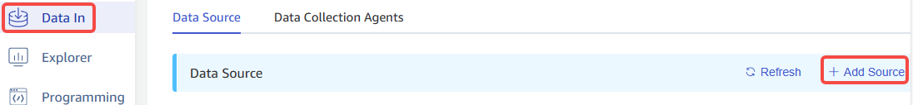
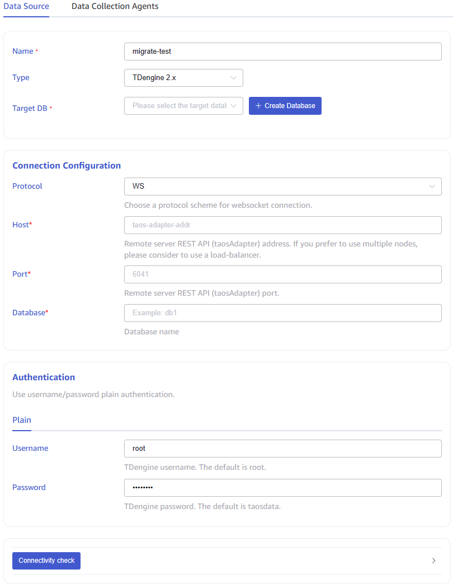
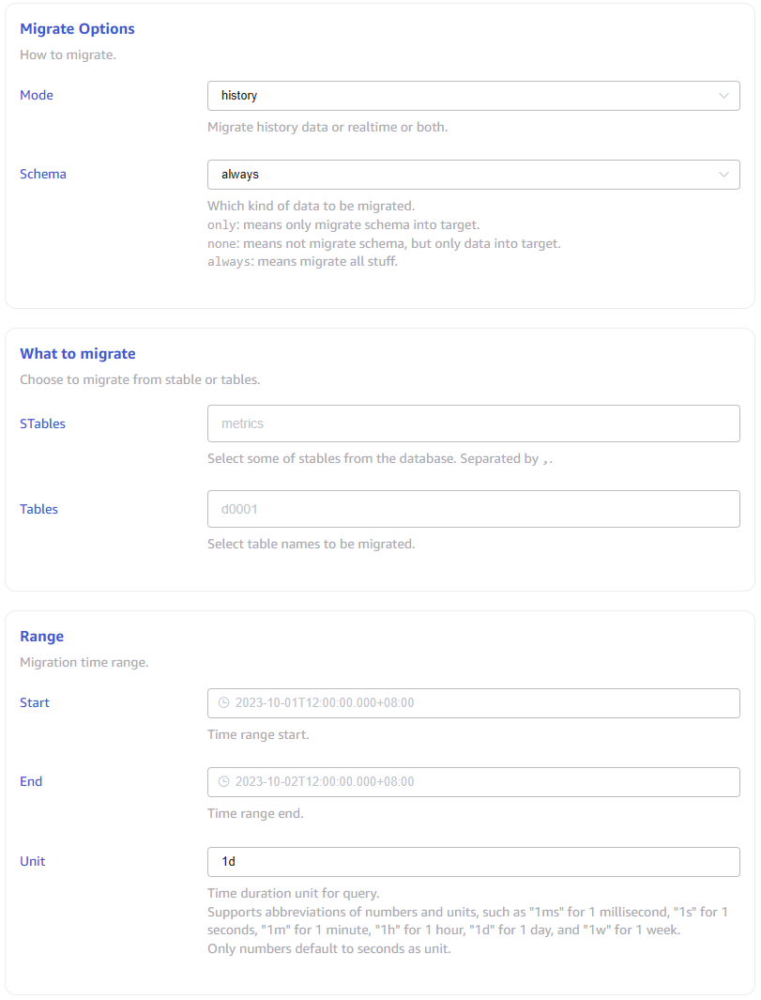
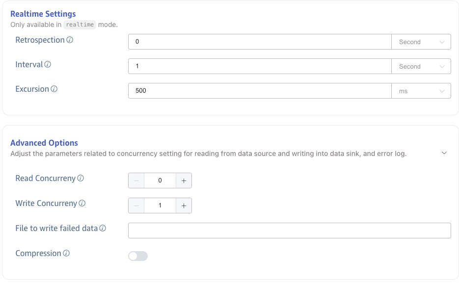

This section describes how to create a data migration task through the Explorer interface to migrate data from the old version of TDengine2 to the current cluster.

## Function Overview

taosX queries the source cluster data through SQL and writes the query results to the target database. In specific implementation, taosX uses data from a subtable for a time period as the basic unit of the query, and writes the data to be migrated into the target database in batches.

taosX supports three migration modes:
1. **history** mode. Refers to migrating data within the specified time range. If no time range is specified, all data up to the creation of the task will be migrated. After migration, the task will stop.
2. **realtime** mode. Synchronize the data after the task creation time. If the task is not manually stopped, the task will continue to run.
3. **both** mode. First execute the history mode, then execute the realtiem mode.

In each migration mode, you can specify whether to migrate the table structure. If "always" is selected, the table structure will be synchronized to the target database before migrating the data. If there are many subtables, this process may be longer. If you are sure that the target database already has the same table interface as the source database, it is recommended to choose "none" to save time.

The task will save progress information to the hard disk during operation, so if the task is paused and restarted, or if the task automatically resumes from an exception, the task will not start from scratch.

For more options, it is recommended to read the instructions for each form field on the Create Task page in detail.

## Specific steps

First, click the "Data Writing" menu on the left, and then click the new "Add Data Source" button on the right.

Then enter the task name, such as "migrate-test", and finally select the type "TDengine 2.x". At this point, the form switches to a form dedicated to migrating data from TDengine 2.x, containing a large number of options, each with detailed explanations, as shown in the figure below.

After clicking the "Submit" button to submit the task, return to the "Data Source" task list page to monitor the operation of the task.
