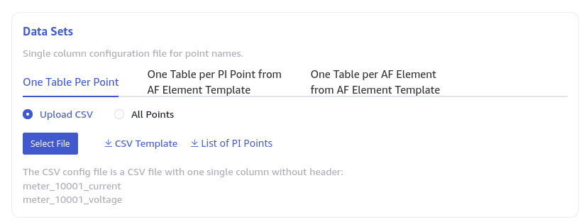
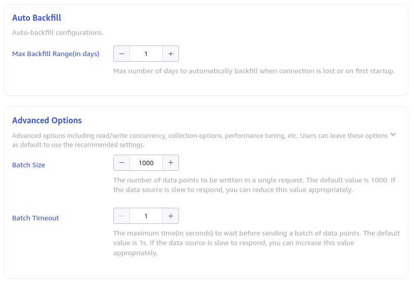

This section explains how to create a data migration task from a PI system to the current TDengine cluster using the Explorer interface.

## Overview

The PI system is a set of software products used for data collection, retrieval, analysis, transmission, and visualization. It serves as the infrastructure for managing real-time data and events in enterprise-level systems.

taosX can extract real-time data from the PI system using the PI connector plugin.

## Create Task

### 1. Add Data Source

In the data writing page, click the **+ Add Data Source** button to enter the add data source page.


### 2. Configure Basic Information

Enter the task name in **Name**, such as "test."

In the drop-down list under **Type**, select **PI**.

If the taosX service is running on the server where the PI system is located or directly connected (depending on the PI AF SDK), the **Agent** is not necessary. Otherwise, configure the **Agent**: select the specified agent from the drop-down box, or click the **+Create a New Agent** button to create a new agent following the prompts. That is, taosX or its agent needs to be deployed on a host that can be directly connected to the PI system.

In the drop-down list under **Target Database**, select a target database, or click the **+Create Database** button to create a new database.


### 3. Configure Connection Information

The PI connector supports two connection modes:

1. **PI Data Archive Only**: No AF mode is used. In this mode, enter the **PI Server Name** (server address, usually using the hostname).

   

2. **PI Data Archive and Asset Framework (AF) Server**: Use the AF SDK. In this mode, in addition to configuring the server name, you also need to configure the PI system (AF Server) name (hostname) and AF database name.

   

Click the **Connectivity Check** button to check if the data source is available.

### 4. Configure Monitoring Point Set

**Monitoring Point Set** can be selected using a CSV file template or using **All Points**.



Use a single-column text template, where each line represents a point name, as shown below:

```csv
meter_10001_current
meter_10001_voltage
meter_10002_current
meter_10002_voltage
```

### 5. Other Connection Configurations

As shown in the figure:



Where:

- **Max Backfill Range**: The maximum number of days to automatically backfill when the connection is lost or started for the first time. Default is 1 day.
- **Batch Size**: The maximum number of messages or rows sent in a single batch.
- **Batch Timeout**: The maximum delay for a single read (in milliseconds). When the timeout ends, as long as there is data, even if it does not meet the Batch Size, it is immediately sent.
