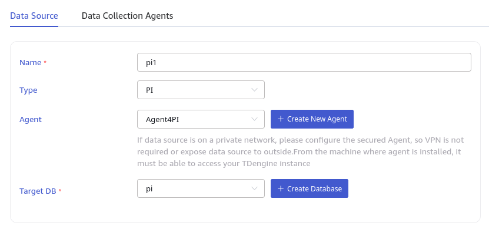
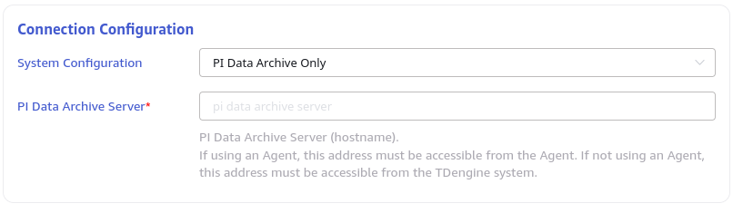
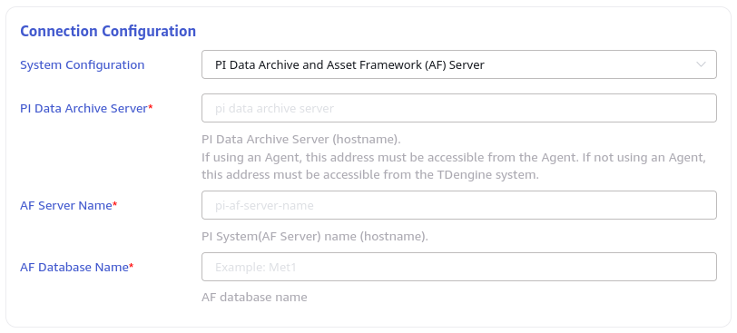

This section explains how to create a data migration task from a PI system to the current TDengine cluster using the Explorer interface.

## Overview

The PI system is a set of software products used for data collection, retrieval, analysis, transmission, and visualization. It serves as the infrastructure for managing real-time data and events in enterprise-level systems.

taosX can extract real-time data from the PI system using the PI connector plugin.

There are two kinds of PI task: real-time task and backfill task corresponding to "PI" and "PI backfill" in the drop down list of creating task page.

## Create Task

### 1. Add Data Source

In the data writing page, click the **+ Add Data Source** button to enter the add data source page.

### 2. Configure Basic Information

Enter the task name in **Name**, such as "test."

In the drop-down list under **Type**, select **PI** or **PI backfill**.

If the taosX service is running on the server where the PI system is located or directly connected (depending on the PI AF SDK), the **Agent** is not necessary. Otherwise, configure the **Agent**: select the specified agent from the drop-down box, or click the **+Create a New Agent** button to create a new agent following the prompts. That is, taosX or its agent needs to be deployed on a host that can be directly connected to the PI system.

In the drop-down list under **Target Database**, select a target database, or click the **+Create Database** button to create a new database.

### 3. Configure Connection Information

The PI connector supports two connection modes:

1. **PI Data Archive Only**: No AF mode is used. In this mode, enter the **PI Server Name** (server address, usually using the hostname).

   

2. **PI Data Archive and Asset Framework (AF) Server**: Use the AF SDK. In this mode, in addition to configuring the server name, you also need to configure the PI system (AF Server) name (hostname) and AF database name.

   

Click the **Connectivity Check** button to check if the data source is available.

### 4. Configure Data Model

In this section, we use a CSV file to configure the mapping rules from PI's data model to TDengine's data model. The mapping rules mentioned here include three aspects:

1. Define the scope of the source data, that is, which points or which templates need to be synchronized to TDengine.
2. Define the filtering rules, that is, only the data that meets specific conditions needs to be synchronized to TDengine.
3. Define the transformation rules, that is, what kind of transformation is done to the original data source before writing it to TDengine.

If you don't know how to operate specifically, you can click the "Download default configuration" button. The downloaded CSV file has detailed instructions for how to use.

### 5. Other Connection Configurations

As for the remaining configurations, the most important ones are:

1. For PI tasks, configure "Max Backfill Range". If the task is interrupted unexpectedly, configuring this parameter when restarting is very useful. It will let taosX automatically backfill the data for a period of time.
2. For the PI backfill task, you need to configure the start and end times of the backfill.

The advanced configuration section can configure the level of PI connector, "batch size", and  "batch delay". They are useful for debug and performance optimization.