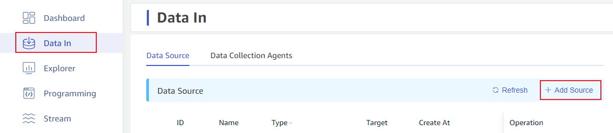
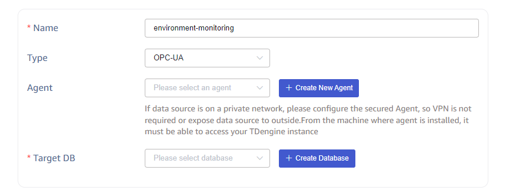
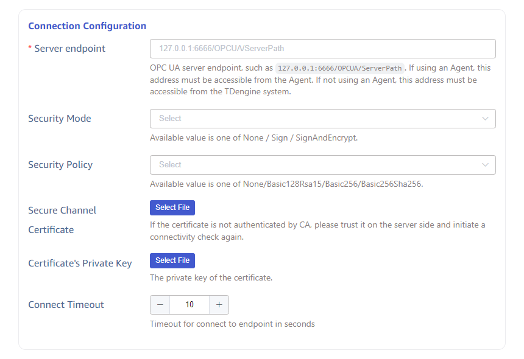
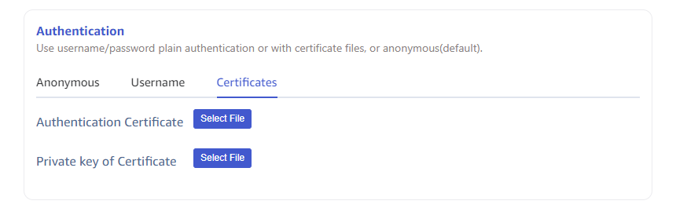
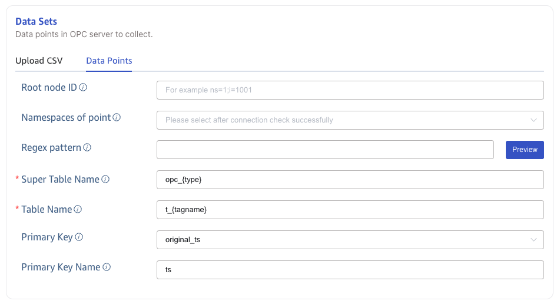
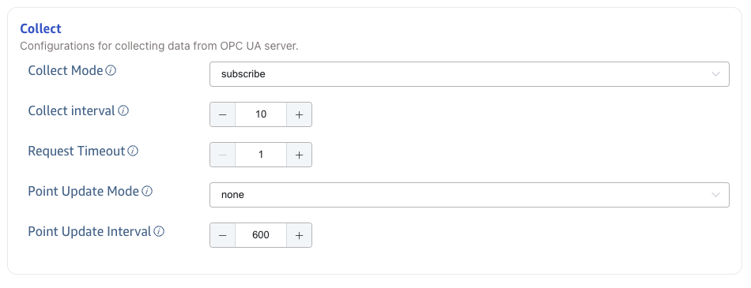
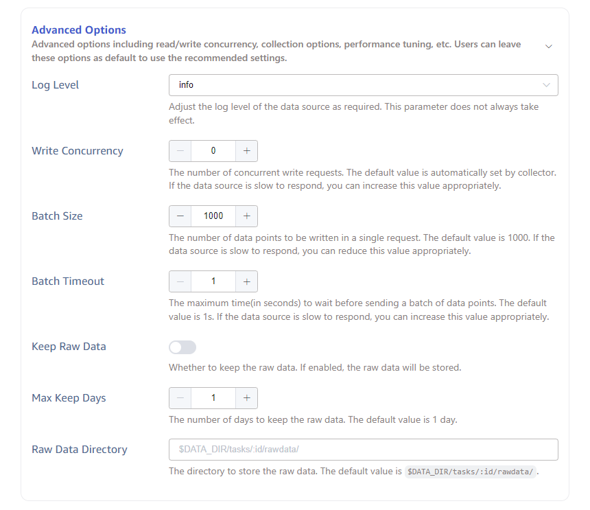

This section describes how to create a data migration task through the Explorer interface, migrating data from an OPC-UA server to the current TDengine cluster.

## Overview

OPC is one of the interoperability standards for securely and reliably exchanging data in the industrial automation field and other industries.

OPC-UA is the next-generation standard for the classic OPC specification. It is a platform-independent, service-oriented architecture specification that integrates all the features of the existing OPC Classic specification and provides a path to a more secure and scalable solution.

TDengine can efficiently read data from OPC-UA servers and write it to TDengine for real-time data synchronization.

## Creating a Task

### 1. Add Data Source

In the data writing page, click the **+Add Data Source** button to enter the add data source page.

### 2. Configure Basic Information

In the **Name** field, enter the task name, for example, for the task of monitoring ambient temperature and humidity, name it environment-monitoring.

In the dropdown list under **Type**, select **OPC-UA**.

**Agent** is optional. If needed, you can select a specific agent from the dropdown or click the **+Create New Agent** button [Create a New Agent](#CreateAgent).

In the dropdown list under **Target Database**, select a target database or click the **+Create Database** button [Create a New Database](#CreateDatabase).

### 3. Configure Connection Information

In the Connection Configuration area, fill in the OPC-UA service address, for example: 127.0.0.1:5000, and configure the security mode. There are three security modes to choose from:

1. None: Communication data is transmitted in plaintext.
2. Sign: Use digital signature to verify communication data and protect data integrity.
3. SignAndEncrypt: Use digital signature to verify communication data, and use encryption algorithm to encrypt the data to ensure the integrity, authenticity and confidentiality of the data.

If Sign or SignAndEncrypt is selected for Safe Mode, a valid security policy must be selected. The security policy defines how to implement encryption and verification mechanisms in Safe Mode, including the encryption algorithm used, key length, digital certificate, etc. Optional security policies include:

1. None: Can only be selected when the safe security is None.
2. Basic128Rsa15: Use RSA algorithm and 128-bit key length to sign or encrypt communication data.
3. Basic256: Use AES algorithm and 256-bit key length to sign or encrypt communication data.
4. Basic256Sha256: uses AES algorithm and 256-bit key length, and encrypts digital signatures using SHA-256 algorithm.
5. Aes128Sha256RsaOaep: Encrypts and decrypts communication data using AES-128 algorithm, encrypts digital signatures using SHA-256 algorithm, and uses RSA algorithm and OAEP mode for encryption and decryption of symmetric communication keys.
6. Aes256Sha256RsaPss: Encrypts and decrypts communication data using AES-256 algorithm, encrypts digital signatures using SHA-256 algorithm, and uses RSA algorithm and PSS mode for encryption and decryption of symmetric communication keys.

### 4. Authentication method

As shown in the figure below, switching tabs can select different authentication methods. Optional authentication methods include:

1. Anonymous
2. Username & Password
3. Certificate: It can be the same as the secure communication certificate, or different certificates can be used.

Click the **Connectivity Check** button to check if the data source is available. If using a secure communication certificate, the certificate must be trusted at the OPC UA server level, otherwise it still cannot pass.

### 5. Configure Point Set

You can choose **upload CSV** or **select all points** to configure the point set.

#### 5.1. Upload CSV

You can download the empty CSV template and configure the point location information according to the template, and then upload the CSV configuration file to configure the point location. Or download the data points based on configured filters and in the format specified by the CSV template.

CSV files have the following rules:

1. File encoding

The user must upload the CSV file in one of the following encoding formats:

(1) UTF-8 with BOM

(2) UTF-8 (i.e., UTF-8 without BOM)

2. Header Configuration Rules

Header is the first line of a CSV file, and the rules are as follows:

(1) The CSV Header can be configured as follows:

| No.  | Column name             | Description                                                  | Required | default                                                      |
| ---- | ----------------------- | ------------------------------------------------------------ | -------- | ------------------------------------------------------------ |
| 1    | point_id                | data point id on the OPC UA server                           | yes      | None                                                         |
| 2    | stable                  | data point in TDengine corresponding super table             | yes      | None                                                         |
| 3    | tbname                  | data point in TDengine corresponding sub table               | yes      | None                                                         |
| 4    | enable                  | Whether to collect the data of the point: 1 means collecting, 0 means not  | no       | default value is `1`      |
| 5    | value_col               | the column name corresponding to the collected value in TDengine | no       | default value is `val` |
| 6    | value_transform         | The  transformation function performed in taosX for data point acquisition values | no       | no default value  |
| 7    | type                    | The data type of the collected value    | no       | The original type of the collected values |
| 8    | quality_col             | The column name corresponding to the quality of the data point in TDengine | no       | no   | no default value           
| 9    | ts_col                  | The column name corresponding to the original timestamp of the data point in TDengine | no   | no default value     |
| 10   | received_ts_col         | The column name corresponding to the timestamp when the collected value of this point is received in TDengine | no       | no default value  |
| 11   | ts_transform            | The transformation function of the original timestamp  | no       | no transformation |
| 12   | received_ts_transform   | The transformation function of the data point receiving timestamp | no       |  no transformation|
| 13   | tag::VARCHAR(200)::name | Tag columns in TDengine. The format is `tag`:type:name, in which `tag` is a reserved keyword, type is the tag type, name is the tag name | no       |If no tag columns are configured and the stable does not exist in the TDengine, the following two tag columns are automatically added by default: tag::VARCHAR(256)::point_id and tag::VARCHAR(256)::point_name |

(2) There must be no duplicate columns in CSV headers.

(3) There can be multiple columns like 'tag::VARCHAR(200)::name', which corresponds to multiple tags in TDengine, but the Tag names should be different.

(4) The order of the columns does not affect the validation rules of the CSV file.

3. Row configuration rules

Each Row in the CSV file represents one OPC data point bit. The rules for Rows are as follows:

(1) Basic Rules

Each field in a row must conform to the corresponding field in the header line.

| No.  | Column in Header        | Value type | Value scope                                                  | requried | default  |
| ---- | ----------------------- | ---------- | ------------------------------------------------------------ | -------- | -------- |
| 1    | point_id                | String     | Something like `ns=3`; A string such as `i=1005` must meet the ID specification of OPC UA and contains the namespace and id| Yes |  None  |
| 2    | enable                  | int        | 0: The point is not collected, and the sub-table corresponding to the point in TDengine is deleted before the OPC DataIn task starts.  1: Collect this point and do not delete the child table before the OPC DataIn task starts. | No       | 1        |
| 3    | stable                  | String     | Any string that conforms to the TDengine supertable naming convention | Yes      |          |
| 4    | tbname                  | String     | Any regular string that conforms to the TDengine subtable naming convention. The special character '. ' in the tbname will be replaced with '_' automatically. You can use a few place holders in the tbname string: `{id}`, `{ns}` and `{tag_name}`, they will be replaced with real point id, name space, and the tags respectivelly and automatically when generating real table name. | Yes      |          |
| 5    | value_col               | String     | Column names that conform to the TDengine naming convention  | No       | val      |
| 6    | value_transform         | String     | Calculation expressions that conform to the Rhai engine, such as: '(val + 10) / 1000 * 2.0', 'log(val) + 10', etc.; | No       | None     |
| 7    | type                    | String     | Support types include: b/bool/i8/tinyint/i16/small/inti32/int/i64/bigint/u8/tinyint unsigned/u16/smallint unsigned/u32/int unsigned/u64/bigint unsigned/f32/float/f64/double/timestamp/timestamp(ms)/timestamp(us)/timestamp(ns)/json | No       | Raw type |
| 8    | quality_col             | String     | Column names that conform to the TDengine naming convention  | No       | None     |
| 9    | ts_col                  | String     | Column names that conform to the TDengine naming convention  | No       | ts       |
| 10   | received_ts_col         | String     | Column names that conform to the TDengine naming convention  | No       | rts      |
| 11   | ts_transform            | String     | Support +, -, *, /, % operators, such as: ts / 1000 * 1000, set the last 3 positions of a ms timestamp to 0; ts + 8 * 3600 * 1000, adding 8 hours to a timestamp with ms accuracy; ts-8 * 3600 * 1000, an ms precision timestamp, minus 8 hours | No       | None     |
| 12   | received_ts_transform   | String     | No                                                           | None     |          |
| 13   | tag::VARCHAR(200)::name | String     | The value in tag can be Chinese when the type of tag is VARCHAR | No       | NULL     |

(2) point_id must be unique in the whole DataIn task. If a data point needs to be written to multiple subtables, multiple OPC DataIn tasks need to be created.

(3) When more than one point_id are mapped to same tbname, their value_col must be different. This configuration allows multiple points of different data types to be written to different columns in the same subtable. 

4. Other rules

(1) If the number of columns in the Header and Row do not match, the validation fails and prompts the user for an incorrect column number.

(2) The Header is on the first line and cannot be empty.

(3) There must be at least one data point.

#### 5.2. Data Sets

You can filter OPC points by setting conditions such as **Root node ID**, **Namespaces of point**, and **Regular pattern**.

By setting **Super Table Name** and **Table Name**, you can specify the super table and sub-table in TDengine to which data is to be written.

Configure **Primary Key**. Select `origin_ts` to use the original timestamp of OPC point data as the primary key in TDengine. Selecting `received_ts` means using the receipt timestamp of the data as the primary key in TDengine. Configure **Primary Key Name**, specifying the name of the TDengine timestamp column.

### 6. Collect Configuration

In the **Collect** configuration, set the **Collect Mode**, **Collect interval**, and **Request Timeout** for the current task.

As shown in the figure:

- **Collect Mode**: Can use `subscribe` or `observe` mode.
  - `subscribe`: Subscription mode, report data and write when changes occur.
  - `observe`: Read the latest values of points and report.
- Collect Interval: Default is 10 seconds. Polling reads the latest value of the point bit and writes it to TDengine.
- **Request Timeout**: Default is 10 seconds. If no data is returned after the duration when reading point data from the OPC server, the reading fails.

When using the **Data Points** in the **Data Sets**, the **Collect** configuration can configure the **Point Update Mode** and **Point Update Interval** to enable the **dynamic point update**. The **dynamic point update** indicates that when the OPC Server adds or deletes points during the task running, the qualified points are automatically added to the current OPC DataIn task without restarting it.

- **Point Update Mode**: Select `None`, `Append`, or `Update`.
  - `None`: dynamic point update is not enabled.
  - `Append`: enables dynamic point update, but only appends.
  - `Update`: enables dynamic point update, add new points and delete removed points.
- **Point Update Interval**: takes effect when the **Point Update Mode** is `Append` or `Update`. The unit is second. The default value is 600. The minimum value is 60. The maximum value is 2147483647.

### 7. Advance Options

As shown in the above figure, configuring advanced options for more detailed optimization of performance, logging, etc.

- **Request Timeout**: Adjust the log level of the data source as required.
- **Write Concurrency**: The number of concurrent write requests. The default value is automatically set by collector. If the data source is slow to respond, you can increase this value appropriately.
- **Batch Size**: The number of data points to be written in a single request. The default value is 1000. If the data source is slow to respond, you can reduce this value appropriately.
- **Batch Timeout**: The maximum time(in seconds) to wait before sending a batch of data points. The default value is 1s. If the data source is slow to respond, you can increase this value appropriately.

When saving the original data in log file, the following two parameter configurations take effect:

- **Max Keep Days**: The number of days to keep the raw data. The default value is 1 day.
- **Raw Data Directory**: Set the original data source storage path. If using Agent, the storage path refers to the path on the server where the Agent is located, otherwise it is the path on the taosX server. Placeholders `$DATA_DIR` and `:id` can be used as part of the path.

  - On Linux platform: $DATA_DIR is /var/lib/taos/taosx, the default storage path is `/var/lib/taos/taosx/tasks/<task_id>/rawdata`.
  - On Widonws platform: $DATA_DIR is C:\TDengine\data\taosx, default storage path is `C:\TDengine\data\taosx\tasks\<task_id>\rawdata`.

### 8. Finish

After completing the above information, click the **Submit** button to initiate data synchronization from OPC UA to TDengine.

## View Task Status

After submitting the task, you can go back to the data source page to view the task status. The task is first added to the execution queue and will start running later.

Click **Submit** button to complete the task of creating OPC UA data synchronization to TDengine and return to [Data Source List](../../explorer/#data-in) page to view the task execution.
