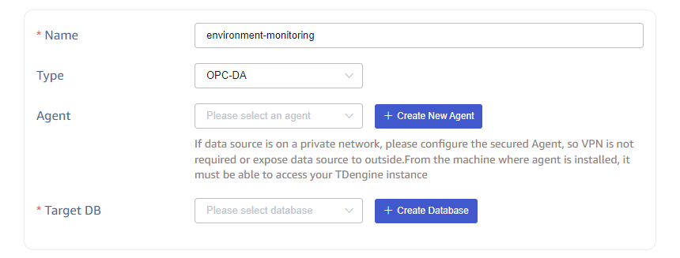
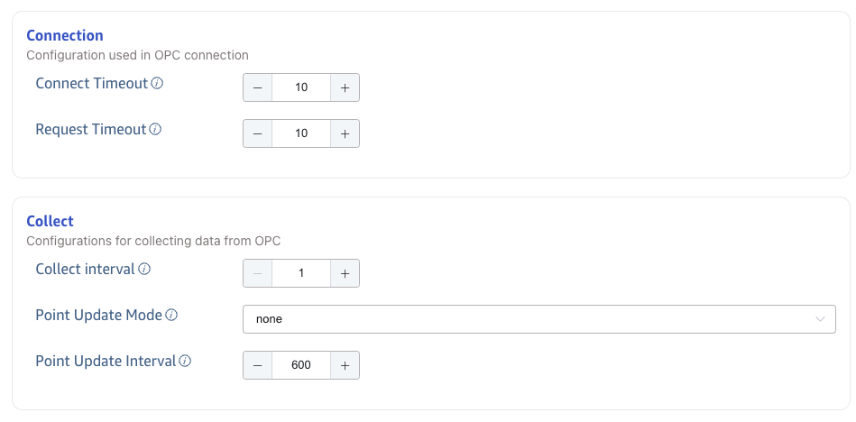

This section describes how to create a data migration task through the Explorer interface, migrating data from an OPC-DA server to the current TDengine cluster.

## Overview

OPC is one of interoperability standard for the secure and reliable exchange of data in the industrial automation space and in other industries.

OPC DA (Data Access) is a classic COM-based specification that works only on Windows.
OPC DA is widely used even though it isn’t the newest and most efficient data communication specification out there. This is mainly because of older devices that only support the OPC DA.

TDengine can efficiently read data from OPC-DA servers and write it into TDengine, achieving real-time data synchronization.

## Creating a Task

### 1. Add Data Source

In the data writing page, click the **+Add Data Source** button to enter the add data source page.

### 2. Configure Basic Information

In the **Name** field, enter the task name, for example, for the task of monitoring ambient temperature and humidity, name it environment-monitoring.

In the dropdown list under **Type**, select **OPC-DA**.

**Agent** is required for OPC-DA unless taosX is served in your OPC-DA accessible host. Select a specific agent from the dropdown or click the **+Create New Agent** button to create a new Agent, follow the instructions in the dialog and finish configuration.

In the dropdown list under **Target Database**, select a target database or click the **+Create Database** button to create a new database.

### 3. Configure Connection Information

In the **Connection Configuration** section, fill in the **OPC-DA Service Address**, for example, `127.0.0.1/Matrikon.OPC.Simulation.1`, and configure the authentication method.

Click the **Connectivity Check** button to check if the data source is available.

### 4. Configure Data Sets

You can choose **Upload CSV** or **Data Points** to config **Data Sets**.

#### 4.1. Upload CSV

You can download the empty CSV template and configure the point location information according to the template, and then upload the CSV configuration file to configure the point location. Or download the data points based on configured filters and in the format specified by the CSV template.

CSV files have the following rules:

1. File encoding

The user must upload the CSV file in one of the following encoding formats:

(1) UTF-8 with BOM

(2) UTF-8 (i.e., UTF-8 without BOM)

2. Header configuration rules

Header is the first line of a CSV file, and the rules are as follows:

(1) The CSV Header can be configured as follows:

| No. | Column name             | Description                                                                                                                                       | Required | default                                                                                                                                                                                                         |
| --- | ----------------------- | ------------------------------------------------------------------------------------------------------------------------------------------------- | -------- | --------------------------------------------------------------------------------------------------------------------------------------------------------------------------------------------------------------- |
| 1   | tag_name                | data point id on the OPC DA server                                                                                                                | yes      | None                                                                                                                                                                                                            |
| 2   | stable                  | super table name in TDengine                                                                                                                      | yes      | None                                                                                                                                                                                                            |
| 3   | tbname                  | subtable name in TDengine                                                                                                                         | yes      | None                                                                                                                                                                                                            |
| 4   | enable                  | Whether to collect the data of the point:`1`: yes; `0`: no                                                                                        | no       | `1`                                                                                                                                                                                                             |
| 5   | value_col               | the column name corresponding to the collected value in TDengine                                                                                  | no       | `val`                                                                                                                                                                                                           |
| 6   | value_transform         | the transformation function of the data value                                                                                                     | no       | none                                                                                                                                                                                                            |
| 7   | type                    | the data type of the collected data point value                                                                                                   | no       | The original type in the OPC system                                                                                                                                                                             |
| 8   | quality_col             | The column name corresponding to the quality of the data point                                                                                    | no       | none, which means the quality is not written into TDengine                                                                                                                                                      |
| 9   | ts_col                  | The column name of the original timestamp of the data point                                                                                       | no       | none, which means it's not written into TDengine                                                                                                                                                                |
| 10  | received_ts_col         | The column name of the timestamp when the collected value of this point is received                                                               | no       | which means it's not written into TDengine                                                                                                                                                                      |
| 11  | ts_transform            | The transformation function of the original timestamp                                                                                             | no       | none, which means no transformation                                                                                                                                                                             |
| 12  | received_ts_transform   | The transformation function of the receiving timestamp                                                                                            | no       | none, which means no transformation                                                                                                                                                                             |
| 13  | tag::VARCHAR(200)::name | The tags, defined in format`tag`::type::name, in which `tag` is a reserved keyword, type is an legal TDengine tag type, name is an legal tag name | no       | If no tag columns are configured and the stable does not exist in the TDengine, the following two tag columns are automatically added by default: tag::VARCHAR(256)::point_id and tag::VARCHAR(256)::point_name |

(2) There must be no duplicate columns in CSV headers.

(3) There can be multiple tag columns defined like 'tag::VARCHAR(200)::name',but the tag names should be different.

(4) The order of the columns does not affect the validation rules of the CSV file.

3. Row configuration rules

Each Row in the CSV file represents one OPC data point bit. The rules for Row are as follows:

(1) has the following relationship with the column in the Header

| No. | Column in Header        | Value type | Value scope                                                                                                                                                                                                                                                                                       | Required | Default  |
| --- | ----------------------- | ---------- | ------------------------------------------------------------------------------------------------------------------------------------------------------------------------------------------------------------------------------------------------------------------------------------------------- | -------- | -------- |
| 1   | tag_name                | String     | ID specification of OPCDA, like`root.parent.temperature`                                                                                                                                                                                                                                          | Yes      | none     |
| 2   | enable                  | int        | 0: The point is not collected, and the sub-table corresponding to the point in TDengine is deleted before the OPC DataIn task starts. 1: Collect this point and do not delete the child table before the OPC DataIn task starts.                                                             | No       | 1        |
| 3   | stable                  | String     | Any string that conforms to the TDengine supertable naming convention; You can use place holder `{type}` in the string, it will be replaced with the type field if it exists in the CSV file or the orignal type of the collected value                                                             | Yes      | none     |
| 4   | tbname                  | String     | Any string that conforms to the TDengine subtable naming convention; Special character '.' will be replaced with '_' automatically. You can use place holders: `{id}`, `{nd}` and `{tag_name}`, they will be replaced with the point id, name space and tag name respectivelly and automatically. | Yes      | none     |
| 5   | value_col               | String     | Column names that conform to the TDengine naming convention                                                                                                                                                                                                                                       | No       | `val`    |
| 6   | value_transform         | String     | Calculation expressions that conform to the Rhai engine, such as: '(val + 10) / 1000 * 2.0', 'log(val) + 10', etc.;                                                                                                                                                                               | No       | None     |
| 7   | type                    | String     | Supported types: b/bool/i8/tinyint/i16/small/inti32/int/i64/bigint/u8/tinyint unsigned/u16/smallint unsigned/u32/int unsigned/u64/bigint unsigned/f32/float/f64/double/timestamp/timestamp(ms)/timestamp(us)/timestamp(ns)/json                                                                   | No       | raw type |
| 8   | quality_col             | String     | Column names that conform to the TDengine naming convention                                                                                                                                                                                                                                       | No       | None     |
| 9   | ts_col                  | String     | Column names that conform to the TDengine naming convention                                                                                                                                                                                                                                       | No       | ts       |
| 10  | received_ts_col         | String     | Column names that conform to the TDengine naming convention                                                                                                                                                                                                                                       | No       | rts      |
| 11  | ts_transform            | String     | Support +, -, *, /, % operators, such as: ts / 1000 * 1000, set the last 3 positions of a ms timestamp to 0; ts + 8 * 3600 * 1000, adding 8 hours to a timestamp with ms accuracy; ts-8 * 3600 * 1000, an ms precision timestamp, minus 8 hours                                                   | No       | None     |
| 12  | received_ts_transform   | String     | No                                                                                                                                                                                                                                                                                                | None     |          |
| 13  | tag::VARCHAR(200)::name | String     | The tag value can be Chinese when the type of tag is VARCHAR                                                                                                                                                                                                                                      | No       | NULL     |

(2) point_id must be unique in the whole OPC DataIn task. If a data point needs to be written to multiple subtables, you need to create multiple OPC DataIn tasks.

(3) When multiple point_id are mapped to same tbname, their value_col must be different. This configuration allows multiple points of different data types to be written to different columns in the same subtable.

4. Other rules

(1) If the number of columns in the Header and the number of fields in any row do not match, the validation fails and prompts the user for an incorrect column number.

(2) The Header is on the first line and cannot be empty.

(3) There must be at least one data point.

#### 4.2. Data Points

You can filter OPC points by setting conditions such as **Root node** and **Regular pattern**.

By setting **Super Table Name** and **Table Name**, you can specify the super table and sub-table in TDengine to which data is to be written.

Configure **Primary Key**. Select `origin_ts` to use the original timestamp of OPC point data as the primary key in TDengine. Selecting `received_ts` means using the receipt timestamp of the data as the primary key in TDengine. Configure **Primary Key Name**, specifying the name of the TDengine timestamp column.

### 5. Collect Configuration

In the **Collect** configuration, set the **Connect Timeout**, **Request Timeout** and **Collect interval** for the current task.

As shown in the figure:

- **Connect Timeout**: Configure the connection timeout interval, default is 10 seconds.
- **Request Timeout**: Collection request timeout interval for data points, default is 10 seconds.
- **Collect Interval**: Data point collection interval, default is 10 seconds.

When using the **Data Points** in the **Data Sets**, the **Collect** configuration can configure the **Point Update Mode** and **Point Update Interval** to enable the **dynamic point update**. The **dynamic point update** indicates that when the OPC Server adds or deletes points during the task running, the qualified points are automatically added to the current OPC DataIn task without restarting it.

- **Point Update Mode**: Select `None`, `Append`, or `Update`.
  - `None`: dynamic point update is not enabled.
  - `Append`: enables dynamic point update, but only appends.
  - `Update`: enables dynamic point update, add new points and delete removed points.
- **Point Update Interval**: takes effect when the **Point Update Mode** is `Append` or `Update`. The unit is second. The default value is 600. The minimum value is 60. The maximum value is 2147483647.

### 6. Advance Options

As shown in the above figure, configuring advanced options for more detailed optimization of performance, logging, etc.

- **Request Timeout**: Adjust the log level of the data source as required.
- **Write Concurrency**: The number of concurrent write requests. The default value is automatically set by collector. If the data source is slow to respond, you can increase this value appropriately.
- **Batch Size**: The number of data points to be written in a single request. The default value is 1000. If the data source is slow to respond, you can reduce this value appropriately.
- **Batch Timeout**: The maximum time(in seconds) to wait before sending a batch of data points. The default value is 1s. If the data source is slow to respond, you can increase this value appropriately.

When saving the original data in log file, the following two parameter configurations take effect:

- **Max Keep Days**: The number of days to keep the raw data. The default value is 1 day.
- **Raw Data Directory**: Set the original data source storage path. If using Agent, the storage path refers to the path on the server where the Agent is located, otherwise it is the path on the taosX server. Placeholders `$DATA_DIR` and `:id` can be used as part of the path.

  - On Linux platform: $DATA_DIR is /var/lib/taos/taosx, the default storage path is `/var/lib/taos/taosx/tasks/<task_id>/rawdata`.
  - On Widonws platform: $DATA_DIR is C:\TDengine\data\taosx, default storage path is `C:\TDengine\data\taosx\tasks\<task_id>\rawdata`.

### 7. Finish

After completing the above information, click the **Submit** button to initiate data synchronization from OPC DA to TDengine.

## View Task Status

After submitting the task, you can go back to the data source page to view the task status. The task is first added to the execution queue and will start running later.

Click **Submit** button to complete the task of creating OPC DA data synchronization to TDengine and return to [Data Source List](../../explorer/#data-in) page to view the task execution.
