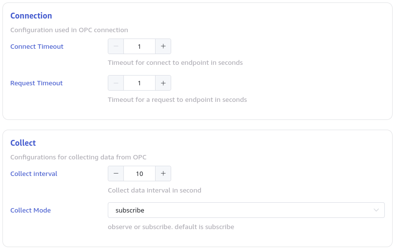

This section describes how to create a data migration task through the Explorer interface, migrating data from an OPC-DA server to the current TDengine cluster.

## Overview

OPC is one of interoperability standard for the secure and reliable exchange of data in the industrial automation space and in other industries.

OPC DA (Data Access) is a classic COM-based specification that works only on Windows.
OPC DA is widely used even though it isn’t the newest and most efficient data communication specification out there. This is mainly because of older devices that only support the OPC DA.

TDengine can efficiently read data from OPC-DA servers and write it into TDengine, achieving real-time data storage.

## Creating a Task

### 1. Add Data Source

In the data writing page, click the **+Add Data Source** button to enter the add data source page.


### 2. Configure Basic Information

In the **Name** field, enter the task name, such as "test".

In the dropdown list under **Type**, select **OPC-DA**.

**Agent** is required for OPC-DA unless taosX is served in your OPC-DA accessible host. Select a specific agent from the dropdown or click the **+Create New Agent** button to create a new Agent, follow the instructions in the dialog and finish configuration.

In the dropdown list under **Target Database**, select a target database or click the **+Create Database** button to create a new database.


### 3. Configure Connection Information

In the **Connection Configuration** section, fill in the **OPC-DA Service Address**, for example, `127.0.0.1:5000`, and configure the authentication method.

Click the **Connectivity Check** button to check if the data source is available.


### 4. Configure Point Set

**Point Set** can be selected using a CSV file template or **Select All Points**.

CSV file template looks like:

```csv
Index (optional), Information Point Code (required, used as the sub-table name), OPC TAG Point Address (required field), Data Type (required), Collection Value Column Name (configurable, default val), Quality Bit Column Name (configurable, default quality), Information Point Enabled 1-Enabled 0-Disabled (optional, default Enabled), Corresponding Super Table Table Name, OPC Original Time Column Name (default ts and as the first column), TD Server Receive Time Column Name (optional, if configured, this column is the first column), Tag Column 1 (required), Tag Column 2 (optional)
0,tbname,point_id,type,value_col,quality_col,enabled,stable,ts_col,received_ts_col,tag::VARCHAR(200)::name,tag::VARCHAR(50)::unit
1,tbname1,ns=3;i=1002,int,val,quality,1,stb_int,ts,rts,Storage Temperature,℃
2,tbname2,ns=3;i=1007,double,val,quality,0,stb_double,ts,rts,Pressure Relief Valve Pressure,kpa
```

The following information is mandatory:

- Information Point Code: Used as the sub-table name.
- TAG Point Address: Typically in the format `id.name`, a string that can be exported from the OPC-DA server using a tool or downloaded from this page under **Download the list of all points** for editing.
- Data Type: Used as the data type in the TDengine cluster for writing values.
- Tag Columns: The second row defines the tags, formatted as `tag::<type>::<column>`, such as `tag::VARCHAR(200)::name`.

Other columns are optional:
- Value Column Name: Default is `val` and cannot be empty.
- Quality Bit Column Name: Default is `quality` and cannot be empty.
- Super Table Name: Default is `opc_<data type>`. For example, the super table name for DOUBLE type is `opc_double`. Custom values cannot contain `.` and cannot be empty.
- Original Time Column Name: Default is `ts`.
- Receive Time Column Name: Default is `received_ts`. When this column is added, it becomes the first column.

Columns marked as **optional**, if not needed, should be deleted before submission.

### 5. Other Connection Configurations

As shown in the figure:



Where:

- **Connect Timeout**: Configure the connection timeout interval, default is 10 seconds.
- **Request Timeout**: Collection request timeout interval for data points, default is 10 seconds.
- **Collect Interval**: Data point collection interval, default is 10 seconds.
- **Collect Mode**: Can use `subscribe` or `observe` mode:

  - `subscribe`: Subscription mode, report data and write when changes occur.
  - `observe`: Read the latest values of points and report.
