This section explains how to create a data migration task through the Explorer interface to migrate data from MQTT to
the current TDengine cluster.

## Functional Overview

MQTT stands for Message Queuing Telemetry Transport. It is a lightweight messaging protocol that is easy to implement
and use.

TDengine can efficiently read the data from MQTT and write to TDengine to achieve real-time data streaming.

## Create Task

### 1. Add Source

In the **Data In** page，click **+Add Source** button to enter the data source page.

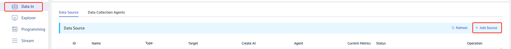

### 2. Configure Basic information

In the **Name** field, enter the task name, such as "test_mqtt";

In the **Type** dropdown list, select **MQTT**.

**Agent** is not required, if necessary, you can select the specified agent from the dropdown box, you can also click
the right **+ Create New Agent** button [Create New Agent](#Create New Agent).

Select a target database from the **Target DB** dropdown list, or click the **+Create Database** button on the right
[Create Database](#Create Database).

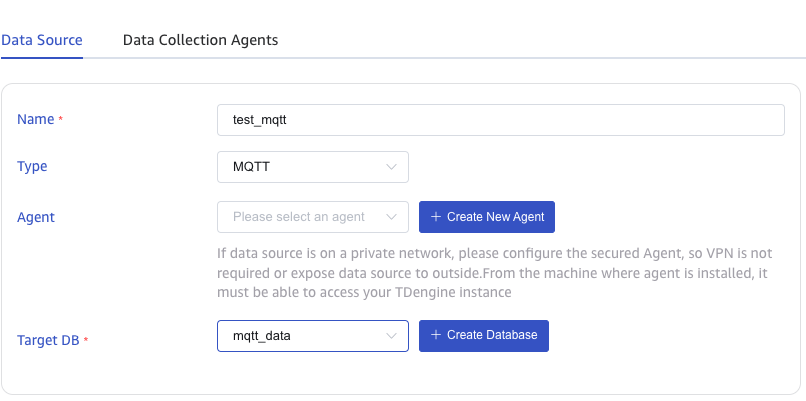

### 3. Configure Connection and Authentication Information

In the **MQTT Address** field, fill in the address of the MQTT broker, for example: `192.168.1.42:1833`.

In the **Username** field, fill in the username of the MQTT broker.

In the **Password** field, fill in the password of the MQTT broker.

Click the **Check Connection** button to check whether the data source is available.

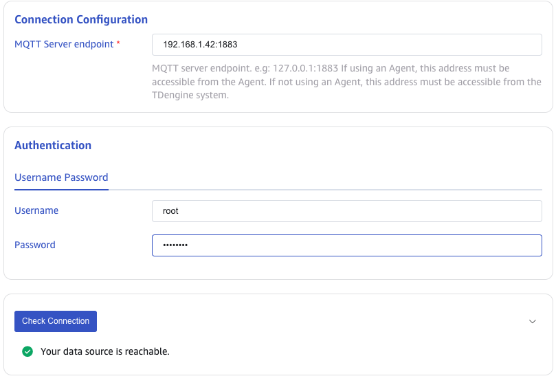

### 4. Configure SSL Certificate

If the MQTT broker uses an SSL certificate, you need to upload the certificate file in **SSL Certificate**.

### 5. Configure Collection

In the **Collect** area, fill in the configuration parameters related to the collection task.

In the **MQTT Protocol** dropdown list, select the MQTT protocol version. There are three
options: `3.1`, `3.1.1`, `5.0`.
The default value is 3.1.

In the **Client ID** field, fill in the client ID.When creating multiple tasks, the Client ID must be unique under the same MQTT Address.

In the **Keep Alive** field, enter the keep alive interval. If the proxy does not receive any messages from the client
within the keep alive interval, it will assume that the client has disconnected and close the connection.
The keep alive interval is the time interval negotiated between the client and the proxy to detect whether the client is
active. If the client does not send a message to the proxy within the keep alive interval, the proxy will disconnect.

In the **Clean Session** field, select whether to clear the session. The default value is true.

In the **Subscribe Topic and QoS Configuration** field, fill in the Topic name to be consumed. Use the following format:
`topic1::0,topic2::1`.

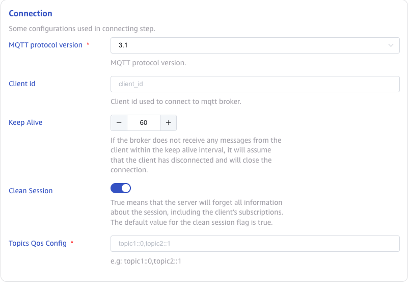

### 6. Configure MQTT Payload

In the **MQTT Payload Parser** area, fill in the configuration parameters related to the payload parsing.

taosX can extract JSON-formatted data from value and then split it into new columns.

#### 6.1 Parse
There are three ways to get sample data:

Click the **Retrieve From Server** button from the server to get the sample data from MQTT.

Click the **Upload File** button to upload the CSV file and get the sample data.

In the **Message Body** field, fill in the sample data in the Kafka message body, for example:
`{"id": 1, "message": "hello-word"}{"id": 2, "message": "hello-word"}`. This sample data will be used to configure the extraction and filtering conditions
later.

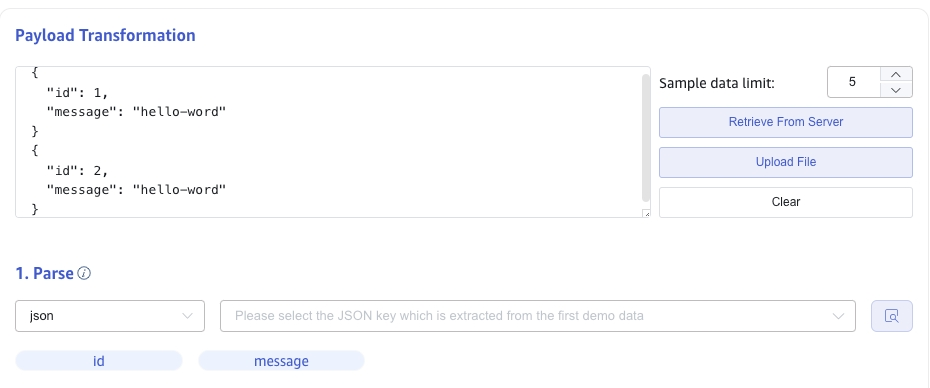

Click the **Preview** button to preview parse results.

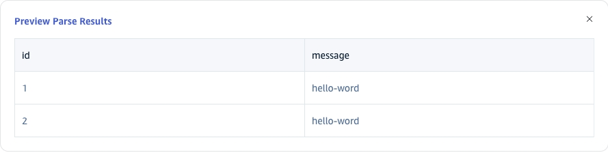

#### 6.2 Extract or Split From A column

In the **Extract or Split From A column** field, fill in the fields to be extracted or split from the message body, for example: split the `message` field into `message_0` and `message_1` fields, with `split` Extractor, separator filled as `-`, number filled as `2`.

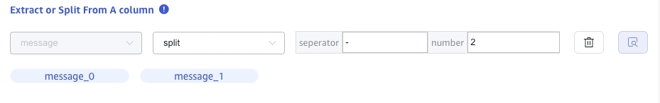

Click the **Delete** button to delete the current extraction rule.

Click the **Add** button to add more extraction rules.

Click the **Preview** button to view the Extract or Split From A column result.

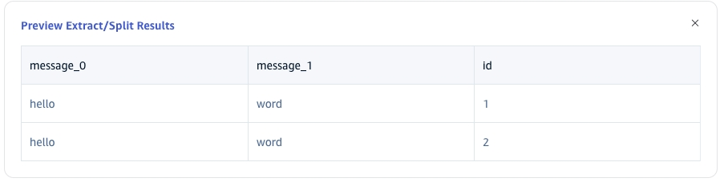

#### 6.3 Filter

In the **Filter** field, enter the filter conditions. For example, input `id != 1`, then only the data with an id not equal to 1 will be written to TDengine.

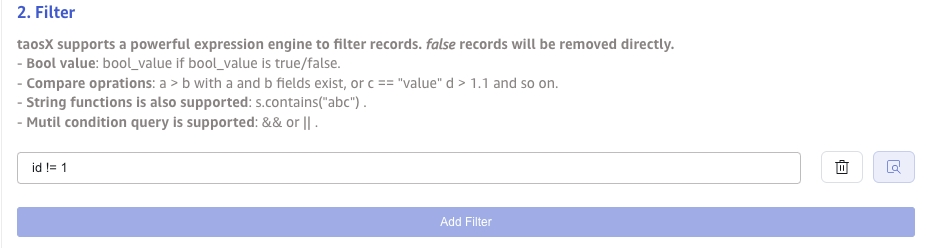

Click the **Delete** button to delete the current filter rule.

Click the **Preview** button to view the filter result.

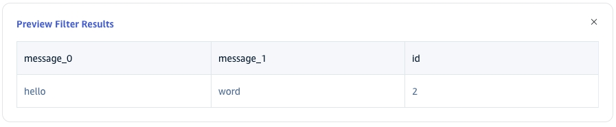

#### 6.4 Mapping

In the **Target Super Table** dropdown list, select a target super table, or click the **+Create STable** button on the right to [Create Super Table](#Create STable).

In the **Mapping** area, fill in the sub-table name in the target super table, for example: `t_{id}`.Fill in the mapping rules according to the requirements, where mapping supports setting default values.

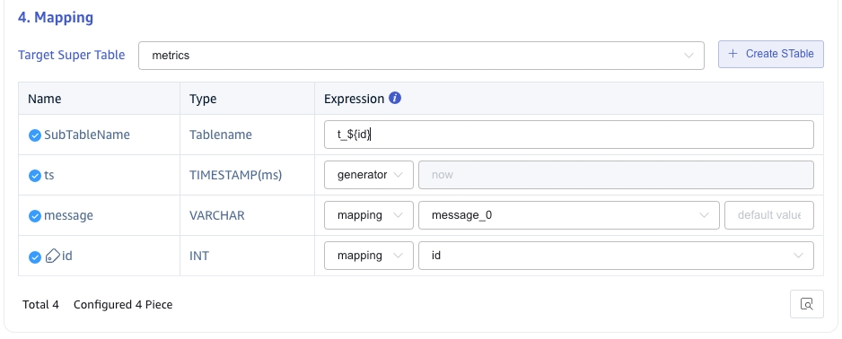

Click the **Preview** button to view the mapping result.

### 7. Advanced Settings

In the **Log Level** dropdown list, choose the log level from the available options: `TRACE`, `DEBUG`, `INFO`, `WARN`, `ERROR`. The default value is INFO.

When the **Keep Raw Data**  is enabled, the following two parameters take effect.

**Max Keep Days:** The number of days to keep the raw data. The default value is 1 day.

**Raw Data Directory:**, The directory to store the raw data. The default value is $DATA_DIR/tasks/:id/rawdata/.

### 8. Finish

Click the **Add** button to complete the creation of the MQTT to TDengine data synchronization task.

## View Task Status

Click **Submit** button to complete the task of creating MQTT data synchronization to TDengine and return to [Data Source List](../../explorer/#data-in) page to view the task execution.
