This section explains how to create a data migration task through the Explorer interface to migrate data from Kafka to the current TDengine cluster.

## Functional Overview
Apache Kafka is an open-source distributed streaming system used for stream processing, real-time data pipelines, and data integration at scale.

TDengine can efficiently read the data from Kafka and write to TDengine to achieve historical data migration or real-time data synchronization.

## Create Task

### 1. Add Source

In the **Data In** page，click **+Add Source** button to enter the data source page.

### 2. Configure Basic information

Enter the task name in the **Name** field, such as "test_kafka";

In the **Type** drop-down list, select **Kafka**.

**Agent** is not required, if necessary, you can select the specified agent from the drop-down box, you can also click the right **+ Create New Agent** button [Create New Agent](#Create New Agent).

Select a target database from the **Target DB** drop-down list, or click the **+Create Database** button on the right [Create Database](#Create Database).

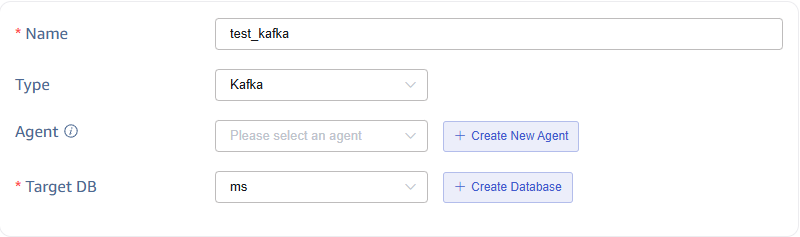

### 3. Configure Connection information

In the **Connection Configuration** area, fill in the **bootstrap-servers**, for example: `192.168.1.92:9092`.

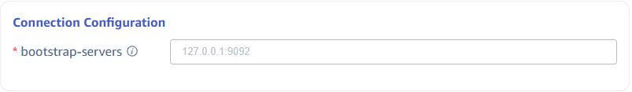

### 4. Configure SASL Authentication

If the server has enabled SASL authentication, SASL needs to be enabled and related content needs to be configured here. Currently, PLAIN/SCRAM-SHA-256/GSSAPI authentication are supported. Please choose according to the actual situation.

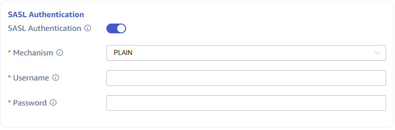

### 5. Configure SSL certificate

If the server has enabled SSL encryption, SSL needs to be enabled and related content needs to be configured here.

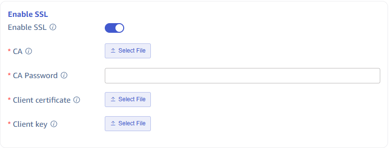

### 6. Configure Collection

In the **Collect** area, fill in the configuration parameters related to the collection task.

In the **Timeout** field, fill in the timeout time. When no data is consumed from Kafka, the data collection task will exit after timeout. The unit is milliseconds, and the default value is 0 ms. When the timeout is set to 0, it will wait until data is available or an error occurs.

In the **Topic** field, fill in the Topic name to be consumed. Multiple Topics can be configured, and Topics are separated by commas. For example: `tp1,tp2`.

In the **Offset** drop-down list, select which Offset to start consuming data from. There are three options: `Earliest`, `Latest`, `ByTime(ms)`. The default value is Earliest.

* Earliest: Request the earliest offset.
* Latest: Request the latest offset.

In the **Maximum time to wait for data** field, fill in the maximum time in milliseconds to wait for insufficient data to become available when fetching messages. (e.g. fetch_max_wait_time=500ms) default is 100ms.

Click the **Check Connection** button to check whether the data source is available.

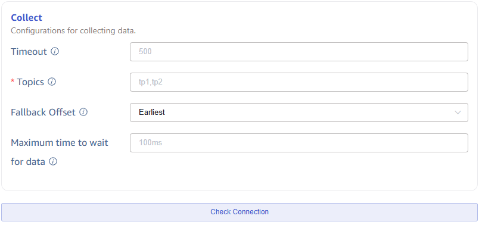

### 7. Configure Payload Parsing

In the **Kafka Message Parser** area, fill in the configuration parameters related to the payload parsing.

#### 7.1 Parse
There are three ways to get sample data:

Click the **Retrieve From Server** button from the server to get the sample data from Kafka.

Click the **Upload File** button to upload the CSV file and get the sample data.

In the **Message Body** field, fill in the sample data in the Kafka message body, for example: `{"id": 1, "message": "hello-word"}{"id": 2, "message": "hello-word"}`. This sample data will be used to configure the extraction and filtering conditions later.

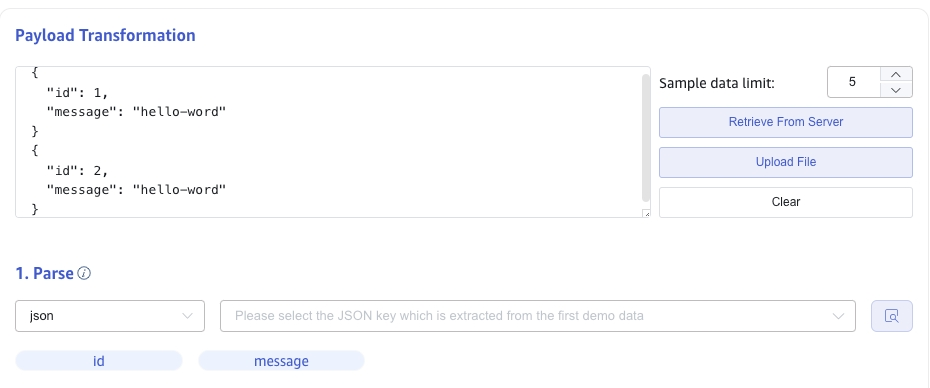

Click the **Preview** button to preview parse results.

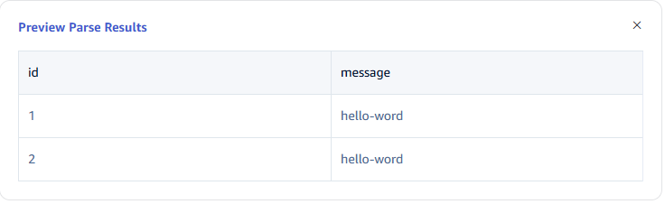

#### 7.2 Extract or Split From A column

In the **Extract or Split From A column** field, fill in the fields to be extracted or split from the message body, for example: split the `message` field into `message_0` and `message_1` fields, with `split` Extractor, separator filled as `-`, number filled as `2`.

Click the **Add** button to add more extraction rules.

Click the **Delete** button to delete the current extraction rule.

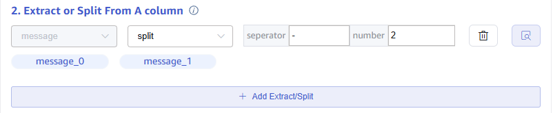

Click the **Preview** button to view the Extract or Split From A column result. 

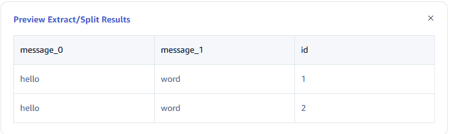

#### 7.3 Filter

In the **Filter** field, fill in the filter conditions, for example: fill in `id != 1`, then only the data with id not equal to 1 will be written to TDengine.

Click the **Add** button to add more filter rules.

Click the **Delete** button to delete the current filter rule.

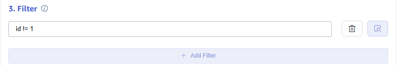

Click the **Preview** button to view the filter result.

#### 7.4 Mapping

In the **Target Super Table** drop-down list, select a target super table, or click the **+Create STable** button on the right to [Create Super Table](#Create STable).

In the **Mapping** area, fill in the sub-table name in the target super table, for example: `t_{id}`.Fill in the mapping rules according to the requirements, where mapping supports setting default values.

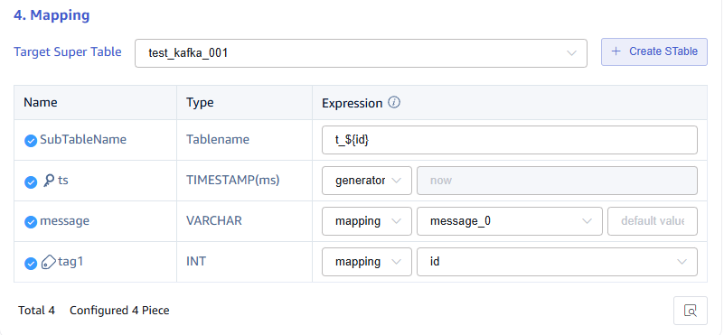

Click the **Preview** button to view the mapping result.

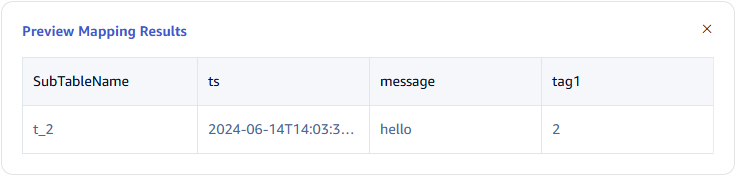

### 8. Configure Advanced Options

**Advanced Options** is folded by default, and clicking on the right side can expand it, as shown below:

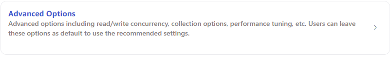

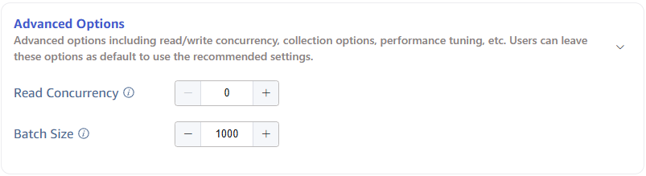

### 9. Finish

Click the **Submit** button to complete the task from Kafka to TDengine, and return to the [Data In](../../explorer/#data-in) page to view the task execution.