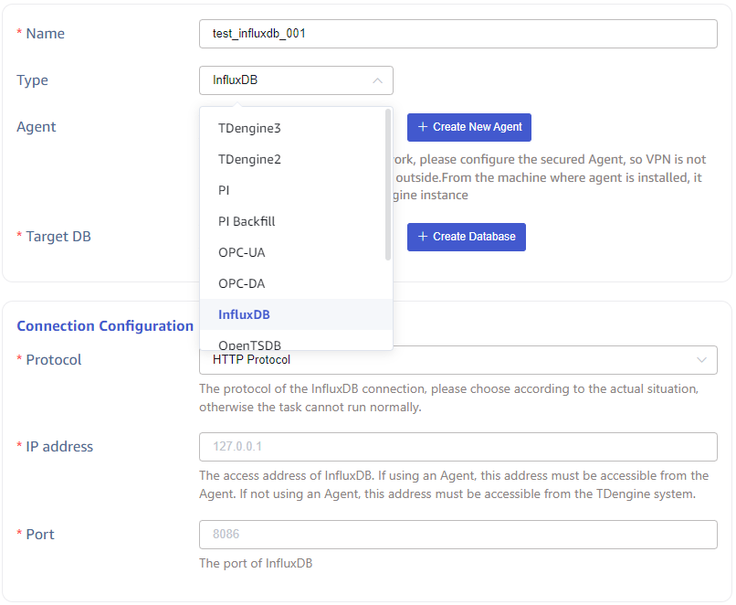
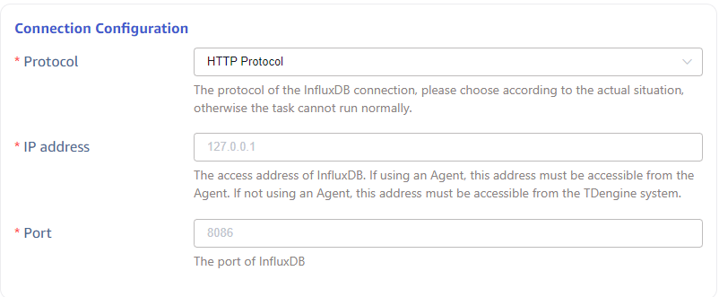
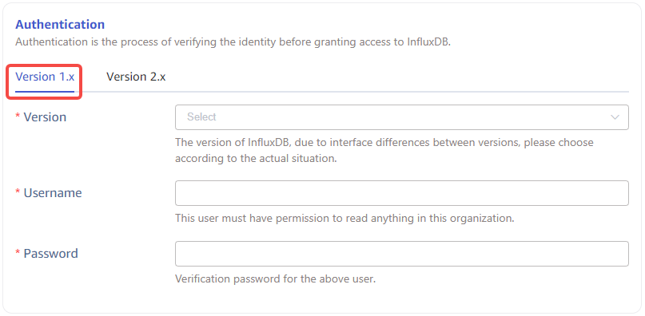
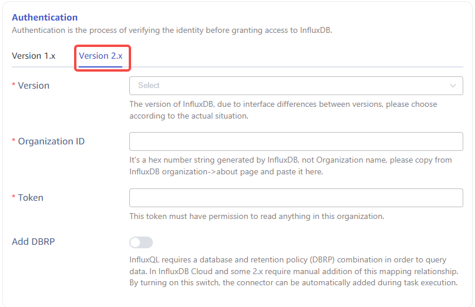
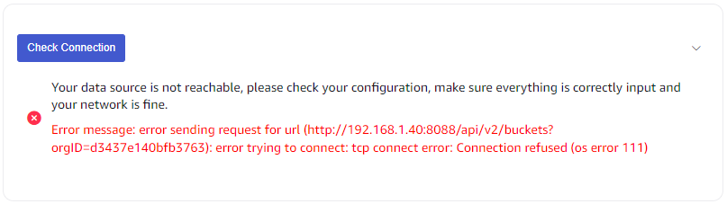
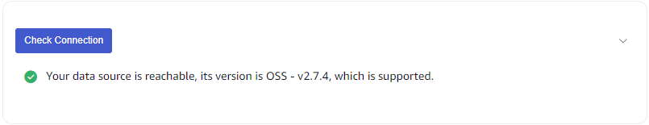
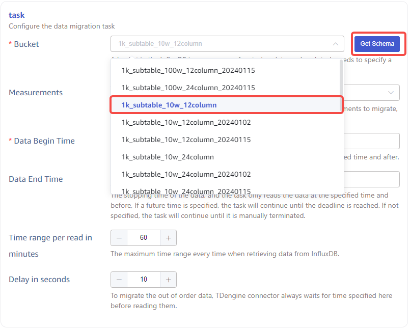
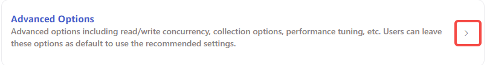
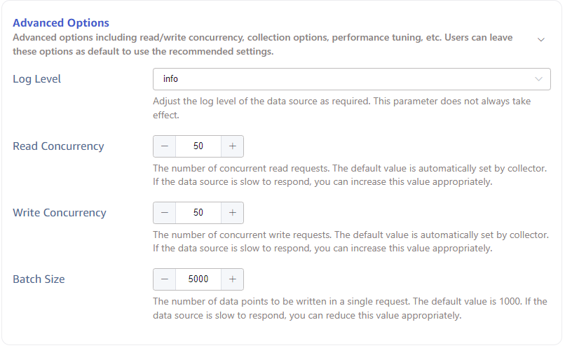

This section explains how to create a data migration task through the Explorer interface to migrate data from InfluxDB to the current TDengine cluster.

## Functional Overview

InfluxDB is a popular open-source time-series database that is optimized for handling large volumes of timestamped data. TDengine can efficiently read the data in InfluxDB and write it to TDengine through the InfluxDB connector to achieve historical data migration or real-time data synchronization.

During the operation of a task, progress information is saved to the disk, so whether the task is restarted or recovered from anomalies, it will not start from scratch. For more options, it is recommended to read the instructions for each form field on the create task page in detail.

## Create Task

### 1. Add Source

Click the **+Add Source** button in the upper left corner of the Data In page to enter the data source page, as shown below:

### 2. Configure Basic information

Enter the task name in the **Name** field, for example *`test_influxdb_01`* .

Select *`InfluxDB`* from the dropdown list in the **Type** field, as shown below(after the selection is made, the fields on the page will change).

**Agent** is not a mandatory field, if needed, you can select a specified agent from the dropdown list, or click the **+Create New Agent** button on the right to [create a new one](#CreateAgent) .

**Target DB** is a required field, since the time precision of data in InfluxDB can be second, millisecond, microsecond, and nanosecond, it is necessary to select a *`nanosecond precision db`* . Alternatively, you can click the   **+Create Database** button on the right to [create a new one](#CreateDatabase) .

### 3. Configure Connection information

Fill in the *`Connection information of the source InfluxDB`* in the **Connection Configuration** area, as shown below:

### 4. Configure Authentication information

There are two tabs in the **Authentication** area, *`Version 1.x`* and *`Version 2.x`* , this is because the authentication parameters of different versions of the InfluxDB are different and there are significant differences in APIs. Please choose according to the actual situation:  
  *`Version 1.x`*  
  **Version** Select the version of the source InfluxDB from the dropdown list.  
  **Username** Enter the username in the source InfluxDB, this user must have permission to read anything in this organization.  
  **Password** Enter the password in the upper user in the source InfluxDB.
    
  *`Version 2.x`*  
  **Version** Select the version in the source InfluxDB from the dropdown list.  
  **Organization ID** Enter the Organization ID in the source InfluxDB, it's a hex number string generated by InfluxDB, not Organization name, please copy from InfluxDB organization->about page and paste it here.  
  **Token** Enter the access token in the source InfluxDB, this token must have permission to read anything in this organization.  
  **Add DBRP** This is a *`yes/no`* switch item, InfluxQL requires a database and retention policy (DBRP) combination in order to query data. In InfluxDB Cloud and some 2.x require manual addition of this mapping relationship. By turning on this switch, the connector can be automatically added during task execution.  
  

There is a button **Connectivity check** below the **Authentication** area, you can click this button to check whether the information filled in above can obtain data from the source InfluxDB normally. the inspection results are shown below:  
  **Failed**  
    
  **Successful**  
  

### 5. Configure Task

**Bucket** is a namespace for storing data in the InfluxDB, and each task needs to specify a bucket, you need to first click on the button **Get Schema** on the right to obtain the schema, and then select from the dropdown list, as shown below:

**Measurements** is a non mandatory field, select one or more specified measurements to migrate, if empty, migrate all.

**Data Begin Time** is the starting time of the data, the task only reads data from the specified time and after, The timezone used is consistent with explorer.

**Data End Time** is the stopping time of the data, the task only reads the data at the specified time and before, If a future time is specified, the task will continue until the deadline is reached. If not specified, the task will continue until it is manually terminated. The timezone used is consistent with explorer.

**Time range per read in minutes** is a maximum time range every time when retrieving data from InfluxDB, it's an important parameter that needs to be determined by the user in combination with server performance and data storage density. If the range is too small, the execution speed of synchronization tasks will be slow; If the range is too large, it may cause the InfluxDB system to malfunction due to excessive memory usage.

**Delay in seconds** is an integer ranging from 1 to 30, to migrate the out of order data, connector always waits for time specified here before reading them.

### 6. Configure Advanced Options

**Advanced Options** is folded by default, and clicking on the right side can expand it, as shown below:

### 7. Finish

Click the **Submit** button to complete the task from InfluxDB to TDengine, and return to the [Data In](../../explorer/#data-in) page to view the task execution.