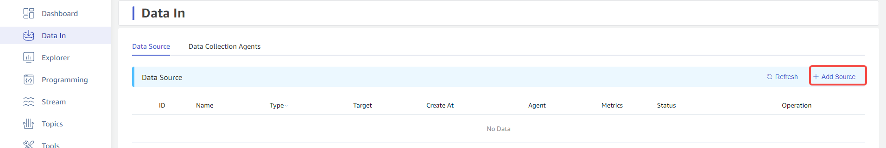
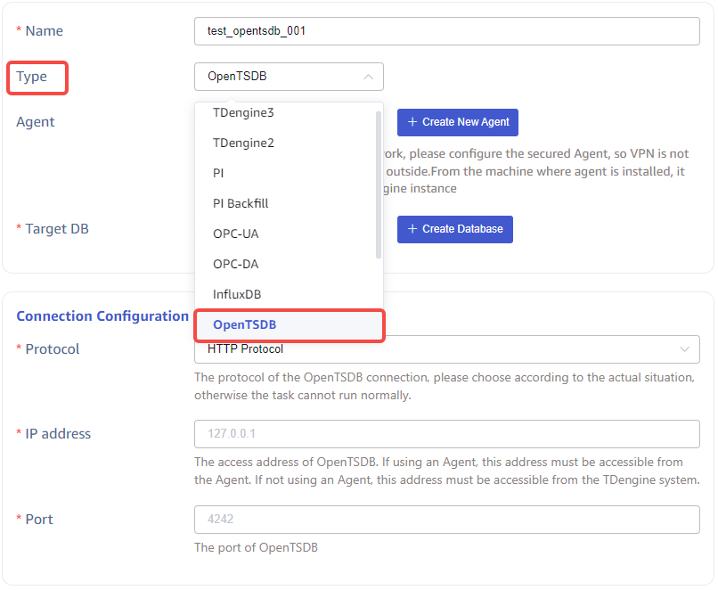
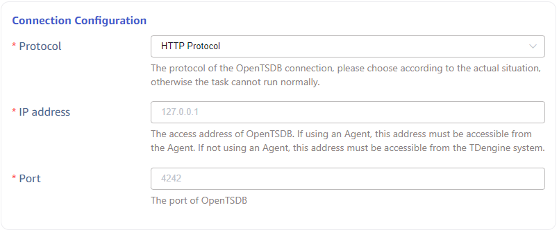
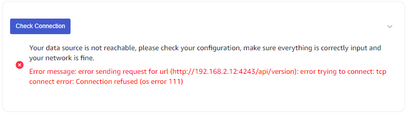
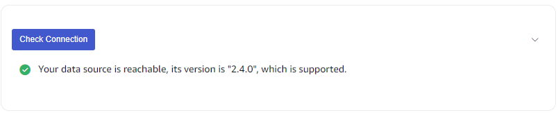
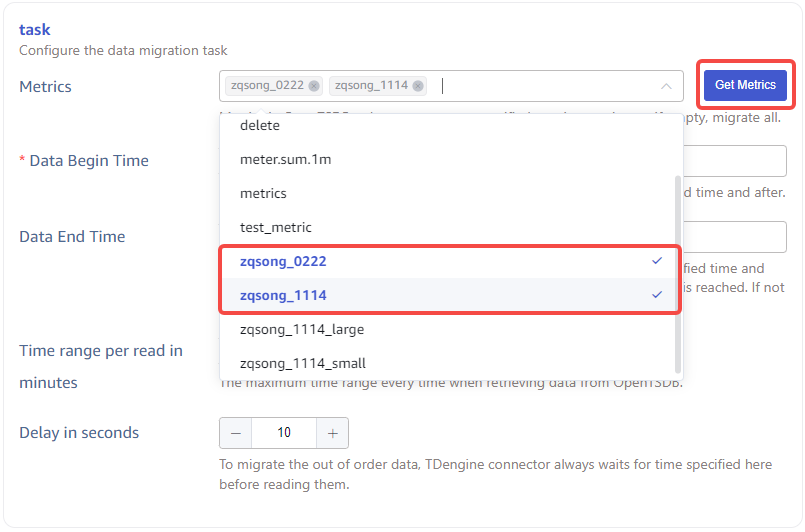

This section explains how to create a data migration task through the Explorer interface to migrate data from OpenTSDB to the current TDengine cluster.

## Functional Overview

OpenTSDB is a real-time monitoring information collection and display platform based on the HBase system. TDengine can efficiently read the data in OpenTSDB and write it to TDengine through the OpenTSDB connector to achieve historical data migration or real-time data synchronization.

During the operation of a task, progress information is saved to the disk, so whether the task is restarted or recovered from anomalies, it will not start from scratch. For more options, it is recommended to read the instructions for each form field on the create task page in detail.

## Create Task

### 1. Add Source

Click the **+Add Source** button in the upper left corner of the Data In page to enter the data source page, as shown below:

### 2. Configure Basic information

Enter the task name in the **Name** field, for example *`test_opentsdb_01`* .

Select *`OpenTSDB`* from the dropdown list in the **Type** field, as shown below(after the selection is made, the fields on the page will change).

**Agent** is not a mandatory field, if needed, you can select a specified agent from the dropdown list, or click the **+Create New Agent** button on the right to [create a new one](#CreateAgent) .

**Target DB** is a required field, since the time precision of data in OpenTSDB is millisecond, it is necessary to select a *`millisecond precision db`* . Alternatively, you can click the **+Create Database** button on the right to [create a new one](#CreateDatabase) .

### 3. Configure Connection information

Fill in the *`Connection information of the source OpenTSDB`* in the **Connection Configuration** area, as shown below:

There is a button **Connectivity check** below the **Connection Configuration** area, you can click this button to check whether the information filled in above can obtain data from the source OpenTSDB normally. the inspection results are shown below:  
  **Failed**  
    
  **Successful**  
  

### 4. Configure Task

**Metrics** is the list of data in the OpenTSDB, select one or more specified metrics to migrate, if empty, migrate all. You need to first click on the button **Get Metrics** on the right to obtain the metrics, and then select from the dropdown list, as shown below:

**Data Begin Time** is the starting time of the data, the task only reads data from the specified time and after, The timezone used is consistent with explorer.

**Data End Time** is the stopping time of the data, the task only reads the data at the specified time and before, If a future time is specified, the task will continue until the deadline is reached. If not specified, the task will continue until it is manually terminated. The timezone used is consistent with explorer.

**Time range per read in minutes** is a maximum time range every time when retrieving data from OpenTSDB, it's an important parameter that needs to be determined by the user in combination with server performance and data storage density. If the range is too small, the execution speed of synchronization tasks will be slow; If the range is too large, it may cause the OpenTSDB system to malfunction due to excessive memory usage.

**Delay in seconds** is an integer ranging from 1 to 30, to migrate the out of order data, connector always waits for time specified here before reading them.

### 5. Configure Advanced Options

**Advanced Options** is folded by default, and clicking on the right side can expand it, as shown below:

### 6. Finish

Click the **Submit** button to complete the task from OpenTSDB to TDengine, and return to the [Data In](../../explorer/#data-in) page to view the task execution.