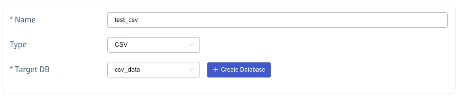
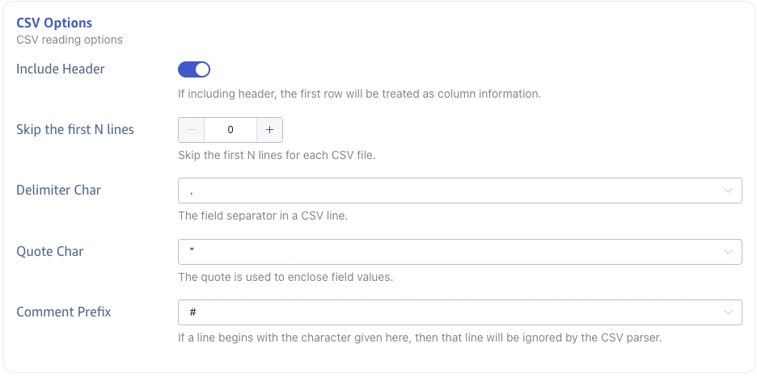
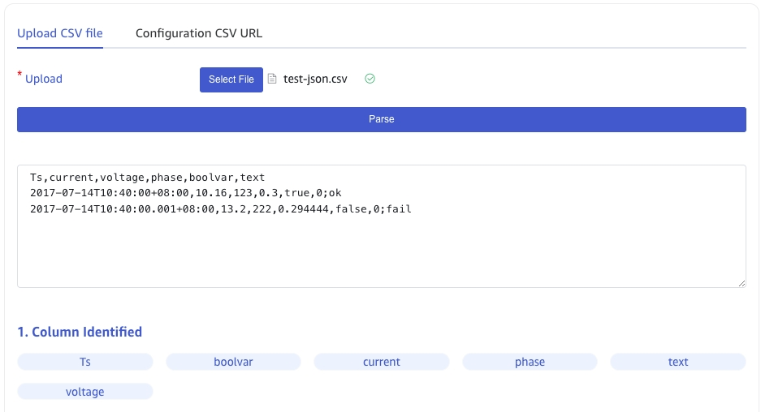
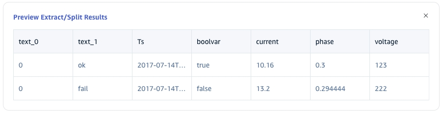
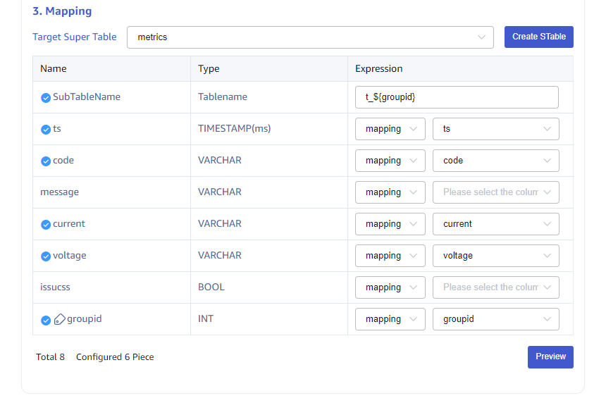

This section explains how to create a data migration task through the Explorer interface to migrate data from CSV to the current TDengine cluster.

## Functional Overview
Import a file or a collection of files in CSV format to TDengine.

## Create Task
### 1. Add Source
In the **Data In** page，click **+Add Source** button to enter the data source page.

### 2. Configure Basic information
Enter the task name in the **Name** field, such as “test_csv”；

In the **Type** drop-down list, select **CSV**。

Select a target database from the **Target DB** drop-down list, or click the **+Create Database** button on the right
[Create Database](#CreateDatabase).

### 3. Configure CSV Options
**Include Header:** If including header, the first row will be treated as column information.

**Skip the first N lines:**，Skip the first N lines for each CSV file.

**Delimiter Char:** The field separator in a CSV line,The default value is `,`.

**Quote Char:** The quote is used to enclose field values,The default value is `"`.

**Comment Prefix:** If a line begins with the character given here, then that line will be ignored by the CSV parser,The default value is `#`.

### 4. Configure Parsing CSV files
Upload a CSV file locally, such as test-json.csv, and then use the sample csv file to configure the extraction and filtering criteria.

#### 4.1 Parse

Click **Select File**, select test-json.csv, and click **Parse** to preview the identified columns.

s

**Preview parsing results**

#### 4.2 Extract or Split From A column

In the **Extract or Split From A column** field, fill in the fields to be extracted or split from the message body, for
example: split the text field into `text_0` and `text_1` fields, select split Extractor, seperator fill in -, number fill in 2.

Click the **Delete** button to delete the current extraction rule. 

Click the **Add** button to add more extraction rules.

Click the **Preview** button to view the split result. 

<!-- 在 **过滤** 中，填写过滤条件，例如：填写 `id != 1`，则只有 id 不为 1 的数据才会被写入 TDengine。
点击 **删除**，可以删除当前过滤规则。

点击 **放大镜图标** 可查看预览过滤结果。

 -->

#### 4.3 Mapping

In the **Target Super Table** drop-down list, select a target super table, or click the **+Create STable** button on the
right to [Create Super Table](#Create STable).

In the **Mapping** area, fill in the sub-table name in the target super table, for example: `t_${groupid}`。

Click the **Preview** button to view the mapping result.

### 5. Finish
After completing the above information, click the **Submit** button to initiate data synchronization from CSV to TDengine.

## View Task Status

Click **Submit** button to complete the task of creating CSV data synchronization to TDengine and return to [Data Source List](../../explorer/#data-in) page to view the task execution.