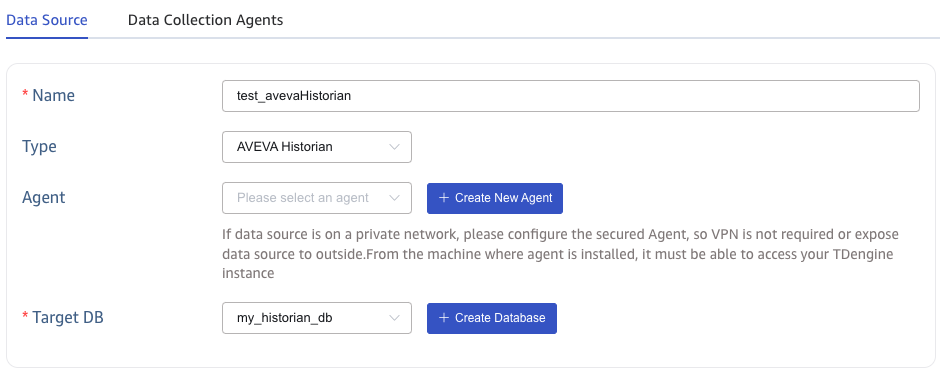
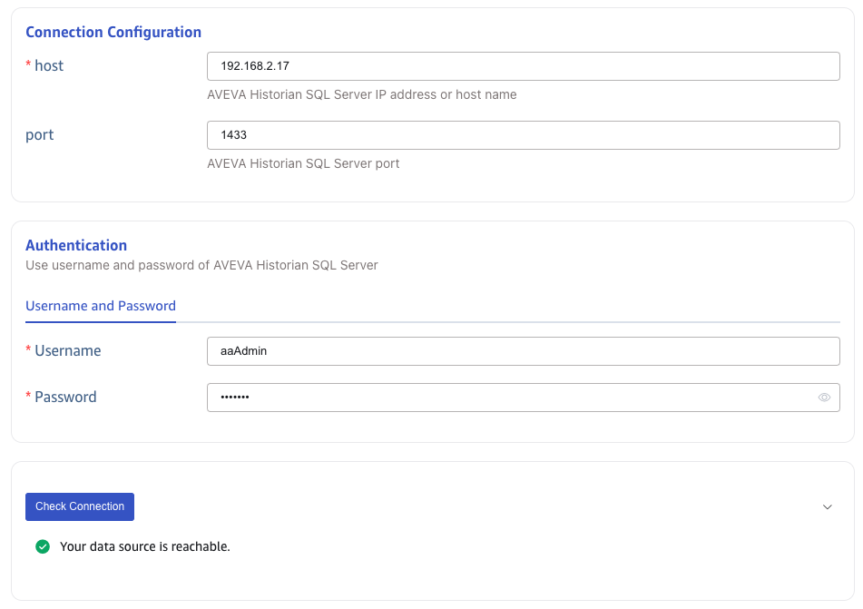
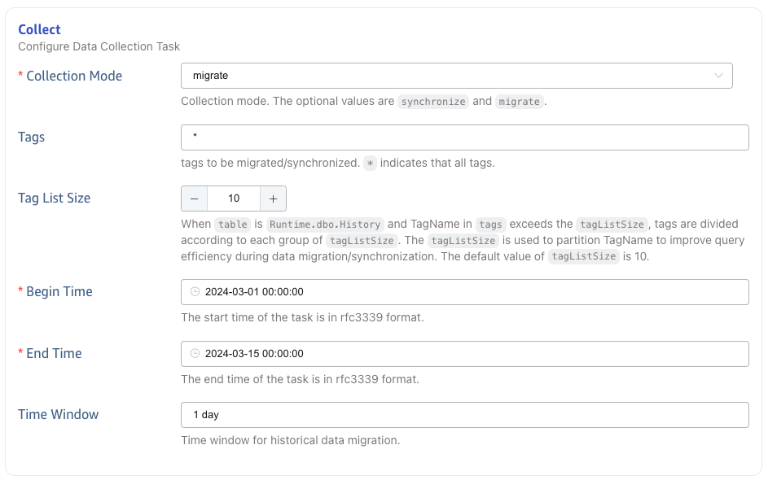
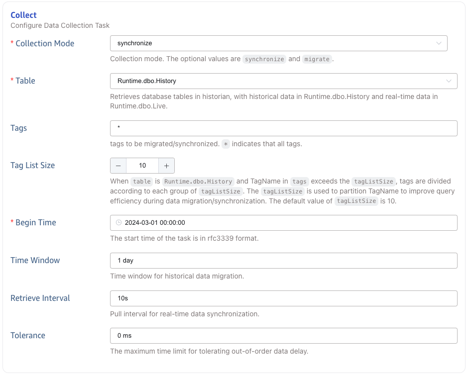
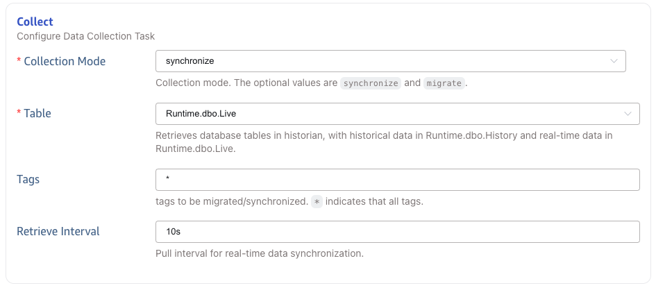
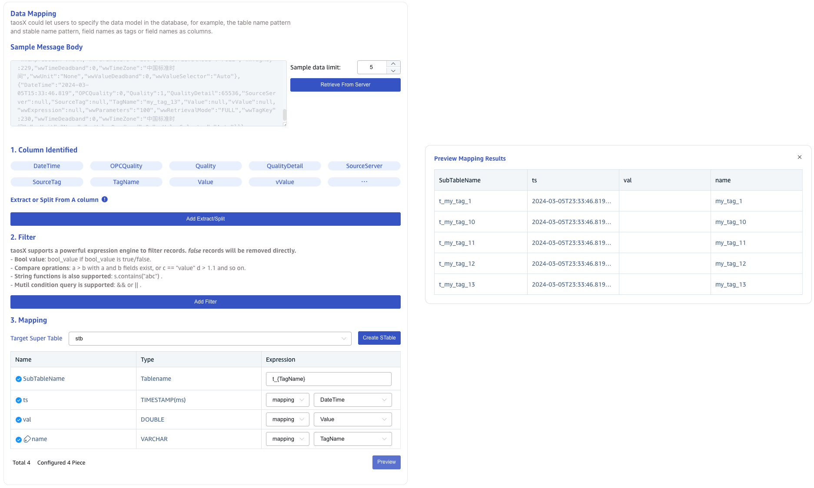
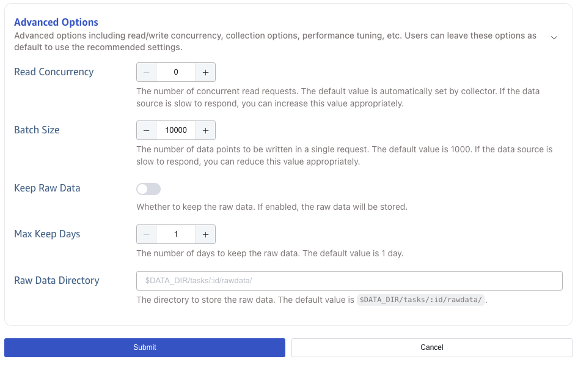

This section explains how to create a data migration task through the Explorer interface to migrate data from AVEVA Historian to the current TDengine cluster.

## Functional Overview

AVEVA Historian integrates with operations control, providing access to your process, alarm, and event history data. Wonderware Historian is now known as AVEVA Historian.

TDengine efficiently reads data from the AVEVA Historian and writes it to TDengine for historical data migration or real-time data synchronization.

## Create Task

### 1. Add Source

In the **Data In** page，click **+Add Source** button to enter the data source page.

### 2. Configure Basic information

Enter the task name in the **Name** field, such as "test_avevaHistorian";

In the **Type** drop-down list, select **AVEVA Historian**.

The **Agent** is not required. If needed, you can choose the specified agent from the drop-down box, or alternatively, click the **+Create New Agent** button on the right [Create New Agent](#Create New Agent).

The choose a target database from the **Target DB** drop-down list, or click the **+Create Database** button on the right [Create Database](#Create Database).

### 3. Configure Connection information

In the **Connection Configuration** area, fill in the **host** and **port**.

In the **Authentication** area, fill in the **Username** and **Password**.

Click the **Check Connection** button to check whether the data source is available.

### 4. Configure Collection

In the **Collect** area, fill in the configuration parameters related to the collection task.

#### 4.1. Migrate Data

Migration requires the following parameters to be configured:

In the **Collection Mode** drop-down list, select **migrate**.

In the **Tags** field, fill in the list of tags to be migrated, separated by commas.

In the **Tag List Size** field, fill in the size of the tag group.

In the **Begin Time** field, fill in the start time of the data migration task.

In the **End Time** field, fill in the end time of the data migration task.

In the **Time Window** field, fill in a time interval, and the data migration task will divide the time window according to this time interval.

#### 4.2. Synchronize History Table Data

Synchronize **Runtime.dbo.History** table data to TDengine requires the following parameters to be configured:

In the **Collection Mode** drop-down list, select **synchronize**.

In the **Table** field, select **Runtime.dbo.History**.

In the **Tags** field, fill in the list of tags to be synchronized, separated by commas.

In the **Tag List Size** field, fill in the size of the tag group.

In the **Begin Time** field, fill in the start time of the data synchronization task.

In the **Time Window** field, fill in a time interval, and the historical data part will divide the time window according to this time interval.

In the **Retrieve Interval** field, fill in a time interval, and the real-time data part will poll data according to this time interval.

In the **Tolerance** field, fill in a time interval, and the data that is not written to the database until after this time interval may be lost.

#### 4.3. Synchronize Live Table Data

Synchronize **Runtime.dbo.Live** table data to TDengine requires the following parameters to be configured:

In the **Collection Mode** drop-down list, select **synchronize**.

In the **Table** field, select **Runtime.dbo.Live**.

In the **Tags** field, fill in the list of tags to be synchronized, separated by commas.

In the **Retrieve Interval** field, fill in a time interval, and the real-time data part will poll data according to this time interval.

### 5. Configure Data Mapping

In the **Data Mapping** area, fill in the configuration parameters related to data mapping.

Click the **Retrieve from Server** button to get sample data from the AVEVA Historian server.

In the **Extract or Split From A column** field, fill in the fields to be extracted or split from the message body, for example: split the `vValue` field into `vValue_0` and `vValue_1` fields, with `split` Extractor, separator filled as `,`, number filled as `2`.

In the **Filter** field, fill in the filter condition, for example: fill in `Value > 0`, then only the data with Value greater than 0 will be written to TDengine.

In the **Mapping** area, select the super table to be mapped to TDengine, and the columns to be mapped to the super table.

Click **Preview** to view the mapping result.

### 6. Configure Advanced Options

In the **Advanced Options** area, fill in the configuration parameters related to advanced options.

Set the maximum number of concurrent reads in **Max Read Concurrency**. The default value is 0, which means auto, automatically configure the concurrency.

Set the batch size in **Batch Size**, which is the maximum number of messages sent in a single send.

Select whether to save the original data in **Keep Raw Data**. The default value is No.

When saving the original data, the following two parameters are configured.

Set the maximum retention days of the original data in **Max Keep Days**.

Set the original data storage directory in **Raw Data Directory**.

### 7. Finish

Click the **Submit** button to complete the task creation. After submitting the task, you can go back to the [Data Source List](../../explorer/#data-in) page to view the task status.
