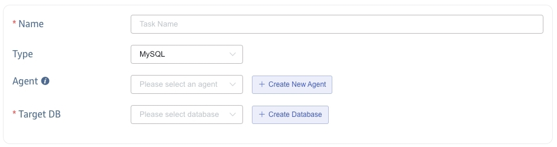
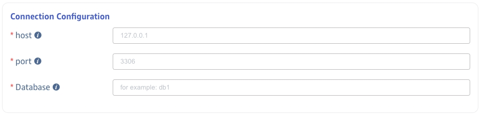
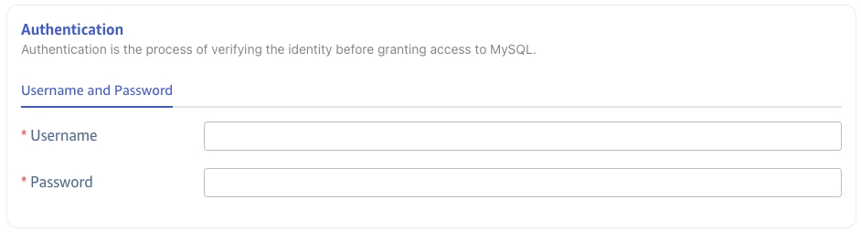
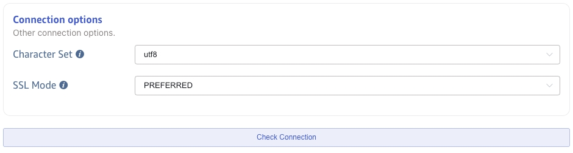
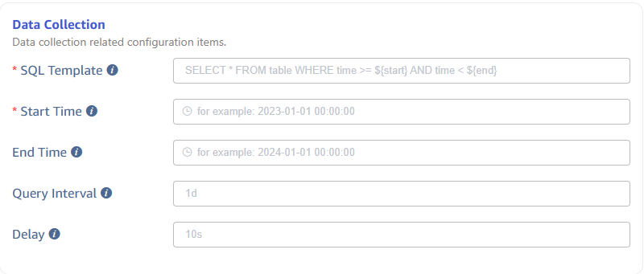
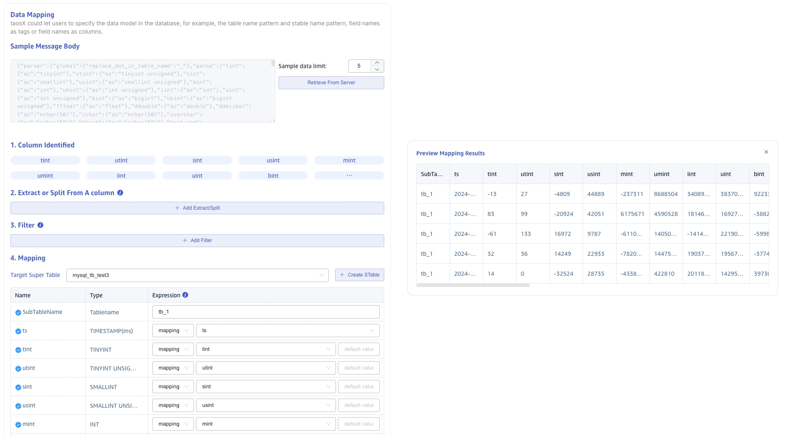
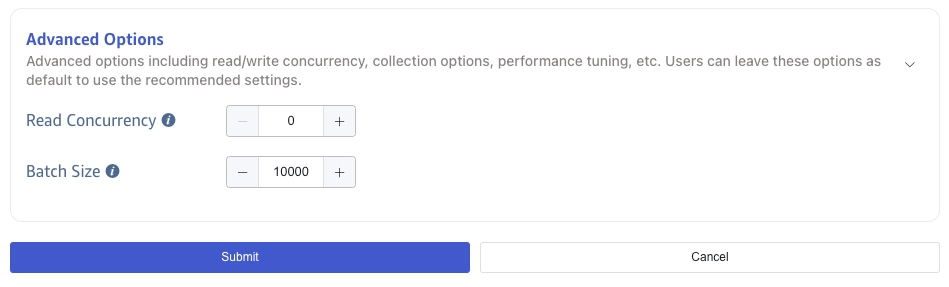

---

title: "MySQL"
sidebar_label: "MySQL"

---

This section explains how to create a data migration task through the Explorer interface to migrate data from MySQL to the current TDengine cluster.

## Functional Overview

MySQL is one of the most popular RDBMS. Many application systems have been using MySQL to store time series data generated in IoT or Industry fields. With the number of devices in such environments grow, MySQL can't handle the data explosion. From TDengine Enterprise 3.3.0.0, we can replicate the existing and real time data from MySQL to TDengine in highly efficient way to resolve your business bottlenecks.

## Create Task

### 1. Add Source

Click the **+Add Source** button in the upper left corner of the Data In page to enter the data source page, as shown below:

### 2. Configure Basic information

**Name** Enter a task name, for example *'test_mysql_01'*.

**Type** Select *'MySQL'* in the drop-down box, as shown below (the fields in the page will change after selection).

**Agent**  is not a mandatory field, if needed, you can select a specified agent from the dropdown list, or click the **+Create New Agent** button on the right to create a new one.

**Target DB** is a required field, you can click the   **+Create Database** button on the right to create a new one.

### 3. Configure Connection information

Fill in the *`Connection information of the source MySQL`* in the **Connection Configuration** area, as shown below:

### 4. Configure Authentication information

**Username** Enter the user name of the source MySQL database, the user should have proper read permissions in the organization. 

**Password** Enter the login password of the user in the source MySQL database.

  

### 5. Configure Connection options

**Character Set** Set the character set for the connection. The default character set is utf8mb4. MySQL 5.5.3 supports this feature. If you need to connect to an older version, it is recommended to change to utf8. The options are utf8、utf8mb4、utf16、utf32、gbk、big5、latin1、ascii.

**SSL Mode** Set whether to negotiate a secure SSL TCP/IP connection with the server or what priority to negotiate with. The default is PREFERRED. The options are DISABLED、PREFERRED、REQUIRED.

  
Then click the **Check Connectivity** button. Users can click this button to check whether the information filled in above can normally obtain the data of the source MySQL database.

### 6. Configure Data Collection

**SQL Template** The SQL statement template used for querying data in the source database. The SQL statement must contain a time range condition, and the start time and end time must appear in pairs, the time range is defined by specific column in the source database and place holders defined below, the place holder will be replaced by the real values specified in following input fields.
> SQL uses different placeholders to represent different time format requirements, specifically the following placeholder formats:
> 1. `${start}`, `${end}`: Represents the RFC3339 format timestamp, such as: 2024-03-14T08:00:00+0800
> 2. `${start_no_tz}`, `${end_no_tz}`: Represents the RFC3339 string without a time zone: 2024-03-14T08:00:00
> 3. `${start_date}`, `${end_date}`: Represents only the date, such as: 2024-03-14

**Start Time** Start time for migrating data. This field is required.

**End Time** End time for migrating data, it can be left as blank. If it is set, the migration task will stop automatically after all the data between the start time and end time is migrated. If it is left as blank, the task will replicate all existing data and new incoming data automatically until the user stops it manually. 

**Query Interval** The time interval for segmented queries. The default is 1 day. To avoid querying too much data, a data synchronization subtask will use the query interval to query data in time segments.

**Delay** In the real-time data synchronization scenario, to avoid the loss of delayed written data, each synchronization task will read data before the delay time.

 

### 7. Configure Data Mapping

In the **Data Mapping** area, fill in the configuration parameters related to data mapping.

Click the **Retrieve from Server** button to get sample data from the MySQL server.

In the **Extract or Split From A column** field, fill in the fields to be extracted or split from the message body, for example: split the `vValue` field into `vValue_0` and `vValue_1` fields, with `split` Extractor, separator filled as `,`, number filled as `2`.

In the **Filter** field, fill in the filter condition, for example: fill in `Value > 0`, then only the data with Value greater than 0 will be written to TDengine.

In the **Mapping** area, select the super table to be mapped to TDengine, and the columns to be mapped to the super table.

Click **Preview** to view the mapping result.

### 8. Configure Advanced Options

In the **Advanced Options** area, fill in the configuration parameters related to advanced options.

**Read Concurrency** The number of concurrent read requests. The default value is automatically set by collector. If the data source is slow to respond, you can increase this value appropriately.

**Batch Size** The number of data points to be written in a single request. The default value is 10000. If the data source is slow to respond, you can reduce this value appropriately.

### 9. Finish

Click the **Submit** button to complete the task creation. After submitting the task, you can go back to the [Data Source List](../../explorer/#data-in) page to view the task status.
