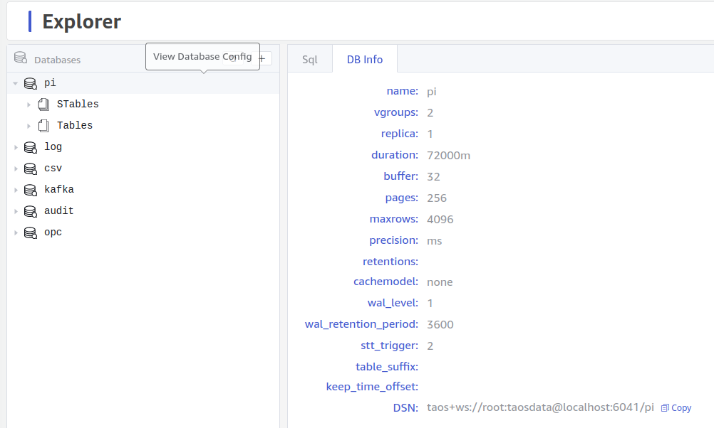

## Introduction

This section explains how to perform data synchronization using a visual interface. For specific details, please refer to [Visual Management](../explorer). For service installation and deployment, refer to [Installation and Deployment](../../get-started).

Navigate to the system management page and add data synchronization:

Choose the data source:

Copy the DSN from the browser page of the target database:

Locate the DSN displayed at the bottom and copy it to the dialog for adding data synchronization, then click to create a data synchronization service.
