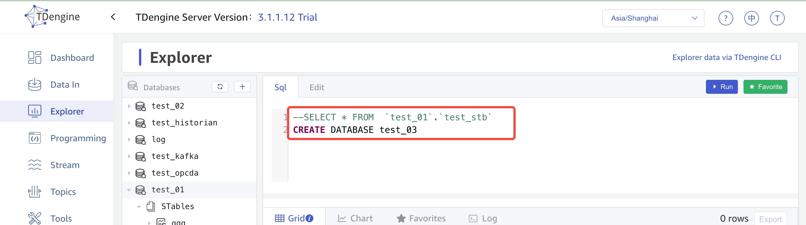
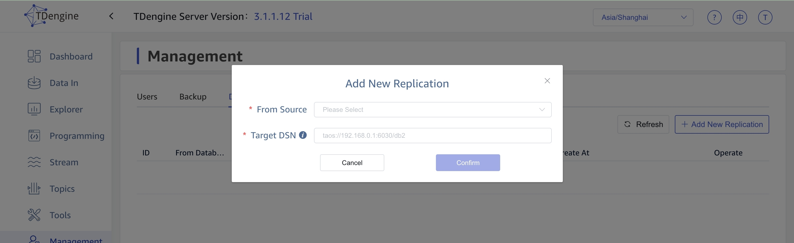

## Introduction

In order to make it easier for Enterprise Edition users to use and manage the database, TDengine 3.0 Enterprise Edition provides a new visualization component taosExplorer. Users are able to easily manage the lifecycle of the elements of the database management system (databases, super-tables, sub-tables), execute queries, monitor the status of the system, manage users and authorizations, perform data backup and recovery, synchronize data with other clusters, export data, and manage topics and streaming calculations.

## Deployment

See [Installation and Deployment](../../get-started)

## Login

On the login page of TDengine management system, enter the correct user name and password, and then click the Login button to log in.

Description:
- The user here needs to be created in the connected TDengine. The default username and password for TDengine is `root/taosdata`.
- When you create a user in TDengine, the default value of the user's SYSINFO attribute will be set to 1, which means that the user can view the system information, and only the user with the SYSINFO attribute of 1 can log in the TDengine management system normally.

## Dashboard

taosExplorer has a simple built-in dashboard displaying the following cluster information, which can be enabled by clicking on "Panels" in the list of features on the left.

- The default dashboard returns the wizard that corresponds to Grafana's installation and configuration.
- Grafana-configured dashboards are redirected to the corresponding configuration address when clicking on a 'panel' (the address is derived from the return value of the /profile interface)

## Data Explorer

You can create and delete databases, create and delete super tables and sub-tables, execute SQL statements, and view the results of SQL statements by clicking the "Data Browser" entry in the function list. In addition, the Super Administrator has administrative rights to the database, a feature not available to other users.As shown in the picture below:

Here, by creating a database, to familiarize yourself with the functions and operations of the data browser page, then look at two ways to create a database:

1. Click the + sign in the figure to jump to the page of creating data database, and click the Create button, as shown in the following figure:

Step 1 Click the + sign;

The second step is to fill in the database name and required database configuration parameters. The configuration parameters are classified and folded, and click to expand;

After clicking the "Create" button in Step 3, the database name appears on the left side of the following figure, and the database is successfully created.

2. By data Sql statement in sql editor, click "Run" button, as shown below:

The first step is to enter the sql statement;

Step 2 Click the "Run" button, test02 appears on the left, the database is successfully created.

Since creating, modifying, and deleting a super table, creating a table, and creating a child table are consistent in behavior, let's take creating a super table as an example:

### Create a super table

The first step is to move the mouse to STables, click the + sign, the Create super table tab appears;

Step 2 Fill in the super form information, click "Create" button;

Step 3 Click Stables to show the super table name just filled in, which proves that the creation is successful.

### View super table

Put the mouse on the super table to be viewed, and the icon as shown in the following picture appears. Click the "eye icon" to view the information of the super table 

### Modify super table

Put the mouse on the super table to be edited, and the icon as shown in the following picture appears. Click "Edit Icon" to modify the information of the super table

### Delete super table

Put the mouse on the super table to be deleted, and the icon as shown in the picture below will appear. Click "Delete icon" to delete the super table

### Sql editor to use

When entering multiple statements, you can select the statement you want to refer to, or comment the statement (shortcut key Control-/ Command-/), and then click Execute

## System Administration

By clicking on the "System Administration" portal in the function list, you can create users, authorize access to users, and delete users. It is also capable of backing up and restoring the data in the currently managed cluster. You can also configure a remote TDengine address for data synchronization. Cluster and license information as well as proxy information is also provided for viewing. The system administration menu can only be seen by the root user.

In the "License" tab of "Management", to make it easier to activate TDengine Enterprise, users can check the cluster ID of TDengine on this page directly.

### User Management

After clicking "System Administration", you will be taken to the "Users" tab by default.
In the user list, you can view the existing users in the system and their creation time, and you can enable, disable, edit (including changing passwords, database read/write permissions, etc.), delete and other operations on the users.

Step 1 Click the "+ Add" button on the top right of the user list to open the "Add User" dialog box, fill in the information of the new user, and click the "Confirm" button:

The second step is to view the new user

### Backup Management

You can back up the data in the currently connected TDengine cluster to one or more local files.

Step 1 Go to the system management page, click "Backup" to enter the data backup page, click "Create New Backup" in the upper right corner;

Step 2 In the data backup configuration page, you can set three parameters:

  
Step 3 Click "Confirm" to create a data backup task.

### Data Replication

Synchronize data between databases, from DB1 to DB2.

Step 1 Go to the system management page, click "Data synchronization page" to enter the data replication page, click "Add New Replication" in the upper right corner.

Step 2 Set parameters on the data synchronization page

Step 3 Click "Confirm" to create a data synchronization task.

### System Information

After clicking the "Cluster" tab, you can view the status, creation time and other information of DNodes, MNodes and QNodes, and you can add and delete the above nodes.

### License Management

By clicking on the "license" tab, you can view the license information for the system and each connector.

Click on the "Activate License" button located in the upper right corner of the "License" tab, enter the "Activation Code" and "Connector Activation Code" and click on the "OK" button to activate the license, the activation code should be obtained by contacting TDengine Customer Success team.

### Audit Management

After clicking the "Audit" TAB, you can view the operation database table and login information of each user.

## Data Ingestion

By clicking "Data Write" in the function list, you can configure different types of data sources, including TDengine Subscription, PI, OPC-UA, OPC-DA, InfluxDB, MQTT, Kafka, CSV, etc., to write their data to the TDengine cluster that is currently being managed.

In the task list of the Data Source page, the following 3 operations can be made to every task: edit, delete and duplicate. Through the duplication operation, a new task can be created easily based on an existing task. After submitting the task, the metrics of the task can be obtained by clicking the "View" button on the task list.

### Pi

1. On the PI data access screen, set the PI server name and AF database name.
2. In the Monitoring Point Sets column, you can configure the selection of Point mode monitoring point sets, AF templates for Point mode monitoring, and AF templates for AF mode monitoring.
3. In the PI System Settings field, you can configure the PI system name, which defaults to the PI server name.
4. In the Data Queue column, you can configure the running parameters of PI Connector: MaxWaitLen (Maximum number of data buffer bars), the default value is 1000, and the valid range of values is [1,10000]; UpdateInterval (frequency of data fetching by the PI System), the default value is 10000 (milliseconds: ms), and the valid range of values is [ 10,600000]; Max Backfill Range (in days), each time the service is restarted, the data will be compensated forward for that number of days, and the default value is 1 day. 10,600000]; Max Backfill Range (unit: days), each time the service is restarted, the data is compensated forward for the number of days, the default is 1 day.
5. In the Target Database field, select the TDengine database you want to write to and click Submit to start a PI data access task.

### OPC-UA

1. On the OPC-UA page, configure the address of the OPC-server by entering the format 127.0.0.1:6666/OPCUA/ServerPath.
2. In the Authentication field, select the access method. You can choose between anonymous access, username and password access, and certificate access. When using certificate access, you need to configure certificate file information, private key file information, OPC-UA security protocol, and OPC-UA security policy.
3. In the Data Sets column, configure the point information. (You can select the regular expression filtering points through the "Select" button, each time up to 10 points can be filtered out); points configured in two ways: 1. manually enter the point information 2. upload a csv file to configure the point information
4. In the Connection Configuration field, configure the Connection Timeout Interval and Capture Timeout Interval (in seconds), with a default value of 10 seconds.
5. In the Acquisition Configuration field, configure the acquisition interval (in seconds), number of points, and acquisition mode. The collection mode can be selected from observe (polling mode) and subscribe (subscription mode), the default value is observe.
6. In the Library Table Configuration column, configure the super table and sub-table structure information of the data stored in the target TDengine.
7. In the Other Configuration column, configure the degree of parallelism, the number of report batches for a single collection (default value 100), the report timeout (unit: seconds, default value 10), and whether or not to turn on debug level logging.
8. In the Target Database field, select the TDengine database you want to write to and click Submit to start a OPC- UA data access task.

### OPC-DA

1. On the OPC-DA page, configure the address of the OPC-server by entering the format 127.0.0.1<,localhost>/Matrikon.OPC.Simulation.1.
2. In the Data Points column, configure the OPC-DA collection point information. (You can select the regular expression filtering points through the "Select" button, each time up to 10 points can be filtered out) points configured in two ways: 1. manually enter the point information 2. upload a csv file to configure the point information
3. In the Connection column, configure the Connection Timeout Time (unit: seconds, default value is 10 seconds), Capture Timeout Time (unit: seconds, default value is 10 seconds).
4. In the Library Table Configuration column, configure the super table and sub-table structure information of the data stored in the target TDengine.
5. In the Other Configuration column, configure the degree of parallelism, the number of report batches for a single collection (default value 100), the report timeout (unit: seconds, default value 10), and whether or not to turn on debug level logging.
6. In the Target Database field, select the TDengine database you want to write to and click Submit to start a OPC- DA data access task.

### MQTT

After you enter the edit page for the MQTT Data Source Synchronization task:
1. On the MQTT Address card, enter the MQTT address with required fields, including IP and port number, for example: 192.168.1.10:1883.
2. In the Authentication card, enter the MQTT Connector's user name and password for accessing the MQTT server. These two fields are optional, and if they are not entered, then anonymous authentication is used;
3. In the SSL Certificate card, you can choose whether to turn on the SSL/TLS switch, if you turn on this switch, the communication between MQTT Connector and MQTT Server will be encrypted by SSL/TLS; after you turn on this switch, there will be three required configuration items, CA, Client Certificate and Client Private Key, where you can input the content of the certificate and private key files;
4. On the connection card, the following information can be configured:
    - MQTT protocol: supports version 3.1/3.1.1/5.0;
    - Client ID: The client ID used by the MQTT connector to connect to the MQTT server, which identifies the client;
    - Keep Alive: Used to configure the Keep Alive time between the MQTT connector and the MQTT server, the default value is 60 seconds;
    - Clean Session: Used to configure whether the MQTT connector connects to the MQTT server as a Clean Session, the default value is True.
    - Subscription Topic and QoS Configuration: This is used to configure the MQTT topic for listening and the maximum QoS supported by the topic, the topic and QoS configurations are separated by ::, multiple topics are separated by ,, and the topic configurations can support the MQTT protocol wildcards # and +
5. In other cards, you can configure the logging level of the MQTT connector, which supports 5 levels: error, warn, info, debug, trace, and the default value is info.
6. MQTT Payload parsing card to configure how to parse MQTT messages:
    - The first line of the configuration table is the ts field, which is of type TIMESTAMP and whose value is the time the MQTT message was received by the MQTT connector;
    - The second line of the configuration table is the topic field, which is the subject name of the message, and which can optionally be synchronized to TDengine as a column or a label.
    - The third line of the configuration table is the qos field, which is the QoS attribute of the message, and which can optionally be synchronized to the TDengine as a column or a label.
    - The remaining configuration items are all custom fields, each of which needs to be configured: Field (Source), Column (Target), Column Type (Target). Field (source) is the name of the field in the MQTT message, only JSON type MQTT message synchronization is supported, you can use JSON Path syntax to extract the field from the MQTT message, for example: $.data.id; Column (target) is the name of the field after synchronization to TDengine; Column type (target) is the type of the field after synchronization to TDengine. The column type (target) is the type of the field after synchronization to TDengine, which can be selected from the drop-down list; the next field can be added when and only when all the above three configurations are filled in;
    - If the MQTT message contains a timestamp, you can choose to add a new custom field to be used as the primary key when synchronizing to TDengine; note that only the Unix Timestamp format is supported for timestamps in MQTT messages, and the column type (target) of the field needs to be selected in the same way as configured during the creation of the TDengine database;
    - Sub-table naming rules: used to configure the name of the sub-table, using the format of "prefix + {column type (target)}", e.g.: d{id};
    - Super Table Name: Used to configure the super table name used when synchronizing to TDengine;
7. In the Target Database card, you can select the name of the database to be synchronized to TDengine, which is supported to be selected directly from the drop-down list.
8. After completing the above information, click the Submit button to start the data synchronization from MQTT to TDengine directly.

### Kafka

1. On the Kafka page, configure the Kafka options, required fields, including: bootstrap_server, for example 192.168.1.92:9092;
2. If you are using SSL authentication, in the SSL Authentication card, select the path to the cert and cert_key files;
3. Configure other parameters, fill in at least one of the two parameters, topics, topic_partitions, other parameters have default values;
4. If the consumed Kafka data is in JSON format, you can configure the parser card to parse and transform the data;
5. In the Target Database card, select the name of the database to be synchronized to TDengine, which supports selection from a drop-down list;
6. After filling in the above information, click the Submit button to start the data synchronization from Kafka to TDengine.

### CSV

1. On the CSV page, configure the CSV options to ignore the first N rows, and enter specific numbers
2. CSV write configuration, set the batch write amount, the default is 1000
3. CSV file parsing for obtaining the column information corresponding to the CSV:
      - Upload a CSV file or enter the address of a CSV file
      - Select whether the package contains a Header
      - Execute the next step directly if the Header is included, query the column information of the corresponding CSV, and obtain the configuration information of the CSV.
      - Without Header case, you need to enter the customized column information and separated by comma, and then the next step, to get the configuration information of the CSV
      - Configuration items for CSV, each field needs to be configured: CSV Column, DB Column, Column Type (Target), Primary Key (there can only be one Primary Key for the entire configuration and the Primary Key must be of type TIMESTAMP), as Column, as Tag. CSV columns are the columns in the CSV file or customized columns; DB columns are the columns of the corresponding data tables
      - Sub-table naming rules: used to configure the name of the sub-table, using the format of "prefix + {column type (target)}", e.g.: d{id};
      - Super Table Name: Used to configure the super table name used when synchronizing to TDengine;
4. In the Target Database card, you can select the name of the database to be synchronized to TDengine, which is supported to be selected directly from the drop-down list.
5. After completing the above information, click the Submit button to start the data synchronization from CSV to TDengine directly.

## Data Export

By clicking "Data Out" in the function list, you can export data to kafka from the TDengine cluster that is currently being managed.

### Kafka

After you enter the edit page for the Kafka Data Source export task:
1.  In the Database card, you can select the name of the database to be exported to Kafka, which is supported to be selected directly from the drop-down list, this field is required;
2.  In the Super Table card, you can select or enter the name of super table in the selected database, this field is required;
3.  Select columns to be exported, default is all the columns of the super table, this field is required;
4.  Select tags to be exported, default is all the tags of the super table;
5.  Under Start time settings field, select a start time for the data by clicking on it, this field is optional;
6.  Under End time settings field, select a end time for the data by clicking on it, this field is optional;
7.  If the Start time or the End time are specified, enter the the column name of timestamp, default value is ts; 
8.  In the Kafka Server input box, enter bootstrap_server, for example 192.168.1.92:9092, this field is required;
9.  In the Topic input box, enter an existing topic name in Kafka, this field is required;
10. Set Kafka ack timeout in seconds, this field is optional, the default value is 1s;
11. Set the Batch size, this field is optional, the default value is 1;
12. After completing the above information, click the Submit button to start the data synchronization from TDengine to Kafka directly.

## Data Backup and Restoration

You can back up the data in the currently connected TDengine cluster to one or more local files from which you can later perform data recovery. This section describes the specific steps for data backup and recovery.

### Backup data to a local file

1. Enter the system management page, click [Backup] to enter the data backup page, and click [Add Backup] in the upper right corner.
2. Three parameters can be configured in the Data Backup Configuration page:
  - Backup Cycle: Required, configure the time interval for each data backup, you can select daily, every 7 days, every 30 days through the drop-down box to perform a data backup, after the configuration, it will start a data backup task at 0:00 of the corresponding backup cycle;
  - Database: required, configure the name of the database to be backed up (the wal_retention_period parameter of the database should be greater than 0);
  - Directory: Required, configure to back up the data to the specified path in the environment where taosX is running, such as /root/data_backup;
3. Click [OK] to create a data backup task.

### Recovering from local files

1. After completing the creation of a data backup task, click [Data Recovery] on the right side of the corresponding data backup task on the page to restore the data that has been backed up to the specified path to the current TDengine.

## Stream

With Explorer, you can easily manage your streams to take advantage of the streaming capabilities provided by TDengine.
Click "Streaming Calculation" in the left navigation bar to jump to the Streaming Calculation Configuration Management page.
You can create streams in two ways: the Stream Calculation Wizard and custom SQL statements. Currently, the grouping feature is not supported when creating a flow through the Flow Calculation Wizard. When creating streams via custom SQL, you need to understand the syntax of the stream computation SQL statement provided by TDengine and ensure that it is correct.

 

### Create a Stream

 1. Stream Processing Wizard
Step 1 Fill in the information needed to create a stream calculation, click "Create" button;

If the following records appear on the second step page, the creation is successful.

2. Building streams with SQL statements

The first step is to switch to the SQL page, directly enter the create flow calculation sql, click the "Create" button;

If the following records appear on the second step page, the creation is successful.

## Data Subscription
In this section, you will learn how to create topics and share them with other users in a TDengine cluster, as well as how to view consumer information for a topic.

With Explorer, you can easily manage your data subscriptions to take advantage of the data subscription capabilities offered by TDengine.
Click "Data Subscription" in the left navigation bar to jump to the data subscription configuration management page.

 

 ### Create a Topic 
 

 1. Data Subscription Processing Wizard

Step 1 Fill in the information needed to add a new theme, click "Create" button;

If the following records appear on the second step page, the creation is successful.

2.  Building Topic with SQL statements

The first step is to switch to the SQL page, directly enter to add a new theme sql, click the "Create" button;

If the following records appear on the second step page, the creation is successful.

### Share a Topic 
On the Share Topic tab, in the Topic drop-down list, select the topic you want to share;
Click the "Add users who can consume this topic" button, and then select the corresponding user in the "Username" drop-down list, and then click "Add" to share this topic then click "Add" to share the topic with this user.

### View Consumer Groups
- Shared topics can be consumed by executing the "Full Example" described in the "Sample Code" in the next section.
- On the "Consumer" tab, information about the consumer can be viewed.

## Sample Code

- In the Sample Code tab, in the Theme drop-down list, select the appropriate theme;
- Choose a language you are familiar with, and then you can read and use this part of the sample code to "create consumption", "subscribe to the theme", by executing the "full example" in the program in the "Full Example" to consume shared topics

