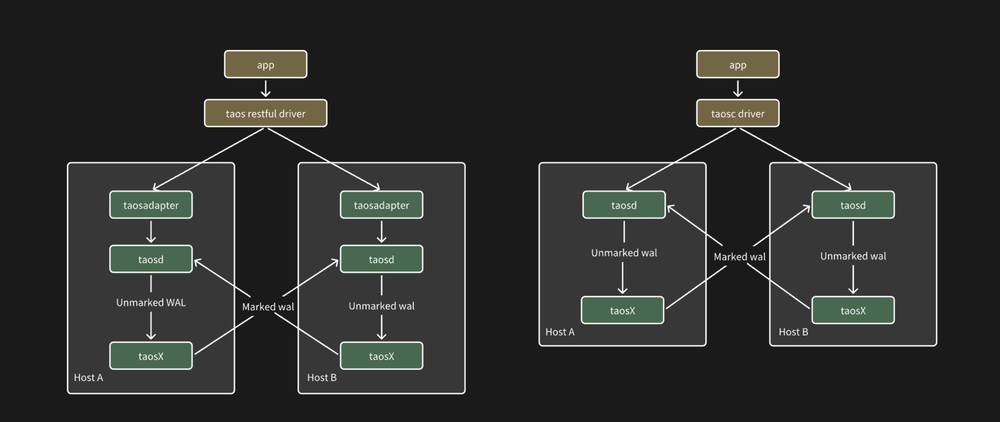

## Introduction

In the environment of some users, there are only two hosts that can be used, but the users still want to have high availability and high reliablity. To meet the business needs to such users, TDengine provides Active-Active system from version 3.3.0.0, based on real time data replication and client fail over. In this chapter, we will introduce the deployment architecture, configuration and operations for TDengine Active-Active system. TDengine Active-Active can be used in the limited enviroment mentioned previously, and can also be used for disaster recovery between two TDengine clusters while each cluster can consist of multiple hosts. 

## Definition

The standard definition of TDengine Active-Active is that there are only two hots while on each host a single node TDengine is deployed. From the view of business clients, these two machines and two TDengine services are a single complete system, the clients don't know anything about the internals of the system. The two hosts of TDengine Active-Active system are called Master host and Slave host respectively. 

## Architecture

The architecture of TDengine Active-Active system is despicted as below, in which there are three key technologies: 
1. The fail over is performed by the client driver provided by TDegnine to switch between the master and the slave
2. Real time data replication is performed by taosX, which is a component in TDengine Enterprise, between the master and the slave. 
3. The data from replication will be marked specially to avoid infinite replication loop, i.e. from A to B then from B to A again. 

Note：In the diagram the master and slave are shown as a single node TDengine. But they can both be changed to a normal TDengine cluster of multiple nodes.



## Configuration

### Server configuration

TDengine Active-Active doesn't introduce any change or impact to the configuration of TDengine server, i.e. `taosd`. 

### Client Configuration

For now only JDBC supports TDengine Active-Active in only WebSocket connection mode, its configuration example is as below:

```java
url = "jdbc:TAOS-RS://" + host + ":6041/?user=root&password=taosdata";
Properties properties = new Properties();
properties.setProperty(TSDBDriver.PROPERTY_KEY_BATCH_LOAD, "true");
properties.setProperty(TSDBDriver.PROPERTY_KEY_SLAVE_CLUSTER_HOST, "192.168.1.11");
properties.setProperty(TSDBDriver.PROPERTY_KEY_SLAVE_CLUSTER_PORT, "6041");
properties.setProperty(TSDBDriver.PROPERTY_KEY_ENABLE_AUTO_RECONNECT, "true");
properties.setProperty(TSDBDriver.PROPERTY_KEY_RECONNECT_INTERVAL_MS, "2000");
properties.setProperty(TSDBDriver.PROPERTY_KEY_RECONNECT_RETRY_COUNT, "3");
connection = DriverManager.getConnection(url, properties);
```

In the above example, we can see a few items related to TDengine Active-Active, they are explained in the table below:

| Attribute | Explanation | 
| --------- | ----------- |
| PROPERTY_KEY_SLAVE_CLUSTER_HOST | The IP or FQDN of the slave host, its default value is NULL |
| PROPERTY_KEY_SLAVE_CLUSTER_PORT | The port of the slave host, its default value is NULL |
| PROPERTY_KEY_ENABLE_AUTO_RECONNECT | Enable automatic reconnection or not. true: enabled; false: disabled. It's only valid in websocket connection mode. When connecting to an TDengine active-active system, please set to true. |
| PROPERTY_KEY_RECONNECT_INTERVAL_MS | The reconnection interval in milliseconds: the default value is 2,000; the minimum allowed value is 0; the upper limit if the maximum value of integer type |
| PROPERTY_KEY_RECONNECT_RETRY_COUNT | The number of reconnection times: the dfault value is 3; the minimum allowed value is 0; the upper limit is the maximum value of integer type |

### Constraints

1. Client programs can't use data subscription APIs in TDengine Active-Active, creating consumer would fail in such a case
2. Client programs should not use parameter binding
3. Client programs should not use SQL statement "use database db_name", but should specify the database name in connection parameters
4. The two TDengine configuration of the Active-Active system should be exactly same, including database naming, database parameters, user names, passwords, access control, etc. 
5. Only WebSocket can be used with TDengine Active-Active

## Operations

TDengine Active-Active system provides some tools to ease the tasks of configuring, starting, restarting and stopping data replication tasks.

### taosx replica start

It is used to start the data replication tasks in TDengine Active-Active system, on the two specified hosts both taosd and taosX must be active.

1. Option One

```shell
    taosx replica start -f source_endpoint -t sink_endpoint> [database...] 
```

THe above command will create data replication task from the source_endpoint to the sink_endpoint in the taosX service while this command is executed. When it's executed successfully, a replica IS will be output to the console. In the command, source_endpoint and sink_endpoint are mandatory, they are the end points of taosd service on the two hosts in the TDengine Active-Active system.

```shell
taosx replica start -f td1:6030 -t td2:6030 
```
The above example will create data replication task excluding some system built-in databases, like information_schema, performance_schema, log and audit. You can also use http://td2:6041 as end point to use WebSocket connection if you already have taosAdapter service deployed porperly. You can also specify a specific database to only replicate the data of this database. 

2. Option Two

```shell
taosx replica start -i id [database...]
```

THe above command will add one or more databases to an existing task specified by the `id` parameter. 

Note：
- This command will not create duplicate task even you run it multiple times, it only update existing task to add more databases
- Replica id is unique in same taosX service, regardless of the source_endpoint and sink_endpoint
- For users to memorize easily, replica is a commonly used word selected randomly. 

### taosx replica status [id...]

This command will return the task list and the status of each task in the current TDengine Active-Active system. You can specify one or more replica id. The output example is as below:

```shell
+---------+----------+----------+----------+------+-------------+----------------+
| replica | task | source   | sink     | database | status      | note           |
+---------+----------+----------+----------+------+-------------+----------------+
| a       | 2    | td1:6030 | td2:6030 | opc      | running     |                |
| a       | 3    | td2:6030 | td2:6030 | test     | interrupted | Error reason |
```

### taosx replica stop id [db...]

This command can be used to: 
- Stop the replication task specified by id parameter, or all tasks if not specified. 
- Stop the replication for a specific database of the task specified by id parameter.

### taosx replica restart id [db...]

It can be used to: 
- Restart the task specified by id or all the tasks if not specified 
- Restart the data replication for a specific database in the task specified by id 

### taosx replica diff id [db....]

It can be used to output the difference between the current data subscription offset and the latest WAL version, but the difference doesn't mean number of rows since each version may contain huge number of rows.

```shell
+---------+----------+----------+----------+-----------+---------+---------+------+
| replica | database | source   | sink     | vgroup_id | current | latest  | diff |
+---------+----------+----------+----------+-----------+---------+---------+------+
| a       | opc      | td1:6030 | td2:6030 | 2         | 17600   | 17600   | 0    |
| ad       | opc      | td2:6030 | td2:6030 | 3         | 17600   | 17600   | 0    |
``` 

### taosx replica remove id [--force]

It can remove all tasks or the specified tasks. If --force is not specified, you need to first stop the task then run this command; with --force, the command will automatically first stop then remove the tasks.

### Best Practices

Assume there are two hosts in the TDengine Active-Active system, host A and B.

1. First, on the host A, use "taosx replica start" to configure data replication tasks. The input parameters are the end points of the source and the sink taosd services. 
2. Second, perform same thing on the host B. 
3. Then, TDengine Active-Active can be in service state. 
4. Once configuration is done, if you want to restart the TDengine Active-Active system, besides restarting all service components, please use "taosx replica restart" command.

## Abnormals

If one host is down for over the WAL retention period of a database being replicated, data loss will happen. If such a case happens, system administrator must be involved to determine the situation of data loss and start extra data replication task to replicate the lost data.