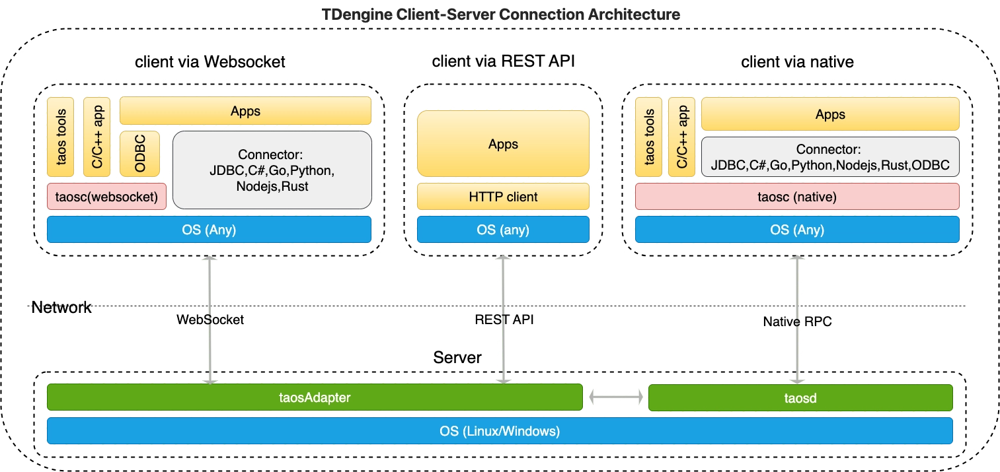

TDengine TSDB provides a rich set of application development interfaces. To facilitate users in quickly developing applications, it supports connectors for multiple programming languages — among which the official ones include those for C/C++, Java, Python, Go, Node.js, C#, and Rust. Community developers have also contributed several unofficial connectors, such as the ADO.NET connector, Lua connector, and [PHP connector](https://github.com/Yurunsoft/php-tdengine). These connectors support connecting to the TDengine TSDB cluster via the native interface and WebSocket interface. Additionally, users can directly call the REST API interfaces provided by taosAdapter to access TDengine TSDB for data writing and query operations.

## Connection Methods

The following is the architecture diagram of the connection methods between TDengine TSDB client and server:

As shown in the architecture diagram above, there are three ways to access TDengine TSDB:

1. WebSocket connection: Establish a connection with taosd through the WebSocket API provided by the taosAdapter component using a connector. This connection method is referred to as "WebSocket connection" in the following text. **WebSocket connection is recommended**.
2. Native connection: Establish a direct connection with the server program taosd through the client driver taosc using a connector. This connection method is referred to as "native connection" in the following text.
3. REST API: Establish a connection with taosd by directly calling the REST API provided by the taosAdapter component using an HTTP client, without using a connector. This connection method is referred to as "REST API" in the following text.

**Note**: The client driver taosc includes C native and WebSocket connectors. Applications developed in C/C++ language must depend on the client driver taosc.

For both WebSocket connections and native connections, connectors provide the same or similar APIs for database operations. The only slight difference lies in the connection initialization methods, so users will not perceive any difference in usage.

For the support status of various connection methods and connectors for different languages, please refer to [Connector Features](../../tdengine-reference/client-libraries/#feature-support).

The key differences are:

1. When using a native connection, the version of the client driver taosc must be consistent with that of the server-side TDengine TSDB.
2. When using a WebSocket connection, except for C/C++ and ODBC connectors, users do not need to install the client driver taosc. Even if the client driver taosc is required, there is no need to ensure its version is consistent with that of the server-side TDengine TSDB.
3. To connect to a cloud service instance, a WebSocket connection must be used.
4. REST API only provides the function of executing SQL, and does not support parameter binding or data subscription.
