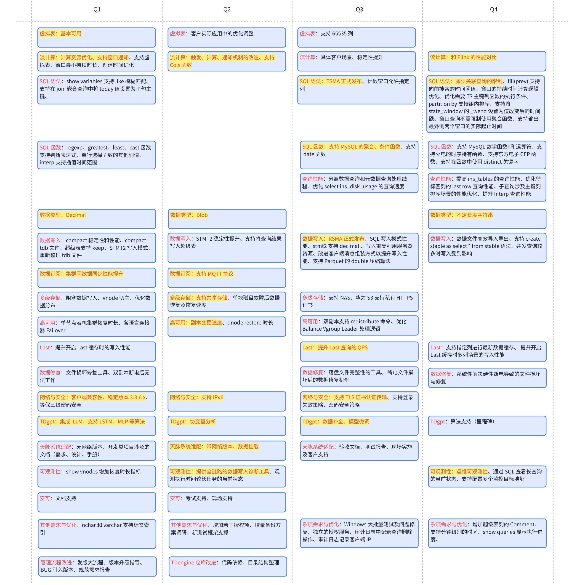

# 2025 年引擎部 Roadmap

## HighLights

### 2025 Q1

1. 虚拟表
2. TDgpt
3. Decimal
4. 流计算资源优化
5. 流计算事件通知
6. 支持 cols 函数
7. 天脉系统适配（无网络）
8. 维护稳定版本 3.3.6.x

### 2025 Q2

1. BLOB
2. 数据订阅支持 MQTT
3. 流计算重构
4. 支持共享存储
5. 天脉系统适配（数据挂载）
6. TDgpt 支持协变量分析
7. 支持 IPv6
8. 数据写入诊断工具

### 2025 Q3

1. 流计算稳定性提升
2. Rollup SMA 发布
3. Timewise SMA 发布
4. 支持 TLS 证书认证传输
5. 支持 MySql 的聚合、条件函数
6. TDgpt：数据补全、模型微调
7. 提升 Last 查询的 QPS
8. 独立的授权服务

### 2025 Q4

1. 安全可靠性提升，包括
   - 身份鉴别
   - 访问控制
   - 传输安全
   - 存储安全
   - 安全审计
   - 安全函数
   - 加密算法
   - 代码安全
2. 虚拟表继承
3. 流计算性能提升（与 Flink 对比）
4. 流计算支持按自然月触发
5. TDgpt 支持数据分类和多变量

## Details

## 大任务阶段性划分

SQL 函数：分配到四个季度，到  2025 年底能够支持 MySQL 函数全集，参见 [MySQL、Hive、TD 函数和运算符](https://taosdata.feishu.cn/wiki/T3w5wJUHeitRQHkjIjhc8cD9nLb)，实际优先级和进度会随人员入职而调整
TDgpt 算法：分配到四个季度，参见 [分析算法列表](https://taosdata.feishu.cn/wiki/JTqlweUzDi9GUqkU7HjcCEVJnUc)，实际优先级和进度会随着人员入职而调整
