# TDengine v3.4.0 总体设计文档

## 1. 引言

### 1.1 修订记录

| 编写日期 | 发布日期 | 版本 | 修订人 | 主要修改内容 |
| --- | --- | --- | --- | --- |
| 2025-11-03 | 2025-11-03 | 1.0 | 关胜亮 | 整理并创建文档 |

### 1.2 文档目的

本文档旨在全面阐述 TDengine 的总体设计方案，包括核心架构、模块划分、关键设计决策等内容，为开发人员、测试人员及运维人员提供统一的技术参考标准，确保各环节工作围绕一致的设计理念推进。

### 1.3 适用范围

本文档适用于 TDengine 开发工程师、测试工程师、运维工程师及产品工程师，同时可作为技术合作方了解 TDengine 技术架构的参考资料。

### 1.4 术语与缩略语

1. TDengine（Time-Series Database Engine）：本文档描述的时序数据库产品
2. TSDB（Time-Series Database）：时序数据库，用于存储和管理时序数据的专用数据库
3. STable（Super Table）：超级表，用于定义同一类设备的 Schema 模板
4. CTable（Child Table）：子表，对应单个设备的实际数据存储表
5. VTable（Virtual Table）：虚拟表，动态整合多表数据、自动对齐时间序列且高效查询的逻辑表

## 2. 背景与意义

物联网产业的发展已形成“数据采集-数据传输-数据存储分析计算-数据应用”的四层模型，其中“数据存储分析计算”是承接前端数据汇聚与后端价值输出的核心环节，直接决定物联网系统的性能与商业价值。随着物联网、工业互联网、车联网等领域的深度落地，时序数据——包括设备监控指标、传感器实时读数、生产日志、车辆轨迹等——正呈现指数级爆发态势，部分工业场景单日数据量已突破 100 亿条，传统数据处理体系面临严峻挑战。

### 2.1 物联网时序数据的核心特征

此类数据的独特属性使其与传统业务数据存在本质差异，具体表现为：
1. **强时序性**，所有数据均携带时间戳，且按时间有序生成；
2. **高结构化**，采集数据多为固定格式的数值或状态信息；
3. **写多读少**，以设备实时上报为主，查询多为事后分析或实时监控；
4. **生命周期明确**，数据通常按时间周期（如 3 个月、1 年）归档或删除，极少存在更新、删除操作；
5. **查询场景固定**，多为“指定时间范围+指定区域和设备”的组合查询，且需支持统计、聚合等实时计算；
6. **流量平稳可预测**，基于设备数量和采集频率可精准估算数据吞吐量。
这些特征既为时序数据库优化提供了方向，也让通用数据方案的短板愈发突出。

### 2.2 传统数据方案的行业痛点

当前市场上的主流数据处理方案均无法完美适配时序数据需求，具体痛点可分为四类：
1. **关系型数据库**：设计初衷为交易型数据，面对时序数据的高写入场景时性能瓶颈显著；分布式架构支持薄弱，数据量增长后查询效率呈指数级下降；时序特有的滑动窗口、降采样等分析能力需通过应用层二次开发实现，开发成本高。
2. **大数据平台**：由 Kafka、HBase、Spark 等多组件拼装而成，架构臃肿复杂；虽支持分布式，但单节点处理效率低，且数据需在多系统间传输，产生额外性能损耗；硬件投入和运维人力成本极高，中小企业难以承受。
3. **传统工业实时库**：架构陈旧无原生分布式方案，无法通过水平扩展应对数据量增长；多依赖 Windows 环境，兼容性差；分析能力薄弱且多为封闭系统，难以与云原生工具集成，无法满足现代工业互联网的云化部署需求。
4. **NoSQL 数据库**：无针对时序数据的存储与计算优化，实时聚合查询时 CPU 与内存开销巨大；查询延迟高，无法满足工业监控等低延迟场景需求。

### 2.3 TDengine 的诞生价值

通用方案“低效、复杂、高成本”的痛点，催生了专为时序数据设计的 TDengine。其核心价值在于打破传统方案的拼装模式，构建“数据汇聚-存储-计算-分发”一体化架构，针对时序数据特征进行全链路优化：通过原生支持多源数据接入解决汇聚难题，通过专属存储引擎实现高压缩比与高写入性能，通过内置计算引擎提升实时分析效率，通过灵活分发机制支撑多场景应用。最终解决海量时序数据的存储成本高、写入瓶颈突出、查询效率低、运维复杂等核心痛点，为企业级时序数据场景提供高性能、高可靠、易扩展的一站式解决方案。

## 3. 定位与目标

### 3.1 产品核心定位

TDengine 是一款面向物联网、工业互联网等场景分布式时序数据库，以“汇聚-存储-计算-分发”全链路能力为核心，集多源数据采集、高效存储、实时计算、灵活分发于一体，无需依赖第三方组件即可实现时序数据的全生命周期管理，为企业级时序数据场景提供端到端解决方案。其核心能力可细化为以下四大维度。

#### 3.1.1 数据汇聚

作为时序数据处理的入口，具备强大的多源数据汇聚能力，兼顾采集灵活性与数据质量可靠性，具体特性包括：
1. 多源适配：可无缝对接 MQTT、PI System、Wonderware、OPC、Kafka、InfluxDB 等主流数据源，覆盖 IoT 设备直连、工业控制系统、消息队列、第三方数据库等各类数据来源，实现时序数据的统一采集；
2. 数据治理：内置可配置的规则引擎，支持用户自定义数据清洗、转化规则（如格式标准化、异常值过滤、字段映射等），从源头保障入库数据质量；
3. 可靠传输：具备断点续传与历史数据回填能力，当遭遇网络中断、设备离线等异常情况时，可自动缓存未传输数据，恢复连接后完成断点续传，同时支持手动/自动回填指定时间范围的历史数据，确保数据完整性；
4. 源端管理：提供统一的数据源管理界面，支持对各类数据源进行实时增删操作，可直观监控每个数据源的连接状态、数据传输速率、异常告警等运行信息，实现数据源的全生命周期管控。

#### 3.1.2 数据存储

自研核心存储引擎，通过深度优化实现性能与成本的平衡，为海量时序数据提供可靠载体：
1. 极致性能：针对时序数据特性进行底层优化，在数据写入（高并发吞吐）、查询（时间范围/聚合查询）及数据压缩（数值型数据压缩比达 20:1）方面均展现出超强性能，远超通用数据库；
2. 弹性扩展：采用原生分布式架构设计，支持集群水平扩展，可通过新增节点快速提升存储容量与处理能力，适配数据量的指数级增长；
3. 多级存储：支持基于数据冷热特性的分级存储策略，可将高频访问的热数据存储于 SSD 以保障低延迟，将低频访问的冷数据迁移至 HDD 或对象存储，大幅降低整体存储成本。

#### 3.1.3 数据分析

构建了“SQL兼容+实时计算+智能分析”的多层计算体系，满足从基础查询到高级智能分析的全场景需求：
1. 灵活查询：全面支持 SQL 语法，并扩展丰富的时序数据专用函数（如时间窗口聚合、降采样等），同时支持嵌套查询、关联查询及用户定义函数（UDF），适配复杂业务分析场景；
2. 实时计算：集成批流一体的计算引擎，支持流计算模式下的实时分析，可对采集的实时数据进行秒级处理，快速输出分析结果；
3. 智能赋能：通过时序数据分析智能体 TDgpt，基于时序数据特性提供预测、异常检测、数据补全、分类等智能化功能，助力从数据中挖掘业务价值；
4. 生态集成：通过标准 JDBC/ODBC 接口，可与第三方 BI 工具（如 Grafana、Tableau）、AI 框架及可视化平台无缝对接，实现分析结果的多端展示与深度应用。

#### 3.1.4 数据分发

提供灵活高效的数据分发能力，支持时序数据的精准流转与边云协同，满足多场景数据共享需求：
1. 精准管控：分发数据范围可通过 SQL 语句灵活定义，颗粒度可控，既支持全库数据分发，也可精准定位至部分表、特定字段，或基于过滤条件、聚合规则输出目标数据；
2. 安全可靠：支持配置分发时长、定期重置访问 Token 等安全策略，有效管控数据访问权限，降低数据泄露风险；
3. 易用高效：采用极简的使用方式，提供可直接复制粘贴的调用代码，操作门槛等同于在线文档，大幅提升开发效率；
4. 边云协同：原生支持边缘节点与云端集群的数据协同，可实现边缘端数据本地处理后按需分发至云端，或云端指令下传至边缘，适配分布式部署场景。
集数据采集、存储、计算、分析、可视化于一体，无需依赖第三方组件即可实现时序数据的全生命周期管理。

### 3.2 产品核心目标

基于时序数据处理场景的核心痛点，结合 TDengine 的技术创新优势，确立以下七大核心目标，形成“性能领先、成本优化、扩展灵活、生态开放”的目标体系：

#### 3.2.1 极致性能目标

读写效率超行业标杆 10 倍以上。充分利用时序数据“写多读少、有序生成”的特性，通过创新存储引擎与列式存储设计，实现远超同类产品的性能表现。在TSBS 基准测试中，读写性能显著优于 TimescaleDB、InfluxDB 等主流时序数据库；相对通用关系型数据库，读、写及数据压缩性能提升至少 10 倍，满足工业互联网、车联网等高频数据采集场景的实时处理需求。

#### 3.2.2 成本优化目标

存储成本降至行业均值 1/10 以下。通过“一个数据采集点一张表”的架构创新、两阶段差异化压缩算法（针对不同数据类型匹配最优编码），实现数据压缩比的翻倍提升；结合“内存-SSD-硬盘-S3”多级存储策略，将冷数据迁移至低成本存储介质，最终使整体存储成本控制在传统方案的 1/10 以内，大幅降低企业数据存储开销。

#### 3.2.3 扩展能力目标

支撑亿级数据采集点的水平扩展。基于虚拟节点技术与存算分离架构，实现数据的高效分区与分片，确保系统在高基数场景下的性能稳定。经实际验证，在 1 亿时间线、100 个数据节点的部署规模下，仍能保持优异的读写与查询性能，彻底解决时序数据处理中的“高基数”难题，适配物联网设备规模化增长需求。

#### 3.2.4 数据汇聚目标

零代码实现多源数据高效接入。构建零代码数据汇聚平台，无需开发即可完成多源数据的ETL流程。原生支持 MQTT、OPC-UA/DA、Kafka 等协议，以及 PI System、Wonderware、MySQL、InfluxDB 等主流数据源的接入，同时兼容 Telegraf、Prometheus 等采集工具，实现工业、物联网场景下全类型数据的“一键汇聚”。

#### 3.2.5 全栈处理目标

一体化支撑时序数据全生命周期需求。打造“汇聚-存储-计算-分发”全栈处理能力，除核心时序数据库外，集成缓存、数据订阅、流计算、ETL 工具及智能分析（预测、异常检测）模块，无需依赖第三方组件即可完成时序数据从采集到价值挖掘的全流程处理，降低系统复杂度。

#### 3.2.6 生态开放目标

无缝对接全场景工具链与业务系统。以开源为基础，提供标准 SQL 查询能力及 ODBC/JDBC 接口，实现与 Grafana、Tableau 等 BI 工具，以及各类 AI 框架、可视化平台的无缝集成；支持数据实时订阅与跨系统同步，避免厂商绑定，满足企业多场景数据共享与业务对接需求。

#### 3.2.7 信创兼容目标

助力核心领域国产化替代。全面兼容信创生态，适配龙芯、飞腾、鲲鹏等国产 CPU，以及 UOS、麒麟、凝思等国产操作系统；在发电、石油石化、智慧矿山、军工等国家核心工业领域，实现对 OsiSoft PI、Wonderware 等国外实时数据库的平滑替代，保障数据安全与系统自主可控。

### 3.3 关键技术指标

围绕核心目标，制定可量化的关键技术指标，涵盖性能、存储、扩展、生态等维度，部分指标参考TSBS基准测试及实际场景验证结果，确保目标的可行性与落地性：

| 指标类别 | 具体指标 | 目标值 | 说明 |
| --- | --- | --- | --- |
| 单节点写入吞吐量 | ≥ 10 万条/秒 | 基于标准硬件配置（8 核 CPU + 16G 内存） |
| 分布式集群写入吞吐量 | ≥ 100 万条/秒 | 10 节点集群规模下的聚合性能 |
| 相对 InfluxDB 写入性能 | ≥ 10 倍 | TSBS 基准测试 |
| 单设备近 1 小时数据查询 | ≤ 10ms | 包含简单聚合计算（AVG/MAX） |
| 百万级设备聚合查询（天级） | ≤ 100ms | 支持设备标签筛选条件 |
| 相对 TimescaleDB 查询性能 | ≥ 10 倍 | 复杂时间窗口聚合场景 |
| 存储压缩 | 数值型数据压缩比 | ≥ 10:1 | TSBS 基准测试 |
| 数据可用性 | 99.99% | 多副本部署下的全年可用性目标 |
| 故障自动恢复时间 | ≤ 30s | 节点故障后服务切换耗时 |
| 支持最大节点数 | ≥ 100 节点 | 分布式集群横向扩展上限 |
| 支持最大数据采集点 | ≥ 1 亿个 | 100 节点集群下的稳定支撑规模 |
| 支持数据源种类 | ≥ 20 种 | 含协议、数据库、采集工具等类型 |
| 数据汇聚配置耗时 | ≤ 60s | 单数据源零代码配置完成时间 |
| 信创 CPU 兼容种类 | ≥ 5 种 | 含龙芯、飞腾、鲲鹏等主流型号 |
| 第三方工具集成数 | ≥ 20 种 | 含 BI 工具、AI 框架、可视化平台 |

## 4. 产品模块设计

本章节详细阐述 TDengine 的总体产品模块构成，包括内核模块、安全模块、工具组件及接口模块，各模块通过协同工作实现时序数据的全生命周期管理。
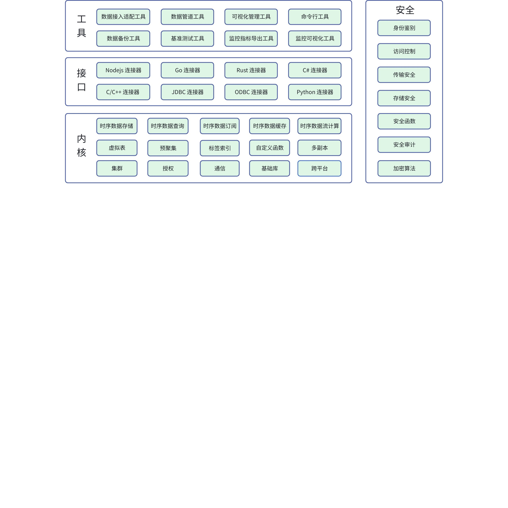

### 4.1 内核模块

内核是 TDengine 的核心处理单元，涵盖数据存储、计算、集群管理等核心能力。各模块功能及技术细节如下：
1. 时序数据存储模块：基于 “一个设备一张表” 的创新数据模型（超级表 / 子表）和列式存储引擎，从根本上解决了高基数问题。按子表、时间维度的建模方法，在保证高吞吐写入的同时，实现了极高的存储效率，有效降低了存储空间占用。
2. 时序数据查询模块：支持标准 SQL 及时序扩展语法（如时间窗口函数、插值计算等），查询引擎针对时序数据进行深度优化，能高效处理时间窗口查询、跨表聚合等复杂操作。
3. 时序数据订阅模块：提供类 Kafka 的发布 / 订阅功能，支持按表、按标签或按数据内容进行过滤，实现实时数据分发。采用消费组模式，支持消息的可靠投递与负载均衡，确保数据处理的高吞吐与低延迟。
4. 时序数据缓存模块：采用 LRU 缓存策略，缓存最近写入数据。通过内存加速，大幅减少了磁盘 I/O，显著降低了高频查询的响应时间。
5. 时序数据流计算模块：内置轻量级流计算引擎，无需依赖外部流处理框架（如 Flink、Spark Streaming）。支持多种触发方式和和乱序数据处理，能够基于实时写入的数据进行毫秒级计算，并将结果实时写入数据库或通过订阅模块推送给下游应用。
6. 虚拟表模块：虚拟表以超级表 / 子表模型为基础，是解决多测点数据查询痛点的动态逻辑表。它可从多类原始子表中按需组合列，以时间戳为基准自动对齐数据，且随原始表动态更新，无需物理存储。该模块替代了复杂的 JOIN 语法，大幅降低工业等场景下多测点数据的关联分析门槛。
7. 预聚集模块：在数据写入时计算并存储其时间窗口内的统计信息（如最大值、最小值、平均值）。当用户查询时，可直接返回预计算结果，从而显著降低计算开销和查询响应时间。
8. 标签索引模块：为设备标签构建索引结构，而非传统的键值对存储。使得在拥有海量设备（如百万级）的数据集下，基于标签的快速过滤与查询性能得到数量级的提升。
9. 自定义函数模块：支持用户通过 C/C++ 或 Python 语言扩展自定义的标量函数或聚合函数，满足特定业务场景下的个性化分析需求。
10. 多副本模块：基于 RAFT 共识算法实现数据的多副本管理，确保了分布式系统的数据一致性和高可用性。当某个节点发生故障时，系统能够自动选举新的主节点，实现故障的无缝切换和数据的零丢失。
11. 集群模块：负责整个分布式集群的生命周期管理，包括节点的动态加入 / 退出、数据分片的均衡调度、以及全局元数据的管理。通过虚拟节点机制，实现了数据的水平切分和负载均衡。
12. 授权模块：基于硬件唯一机器码实现 License 与设备的强绑定机制，通过采集 CPU、主板等核心硬件标识生成专属机器码，使 License 无法通过简单拷贝方式在多设备间复用。
13. 通信模块：基于开源组件进行了深度优化，采用轻量级的二进制通信协议，在节点间和客户端与服务器间进行高效数据传输。
14. 基础库模块：封装数据结构、内存管理、消息编解码等功能，为上层模块提供稳定、高性能的基础调用支撑。
15. 跨平台模块：封装跨平台函数，适配 Windows、Linux、Mac 等系统，兼容 x86_64、ARM32/64 等架构。

### 4.2 安全模块

安全模块涵盖“身份认证-权限管控-传输加密-存储加密-操作审计”全链路，符合等保三级合规要求。各模块功能及技术细节如下：
1. 身份鉴别模块：响应客户对安全认证的需求，包括强口令策略、登录保护（连续失败锁定、密码有效期管控）、多因素认证（TOTP 动态验证码）及 TOKEN 认证；支持 IP 主机与登录时间限制，密码采用加盐哈希存储确保安全。同时可配置会话数、连接时长等资源限制，防范权限滥用与资源独占。
2. 访问控制模块：基于角色的访问控制，三权分立设计风格，内置 SYSDBA、SYSSEC、SYSAUDIT 三类系统角色，实现权限分离；支持角色创建、权限授予/回收，可按表列范围、时间戳行范围精准管控数据访问，要求权限定期审查，且 root 用户禁止访问私有数据，保障数据访问安全合规。
3. 传输安全模块：为数据传输提供全链路安全保障，支持 SASL+TLS 加密认证、精细化 SESSION 管控，加密范围包括登录信息、SQL 语句、查询结果等所有传输内容，防止数据被窃听或篡改。
4. 存储安全模块：实现数据持久化存储的全加密保护，支持分级密钥与透明加密，加密范围包括配置文件、元数据文件、数据文件。
5. 安全函数模块：提供加密、哈希、脱敏、编码四类函数，满足数据加密存储、敏感信息脱敏等合规需求。
6. 安全审计模块：提供分级化数据库审计能力，支持数据级（SELECT / INSERT / DELETE） 、系统级（节点创建 / 删除 / 恢复等）、集群级（权限授予 / 回收、VGroup 平衡等）等维度，审计日志记录操作时间、用户、资源及 SQL 详情。
7. 加密算法模块：基于 OpenSSL EVP 接口构建灵活可扩展的加密算法体系，支持内置算法与用户自定义算法共存。包括 SM4、AES-128-CBC 等对称加密算法及 SM2、RSA 非对称加密、SM3、SHA-256 哈希算法。

### 4.3 工具组件

工具组件提供部署、监控、运维等全流程支撑。各工具功能及技术细节如下：
1. 数据接入适配工具：taosAdapter 是 TDengine 与应用程序间的桥接工具，支持 RESTful、WebSocket 等接口，兼容 InfluxDB / OpenTSDB 协议，可对接 Telegraf、StatsD 等数据收集工具，实现高效数据接入与应用迁移。
2. 数据管道工具：taosX 为 TDengine 企业版数据管道组件，支持零代码对接第三方数据源（如 PI、OPC-UA），实现数据导入、同步及备份恢复，支持离线文件（CSV / Parquet）和实时数据流处理。
3. 可视化管理工具：taosExplorer 是 TDengine 企业版 Web 可视化工具，提供数据库管理、SQL 执行、权限配置及数据导入功能，支持零代码配置数据迁移任务，简化集群运维操作。
4. 命令行工具：taosShell 命令行工具提供 CLI 交互界面，支持连接本地或云端 TDengine，执行 SQL 语句并格式化输出结果，具备 TAB 键补全功能，适用于日常运维、开发测试及自动化脚本执行。
5. 数据备份工具：taosDump 是开源逻辑备份工具，支持全量/增量备份、指定表或时间段数据导出（AVRO 格式），可恢复至原集群或新集群，适用于中小规模数据备份与迁移。
6. 基准测试工具：taosBenchmark 基准测试工具用于评估 TDengine 性能，支持多种连接方式（RESTful、WebSocket 等），测试写入 / 查询 / 订阅性能，生成规范化报告，助力集群调优与配置验证。
7. 监控指标导出工具：taosKeeper 是开源监控工具，收集集群运行状态（CPU、内存、慢查询等）及性能指标，通过 RESTful 接口存储数据，提供 Prometheus 格式指标，支持多集群集中监控。
8. 监控可视化工具：TDinsight 是基于 Grafana 的可视化插件，结合 taosKeeper 监控数据，可视化展示集群状态、节点资源、请求统计等指标，支持告警规则设置，助力实时问题诊断。

### 4.4 接口模块

接口模块提供多语言访问能力。各模块功能及技术细节如下：
1. C/C++ 连接器：提供连接管理、同步 / 异步 SQL 执行、参数绑定、无模式写入及数据订阅等功能，适配高并发时序数据操作场景。
2. JDBC 连接器：遵循 Java JDBC 规范的官方驱动。
3. ODBC 连接器：兼容 ODBC 标准的官方驱动。
4. Python 连接器：适配 Python 3.0+ 的官方驱动。
5. NodeJS 连接器：基于 WebSocket 接口的官方驱动。
6. Go 连接：实现 Go 语言 database/sql 标准接口的官方驱动，兼容 Go 1.14+。
7. Rust 连接器：注重内存安全的官方驱动，适配 Rust 1.65+。
8. C# 连接器：遵循 ADO.NET 规范的官方驱动，兼容.NET Framework 4.6+ 及 .NET 5.0+。

## 5. 数据模型创新

TDengine 突破传统时序数据建模思路，基于物联网场景特征独创“子表-超级表-虚拟表”三级数据模型，解决了海量时序数据的存储效率、聚合分析及跨表关联难题，是其性能优势与易用性的核心支撑。该模型以“精准匹配时序数据特征、简化业务操作、提升计算效率”为设计理念，形成从单设备数据管理到多设备聚合分析的完整解决方案。

### 5.1 子表：单采集点的数据专属载体

子表是单采集点的数据专属载体，“一个数据采集点一张表”是 TDengine 数据模型的基础创新，其设计源于物联网时序数据的核心特征，为单个设备的数据存储提供最优解。

#### 5.1.1 设计背景：物联网时序数据的特性支撑

以智能电表为代表的物联网场景中，时序数据呈现显著共性：
1. 强时序性，所有数据携带时间戳且按采集顺序生成；
2. 高结构化，数据格式固定（如电流、电压字段），以数值型为主；
3. 静态属性关联，每个采集点绑定唯一标签（如设备位置、型号）；
4. 写入有序性，单设备数据到达服务器的相对顺序可保障。
这些特征为“单采集点单表”设计提供了天然条件。

#### 5.1.2 核心设计：表结构与存储策略

子表作为单个数据采集点的专属存储单元，其设计核心围绕“高效写入与查询”展开，具体策略包括：
1. **数据组织**：每张子表仅存储单个设备的时序数据，记录按时间戳自动排序，新数据以追加方式写入，避免数据移动开销；
2. **块式存储**：数据按固定条数或时间范围拆分为“数据块”，每个块包含预计算信息（如最大值、平均值）、Schema 定义及索引，系统通过块索引可快速定位目标时间范围的数据；
3. **列式存储优化**：数据块内部采用列式存储，同一列数据特征相近（如连续的电压值），可匹配差异化压缩算法，同时分析时仅读取目标列数据，减少无效 IO。

#### 5.1.3 核心优势：存储与性能的双重提升

该设计使单设备数据管理效率最大化：
1. **存储去重与压缩优化，降低冗余成本：**子表仅存储单个采集点的时序数据，设备 ID、位置等静态标签无需随每条数据重复写入，仅在子表元数据中关联一次，相比传统“多采集点混存”模式，显著降低冗余存储。同时，子表数据为高结构化数值型数据，统一设备同一采集量变化幅度通常较小，结合块内列式存储特性，使数值型数据压缩比远优于其他同类数据库的压缩效果。
2. ** 写入模式极简高效，突破吞吐瓶颈：**子表内数据天然按时间戳有序生成，新数据采用“追加写入”模式直接写入内存缓冲区，无需像多设备混存表那样进行数据重排或索引调整，避免了随机 IO 带来的性能损耗，且不会因设备数量增加而出现写入性能衰减。当缓冲区数据达到阈值后，后台线程异步将数据刷盘至数据块，整个流程无锁竞争。
3. **查询定位精准快速，降低延迟开销：**子表的“块式存储+时间戳有序”特性为查询提供双重加速。一方面，数据按固定时间范围拆分的数据块自带预计算信息（如块内最大值、平均值）和索引，查询时可通过块索引快速定位目标时间范围，无需全表扫描；另一方面，单设备数据集中存储且时间戳连续，结合列式存储仅读取目标字段的优势，单设备数据查询延迟非常小，复杂时间窗口聚合延迟也远优于多设备混存表的查询性能**。**

### 5.2 超级表：多采集点的聚合分析中枢

当采集点规模达数千甚至上亿时（如一个省的 3000 万台智能电表），子表数量激增导致管理与聚合困难。超级表作为“同一类设备的模板定义”，实现了多子表的高效管控与聚合分析。

#### 5.2.1 核心定位：设备类型的统一模板

超级表本质是“设备类型的 Schema 模板”，定义两类核心信息：
1. **数据列 Schema**：描述时序采集指标的结构（如智能电表的电流、电压、相位字段及类型）；
2. **标签列 Schema**：定义设备静态属性（如位置、型号），支持事后增删改，适配不确定的分析维度。
基于超级表创建子表时，子表自动继承数据列 Schema，仅需填充专属标签值，实现“一类设备、一套模板、多张子表”的规范化管理。例如创建智能电表超级表的 SQL 语句：
```plaintext {wrap}
create table smeter (ts timestamp, current float, voltage int, phase float) tags (loc binary(20), type int);
```

基于该模板为 6 个电表创建子表，仅需指定标签值：
```plaintext {wrap}
create table t1 using smeter tags('BJ.chaoyang', 1); -- 北京朝阳，类型1
create table t2 using smeter tags('SH.pudong', 1);  -- 上海浦东，类型1
```

#### 5.2.2 关键优化：标签存储与聚合机制

超级表的聚合能力核心源于标签的独立存储设计：
1. **标签存储策略**：标签与时序数据分离存储，采用 Key-Value 结构集中管理，每个采集点仅存一条标签记录并建立索引，避免重复存储，大幅节省空间；
2. **聚合计算流程**：查询时先通过标签过滤定位目标子表，再对这些子表的时序数据进行聚合，减少无效数据扫描。例如查询北京朝阳所有电表的电压平均值：
```plaintext
select avg(voltage), max(current) from smeter where loc = "BJ.chaoyang";
```

该流程本质是“标签维度表（Tag Data）+时序事实表（TS Data）”的联动，通过标签一级索引过滤设备，再通过时间戳二级索引过滤数据，实现高效多维分析。

#### 5.2.3 核心优势：破解多设备管理与聚合难题

超级表通过“模板化+标签化”设计，从存储、性能、易用性等维度解决海量采集点管理痛点：
1. **存储优化，标签去重降低冗余开销**：标签与时序数据分离存储，每个采集点仅存一条标签记录，相比传统方案中标签随数据重复存储的模式，在高基数场景下可大幅节省存储空间，解决海量设备标签的存储冗余问题。
2. **查询加速，两级索引提升聚合效率**：以“标签（一级索引）+时间戳（二级索引）”实现精准过滤，先通过标签快速定位目标子表，再按时间范围筛选数据，避免全量扫描，聚合查询效率较传统方案提升数倍。
3. **建模灵活，适配不确定分析维度**：支持标签事后增删改，单个超级表最多可配置 128 个标签，适配不确定的分析维度；标签支持树状结构，可通过层级匹配缩小查询范围，无需重构表结构即可扩展分析场景。
4. **容易管理，降低使用门槛**：兼容标准 SQL 语法，聚合查询仅需通过 WHERE 子句添加标签条件，无需复杂的关联查询。

### 5.3 虚拟表：多采集点的关联与动态整合

针对多子表跨设备关联查询复杂的问题，虚拟表实现了“多子表按需组合、时间戳自动对齐、数据动态更新”，为设备级全景视图提供支撑，解决 IT 与 OT 层数据模型差异的衔接难题。

#### 5.3.1 核心痛点：传统跨表查询的局限

工业场景中，一个设备常对应多个采集点（如发电机的电压、电流、温度分别对应不同子表），传统方案需通过复杂关联+嵌套查询实现数据关联，存在三大问题：
1. 时间戳对齐效率低；
2. 标签重复存储且更新无原子性；
3. 查询语句复杂，维护成本高。

#### 5.3.2 设计逻辑：动态关联与数据对齐

虚拟表是基于原始子表的逻辑表，不存储实际数据，核心功能包括：
1. **列选择与拼接**：从多个子表中按需选择字段组合成虚拟表，支持字段重命名（如将 p10.val 定义为 voltage）；
2. **时间戳自动对齐**：以时间戳为基准整合数据，相同时间戳的多表数据合并为一行，缺失数据可通过填充函数（如线性插值）补全；
3. **动态更新**：原始子表数据变更时，虚拟表实时同步，保障数据时效性。

#### 5.3.3 实践实例：发电机设备的虚拟表应用

某发电机的电压、电流、温度分别存储于p10、p11、p12子表，创建虚拟表实现设备级数据整合：
1. **创建虚拟超级表模板**：定义设备级数据结构与标签；
```plaintext {wrap}
create table devices (ts timestamp, current double, voltage double, temperature double) tags (device varchar(20)) virtual 1;
```

1. **创建设备虚拟子表**：关联原始子表字段；
```plaintext {wrap}
create virtual table d1 (current from p11.val, voltage from p10.val, temperature from p12.val) using devices tags('device1');
```

1. **简化查询**：直接查询虚拟表获取设备全景数据，支持时间范围与聚合计算；
```plaintext {wrap}
-- 查询设备1小时内的实时参数，空值用0填充
select ts, last(current), last(voltage) from d1 where ts between '2024-03-01 00:00:00' and '2024-03-01 01:00:00' interval(1h) fill(value, 0);
```

#### 5.3.4 核心优势：易用性与效率双提升

虚拟表通过“逻辑关联+动态计算”的创新设计，精准解决多子表跨设备关联的核心痛点，核心优势体现在四方面：
1. **查询简化，降低使用门槛**：彻底消除多表关联查询的复杂 JOIN 语法，用户可通过虚拟表直接获取跨子表的整合数据，查询语句大大简化。例如聚合发电机多采集点数据时，无需嵌套查询，直接通过虚拟表完成“一站式”查询，大幅降低开发与维护成本。
2. **时间对齐高效，空值处理灵活**：自动以时间戳为基准完成多源数据对齐，相同时间戳数据合并为行；针对缺失数据，提供前向填充、线性插值等多种 PADDING 函数，可按需补全空值，解决传统方案需手动拼接数据的低效问题。
3. **性能优化，保障实时性**：作为逻辑表不存储实际数据，通过动态计算减少存储冗余；原始表数据变更时，虚拟表可实现毫秒级同步更新，同时归并排序算法优化了数据对齐效率，复杂断面查询延迟控制在毫秒级。
4. **动态扩展，适配业务变化**：支持列的动态添加、删除与字段映射调整，无需重构表结构即可适配业务需求变更。例如工业场景中新增设备监测指标时，仅需更新虚拟表列定义，无需修改原始子表，实现“千人千面”的灵活建模。

## 6. 分布式架构

### 6.1 集群与基本逻辑单元

TDengine 的设计是基于单个硬件、软件系统不可靠，基于任何单台计算机都无法提供足够计算能力和存储能力处理海量数据的假设进行设计的。因此 TDengine 从研发的第一天起，就按照分布式高可靠架构进行设计，是支持水平扩展的，这样任何单台或多台服务器发生硬件故障或软件错误都不影响系统的可用性和可靠性。同时，通过节点虚拟化并辅以负载均衡技术，TDengine 能最高效率地利用异构集群中的计算和存储资源降低硬件投资。

#### 6.1.1 主要逻辑单元

TDengine 分布式架构的逻辑结构图如下：
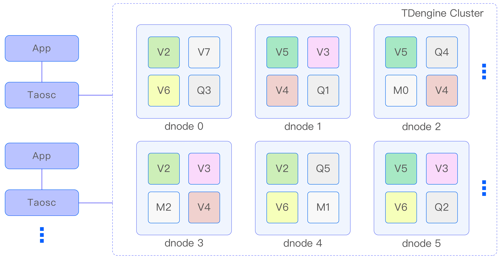

图 1 TDengine 架构示意图
一个完整的 TDengine 系统是运行在一到多个物理节点上的，逻辑上，它包含数据节点（dnode）、TDengine 应用驱动（taosc）以及应用（app）。系统中存在一到多个数据节点，这些数据节点组成一个集群（cluster）。应用通过 taosc 的 API 与 TDengine 集群进行互动。下面对每个逻辑单元进行简要介绍。

##### 6.1.1.1 物理节点（pnode）

pnode 是一独立运行、拥有自己的计算、存储和网络能力的计算机，可以是安装有 OS 的物理机、虚拟机或 Docker 容器。物理节点由其配置的 FQDN（Fully Qualified Domain Name）来标识。TDengine 完全依赖 FQDN 来进行网络通讯。

##### 6.1.1.2 数据节点（dnode）

dnode 是 TDengine 服务器侧执行代码 taosd 在物理节点上的一个运行实例。在一个 TDengine 系统中，至少需要一个 dnode 来确保系统的正常运行。每个 dnode 包含零到多个逻辑的虚拟节点（vnode），但管理节点、弹性计算节点和流计算节点各有 0 个或 1 个逻辑实例。
dnode 在 TDengine 集群中的唯一标识由其实例的 endpoint（EP）决定。endpoint 是由 dnode 所在物理节点的 FQDN 和配置的网络端口组合而成。通过配置不同的端口，一个 pnode（无论是物理机、虚拟机还是 Docker 容器）可以运行多个实例，即拥有多个 dnode。

##### 6.1.1.3 虚拟节点（vnode）

为了更好地支持数据分片、负载均衡以及防止数据过热或倾斜，TDengine 引入了 vnode（虚拟节点）的概念。虚拟节点被虚拟化为多个独立的 vnode 实例（如上面架构图中的 V2、V3、V4 等），每个 vnode 都是一个相对独立的工作单元，负责存储和管理一部分时序数据。
每个 vnode 都拥有独立的运行线程、内存空间和持久化存储路径，确保数据的隔离性和高效访问。一个 vnode 可以包含多张表（即数据采集点），这些表在物理上分布在不 同的 vnode 上，以实现数据的均匀分布和负载均衡。
当在集群中创建一个新的数据库时，系统会自动为该数据库创建相应的 vnode。一个 dnode 上能够创建的 vnode 数量取决于该 dnode 所在物理节点的硬件资源，如 CPU、内存和存储容量等。需要注意的是，一个 vnode 只能属于一个数据库，但一个数据库可以包含多个 vnode。
除了存储时序数据以外，每个 vnode 还保存了其包含的表的 schema 信息和标签值等元数据。这些信息对于数据的查询和管理至关重要。
在集群内部，一个 vnode 由其所归属的 dnode 的 endpoint 和所属的 VGroup ID 唯一标识。管理节点负责创建和管理这些 vnode，确保它们能够正常运行并协同工作。

##### 6.1.1.4 管理节点（mnode）

mnode（管理节点）是 TDengine 集群中的核心逻辑单元，负责监控和维护所有 dnode 的运行状态，并在节点之间实现负载均衡（如图 1 中的 M1、M2、M3 所示）。作为元数据（包括用户、数据库、超级表等）的存储和管理中心，mnode 也被称为 MetaNode。
为了提高集群的高可用性和可靠性，TDengine 集群允许有多个（最多不超过 3 个）mnode。这些 mnode 自动组成一个虚拟的 mnode 组，共同承担管理职责。mnode 支持多副本，并采用 Raft 一致性协议来确保数据的一致性和操作的可靠性。在 mnode 集群中，任何数据更新操作都必须在 leader 节点上执行。
mnode 集群的第 1 个节点在集群部署时自动创建，而其他节点的创建和删除则由用户通过 SQL 手动完成。每个 dnode 上最多有一个 mnode，并由其所归属的 dnode 的 endpoint 唯一标识。
为了实现集群内部的信息共享和通信，每个 dnode 通过内部消息交互机制自动获取整个集群中所有 mnode 所在的 dnode 的 endpoint。

##### 6.1.1.5 计算节点（qnode）

qnode（计算节点）是 TDengine 集群中负责执行查询计算任务的虚拟逻辑单元，同时也处理基于系统表的 show 命令。为了提高查询性能和并行处理能力，集群中可以配置多个 qnode，这些 qnode 在整个集群范围内共享使用（如图 1 中的 Q1、Q2、Q3 所示）。
与 dnode 不同，qnode 并不与特定的数据库绑定，这意味着一个 qnode 可以同时处理来自多个数据库的查询任务。每个 dnode 上最多有一个 qnode，并由其所归属的 dnode 的 endpoint 唯一标识。
当客户端发起查询请求时，首先与 mnode 交互以获取当前可用的 qnode 列表。如果在集群中没有可用的 qnode，计算任务将在 vnode 中执行。当执行查询时，调度器会根据执行计划分配一个或多个 qnode 来共同完成任务。qnode 能够从 vnode 获取所需的数据，并将计算结果发送给其他 qnode 进行进一步处理。
通过引入独立的 qnode，TDengine 实现了存储和计算的分离。

##### 6.1.1.6 流计算节点（snode）

snode（流计算节点）是 TDengine 集群中专门负责处理流计算任务的虚拟逻辑单元（如图 1 中的 S1、S2、S3 所示）。为了满足实时数据处理的需求，集群中可以配置多个 snode，这些 snode 在整个集群范围内共享使用。
与 dnode 类似，snode 并不与特定的流绑定，这意味着一个 snode 可以同时处理多个流的计算任务。每个 dnode 上最多有一个 snode，并由其所归属的 dnode 的 endpoint 唯一标识。
当需要执行流计算任务时，mnode 会调度可用的 snode 来完成这些任务。如果在集群中没有可用的 snode，流计算任务将在 vnode 中执行。
通过将流计算任务集中在 snode 中处理，TDengine 实现了流计算与批量计算的分离，从而提高了系统对实时数据的处理能力。

##### 6.1.1.7 虚拟节点组（VGroup）

VGroup（虚拟节点组）是由不同 dnode 上的 vnode 组成的一个逻辑单元。这些 vnode 之间采用 Raft 一致性协议，确保集群的高可用性和高可靠性。在 VGroup 中，写操作只能在 leader vnode 上执行，而数据则以异步复制的方式同步到其他 follower vnode，从而在多个物理节点上保留数据副本。
VGroup 中的 vnode 数量决定了数据的副本数。要创建一个副本数为 N 的数据库，集群必须至少包含 N 个 dnode。副本数可以在创建数据库时通过参数 replica 指定，默认值为 1。利用 TDengine 的多副本特性，企业可以摒弃昂贵的硬盘阵列等传统存储设备，依然实现数据的高可靠性。
VGroup 由 mnode 负责创建和管理，并为其分配一个集群唯一的 ID，即 VGroup ID。如果两个 vnode 的 VGroup ID 相同，则说明它们属于同一组，数据互为备份。值得注意的是，VGroup 中的 vnode 数量可以动态调整，但  VGroup ID 始终保持不变，即使 VGroup 被删除，其 ID 也不会被回收和重复利用。
通过这种设计，TDengine 在保证数据安全性的同时，实现了灵活的副本管理和动态扩展能力

##### 6.1.1.8 应用驱动（taosc）

taosc（应用驱动）是 TDengine 为应用程序提供的驱动程序，负责处理应用程序与集群之间的接口交互。taosc 提供了 C/C++ 语言的原生接口，并被内嵌于 JDBC、C#、Python、Go、Node.js 等多种编程语言的连接库中，从而支持这些编程语言与数据库交互。
应用程序通过 taosc 而非直接连接集群中的 dnode 与整个集群进行通信。taosc 负责获取并缓存元数据，将写入、查询等请求转发到正确的 dnode，并在将结果返回给应用程序之前，执行最后一级的聚合、排序、过滤等操作。对于 JDBC、C/C++、C#、Python、Go、Node.js 等接口，taosc 是在应用程序所处的物理节点上运行的。
此外，taosc 还可以与 taosAdapter 交互，支持全分布式的 RESTful 接口。这种设计使得 TDengine 能够以统一的方式支持多种编程语言和接口，同时保持高性能和可扩展性。

#### 6.1.2 节点之间的通信

##### 6.1.2.1 通信方式

TDengine 集群内部的各个 dnode 之间以及应用驱动程序与各个 dnode 之间的通信均通过 TCP 方式实现。这种通信方式确保了数据传输的稳定性和可靠性。
为了优化网络传输性能并保障数据安全，TDengine 会根据配置自动对传输的数据进行压缩和解压缩处理，以减少网络带宽的占用。同时，TDengine 还支持数字签名和认证机制，确保数据在传输过程中的完整性和机密性得到保障。

##### 6.1.2.2 FQDN 配置

在 TDengine 集群中，每个 dnode 可以拥有一个或多个 FQDN。为了指定 dnode 的 FQDN，可以在配置文件 taos.cfg 中使用 fqdn 参数进行配置。如果没有明确指定，dnode 将自动获取其所在计算机的 hostname 并作为默认的 FQDN。
虽然理论上可以将 taos.cfg 中的 FQDN 参数设置为 IP 地址，但官方并不推荐这种做法。因为 IP 地址可能会随着网络环境的变化而变化，这可能导致集群无法正常工作。当使用 FQDN 时，需要确保 DNS 服务能够正常工作，或者在节点和应用程序所在的节点上正确配置 hosts 文件，以便解析 FQDN 到对应的 IP 地址。此外，为了保持良好的兼容性和可移植性，fqdn 参数值的长度应控制在 96 个字符以内。

##### 6.1.2.3 端口配置

在 TDengine 集群中，每个 dnode 对外提供服务时使用的端口由配置参数 serverPort 决定。默认情况下，该参数的值为 6030。通过调整 serverPort 参数，可以灵活地配置 dnode 的对外服务端口，以满足不同部署环境和安全策略的需求。

##### 6.1.2.4 集群对外连接

TDengine 集群可以容纳单个、多个甚至几千个数据节点。应用只需要向集群中任何一个数据节点发起连接即可。这种设计简化了应用程序与集群之间的交互过程，提高了系统的可扩展性和易用性。
当使用 TDengine CLI 启动 taos 时，可以通过以下选项来指定 dnode 的连接信息。
- -h：用于指定 dnode 的 FQDN。这是一个必需项，用于告知应用程序连接到哪个 dnode。
- -P：用于指定 dnode 的端口。这是一个可选项，如果不指定，将使用 TDengine 的配置参数 serverPort 作为默认值。
通过这种方式，应用程序可以灵活地连接到集群中的任意 dnode，而无须关心集群的具体拓扑结构。

##### 6.1.2.5 集群内部通讯

在 TDengine 集群中，各个 dnode 之间通过 TCP 方式进行通信。当一个 dnode 启动时，它会首先获取 mnode 所在 dnode 的 endpoint 信息。其次，新启动的 dnode 与集群中的 mnode 建立连接，并进行信息交换。
这一过程确保了 dnode 能够及时加入集群，并与 mnode 保持同步，从而能够接收和执行集群层面的命令和任务。通过 TCP 连接，dnode 之间以及 dnode 与 mnode 之间能够可靠地传输数据，保障集群的稳定运行和高效的数据处理能力。
获取 mnode 的 endpoint 信息的步骤如下：
- 第 1 步：检查自己的 dnode.json 文件是否存在，如果不存在或不能正常打开以获得 mnode endpoint 信息，进入第 2 步。
- 第 2 步，检查配置文件 taos.cfg，获取节点配置参数 firstEp、secondEp（这两个参数指定的节点可以是不带 mnode 的普通节点，这样的话，节点被连接时会尝试重定向到 mnode 节点），如果不存在 firstEP、secondEP，或者 taos.cfg 中没有这两个配置参数，或者参数无效，进入第 3 步。
- 第 3 步，将自己的 endpoint 设为 mnode endpoint，并独立运行。
获取 mnode 的 endpoint 列表后，dnode 发起连接，如果连接成功，则成功加入工作的集群；如果不成功，则尝试 mnode endpoint 列表中的下一个。如果都尝试了，但仍然连接失败，则休眠几秒后再次尝试。

##### 6.1.2.6 Mnode 的选择

在 TDengine 集群中，mnode 是一个逻辑上的概念，它并不对应于一个单独执行代码的实体。实际上，mnode 的功能由服务器侧的 taosd 进程负责管理。
在集群部署阶段，第 1 个 dnode 会自动承担 mnode 的角色。随后，用户可以通过 SQL 在集群中创建或删除额外的 mnode，以满足集群管理的需求。这种设计使得 mnode 的数量和配置具有很高的灵活性，可以根据实际应用场景进行调整。

##### 6.1.2.7 新数据节点的加入

一旦 TDengine 集群中有一个 dnode 启动并运行，该集群便具备了基本的工作能力。为了扩展集群的规模，可以按照以下两个步骤添加新节点。
- 第 1 步，首先使用 TDengine CLI 连接现有的 dnode。其次，执行 create dnode 命令来 添加新的 dnode。这个过程将引导用户完成新 dnode 的配置和注册过程 - 。
- 第 2 步，在新加入的 dnode 的配置文件 taos.cfg 中设置 firstEp 和 secondEp 参数。这两个参数应分别指向现有集群中任意两个活跃 dnode 的 endpoint。这样做可以确保新 dnode 能够正确加入集群，并与现有节点进行通信。

##### 6.1.2.8 重定向

在 TDengine 集群中，无论是新启动的 dnode 还是 taosc，它们首先需要与集群中的 mnode 建立连接。然而，用户通常并不知道哪个 dnode 正在运行 mnode。为了解决这个问题，TDengine 采用了一种巧妙的机制来确保它们之间的正确连接。
具体来说，TDengine 不要求 dnode 或 taosc 直接连接到特定的 mnode。相反，它们只需要向集群中的任何一个正在工作的 dnode 发起连接。由于每个活跃的 dnode 都维护着当前运行的 mnode endpoint 列表，因此这个连接请求会被转发到适当的 mnode。
当接收到来自新启动的 dnode 或 taosc 的连接请求时，如果当前 dnode 不是 mnode，它会立即将 mnode endpoint 列表回复给请求方。收到这个列表后，taosc 或新启动的 dnode 可以根据这个列表重新尝试建立与 mnode 的连接。
此外，为了确保集群中的所有节点都能及时获取最新的 mnode endpoint 列表，TDengine 采用了节点间的消息交互机制。当 mnode endpoint 列表发生变化时，相关的更新会通过消息迅速传播到各个 dnode，进而通知到 taosc。

#### 6.1.3 一个典型的消息流程

为解释 vnode、mnode、taosc 和应用之间的关系以及各自扮演的角色，下面对写入数据这个典型操作的流程进行剖析。
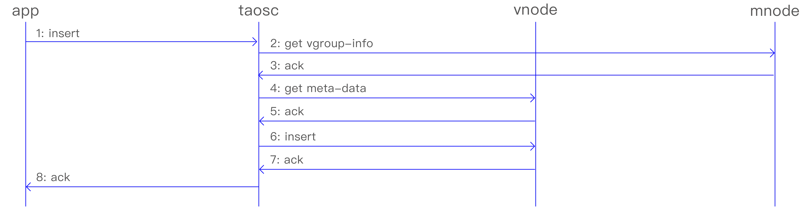

图 2 TDengine 典型的操作流程
- 第 1 步：应用通过 JDBC 或其他 API 接口发起插入数据的请求。
- 第 2 步：taosc 会检查缓存，看是否保存有该表所在数据库的 VGroup-info 信息。如果有，直接到第 4 步。如果没有，taosc 将向 mnode 发出 get VGroup-info 请求。
- 第 4 步：mnode 将该表所在数据库的 VGroup-info 返回给 taosc。VGroup-info 包含数据库的 VGroup 分布信息（vnode ID 以及所在的 dnode 的 End Point，如果副本数为 N，就有 N 组 End Point），还包含每个 VGroup 中存储数据表的 hash 范围。如果 taosc 迟迟得不到 mnode 回应，而且存在多个 mnode，taosc 将向下一个 mnode 发出请求。
- 第 4 步：taosc 会继续检查缓存，看是否保存有该表的 meta-data。如果有，直接到第 6 步。如果没有，taosc 将向 vnode 发出 get meta-data 请求。
- 第 5 步：vnode 将该表的 meta-data 返回给 taosc。Meta-data 包含有该表的 schema。
- 第 6 步：taosc 向 leader vnode 发起插入请求。
- 第 7 步：vnode 插入数据后，给 taosc 一个应答，表示插入成功。如果 taosc 迟迟得不到 vnode 的回应，taosc 会认为该节点已经离线。这种情况下，如果被插入的数据库有多个副本，taosc 将向 VGroup 里下一个 vnode 发出插入请求。
- 第 8 步：taosc 通知 APP，写入成功。
对于第二步，taosc 启动时，并不知道 mnode 的 End Point，因此会直接向配置的集群对外服务的 End Point 发起请求。如果接收到该请求的 dnode 并没有配置 mnode，该 dnode 会在回复的消息中告知 mnode EP 列表，这样 taosc 会重新向新的 mnode 的 EP 发出获取 meta-data 的请求。
对于第四和第六步，没有缓存的情况下，taosc 无法知道虚拟节点组里谁是 leader，就假设第一个 vnodeID 就是 leader，向它发出请求。如果接收到请求的 vnode 并不是 leader，它会在回复中告知谁是 leader，这样 taosc 就向建议的 leader vnode 发出请求。一旦得到插入成功的回复，taosc 会缓存 leader 节点的信息。
上述是插入数据的流程，查询、计算的流程也完全一致。taosc 把这些复杂的流程全部封装屏蔽了，对于应用来说无感知也无需任何特别处理。
通过 taosc 缓存机制，只有在第一次对一张表操作时，才需要访问 mnode，因此 mnode 不会成为系统瓶颈。但因为 schema 有可能变化，而且 VGroup 有可能发生改变（比如负载均衡发生），因此 taosc 会定时和 mnode 交互，自动更新缓存。

### 6.2 存储模型与数据分区、分片

#### 6.2.1 存储模型

TDengine 存储的数据包括采集的时序数据以及库、表相关的元数据、标签数据等，这些数据具体分为三部分：
1. 时序数据：时序数据是 TDengine 的核心存储对象，它们被存储在 vnode 中。时序数据由 data、head、sma 和 stt 4 类文件组成，这些文件共同构成了时序数据的完整存储结构。由于时序数据的特点是数据量大且查询需求取决于具体应用场景，因此 TDengine 采用了“一个数据采集点一张表”的模型来优化存储和查询性能。在这种模型下，一个时间段内的数据是连续存储的，对单张表的写入是简单的追加操作，一次读取可以获取多条记录。这种设计确保了单个数据采集点的写入和查询操作都能达到最优性能。
2. 数据表元数据：包含标签信息和 Table Schema 信息，存放于 vnode 里的 meta 文件，支持增删改查四个标准操作。数据量很大，有 N 张表，就有 N 条记录，因此采用 LRU 存储，支持标签数据的索引。TDengine 支持多核多线程并发查询。只要计算内存足够，元数据全内存存储，千万级别规模的标签数据过滤结果能毫秒级返回。在内存资源不足的情况下，仍然可以支持数千万张表的快速查询。
3. 数据库元数据：存放于 mnode 里，包含系统节点、用户、DB、STable Schema 等信息，支持增删改查四个标准操作。这部分数据的量不大，可以全内存保存，而且由于客户端有缓存，查询量也不大。因此目前的设计虽是集中式存储管理，但不会构成性能瓶颈。
与传统的 NoSQL 存储模型相比，TDengine 将标签数据与时序数据完全分离存储，它具有两大优势：
1. 显著降低标签数据存储的冗余度。在常见的 NoSQL 数据库或时序数据库中，通常采用 Key-Value 存储模型，其中 Key 包含时间戳、设备 ID 以及各种标签。这导致每条记录都携带大量重复的标签信息，从而浪费宝贵的存储空间。此外，如果应用程序需要在历史数据上增加、修改或删除标签，就必须遍历整个数据集并重新写入，这样的操作成本极高。相比之下，TDengine 通过将标签数据与时序数据分离存储，有效避免了这些问题，大大减少了存储空间的浪费，并降低了标签数据操作的成本。
2. 实现极为高效的多表之间的聚合查询。在进行多表之间的聚合查询时，TDengine 首先根据标签过滤条件找出符合条件的表，然后查找这些表对应的数据块。这种方法显著减少了需要扫描的数据集大小，从而大幅提高了查询效率。这种优化策略使得 TDengine 能够在处理大规模时序数据时保持高效的查询性能，满足各种复杂场景下的数据分析需求。

#### 6.2.2 数据分片

在进行海量数据管理时，为了实现水平扩展，通常需要采用数据分片（sharding）和数据分区（partitioning）策略。TDengine 通过 vnode 来实现数据分片，并通过按时间段划分数据文件来实现时序数据的分区。
vnode 不仅负责处理时序数据的写入、查询和计算任务，还承担着负载均衡、数据恢复以及支持异构环境的重要角色。为了实现这些目标，TDengine 将一个 dnode 根据其计算和存储资源切分为多个 vnode。这些 vnode 的管理过程对应用程序是完全透明的，由 TDengine 自动完成。
对于单个数据采集点，无论其数据量有多大，一个 vnode 都拥有足够的计算资源和存储资源来应对（例如，如果每秒生成一条 16B 的记录，一年产生的原始数据量也不到 0.5GB）。因此，TDengine 将一张表（即一个数据采集点）的所有数据都存储在一个 vnode 中，避免将同一数据采集点的数据分散到两个或多个 dnode 上。同时，一个 vnode 可以存储多个数据采集点（表）的数据，最大可容纳的表数目上限为 100 万。设计上，一个 vnode 中的所有表都属于同一个数据库。
TDengine 采用一致性哈希算法来确定每张数据表所在的 vnode。在创建数据库时，集群会立即分配指定数量的 vnode，并确定每个 vnode 负责的数据表范围。当创建一张表时，集群会根据数据表名计算出其所在的 vnode ID，并在该 vnode 上创建表。如果数据库有多个副本，TDengine 集群会创建一个 VGroup，而不是仅创建一个 vnode。集群对 vnode 的数量没有限制，仅受限于物理节点本身的计算和存储资源。
每张表的元数据（包括 schema、标签等）也存储在 vnode 中，而不是集中存储在 mnode 上。这种设计实际上是对元数据的分片，有助于高效并行地进行标签过滤操作，进一步提高查询性能。

#### 6.2.3 数据分区

除了通过 vnode 进行数据分片以外，TDengine 还采用按时间段对时序数据进行分区的策略。每个数据文件仅包含一个特定时间段的时序数据，而时间段的长度由数据库参数 duration 决定。这种按时间段分区的做法不仅简化了数据管理，还便于高效实施数据的保留策略。一旦数据文件超过了规定的天数（由数据库参数 keep 指定），系统将自动删除这些过期的数据文件。
此外，TDengine 还支持将不同时间段的数据存储在不同的路径和存储介质中。这种灵活性使得大数据的冷热管理变得简单易行，用户可以根据实际需求实现多级存储，从而优化存储成本和访问性能。
综合来看，TDengine 通过 vnode 和时间两个维度对大数据进行精细切分，实现了高效并行管理和水平扩展。这种设计不仅提高了数据处理的速度和效率，还为用户提供了灵活、可扩展的数据存储和查询解决方案，满足了不同规模和需求的场景应用。

#### 6.2.4 负载均衡与扩容

每个 dnode 都会定期向 mnode 报告其当前状态，包括硬盘空间使用情况、内存大小、CPU 利用率、网络状况以及 vnode 的数量等关键指标。这些信息对于集群的健康监控和资源调度至关重要。
关于负载均衡的触发时机，目前 TDengine 允许用户手动指定。当新的 dnode 被添加到集群中时，用户需要手动启动负载均衡流程，以确保集群在最佳状态下运行。
随着时间的推移，集群中的数据分布可能会发生变化，导致某些 vnode 成为数据热点。为了应对这种情况，TDengine 采用基于 Raft 协议的副本调整和数据拆分算法，实现了数据的动态扩容和再分配。这一过程可以在集群运行时无缝进行，不会影响数据的写入和查询服务，从而确保了系统的稳定性和可用性。

### 6.3 数据写入与复制流程

在一个具有 N 个副本的数据库中，相应的 VGroup 将包含 N 个编号相同的 vnode。在这些 vnode 中，只有一个被指定为 leader，其余的都充当 follower 的角色。这种主从架构确保了数据的一致性和可靠性。
当应用程序尝试将新记录写入集群时，只有 leader vnode 能够接受写入请求。如果 follower vnode 意外地收到写入请求，集群会立即通知 taosc 需要重新定向到 leader vnode。这一措施确保所有的写入操作都发生在正确的 leader vnode 上，从而维护数据的一致性和完整性。
通过这种设计，TDengine 确保了在分布式环境下数据的可靠性和一致性，同时提供高效的读写性能。

#### 6.3.1 Leader Vnode 写入流程

Leader Vnode 遵循下面的写入流程：
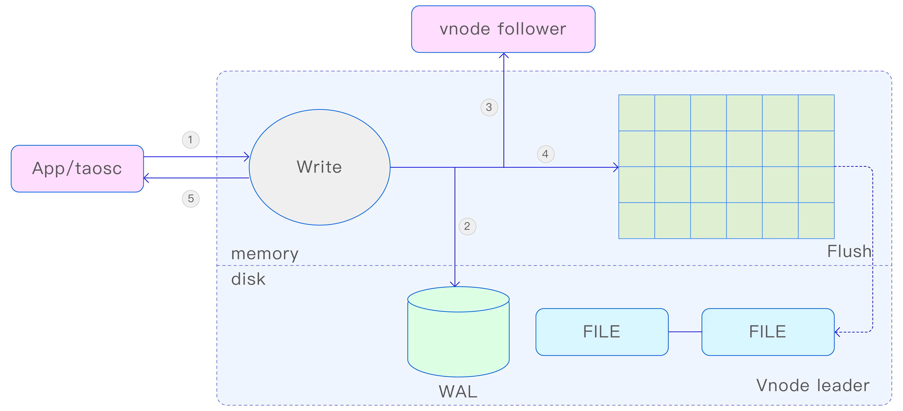

图 3 TDengine Leader 写入流程
- 第 1 步：leader vnode 收到应用的写入数据请求，验证 OK，验证有效性后进入第 2 步；
- 第 2 步：vnode 将该请求的原始数据包写入数据库日志文件 WAL。如果 wal_level 设置为 2，而且 wal_fsync_period 设置为 0，TDengine 还将 WAL 数据立即落盘，以保证即使宕机，也能从数据库日志文件中恢复数据，避免数据的丢失；
- 第 3 步：如果有多个副本，vnode 将把数据包转发给同一虚拟节点组内的 follower vnodes，该转发包带有数据的版本号（version）；
- 第 4 步：写入内存，并将记录加入到 skip list。但如果未达成一致，会触发回滚操作；
- 第 5 步：leader vnode 返回确认信息给应用，表示写入成功；
- 第 6 步：如果第 2、3、4 步中任何一步失败，将直接返回错误给应用。

#### 6.3.2 Follower Vnode 写入流程

对于 follower vnode，写入流程是：
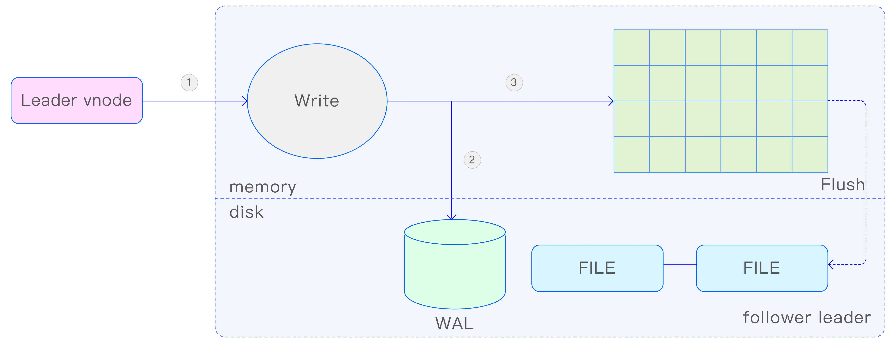

图 4 TDengine Follower 写入流程
- 第 1 步：follower vnode 收到 leader vnode 转发了的数据插入请求。
- 第 2 步：vnode 将把该请求的原始数据包写入数据库日志文件 WAL。如果 wal_level 设置为 2，而且 wal_fsync_period 设置为 0，TDengine 还将 WAL 数据立即落盘，以保证即使宕机，也能从数据库日志文件中恢复数据，避免数据的丢失。
- 第 3 步：写入内存，更新内存中的 skip list。
与 leader vnode 相比，follower vnode 不存在转发环节，也不存在回复确认环节，少了两步。但写内存与 WAL 是完全一样的。

#### 6.3.3 主从选择

每个 vnode 都维护一个数据的版本号，该版本号在 vnode 对内存中的数据进行持久化存储时也会被一并持久化。每次更新数据时，无论是时序数据还是元数据，都会使版本号递增，确保数据的每次修改都被准确记录。
当 vnode 启动时，它的角色（leader 或 follower）是不确定的，且数据处于未同步状态。为了确定自己的角色并同步数据，vnode 需要与同一 VGroup 内的其他节点建立 TCP 连接。在连接建立后，vnode 之间会互相交换版本号、任期等关键信息。基于这些信息，vnode 将使用标准的 Raft 一致性算法完成选主过程，从而确定谁是 leader，谁应该作为 follower。
这一机制确保在分布式环境下，vnode 之间能够有效地协调一致，维护数据的一致性和系统的稳定性

#### 6.3.4 同步复制

在 TDengine 中，每次 leader vnode 接收到写入数据请求并将其转发给其他副本时，它并不会立即通知应用程序写入成功。相反，leader vnode 需要等待超过半数的副本（包括自身）达成一致意见后，才会向应用程序确认写入操作已成功。如果在规定的时间内未能获得半数以上副本的确认，leader vnode 将返回错误信息给应用程序，表明写入数据操作失败。
这种同步复制的机制确保了数据在多个副本之间的一致性和安全性，但同时也带来了写入性能方面的挑战。为了平衡数据一致性和性能需求，TDengine 在同步复制过程中引入了流水线复制算法。
流水线复制算法允许不同数据库连接的写入数据请求确认过程同时进行，而不是顺序等待。这样，即使某个副本的确认延迟，也不会影响到其他副本的写入操作。通过这种方式，TDengine 在保证数据一致性的同时，显著提升了写入性能，满足了高吞吐量和低延迟的数据处理需求。

#### 6.3.5 成员变更

在数据扩容、节点迁移等场景中，需要对 VGroup 的副本数目进行调整。在这些情况下，存量数据的多少直接影响到副本之间数据复制的所需时间，过多的数据复制可能会 严重阻塞数据的读写过程。
为了解决这一问题，TDengine 对 Raft 协议进行了扩展，引入了 learner 角色。learner 角色在复制过程中起到至关重要的作用，但它们不参与投票过程，只负责接收数据的复制。由于 learner 不参与投票，因此在数据写入时，判断写入成功的条件并不包括 learner 的确认。
当 learner 与 leader 之间的数据差异较大时，learner 会采用快照（snapshot）方式进行数据同步。快照同步完成后，learner 会继续追赶 leader 的日志，直至两者数据量接近。一旦 learner 与 leader 的数据量足够接近，learner 便会转变为 follower 角色，开始参与数据写入的投票和选举投票过程。

#### 6.3.6 重定向

当 taosc 将新的记录写入 TDengine 集群时，它首先需要定位到当前的 leader vnode，因为只有 leader vnode 负责处理写入数据请求。如果 taosc 尝试将写入数据请求发送到 follower vnode，集群会立即通知 taosc 需要重新定向到正确的 leader vnode。
为了确保写入数据请求能够正确路由到 leader vnode，taosc 会维护一个关于节点组拓扑的本地缓存。当收到集群的通知后，taosc 会根据最新的节点组拓扑信息，重新计算并确定 leader vnode 的位置，然后将写入数据请求发送给它。同时，taosc 还会更新本地缓存中的 leader 分布信息，以备后续使用。
这种机制确保了应用在通过 taosc 访问 TDengine 时，无须关心网络重试的问题。无论集群中的节点如何变化，taosc 都能自动处理这些变化，确保写入数据请求始终被正确地路由到 leader vnode

### 6.4 缓存与持久化

#### 6.4.1 时序数据缓存

TDengine 采纳了一种独特的时间驱动缓存管理策略，亦称为写驱动缓存管理机制。这一策略与传统的读驱动数据缓存模式有所不同，其核心在于优先将最新写入的数据存储在集群的缓存中。当缓存容量接近阈值时，系统会将最早期的数据进行批量写入硬盘的操作。详细来讲，每个 vnode 都拥有独立的内存空间，这些内存被划分为多个固定大小的内存块，且不同 vnode 之间的内存是完全隔离的。在数据写入过程中，采用的是类似日志记录的顺序追加方式，每个 vnode 还维护有自身的 SkipList 结构，以便于数据的快速检索。一旦超过三分之一的内存块被写满，系统便会启动数据落盘的过程，并将新的写入操作引导至新的内存块。通过这种方式，vnode 中的三分之一内存块得以保留最新的数据，既实现了缓存的目的，又保证了查询的高效性。vnode 的内存大小可以通过数据库参数 buffer 进行配置。
此外，考虑到物联网数据的特点，用户通常最关注的是数据的实时性，即最新产生的数据。TDengine 很好地利用了这一特点，优先将最新到达的（即当前状态）数据存储在缓存中。具体而言，TDengine 会将最新到达的数据直接存入缓存，以便快速响应用户对最新一条或多条数据的查询和分析需求，从而在整体上提高数据库查询的响应速度。从这个角度来看，通过合理设置数据库参数，TDengine 完全可以作为数据缓存来使用，这样就无须再部署 Redis 或其他额外的缓存系统。这种做法不仅有效简化了系统架构，还有助于降低运维成本。需要注意的是，一旦 TDengine 重启，缓存中的数据将被清除，所有先前缓存的数据都会被批量写入硬盘，而不会像专业的 Key-Value 缓存系统那样自动将之前缓存的数据重新加载回缓存。

#### 6.4.2 last / last_row 缓存

在时序数据的场景中，查询表的最后一条记录（last_row）或最后一条非 NULL 记录（last）是一个常见的需求。为了提高 TDengine 对这种查询的响应速度，TSDB 为每张表的 last 和 last_row 数据提供了 LRU 缓存。LRU 缓存采用延迟加载策略，当首次查询某张表的 last 或 last_row 时，缓存模块会去内存池和磁盘文件加载数据，处理后放入 LRU 缓存，并返回给查询模块继续处理；当有新的数据插入或删除时，如果缓存需要更新，会进行相应的更新操作；如果缓存中没有当前被写入表的数据，则直接跳过，无需其它操作。
此外在缓存配置更新的时候，也会更新缓存数据。比如，缓存功能默认是关闭的，用户使用命令开启缓存功能之后，就会在首次查询时加载数据；当关闭缓存开关时，会释放之前的缓存区。当查询某一个子表的 last 或 last_row 数据时，如果缓存中没有，则从内存池和磁盘文件加载对应的 last 或 last_row 数据到缓存中；当查询某一个超级表的 last 或 last_row 数据时，这个超级表对应的所有子表都需要加载到缓存中。
通过数据库参数 cachemodel 可以配置某一个数据库的缓存参数，默认值为 none，表示不开启缓存，另外三个值为 last_row、last_value、both；分别是开启 last_row 缓存，开启 last 缓存，和两个同时开启。缓存当前所使用的内存数量，可在通过 show vgroups; 命令，在 cacheload 列中进行查看，单位为字节。

#### 6.4.3 持久化存储

TDengine 采用了一种数据驱动的策略来实现缓存数据的持久化存储。当 vnode 中的缓存数据积累到一定量时，为了避免阻塞后续数据的写入，TDengine 会启动落盘线程，将这些缓存数据写入持久化存储设备。在此过程中，TDengine 会创建新的数据库日志文件用于数据落盘，并在落盘成功后删除旧的日志文件，以防止日志文件无限制增长。
为了充分发挥时序数据的特性，TDengine 将一个 vnode 的数据分割成多个文件，每个文件仅存储固定天数的数据，这个天数由数据库参数 duration 设定。通过这种分文件存储的方式，当查询特定时间段的数据时，无须依赖索引即可迅速确定需要打开哪些数据文件，极大地提高了数据读取的效率。
对于采集的数据，通常会有一定的保留期限，该期限由数据库参数 keep 指定。超出设定天数的数据文件将被集群自动移除，并释放相应的存储空间。
当设置 duration 和 keep 两个参数后，一个处于典型工作状态的 vnode 中，总的数据文件数量应为向上取整 (keep/duration)+1 个。数据文件的总个数应保持在一个合理的范围内，不宜过多也不宜过少，通常介于 10 到 100 之间较为适宜。基于这一原则，可以合理设置 duration 参数。可以调整参数 keep，但参数 duration 一旦设定，则无法更改。
在每个数据文件中，表的数据是以块的形式存储的。一张表可能包含一到多个数据文件块。在一个文件块内，数据采用列式存储，占据连续的存储空间，这有助于显著提高读取度。文件块的大小由数据库参数 maxRows（每块最大记录条数）控制，默认值为 4096。这个值应适中，过大可能导致定位特定时间段数据的搜索时间变长，影响读取速度；过小则可能导致数据文件块的索引过大，压缩效率降低，同样影响读取速度。
每个数据文件块（以 .data 结尾）都配有一个索引文件（以 .head 结尾），该索引文件包含每张表的各个数据文件块的摘要信息，记录了每个数据文件块在数据文件中的偏移量、数据的起始时间和结束时间等信息，以便于快速定位所需数据。此外，每个数据文件块还有一个与之关联的 last 文件（以 .last 结尾），该文件旨在防止数据文件块在落盘时发生碎片化。如果某张表落盘的记录条数未达到数据库参数 minRows（每块最小记录条数）的要求，这些记录将首先存储在 last 文件中，待下次落盘时，新落盘的记录将与 last 文件中的记录合并，然后再写入数据文件块。
在数据写入硬盘的过程中，是否对数据进行压缩取决于数据库参数 comp 的设置。TDengine 提供了 3 种压缩选项—无压缩、一级压缩和二级压缩，对应的 comp 值分别为 0、1 和 2。一级压缩会根据数据类型采用相应的压缩算法，如 delta-delta 编码、simple8B 编码、zig-zag 编码、LZ4 等。二级压缩则在一级压缩的基础上进一步使用通用压缩算法，以实现更高的压缩率。

#### 6.4.4 预计算

为了显著提高查询处理的效率，TDengine 在数据文件块的头部存储了该数据文件块的统计信息，包括最大值、最小值和数据总和，这些被称为预计算单元。当查询处理涉及这些计算结果时，可以直接利用这些预计算值，而无须访问数据文件块的具体内容。对于那些硬盘 I/O 成为瓶颈的查询场景，利用预计算结果可以有效减轻读取硬盘 I/O 的压力，从而提高查询速度。
除了预计算功能以外，TDengine 还支持对原始数据进行多种降采样存储。一种降采样存储方式是 Rollup SMA，它能够自动对原始数据进行降采样存储，并支持 3 个不同的数据保存层级，用户可以指定每层数据的聚合周期和保存时长。这对于那些关注数据趋势的场景尤为适用，其核心目的是减少存储开销并提高查询速度。另一种降采样存储方式是 Time-Range-Wise SMA，它可以根据聚合结果进行降采样存储，非常适合于高频的 interval 查询场景。该功能采用与普通流计算相同的逻辑，并允许用户通过设置 watermark 来处理延时数据，相应地，实际的查询结果也会有一定的时间延迟。

#### 6.4.5 多级存储与共享存储

在默认配置下，TDengine 会将所有数据保存在 /var/lib/taos 目录下，而且每个 vnode 的数据文件保存在该目录下的不同目录。为扩大存储空间，尽量减少文件读取的瓶颈，提高数据吞吐率 TDengine 可通过配置系统参数 dataDir 让多个挂载的硬盘被系统同时使用。
除此之外，TDengine 也提供了数据分级存储的功能，将不同时间段的数据存储在挂载的不同介质上的目录里，从而实现不同“热度”的数据存储在不同的存储介质上，充分利用存储，节约成本。比如，最新采集的数据需要经常访问，对硬盘的读取性能要求高，那么用户可以配置将这些数据存储在 SSD 盘上。超过一定期限的数据，查询需求量没有那么高，那么可以存储在相对便宜的 HDD 盘上。多级存储支持 3 级，每级最多可配置 128 个挂载点。
在此基础上，TDengine 进一步推出共享存储机制，解决传统云存储（如 S3）与多副本配置叠加导致的存储冗余问题（如三副本 + S3 原生三副本造成九倍存储开销）。共享存储指同一 VGroup 内多个 vnode 共享的存储资源，由存储层实现数据冗余备份，TDengine 层面仅维护逻辑上的单副本，兼顾可靠性与成本控制。
共享存储以文件组为单位实现本地到共享存储的数据迁移，支持分次迁移与追加式迁移（仅迁移新增 / 变更数据块），并通过 manifests.json 文件保障迁移事务性 —— 主节点完成文件复制后更新该文件，避免部分迁移导致的数据不一致。迁移时，head、sma 等元数据文件与本地一一对应，data 文件拆分为独立数据块存储，平衡大文件更新效率与跨节点迁移需求。

## 7. 存储引擎

TDengine 的核心竞争力在于其卓越的写入和查询性能。相较于传统的通用型数据库，TDengine 在诞生之初便专注于深入挖掘时序数据场景的独特性。它充分利用了时序数据的时间有序性、连续性和高并发特点，自主研发了一套专为时序数据定制的写入及存储算法。
这套算法针对时序数据的特性进行了精心的预处理和压缩，不仅大幅提高了数据的写入速度，还显著降低了存储空间的占用。这种优化设计确保了在面对大量实时数据持续涌入的场景时，TDengine 仍能保持超高的吞吐能力和极快的响应速度。

### 7.1 行列格式

行列格式是 TDengine 中用来表示数据的最重要的数据结构之一。业内已经有许多开源的标准化的行列格式库，如 Apache Arrow 等。但 TDengine 面临的场景更加聚焦，且对于性能的要求也更高。因此，设计并实现自己的行列格式库有助于 TDengine 充分利用场景特点，实现高性能、低空间占用的行列格式数据结构。行列格式的需求有以下几点。
1. 支持未指定值（NONE）与空值（NULL）的区分。
2. 支持 NONE、NULL 以及有值共存的不同场景。
3. 对于稀疏数据和稠密数据的高效处理。

#### 7.1.1 行格式

TDengine 中的行格式有两种编码格式—Tuple 编码格式和 Key-Value 编码格式。具体采用哪种编码格式是由数据的特征决定的，以求最高效地处理不同数据特征的场景。
1. Tuple 编码格式
Tuple 编码格式主要用于非稀疏数据的场景，如所有列数据全部非 None 或少量 None 的场景。Tuple 编码的行直接根据表的 schema 提供的偏移量信息访问列数据，时间复杂度为 O(1)，访问速度快。如下图所示：
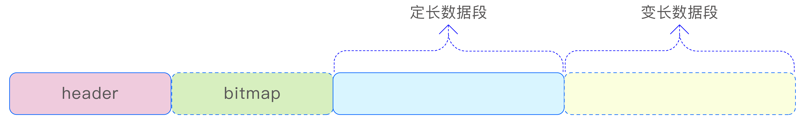

1. Key-Value 编码格式
Key-Value 编码格式特别适合于稀疏数据的场景，即在表的 schema 中定义了大量列（例如数千列），但实际有值的列却非常少的情况。在这种情形下，如果采用传统的 Tuple 编码格式，会造成极大的空间浪费。相比之下，采用 Key-Value 编码格式可以显著减少行数据所占用的存储空间。如下图所示。
Key-Value 编码的行数据通过一个 offset 数组来索引各列的值，虽然这种方式的访问速度相对于直接访问列数据较慢，但它能显著减少存储空间的占用。在实际编码实现中，通过引入 flag 选项，进一步优化了空间占用。具体来说，当所有 offset 值均小于 256 时，Key-Value 编码行的 offset 数组采用 uint8_t 类型；若所有 offset 值均小于 65536 时，则使用 uint16_t 类型；在其他情况下，则使用 uint32_t 类型。这样的设计使得空间利用率得到进一步提升。
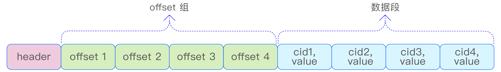

#### 7.1.2 列格式

在 TDengine 中，列格式的定长数据可以被视为数组，但由于存在 NONE、NULL 和有值的并存情况，列格式中还需要一个 bitmap 来标识各个索引位置的值是 NONE、NULL 还是有值。而对于变长类型的数据，列格式则有所不同。除了数据数组以外，变长类型的数据列格式还包含一个 offset 数组，用于索引变长数据的起始位置。变长数据的长度可以通过两个相邻 offset 值之差来获得。这种设计使得数据的存储和访问更加高效，如下图所示：
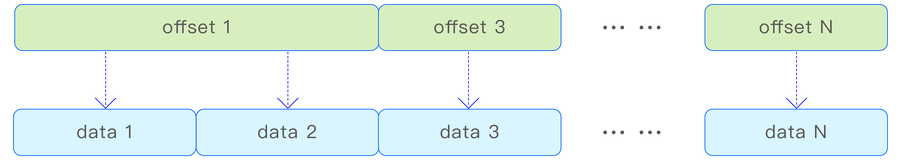

### 7.2 vnode 存储

#### 7.2.1 vnode 存储架构

vnode 是 TDengine 中数据存储、查询以及备份的基本单元。每个 vnode 中都存储了部分表的元数据信息以及属于这些表的全部时序数据。表在 vnode 上的分布是由一致性哈希决定的。每个 vnode 都可以被看作一个单机数据库。vnode 的存储可以分为如下 3 部分，如下图所示。
1. WAL 文件的存储
2. 元数据的存储
3. 时序数据的存储
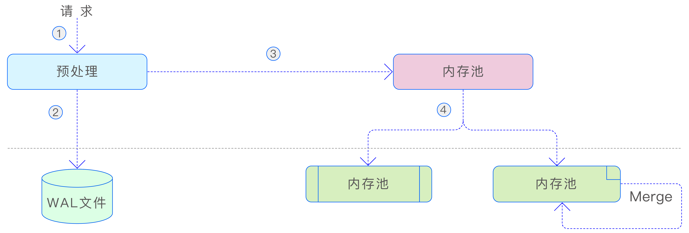

当 vnode 收到写入数据请求时，首先会对请求进行预处理，以确保多副本上的数据保持一致。预处理的目的在于确保数据的安全性和一致性。在预处理完成后，数据会被写入到 WAL 文件中，以确保数据的持久性。接着，数据会被写入 vnode 的内存池中。当内存池的空间占用达到一定阈值时，后台线程会将写入的数据刷新到硬盘上（META 和 TSDB），以便持久化。同时，标记内存中对应的 WAL 编号为已落盘。此外，TSDB 采用了 LSM（Log-Structured Merge-Tree，日志结构合并树）存储结构，这种结构在打开数据库的多表低频参数时，后台还会对 TSDB 的数据文件进行合并，以减少文件数量并提高查询性能。这种设计使得数据的存储和访问更加高效。

#### 7.2.2 元数据的存储

vnode 中存储的元数据主要涉及表的元数据信息，包括超级表的名称、超级表的 schema 定义、标签 schema 的定义、子表的名称、子表的标签信息以及标签的索引等。由于元数据的查询操作远多于写入操作，因此 TDengine 采用 B+Tree 作为元数据的存储结构。B+Tree 以其高效的查询性能和稳定的插入、删除操作，非常适合于处理这类读多 写少的场景，确保了元数据管理的效率和稳定性。元数据的写入过程如下图所示：
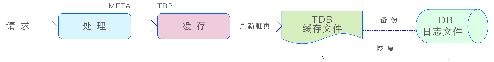

当 META 模块接收到元数据写入请求时，它会生成多个 Key-Value 数据对，并将这些数据对存储在底层的 TDB 存储引擎中。TDB 是 TDengine 根据自身需求研发的 B+Tree 存储引擎，它由 3 个主要部分组成——内置 Cache、TDB 存储主文件和 TDB 的日志文件。数据在写入 TDB 时，首先被写入内置 Cache，如果 Cache 内存不足，系统会向 vnode 的内存池请求额外的内存分配。如果写入操作涉及已有数据页的更改，系统会在修改数据页之前，先将未更改的数据页写入 TDB 的日志文件，作为备份。这样做可以在断电或其他故障发生时，通过日志文件回滚到原始数据，确保数据更新的原子性和数据完整性。
由于 vnode 存储了各种元数据信息，并且元数据的查询需求多样化，vnode 内部会创建多个 B+Tree，用于存储不同维度的索引信息。这些 B+Tree 都存储在一个共享的存储文件中，并通过一个根页编号为 1 的索引 B+Tree 来索引各个 B+Tree 的根页编号，如下图所示：
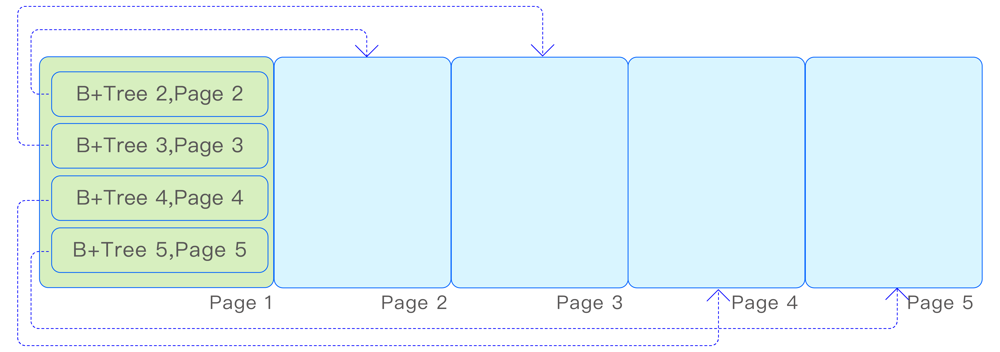

B+ Tree 的页结构如下图所示：
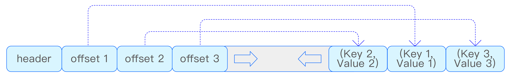

在 TDB 中，Key 和 Value 都具有变长的特性。为了处理超长 Key 或 Value 的情况，当它们超过文件页的大小时，TDB 采用了溢出页的设计来容纳超出部分的数据。此外，为了有效控制 B+Tree 的高度，TDB 限制了非溢出页中 Key 和 Value 的最大长度，确保 B+Tree 的扇出度至少为 4。

#### 7.2.3 时序数据的存储

时序数据在 vnode 中是通过 TSDB 引擎进行存储的。鉴于时序数据的海量特性及其持续的写入流量，若使用传统的 B+Tree 结构来存储，随着数据量的增长，树的高度会迅速增加，这将导致查询和写入性能的急剧下降，最终可能使引擎变得不可用。鉴于此，TDengine 选择了 LSM 存储结构来处理时序数据。LSM 通过日志结构的存储方式，优化了数据的写入性能，并通过后台合并操作来减少存储空间的占用和提高查询效率，从而确保了时序数据的存储和访问性能。TSDB 引擎的写入流程如下图所示：
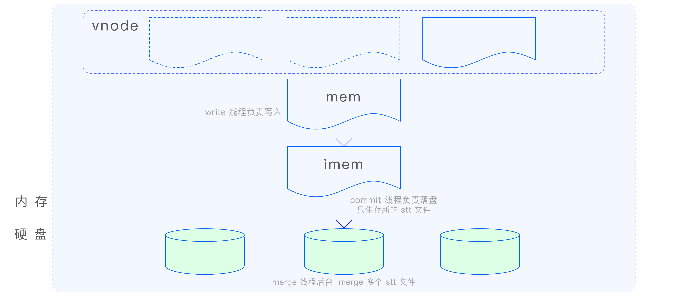

在 MemTable 中，数据采用了 Red-Black Tree（红黑树）和 SkipList 相结合的索引方式。不同表的数据索引存储在 Red-Black Tree 中，而同一张表的数据索引则存储在 SkipList 中。这种设计方式充分利用了时序数据的特点，提高了数据的存储和访问效率。
Red-Black Tree 是一种自平衡的二叉树，它通过对节点进行着色和旋转操作来保持树的平衡，从而确保了查询、插入和删除操作的时间复杂度为 O(logn)。在 MemTable 中，Red-Black Tree 用于存储不同表的数据索引。
SkipList 是一种基于有序链表的数据结构，它通过在链表的基础上添加多级索引来实现快速查找。SkipList 的查询、插入和删除操作的时间复杂度为 O(logn)，与 Red-Black Tree 相当。在 MemTable 中，SkipList 用于存储同一张表的数据索引，这样可以快速定位到特定时间范围内的数据，为时序数据的查询和写入提供高效支持。
通过将 Red-Black Tree 和 SkipList 相结合，TDengine 在 MemTable 中实现了一种高效的数据索引方式，既能够快速定位到不同表的数据，又能够快速定位到同一张表中特定时间范围内的数据。SkipList 索引如下图所示：
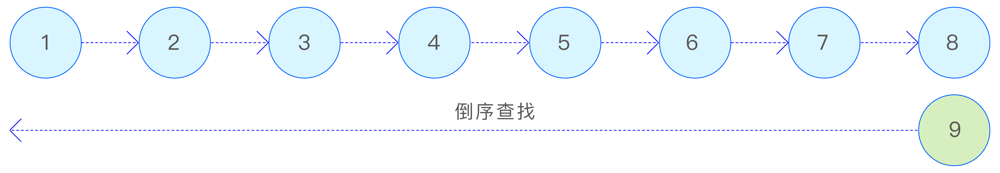

在 TSDB 引擎中，无论是在内存中还是数据文件中，数据都按照（ts, version）元组进行排序。为了更好地管理和组织这些按时间排序的数据，TSDB 引擎将数据文件按照时间范围切分为多个数据文件组。每个数据文件组覆盖一定时间范围的数据，这样可以确保数据的连续性和完整性，同时也便于对数据进行分片和分区操作。通过将数据按时间范围划分为多个文件组，TSDB 引擎可以更有效地管理和访问存储在硬盘上的数据。文件组如下图所示：


在查询数据时，根据查询数据的时间范围，可以快速计算文件组编号，从而快速定位所要查询的数据文件组。这种设计方式可以显著提高查询性能，因为它可以减少不必要的文件扫描和数据加载，直接定位到包含所需数据的文件组。接下来分别介绍数据文件组包含的文件：

##### 7.2.3.1 head 文件

head 文件是时序数据存储文件（data 文件）的 BRIN（Block Range Index，块范围索引）文件，其中存储了每个数据块的时间范围、偏移量（offset）和长度等信息。
查询引擎根据 head 文件中的信息，可以高效地过滤要查询的数据块所包含的时间范围，并获取这些数据块的位置信息。
head 文件中存储了多个 BRIN 记录块及其索引。BRIN 记录块采用列存压缩的方式，这种方式可以大大减少空间占用，同时保持较高的查询性能。BRIN 索引结构如下图所示：
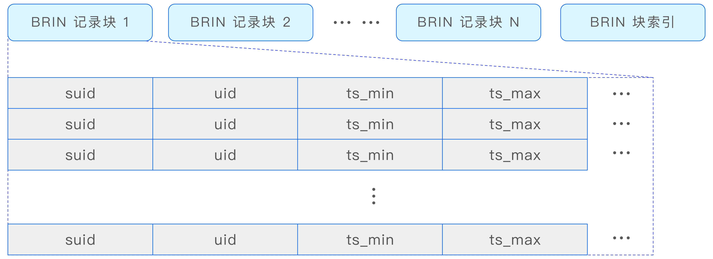

##### 7.2.3.2 data 文件

data 文件是实际存储时序数据的文件。在 data 文件中，时序数据以数据块的形式进行存储，每个数据块包含了一定量数据的列式存储。根据数据类型和压缩配置，数据块采用了不同的压缩算法进行压缩，以减少存储空间的占用并提高数据传输的效率。
与 stt 文件不同，每个数据块在 data 文件中独立存储，代表了一张表在特定时间范围内的数据。这种设计方式使得数据的管理和查询更加灵活和高效。通过将数据按块存储，并结合列式存储和压缩技术，TSDB 引擎可以更有效地处理和访问时序数据，从而满足大数据量和高速查询的需求。

##### 7.2.3.3 sma 文件

预计算文件，用于存储各个数据块中每列数据的预计算结果。这些预计算结果包括每列数据的总和（sum）、最小值（min）、最大值（max）等统计信息。通过预先计算并存储这些信息，查询引擎可以在执行某些查询时直接利用这些预计算结果，从而避免了读取原始数据的需要。

##### 7.2.3.4 tomb 文件

用于存储删除记录的文件。存储记录为（suid, uid, start_timestamp, end_timestamp, version）元组。

##### 7.2.3.5 stt 文件

在少表高频的场景下，系统仅维护一个 stt 文件。该文件专门用于存储每次数据落盘后剩余的碎片数据。这样，在下一次数据落盘时，这些碎片数据可以与内存中的新数据合并，形成较大的数据块，随后一并写入 data 文件中。这种机制有效地避免了数据文件的碎片化，确保了数据存储的连续性和高效性。
对于多表低频的场景，建议配置多个 stt 文件。这种场景下的核心思想是，尽管单张表每次落盘的数据量可能不大，但同一超级表下的所有子表累积的数据量却相当可观。通过合并这些数据，可以生成较大的数据块，从而减少数据块的碎片化。这不仅提升了数据的写入效率，还能显著提高查询性能，因为连续的数据存储更有利于快速的数据检索和访问。

## 8. 查询引擎

### 8.1 各模块在查询计算中的职责

#### 8.1.1 taosc

taosc 负责解析和执行 SQL。对于 insert 类型的 SQL，taosc 采用流式读取解析策略，以提高处理效率。而对于其他类型的 SQL，taosc 首先使用语法解析器将其分解为抽象语法树（Abstract Syntax Tree，AST），在解析过程中对 SQL 进行初步的语法校验。如果发现语法错误，taosc 会直接返回错误信息，并附上错误的具体位置，以帮助用户快速定位和修复问题。
解析完成的 AST 被进一步转换为逻辑查询计划，逻辑查询计划经过优化后进一步转换为物理查询计划。接着，taosc 的调度器将物理查询计划转换为查询执行的任务，并将任务发送到选定的 vnode 或 qnode 执行。在得到查询结果准备好的通知后，taosc 将查询结果从相应的 vnode 或 qnode 取回，最终返回给用户。
taosc 的执行过程可以简要总结为：解析 SQL 为 AST，生成逻辑查询计划并优化后转为物理查询计划，调度查询任务到 vnode 或 qnode 执行，获取查询结果。

#### 8.1.2 mnode

在 TDengine 集群中，超级表的信息和元数据库的基础信息都得到妥善管理。mnode 作为元数据服务器，负责响应 taosc 的元数据查询请求。当 taosc 需要获取 VGroup 等元数据信息时，它会向 mnode 发送请求。mnode 在收到请求后，会迅速返回所需的信息，确保 taosc 能够顺利执行其操作。
此外，mnode 还负责接收 taosc 发送的心跳信息。这些心跳信息有助于维持 taosc 与 mnode 之间的连接状态，确保两者之间的通信畅通无阻。

#### 8.1.3 vnode

在 TDengine 集群中，vnode 作为虚拟节点，扮演着关键的角色。它通过任务队列的方式接收来自物理节点分发的查询请求，并执行相应的查询处理过程。每个 vnode 都拥 有独立的任务队列，用于管理和调度查询请求。
当 vnode 收到查询请求时，它会从任务队列中取出请求，并进行处理。处理完成后，vnode 会将查询结果返回给下级物理节点中处于阻塞状态的查询队列工作线程，或者是直接返回给 taosc。

#### 8.1.4 执行器

执行器模块负责实现各种查询算子，这些算子通过调用 TSDB 的数据读取 API 来读取数据内容。数据内容以数据块的形式返回给执行器模块。TSDB 是一个时序数据库，负责从内存或硬盘中读取所需的信息，包括数据块、数据块元数据、数据块统计数据等多种类型的信息。
TSDB 屏蔽了下层存储层（硬盘和内存缓冲区）的实现细节和机制，使得执行器模块可以专注于面向列模式的数据块进行查询处理。这种设计使得执行器模块能够高效地处理各种查询请求，同时简化数据访问和管理的复杂性。

#### 8.1.5 UDF Daemon

在分布式数据库系统中，执行 UDF 的计算节点负责处理涉及 UDF 的查询请求。当查询中使用了 UDF 时，查询模块会负责调度 UDF Daemon 完成对 UDF 的计算，并获取 计算结果。
UDF Daemon 是一个独立的计算组件，负责执行用户自定义的函数。它可以处理各种类型的数据，包括时序数据、表格数据等。通过将 UDF 的计算任务分发给 UDF Daemon，查询模块能够将计算负载从主查询处理流程中分离出来，提高系统的整体性能和可扩展性。
在执行 UDF 的过程中，查询模块会与 UDF Daemon 紧密协作，确保计算任务的正确执行和结果的及时返回。

### 8.2 查询策略

为了更好地满足用户的需求，TDengine 集群提供了查询策略配置项 queryPolicy，以便用户根据自己的需求选择查询执行框架。这个配置项位于 taosc 的配置文件，每个配置项仅对单个 taosc 有效，可以在一个集群的不同 taosc 中混合使用不同的策略。
queryPolicy 的值及其含义如下。
1：表示所有查询只使用 vnode（默认值）。
2：表示混合使用 vnode/qnode（混合模式）。
3：表示查询中除了扫表功能使用 vnode 以外，其他查询计算功能只使用 qnode。
4：表示使用客户端聚合模式。
通过选择合适的查询策略，用户可以灵活地分配控制查询资源在不同节点的占用情况，从而实现存算分离、追求极致性能等目的。

### 8.3 SQL 说明

TDengine 通过采用 SQL 作为查询语言，显著降低了用户的学习成本。在遵循标准 SQL 的基础上，结合时序数据库的特点进行了一系列扩展，以更好地支持时序数据库的特色查询需求。
1. 分组功能扩展：TDengine 对标准 SQL 的分组功能进行了扩展，引入了 partition by 子句。用户可以根据自定义维度对输入数据进行切分，并在每个分组内进行任意 形式的查询运算，如常量、聚合、标量、表达式等。
2. 限制功能扩展：针对分组查询中存在输出个数限制的需求，TDengine 引入了 slimit 和 soffset 子句，用于限制分组个数。当 limit 与 partition by 子句共用时，其含义转换为分组内的输出限制，而非全局限制。
3. 标签查询支持：TDengine 扩展支持了标签查询。标签作为子表属性，可以在查询中作为子表的伪列使用。针对仅查询标签列而不关注时序数据的场景，TDengine 引入了标签关键字加速查询，避免了对时序数据的扫描。
4. 窗口查询支持：TDengine 支持多种窗口查询，包括时间窗口、状态窗口、会话窗口、事件窗口、计数窗口等。未来还将支持用户自定义的更灵活的窗口查询。
5. 关联查询扩展：除了传统的 Inner、Outer、Semi、Anti-Semi Join 以外，TDengine 还支持时序数据库中特有的 ASOF Join 和 Window Join。这些扩展使得用户可以更加方便灵活地进行所需的关联查询。

### 8.4 查询流程

完整的查询流程如下。
- 第 1 步，taosc 解析 SQL 并生成 AST。元数据管理模块（Catalog）根据需要向 vnode 或 mnode 请求查询中指定表的元数据信息。然后，根据元数据信息对其进行权限检查、语法校验和合法性校验。
- 第 2 步，完成合法性校验之后生成逻辑查询计划。依次应用全部的优化策略，扫描执行计划，进行执行计划的改写和优化。根据元数据信息中的 VGroup 数量和 qnode 数量信息，基于逻辑查询计划生成相应的物理查询计划。
- 第 3 步，客户端内的查询调度器开始进行任务调度处理。一个查询子任务会根据其数据亲缘关系或负载信息调度到某个 vnode 或 qnode 所属的 dnode 进行处理。
- 第 4 步，dnode 接收到查询任务后，识别出该查询请求指向的 vnode 或 qnode，将消息转发到 vnode 或 qnode 的查询执行队列。
- 第 5 步，vnode 或 qnode 的查询执行线程从查询队列获得任务信息，建立基础的查询执行环境，并立即执行该查询。在得到部分可获取的查询结果后，通知客户端调度器。
- 第 6 步，客户端调度器依照执行计划依次完成所有任务的调度。在用户 API 的驱动下，向最上游算子所在的查询执行节点发送数据获取请求，读取数据请求结果。
- 第 7 步，算子依据其父子关系依次从下游算子获取数据并返回。
- 第 8 步，taosc 将所有获取的查询结果返回给上层应用程序。

### 8.5 多表聚合查询流程

TDengine 为了解决实际应用中对不同数据采集点数据进行高效聚合的问题，引入了超级表的概念。超级表是一种特殊的表结构，用于代表一类具有相同数据模式的数据采集点。超级表实际上是一个包含多张表的表集合，每张表都具有相同的字段定义，但每张表都带有独特的静态标签。这些标签可以有多个，并且可以随时增加、删除和修改。
通过超级表，应用程序可以通过指定标签的过滤条件，轻松地对一个超级表下的全部或部分表进行聚合或统计操作。这种设计大大简化了应用程序的开发过程，提高了数据处理的效率和灵活性。TDengine 的多表聚合查询流程如下图所示：
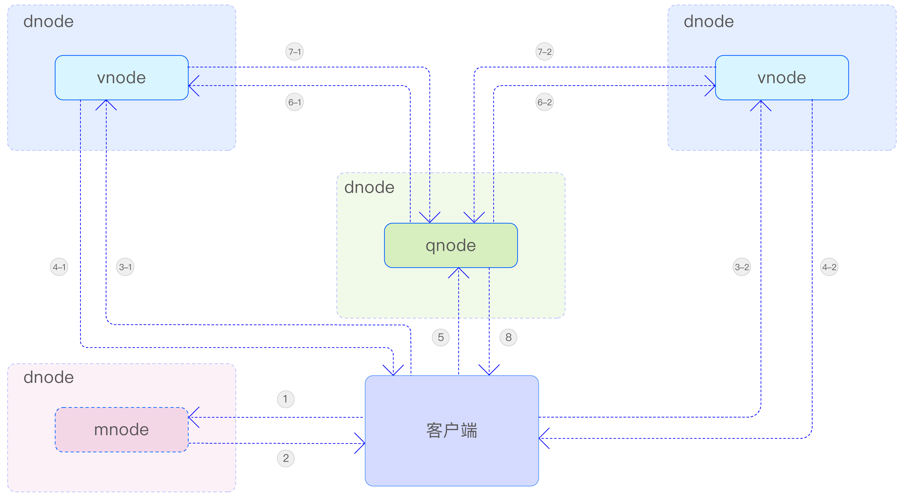

具体步骤说明如下。
- 第 1 步，taosc 从 mnode 获取库和表的元数据信息。
- 第 2 步，mnode 返回请求的元数据信息。
- 第 3 步，taosc 向超级表所属的每个 vnode 发送查询请求。
- 第 4 步，vnode 启动本地查询，在获得查询结果后返回查询响应。
- 第 5 步，taosc 向聚合节点（在本例中为 qnode）发送查询请求。
- 第 6 步，qnode 向每个 vnode 节点发送数据请求消息来拉取数据。
- 第 7 步，vnode 返回本节点的查询计算结果。
- 第 8 步，qnode 完成多节点数据聚合后将最终查询结果返回给客户端。
TDengine 为了提升聚合计算速度，在 vnode 内实现了标签数据与时序数据的分离存储。首先，系统会在内存中过滤标签数据，以确定需要参与聚合操作的表的集合。这样做可以显著减少需要扫描的数据集，从而大幅提高聚合计算的速度。
此外，得益于数据分布在多个 vnode 中，聚合计算操作可以在多个 vnode 中并发进行。这种分布式处理方式进一步提高了聚合的速度，使得 TDengine 能够更高效地处理大规模时序数据。
值得注意的是，对普通表的聚合查询以及绝大部分操作同样适用于超级表，且语法完全一致。具体请查询参考手册。

### 8.6 查询缓存

为了提升查询和计算的效率，缓存技术在其中扮演着至关重要的角色。TDengine 在查询和计算的整个过程中充分利用了缓存技术，以优化系统性能。
在 TDengine 中，缓存被广泛应用于各个阶段，包括数据存储、查询优化、执行计划生成以及数据检索等。通过缓存热点数据和计算结果，TDengine 能够显著减少对底层存储系统的访问次数，降低计算开销，从而提高整体查询和计算效率。
此外，TDengine 的缓存机制还具备智能化的特点，能够根据数据访问模式和系统负载情况动态调整缓存策略。这使得 TDengine 在面对复杂多变的查询需求时，仍能保持良好的性能表现。

#### 8.6.1 缓存的数据类型

缓存的数据类型分为如下 4 种。
1. 元数据（database、table meta、stable VGroup）
2. 连接数据（rpc session、http session）
3. 时序数据（buffer pool、multilevel storage）
4. 最新数据（last、last_row）

#### 8.6.2 缓存方案

TDengine 针对不同类型的缓存对象采用了相应的缓存管理策略。对于元数据、RPC 对象和查询对象，TDengine 采用了哈希缓存的方式进行管理。这种缓存管理方式通过一个列表来管理，列表中的每个元素都是一个缓存结构，包含了缓存信息、哈希表、垃圾回收链表、统计信息、锁和刷新频率等关键信息。
为了确保缓存的有效性和系统性能，TDengine 还通过刷新线程定时检测缓存列表中的过期数据，并将过期数据删除。这种定期清理机制有助于避免缓存中存储过多无用数据，降低系统资源消耗，同时保持缓存数据的实时性和准确性。缓存方案下图所示：
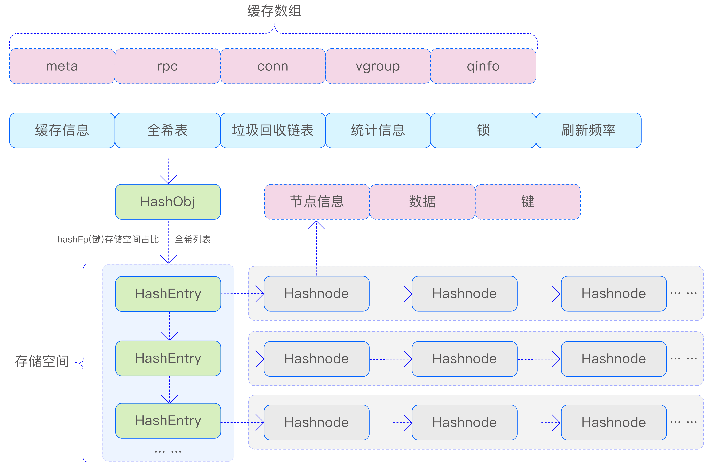

1. 元数据缓存（meta data）：包括数据库、超级表、用户、节点、视图、虚拟节点等信息，以及表的 schema 和其所在虚拟节点的映射关系。通过在 taosc 缓存元数据可以避免频繁地向 mnode / vnode 请求元数据。taosc 对元数据的缓存采用固定大小的缓存空间，先到先得，直到缓存空间用完。当缓存空间用完时，缓存会被进行部分淘汰处理，用来缓存新进请求所需要的元数据。
2. 时序数据缓存（time series data）：时序数据首先被缓存在 vnode 的内存中，以 skipList 形式组织，当达到落盘条件后，将时序数据进行压缩，写入数据存储文件中，并从缓存中清除。
3. 最新数据缓存（last / last_row）：对时序数据中的最新数据进行缓存，可以提高最新数据的查询效率。最新数据以子表为单元组织成 KV 形式，其中，K 是子表 ID，V 是该子表中每列的最后一个非 NULL 以及最新的一行数据。

## 9. 数据订阅

数据订阅作为 TDengine 的一个核心功能，为用户提供了灵活获取所需数据的能力。通过深入了解其内部原理，用户可以更加有效地利用这一功能，满足各种实时数据处理和监控需求。

### 9.1 基本概念

#### 9.1.1 主题

与 Kafka 一样，使用 TDengine 数据订阅需要定义主题。TDengine 的主题可以是数据库、超级表，或者一个查询语句。数据库订阅和超级表订阅主要用于数据迁移，可以把整个库或超级表在另一个集群还原出来。查询语句订阅是 TDengine 数据订阅的一大亮点，它提供了更大的灵活性，因为数据过滤与预处理是由 TDengine 而不是应用程序完成的，所以这种方式可以有效地减少传输数据量与应用程序的复杂度。
如下图所示，每个主题涉及的数据表分布在多个 vnode（相当于 Kafka 的 partition）上，每个 vnode 的数据保存在 WAL 文件中，WAL 文件中的数据是顺序写入的。由于 WAL 文件中存储的不只有数据，还有元数据、写入消息等，因此数据的版本号不是连续的。
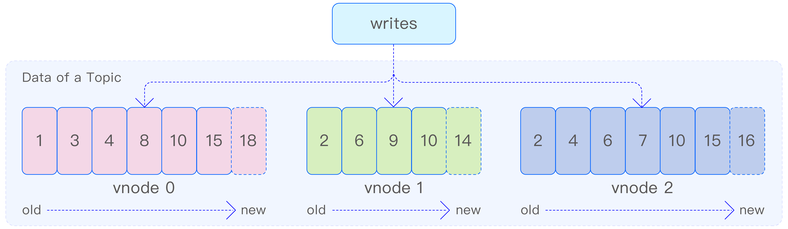

TDengine 会为 WAL 文件自动创建索引以支持快速随机访问。通过灵活可配置的文件切换与保留机制，用户可以按需指定 WAL 文件保留的时间以及大小。通过以上方式，WAL 被改造成一个保留事件到达顺序的、可持久化的存储引擎。
对于查询语句订阅，在消费时，TDengine 根据当前消费进度从 WAL 文件直接读取数据，并使用统一的查询引擎实现过滤、变换等操作，然后将数据推送给消费者。

#### 9.1.2 生产者

生产者是与订阅主题相关联的数据表的数据写入应用程序。生产者可以通过多种方式产生数据，并将数据写入数据表所在的 vnode 的 WAL 文件中。这些方式包括 SQL、Stmt、Schemaless、CSV、流计算等。

#### 9.1.3 消费者

消费者负责从主题中获取数据。在订阅主题之后，消费者可以消费分配给该消费者的 vnode 中的所有数据。为了实现高效、有序的数据获取，消费者采用了推拉（push 和 poll）相结合的方式。
当 vnode 中存在大量未被消费的数据时，消费者会按照顺序向 vnode 发送推送请求，以便一次性拉取大量数据。同时，消费者会在本地记录每个 vnode 的消费位置，确保所有数据都能被顺序地推送。
当 vnode 中没有待消费的数据时，消费者将处于等待状态。一旦 vnode 中有新数据写入，系统会立即通过推送方式将数据推送给消费者，确保数据的实时性。

#### 9.1.4 消费组

在创建消费者时，需要为其指定一个消费组。同一消费组内的消费者将共享消费进度，确保数据在消费者之间均匀分配。正如前面所述，一个主题的数据会被分布在多个 vnode 中。为了提高消费速度和实现多线程、分布式地消费数据，可以在同一消费组中添加多个消费者。这些消费者首先会均分 vnode，然后分别对分配给自己的 vnode 进行消费。例如，假设数据分布在 4 个 vnode 上：
1. 当有 2 个消费者时，每个消费者将消费 2 个 vnode；
2. 当有 3 个消费者时，其中 2 个消费者各消费 1 个 vnode，而剩下的 1 个消费者将消费剩余的 2 个 vnode；
3. 当有 5 个消费者时，其中 4 个消费者各分配 1 个 vnode，而剩下的 1 个消费者则不参与消费。
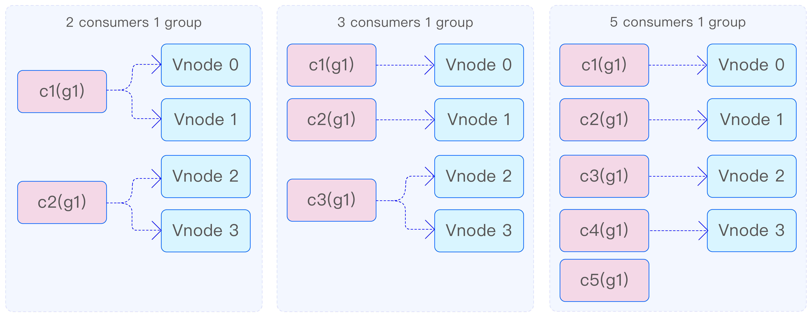

在一个消费组中新增一个消费者后，系统会通过再平衡（rebalance）机制自动完成消费者的重新分配。这一过程对用户来说是透明的，无须手动干预。再平衡机制能够确保数据在消费者之间重新分配，从而实现负载均衡。
此外，一个消费者可以订阅多个主题，以满足不同场景下的数据处理需求。TDengine 的数据订阅功能在面临宕机、重启等复杂环境时，依然能够保证至少一次消费，确保数据的完整性和可靠性。

#### 9.1.5 消费进度

消费组在 vnode 中记录消费进度，以便在消费者重启或故障恢复时能够准确地恢复消费位置。消费者在消费数据的同时，可以提交消费进度，即 vnode 上 WAL 的版本号（对应于 Kafka 中的 offset）。消费进度的提交既可以通过手动方式进行，也可以通过参数设置实现周期性自动提交。
当消费者首次消费数据时，可以通过订阅参数来确定消费位置，也就是消费最新的数据还是最旧的数据。对于同一个主题及其任意一个消费组，每个 vnode 的消费进度都是唯一的。因此，当某个 vnode 的消费者提交消费进度并退出后，该消费组中的其他消费者将继续消费这个 vnode，并从之前消费者提交的进度开始继续消费。若之前的消费者未提交消费进度，新消费者将根据订阅参数设置值来确定起始消费位置。
值得注意的是，不同消费组中的消费者即使消费同一个主题，它们之间也不会共享消费进度。这种设计确保了各个消费组之间的独立性，使得它们可以独立地处理数据，而不会相互干扰。下图清晰地展示了这一过程。


### 9.2 数据订阅架构

数据订阅系统在逻辑上可划分为客户端和服务器两大核心模块。客户端承担消费者的创建任务，获取专属于这些消费者的 vnode 列表，并从服务器检索所需数据，同时维护必要的状态信息。而服务器则专注于管理主题和消费者的相关信息，处理来自客户端的订阅请求。它通过实施再平衡机制来动态分配消费节点，确保消费过程的连续性和数据的一致性，同时跟踪和管理消费进度。数据订阅架构如下图所示：
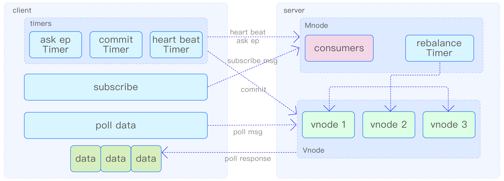

在客户端成功建立与服务器的连接之后，用户须首先指定消费组和主题，以创建相应的消费者实例。随后，客户端便会向服务器提交订阅请求。此刻，消费者的状态被标记为 rebalancing，表示正处于 rebalance 阶段。消费者随后会定期向服务器发送请求，以检索并获取待消费的 vnode 列表，直至服务器为其分配相应的 vnode。一旦分配完成，消费者的状态便更新为 ready，标志着订阅流程的成功完成。此刻，客户端便可正式启动向 vnode 发送消费数据请求的过程。
在消费数据的过程中，消费者会不断地向每个分配到的 vnode 发送请求，以尝试获取新的数据。一旦收到数据，消费者在完成消费后会继续向该 vnode 发送请求，以便持续消费。若在预设时间内未收到任何数据，消费者便会在 vnode 上注册一个消费 handle。这样一来，一旦 vnode 上有新数据产生，便会立即推送给消费者，从而确保数据消费的即时性，并有效减少消费者频繁主动拉取数据所导致的性能损耗。因此，可以看出，消费者从 vnode 获取数据的方式是一种拉取（pull）与推送（push）相结合的高效模式。
消费者在收到数据时，会同时收到数据的版本号，并将其记录为当前在每个 vnode 上的消费进度。这一进度仅在消费者内部以内存形式存储，确保仅对该消费者有效。这种设计保证了消费者在每次启动时能够从上次的消费中断处继续，避免了数据的重复处理。然而，若消费者需要退出并希望在之后恢复上次的消费进度，就必须在退出前将消费进度提交至服务器，执行所谓的 commit 操作。这一操作会将消费进度在服务器进行持久化存储，支持自动提交或手动提交两种方式。
此外，为了维持消费者的活跃状态，客户端还实施了心跳保活机制。通过定期向服务器发送心跳信号，消费者能够向服务器证明自己仍然在线。若服务器在一定时间内未收到消费者的心跳，便会认为消费者已离线。对于一定时间（可以通过参数控制）不拉取数据的 consumer，服务器也会标记为离线，并从消费组中删除该消费者。服务器依赖心跳机制来监控所有消费者的状态，进而有效地管理整个消费者群体。
mnode 主要负责处理订阅过程中的控制消息，包括创建和删除主题、订阅消息、查询 endpoint 消息以及心跳消息等。vnode 则专注于处理消费消息和 commit 消息。当 mnode 收到消费者的订阅消息时，如果该消费者尚未订阅过，其状态将被设置为 rebalancing。如果消费者已经订阅过，但订阅的主题发生变更，消费者的状态同样会被设置为 rebalancing。然后 mnode 会对 rebalancing 状态的消费者执行 rebalance 操作。心跳超过固定时间的消费者或主动关闭的消费者将被删除。
消费者会定期向 mnode 发送查询 endpoint 消息，以获取再平衡后的最新 vnode 分配结果。同时，消费者还会定期发送心跳消息，通知 mnode 自身处于活跃状态。此外，消费者的一些信息也会通过心跳消息上报至 mnode，用户可以查询 mnode 上的这些信息以监测各个消费者的状态。这种设计有助于实现对消费者的有效管理和监控。

### 9.3 消费者再平衡

每个主题的数据可能分散在多个 vnode 上。服务器通过执行 rebalance 过程，将这些 vnode 合理地分配给各个消费者，确保数据的均匀分布和高效消费。
如下图所示，c1 表示消费者 1，c2 表示消费者 2，g1 表示消费组 1。起初 g1 中只有 c1 消费数据，c1 发送订阅信息到 mnode，mnode 把数据所在的所有 4 个 vnode 分配给 c1。当 c2 增加到 g1 后，c2 将订阅信息发送给 mnode，mnode 检测到这个 g1 需要重新分配，就会启动 rebalance 过程，随后 c2 分得其中两个 vnode 消费。分配信息还会通过 mnode 发送给 vnode，同时 c1 和 c2 也会获取自己消费的 vnode 信息并开始消费。
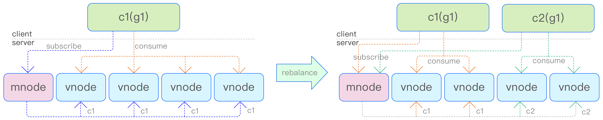

再平衡计时器每 2s 检测一次是否需要再平衡。在再平衡过程中，如果消费者获取的状态是 not ready，则不能进行消费。只有再平衡正常结束后，消费者获取分配 vnode 的 offset 后才可正常消费，否则消费者会重试指定次数后报错。

### 9.4 消费者状态处理

消费者的状态转换过程如下图所示。初始状态下，刚发起订阅的消费者处于 rebalancing 状态，表明消费者尚未准备好进行数据消费。一旦 mnode 检测到处于 rebalancing 状态的消费者，便会启动 rebalance 过程，成功后，消费者的状态将转变为 ready，表示消费者已准备就绪。随后，当消费者通过定时的查询 endpoint 消息获取自身的 ready 状态以及分配的 vnode 列表后，便能正式开始消费数据。


若消费者的心跳丢失时间超过 12s，经过 rebalance 过程，其状态将被更新为 clear，然后消费者将被系统删除。
当消费者主动退出时，会发送 unsubscribe 消息。该消息将清除消费者订阅的所有主题，并将消费者的状态设置为 rebalancing。随后，检测到处于 rebalancing 状态的消费者，便会启动 rebalance 过程，成功后，其状态将被更新为 clear，然后消费者将被系统删除。这一系列措施确保了消费者退出的有序性和系统的稳定性。

### 9.5 消费数据

时序数据都存储在 vnode 上，消费的本质就是从 vnode 上的 WAL 文件中读取数据。WAL 文件相当于一个消息队列，消费者通过记录 WAL 数据的版本号，实际上就是记录消费的进度。WAL 文件中的数据包含 data 数据和 meta 数据（如建表、改表操作），订阅根据主题的类型和参数获取相应的数据。如果订阅涉及带有过滤条件的查询，订阅逻辑会通过通用的查询引擎过滤不符合条件的数据。
如下图所示，vnode 可以通过设置参数自动提交消费进度，也可以在客户端确定处理数据后手动提交消费进度。如果消费进度被存储在 vnode 中，那么在相同消费组的不同消费者发生更换时，仍然会继续之前的进度消费。否则，根据配置参数，消费者可以选择消费最旧的数据或最新的数据。
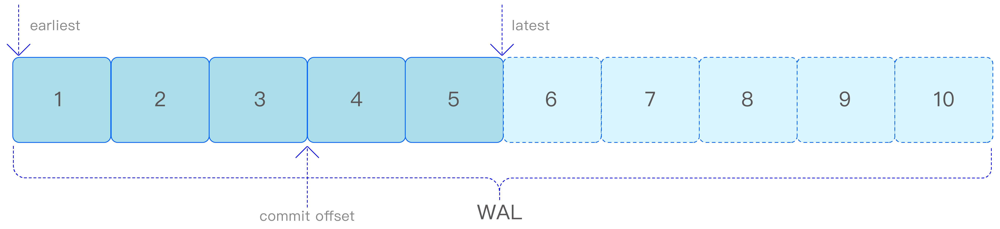

earliest 参数表示消费者从 WAL 文件中最旧的数据开始消费，而 latest 参数表示从 WAL 文件中最新的数据（即新写入的数据）开始消费。这两个参数仅在消费者首次消费数据时或者没有提交消费进度时生效。如果在消费过程中提交了消费进度，例如在消费到 WAL 文件中的第 3 条数据时提交一次进度（即 commit offset=3），那么下次在相同的 vnode 上，相同的消费组和主题的新消费者将从第 4 条数据开始消费。这种设计确保了消费者能够根据需求灵活地选择消费数据的起始位置，同时保持了消费进度的持久化和消费者之间的同步。

## 10. 流计算

### 10.1 流计算架构

TDengine 流计算的架构如下图所示。当用户输入用于创建流的 SQL 后，首先，该 SQL 将在客户端进行解析，并生成流计算执行所需的逻辑执行计划及其相关属性信息。其次，客户端将这些信息发送至 mnode。mnode 利用来自数据源（超级）表所在数据库的 VGroups 信息，将逻辑执行计划动态转换为物理执行计划，并进一步生成流任务的有向无环图（Directed Acyclic Graph，DAG）。最后，mnode 启动分布式事务，将任务分发至每个 VGroup，从而启动整个流计算流程。
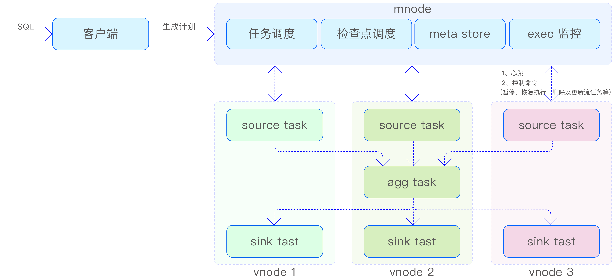

mnode 包含与流计算相关的如下 4 个逻辑模块。
1. 任务调度，负责将逻辑执行计划转化为物理执行计划，并下发到每个 vnode。
2. meta store，负责存储流计算任务的元数据信息以及流任务相应的 DAG 信息。
3. 检查点调度，负责定期生成检查点（checkpoint）事务，并下发到各 source task（源任务）。
4. exec 监控，负责接收上报的心跳、更新 mnode 中各任务的执行状态，以及定期监控检查点执行状态和 DAG 变动信息。
此外，mnode 还承担着向流计算任务下发控制命令的重要角色，这些命令包括但不限于暂停、恢复执行、删除流任务及更新流任务的上下游信息等。
在每个 vnode 上，至少部署两个流任务：一个是 source task，它负责从 WAL（在必要时也会从 TSDB）中读取数据，以供后续任务处理，并将处理结果分发给下游任务；另一个是 sink task（写回任务），它的职责是将收到的数据写入所在的 vnode。为了确保数据流的稳定性和系统的可扩展性，每个 sink task 都配备了流量控制功能，以便根据实际情况调整数据写入速度。

### 10.2 基本概念

#### 10.2.1 有状态的流计算

流计算引擎具备强大的标量函数计算能力，它处理的数据在时间序列上相互独立，无须保留计算的中间状态。这意味着，对于所有输入数据，引擎可以执行固定的变换操 作，如简单的数值加法，并直接输出结果。
同时，流计算引擎也支持对数据进行聚合计算，这类计算需要在执行过程中维护中间状态。以统计设备的日运行时间为例，由于统计周期可能跨越多天，应用程序必须持续追踪并更新当前的运行状态，直至统计周期结束，才能得出准确的结果。这正是有状态的流计算的一个典型应用场景，它要求引擎在执行过程中保持对中间状态的跟踪和管理，以确保最终结果的准确性。

#### 10.2.2 预写日志

当数据写入 TDengine 时，首先会被存储在 WAL 文件中。每个 vnode 都拥有自己的 WAL 文件，并按照时序数据到达的顺序进行保存。由于 WAL 文件保留了数据到达的顺序，因此它成为流计算的重要数据来源。此外，WAL 文件具有自己的数据保留策略，通过数据库的参数进行控制，超过保留时长的数据将会被从 WAL 文件中清除。这种设计确保了数据的完整性和系统的可靠性，同时为流计算提供了稳定的数据来源。

#### 10.2.3 事件驱动

事件在系统中指的是状态的变化或转换。在流计算架构中，触发流计算流程的事件是（超级）表数据的写入消息。在这一阶段，数据可能尚未完全写入 TSDB，而是在多个副本之间进行协商并最终达成一致。
流计算采用事件驱动的模式执行，其数据源并非直接来自 TSDB，而是 WAL。数据一旦写入 WAL 文件，就会被提取出来并加入待处理的队列中，等待流计算任务的进一步处理。这种数据写入后立即触发流计算引擎执行的方式，确保数据一旦到达就能得到及时处理，并能够在最短时间内将处理结果存储到目标表中。

#### 10.2.4 时间

在流计算领域，时间是一个至关重要的概念。TDengine 的流计算中涉及 3 个关键的时间概念，分别是事件时间、写入时间和处理时间。
1. 事件时间（Event Time）：这是时序数据中每条记录的主时间戳（也称为 Primary Timestamp），通常由生成数据的传感器或上报数据的网关提供，用以精确标记记录的生成时刻。事件时间是流计算结果更新和推送策略的决定性因素。
2. 写入时间（Ingestion Time）：指的是记录被写入数据库的时刻。写入时间与事件时间通常是独立的，一般情况下，写入时间晚于或等于事件时间（除非出于特定目的，用户写入了未来时刻的数据）。
3. 处理时间（Processing Time）：这是流计算引擎开始处理写入 WAL 文件中数据的时间点。对于那些设置了 max_delay 选项以控制流计算结果返回策略的场景，处理时间直接决定了结果返回的时间。值得注意的是，在 at_once 和 window_close 这两种计算触发模式下，数据一旦到达 WAL 文件，就会立即被写入 source task 的输入队列并开始计算。
这些时间概念的区分确保了流计算能够准确地处理时间序列数据，并根据不同时间点的特性采取相应的处理策略

#### 10.2.5 时间窗口聚合

TDengine 的流计算功能允许根据记录的事件时间将数据划分到不同的时间窗口中。通过应用指定的聚合函数，计算出每个时间窗口内的聚合结果。当窗口中有新的记录到达时，系统会触发对应窗口的聚合结果更新，并根据预先设定的推送策略，将更新后的结果传递给下游流计算任务。
当聚合结果需要写入预设的超级表时，系统首先会根据分组规则生成相应的子表名称，然后将结果写入对应的子表中。值得一提的是，流计算中的时间窗口划分策略与批量查询中的窗口生成与划分策略保持一致，确保了数据处理的一致性和效率。

#### 10.2.6 乱序处理

在网络传输和数据路由等复杂因素的影响下，写入数据库的数据可能无法维持事件时间的单调递增特性。这种现象，即在写入过程中出现的非单调递增数据，被称为乱序写入。
乱序写入是否会影响相应时间窗口的流计算结果，取决于创建流计算任务时设置的 watermark（水位线）参数以及是否忽略 ignore expired（过期数据）参数的配置。这两个参数共同作用于确定是丢弃这些乱序数据，还是将其纳入并增量更新所属时间窗口的计算结果。通过这种方式，系统能够在保持流计算结果准确性的同时，灵活处理乱序数据，确保数据的完整性和一致性。

### 10.3 流计算任务

每个激活的流计算实例都是由分布在不同 vnode 上的多个流任务组成的。这些流任务在整体架构上呈现出相似性，均包含一个全内存驻留的输入队列和输出队列，用于执行时序数据的执行器系统，以及用于存储本地状态的存储系统，如下图所示。这种设计确保了流计算任务的高性能和低延迟，同时提供了良好的可扩展性和容错性。


按照流任务承担任务的不同，可将其划分为 3 个类别：source task（源任务）、agg task（聚合任务）和 sink task（写回任务）。

#### 10.3.1 source task

流计算的数据处理始于本地 WAL 文件中的数据读取，这些数据随后在本地节点上进行局部计算。source task 遵循数据到达的自然顺序，依次扫描 WAL 文件，并从中筛选出符合特定要求的数据。随后，source task 对这些时序数据进行顺序处理。因此，流计算的数据源（超级）表无论分布在多少个 vnode 上，集群中都会相应地部署同等数量的源任务。这种分布式的处理方式确保了数据的并行处理和高效利用集群资源。

#### 10.3.2 agg task

source task 的下游任务是接收源任务聚合后的结果，并对这些结果进行进一步的汇总以生成最终输出。在集群中配置 snode 的情况下，agg task 会被优先安排在 snode 上执行，以利用其存储和处理能力。如果集群中没有 snode，mnode 则会随机选择一个 vnode，在该 vnode 上调度执行 agg task。值得注意的是，agg task 并非在所有情况下都是必需的。对于那些不涉及窗口聚合的流计算场景（例如，仅包含标量运算的流计算，或者在数据库只有一个 vnode 时的聚合流计算），就不会出现 agg task。在这种情况下，流计算的拓扑结构将简化为仅包含两级流计算任务，即 source task 和直接输出结果的下游任务。

#### 10.3.3 sink task

sink task 承担着接收 agg task 或 source task 输出结果的重任，并将其妥善写入本地 vnode，以此完成数据的写回过程。与 source task 类似，每个结果（超级）表所分布的 vnode 都将配备一个专门的 sink task。用户可以通过配置参数来调节 sink task 的吞吐量，以满足不同的性能需求。
上述 3 类任务在流计算架构中各司其职，分布在不同的层级。显然，source task 的数量直接取决于 vnode 的数量，每个 source task 独立负责处理各自 vnode 中的数据，与其他 source task 互不干扰，不存在顺序性的约束。然而，值得指出的是，如果最终的流计算结果汇聚到一张表中，那么在该表所在的 vnode 上只会部署一个 sink task。这 3 种类型的任务之间的协作关系如下图所示，共同构成了流计算任务的完整执行流程。
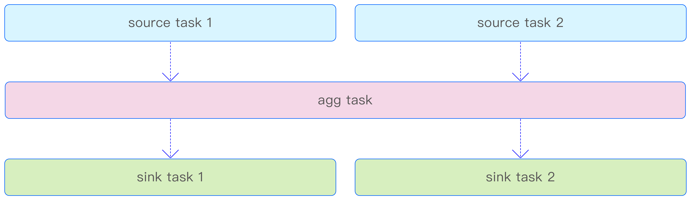

### 10.4 流计算节点

snode 是一个专为流计算服务的独立 taosd 进程，它专门用于部署 agg task。snode 不仅具备本地状态管理能力，还内置了远程备份数据的功能。这使得 snode 能够收集并存储分散在各个 VGroup 中的检查点数据，并在需要时，将这些数据远程下载到重新启动流计算的节点上，从而确保流计算状态的一致性和数据的完整性。

### 10.5 状态与容错处理

#### 10.5.1 检查点

在流计算过程中，系统采用分布式检查点机制来定期（默认为每 3min）保存计算过程中各个任务内部算子的状态。这些状态的快照即检查点（checkpoint）。生成检查点的操作仅与处理时间相关联，与事件时间无关。
在假定所有流任务均正常运行的前提下，mnode 会定期发起生成检查点的事务，并将这些事务分发至每个流的最顶层任务。负责处理这些事务的消息随后会进入数据处理队列。
TDengine 中的检查点生成方式与业界主流的流计算引擎保持一致，每次生成的检查点都包含完整的算子状态信息。对于每个任务，检查点数据仅在任务运行的节点上保留一份副本，与时序数据存储引擎的副本设置完全独立。值得注意的是，流任务的元数据信息也采用了多副本保存机制，并被纳入时序数据存储引擎的管理范畴。因此，在多副本集群上执行流计算任务时，其元数据信息也将实现多副本冗余。
为确保检查点数据的可靠性，TDengine 流计算引擎提供了远程备份检查点数据的功能，支持将检查点数据异步上传至远程存储系统。这样一来，即便本地保留的检查点数据受损，也能从远程存储系统下载相应数据，并在全新的节点上重启流计算，继续执行计算任务。这一措施进一步增强了流计算系统的容错能力和数据安全性。

#### 10.5.2 状态存储后端

流任务中算子的计算状态信息以文件的方式持久化存储在本地硬盘中。

### 10.6 内存管理

每个非 sink task 都配备有相应的输入队列和输出队列，而 sink task 则只有输入队列，不设输出队列。这两种队列的数据容量上限均设定为 60MB，它们根据实际需求动态占用存储空间，当队列为空时，不会占用任何存储空间。此外，agg task 在内部保存计算状态时也会消耗一定的内存空间。这一内存占用可以通过设置参数 streamBufferSize 进行调整，该参数用于控制内存中窗口状态缓存的大小，默认值为 128MB。而参数 maxStreamBackendCache 用于限制后端存储在内存中的最大占用存储空间，默认同样为 128MB，用户可以根据需要将其调整为 16MB 至 1024MB 之间的任意值。

### 10.7 流量控制

流计算引擎在 sink task 中实现了流量控制机制，以优化数据写入性能并防止资源过度消耗。该机制主要通过以下两个指标来控制流量。
1. 每秒写入操作调用次数：sink task 负责将处理结果写入其所属的 vnode。该指标的上限被固定为每秒 50 次，以确保写入操作的稳定性和系统资源的合理分配。
2. 每秒写入数据吞吐量：通过配置参数 streamSinkDataRate，用户可以控制每秒写入的数据量，该参数的可调范围是 0.1MB/s 至 5MB/s，默认值为 2MB/s。这意味着对于单个 vnode，每个 sink task 每秒最多可以写入 2MB 的数据。
sink task 的流量控制机制不仅能够防止在多副本场景下因高频率写入导致的同步协商缓冲区溢出，还能避免写入队列中数据堆积过多而消耗大量内存空间。这样做可以有效减少输入队列的内存占用。得益于整体计算框架中应用的反压机制，sink task 能够将流量控制的效果直接反馈给最上层的任务，从而降低流计算任务对设备计算资源的占用，避免过度消耗资源，确保系统整体的稳定性和效率。

### 10.8 反压机制

TDengine 的流计算框架部署在多个计算节点上，为了协调这些节点上的任务执行进度并防止上游任务的数据持续涌入导致下游任务过载，系统在任务内部以及上下游任务之间均实施了反压机制。
在任务内部，反压机制通过监控输出队列的满载情况来实现。一旦任务的输出队列达到存储上限，当前计算任务便会进入等待状态，暂停处理新数据，直至输出队列有足够空间容纳新的计算结果，然后恢复数据处理流程。
而在上下游任务之间，反压机制则是通过消息传递来触发的。当下游任务的输入队列达到存储上限时（即流入下游的数据量持续超过下游任务的最大处理能力），上游任务将接收到下游任务发出的输入队列满载信号。此时，上游任务将适时暂停其计算处理，直到下游任务处理完毕并允许数据继续分发，上游任务才会重新开始计算。这种机制有效地平衡了任务间的数据流动，确保整个流计算系统的稳定性和高效性。

## 11. 数据缓存

在现代物联网（IoT）和工业互联网（IIoT）应用中，数据的高效管理对系统性能和用户体验至关重要。为了应对高并发环境下的实时读写需求，TDengine 设计了一套完整的缓存机制，包括写缓存、读缓存、元数据缓存和文件系统缓存。这些缓存机制紧密结合，既能优化数据查询的响应速度，又能提高数据写入的效率，同时保障数据的可靠性和系统的高可用性。通过灵活配置缓存参数，TDengine 为用户提供了性能与成本之间的最佳平衡。

### 11.1 写缓存

TDengine 采用了一种创新的时间驱动缓存管理策略，亦称为写驱动的缓存管理机制。这一策略与传统的读驱动的缓存模式有所不同，其核心思想是将最新写入的数据优先保存在缓存中。当缓存容量达到预设的临界值时，系统会将最早存储的数据批量写入硬盘，从而实现缓存与硬盘之间的动态平衡。
在物联网数据应用中，用户往往最关注最近产生的数据，即设备的当前状态。TDengine 充分利用了这一业务特性，将最近到达的当前状态数据优先存储在缓存中，以便用户能够快速获取所需信息。
为了实现数据的分布式存储和高可用性，TDengine 引入了虚拟节点（vnode）的概念。每个 vnode 可以拥有多达 3 个副本，这些副本共同组成一个 vnode group，简称 VGroup。在创建数据库时，用户需要确定每个 vnode 的写入缓存大小，以确保数据的合理分配和高效存储。
创建数据库时的两个关键参数 `VGroups` 和 `buffer` 分别决定了数据库中的数据由多少个 VGroup 进行处理，以及为每个 vnode 分配多少写入缓存。通过合理配置这两个 参数，用户可以根据实际需求调整数据库的性能和存储容量，从而实现最佳的性能和成本效益。
例 如，下面的 SQL 创建了包含 10 个 VGroup，每个 vnode 占 用 256MB 内存的数据库。
```sql
CREATE DATABASE POWER VGroupS 10 BUFFER 256 CACHEMODEL 'NONE' PAGES 128 PAGESIZE 16;
```

缓存越大越好，但超过一定阈值后再增加缓存对写入性能提升并无帮助。

### 11.2 读缓存

TDengine 的读缓存机制专为高频实时查询场景设计，尤其适用于物联网和工业互联网等需要实时掌握设备状态的业务场景。在这些场景中，用户往往最关心最新的数据，如设备的当前读数或状态。
通过设置 cachemodel 参数，TDengine 用户可以灵活选择适合的缓存模式，包括缓存最新一行数据、每列最近的非 NULL 值，或同时缓存行和列的数据。这种灵活性使 TDengine 能根据具体业务需求提供精准优化，在物联网场景下尤为突出，助力用户快速访问设备的最新状态。
这种设计不仅降低了查询的响应延迟，还能有效缓解存储系统的 I/O 压力。在高并发场景下，读缓存能够帮助系统维持更高的吞吐量，确保查询性能的稳定性。借助 TDengine 读缓存，用户无需再集成如 Redis 一类的外部缓存系统，避免了系统架构的复杂化，显著降低运维和部署成本。
此外，TDengine 的读缓存机制还能够根据实际业务场景灵活调整。在数据访问热点集中在最新记录的场景中，这种内置缓存能够显著提高用户体验，让关键数据的获取更加快速高效。相比传统缓存方案，这种无缝集成的缓存策略不仅简化了开发流程，还为用户提供了更高的性能保障。

### 11.3 元数据缓存

为了提升查询和写入操作的效率，每个 vnode 都配备了缓存机制，用于存储其曾经获取过的元数据。这一元数据缓存的大小由创建数据库时的两个参数 pages 和 pagesize 共同决定。其中，pagesize 参数的单位是 KB，用于指定每个缓存页的大小。如下 SQL 会为数据库 power 的每个 vnode 创建 128 个 page、每个 page 16KB 的元数据缓存
```sql
CREATE DATABASE POWER PAGES 128 PAGESIZE 16;
```

### 11.4 文件系统缓存

TDengine 采用 WAL 技术作为基本的数据可靠性保障手段。WAL 是一种先进的数据保护机制，旨在确保在发生故障时能够迅速恢复数据。其核心原理在于，在数据实际写入数据存储层之前，先将其变更记录到一个日志文件中。这样一来，即便集群遭遇崩溃或其他故障，也能确保数据安全无损。
TDengine 利用这些日志文件实现故障前的状态恢复。在写入 WAL 的过程中，数据是以顺序追加的方式写入硬盘文件的。因此，文件系统缓存在此过程中发挥着关键作用，对写入性能产生显著影响。为了确保数据真正落盘，系统会调用 fsync 函数，该函数负责将文件系统缓存中的数据强制写入硬盘。
数据库参数 wal_level 和 wal_fsync_period 共同决定了 WAL 的保存行为。。
- wal_level：此参数控制 WAL 的保存级别。级别 1 表示仅将数据写入 WAL，但不立即执行 fsync 函数；级别 2 则表示在写入 WAL 的同时执行 fsync 函数。默认情况下，wal_level 设为 1。虽然执行 fsync 函数可以提高数据的持久性，但相应地也会降低写入性能。
- wal_fsync_period：当 wal_level 设置为 2 时，这个参数控制执行 fsync 的频率。设置为 0 则表示每次写入后立即执行 fsync，这可以确保数据的安全性，但可能会牺牲一些性能。当设置为大于 0 的数值时，则表示 fsync 周期，默认为 3000，范围是[1， 180000]，单位毫秒。
```sql
CREATE DATABASE POWER WAL_LEVEL 2 WAL_FSYNC_PERIOD 3000;
```

在创建数据库时，用户可以根据需求选择不同的参数设置，以在性能和可靠性之间找到最佳平衡：
1. 性能优先：将数据写入 WAL，但不立即执行 fsync 操作，此时新写入的数据仅保存在文件系统缓存中，尚未同步到磁盘。这种配置能够显著提高写入性能。
2. 可靠性优先：将数据写入 WAL 的同时执行 fsync 操作，将数据立即同步到磁盘，确保数据持久化，可靠性更高。

## 12. 数据安全

TDengine 从身份鉴别、访问控制、存储安全、传输安全、安全函数、安全审计及加密算法等维度，保障数据库全生命周期的安全可靠，这也是企业版与社区版的最大差异。

### 12.1 身份鉴别

身份鉴别是 TDengine 数据库安全的第一道防线，核心目标是确保用户身份唯一可追溯，通过多层次认证措施抵御未授权访问，实现身份安全的闭环管理。建立“唯一身份+强认证+动态管控”的身份安全机制，具体包括：推行强口令策略、实现登录失败锁定、建立密码生命周期管理机制，以及支持多因素组合认证，从源头降低身份冒用风险。关键机制如下
1. 强口令管控：口令长度 ≥ 8 位，需包含大小写字母、数字及特殊字符中至少三类，默认强制启用该策略。通过散列（如 SHA-256）与加盐（随机盐值 ≥ 16 字节）机制处理口令，仅存储散列值，避免明文泄露。
2. 账户动态管控：连续登录失败达到阈值则自动锁定账户，锁定时长可配置；长期未活动账户（默认 90 天）自动冻结，降低闲置账户风险。
3. 多因素认证（MFA）：支持“密码+TOTP 动态令牌”认证，管理员可通过配置参数灵活设定认证强度。TOTP 密钥由安全随机数生成，仅系统管理员可管理，提升认证可信度。
4. 精细化访问约束：支持按主机（IP / 网段）、时间段限制用户登录，例如禁止非办公时段或外部网段的访问请求，实现访问场景的精准管控。

### 12.2 访问控制

访问控制基于“最小权限原则”，通过角色化管理与细粒度权限分配，实现“谁能访问、能访问什么、能做什么操作”的精准管控，避免权限滥用与数据泄露。构建“角色承载权限、用户关联角色”的 RBAC（基于角色的访问控制）体系，支持表级、列级甚至行级的权限细分，实现权限的可管、可审、可追溯，同时分离操作系统与数据库的特权权限。
1. **核心角色定义**：预设系统管理员、安全管理员、审计员三类角色，分别承担系统配置、安全策略管理、审计分析职责，实现权限分工制衡。
2. **细粒度权限覆盖**：权限范围涵盖库、表、列、行等层级，操作类型细化为创建、修改、删除、读写等具体动作。例如，可授予某用户“仅读取指定表的部分敏感列”权限，实现数据访问的最小化。
3. **权限全生命周期管理**：支持角色的创建、禁用、删除及权限的授予与回收，系统记录权限变更日志；建议每季度执行全量权限审计，及时清理冗余权限。

### 12.3 存储安全

存储安全聚焦数据在磁盘存储阶段的完整性与保密性，通过加密存储、数据隔离、备份恢复等机制，防止数据被非法篡改或窃取。确保存储数据“加密存储、隔离存放、可恢复”，即使物理存储介质泄露，也能避免数据明文暴露；同时通过数据隔离机制，防止不同用户的数据相互越权访问。
1. **数据加密存储**：支持数据库级、表级加密，用户可配置专属加密密钥（SM4 等算法），密钥生成后不可更改，确保历史加密数据的可解密性。系统表与用户数据物理隔离，限制 Root 用户访问私有数据。
2. **密钥管理**：支持密钥配置方式，密钥与节点机器码绑定，机器码变更将导致密钥解析失败，节点无法启动。集群节点密钥需一致，新节点需离线配置相同密钥方可加入。
3. **存储介质保护**： WAL 文件支持索引优化与自动清理，通过权限控制确保仅数据库服务可访问；敏感数据备份时需加密处理，备份文件存储位置与访问权限严格管控。
4. **数据防篡改**：通过校验和机制验证数据完整性，若存储数据被非法篡改，系统可及时检测并触发告警，保障数据可信。

### 12.4 传输安全

传输安全针对客户端与服务器、节点与节点之间的数据传输过程，通过加密通信与身份校验，防止数据在传输中被窃听、篡改或中间人攻击。实现“链路加密+身份校验+安全认证”的传输安全闭环，确保所有传输数据均经过加密处理，且通信双方身份可验证，避免非法节点接入。
1. 强制加密通信：客户端与服务器通信默认启用 TLS 1.2 及以上版本加密，支持国密算法（如 SM2 / SM3），加密套件可根据安全需求配置。
2. 双重身份校验：传输过程中不仅验证用户身份，还通过节点证书校验服务器 / 节点合法性；口令等敏感信息在 TLS 基础上，通过 SASL 机制进一步加密传输，强化抗攻击能力。
3. 连接动态管控：支持会话超时控制（默认 8 小时持续连接、30 分钟空闲连接），通过心跳机制实时检测连接状态，异常连接自动断开并清理资源。

### 12.5 安全函数与加密算法

安全函数与加密算法是数据库安全的基础组件，为身份认证、数据加密、权限校验等场景提供标准化的安全能力，确保安全机制的可靠性与合规性。
系统内置加解密、哈希运算、密钥管理等安全函数，支持用户通过 SQL 调用实现数据安全处理。例如：SM4 加密函数可对敏感字段（如手机号、身份证号）进行加密存储，解密时需验证用户权限与密钥合法性；哈希函数支持 SHA-256、SM3 等算法，用于数据完整性校验。
算法选择兼顾安全性与性能，核心场景推荐算法如下：身份认证采用 SHA-256 / SM3；数据传输采用 TLS 1.2+（支持 SM4 对称加密、SM2 非对称加密）；数据存储采用 SM4 / AES-256；TOTP 令牌生成遵循 RFC 6238 标准，确保算法合规与互兼容性。

### 12.6 安全审计

安全审计是事后追溯与安全合规的核心手段，通过记录所有敏感操作与安全事件，形成完整的审计日志，为安全分析、故障排查与合规检查提供依据。确保“所有敏感操作可记录、操作行为可追溯、安全事件可分析”，审计日志需满足不可篡改、可留存的要求，支撑等保合规与安全责任认定。
1. 审计范围全覆盖：记录用户管理（创建 / 删除用户）、权限变更（授予 / 回收权限）、敏感操作（密码修改、密钥管理）、数据操作（批量删除 / 修改）及系统配置变更等行为，日志包含操作人、时间、IP、操作内容、结果等关键信息。
2. 日志安全存储：审计日志独立存储于专用数据库，支持异地备份，日志写入后不可修改或删除，留存时间可根据合规要求配置（默认不少于6个月）。
3. 审计分析能力：支持按用户、操作类型、时间等维度查询审计日志，提供异常操作（如多次权限变更、批量数据删除）的告警能力，辅助管理员快速定位安全风险。
4. 性能与使用场景：审计功能不影响数据库启动、数据插入及查询性能。支持批量记录创建超级表操作的审计信息，按固定时间间隔定时发送，适配大量超级表创建场景。

### 12.7 可靠性保障

可靠性是 TDengine 数据库的核心特性之一，通过分布式一致性协议、多副本机制，实现“数据零丢失、服务不中断”的核心目标，为生产级业务提供稳定支撑，构建“安全且可靠”的数据库运行环境。
1. 采用 Raft 协议作为分布式一致性核心，实现标准的领导者选举、日志复制机制，集群启动时自动选举主节点，主节点处理所有写请求并同步日志至从节点；若主节点故障，从节点通过选举机制快速产生新主，确保集群决策统一。
2. 引入流水线复制机制进行性能优化，主节点无需等待前一批日志同步完成即可处理下一批写请求，大幅提升高并发场景下的写入速度
3. 支持双副本部署模式，通过引入仲裁者节点（Arbitrator）替代传统三副本，在保障一致性的同时降低硬件成本。
4. 写入日志与强制刷盘，数据写入采用 WAL 日志优先机制，所有写操作先记录至 WAL，并通过强制 Fsync 机制确保日志刷盘完成后再返回写成功响应，即使节点突然宕机，重启后可通 过 WAL 日志完整恢复未持久化数据。
5. 对数据进行完整性校验，数据块存储时自动生成校验和，读取阶段通过校验和比对验证数据完整性，及时发现存储介质故障或传输异常导致的数据损坏，触发数据恢复流程。
