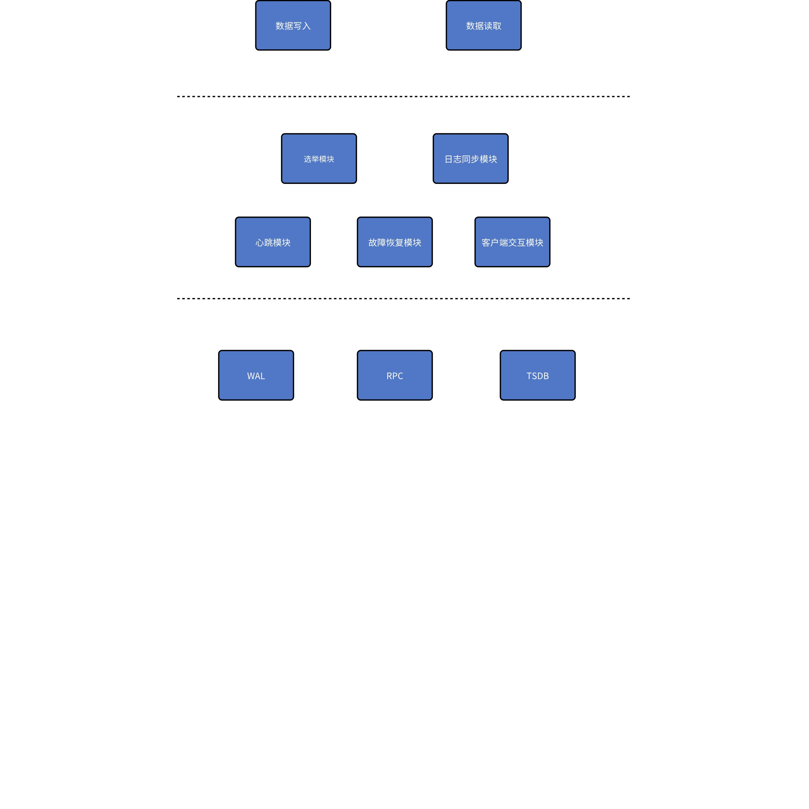
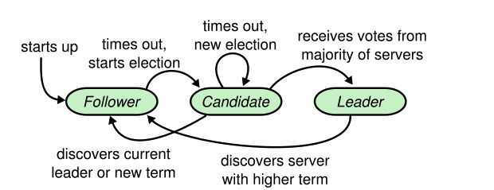
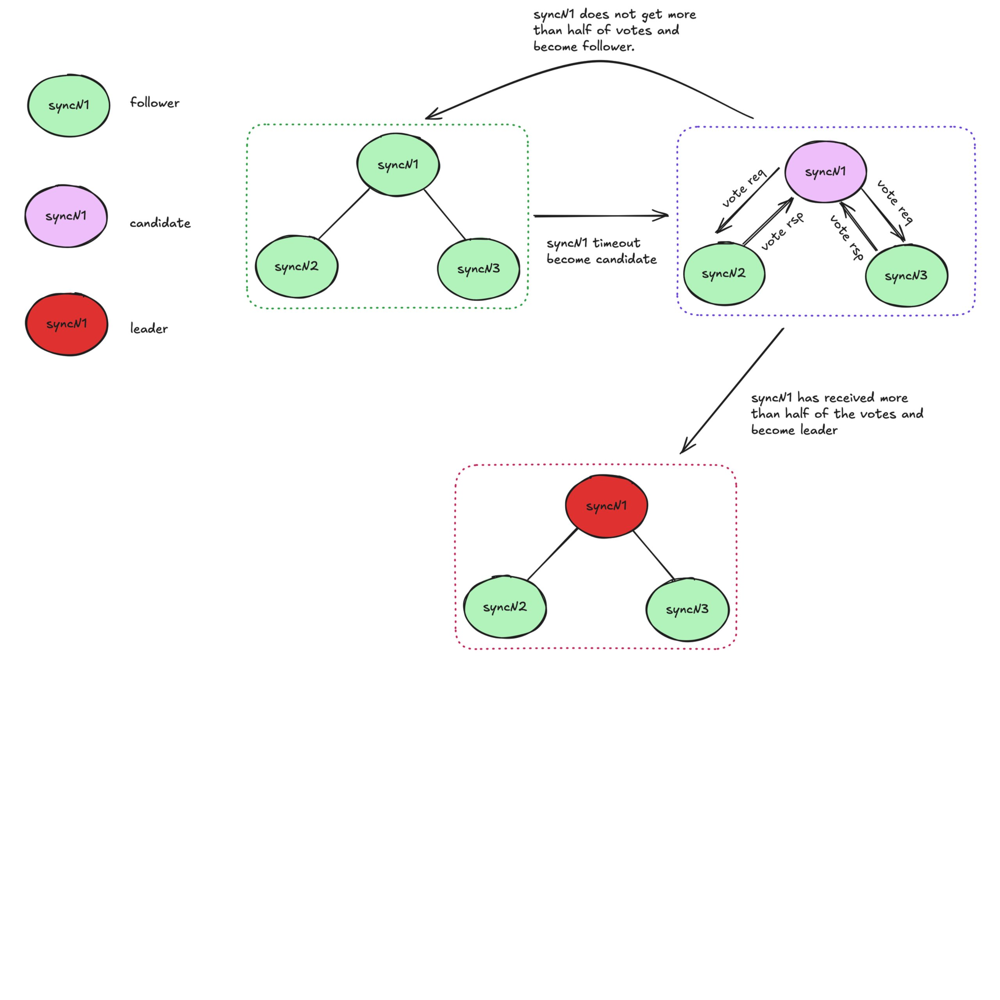
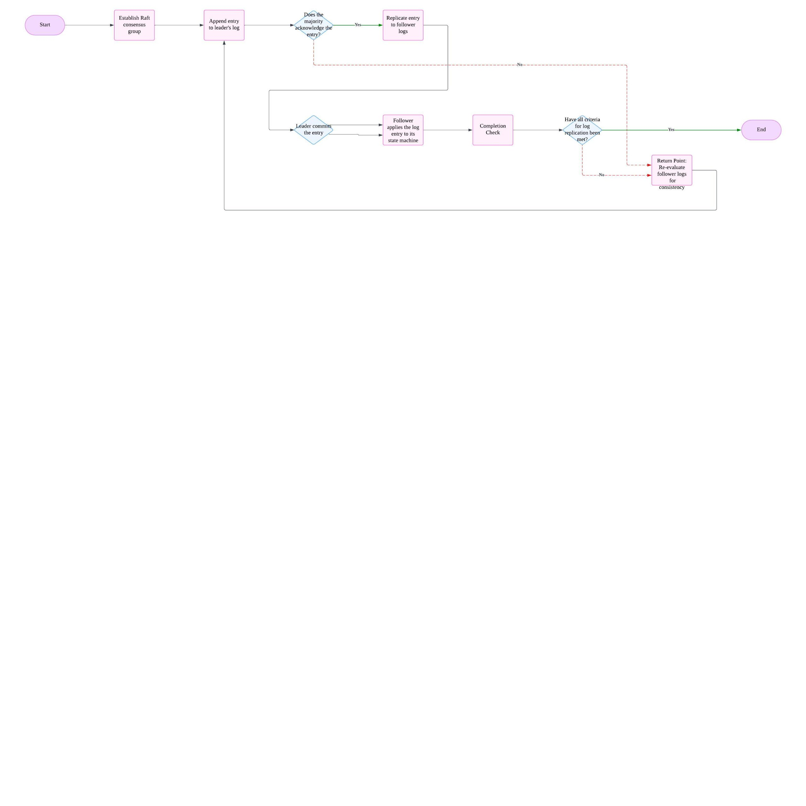
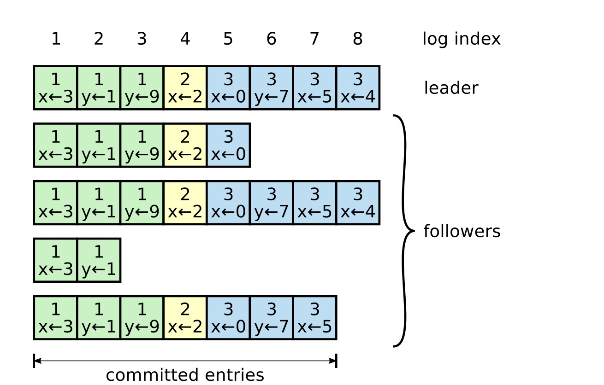
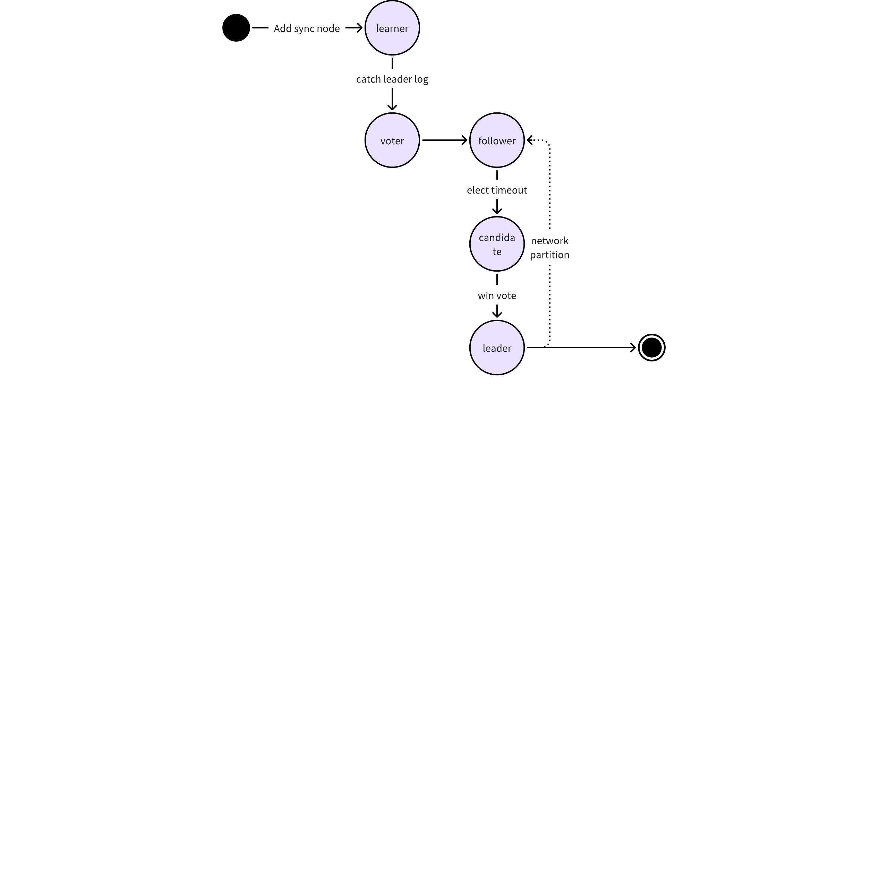
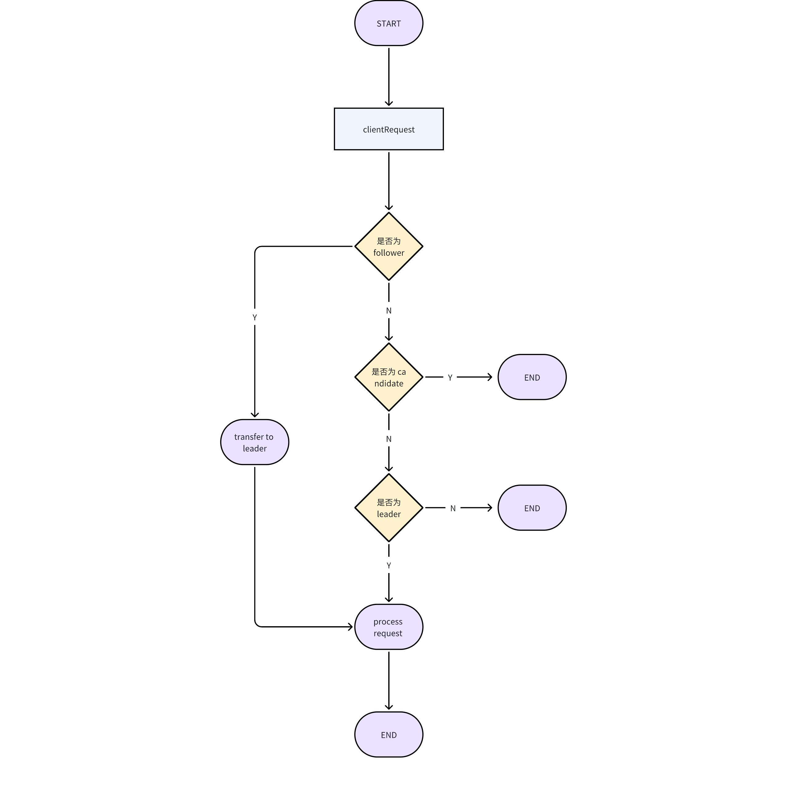

# 多副本管理模块-Design Spec

## 1. 修订记录

| 编写日期 | 发布日期 | 版本 | 修订人 | 主要修改内容 |
| --- | --- | --- | --- | --- |
| 2025-01-25 | 2025-01-25 | 1.0 | 鲍之骁 | 第一次安可送测 |
| 2025-12-10 | 2025-12-10 | 1.1 | 程洪泽 | 重构文档 |

## 2. 引言

**目的：**本文档旨在详细描述 TDengine 多副本管理功能的设计与实现方案，确保系统在高可用性、数据一致性和容错性方面满足业务需求。通过多副本管理，TDengine 能够在节点故障时自动切换并恢复数据，保障服务的连续性和数据的可靠性。
**范围：**本文档涵盖多副本管理功能的核心设计，包括副本创建、数据同步、故障检测与恢复、负载均衡等机制。适用于 TDengine 的开发、测试和运维团队。
**本文受众：**
- **开发人员**：了解多副本管理的实现细节和技术选型。
- **测试人员**：根据设计文档制定测试计划和用例。
- **运维人员**：掌握多副本管理的部署、监控和维护方法。
- **架构师**：评估设计的合理性、可扩展性和性能。

## 3. 术语

1. **同步模块（sync) **：负责 TDengine 数据库高可用的功能模块，使  用 raft 协议实现。
2. **Raft 协议(raft) **：一种分布式一致性算法，TDengine 多副本管理依托此协议来确保副本间的同步与一致性，实现 leader 选举、日志复制等关键操作。
3. **领导者（Leader）**：在 Raft 集群中，领导者是核心角色。它负责接收客户端请求，将操作请求转换为日志条目（Log Entries），并将这些日志条目复制到其他节点（跟随者，Followers）。同时，它还会定期发送心跳（Heartbeat）消息给其他节点，以表明自己的存活状态，防止其他节点触发新的选举。领导者对于整个集群的协调和数据一致性维护起着关键作用，例如在数据写入操作中，领导者决定写入的顺序和时间，并确保所有副本最终都按照这个顺序完成写入。
4. **跟随者 (Follower) **：跟随者是 Raft 集群中的节点类型之一，它们接收并保存领导者复制过来的日志条目。跟随者会响应领导者的心跳消息，以表明自己处于存活且正常工作的状态。在正常情况下，跟随者主要是被动地接收和存储日志，不主动处理客户端请求，但会参与选举过程。当它们在选举超时时间内没有收到领导者的心跳消息时，会转换为候选人（Candidate）参与选举，以选出新的领导者。
5. **学习者（Learner）**：学习者是一种特殊的非投票节点，主要用于在不影响集群一致性决策的情况下接收数据更新。在一些扩展的 Raft 应用场景中，比如集群需要临时加入新节点进行数据同步或者在跨数据中心复制场景下，为了避免新节点过多地参与选举过程影响集群稳定性，引入了学习者的概念。学习者可以从领导者或其他节点那里获取日志更新，用于学习集群的当前状态，但在选举过程中通常没有投票权。
6. **多副本（Multi-Replica）**：指在 TDengine 数据库系统中，针对同一份数据存储多个相同的拷贝，分布于不同的存储位置，以提高数据的可用性、可靠性及容错能力。
7. **副本组（Replica Group**）：由一个 leader 及与之对应的多个 follower 组成，它们共同维护同一份数据的一致性。
8. **快照（Snapshot）**：在 Raft 算法中，快照是一种用于优化日志存储和提高系统性能的机制。随着时间的推移，日志会不断增长，这会占用大量的存储空间并且在恢复系统状态时可能需要回放大量的日志。快照就是对系统某一时刻状态的完整记录，包括状态机的当前状态和必要的元数据（如最后一条包含在快照中的日志索引和任期号）。通过创建快照，节点可以丢弃在快照之前的旧日志，减少日志存储量，并且在节点故障恢复等场景下，可以利用快照快速恢复到一个较新的状态，然后再应用快照之后的日志。
9. **选举（Election）**：选举是 Raft 集群在特定情况下（如领导者故障或者集群初始化）选择新领导者的过程。当触发选举时，跟随者会转换为候选人，候选人通过向其他节点发送请求投票（RequestVote）消息来争取选票。节点根据候选人的任期号和日志新旧程度等因素进行投票，只有获得集群中多数节点选票的候选人才能成为新的领导者。选举过程遵循严格的规则，包括任期号的递增、多数派投票原则和日志完整性检查等，以确保选举出的领导者能够正确地领导集群，维护系统的一致性和可靠性。
10. **任期（Term）**：任期是一个单调递增的整数，用于划分不同的选举阶段。在选举中，候选人凭借任期号争取投票，节点以此判断消息是否有效。它也用于日志复制，确保日志的合法性和顺序。故障恢复时，任期号会更新，新领导者会重新同步任期和日志状态。
11. **索引（Index）**：日志索引是标识日志位置的整数，从 1 开始递增。用于日志复制的顺序控制，领导者和跟随者通过索引交流复制进度。和快照关联，通过最后包含在快照中的日志索引划分界限。在故障恢复时帮助节点确定日志应用情况。
12. **切主 (Transfer leader) **：是指将系统的主节点（Leader）从当前节点切换到另一个节点的过程。这通常是因为原主节点出现故障或者其他原因导致其无法有效领导集群，需要一个新的节点来承担领导者的角色，以维持系统的正常运行和数据一致性。
13. **物理节点（pnode）：** pnode 是一独立运行、拥有自己的计算、存储和网络能力的计算机，可以是安装有 OS 的物理机、虚拟机或 Docker 容器。物理节点由其配置的 FQDN（Fully Qualified Domain Name）来标识。TDengine 完全依赖 FQDN 来进行网络通讯。
14. **数据节点（dnode）：** dnode 是 TDengine 服务器侧执行代码 taosd 在物理节点上的一个运行实例。在一个 TDengine 系统中，至少需要一个 dnode 来确保系统的正常运行。每个 dnode 包含零到多个逻辑的虚拟节点（vnode），但管理节点、弹性计算节点和流计算节点各有 0 个或 1 个逻辑实例。
15. **虚拟节点（vnode）：** 为了更好地支持数据分片、负载均衡以及防止数据过热或倾斜，TDengine 引入了 vnode（虚拟节点）的概念。虚拟节点被虚拟化为多个独立的 vnode 实例（如上面架构图中的 V2、V3、V4 等），每个 vnode 都是一个相对独立的工作单元，负责存储和管理一部分时序数据。
16. **管理节点（mnode）：** mnode（管理节点）是 TDengine 集群中的核心逻辑单元，负责监控和维护所有 dnode的运行状态，并在节点之间实现负载均衡（如图 15-1 中的 M1、M2、M3 所示）。作为元数据（包括用户、数据库、超级表等）的存储和管理中心，mnode 也被称为 MetaNode。
17. **虚拟节点组（VGroup）：**vgroup（虚拟节点组）是由不同 dnode 上的 vnode 组成的一个逻辑单元。这些 vnode之间采用 Raft 一致性协议，确保集群的高可用性和高可靠性。在 vgroup 中，写操作只能在 leader vnode 上执行，而数据则以异步复制的方式同步到其他 follower vnode，从而在多个物理节点上保留数据副本。

## 4. 概述

### 4.1 架构

多副本管理功能的架构包括以下核心组件：
1. **副本管理器**：负责副本的创建、删除和状态管理。
2. **选举模块：**在副本组首次初始化，出现网络分区或 leader 发生故障时，通过选举机制选出新的 leader。
3. **日志同步模块**：实现主副本与从副本之间的数据同步。
4. **心跳模块：**定期向各个副本发送心跳消息，用于检测副本的存活状态，确保系统及时感知到副本的故障情况，以便触发相应的处理机制。
5. **故障恢复模块：**当检测到副本出现故障时，负责执行一系列恢复操作，如重新启动故障副本、从备份中恢复数据，以及协调副本组内其他副本进行数据同步和状态调整，使系统尽快恢复到正常运行状态。
6. **客户端交互模块：**负责与客户端进行通信，接收客户端的读写请求，对请求进行初步处理和验证，然后将请求合理地分配到相应的副本上，并将处理结果返回给客户端，为客户端提供与副本系统交互的接口。


多副本管理整体架构图

### 4.2 技术

**Raft 算法**

### 4.3 依赖项

1. WAL : WAL 模块用于同步模块 log 的存储。
2. RPC : RPC 模块用于节点健康监测，日志复制，快照发送。
3. 存储引擎 ： 同步模块达成一致后，将数据写入存储引擎。

## 5. 设计考虑

### 5.1 假设和限制

1. **假设**：网络偶尔会出现短暂延迟或数据包丢失，但不会长时间中断。节点故障是独立事件，不会出现大规模同时故障。
2. **限制**：多副本管理增加存储开销，需合理规划存储资源。数据同步会消耗网络带宽，需控制同步频率和数据量。

### 5.2 设计模式和原则

1. **主从模式**：明确领导者副本和跟随者副本的职责，简化数据管理和同步逻辑。
2. **数据一致性原则**：确保所有副本数据在最终状态下保持一致。

### 5.3 风险和缓解措施

- **风险**：网络分区导致数据不一致。
  - **缓解措施**：使用 Raft 协议确保分区恢复后的一致性。
- **风险**：主副本故障导致服务中断。
  - **缓解措施**：实现快速故障切换机制。

## 6. 详细设计

### 6.1 选举模块

#### 6.1.1 描述

选举模块负责在初次启动或主副本故障时，通过 Raft 协议或其他选举算法从从副本中选出新的主副本。选举过程确保系统的高可用性和一致性。

#### 6.1.2 选举流程

1. **定时器超时：**
  当节点的定时器超时，意味着一段时间未收到 Leader 消息，此时该节点会认定 Leader 可能失效，随即从 Follower 转变为 Candidate，准备参与竞选 Leader。
1. **发送投票请求：**
  成为 Candidate 后，该节点会向集群内所有其他节点发送 RequestVote 请求，以争取获得投票。
1. **投票：**
  其他节点在收到 RequestVote 请求后，会依据一定规则判断是否投票给该 Candidate，并将结果反馈给 Candidate。
1. **成为 Leader：**
  若 Candidate 收到超过半数以上的投票，即可成功当选为 Leader。当选后，会立即并在任期内定期发送心跳信息，以此通知其他节点新 Leader 的信息，同时重置其他节点的定时器，防止它们再次发起竞选。
1. **重试：**
  若 Candidate 在规定时间内未获得足够票数，则会开启新一轮选举。如此循环，直至该 Candidate 成为 Leader，或者其他节点当选为新 Leader，此时自身转变为 Follower。

#### 6.1.3 关键数据结构

```c
typedef enum {
  TAOS_SYNC_STATE_OFFLINE = 0,
  TAOS_SYNC_STATE_FOLLOWER = 100,
  TAOS_SYNC_STATE_CANDIDATE = 101,
  TAOS_SYNC_STATE_LEADER = 102,
  TAOS_SYNC_STATE_ERROR = 103,
  TAOS_SYNC_STATE_LEARNER = 104,
  TAOS_SYNC_STATE_ASSIGNED_LEADER = 105,
} ESyncState;

typedef enum {
  TAOS_SYNC_ROLE_VOTER = 0,
  TAOS_SYNC_ROLE_LEARNER = 1,
  TAOS_SYNC_ROLE_ERROR = 2,
} ESyncRole;

typedef enum {
  SYNC_FSM_STATE_COMPLETE = 0,
  SYNC_FSM_STATE_INCOMPLETE,
} ESyncFsmState;

  TD_DEF_MSG_TYPE(TDMT_SYNC_TIMEOUT, "sync-timer", NULL, NULL)
  TD_DEF_MSG_TYPE(TDMT_SYNC_TIMEOUT_ELECTION, "sync-elect", NULL, NULL)
  TD_DEF_MSG_TYPE(TDMT_SYNC_REQUEST_VOTE, "sync-request-vote", NULL, NULL)
  TD_DEF_MSG_TYPE(TDMT_SYNC_REQUEST_VOTE_REPLY, "sync-request-vote-reply", NULL, NULL)
```

#### 6.1.4 相关图表



图1:选举流程


图2:多副本管理选举状态流转图

### 6.2 日志复制模块

#### 6.2.1 描述

日志复制模块负责在主副本（Leader）和从副本（Follower）之间同步日志数据，确保集群中所有节点的数据一致性。主副本将客户端提交的写操作记录到本地日志中，并将这些日志条目复制到所有从副本。只有当大多数节点成功复制日志后，主副本才会提交日志并将其应用到状态机中。

#### 6.2.2 日志复制流程

1. **客户端请求**：
  - 客户端向主副本发送写请求，主副本将请求内容封装为日志条目，并追加到本地日志中。
1. **日志广播**：
  - 主副本通过 AppendEntries RPC 将日志条目广播给所有从副本，等待从副本的确认。
1. **从副本接收日志**：
  - 从副本收到 AppendEntries 请求后，会检查日志条目的合法性（如索引和任期是否匹配）。如果合法，则将日志条目追加到本地日志中，并返回成功响应。 
1. **日志提交**：
  - 主副本在收到大多数从副本的成功响应后，会将日志条目标记为已提交（Committed），并将其应用到状态机中。
1. **通知从副本提交**：
  - 主副本在后续的 AppendEntries 请求中携带最新的提交索引（Commit Index），通知从副本将已提交的日志条目应用到它们的状态机中。
1. **日志一致性检查**：
  - 如果从副本的日志与主副本不一致（例如由于网络分区或节点重启），主副本会通过 AppendEntries 请求逐步覆盖从副本的日志，直到两者一致。
1. **重试机制**：
  - 如果主副本未收到从副本的响应，会在超时后重试 AppendEntries 请求，直到日志复制成功。

#### 6.2.3 关键数据结构

```c
typedef struct SSyncLogBufEntry {
  SSyncRaftEntry* pItem;
  SyncIndex       prevLogIndex;
  SyncTerm        prevLogTerm;
} SSyncLogBufEntry;

typedef struct SSyncRaftEntry {
  uint32_t  bytes;
  uint32_t  msgType;          // TDMT_SYNC_CLIENT_REQUEST
  uint32_t  originalRpcType;  // origin RpcMsg msgType
  uint64_t  seqNum;
  bool      isWeak;
  SyncTerm  term;
  SyncIndex index;
  int64_t   rid;
  uint32_t  dataLen;  // origin RpcMsg.contLen
  char      data[];   // origin RpcMsg.pCont
} SSyncRaftEntry;

typedef struct SSyncLogReplMgr {
  SSyncReplInfo states[TSDB_SYNC_LOG_BUFFER_SIZE];
  int64_t       startIndex;
  int64_t       matchIndex;
  int64_t       endIndex;
  int64_t       size;
  bool          restored;
  int64_t       peerStartTime;
  int32_t       retryBackoff;
  int32_t       peerId;
} SSyncLogReplMgr;
```

#### 6.2.4 相关图表



图3：raft log replication 流程图


图4:raft log at raft nodes

### 6.3 心跳模块

#### 6.3.1 描述

Raft 心跳机制是 Raft 算法中用于维持领导者（Leader）地位以及确保集群中各节点状态一致性的关键部分。在 Raft 集群中，领导者会定期向其他节点（跟随者，Follower）发送心跳消息。这些心跳消息本质上是一种轻量级的通信信号，不携带实际的数据变更内容，但对于整个集群的稳定运行至关重要。通过心跳机制，领导者能够向跟随者表明自己仍然正常运行，同时也促使跟随者更新自身状态，确保集群内各节点能够及时感知领导者的存在，进而维持系统的高可用性和一致性。

#### 6.3.2 心跳流程

1. **心跳发送**：
   - 领导者启动：在 Raft 集群完成选举产生领导者后，领导者会立即启动心跳发送机制。
   - 定时任务：领导者内部会设置一个固定的时间间隔（如 50 毫秒 - 200 毫秒，具体时间可根据系统需求调整），作为心跳发送的周期。当到达设定的时间间隔时，领导者会触发一个定时任务，开始准备发送心跳消息。
   - 消息构建：领导者将构建心跳消息，消息中通常包含领导者的任期号（用于标识领导者所处的选举周期）以及其他必要的元数据信息，但不包含实际的数据操作日志。
   - 广播发送：构建完成后，领导者会通过网络将心跳消息广播发送给集群中的所有跟随者节点。
2. **心跳接收与处理**：
   - 接收消息：跟随者节点会持续监听网络端口，等待接收来自领导者的心跳消息。当接收到心跳消息时，跟随者会立即暂停当前正在进行的任何选举相关的操作（如果有）。
   - 任期号校验：跟随者首先会检查心跳消息中的任期号。如果发现领导者的任期号低于自己的任期号，说明可能存在网络分区或其他异常情况导致领导者信息滞后，跟随者会拒绝该心跳消息，并可能触发自身的选举流程。
   - 重置选举定时器：若任期号校验通过，跟随者会将自己的选举定时器重置。选举定时器是跟随者用于判断领导者是否失效的关键机制，当定时器超时且未收到领导者心跳时，跟随者会认为领导者可能已失效，从而发起选举。通过重置选举定时器，跟随者确保在领导者正常运行时不会误发起选举。
3. **心跳异常处理**：
   - 超时检测：如果跟随者在选举定时器设定的时间内没有收到领导者的心跳消息，就会判定为心跳超时。
   - 选举触发：一旦心跳超时，跟随者会认为领导者可能已经失效，随即从跟随者状态转变为候选人（Candidate）状态，并发起新一轮的领导者选举流程。在选举过程中，候选人会向其他节点发送投票请求，尝试争取成为新的领导者。
   - 网络异常处理：在心跳消息发送和接收过程中，如果遇到网络故障（如数据包丢失、网络延迟过高），领导者可能会尝试重新发送心跳消息，跟随者也会等待一段时间后再进行超时判定。同时，系统可能会记录相关的网络异常信息，以便后续进行故障排查和性能优化。

#### 6.3.3 关键数据结构

```cpp
typedef struct SyncHeartbeat {
  uint32_t bytes;
  int32_t  vgId;
  uint32_t msgType;
  SRaftId  srcId;
  SRaftId  destId;

  // private data
  SyncTerm  term;
  SyncIndex commitIndex;
  SyncTerm  privateTerm;
  SyncTerm  minMatchIndex;
  int64_t   timeStamp;
  int16_t   reserved;
} SyncHeartbeat;

typedef struct SyncHeartbeatReply {
  uint32_t bytes;
  int32_t  vgId;
  uint32_t msgType;
  SRaftId  srcId;
  SRaftId  destId;

  // private data
  SyncTerm term;
  SyncTerm privateTerm;
  int64_t  startTime;
  int64_t  timeStamp;
  int16_t  reserved;
} SyncHeartbeatReply;

  TD_DEF_MSG_TYPE(TDMT_SYNC_HEARTBEAT, "sync-heartbeat", NULL, NULL)
  TD_DEF_MSG_TYPE(TDMT_SYNC_HEARTBEAT_REPLY, "sync-heartbeat-reply", NULL, NULL)
```

### 6.4 成员变更模块

#### 6.4.1 描述

成员变更模块负责在集群运行时动态调整节点成员，例如添加新节点或移除故障节点。该模块通过 Raft 协议的两阶段变更机制，确保在变更过程中集群的一致性和可用性。成员变更涉及节点的状态流转，包括 Learner、Voter、Follower 和 Leader 之间的转换。

#### 6.4.2 成员变更流程

1. **添加新节点（Learner 阶段）**：
   - 新节点首先以 **Learner** 身份加入集群。Learner 不参与投票，但会接收并复制日志条目，以追赶集群的最新状态。
   - 当 Learner 的日志与 Leader 的日志基本同步后，Leader 会提议将其升级为 **Voter**（具有投票权的节点）。
2. **Learner 升级为 Voter**：
   - Leader 将成员变更请求（Learner → Voter）作为一个日志条目提交到集群。
   - 当该日志条目被大多数节点（基于旧配置）确认后，Learner 正式成为 **Voter**，并开始参与集群的投票和日志复制。
3. **移除节点**：
   - 如果需要移除某个节点，Leader 将成员变更请求（移除节点）作为一个日志条目提交到集群。
   - 当该日志条目被大多数节点（基于旧配置）确认后，被移除的节点从集群中退出，不再参与任何集群操作。
4. **Leader 和 Follower 的状态流转**：
   - 如果成员变更涉及 Leader 节点（例如移除 Leader），Leader 会先提交变更日志，然后在应用新配置后主动退位为 **Follower**，触发新一轮选举。
   - 其他节点在成员变更过程中始终保持 **Follower** 状态，直到新配置生效后，根据选举结果可能转变为 **Leader** 或保持 **Follower** 状态。
5. **新配置生效**：
   - 当成员变更日志条目被大多数节点（基于新配置）确认后，新配置正式生效。
   - 集群在新配置下继续运行，新节点（Voter）参与投票和日志复制，被移除节点退出集群。

#### 6.4.3 关键数据结构

```c
typedef enum {
  TAOS_SYNC_STATE_OFFLINE = 0,
  TAOS_SYNC_STATE_FOLLOWER = 100,
  TAOS_SYNC_STATE_CANDIDATE = 101,
  TAOS_SYNC_STATE_LEADER = 102,
  TAOS_SYNC_STATE_ERROR = 103,
  TAOS_SYNC_STATE_LEARNER = 104,
  TAOS_SYNC_STATE_ASSIGNED_LEADER = 105,
} ESyncState;

typedef enum {
  TAOS_SYNC_ROLE_VOTER = 0,
  TAOS_SYNC_ROLE_LEARNER = 1,
  TAOS_SYNC_ROLE_ERROR = 2,
} ESyncRole;
```

#### 6.4.4 相关图表



### 6.5 客户端交互模块

#### 6.5.1 描述

客户端交互模块负责处理客户端与 Raft 集群之间的通信。客户端通过该模块向集群提交请求（如读写操作），并接收集群的响应。该模块确保客户端请求被正确路由到 Leader 节点，并在集群中达成一致后返回结果，从而保证数据的一致性和系统的可用性。

#### 6.5.2 客户端交互流程

1. **请求发送**：
   - 客户端向集群中的任意节点发送请求（如写操作或读操作）。
   - 如果接收请求的节点是 Follower，它会将客户端的请求重定向到当前集群的 Leader 节点。
2. **请求处理**：
   - Leader 节点收到客户端请求后，将其作为一个新的日志条目添加到本地日志中。
   - Leader 将该日志条目复制到集群中的其他节点，并等待大多数节点的确认。
3. **日志提交与响应**：
   - 当日志条目被大多数节点确认后，Leader 将其提交并应用到状态机中。
   - Leader 将操作结果返回给客户端，表示请求已成功完成。
4. **重试机制**：
   - 如果客户端在超时时间内未收到响应，会重新发送请求。
   - 如果集群在此期间发生了 Leader 切换，客户端会被重定向到新的 Leader 节点，并重新提交请求。

#### 6.5.3 关键数据结构

```c
typedef struct SyncClientRequest {
  uint32_t bytes;
  int32_t  vgId;
  uint32_t msgType;          // TDMT_SYNC_CLIENT_REQUEST
  uint32_t originalRpcType;  // origin RpcMsg msgType
  uint64_t seqNum;
  bool     isWeak;
  int16_t  reserved;
  uint32_t dataLen;  // origin RpcMsg.contLen
  char     data[];   // origin RpcMsg.pCont
} SyncClientRequest;

  TD_DEF_MSG_TYPE(TDMT_SYNC_CLIENT_REQUEST, "sync-client-request", NULL, NULL)
```

#### 6.5.4 相关图表



## 7. 接口规范

### 7.1 函数接口

#### 7.1.1 初始化与清理

##### 7.1.1.1 `syncInit`

- **函数定义**: `int32_t syncInit()`
- **功能**: 初始化同步模块。
- **返回值**:
  - `0`：初始化成功。
  - 非 `0`：初始化失败，返回错误码。

##### 7.1.1.2 `syncCleanUp`

- **函数定义**: `void syncCleanUp()`
- **功能**: 清理同步模块。
- **返回值**: 无。
---

#### 7.1.2 节点管理

##### 7.1.2.1 `syncOpen`

- **函数定义**: `int64_t syncOpen(SSyncInfo* pSyncInfo, int32_t vnodeVersion)`
- **功能**: 打开同步节点。
- **入参**:
  - `pSyncInfo`：同步信息结构体指针。
  - `vnodeVersion`：vnode 节点版本号。
- **出参**: 无。
- **返回值**:
  - 成功：返回节点 ID。
  - 失败：返回 `-1`。

##### 7.1.2.2 `syncStart`

- **函数定义**: `int32_t syncStart(int64_t rid)`
- **功能**: 启动同步节点。
- **入参**:
  - `rid`：节点 ID。
- **出参**: 无。
- **返回值**:
  - `0`：启动成功。
  - 非 `0`：启动失败，返回错误码。

##### 7.1.2.3 `syncStop`

- **函数定义**: `void syncStop(int64_t rid)`
- **功能**: 停止同步节点。
- **入参**:
  - `rid`：节点 ID。
- **出参**: 无。
- **返回值**: 无。

##### 7.1.2.4 `syncPreStop`

- **函数定义**: `void syncPreStop(int64_t rid)`
- **功能**: 预停止同步节点。
- **入参**:
  - `rid`：节点 ID。
- **出参**: 无。
- **返回值**: 无。

##### 7.1.2.5 `syncPostStop`

- **函数定义**: `void syncPostStop(int64_t rid)`
- **功能**: 后停止同步节点。
- **入参**:
  - `rid`：节点 ID。
- **出参**: 无。
- **返回值**: 无。
---

#### 7.1.3 日志与状态机操作

##### 7.1.3.1 `syncPropose`

- **函数定义**: `int32_t syncPropose(int64_t rid, SRpcMsg* pMsg, bool isWeak, int64_t* seq)`
- **功能**: 提议新的日志条目。
- **入参**:
  - `rid`：节点 ID。
  - `pMsg`：RPC 消息指针。
  - `isWeak`：是否为弱一致性。
- **出参**:
  - `seq`：序列号指针。
- **返回值**:
  - `0`：提议成功。
  - 非 `0`：提议失败，返回错误码。

##### 7.1.3.2 `syncCheckMember`

- **函数定义**: `int32_t syncCheckMember(int64_t rid)`
- **功能**: 检查成员状态。
- **入参**:
  - `rid`：节点 ID。
- **出参**: 无。
- **返回值**:
  - `0`：成员状态正常。
  - 非 `0`：成员状态异常，返回错误码。

##### 7.1.3.3 `syncIsCatchUp`

- **函数定义**: `int32_t syncIsCatchUp(int64_t rid)`
- **功能**: 检查是否已追上日志。
- **入参**:
  - `rid`：节点 ID。
- **出参**: 无。
- **返回值**:
  - `0`：已追上日志。
  - 非 `0`：未追上日志，返回错误码。

##### 7.1.3.4 `syncGetRole`

- **函数定义**: `ESyncRole syncGetRole(int64_t rid)`
- **功能**: 获取节点角色。
- **入参**:
  - `rid`：节点 ID。
- **出参**: 无。
- **返回值**:
  - 返回节点角色枚举值。

##### 7.1.3.5 `syncGetTerm`

- **函数定义**: `int64_t syncGetTerm(int64_t rid)`
- **功能**: 获取当前任期。
- **入参**:
  - `rid`：节点 ID。
- **出参**: 无。
- **返回值**:
  - 返回当前任期。

##### 7.1.3.6 `syncProcessMsg`

- **函数定义**: `int32_t syncProcessMsg(int64_t rid, SRpcMsg* pMsg)`
- **功能**: 处理消息。
- **入参**:
  - `rid`：节点 ID。
  - `pMsg`：RPC 消息指针。
- **出参**: 无。
- **返回值**:
  - `0`：处理成功。
  - 非 `0`：处理失败，返回错误码。

##### 7.1.3.7 `syncReconfig`

- **函数定义**: `int32_t syncReconfig(int64_t rid, SSyncCfg* pCfg)`
- **功能**: 重新配置节点。
- **入参**:
  - `rid`：节点 ID。
  - `pCfg`：同步配置结构体指针。
- **出参**: 无。
- **返回值**:
  - `0`：重新配置成功。
  - 非 `0`：重新配置失败，返回错误码。

##### 7.1.3.8 `syncBeginSnapshot`

- **函数定义**: `int32_t syncBeginSnapshot(int64_t rid, int64_t lastApplyIndex)`
- **功能**: 开始快照。
- **入参**:
  - `rid`：节点 ID。
  - `lastApplyIndex`：最后应用的索引。
- **出参**: 无。
- **返回值**:
  - `0`：开始快照成功。
  - 非 `0`：开始快照失败，返回错误码。

##### 7.1.3.9 `syncEndSnapshot`

- **函数定义**: `int32_t syncEndSnapshot(int64_t rid)`
- **功能**: 结束快照。
- **入参**:
  - `rid`：节点 ID。
- **出参**: 无。
- **返回值**:
  - `0`：结束快照成功。
  - 非 `0`：结束快照失败，返回错误码。

##### 7.1.3.10 `syncLeaderTransfer`

- **函数定义**: `int32_t syncLeaderTransfer(int64_t rid)`
- **功能**: 领导者转移。
- **入参**:
  - `rid`：节点 ID。
- **出参**: 无。
- **返回值**:
  - `0`：领导者转移成功。
  - 非 `0`：领导者转移失败，返回错误码。

##### 7.1.3.11 `syncStepDown`

- **函数定义**: `int32_t syncStepDown(int64_t rid, SyncTerm newTerm)`
- **功能**: 节点降级。
- **入参**:
  - `rid`：节点 ID。
  - `newTerm`：新任期。
- **出参**: 无。
- **返回值**:
  - `0`：节点降级成功。
  - 非 `0`：节点降级失败，返回错误码。

##### 7.1.3.12 `syncIsReadyForRead`

- **函数定义**: `bool syncIsReadyForRead(int64_t rid)`
- **功能**: 检查节点是否可读。
- **入参**:
  - `rid`：节点 ID。
- **出参**: 无。
- **返回值**:
  - `true`：节点可读。
  - `false`：节点不可读。

##### 7.1.3.13 `syncSnapshotSending`

- **函数定义**: `bool syncSnapshotSending(int64_t rid)`
- **功能**: 检查是否正在发送快照。
- **入参**:
  - `rid`：节点 ID。
- **出参**: 无。
- **返回值**:
  - `true`：正在发送快照。
  - `false`：未发送快照。

##### 7.1.3.14 `syncSnapshotRecving`

- **函数定义**: `bool syncSnapshotRecving(int64_t rid)`
- **功能**: 检查是否正在接收快照。
- **入参**:
  - `rid`：节点 ID。
- **出参**: 无。
- **返回值**:
  - `true`：正在接收快照。
  - `false`：未接收快照。

##### 7.1.3.15 `syncSendTimeoutRsp`

- **函数定义**: `int32_t syncSendTimeoutRsp(int64_t rid, int64_t seq)`
- **功能**: 发送超时响应。
- **入参**:
  - `rid`：节点 ID。
  - `seq`：序列号。
- **出参**: 无。
- **返回值**:
  - `0`：发送成功。
  - 非 `0`：发送失败，返回错误码。

##### 7.1.3.16 `syncForceBecomeFollower`

- **函数定义**: `int32_t syncForceBecomeFollower(SSyncNode* ths, const SRpcMsg* pRpcMsg)`
- **功能**: 强制节点成为跟随者。
- **入参**:
  - `ths`：同步节点指针。
  - `pRpcMsg`：RPC 消息指针。
- **出参**: 无。
- **返回值**:
  - `0`：强制成功。
  - 非 `0`：强制失败，返回错误码。

##### 7.1.3.17 `syncBecomeAssignedLeader`

- **函数定义**: `int32_t syncBecomeAssignedLeader(SSyncNode* ths, SRpcMsg* pRpcMsg)`
- **功能**: 节点成为指定领导者。
- **入参**:
  - `ths`：同步节点指针。
  - `pRpcMsg`：RPC 消息指针。
- **出参**: 无。
- **返回值**:
  - `0`：成为指定领导者成功。
  - 非 `0`：成为指定领导者失败，返回错误码。
---

#### 7.1.4 状态与配置获取

##### 7.1.4.1 `syncGetState`

- **函数定义**: `SSyncState syncGetState(int64_t rid)`
- **功能**: 获取节点状态。
- **入参**:
  - `rid`：节点 ID。
- **出参**: 无。
- **返回值**:
  - 返回节点状态结构体。

##### 7.1.4.2 `syncGetArbToken`

- **函数定义**: `int32_t syncGetArbToken(int64_t rid, char* outToken)`
- **功能**: 获取仲裁令牌。
- **入参**:
  - `rid`：节点 ID。
- **出参**:
  - `outToken`：输出令牌的缓冲区。
- **返回值**:
  - `0`：获取成功。
  - 非 `0`：获取失败，返回错误码。

##### 7.1.4.3 `syncGetAssignedLogSynced`

- **函数定义**: `int32_t syncGetAssignedLogSynced(int64_t rid)`
- **功能**: 获取指定日志是否已同步。
- **入参**:
  - `rid`：节点 ID。
- **出参**: 无。
- **返回值**:
  - `0`：日志已同步。
  - 非 `0`：日志未同步，返回错误码。

##### 7.1.4.4 `syncGetRetryEpSet`

- **函数定义**: `void syncGetRetryEpSet(int64_t rid, SEpSet* pEpSet)`
- **功能**: 获取重试的端点集。
- **入参**:
  - `rid`：节点 ID。
- **出参**:
  - `pEpSet`：端点集结构体指针。
- **返回值**: 无。

##### 7.1.4.5 `syncStr`

- **函数定义**: `const char* syncStr(ESyncState state)`
- **功能**: 将状态枚举转换为字符串。
- **入参**:
  - `state`：状态枚举值。
- **出参**: 无。
- **返回值**:
  - 返回状态字符串。

##### 7.1.4.6 `syncNodeGetConfig`

- **函数定义**: `int32_t syncNodeGetConfig(int64_t rid, SSyncCfg *cfg)`
- **功能**: 获取节点配置。
- **入参**:
  - `rid`：节点 ID。
- **出参**:
  - `cfg`：同步配置结构体指针。
- **返回值**:
  - `0`：获取成功。
  - 非 `0`：获取失败，返回错误码。
---

#### 7.1.5 工具函数

##### 7.1.5.1 `syncSnapInfoDataRealloc`

- **函数定义**: `int32_t syncSnapInfoDataRealloc(SSnapshot* pSnap, int32_t size)`
- **功能**: 重新分配快照数据内存。
- **入参**:
  - `pSnap`：快照结构体指针。
  - `size`：新的大小。
- **出参**:
  - `pSnap`：更新后的快照结构体指针。
- **返回值**:
  - `0`：重新分配成功。
  - 非 `0`：重新分配失败，返回错误码。
---

### 7.2 Callback 函数

#### 7.2.1 `SSyncFSM` 结构体接口

##### 7.2.1.1 `FpCommitCb`

- **函数定义**: `int32_t (*FpCommitCb)(const struct SSyncFSM* pFsm, SRpcMsg* pMsg, SFsmCbMeta* pMeta)`
- **功能**: 提交日志条目的回调函数。
- **入参**:
  - `pFsm`：状态机指针。
  - `pMsg`：RPC 消息指针。
  - `pMeta`：状态机回调元数据指针。
- **出参**: 无。
- **返回值**:
  - `0`：提交成功。
  - 非 `0`：提交失败，返回错误码。

##### 7.2.1.2 `FpAppliedIndexCb`

- **函数定义**: `SyncIndex (*FpAppliedIndexCb)(const struct SSyncFSM* pFsm)`
- **功能**: 获取已应用日志索引的回调函数。
- **入参**:
  - `pFsm`：状态机指针。
- **出参**: 无。
- **返回值**:
  - 返回已应用的日志索引。

##### 7.2.1.3 `FpPreCommitCb`

- **函数定义**: `int32_t (*FpPreCommitCb)(const struct SSyncFSM* pFsm, SRpcMsg* pMsg, SFsmCbMeta* pMeta)`
- **功能**: 预提交日志条目的回调函数。
- **入参**:
  - `pFsm`：状态机指针。
  - `pMsg`：RPC 消息指针。
  - `pMeta`：状态机回调元数据指针。
- **出参**: 无。
- **返回值**:
  - `0`：预提交成功。
  - 非 `0`：预提交失败，返回错误码。

##### 7.2.1.4 `FpRollBackCb`

- **函数定义**: `void (*FpRollBackCb)(const struct SSyncFSM* pFsm, SRpcMsg* pMsg, SFsmCbMeta* pMeta)`
- **功能**: 回滚日志条目的回调函数。
- **入参**:
  - `pFsm`：状态机指针。
  - `pMsg`：RPC 消息指针。
  - `pMeta`：状态机回调元数据指针。
- **出参**: 无。
- **返回值**: 无。

##### 7.2.1.5 `FpRestoreFinishCb`

- **函数定义**: `void (*FpRestoreFinishCb)(const struct SSyncFSM* pFsm, const SyncIndex commitIdx)`
- **功能**: 恢复完成的回调函数。
- **入参**:
  - `pFsm`：状态机指针。
  - `commitIdx`：提交的日志索引。
- **出参**: 无。
- **返回值**: 无。

##### 7.2.1.6 `FpReConfigCb`

- **函数定义**: `void (*FpReConfigCb)(const struct SSyncFSM* pFsm, SRpcMsg* pMsg, SReConfigCbMeta* pMeta)`
- **功能**: 重新配置的回调函数。
- **入参**:
  - `pFsm`：状态机指针。
  - `pMsg`：RPC 消息指针。
  - `pMeta`：重新配置回调元数据指针。
- **出参**: 无。
- **返回值**: 无。

##### 7.2.1.7 `FpLeaderTransferCb`

- **函数定义**: `void (*FpLeaderTransferCb)(const struct SSyncFSM* pFsm, SRpcMsg* pMsg, SFsmCbMeta* pMeta)`
- **功能**: 领导者转移的回调函数。
- **入参**:
  - `pFsm`：状态机指针。
  - `pMsg`：RPC 消息指针。
  - `pMeta`：状态机回调元数据指针。
- **出参**: 无。
- **返回值**: 无。

##### 7.2.1.8 `FpApplyQueueEmptyCb`

- **函数定义**: `bool (*FpApplyQueueEmptyCb)(const struct SSyncFSM* pFsm)`
- **功能**: 检查应用队列是否为空的回调函数。
- **入参**:
  - `pFsm`：状态机指针。
- **出参**: 无。
- **返回值**:
  - `true`：队列为空。
  - `false`：队列不为空。

##### 7.2.1.9 `FpApplyQueueItems`

- **函数定义**: `int32_t (*FpApplyQueueItems)(const struct SSyncFSM* pFsm)`
- **功能**: 获取应用队列中的条目数量。
- **入参**:
  - `pFsm`：状态机指针。
- **出参**: 无。
- **返回值**:
  - 返回应用队列中的条目数量。

##### 7.2.1.10 `FpBecomeLeaderCb`

- **函数定义**: `void (*FpBecomeLeaderCb)(const struct SSyncFSM* pFsm)`
- **功能**: 成为领导者的回调函数。
- **入参**:
  - `pFsm`：状态机指针。
- **出参**: 无。
- **返回值**: 无。

##### 7.2.1.11 `FpBecomeFollowerCb`

- **函数定义**: `void (*FpBecomeFollowerCb)(const struct SSyncFSM* pFsm)`
- **功能**: 成为跟随者的回调函数。
- **入参**:
  - `pFsm`：状态机指针。
- **出参**: 无。
- **返回值**: 无。

##### 7.2.1.12 `FpBecomeLearnerCb`

- **函数定义**: `void (*FpBecomeLearnerCb)(const struct SSyncFSM* pFsm)`
- **功能**: 成为学习者的回调函数。
- **入参**:
  - `pFsm`：状态机指针。
- **出参**: 无。
- **返回值**: 无。

##### 7.2.1.13 `FpBecomeAssignedLeaderCb`

- **函数定义**: `void (*FpBecomeAssignedLeaderCb)(const struct SSyncFSM* pFsm)`
- **功能**: 成为指定领导者的回调函数。
- **入参**:
  - `pFsm`：状态机指针。
- **出参**: 无。
- **返回值**: 无。

##### 7.2.1.14 `FpGetSnapshot`

- **函数定义**: `int32_t (*FpGetSnapshot)(const struct SSyncFSM* pFsm, SSnapshot* pSnapshot, void* pReaderParam, void** ppReader)`
- **功能**: 获取快照的回调函数。
- **入参**:
  - `pFsm`：状态机指针。
  - `pSnapshot`：快照结构体指针。
  - `pReaderParam`：读取器参数。
- **出参**:
  - `ppReader`：读取器指针。
- **返回值**:
  - `0`：获取成功。
  - 非 `0`：获取失败，返回错误码。

##### 7.2.1.15 `FpGetSnapshotInfo`

- **函数定义**: `int32_t (*FpGetSnapshotInfo)(const struct SSyncFSM* pFsm, SSnapshot* pSnapshot)`
- **功能**: 获取快照信息的回调函数。
- **入参**:
  - `pFsm`：状态机指针。
  - `pSnapshot`：快照结构体指针。
- **出参**: 无。
- **返回值**:
  - `0`：获取成功。
  - 非 `0`：获取失败，返回错误码。

##### 7.2.1.16 `FpSnapshotStartRead`

- **函数定义**: `int32_t (*FpSnapshotStartRead)(const struct SSyncFSM* pFsm, void* pReaderParam, void** ppReader)`
- **功能**: 开始读取快照的回调函数。
- **入参**:
  - `pFsm`：状态机指针。
  - `pReaderParam`：读取器参数。
- **出参**:
  - `ppReader`：读取器指针。
- **返回值**:
  - `0`：开始读取成功。
  - 非 `0`：开始读取失败，返回错误码。

##### 7.2.1.17 `FpSnapshotStopRead`

- **函数定义**: `void (*FpSnapshotStopRead)(const struct SSyncFSM* pFsm, void* pReader)`
- **功能**: 停止读取快照的回调函数。
- **入参**:
  - `pFsm`：状态机指针。
  - `pReader`：读取器指针。
- **出参**: 无。
- **返回值**: 无。

##### 7.2.1.18 `FpSnapshotDoRead`

- **函数定义**: `int32_t (*FpSnapshotDoRead)(const struct SSyncFSM* pFsm, void* pReader, void** ppBuf, int32_t* len)`
- **功能**: 执行快照读取的回调函数。
- **入参**:
  - `pFsm`：状态机指针。
  - `pReader`：读取器指针。
- **出参**:
  - `ppBuf`：读取的数据缓冲区。
  - `len`：读取的数据长度。
- **返回值**:
  - `0`：读取成功。
  - 非 `0`：读取失败，返回错误码。

##### 7.2.1.19 `FpSnapshotStartWrite`

- **函数定义**: `int32_t (*FpSnapshotStartWrite)(const struct SSyncFSM* pFsm, void* pWriterParam, void** ppWriter)`
- **功能**: 开始写入快照的回调函数。
- **入参**:
  - `pFsm`：状态机指针。
  - `pWriterParam`：写入器参数。
- **出参**:
  - `ppWriter`：写入器指针。
- **返回值**:
  - `0`：开始写入成功。
  - 非 `0`：开始写入失败，返回错误码。

##### 7.2.1.20 `FpSnapshotStopWrite`

- **函数定义**: `int32_t (*FpSnapshotStopWrite)(const struct SSyncFSM* pFsm, void* pWriter, bool isApply, SSnapshot* pSnapshot)`
- **功能**: 停止写入快照的回调函数。
- **入参**:
  - `pFsm`：状态机指针。
  - `pWriter`：写入器指针。
  - `isApply`：是否应用快照。
  - `pSnapshot`：快照结构体指针。
- **出参**: 无。
- **返回值**:
  - `0`：停止写入成功。
  - 非 `0`：停止写入失败，返回错误码。

##### 7.2.1.21 `FpSnapshotDoWrite`

- **函数定义**: `int32_t (*FpSnapshotDoWrite)(const struct SSyncFSM* pFsm, void* pWriter, void* pBuf, int32_t len)`
- **功能**: 执行快照写入的回调函数。
- **入参**:
  - `pFsm`：状态机指针。
  - `pWriter`：写入器指针。
  - `pBuf`：写入的数据缓冲区。
  - `len`：写入的数据长度。
- **出参**: 无。
- **返回值**:
  - `0`：写入成功。
  - 非 `0`：写入失败，返回错误码。
---

#### 7.2.2 `SSyncLogStore` 结构体接口

##### 7.2.2.1 `syncLogUpdateCommitIndex`

- **函数定义**: `int32_t (*syncLogUpdateCommitIndex)(struct SSyncLogStore* pLogStore, SyncIndex index)`
- **功能**: 更新提交索引。
- **入参**:
  - `pLogStore`：日志存储指针。
  - `index`：提交索引。
- **出参**: 无。
- **返回值**:
  - `0`：更新成功。
  - 非 `0`：更新失败，返回错误码。

##### 7.2.2.2 `syncLogCommitIndex`

- **函数定义**: `SyncIndex (*syncLogCommitIndex)(struct SSyncLogStore* pLogStore)`
- **功能**: 获取提交索引。
- **入参**:
  - `pLogStore`：日志存储指针。
- **出参**: 无。
- **返回值**:
  - 返回提交索引。

##### 7.2.2.3 `syncLogBeginIndex`

- **函数定义**: `SyncIndex (*syncLogBeginIndex)(struct SSyncLogStore* pLogStore)`
- **功能**: 获取日志起始索引。
- **入参**:
  - `pLogStore`：日志存储指针。
- **出参**: 无。
- **返回值**:
  - 返回日志起始索引。

##### 7.2.2.4 `syncLogEndIndex`

- **函数定义**: `SyncIndex (*syncLogEndIndex)(struct SSyncLogStore* pLogStore)`
- **功能**: 获取日志结束索引。
- **入参**:
  - `pLogStore`：日志存储指针。
- **出参**: 无。
- **返回值**:
  - 返回日志结束索引。

##### 7.2.2.5 `syncLogEntryCount`

- **函数定义**: `int32_t (*syncLogEntryCount)(struct SSyncLogStore* pLogStore)`
- **功能**: 获取日志条目数量。
- **入参**:
  - `pLogStore`：日志存储指针。
- **出参**: 无。
- **返回值**:
  - 返回日志条目数量。

##### 7.2.2.6 `syncLogRestoreFromSnapshot`

- **函数定义**: `int32_t (*syncLogRestoreFromSnapshot)(struct SSyncLogStore* pLogStore, SyncIndex index)`
- **功能**: 从快照恢复日志。
- **入参**:
  - `pLogStore`：日志存储指针。
  - `index`：快照索引。
- **出参**: 无。
- **返回值**:
  - `0`：恢复成功。
  - 非 `0`：恢复失败，返回错误码。

##### 7.2.2.7 `syncLogIsEmpty`

- **函数定义**: `bool (*syncLogIsEmpty)(struct SSyncLogStore* pLogStore)`
- **功能**: 检查日志是否为空。
- **入参**:
  - `pLogStore`：日志存储指针。
- **出参**: 无。
- **返回值**:
  - `true`：日志为空。
  - `false`：日志不为空。

##### 7.2.2.8 `syncLogExist`

- **函数定义**: `bool (*syncLogExist)(struct SSyncLogStore* pLogStore, SyncIndex index)`
- **功能**: 检查日志条目是否存在。
- **入参**:
  - `pLogStore`：日志存储指针。
  - `index`：日志索引。
- **出参**: 无。
- **返回值**:
  - `true`：日志条目存在。
  - `false`：日志条目不存在。

##### 7.2.2.9 `syncLogWriteIndex`

- **函数定义**: `SyncIndex (*syncLogWriteIndex)(struct SSyncLogStore* pLogStore)`
- **功能**: 获取写入索引。
- **入参**:
  - `pLogStore`：日志存储指针。
- **出参**: 无。
- **返回值**:
  - 返回写入索引。

##### 7.2.2.10 `syncLogLastIndex`

- **函数定义**: `SyncIndex (*syncLogLastIndex)(struct SSyncLogStore* pLogStore)`
- **功能**: 获取最后索引。
- **入参**:
  - `pLogStore`：日志存储指针。
- **出参**: 无。
- **返回值**:
  - 返回最后索引。

##### 7.2.2.11 `syncLogIndexRetention`

- **函数定义**: `SyncIndex (*syncLogIndexRetention)(struct SSyncLogStore* pLogStore, int64_t bytes)`
- **功能**: 获取日志索引保留范围。
- **入参**:
  - `pLogStore`：日志存储指针。
  - `bytes`：保留的字节数。
- **出参**: 无。
- **返回值**:
  - 返回日志索引保留范围。

##### 7.2.2.12 `syncLogLastTerm`

- **函数定义**: `SyncTerm (*syncLogLastTerm)(struct SSyncLogStore* pLogStore)`
- **功能**: 获取最后任期。
- **入参**:
  - `pLogStore`：日志存储指针。
- **出参**: 无。
- **返回值**:
  - 返回最后任期。

##### 7.2.2.13 `syncLogAppendEntry`

- **函数定义**: `int32_t (*syncLogAppendEntry)(struct SSyncLogStore* pLogStore, SSyncRaftEntry* pEntry, bool forcSync)`
- **功能**: 追加日志条目。
- **入参**:
  - `pLogStore`：日志存储指针。
  - `pEntry`：日志条目指针。
  - `forcSync`：是否强制同步。
- **出参**: 无。
- **返回值**:
  - `0`：追加成功。
  - 非 `0`：追加失败，返回错误码。

##### 7.2.2.14 `syncLogGetEntry`

- **函数定义**: `int32_t (*syncLogGetEntry)(struct SSyncLogStore* pLogStore, SyncIndex index, SSyncRaftEntry** ppEntry)`
- **功能**: 获取日志条目。
- **入参**:
  - `pLogStore`：日志存储指针。
  - `index`：日志索引。
- **出参**:
  - `ppEntry`：日志条目指针。
- **返回值**:
  - `0`：获取成功。
  - 非 `0`：获取失败，返回错误码。

##### 7.2.2.15 `syncLogTruncate`

- **函数定义**: `int32_t (*syncLogTruncate)(struct SSyncLogStore* pLogStore, SyncIndex fromIndex)`
- **功能**: 截断日志。
- **入参**:
  - `pLogStore`：日志存储指针。
  - `fromIndex`：截断起始索引。
- **出参**: 无。
- **返回值**:
  - `0`：截断成功。
  - 非 `0`：截断失败，返回错误码。

## 8. 安全考虑

1. **数据加密**：在数据传输过程中，使用SSL/TLS加密协议对副本间同步的数据和客户端与副本间通信的数据进行加密。在数据存储时，对敏感数据字段进行加密存储。
2. **用户认证**：通过TDengine现有的用户认证机制，确保只有授权用户能够访问和管理副本。
3. **授权**：对不同用户角色分配不同的权限，如管理员可创建、删除副本，普通用户只能读取副本数据。

## 9. 性能和可扩展性

### 9.1 性能要求

在多副本模式下，TDengine 的性能要求主要体现在数据同步延迟和故障切换时间上。以下是多副本模式的性能指标及其优化目标：
1. **数据同步延迟**
在默认配置下，数据同步延迟通常在 **10 毫秒** 到 **100 毫秒** 之间，具体取决于网络带宽和数据量。
1. ** 故障切换时间**
在默认配置下，故障切换时间通常在 **2 秒** 到 **5 秒** 之间，具体取决于网络带宽和数据量。

### 9.2 可拓展性

- **水平扩展**：通过增加副本数量和节点数量，提升系统的读写性能和数据可靠性。注意，TDenige 仅支持您从在单副本和三副本之间切换。

## 10. 部署和配置

1. **部署流程：**无特殊部署流程。
2. **配置管理：**多副本模块设计如下配置参数：

  | 参数名称 | 支持版本 | 动态修改 | 参数含义 |
| --- | --- | --- | --- |
| syncLogBufferMemoryAllowed | 3.0 | 支持动态修改 立即生效 | 一个 dnode 允许的 sync 日志缓存消息占用的内存最大值，单位 bytes，取值范围 104857600-INT64_MAX，默认值 服务器内存的 1/10 |
| syncElectInterval | 3.0 | 不支持动态修改 | 同步模块发起选举的间隔时间。 |
| syncHeartbeatInterval | 3.0 | 不支持动态修改 | 同步模块发送心跳的间隔时间。 |
| syncHeartbeatTimeout | 3.0 | 不支持动态修改 | 同步模块心跳超时时间。 |
| syncSnapReplMaxWaitN | 3.0 | 支持动态修改 立即生效 |  |
| sDebugFlag | 3.0 | 支持动态修改 理解生效 | sync 模块的日志开关，131（输出错误和警告日志），135（输出错误、警告和调试日志），143（输出错误、警告、调试和跟踪日志） |

1. **版本控制：**
  不支持从支持多副本管理之后的版本回滚到不支持多副本管理的版本，但可以从支持多副本管理的版本回退到先前支持多副本管理的版本。

## 11. 监控和维护

1. **监控：**
可以使用如下命名查看当前的副本分布以及副本状态。
**SQL 示例：**
```sql
SHOW [db_name.]VGROUPS;
```

1. 日志记录和诊断：
   - sync 模块相关的日志用 "SYN" 来标记，可以通过 grep 等命令来筛选和 sync 模块相关的日志用于分析。
   - sync 模块增加了如下错误码，可以结合错误码分析错误原因。

  | 错误码 | 错误描述 | 可能的出错场景或者可能的原因 | 建议用户采取的措施 |
| --- | --- | --- | --- |
| 0x80000903 | Sync timeout | 场景1：发生了切主，旧主节点上已经开始协商但尚未达成一致的请求将超时。<br>场景2：从节点响应超时，导致协商超时。 | 检查集群状态，例如：show vgroups 查看服务端日志，以及服务端节点之间的网络状况。 |
| 0x8000090C | Sync leader is unreachable | 场景1：选主过程中。<br>场景2：客户端请求路由到了从节点，且重定向失败。<br>场景3：客户端或服务端网络配置错误。 | 检查集群状态、网络配置、应用程序访问状态等。查看服务端日志，以及服务端节点之间的网络状况。 |
| 0x8000090F | Sync new config error | 成员变更配置错误 | 内部错误，用户无法干预 |
| 0x80000911 | Sync not ready to propose | 场景1：恢复未完成 | 检查集群状态，例如：show vgroups。查看服务端日志，以及服务端节点之间的网络状况。 |
| 0x80000914 | Sync leader is restoring | 场景1：发生了切主，选主后，日志重演中 | 检查集群状态，例如：show vgroups。查看服务端日志，观察恢复进度。 |
| 0x80000915 | Sync invalid snapshot msg | 快照复制消息错误 | 服务端内部错误 |
| 0x80000916 | Sync buffer is full | 场景1：客户端请求并发数特别大，超过了服务端处理能力，或者因为网络和CPU资源严重不足，或者网络连接问题等。 | 检查集群状态，系统资源使用率（例如磁盘IO、CPU、网络通信等），以及节点之间网络连接状况。 |
| 0x80000917 | Sync write stall | 场景1：状态机执行被阻塞，例如因系统繁忙，磁盘IO资源严重不足，或落盘失败等。 | 检查集群状态，系统资源使用率（例如磁盘IO和CPU等），以及是否发生了落盘失败等。 |
| 0x80000918 | Sync negotiation win is full | 场景1：客户端请求并发数特别大，超过了服务端处理能力，或者因为网络和CPU资源严重不足，或者网络连接问题等。 | 检查集群状态，系统资源使用率（例如磁盘IO、CPU、网络通信等），以及节点之间网络连接状况。 |
| 0x800009FF | Sync internal error | 其它内部错误 | 检查集群状态，例如：show vgroups |

## 12. 参考资料

1. [多副本管理-需求说明（鲍之骁）](https://taosdata.feishu.cn/wiki/FIeawU63Gij2jTkbOjzc8tZfnpf)
2. [多副本管理-Function Spec（鲍之骁）](https://taosdata.feishu.cn/wiki/DH0Rwuli4iTHozkzkIkcXxjonlf)
