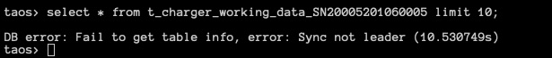
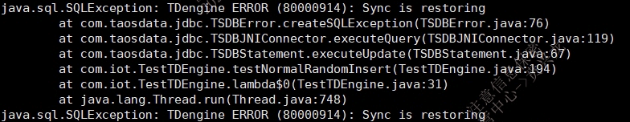
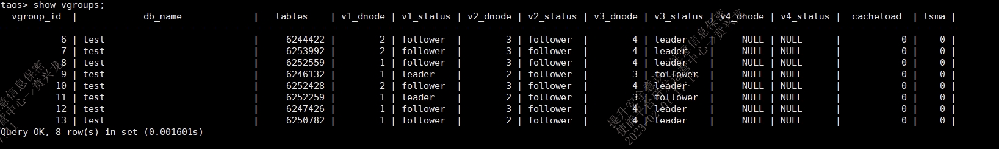

# 多副本管理模块-Function Spec

## 1. 修订记录

| 编写日期 | 发布日期 | 版本 | 修订人 | 主要修改内容 |
| --- | --- | --- | --- | --- |
| 2025-01-18 | 2025-01-18 | 1.0 | 鲍之骁 | 第一次安可送测 |
| 2025-12-10 | 2025-12-10 | 1.1 | 程洪泽 | 重构文档 |

## 2. 背景

### 2.1 功能背景

1. **数据增长与关键业务依赖**
TDengine 作为时序数据库，存储的是按时间序列排列的海量数据，这些数据对于众多行业的关键业务至关重要。例如，在能源管理领域，电力公司依靠 TDengine 存储电网的实时电力数据，用于电力调配和故障检测；在工业自动化中，工厂通过它记录设备传感器数据，以实现预测性维护。数据量的不断增长和业务对数据的高度依赖，使得数据丢失的风险成本急剧上升。
1. **数据安全威胁**
随着网络环境的日益复杂，数据面临着多种安全威胁。网络攻击手段不断升级，如黑客入侵、恶意软件感染等，可能会破坏或篡改存储在 TDengine 中的数据。同时，内部人员的误操作，如错误的删除或修改操作，也可能导致数据丢失或不一致。
1. **硬件和软件故障风险**
硬件故障是不可避免的，服务器的硬盘故障、内存损坏或者网络设备问题等都可能导致数据存储或传输出现问题。而且，软件系统本身也可能存在漏洞或升级过程中出现兼容性问题，这可能会影响数据的正常存储和访问。例如，在 TDengine 进行软件升级时，可能会出现意外的程序错误，导致数据完整性受损。
1. **灾难恢复需求**
无论是自然灾害（如地震、洪水）还是人为灾难（如火灾、数据中心故障），都可能使数据中心瘫痪。如果数据没有副本存储在其他安全的位置，那么所有数据都可能丢失，这对于依赖 TDengine 数据的业务来说是毁灭性的打击。

### 2.2 功能**目标**

1. **数据高可用性**
通过多副本管理，确保在面对各种故障和灾难场景时，TDengine 中的数据始终能够被访问和使用。即使部分副本不可用，其他副本也可以迅速接替，保证业务的持续运行，减少停机时间。
1. **灾难恢复能力提升**
优化灾难恢复流程，在遭受灾难后能够快速利用副本数据进行恢复。通过合理的副本分布和备份策略，缩短恢复时间，降低数据丢失的风险，确保企业能够在灾难后尽快恢复正常业务运营。

## 3. 定义

1. **同步模块（sync) **：负责 TDengine 数据库高可用的功能模块，使用 raft 协议实现。
2. **Raft 协议(raft) **：一种分布式一致性算法，TDengine 多副本管理依托此协议来确保副本间的同步与一致性，实现 leader 选举、日志复制等关键操作。
3. **领导者（Leader）**：在 Raft 集群中，领导者是核心角色。它负责接收客户端请求，将操作请求转换为日志条目（Log Entries），并将这些日志条目复制到其他节点（跟随者，Followers）。同时，它还会定期发送心跳（Heartbeat）消息给其他节点，以表明自己的存活状态，防止其他节点触发新的选举。领导者对于整个集群的协调和数据一致性维护起着关键作用，例如在数据写入操作中，领导者决定写入的顺序和时间，并确保所有副本最终都按照这个顺序完成写入。
4. **跟随者 (Follower) **：跟随者是 Raft 集群中的节点类型之一，它们接收并保存领导者复制过来的日志条目。跟随者会响应领导者的心跳消息，以表明自己处于存活且正常工作的状态。在正常情况下，跟随者主要是被动地接收和存储日志，不主动处理客户端请求，但会参与选举过程。当它们在选举超时时间内没有收到领导者的心跳消息时，会转换为候选人（Candidate）参与选举，以选出新的领导者。
5. **学习者（Learner）**：学习者是一种特殊的非投票节点，主要用于在不影响集群一致性决策的情况下接收数据更新。在一些扩展的 Raft 应用场景中，比如集群需要临时加入新节点进行数据同步或者在跨数据中心复制场景下，为了避免新节点过多地参与选举过程影响集群稳定性，引入了学习者的概念。学习者可以从领导者或其他节点那里获取日志更新，用于学习集群的当前状态，但在选举过程中通常没有投票权。
6. **多副本（Multi-Replica）**：指在 TDengine 数据库系统中，针对同一份数据存储多个相同的拷贝，分布于不同的存储位置，以提高数据的可用性、可靠性及容错能力。
7. **副本组（Replica Group**）：由一个 leader 及与之对应的多个 follower 组成，它们共同维护同一份数据的一致性。
8. **快照（Snapshot）**：在 Raft 算法中，快照是一种用于优化日志存储和提高系统性能的机制。随着时间的推移，日志会不断增长，这会占用大量的存储空间并且在恢复系统状态时可能需要回放大量的日志。快照就是对系统某一时刻状态的完整记录，包括状态机的当前状态和必要的元数据（如最后一条包含在快照中的日志索引和任期号）。通过创建快照，节点可以丢弃在快照之前的旧日志，减少日志存储量，并且在节点故障恢复等场景下，可以利用快照快速恢复到一个较新的状态，然后再应用快照之后的日志。
9. **选举（Election）**：选举是 Raft 集群在特定情况下（如领导者故障或者集群初始化）选择新领导者的过程。当触发选举时，跟随者会转换为候选人，候选人通过向其他节点发送请求投票（RequestVote）消息来争取选票。节点根据候选人的任期号和日志新旧程度等因素进行投票，只有获得集群中多数节点选票的候选人才能成为新的领导者。选举过程遵循严格的规则，包括任期号的递增、多数派投票原则和日志完整性检查等，以确保选举出的领导者能够正确地领导集群，维护系统的一致性和可靠性。
10. **任期（Term）**：任期是一个单调递增的整数，用于划分不同的选举阶段。在选举中，候选人凭借任期号争取投票，节点以此判断消息是否有效。它也用于日志复制，确保日志的合法性和顺序。故障恢复时，任期号会更新，新领导者会重新同步任期和日志状态。
11. **索引（Index）**：日志索引是标识日志位置的整数，从 1 开始递增。用于日志复制的顺序控制，领导者和跟随者通过索引交流复制进度。和快照关联，通过最后包含在快照中的日志索引划分界限。在故障恢复时帮助节点确定日志应用情况。
12. **切主 (Transfer leader) **：是指将系统的主节点（Leader）从当前节点切换到另一个节点的过程。这通常是因为原主节点出现故障或者其他原因导致其无法有效领导集群，需要一个新的节点来承担领导者的角色，以维持系统的正常运行和数据一致性。

## 4. 行为说明

### 4.1 用户行为

#### 4.1.1 创建数据库时指定副本数量

创建数据库时，用户可以根据数据库存储书的的特性来指定副本数量。例如数据的重要程度，业务对连续性的需求以及系统资源的实际配置等多方面考虑。目前支持指定**单副本**或**三副本**，**默认为单副本**。
**SQL 示例：**
创建数据库时，通过指定参数 replica 来指定当前数据库的副本数量。
```sql
create database if not exists db vgroups 10 buffer 10 replica 3
```

#### 4.1.2 手动修改数据库副本数量

数据库已经创建，由于业务变更导致数据库内数据的重要程度，对业务连续性的需求以及系统资源的实际配置发生扩展时，可以使用如下命令修改副本数量。
**SQL 示例：**
使用 alter 命令在单副本和三副本之间切换。
```plaintext
alter database db replica 3;
```

#### 4.1.3 调整副本分布

当 TDengine 用户出现以下场景时，可以手动调整副本的分布。
1. **硬件资源变化：**当部分节点出现硬件老化、性能衰退，如磁盘读写速度变慢、内存频繁报错，或者新增了性能卓越的服务器节点时，为保障整体系统性能与数据可靠性，需要重新调整副本分布。将重要副本从濒临故障的硬件迁移至新节点，确保数据安全，同时利用新节点资源提升读写效率。
2. **网络状况波动：**网络架构升级、网络链路故障修复，或是遭遇区域性网络拥塞、延迟骤增等情况，会打破原有的副本间高效通信模式。此时，为维持副本同步的及时性，避免数据一致性问题，需依据网络新态势重新布局副本，例如将经常同步超时的副本迁移至网络连接更稳定的节点。
3. **业务负载变更：**业务高峰期与低谷期交替，某些时段特定业务模块的数据读写量剧增，造成部分节点负载过高，而其他节点相对空闲。为实现负载均衡，确保系统平稳运行，可动态调整副本分布，将高频访问数据的副本分散至负载较轻节点，优化资源利用率，防止热点过载。
4. **数据中心维护或灾难应对：**数据中心计划内维护、升级改造，或面临自然灾害、意外断电等不可抗力风险时，为保障业务连续性，需紧急将副本迁移至其他可靠数据中心或备用节点，降低数据丢失风险，维持系统不间断服务。
**SQL 示例：**
按照给定的 dnode 列表，调整 vgroup 中的 vnode 分布。因为副本数目最大为 3，所以最多输入 3 个 dnode。
```plaintext
REDISTRIBUTE VGROUP vgroup_no DNODE dnode_id1 [DNODE dnode_id2] [DNODE dnode_id3]
```

#### 4.1.4 调整副本组 leader 分布

当观测到多个副本组的 leader 集中在某个数据节点时，由于 leader 占用了更多的 cpu ， io ，内存等硬件资源，出现 leader 分布不均时，可能会影响集群工作状态。您可以使用以下命令调整整个集群的所有副本组的 leader 分布。
**SQL 示例：**
```plaintext
BALANCE VGROUP LEADER
```

注意：
调整副本组 leader 分布无法支持指定 leader 到某一节点，只能发起重新选举，leader 会重新随机分布。

#### 4.1.5 查看副本分布以及副本状态

可以使用如下命名查看当前的副本分布以及副本状态。
**SQL 示例：**
```sql
SHOW [db_name.]VGROUPS;
```

#### 4.1.6 恢复数据节点 

当集群中的某个数据节点（dnode）的数据全部丢失或被破坏，比如磁盘损坏或者目录被误删除，可以通过 restore dnode 命令来恢复该数据节点上的部分或全部逻辑节点，该功能依赖多副本中的其它副本进行数据复制，所以只在集群中 dnode 数量大于等于 3 且副本数为 3 的情况下能够工作。
**SQL示例：**
```sql
restore dnode <dnode_id>；# 恢复dnode上的mnode，所有vnode和qnode
restore mnode on dnode <dnode_id>；# 恢复dnode上的mnode
restore vnode on dnode <dnode_id> ；# 恢复dnode上的所有vnode
restore qnode on dnode <dnode_id>；# 恢复dnode上的qnode
```

**限制：**
1. 该功能是基于已有的复制功能的恢复，不是灾难恢复或者备份恢复，所以对于要恢复的 mnode 和 vnode来说，使用该命令的前提是还存在该 mnode 或 vnode 的其它两个副本仍然能够正常工作。
2. 该命令不能修复数据目录中的个别文件的损坏或者丢失。例如，如果某个 mnode 或者 vnode 中的个别文件或数据损坏，无法单独恢复损坏的某个文件或者某块数据。此时，可以选择将该 mnode/vnode 的数据全部清空再进行恢复。

#### 4.1.7 mnode 实现多副本

如果希望提升系统或元数据的高可用性，可以通过创建更多 mnode 的方式来提高系统可用性。创建一个 mnode 等同于 mnode 所在的副本组增加一个副本。
**SQL 示例：**
```sql
CREATE MNODE ON DNODE dnode_id
```

**限制：**
一个集群最多存在三个 MNODE，一个 DNODE 上只能创建一个 MNODE。

### 4.2 相关配置参数

| 参数名称 | 支持版本 | 动态修改 | 参数含义 |
| --- | --- | --- | --- |
| syncLogBufferMemoryAllowed | 3.0 | 支持动态修改 立即生效 | 一个 dnode 允许的 sync 日志缓存消息占用的内存最大值，单位 bytes，取值范围 104857600-INT64_MAX，默认值 服务器内存的 1/10 |
| syncElectInterval | 3.0 | 不支持动态修改 | 同步模块发起选举的间隔时间。 |
| syncHeartbeatInterval | 3.0 | 不支持动态修改 | 同步模块发送心跳的间隔时间。 |
| syncHeartbeatTimeout | 3.0 | 不支持动态修改 | 同步模块心跳超时时间。 |
| syncSnapReplMaxWaitN | 3.0 | 支持动态修改 立即生效 |  |
| sDebugFlag | 3.0 | 支持动态修改 理解生效 | sync 模块的日志开关，131（输出错误和警告日志），135（输出错误、警告和调试日志），143（输出错误、警告、调试和跟踪日志） |

### 4.3 相关错误信息排查

| 错误码 | 错误描述 | 可能的出错场景或者可能的原因 | 建议用户采取的措施 |
| --- | --- | --- | --- |
| 0x80000903 | Sync timeout | 场景1：发生了切主，旧主节点上已经开始协商但尚未达成一致的请求将超时。<br>场景2：从节点响应超时，导致协商超时。 | 检查集群状态，例如：show vgroups 查看服务端日志，以及服务端节点之间的网络状况。 |
| 0x8000090C | Sync leader is unreachable | 场景1：选主过程中。<br>场景2：客户端请求路由到了从节点，且重定向失败。<br>场景3：客户端或服务端网络配置错误。 | 检查集群状态、网络配置、应用程序访问状态等。查看服务端日志，以及服务端节点之间的网络状况。 |
| 0x8000090F | Sync new config error | 成员变更配置错误 | 内部错误，用户无法干预 |
| 0x80000911 | Sync not ready to propose | 场景1：恢复未完成 | 检查集群状态，例如：show vgroups。查看服务端日志，以及服务端节点之间的网络状况。 |
| 0x80000914 | Sync leader is restoring | 场景1：发生了切主，选主后，日志重演中 | 检查集群状态，例如：show vgroups。查看服务端日志，观察恢复进度。 |
| 0x80000915 | Sync invalid snapshot msg | 快照复制消息错误 | 服务端内部错误 |
| 0x80000916 | Sync buffer is full | 场景1：客户端请求并发数特别大，超过了服务端处理能力，或者因为网络和CPU资源严重不足，或者网络连接问题等。 | 检查集群状态，系统资源使用率（例如磁盘IO、CPU、网络通信等），以及节点之间网络连接状况。 |
| 0x80000917 | Sync write stall | 场景1：状态机执行被阻塞，例如因系统繁忙，磁盘IO资源严重不足，或落盘失败等。 | 检查集群状态，系统资源使用率（例如磁盘IO和CPU等），以及是否发生了落盘失败等。 |
| 0x80000918 | Sync negotiation win is full | 场景1：客户端请求并发数特别大，超过了服务端处理能力，或者因为网络和CPU资源严重不足，或者网络连接问题等。 | 检查集群状态，系统资源使用率（例如磁盘IO、CPU、网络通信等），以及节点之间网络连接状况。 |
| 0x800009FF | Sync internal error | 其它内部错误 | 检查集群状态，例如：show vgroups |

## 5. 性能

1. **写入性能：**在开启多副本模式下，数据写入的吞吐量相比单副本模式下降幅度不超过 15%，确保系统在保障数据可靠性的同时，不影响大规模时序数据的实时写入效率。单个副本的写入延迟不超过 5 毫秒，满足高频数据采集场景下的快速入库需求。
2. **查询性能：**从任意副本进行数据查询时，查询响应时间与单副本查询相比，平均增加不超过如 2 毫秒，保证用户在多副本环境下仍能快速获取所需数据，查询结果的准确性与一致性不受影响。
3. **副本创建性能：**创建单个副本的平均时间不超过  3 秒，批量创建时，平均创建时间不超过5 秒 / 个 ，确保新数据能及时得到多副本保护，不影响业务正常运转。
4. **同步性能：**实时同步副本间的同步延迟控制在 500 毫秒以内，保证强一致性需求；异步同步副本的最大延迟不超过5 分钟，满足一般性业务对最终一致性的要求。同步延迟波动范围应尽量小，确保数据稳定更新。
5. **故障切换性能：**从主副本故障判定到切换至可用副本的全过程耗时不超过 30 秒 ，最大限度减少业务中断时长，确保高并发场景下用户体验不受影响。切换期间系统资源占用率增长不超过  50% ，避免引发连锁反应导致系统雪崩。
6. **恢复性能：**恢复速率不应明显低于数据写入速度 ，使数据能够快速重回可用状态，降低业务损失风险。

## 6. 兼容性

1. 不兼容 TDengine 1.x 或 2.x，不支持用户直接从之前版本升级到多副本版本。
2. 兼容不同的操作系统（如 Linux、Windows、macOS 等）、硬件平台（如 x86、ARM 等）以及主流的存储设备，保障在多样化的部署环境下多副本功能正常运行。

## 7. 运维

1. 日志记录：系统异常记录到日志中，供运维人员排查问题。
2. 查看副本状态：提供命令查看副本数量，副本状态，副本组的 leader 和 follower 分布，副本是否完成恢复。
3. 手动迁移副本位置：支持通过 SQL 命令手动迁移某一副本位置。
4. 调整副本组 leader 分布：支持通过 SQL 命令调整副本组 leader 分布。

## 8. 使用场景

1. 高可用性要求场景：
在工业控制系统中，例如化工工厂的生产流程监测系统，每一个生产环节的实时数据都非常重要，任何数据丢失或不一致都可能导致生产事故。多副本模块可确保即使部分节点出现故障，数据仍能正常存储和查询，通过多个副本存储监测数据，保证数据的完整性和可用性。当一个工厂内的数据采集节点发生故障时，其他节点的副本可以继续提供服务，避免生产流程中断或失控。
1. 灾难恢复场景：
对于一些关键公共服务的数据存储，如城市供水系统的数据中心，面临着各种灾害风险，如洪水、飓风等。多副本可以将数据分布在不同地理区域的数据中心，一旦某个数据中心因灾害受损，可通过其他数据中心的副本进行数据恢复，减少因灾害导致的数据丢失风险。
1. 数据分析场景：
在大规模环境监测应用中，大量传感器持续产生时序数据，不同区域的数据分析中心可能需要从本地副本进行数据分析，避免因网络延迟影响数据分析的效率。通过多副本，将数据副本存储在靠近数据分析区域的节点上，加快数据分析的速度，同时也能保障数据的可靠性，防止单一数据源出现问题导致分析工作无法进行。例如，在空气质量监测系统中，多个监测点的传感器将数据发送到不同的数据存储节点，数据分析人员可以从本地的数据副本进行数据分析，避免跨区域的数据传输延迟影响分析的及时性。
1. 负载均衡场景：
在高并发的数据写入和读取场景中，多副本可以将负载分散到不同的节点上，避免单个节点成为性能瓶颈。例如，在智能物流系统中，大量的包裹追踪设备不断发送数据，多个副本可以分担数据存储和处理的压力，根据节点的资源情况和负载情况动态调整数据流向，提高系统的整体性能。各个物流节点的设备会产生海量的包裹位置和状态数据，多副本功能可确保这些数据能高效存储和处理，保证系统的流畅运行。

## 9. 约束和限制

1. 副本数量仅支持单副本和三副本，如果在创建数据库时，需要配置数据库为三副本，请确保 dnode 数量大于等于3。

## 10. 常见错误和排查

### 10.1 标准排查流程：（sync not leader或sync is restoring）类报错 

客户端应用程序请求，出现sync not leader或sync is restoring报错。可能导致原因：taosd节点重启或crash，导致切主。
**例如：**
taosc:


java app:


登录taos shell，查看各vgroups状态；检查集群是否已自动恢复。如果vgroup leader正常，表示节点已恢复。
**例如：**
若各个vgroup显示为leader状态。如果leader不带星*，表示已经恢复；否则，正在恢复中。


**参考命令:**
- show dnodes
- show vgroups；
同时建议，查看是否有节点crash或重启，并且搜集操作系统和taosd日志，查看机器系统监控cpu、内存、磁盘、网络等使用历史监控。  
**参考命令：**
- systemctl status taosd; 
- grep FATAL log/taosdlog.* 
- dmesg -T
- cat /proc/sys/kernel/core_pattern
如果有节点crash，并生成coredump文件；检查调用栈信息。
**参考命令： **
- gdb /usr/bin/taosd core-xxxx-xxx

## 11. 可观测性

无

## 12. 安装和卸载

本工具不单独发布，随 TDengine 产品安装包一起发布。

## 13. 文档

需要在官方文档中修改章节【10.1.1 taosd】【10.3.2 数据库】

## 14. 参考文档

无

## 15. 附录

无
