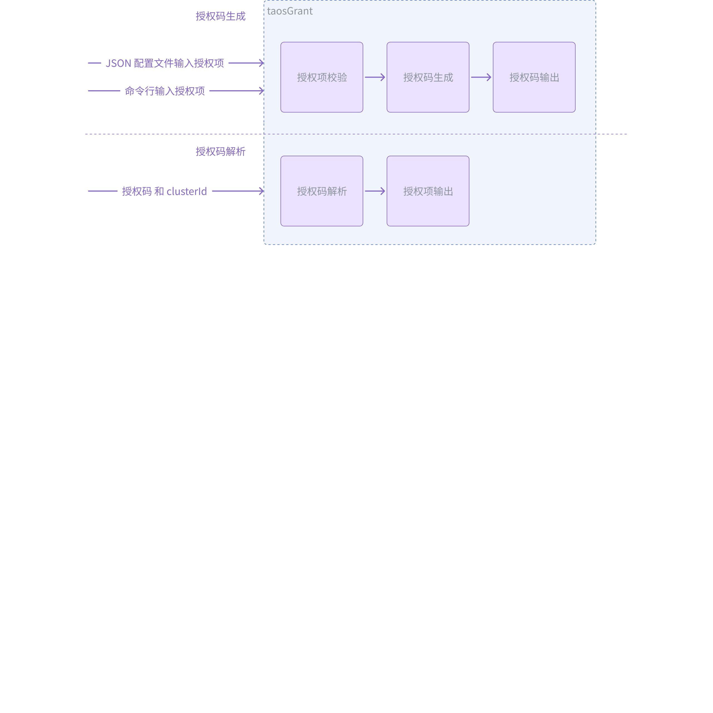
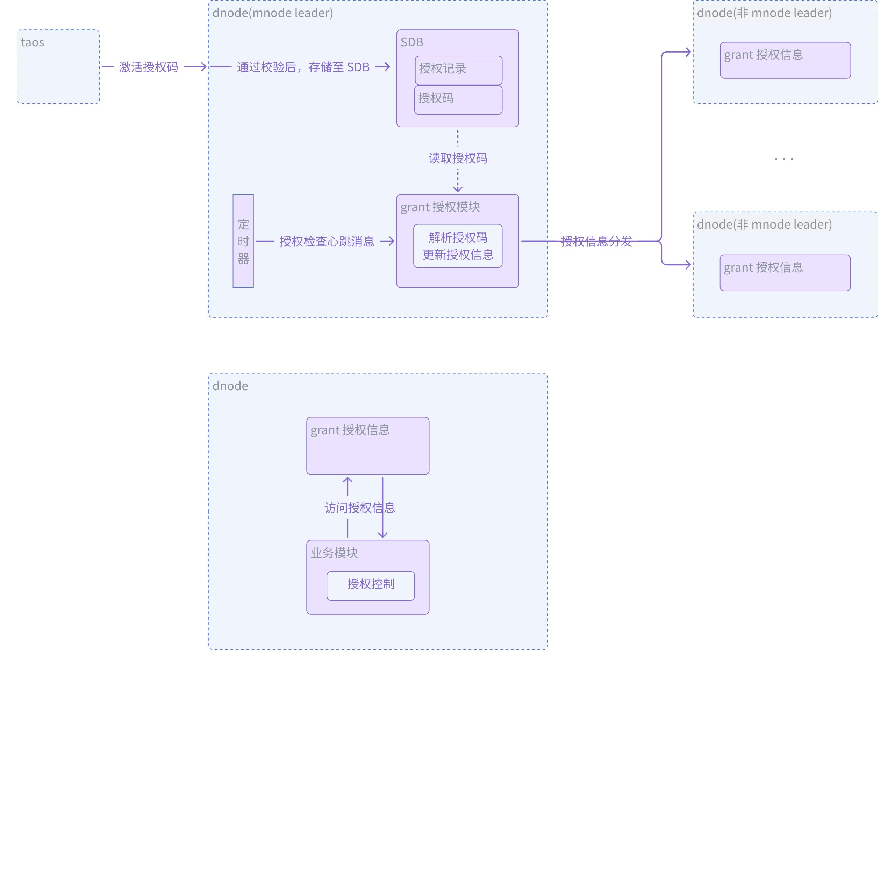
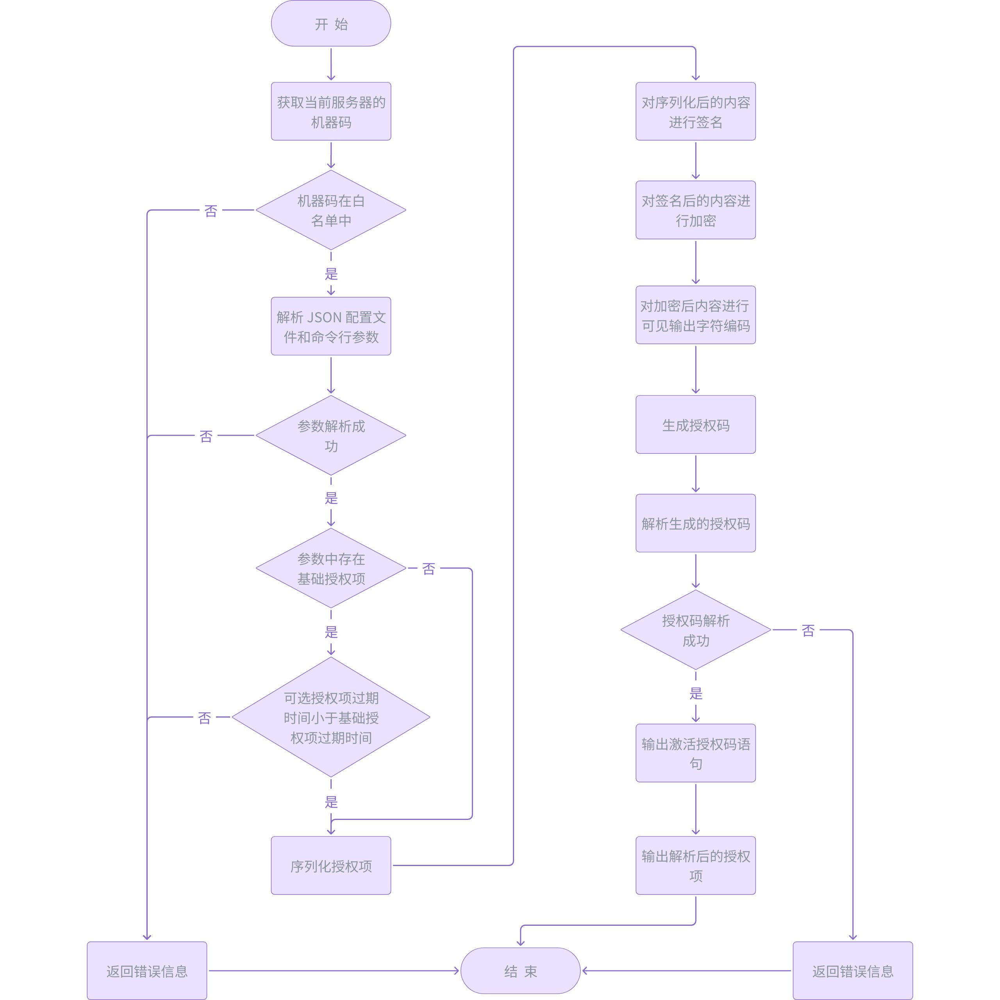
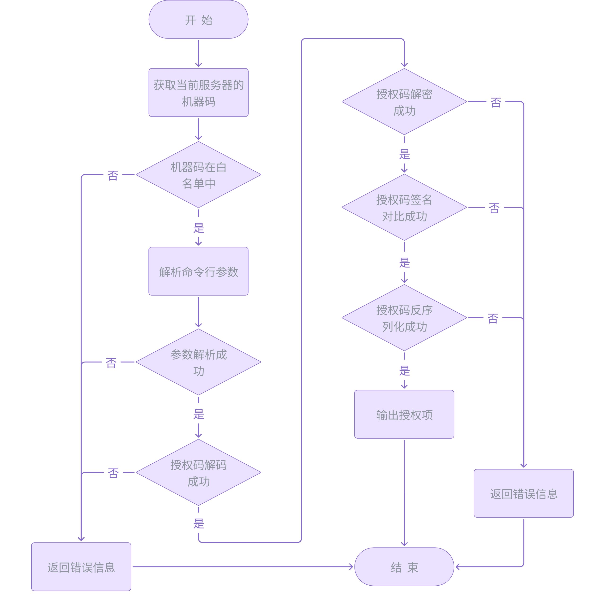
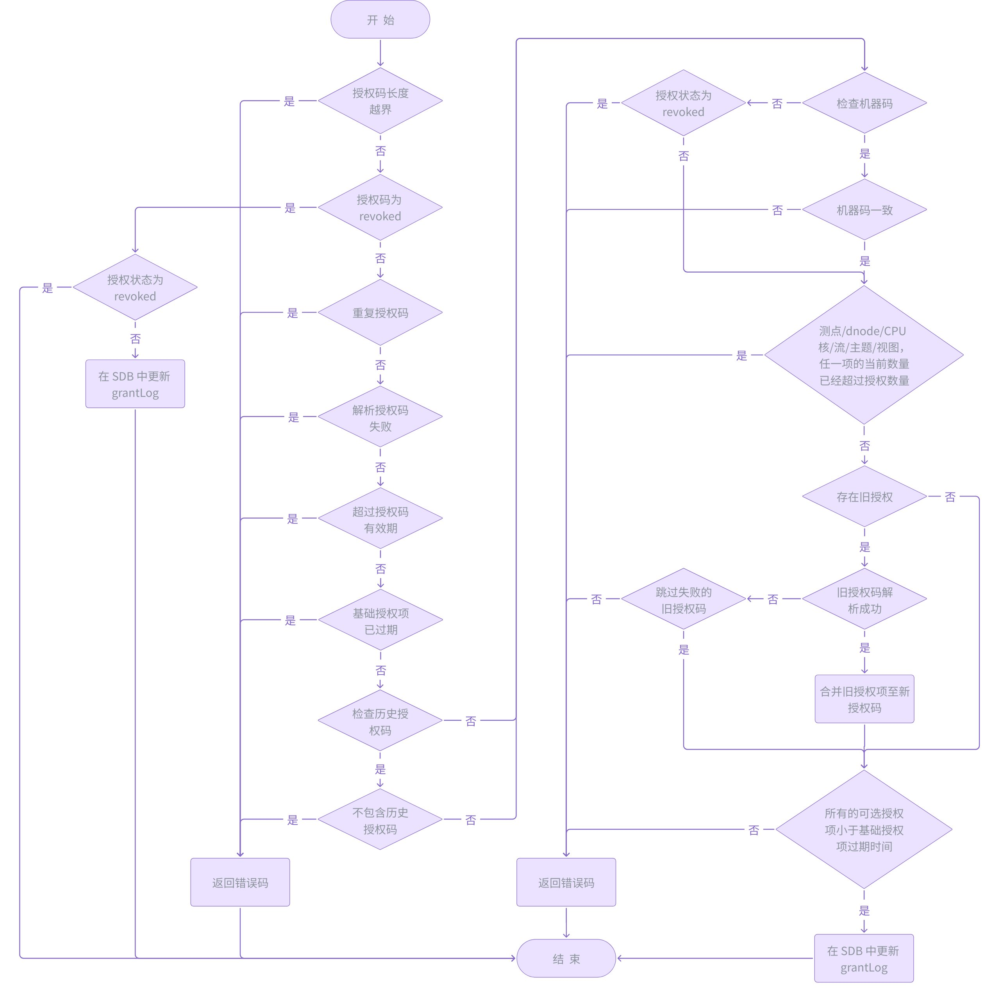
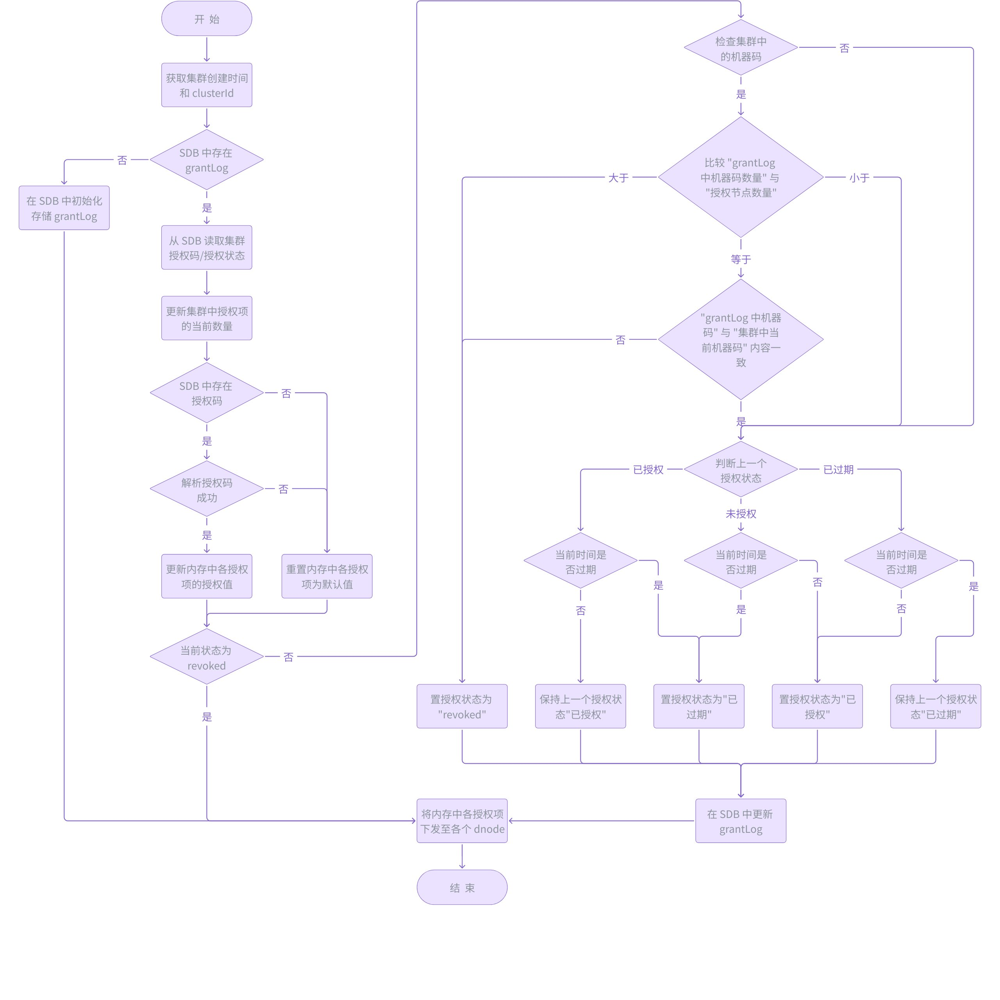

# 授权模块-Design Spec

## 1. 修订记录

| 编写日期 | 发布日期 | 版本 | 修订人 | 主要修改内容 |
| --- | --- | --- | --- | --- |
| 2025-01-15 | 2025-01-15 | 1.0 | 徐开礼 | 第一次安可送测 |
| 2025-12-28 | 2025-12-28 | 1.1 | 廖浩均 | 重构文档 |

## 2. 引言

1. 目的
本文档旨在详细说明 TDengine 数据库授权管理功能的设计与实现，确保开发团队对功能需求有清晰的理解。
1. 范围
本文档涵盖了 TDengine 数据库授权管理功能的设计细节，包括授权码的生成、激活与回收，以及授权功能的运行时检查。
1. 受众
本文档的目标受众为 TDengine 开发团队、测试团队、交付运维团队以及可能使用此功能的其他用户。

## 3. 术语

1. **TDengine**：一种高性能、支持分布式架构的时间序列数据库。
2. **数据节点（dnode）：**dnode 是 TDengine 服务器侧进程 taosd 在物理节点上的一个逻辑运行实例。在一个 TDengine 集群中，至少需要一个 dnode 来确保系统的正常运行。
3. **管理节点（mnode）：**mnode 是 TDengine 集群中的核心逻辑单元，负责监控和维护所有 dnode 的运行状态。作为元数据（包括用户、数据库、超级表等）的存储和管理中心，mnode 也被称为 MetaNode。
4. **SDB：**mnode** **中，用于存储元数据的内部使用的数据库，SDB 对用户不可见。
5. **授权码（activeCode）：**用于控制 TDengine 数据库功能的加密字符串。
6. **机器码（machineCode）：**基于服务器 CPU ID、核数、主板等硬件信息生成的唯一标识符。
7. **集群ID（clusterId）：**用于标识 TDengine 数据库集群的唯一标识符。
8. **授权工具（taosGrant）：**用于生成或解析授权码的工具。
9. **授权记录（grantLog）：**SDB 中存储的授权码、授权状态转换和授权历史记录等信息。
10. **授权回收状态（revoked）**：授权状态的一种，参照《授权管理-Function Spec》中 4.0 授权状态与授权流程。

## 4. 概述

1. 授权管理包括：使用`taosGrant 授权工具生成和解析授权码`、`taosd 授权运行时检查`、`业务模块使用授权信息进行授权控制`。
2. 业务模块授权控制的**基本原则**：无论授权项是否过期，都不能影响数据库的数据写入；授权项过期只可以限制数据的读取，或者与数据写入无关的创建类型任务。

### 4.1 taosGrant 授权工具

taosGrant 用于授权码的生成和解析。
1. 授权码生成：支持通过 `命令行` 和 `json 配置文件` 的方式，`单独`或者`组合`使用，其中，组合使用时命令行的优先级更高。
2. 授权码解析：通过命令行输入 `授权码`和 `集群 Id (clusterId)`，校验通过后，输出授权码中各授权项的值，否则，给出错误提示。
3. taosGrant 只能由交付团队使用。既要满足功能要求，也要易于使用。


图 1 taosGrant 功能架构图

### 4.2 taosd 授权管理

1. 授权码激活成功后，存储在 mnode SDB 中，如果 mnode 是多副本，则各个副本都会存储。
2. 集群中 mnode leader 定期会解析存储的授权码，更新内存中的授权信息，并将授权信息分发给集群中的除 mnode leader 以外的其他 dnode。
3. 各个业务模块在使用时，直接访问其所在 dnode 内存中的授权信息，根据各个授权项取值做出业务逻辑判断。


图 2 taosd 授权功能架构图

## 5. 设计考虑

### 5.1 taosGrant 工具

1. 作为授权码生成的核心工具，只能由交付团队使用，并且，只能在特定的服务器上运行。因此，启动时，需要检查服务器的机器码。如果机器码不识别，则在启动时退出并给出错误提示：
```sql
failed to execute in unauthorized server
```

1. 授权码生成时，输出直接可以执行的 SQL 命令，而不是仅输出授权码。
2. 授权码的生成和解析，要考虑安全性、兼容性和扩展性。

### 5.2 taosd 授权模块

#### 5.2.1 激活授权码

激活授权码时，如果通过各项条件的检查，则将授权码存储在 SDB 中。为了简化设计和防止出错，在激活授权码的逻辑中，并不直接调用授权码生效逻辑，而是通知 mnode 立即下发授权心跳，触发授权运行时检查模块完成授权码生效逻辑。

#### 5.2.2 授权运行时检查

1. taosd 授权运行时检查模块，根据 mnode 下发的授权心跳消息，每分钟定时执行一次，并更新内存中的授权项。定时执行，主要是防止内存中的授权项被非预期的篡改。
2. 在有新的 dnode 加入集群时，通知 mnode 立即下发授权心跳以触发授权信息更新及下发，以使新加入的 dnode 尽快收到授权信息。

## 6. 详细设计

### 6.1 组件设计

#### 6.1.1 taosGrant 生成授权码

taosGrant 生成授权码的流程如下：
```plaintext {wrap}
1）获取 taosGrant 执行所在的当前服务器机器码，与 taosGrant 中的机器码白名单进行对比，不在白名单中则报错退出。
2）解析 JSON 配置文件和命令行中输入的所有参数。如果存在语法/格式/取值范围等错误，则报错退出；如果 JSON 配置文件和命令行输入存在相同授权项，命令行授权项覆盖 JSON 配置文件中的相同授权项。
3）如果输入的授权项中包含基础授权项，如果其他输入的可选授权项过期时间大于基础授权项过期时间，则报错退出。
4）对输入的授权项进行序列化。
5）对序列化后的字符串进行签名。
6）对签名后的内容进行加密。
7）对加密后的内容进行 base58 编码，至此，授权码已经生成。
8）解析生成的授权码，如果解析失败，则报错退出。
9）输出可直接在 taos 中执行的授权语句：alter cluster 'activeCoce' '${activeCode}'
10）输出授权项。
11）结束。
```



图 3 taosGrant 生成授权码流程图

#### 6.1.2 taosGrant 解析授权码

taosGrant 解析授权码的流程如下：
```plaintext {wrap}
1）获取 taosGrant 执行所在的当前服务器机器码，与 taosGrant 中的机器码白名单进行对比，不在白名单中则报错退出。
2）解析命令行参数。
3）对授权码进行 base58 解码，失败则报错退出。
4）对解码后的二进制串进行解密，失败则报错退出。
5）对解密后的内容进行签名对比，失败则报错退出。
6）对解密后的内容进行反序列化，失败则报错退出。
7）输出授权项。
8）结束。
```



图 4 taosGrant 解析授权码流程图

#### 6.1.3 taosd 激活/回收授权码

1. 新增 TDMT_MND_CONFIG_CLUSTER 消息，处理授权码的激活操作。
2. 为防止事务冲突，TDMT_MND_CONFIG_CLUSTER 消息通过 mnode write 线程（注： mnode write 是单线程）处理。
3. 当执行下述命令时，会触发 TDMT_MND_CONFIG_CLUSTER 消息，mnode write 线程首先会调用消息处理函数 mndProcessConfigClusterReq 进行处理。根据关键词 activeCode，mndProcessConfigClusterReq 会进一步调用 mndProcessConfigGrantReq 完成授权码的激活操作。 当 ${activeCode} 取值为 revoked 时，即为 `回收授权码`。
```sql {wrap}
alter cluster 'activeCode' '${activeCode}'; 
```

1. 激活/回收授权码的流程如下：
```plaintext {wrap}
1）授权码长度检查。
2）授权码为 revoked。如果集群状态已经为 revoked，流程结束且返回成功，否则，置授权状态为 revoked，完成授权码回收流程。
3）重复授权码/解析失败/超过有效期/基础授权项过程/需要检查历史授权码但是 SDB 中不存在/需要检查机器码但是集群中的当前机器码与授权码中的不一致，均返回对应的错误码，激活流程失败。
4）测点/dnode/CPU 核/流计算/主题/视图功能任一项的当前数量，超过了授权码中指定的数量，返回对应的错误码，激活流程失败。
5）存在旧的授权码。解析成功，则与新授权码的各个授权项进行合并，后续流程，则基于合并后的授权码进行处理；解析失败时，如果新授权码是指定可跳过失败的旧授权码，则继续后续的激活流程，否则，返回对应的错误码，激活流程失败。
6）检查所有可选授权码的过期时间，是否都 <= 基础授权项的过期时间。如果不是，返回错误码，激活流程失败。
7）在 SDB 的 grantLog 中更新授权信息。
8）激活流程结束。
```



图 5 taosd 授权码激活流程图

#### 6.1.4 taosd 授权运行时检查

授权运行时检查在 mnode leader 的 write 线程执行，每一分钟执行一次。每次执行时进行如下操作：
```plaintext {wrap}
1）更新当前各授权项的当前数量。
2）重新解析授权码，更新内存中的授权项的授权值。
3）检查集群中, SDB grantLog 存储的机器码数量是否超出授权 dnode 节点数量以及内容是否一致。如果数量超出，或者数量相同但是内容不一致，则集群的授权状态置为 revoked 状态。
4）然后，再根据上一个授权状态和当前时间是否过期，更新 grantLog 的取值。
5）将 mnode leader 的各个授权项取值，下发给其他 dnode，以供业务模块使用。
6）授权运行时检查结束。
```



图 6 taosd 授权运行时检查流程图

#### 6.1.5 业务模块授权控制

内部业务模块的授权控制，由各个业务模块直接调用 [grantCheck](https://taosdata.feishu.cn/wiki/QCP1woxAKiKmCOkJI9OcVJ9onie#FX4LdIcQroob1YxdXCGchkylniL)/[grantCheckExpire](https://taosdata.feishu.cn/wiki/QCP1woxAKiKmCOkJI9OcVJ9onie#H6YFdo7PKo5KVJx58f2cogbenfg) 接口完成。

#### 6.1.6 管理节点收集集群机器码

管理节点中的 leader 会存储集群中所有 dnode 的机器码，并存储在 SDB 中，用于防止集群被未授权的复制使用。

### 6.2 关键数据结构

#### 6.2.1 SGrantObj 授权对象

用于生成/解析授权码
- taosGrant 工具生成授权码时，通过 JSON 配置文件或者命令行输入的各个授权项的值，均存储至 SGrantObj。生成授权码的 API，入参为 SGrantObj *pObj。
- taosGrant 工具解析授权码，或者 taosd 服务解析授权码时，根据授权码解析出来的各个授权项的值，也首先存储至 SGrantObj。再根据实际的业务需求，将 SGrantObj 拷贝至业务数据对象。
```c {wrap}
typedef struct {
  char    *active;
  char    *historicalActive;  
  SArray  *pMachines;         
  char     clusterId[GRANT_CLUSTER_ID_LEN + 1];
  int32_t  activeBufLen;
  uint32_t flags;
  uint32_t token[GRANT_UNIQ_TOKEN_NUM];
  union {
    uint64_t u0;
    struct {
      uint64_t version : 16;
      uint64_t validDays : 8;
      uint64_t distribute : 36;
      uint64_t granted : 1;
      uint64_t officialVersion : 1;
      uint64_t endecrypt : 1;
      uint64_t padding : 1;
    };
  };
  int64_t expireDays[GRANT_OPT_MAX];
  int64_t dataIns[GRANT_UNIQ_KNOWN_DATAIN_VALS];  // known dataIns: 3 * sizeof(int32_t) * CONN_TYPE_MAX
  int64_t limitCpuCores;
  int64_t limitDnodes;
  int64_t limitTimeSeries;
  int64_t limitStreams;
  int64_t limitSubscriptions;
  int64_t limitViews;
  int64_t reserve[32];

  // variant fields
  SArray *pDataIns;  // SGrantDataIns
  SArray *pItem64;  
  SArray *pItemI64; 
  SArray *pItemN64; 

  // extension
  char *encrypt;
} SGrantObj;
```

#### 6.2.2 SGrantStatus 授权状态

用于存储当前节点的授权状态。包括集群中各授权项的当前值，以及授权项的授权值。
```c
typedef struct {
  union {
    int64_t p1;
    struct {
      int64_t basicExpireSec : 42;
      int64_t limitDnodes : 16;
      int64_t placeHolder : 1;
      int64_t csvExpired : 1;
      int64_t multiTierExpired : 1;
      int64_t streamExpired : 1;
      int64_t subscriptionExpired : 1;
      int64_t viewExpired : 1;
    };
  };
  union {
    int64_t p2;
    struct {
      int64_t streamExpireSec : 42;
      int64_t limitStreams : 16;
      int64_t officialVersion : 6;
    };
  };

  union {
    int64_t p3;
    struct {
      int64_t subscriptionExpireSec : 42;
      int64_t limitSubscriptions : 16;
      int64_t grantState : 6;
    };
  };
  union {
    int64_t p4;
    struct {
      int64_t multiTierExpireSec : 42;
      int64_t curDnodes : 16;
      int64_t auditExpired : 1;
      int64_t expired : 1;
      int64_t objectStorageExpired : 1;
      int64_t dualReplicaHAExpired : 1;
      int64_t dbEncryptionExpired : 1;
      int64_t reserve2 : 3;
    };
  };
  union {
    int64_t p5;
    struct {
      int64_t auditExpireSec : 42;
      int64_t curStreams : 16;
      int64_t reserve3 : 6;
    };
  };
  union {
    int64_t p6;
    struct {
      int64_t csvExpireSec : 42;
      int64_t curSubscriptions : 16;
      int64_t checkUpTime : 1;
      int64_t checkMachineCode : 1;
      int64_t checkHistoricalActive : 1;
      int64_t skipOldActiveIfParseFail : 1;
      int64_t reserve4 : 2;
    };
  };
  union {
    int64_t p7;
    struct {
      int64_t bakRstExpireSec : 42;
      int64_t reserve5 : 22;
    };
  };
  union {
    int64_t p8;
    struct {
      int64_t serviceExpireSec : 42;
      int64_t reserve6 : 22;
    };
  };
  union {
    int64_t p9;
    struct {
      int64_t viewExpireSec : 42;
      int64_t nDiskCfg : 22;
    };
  };
  union {
    int64_t p10;  // since 3.3.0.0
    struct {
      int64_t objectStorageExpireSec : 42;
      int64_t reserve7 : 22;
    };
  };
  union {
    int64_t p11;  // since 3.3.0.0
    struct {
      int64_t activeActiveExpireSec : 42;
      int64_t reserve8 : 22;
    };
  };
  union {
    int64_t p12;  // since 3.3.0.0
    struct {
      int64_t dualReplicaHAExpireSec : 42;
      int64_t reserve9 : 22;
    };
  };
  union {
    int64_t p13;  // since 3.3.0.0
    struct {
      int64_t dbEncryptionExpireSec : 42;
      int64_t reserve10 : 22;
    };
  };
  union {
    int64_t p14;  // since 3.3.0.0
    struct {
      int64_t dataSyncExpireSec : 42;
      int64_t reserve11 : 22;
    };
  };
  int64_t revokedExpireSec;
  int64_t limitTimeSeries;
  int64_t limitCpuCores;
  int64_t limitViews;
  int64_t curTimeSeries;
  int64_t curCpuCores;
  int64_t curViews;
  // known dataIns
  SGrantDataIn dataIns[CONN_TYPE_DYN_MAX];
  // variants
  SArray *pDataIns;  // SGrantDataIns
  SArray *pItemN64;  // SGrantItem64
} SGrantStatus;
```

#### 6.2.3 SGrantLogObj 授权记录对象

用于记录授权记录和授权历史操作信息
```c
typedef struct {
  union {
    int64_t u0;
    struct {
      int64_t ts : 40;
      int64_t lastState : 4;
      int64_t state : 4;
      int64_t reason : 8;
      int64_t reserve : 8;
    };
  };
} SGrantState;

typedef struct {
  union {
    int64_t u0;
    struct {
      int64_t ts : 40;
      int64_t reserve : 24;
    };
  };
  char active[GRANT_ACTIVE_HEAD_LEN + 1];
} SGrantActive;

typedef struct {
  union {
    int64_t u0;
    struct {
      int64_t ts : 40;
      int64_t id : 24;
    };
  };
  char machine[TSDB_MACHINE_ID_LEN + 1];
} SGrantMachine;

typedef struct {
  int32_t      id;
  int8_t       nStates;
  int8_t       nActives;
  int64_t      createTime;
  int64_t      updateTime;
  int64_t      upgradeTime;
  SGrantState  states[GRANT_STATE_NUM];
  SGrantActive actives[GRANT_ACTIVE_NUM];
  char*        active;
  SArray*      pMachines;  // SGrantMachine
  SRWLatch     lock;
} SGrantLogObj;
```

#### 6.2.4 EGrantType 授权类型

用于标识不同的授权类型，可根据业务需求进行增加。
```c {wrap}
/**
 * @brief grant type 授权类型
 */
typedef enum {
  TSDB_GRANT_ALL,
  TSDB_GRANT_TIME,
  TSDB_GRANT_USER,
  TSDB_GRANT_DB,
  TSDB_GRANT_TIMESERIES,
  TSDB_GRANT_DNODE,
  TSDB_GRANT_ACCT,
  TSDB_GRANT_STORAGE,
  TSDB_GRANT_SPEED,
  TSDB_GRANT_QUERY_TIME,
  TSDB_GRANT_CONNS,
  TSDB_GRANT_STREAMS,
  TSDB_GRANT_CPU_CORES,
  TSDB_GRANT_STABLE,
  TSDB_GRANT_TABLE,
  TSDB_GRANT_SUBSCRIPTION,
  TSDB_GRANT_AUDIT,
  TSDB_GRANT_CSV,
  TSDB_GRANT_VIEW,
  TSDB_GRANT_MULTI_TIER,
  TSDB_GRANT_BACKUP_RESTORE,
  TSDB_GRANT_OBJECT_STORAGE,
  TSDB_GRANT_ACTIVE_ACTIVE,
  TSDB_GRANT_DUAL_REPLICA_HA,
  TSDB_GRANT_DB_ENCRYPTION,
} EGrantType;
```

## 7. 接口规范

### 7.1 taosGenerateGrant

```c {wrap}
/**
 * @brief 生成授权码
 *
 * @param grant
 * @param flag
 * @return int32_t 0 执行成功 非 0 错误码 执行失败
 */
int32_t taosGenerateGrant(SGrantObj *grant, int32_t flag);
```

### 7.2 taosParseGrant

```c {wrap}
/**
 * @brief 解析授权码
 *
 * @param grant
 * @param flag
 * @return int32_t 0 执行成功 非 0 错误码 执行失败
 */
int32_t taosParseGrant(SGrantObj *grant, int32_t flag);
```

### 7.3 mndProcessConfigGrantReq

```c
/**
 * @brief 用于处理激活授权的请求，即 alter cluster 'activeCode' 请求
 *
 * @param pMnode
 * @param pReq
 * @param pCfg
 * @return int32_t 0 激活成功 非 0 错误码 激活失败
 */
int32_t mndProcessConfigGrantReq(SMnode *pMnode, SRpcMsg *pReq, SMCfgClusterReq *pCfg);
```

### 7.4 mndProcessGrantHB

```c
/**
 * @brief 用于处理运行过程中的授权码检查及授权状态分发
 *
 * @param pReq
 * @return int32_t 0 执行成功 非 0 错误码 执行失败
 */
static int32_t mndProcessGrantHB(SRpcMsg *pReq);
```

### 7.5 grantCheck

业务模块在进行授权控制时，直接调用该接口，入参是授权类型。
```c
/**
 * @brief 用于检查某一授权项的过期时间及数量是否超过限制
 *
 * @param grant 授权类型
 * @return int32_t 0 授权未过期且数量未超过限制，非 0 错误码 授权过期或数量超过限制 
 */
int32_t grantCheck(EGrantType grant);
```

### 7.6 grantCheckExpire

业务模块在进行授权控制时，直接调用该接口，入参是授权类型。
```c
/**
 * @brief 用于检查某一授权项是否过期
 *
 * @param grant 授权类型
 * @return int32_t 0 授权未过期 非 0 错误码 授权已过期
 */
int32_t grantCheckExpire(EGrantType grant);
```

## 8. 安全设计

1. 授权码由 taosGrant 授权工具生成。
```c {wrap}
授权码生成时，会进行随机填充/序列化/签名校验/加密/编码等步骤，大大减少了被破解的可能性。
为了防止 taosGrant 外传，taosGrant 只能由交付团队的特定人员使用，且只能在特定的服务器上运行。
为了防止授权码在人为回收后被重复使用，增加了授权码有效期检查，以及授权码重复使用检查。
```

1. taosd 服务中授权码的解析过程，被封装为二进制库文件进行使用。
2. 为防止集群被未授权的复制使用，在授权运行时检查过程中，会对比集群服务器的机器码与初始授权时的集群机器码是否匹配。如果不匹配，集群会自动进入授权回收状态。
3. 授权信息检查过程中的不同节点之间的信息传递依赖于通信模块提供的传输安全性和可靠性保证，本模块认为在不同节点间信息传输过程中，能够避免传递的信息被篡改。

## 9. 性能和可扩展性

### 9.1 性能要求

taosd 服务中，授权运行时检查的执行过程，不能存在同步网络操作，且不存在明显的性能瓶颈。

### 9.2 可扩展性

1. 授权码生成和解析，以及授权状态展示过程，均要考虑和支持授权项动态增加，并且要支持升级和降级。
2. 升级和降级，通过支持动态扩展的编解码方式支持。在编码时，只能向后追加编码字段，不能修改前面的编码字段；在解码时， 根据解码二进制串，通过 tDecodeIsEnd 判断是否到达末尾，决定是否继续后边的解码过程。解码过程示例如下：
```c {wrap}
int32_t tDeserializeSXXXObj(void *buf, int32_t bufLen, SXXXObj *pObj) {
  SDecoder decoder = {0};
  int32_t  code = 0;
  int32_t  lino;
  tDecoderInit(&decoder, buf, bufLen);

  TAOS_CHECK_EXIT(tStartDecode(&decoder));
  TAOS_CHECK_EXIT(tDecodeI64(&decoder, &pObj->dbUid));
  TAOS_CHECK_EXIT(tDecodeCStrTo(&decoder, pObj->db));
  ...

  // version 1.1
  if (tDecodeIsEnd(&decoder)) {
    pObj->tw.skey = TSKEY_MIN;
    pObj->tw.ekey = TSKEY_MAX;
  } else {
    TAOS_CHECK_EXIT(tDecodeI64(&decoder, &pObj->tw.skey));
    TAOS_CHECK_EXIT(tDecodeI64(&decoder, &pObj->tw.ekey));
  }
  // version 1.2
  if (!tDecodeIsEnd(&decoder)) {
    TAOS_CHECK_EXIT(tDecodeI32(&decoder, &pObj->compactId));
  }
  // version 1.x
  //if (!tDecodeIsEnd(&decoder)) {
  // ...
  //}
  
  tEndDecode(&decoder);
_exit:
  tDecoderClear(&decoder);
  return code;
}
```

## 10. 部署和配置

### 10.1 版本控制和兼容性

1. taosGrant 授权工具和 taosd 服务，均要支持向后兼容，且尽最大可能支持前向兼容(除非因为对数据结构的定义预计不足，导致无法继续满足前向兼容)。
2. 前后向兼容均通过支持动态扩展的编解码方式支持（参照：[可扩展性](https://taosdata.feishu.cn/wiki/QCP1woxAKiKmCOkJI9OcVJ9onie#JFQFdSSPXoR3X5xZ96acGS0vnrh)）。
3. Linux、Windows、Arm64 等平台按同样逻辑实现。

## 11. 监控和维护

1. 使用 taosGrant 授权工具生成授权码时，对任一输入的授权项，要对语法和语义进行严格的检查，未通过检查时要给出明确的错误信息，并给出正确输入的格式和示例说明。
2. 激活授权码时，执行异常和执行成功均要记录包含特定字符串（例如，grant）的日志，且执行成功要记录审计日志，以便于问题排查及审计。
3. [授权运行时检查](https://taosdata.feishu.cn/wiki/QCP1woxAKiKmCOkJI9OcVJ9onie#KTTZde0AqorSo6xKCCIcyR29nGb)和业务模块的授权控制，在异常时，均要记录错误日志，且返回特定的错误信息。

## 12. 参考资料

1. [TDengine 技术内幕-整体架构](https://docs.taosdata.com/tdinternal/arch/)
2. 授权管理-需求说明
3. 授权管理-Function Spec
4. 授权管理-Test Spec
