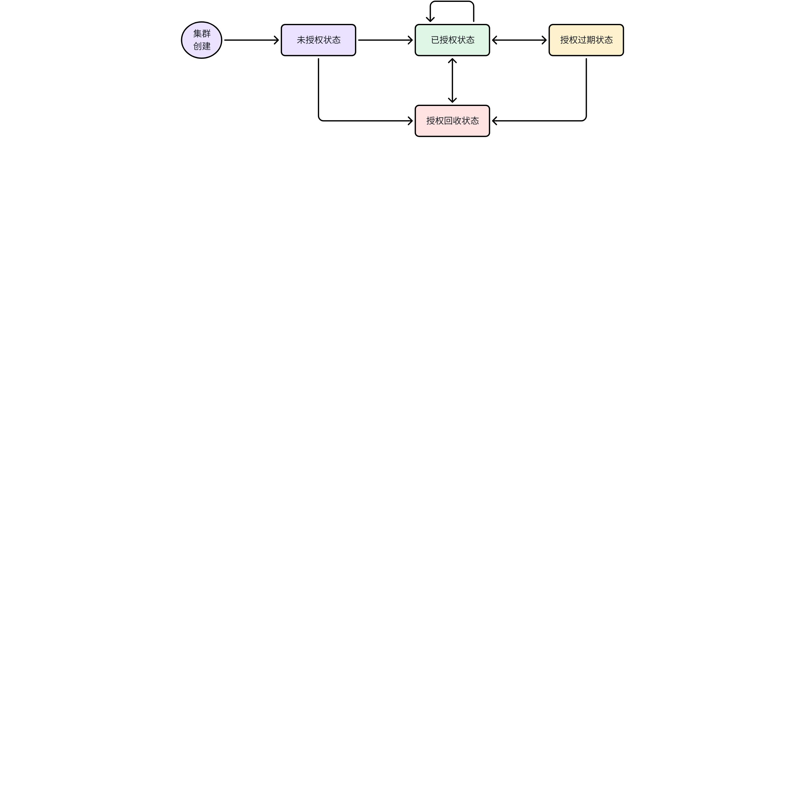

# 授权模块-Function Spec

## 1. 修订记录

| 编写日期 | 发布日期 | 版本 | 修订人 | 主要修改内容 |
| --- | --- | --- | --- | --- |
| 2024-01-12 | 2024-01-12 | 1.0 | 徐开礼 | 第一次安可送测 |
| 2025-12-26 | 2025-12-26 | 1.1 | 廖浩均 | 重构 |

## 2. 背景

支持以下新功能：1）采用单一授权码控制 TDengine 的基本功能和各项可选功能；2）授权码基于 clusterId 发放，并能够禁止用户复制集群中所有数据以使用相同的 clusterId 对多个集群进行授权的行为。

## 3. 定义

1. **机器码 (machineCode)：**根据服务器的 CPU ID/核数，主板或 MAC 信息生成的固定字符串，用于授权时标识某一台固定的服务器。
2. **授权码 (activeCode)：**对可授权的部分或所有功能项加密生成的字符串，用于辅助完成对 TDengine 可授权功能项的控制。

## 4. 行为说明

### 4.1 授权状态与授权流程

1. 授权是针对整个集群的行为，授权检查也是针对整个集群的行为。
2. 集群的授权状态(state) 包括：未授权状态(ungranted)/已授权状态(granted)/授权过期状态(expired)/授权回收状态(revoked)。各个状态的转换和触发方式如下：



| 源状态 | 目标状态 | 状态转换操作 | 触发方式 |
| --- | --- | --- | --- |
| 已授权 | 设置授权码 | 手动 |
| 授权回收 | 识别硬件变更 | 自动识别 |
| 授权过期 | 基础功能的授权时间过期 | 自动识别 |
| 回收授权码 | 手动 |
| 硬件信息变更 | 自动识别 |
| 已授权 | 叠加授权码（可与设置授权码的操作方法相同） | 手动 |
| 授权回收 | 识别硬件变更 | 自动识别 |
| 已授权 | 设置授权码 | 手动 |
| 授权回收 | 已授权 | 设置授权码 | 手动 |

1. TDengine 安装完成后，如果未设置授权码，集群处于未授权状态，授权项取默认值(参考 4.4.2.1)。
2. 如果要设置授权码，按如下步骤操作：
```cpp {wrap}
step 1）确定授权项和具体的数值
step 2）获取集群的 clusterId 和 机器码(可选，参考 4.3.2) 
step 3）通过 taosGrant 授权工具生成授权码(参考 4.3)
step 4）激活授权码(参考 4.4.1)
step 5）查看授权项(参考 4.4.4)
```

### 4.2 可授权功能列表

1. 基础功能 （必选，以下其它功能皆为可选）
2. 维保服务4
3. 多级存储 
4. 数据订阅
5. 流计算
6. 审计日志
7. 数据备份与恢复
8. 数据同步（数据同步是指从本集群将数据同步到另一集群）
9. 视图功能
10. 数据源导入 (TD 3.0->TD 3.0)
11. 数据源导入 (TD 2.0->TD 3.0)
12. 数据源导入 - Pi
13. 数据源导入 - OPC UA
14. 数据源导入 - OPC DA
15. 数据源导入 - Kafka 
16. 数据源导入 - MQTT
17. 数据源导入 - InfluxDB
18. 数据源导入 - OpenTSDB
19. 数据源导入 - avevaHistorian
20. 数据源导入 - MySQL
21. 数据源导入 - Postgres
22. 数据源导入 - Oracle
23. 数据源导入 - MSSQL
24. 数据源导入 - MongoDB
25. 数据源导入 - CSV
以上功能均可单独或组合进行授权。但对于任意一个集群来说，必须先有基础功能的授权，才能对其它功能进行授权。可选功能可以和基础功能一起授权，也可以在基础功能已经授权的基础上进行授权。如果基础功能的授权到期时间为 A ，则任意可选功能的授权到期时间必须 <=A ，即可选功能不能在基础功能授权已经失效的情况下继续工作。
数据同步功能依赖数据订阅功能，如果授权了数据同步功能则自动授权数据订阅功能。

### 4.3 生成授权码

授权码通过 `taosGrant` 生成。

#### 4.3.1 授权码的种类

1. 授权码分为 2 类：`普通授权码`和 `特殊授权码`
普通授权码，生成时包含 clusterId，但是不包含 machine code，适用于大多数场景下的授权使用。
特殊授权码，生成时包含 clusterId 和 machine code，适用于 dnode 所在的服务器(具体为 CPU 和 CPU 核数，主板或MAC) 变更场景下的使用。
1. 另外，普通授权码和特殊授权码均满足如下需求：
```bash {wrap}
1）普通授权码和特殊授权码，都可以包含上次授权码的摘要信息。
2）授权码包含 encode / decode 的版本号，便于以后扩展解析、加密方法。
3）授权码包含生成时间、激活时限，以应对“必须在发放日期的 3 天之内使用，超过 3 天后失效”的需求，“激活时限”默认值为 3 天
4）授权码支持不检查硬件变更的选项，作为超融合需求的后门。使用此类授权码的集群可以随意复制，不会自动进入回收状态（可手动进入） 
5）授权码的字符串内容只包含大小写字母和数字，不包含其他字符
6）授权码的字符串长度不固定，随授权项数目不同而变化，完整授权的授权码很长，叠加授权则很短
7）授权码的字符串内容不宜过长，通常不超过 1000 字节
```

#### 4.3.2 获取 clusterId 和 machineCode 列表

新增命令 `show cluster machines`，用于获取生成授权码需要的信息。其中，第一部分( 以 ; 分隔)为 clusterId，第二部分为 dnode 数量，第三部分为 machineCode 列表，第四部分为 TDengine 版本号。machine_code 仅在生成 `特殊授权码` 时需要，clusterId 在生成 `普通授权码` 和 `特殊授权码` 时都需要。
```cpp
taos> show cluster machines\G;
*************************** 1.row ***************************
       id: 1170328946539336423
dnode_num: 3 
  machine: JGQ8Y+huRyiz4lHnR9gHngYx,JGQ8Y+huRyiz4lHnR9gHngYx,JGQ8Y+huRyiz4lHnR9gHngYx
  version: 3.3.5.0.alpha
```

#### 4.3.3 taosGrant 授权工具使用方式

1. taosGrant 满足如下需求：
```bash {wrap}
1）taosGrant 只能在固定的几台服务器上运行，如需在其他服务器上运行需要重新编译。
2）服务器由交付组统一提供，包括平时测试时使用 taosGrant。
```

1. 所有需要设置的授权项，必须通过对应的命令行参数显式指定。
```cpp {wrap}
1）通过 taosGrant 生成授权码时，如果某个授权项未指定，则该授权项在授权码中表示未赋值/或未授权。
2) 未指定的授权项，在 show grants 显示时，均显示默认值。
```

1. taosGrant 命令行参数及取值说明(实际参数如有变化请参考 taosGrant --help|-h 输出的帮助信息)

| 命令行参数 | 可选 功能 | 授权信息 | 取值范围 un 是 unlimited 的简写 | 单位 | 备注 |
| --- | --- | --- | --- | --- | --- |
| --help|-h | N/A | N/A |  | N/A | Print Help |
| --key|-k | N/A | N/A |  | N/A | clusterId |
| --active|-a activeCode | N/A | N/A | N/A | N/A | 授权码(用于解析) |
| --machine|-m machineCode[, machineCode] ... | N/A | N/A | 机器码是长度为 24 的字符串 | N/A | dnode 机器码列表。 使用场景：1）当集群处于 revoked 状态时，生成授权码时，必须通过 --machine 包含 show cluster machines 返回的机器码列表，才允许继续授权，否则授权过程会失败。2）如果集群不处于 revoked 状态，生成授权码时，也建议通过 --machine 包含 show cluster machines 返回的机器码列表，这样，如果集群当前的机器码列表不一致，则授权码不会生效。这样，可以防止同一个授权码在不同的集群中使用。 |
| --historical-active |-ha activeCode | N/A | N/A | 只能指定一个历史授权码 | N/A | 历史授权码 使用场景：用于生成包含历史授权码信息的授权码，通过该选项指定历史授权码。如果集群中不包含该历史授权码，则授权过程会失败。) |
| --check-machine option | N/A | N/A | [0 not check, 1 check], default:1 | N/A | whether to check machine codes。 使用场景：1）用于指定在集群运行过程中，是否定期检查集群中保存的机器码：1.1）如果集群中保存的机器码数量大于授权码中指定的 dnode 数量，集群会变为 revoked 状态; 1.2）如果数量相同，则检查集群保存的机器码与当前集群服务器的机器码是否一致，不一致则集群变为 revoked 状态；1.3）如果小于，则集群不会变成 revoked 状态; 2）在云服务环境，因为服务器授权码有可能发生变化，一般将该选项设置为 0；如果一定要设置为 1，可通过 --basic 将集群中授权的 dnode 数量设置的比实际服务器数量多一些(具体数量不好确定，与云服务器的环境有关)。 |
| --skip-old option | N/A | N/A | [0 not skip, 1 skip], default:0 | N/A | skip old active code if its parsing fails 使用场景：正常情况下，在进行授权操作时，如果授权项未在新授权码中指定，则会合并旧授权码中对应的授权项，合并生成一个新的授权码，并保存在集群中。异常情况下，集群中保存的旧授权码有可能解析失败。此时，如果新授权码生成时包含 --skip-old 1，则旧授权码解析失败时会跳过，直接应用新的授权码；否则，不包含 -- skip-old，则解析无法为集群继续授权。在正常情况下，一般不需要使用该选项。 |
| --decode-machine machineCode | N/A | N/A |  | N/A | input the machine code to decode |
| --valid-days days | N/A | N/A | [1,255], default:3 | N/A | valid days of the active code |
|  |  |  |  |  |  |
| --output-file|-o fileName | N/A | N/A | N/A | N/A | 输出文件名 - 绝对名称或相对名称(必须包含文件名，不支持只指定目录) 说明：输出内容为 JSON 格式 |
| --config-file|-c fileName | N/A | N/A | N/A | N/A | 配置文件名 - 绝对名称或相对名称 说明：输入内容为 JSON 格式 |
| expire: 基础功能过期时间 | [1970-01-01, 2970-01-01]，un(unlimited) | 天 |
| timeseries: 测点数 | [0,INT64_MAX]，un | 个 |
| dnode: dnode 数量 | [0,INT16_MAX]，un | 个 |
| cpu: CPU 核数 | [0,INT32_MAX]，un | 个 |
| expire: 流的过期时间 | [1970-01-01, 2970-01-01]，un | 天 | <= basic expire |
| num: 流的数量 | [0,INT16_MAX]，un | 个 |  |
| expire: 订阅功能过期时间 | [1970-01-01, 2970-01-01]，un |  | <= basic expire |
| num: subscription数量 | [0,INT16_MAX]，un | 个 |  |
| expire: 视图功能过期时间 | [1970-01-01, 2970-01-01]，un | 天 | <= basic expire |
| num: 视图数量 | [0,INT16_MAX]，un | 个 |  |
| --audit expire | 是 | 审计日志过期时间 | [1970-01-01, 2970-01-01]，un | 天 | <= basic expire |
| --csv expire | 是 | csv 文件导入 | [1970-01-01, 2970-01-01]，un | 天 | <= basic expire |
| --service expire | 是 | 维保服务过期时间 | [1970-01-01, 2970-01-01]，un | 天 | <= basic expire |
| --backup_restore|-br expire | 是 | 数据备份与恢复过期时间 | [1970-01-01, 2970-01-01]，un | 天 | <= basic expire |
| name: 数据源名称(说明：非显示名称) | 长度：不超过 31 个字符，不区分大小写。 取值：OPC_DA/OPC_UA/Pi/Kafka/InfluxDB/MQTT/avevaHistorian/OpenTSDB/TD2.6/TD3.0 及新增数据源 | N/A |  |
| expire: 数据源过期时间 | [0, INT32_MAX], un | 天 | <= basic expire |
| num: 数据源连接数量 | [0, INT32_MAX], un | 个 |  |
| speed: 数据限速 | [0,INT32_MAX], un | MB |  |

1. 支持通过配置文件输入。e.g. `taosGrant -c cfg/taosGrant.cfg.vendorA.20231231`
```json {wrap}
{
        "key": "123456789",
        "machine": "JGQ8Y+huRyiz4lHnR9gHngYx,JGQ8Y+huRyiz4lHnR9gHngYx,MKQ8M+h9Ryiz4XsnR9gHngAn",
        "historical-active": "UadLQmF2sQq24gO1KjOnHYBCJNG5bLmAUadLQmF2sQq24gO1KjOnHYBCJNG5bLm",
        "output-file": "/data/cfg/vendorA/taosGrant.output.20231231",
        "show": "1",
        "official": "1",
        "distribute": "2023-12-30 10:01:00",
        "basic": "2024-12-31,un,10,un",
        "stream": "2024-12-31,8",
        "subscription": "2024-12-31,8",
        "service": "2024-12-31",
        "storage": "2024-12-31",
        "audit": "2024-12-31",
        "csv": "2024-12-31",
        "view": "2024-12-31,8",
        "backup-restore": "2024-12-31",
        "object-storage": "2024-12-31",
        "active-active": "2024-12-31",
        "dual-replica": "2024-12-31",
        "db-encryption": "2024-12-31",
        "data-in": [
                "OPC_DA,2024-12-31,10,4096",
                "OPC_UA,2024-12-31,10,4096",
                "Pi,2024-12-31,10,4096",
                "Kafka,2024-12-31,10,4096",
                "influxDB,2024-12-31,10,4096",
                "MQTT,2024-12-31,10,4096",
                "avevaHistorian,2024-12-31,10,4096",
                "OpenTSDB,2024-12-31,10,4096",
                "TD2.6,2024-12-31,10,4096",
                "TD3.0,2024-12-31,10,4096",
                "MySQL,2024-12-31,10,4096",
                "PostGres,2024-12-31,10,4096",
                "Oracle,2024-12-31,10,4096"
        ]
}
```

1. 如果同时指定了 `命令行参数`和`配置文件`，优先取 `命令行参数`，命令行中未指定的项，取 `配置文件` 中的值。示例：
```bash
taosGrant --key 987654321 --data_in avevaHistorian,2023-10-01,100,1024 -c taosGrant.cfg
```

1. taosGrant 生成授权码时，会同时输出`解析授权码`的结果，用于校验与输入是否一致。示例如下：
```cpp {wrap}
示例1: 生成授权码 - 同时指定 "基础功能" 和部分 "可选功能"
$ ./taosGrant_linux64 -k 123456789 -m JGQ8Y+huRyiz4lHnR9gHngYx,JGQ8Y+huRyiz4lHnR9gHngYx --basic 2024-12-31,un,12,un --service 2024-12-31 --storage 2024-12-31 --stream 2024-12-31,8 --subscription 2024-12-31,8 --audit 2024-12-31 --csv 2024-12-31 --view 2024-12-31,8 --data-in td2.6,2024-12-31,10,1024 --data-in td3.0,2024-12-31,10,1024 --data-in mqtt,2024-12-31,20,4096
#ServerCode 123456789
alter cluster 'activeCode' 'pPwmkfB9VRVjgTyJ14OdQvRjKq7hY36+AuJqz9uFLm6qP7MilwF3Deczt6jYFdl0HFB4WyQPpDWms295AH5xk5sHxeHauFjOHoyOOu0VQirGIj5StnQ3ZsYiPlK2dDdmxiI+UrZ0N2bGIj5StnQ3ZsYiPlK2dDdmxiI+UrZ0N2bGIj5StnQ3ZsYiPlK2dDdmxiI+UrZ0N2bGIj5StnQ3ZsYiPlK2dDdmxiI+UrZ0N2asG1n55mrCyw==';
###################################################################################
                 TDengine: official version
               distribute: 2023-12-24 11:53:57
                   expire: 2024-12-31 08:00:00
            serviceExpire: 2024-12-31 08:00:00    
               timeseries: unlimited
                    dnode: 12
                      cpu: unlimited
   multiTierStorageExpire: 2024-12-31 08:00:00
              auditExpire: 2024-12-31 08:00:00
                csvExpire: 2024-12-31 08:00:00
               viewExpire: 2024-12-31 08:00:00
                     view: 8
             streamExpire: 2024-12-31 08:00:00
                   stream: 8
       subscriptionExpire: 2024-12-31 08:00:00
             subscription: 8
      backupRestoreExpire: undef
                   OPC_DA: {"expire":"undef"，"number":"undef", "speed":"undef"}
                   OPC_UA: {"expire":"undef"，"number":"undef", "speed":"undef"}
                       Pi: {"expire":"undef"，"number":"undef", "speed":"undef"}
                    Kafka: {"expire":"undef"，"number":"undef", "speed":"undef"}
                 InfluxDB: {"expire":"undef"，"number":"undef", "speed":"undef"}
                     MQTT: {"expire":"2024-12-31","number":"20","speed":"4096"}
           avevaHistorian: {"expire":"undef"，"number":"undef", "speed":"undef"}
                 OpenTSDB: {"expire":"undef"，"number":"undef", "speed":"undef"}
                    TD2.6: {"expire":"2024-12-31","number":"10","speed":"1024"}
                    TD3.0: {"expire":"2024-12-31","number":"10","speed":"1024"}
```

```cpp {wrap}
示例2: 生成授权码 - 只指定 "基础功能"
$ ./taosGrant_linux64 -k 123456789 -m JGQ8Y+huRyiz4lHnR9gHngYx,JGQ8Y+huRyiz4lHnR9gHngYx --basic 2024-12-31,un,12,un
#ServerCode 123456789
alter cluster 'activeCode' 'i5G0LX7nCn5jgTyJ14OdQso5sQINkCway97mk4FKksC/SD602UqOK9FeyW/4LXchHFB4WyQPpDUcUHhbJA+kNRxQeFskD6Q1PPyZy/5FQPbGIj5StnQ3ZsYiPlK2dDdmxiI+UrZ0N2bGIj5StnQ3ZsYiPlK2dDdmxiI+UrZ0N2bGIj5StnQ3ZsYiPlK2dDdmxiI+UrZ0N2bGIj5StnQ3ZsYiPlK2dDdmxiI+UrZ0N2ZHXBVytqzp/A==';
###################################################################################
                 TDengine: official version
               distribute: 2023-12-24 11:41:32
                   expire: 2024-12-31 08:00:00
            serviceExpire: undef
               timeseries: unlimited
                    dnode: 12
                      cpu: unlimited
   multiTierStorageExpire: undef
              auditExpire: undef
                csvExpire: undef
               viewExpire: undef
                     view: undef
             streamExpire: undef
                   stream: undef
       subscriptionExpire: undef
             subscription: undef
      backupRestoreExpire: undef
                   OPC_DA: {"expire":"undef"，"number":"undef", "speed":"undef"}
                   OPC_UA: {"expire":"undef"，"number":"undef", "speed":"undef"}
                       Pi: {"expire":"undef"，"number":"undef", "speed":"undef"}
                    Kafka: {"expire":"undef"，"number":"undef", "speed":"undef"}
                 InfluxDB: {"expire":"undef"，"number":"undef", "speed":"undef"}
                     MQTT: {"expire":"undef"，"number":"undef", "speed":"undef"}
           avevaHistorian: {"expire":"undef"，"number":"undef", "speed":"undef"}
                 OpenTSDB: {"expire":"undef"，"number":"undef", "speed":"undef"}
                    TD2.6: {"expire":"undef"，"number":"undef", "speed":"undef"}
                    TD3.0: {"expire":"undef"，"number":"undef", "speed":"undef"}
```

```cpp {wrap}
示例3: 生成授权码 - 只指定部分 "可选功能"
$ ./taosGrant_linux64 -k 123456789 -m JGQ8Y+huRyiz4lHnR9gHngYx --subscription 2024-06-30,8 --data-in kafka,2024-06-30,10,1024
#ServerCode 123456789
alter cluster 'activeCode' 'ksyVuaJk6xXaZf9yqdfTWR9HppsLPcUfUjOv0U4Se3S/SD602UqOK9FeyW/4LXchHFB4WyQPpDVCKA3vmQz57RxQeFskD6Q1WxlN1YfoZzHGIj5StnQ3ZsYiPlK2dDdmxiI+UrZ0N2bGIj5StnQ3ZsYiPlK2dDdmxiI+UrZ0N2bGIj5StnQ3ZsYiPlK2dDdmxiI+UrZ0N2bGIj5StnQ3ZsYiPlK2dDdmxiI+UrZ0N2aToLydT13XPw==';
###################################################################################
                 TDengine: official version
               distribute: 2023-12-24 11:47:11
                   expire: undef
            serviceExpire: undef
               timeseries: undef
                    dnode: undef
                      cpu: undef
   multiTierStorageExpire: undef
              auditExpire: undef
                csvExpire: undef
               viewExpire: undef
                     view: undef
             streamExpire: undef
                   stream: undef
              topicExpire: 2024-06-30 08:00:00
                    topic: 8
      backupRestoreExpire: undef
                   OPC_DA: {"expire":"undef"，"number":"undef", "speed":"undef"}
                   OPC_UA: {"expire":"undef"，"number":"undef", "speed":"undef"}
                       Pi: {"expire":"undef"，"number":"undef", "speed":"undef"}
                    Kafka: {"expire":"2024-06-30","number":"10","speed":"1024"}
                 InfluxDB: {"expire":"undef"，"number":"undef", "speed":"undef"}
                     MQTT: {"expire":"undef"，"number":"undef", "speed":"undef"}
           avevaHistorian: {"expire":"undef"，"number":"undef", "speed":"undef"}
                 OpenTSDB: {"expire":"undef"，"number":"undef", "speed":"undef"}
                    TD2.6: {"expire":"undef"，"number":"undef", "speed":"undef"}
                    TD3.0: {"expire":"undef"，"number":"undef", "speed":"undef"}
```

```cpp {wrap}
示例4: 生成授权码 - "基础功能" 参数不匹配时，会给出提示。
./taosGrant_linux64 -k 123456789 -m JGQ8Y+huRyiz4lHnR9gHngYx,JGQ8Y+huRyiz4lHnR9gHngYx --basic 2024-12-31,un,12 --storage 2024-12-31 --stream 2024-12-31,8 --subscription 2024-12-31,8 --audit 2024-12-31 --data-in td2.6,2024-12-31,10,1024 --data-in td3.0,2024-12-31,10,1024 --data-in mqtt,2024-12-31,20,100
failed to parse param:--basic 2024-12-31,un,12 since invalid param num:3, should be: expireDay(e.g. 2023-12-30),timeseriesNum,dnodeNum,cpuCoreNum
```

```cpp {wrap}
示例5: 生成授权码 - "可选功能" 参数不匹配时，会给出提示。
./taosGrant_linux64 -k 4153373684402528706 -m JGQ8Y+huRyiz4lHnR9gHngYx,JGQ8Y+huRyiz4lHnR9gHngYx --basic 2024-12-31,un,12,un --storage 2024-12-31,10 --stream 2024-12-31,8 --subscription 2024-12-31,8
failed to parse param:--storage 2024-12-31,10 since invalid param num:2, should be: expireDay(e.g. 2023-12-30)
```

```bash
示例6: 生成授权码 - "可选功能过期时间" 大于 "基础功能过期时间" 时，会给出提示。
./taosGrant_linux64 -k 4153373684402528706 -m JGQ8Y+huRyiz4lHnR9gHngYx,JGQ8Y+huRyiz4lHnR9gHngYx --basic 2024-12-31,un,12,un --storage 2025-12-31,10
failed to generate activeCode since storageExpire 2025-12-31 larger than basicExpire 2024-12-31
```

1. taosGrant 工具支持解析授权码。示例如下：
```cpp
示例1: 解析授权码 - 解析成功
$ ./taosGrant_linux64 -k 1234567890 -a RC0YyRTse4YXG/Pzn4dvFYyFvizRJETQXIGEHlsDXxyJsw8vdSGNVeczt6jYFdl0HFB4WyQPpDUcUHhbJA+kNZeg4J+egNHiWxlN1YfoZzHGIj5StnQ3ZsYiPlK2dDdmxiI+UrZ0N2bGI
j5StnQ3ZsYiPlK2dDdmxiI+UrZ0N2bGIj5StnQ3ZsYiPlK2dDdmxiI+UrZ0N2bGIj5StnQ3ZsYiPlK2dDdmxiI+UrZ0N2aw0SaT5VvClg==
                 TDengine: official version
               distribute: 2023-12-25 14:27:57
                   expire: 2024-12-31 08:00:00
            serviceExpire: undef
               timeseries: unlimited
                    dnode: 10
                      cpu: 1024
   multiTierStorageExpire: 2024-12-31 08:00:00
              auditExpire: undef
                csvExpire: undef
               viewExpire: undef
                     view: undef
             streamExpire: undef
                   stream: undef
          subscriptionExpire: undef
                subscription: undef
      backupRestoreExpire: undef
                   OPC_DA: {"expire":"undef"，"number":"undef", "speed":"undef"}
                   OPC_UA: {"expire":"undef"，"number":"undef", "speed":"undef"}
                       Pi: {"expire":"undef"，"number":"undef", "speed":"undef"}
                    Kafka: {"expire":"undef"，"number":"undef", "speed":"undef"}
                 InfluxDB: {"expire":"undef"，"number":"undef", "speed":"undef"}
                     MQTT: {"expire":"undef"，"number":"undef", "speed":"undef"}
           avevaHistorian: {"expire":"2024-12-31","number":"10","speed":"1024"}
                 OpenTSDB: {"expire":"undef"，"number":"undef", "speed":"undef"}
                    TD2.6: {"expire":"undef"，"number":"undef", "speed":"undef"}
                    TD3.0: {"expire":"undef"，"number":"undef", "speed":"undef"}
```

```cpp
示例2: 解析授权码 - 解析失败
./taosGrant_linux64 -k 123456789 -a RC0YyRTse4YXG/Pzn4dvFYyFvizRJETQXIGEHlsDXxyJsw8vdSGNVeczt6jYFdl0HFB4WyQPpDUcUHhbJA+kNZeg4J+egNHiWxlN1YfoZzHGIj5StnQ3ZsYiPlK2dDdmxiI+UrZ0N2bGIj5StnQ3ZsYiPlK2dDdmxiI+UrZ0N2bGIj5StnQ3ZsYiPlK2dDdmxiI+UrZ0N2bGIj5StnQ3ZsYiPlK2dDdmxiI+UrZ0N2aw0SaT5VvClg==
failed to parse uniq active code
```

#### 4.3.4 授权码发放时间

授权码中包含了其自身的发放时间。

#### 4.3.5 兼容性

1. Windows 版本、Linux 版本、Arm 版本按同样逻辑实现。
2. 机器码首选 CPU ID 和核数，主板序列号，网卡 mac。如果不能获取机器码，程序启动失败，报错 `failed to start dnode since Unable to get machine code`。
3. 标识机器码中，要标识其生成时使用的硬件信息，例如，CPU ID，主板信息，网卡信息等，便于后续升级兼容。

### 4.4 激活和查看授权码

#### 4.4.1 激活授权码

通过命令行设置：`alter cluster 'activeCode' '${activeCode}'`;
```cpp
// 示例：设置成功
taos> alter cluster 'activeCode' 'vtTGbKRtXyEr/OUU9SIzt/RjKq7hY36++jPZWx78cUsmyI9Q5adKdhY5c8cP3/5LDqy97T1mzcYcUHhbJA+kNawUyec/MAMWKgcqAeIKDq4dnribfbdOKsYiPlK2dDdmxiI+UrZ0N2bGIj5StnQ3ZsYiPlK2dDdmxiI+UrZ0N2bGIj5StnQ3ZsYiPlK2dDdmxiI+UrZ0N2bG
Ij5StnQ3ZsYiPlK2dDdmxiI+UrZ0N2aDYFtMUZadEQ==';
Query OK, 0 row(s) affected (0.007470s)
```

##### 4.4.1.1 激活时授权检查

1. 当集群初始化后，集群中 dnode 的 machineCode 也会被自动保存。在激活授权码时，不需要再额外获取 machineCode 并保存。
2. `普通授权码` 被激活时，如果存在 dnode machineCode 不一致，则激活失败;
3. `特殊授权码` 被激活时，如果存在 dnode machineCode 不一致，则会检查集群中 dnode 实际的 machineCode 与 `特殊授权码` 中的 machineCode 是否匹配。如果匹配，则重新保存 dnode 节点的 machineCode 以消除 machineCode 不一致的状态，并进行后续的授权动作; 如果不匹配，则激活失败。
4. 如果授权码中包含了上一个授权码的摘要信息，也要检查集群中保存的历史授权码的摘要信息中，是否包含授权码中的摘要信息。如果包含，激活成功，不包含激活失败，报错: `The historial active code does not match`
<callout emoji="bulb" background-color="light-orange" border-color="light-orange">
- 云服务版，或者激活码中指定不检查 machineCode 一致性，不进行 machineCode 一致性检查。但是，要进行历史授权码摘要信息的检查。
</callout>

1. 授权码在被激活后不可在本集群内被重复使用。如果集群中已经包含该授权码(匹配前30位是否一致，因为授权码中包含了发放时间，基本可以保证前30位不会重复)，则激活失败。报错：`The active code can't be activated repeatedly`.
2. 在激活授权码时，有可能存在集群中的某个授权项的数量已经超出授权码中的上限。例如，集群的 dnode 数量为 5，而授权码中的 dnode 数量为 3，此时，应该返回激活失败。因此，添加规则如下：1) 如果基础功能中的测点数/dnode 数量/cpu 核数(不包括基础功能过期时间) 的 "集群中的当前数值" 超过 "授权码中的指定数值"，则授权失败，并给出对应的错误提示; 2) 如果可选功能的“集群中的当前数值”超过"授权码中的指定数值"，则授权失败，并给出对应的错误提示。
```cpp {wrap}
// 示例：激活授权码时，集群中实际的 dnode 数量，已经超出授权码中指定的 dnode 数量
taos> alter cluster 'activeCode' 'vtTGbKRtXyXr/OUU9SIzt/RjKq7hY36++jPZWx78cUsmyI9Q5adKdhY5c8cP3/5LDqy97T1mzcYcUHhbJA+kNawUyec/MAMWKgcqAeIKDq4dnribfbdOKsYiPlK2dDdmxiI+UrZ0N2bGIj5StnQ3Zs
YiPlK2dDdmxiI+UrZ0N2bGIj5StnQ3ZsYiPlK2dDdmxiI+UrZ0N2bGIj5StnQ3ZsYiPlK2dDdXxiI+UrZ0N2aDYFtMUZadEX==';
DB error: Number of dnodes has reached the licensed upper limit (0.005208s)
```

1. 激活码必须在发放日期的`激活时限`范围内使用，超期会导致激活失败，并生成错误 `Invalid distribution time to parse active code`

##### 4.4.1.2 授权码保存

授权状态、授权码的历次变更都会保存在集群中
```bash {wrap}
1）授权状态变更最大数量限制为 30 个
2）授权码变更最大数量限制为 10 个，授权码仅记录前 30 个字符
```

#### 4.4.2 授权项生效及叠加规则

1. 集群处于未授权状态，授权项必须包含基础授权项，否则会被拒绝。
2. 集群处于已授权状态，授权项可以仅包含可选授权项，允许叠加多个授权项。
3. 集群处于过期状态，授权项必须包含基础授权项，否则会被拒绝。
4. 集群处于回收状态，授权项必须包含基础授权项，否则会被拒绝。
5. 任意一个授权码中都可以包含零个或多个可选功能的授权。
6. 激活一个授权码时，集群只更新该授权码中所包含的功能项的到期时间和所涉及的数量，授权码中未涉及的功能项不受影响，即不被改变。
7. 可选功能项的到期时间必须小于或等于基础功能的到期时间，否则授权码会被拒绝，即不能在基础功能不可用的情况下使用任意可选功能。

##### 4.4.2.1 授权项取值及失效行为

不同授权状态下的产品行为通过授权项取值来描述，其中未授权状态、授权过期状态、授权回收状态下各授权项都有固定取值，已授权状态下各授权项取值来自于授权码，允许叠加多个授权码。在下表中，有如下简称
```json
CT(Create Time)：集群创建时间、集群从老版本升级至新版本的时间，取最大值
ET(Expire Time)：集群进入授权过期状态的时间
IET(Item Expire Time)：各授权项进入授权过期的时间
RT(Revoke Time)：集群进入授权回收状态的时间
show 
```


| 授权项 | 授权子项 | 必选 | 未授权状态取值(仅适用于非云服务企业版，云服务版均为不限制） | 授权过期状态取值 | 授权回收状态取值 | 授权叠加方法 | 授权失效的行为 |
| --- | --- | --- | --- | --- | --- | --- | --- |
| 过期时间 | 必选 | CT+10d | ET | RT+7d | 本次授权取值 | - 写入可用（SQL、Schemaless） - 查询不可用 - 可选功能不可用（包括 DataIn） |
| 测点数量 | 必选 | 1,000,000 | LV | LV | 本次授权取值 | 不能新建子表/普通表/增加列(系统库表除外)，可以创建超级表并增加超级表的列。 |
| 服务器数量 | 必选 | 8 | LV | LV | 本次授权取值 | 不能新建 dnode |
| 计算机核数 | 必选 | 256 | LV | LV | 本次授权取值 | 不能新建 dnode |
| 维保服务 | 过期时间 | 可选 | CT | LV | LV | 本次授权取值 | 在 shell 和 explorer 明显处显示 |
| 多级存储 | 过期时间 | 可选 | CT+10d | MIN（IET, ET） | MIN（IET, RT+7d） | 本次授权取值 | 如果已使用多级存储功能 - 写入可用（SQL、Schemaless） - 查询不可用 - 可选功能的写入可用（DataIn） |
| 过期时间 | 可选 | CT+10d | MIN（IET, ET） | MIN（IET, RT+7d） | 本次授权取值 | 不能创建 topic，已经存在的订阅不能消费(指消费不到数据) |
| 订阅数量 | 可选 | 8 | LV | LV | 本次授权取值 | 不能创建 topic，已经存在的订阅可以消费 |
| 过期时间 | 可选 | CT+10d | MIN（IET, ET） | MIN（IET, RT+7d） | 本次授权取值 | 不能建立新的流（立即生效），所有现存的流自动进入 paused 状态，已经计算过的结果不受影响仍然可以查询，但流不再计算新数据。 重新授权后，需要手动调用通过 resume 命令来恢复流计算 |
| 流的数量 | 可选 | 8 | LV | LV | 本次授权取值 |  |
| 数据备份与恢复 | 过期时间 | 可选 | CT+10d | MIN（IET, ET） | MIN（IET, RT+7d） | 本次授权取值 | 不能再生成新的备份和新的恢复，但正在进行的备份和恢复不受影响，由 taosX 控制 |
| ~~数据实时复制~~ | ~~过期时间~~ | ~~可选~~ | ~~CT+10d~~ | ~~MIN（IET, ET）~~ | ~~MIN（IET, RT+7d）~~ | ~~本次授权取值~~ | ~~不能再建立新的数据复制与同步任务（立即生效），已经存在的任务会进入 suspended 状态~~ |
| 数据审计 | 过期时间 | 可选 | CT+10d | MIN（IET, ET） | MIN（IET, RT+7d） | 本次授权取值 | 可以新增审计记录，不能查询审计库中的表。 |
| 过期时间 | 可选 | CT+10d | MIN（IET, ET） | MIN（IET, RT+7d） | 本次授权取值 | 不能创建视图，已存在的不能查看 |
| 视图数量 | 可选 | 8 | LV | LV | 本次授权取值 |  |
| 复合主键 | 过期时间 | 可选 | CT+10d | MIN（IET, ET） | MIN（IET, RT+7d） | 本次授权取值 | 待定 |
| CSV 导入 | 过期时间 | 可选 | CT+10d | MIN（IET, ET） | MIN（IET, RT+7d） | 本次授权取值 | 不能通过 csv 导入 |
| 过期时间 | 可选 | CT+10d | MIN（IET, ET） | MIN（IET, RT+7d） | 本次授权取值 | 不能再建立新的数据复制与同步任务（立即生效），已经存在的任务会进入 suspended 状态，由 taosX 控制 |
| 连接数量 | 可选 | 1 | LV | LV | 本次授权取值 |  |
| 最大速度 | 可选 | 1000 MB | LV | LV | 本次授权取值 |  |
| 过期时间 | 可选 | CT+10d | MIN（IET, ET） | MIN（IET, RT+7d） | 本次授权取值 |  |
| 连接数量 | 可选 | 1 | LV | LV | 本次授权取值 |  |
| 最大速度 | 可选 | 1000 MB | LV | LV | 本次授权取值 |  |
| 过期时间 | 可选 | CT+10d | MIN（IET, ET） | MIN（IET, RT+7d） | 本次授权取值 |  |
| 连接数量 | 可选 | 1 | LV | LV | 本次授权取值 |  |
| 最大速度 | 可选 | 10 MB | LV | LV | 本次授权取值 |  |
| 过期时间 | 可选 | CT+10d | MIN（IET, ET） | MIN（IET, RT+7d） | 本次授权取值 |  |
| 连接数量 | 可选 | 1 | LV | LV | 本次授权取值 |  |
| 最大速度 | 可选 | 10 MB | LV | LV | 本次授权取值 |  |
| 过期时间 | 可选 | CT+10d | MIN（IET, ET） | MIN（IET, RT+7d） | 本次授权取值 |  |
| 连接数量 | 可选 | 1 | LV | LV | 本次授权取值 |  |
| 最大速度 | 可选 | 10 MB | LV | LV | 本次授权取值 |  |
| 过期时间 | 可选 | CT+10d | MIN（IET, ET） | MIN（IET, RT+7d） | 本次授权取值 |  |
| 连接数量 | 可选 | 1 | LV | LV | 本次授权取值 |  |
| 最大速度 | 可选 | 10 MB | LV | LV | 本次授权取值 |  |
| 过期时间 | 可选 | CT+10d | MIN（IET, ET） | MIN（IET, RT+7d） | 本次授权取值 |  |
| 连接数量 | 可选 | 1 | LV | LV | 本次授权取值 |  |
| 最大速度 | 可选 | 10 MB | LV | LV | 本次授权取值 |  |
| 过期时间 | 可选 | CT+10d | MIN（IET, ET） | MIN（IET, RT+7d） | 本次授权取值 |  |
| 连接数量 | 可选 | 1 | LV | LV | 本次授权取值 |  |
| 最大速度 | 可选 | 10 MB | LV | LV | 本次授权取值 |  |
| 过期时间 | 可选 | CT+10d | MIN（IET, ET） | MIN（IET, RT+7d） | 本次授权取值 |  |
| 连接数量 | 可选 | 1 | LV | LV | 本次授权取值 |  |
| 最大速度 | 可选 | 10 MB | LV | LV | 本次授权取值 |  |
| 过期时间 | 可选 | CT+10d | MIN（IET, ET） | MIN（IET, RT+7d） | 本次授权取值 |  |
| 连接数量 | 可选 | 1 | LV | LV | 本次授权取值 |  |
| 最大速度 | 可选 | 10 MB | LV | LV | 本次授权取值 |  |
| 时间类型 | 可选 | CT+10d | MIN（IET, ET） | MIN（IET, RT+7d） | 本次授权取值 |  |
| 数值类型 | 可选 | taosd 未升级时不限制，待下次 发版时设置 | LV | LV | 本次授权取值 |  |

##### 4.4.2.2 授权项依赖关系

###### 4.4.2.2.1 数据同步与数据订阅

1. 数据同步功能依赖数据订阅功能，如果授权了数据同步功能则自动授权数据订阅功能。具体规则如下：
```plaintext {wrap}
1）同时授权了数据订阅和数据同步，且数据同步未过期，如果数据订阅过期时间早于数据同步过期时间，将数据订阅过期时间与数据同步过期时间保持一致，其他情况互不干扰。
2）只授权了数据同步，且数据同步未过期，自动授权数据订阅（数据订阅过期时间与数据同步保持一致，其他授权项都使用默认值）
3）只授权了数据订阅，行为不受影响。
```

1. 以上依赖关系只在最终 show grants full 输出时，会进行调整；在最初 taosGrant 工具生成授权码，以及中间过程多次授权引发的多个授权码 merge 时，均保持授权码的原始状态。

#### 4.4.3 查看授权信息

1. 通过以下命令查看历史授权信息，包括时间、原因、源状态、结果状态、授权码。
```cpp
taos> show grants logs\G;
*************************** 1.row ***************************
       state: 2024-01-31 13:31:29,init,init,ungranted;2024-01-31 13:33:31,alter,ungranted,granted;2024-01-31 13:34:46,alter,granted,revoked
              // 状态转换时间/转换原因/源状态/结果状态，保存最近 30 个
      active: 2024-01-31 13:33:31,2AEH8CWBgzka78qZGqbWWE51a7dC2;2024-01-31 13:35:31,3AEH8CWBgzka78qZGqbWWE51a7dC3
              // 授权码的激活时间/前30位，保存最近 10 个
     machine: 2024-01-31 13:31:31,1,JGQ8Y+huRyiz4lHnR9gHngY0,3;2024-01-31 13:31:31,2,JGQ8Y+huRyiz4lHnR9gHngY1,3;2024-01-31 13:31:31,3,JGQ8Y+huRyiz4lHnR9gHngY2,5
             // 添加时间/dnodeId/机器码/机器码类型(0x01 CPU, 0x02 Mainboard, 0x04 MAC)
```

1. 通过 show dnodes 命令查看机器码
```cpp {wrap}
taos> show dnodes\G;
*************************** 1.row ***************************
            id: 1
      endpoint: u3-31:6030
        vnodes: 0
support_vnodes: 24
        status: ready
   create_time: 2024-01-17 16:22:21.985
   reboot_time: 2024-01-17 16:22:21.973
          note: 
   active_code: 
 c_active_code:
       machine: JGQ8Y+huRyiz4lHnR9gHngY0
```

#### 4.4.4 查看授权项

1. 过期时间显示为用户可读格式
2. 如果集群未设置授权码，则授权项取默认值(参考 4.4.2.1)。

##### 4.4.4.1 show grants

1. 为保持兼容性，show grants 仍然只输出一行的输出格式，但是只展示 `基础授权项和维保时间`，`可选功能及 DataIn 数据源`不展示。
2. `select * from information_schema.ins_grants` 输出与 `show grants` 相同。
```cpp
taos> show grants\G;
*************************** 1.row ***************************
                  version: official
              expire_time: 2023-12-31 00:00:00 // 基础功能过期时间
             service_time: 2023-12-31 00:00:00 // 维保服务过期时间
                  expired: false
                    state: granted             // 已授权状态
               timeseries: 0/99999999
                   dnodes: unlimited
                cpu_cores: unlimited
```

##### 4.4.4.2 show grants full

1. 新增 `show grants full` 命令，等同于 `select * from information_schema.ins_grants_full`，展示可选功能及 DataIn 数据源的完整信息。
<callout emoji="bulb" background-color="light-orange" border-color="light-orange">
taosd 老版本(支持授权机制优化后的版本)，在解析授权码时，针对新增的 "授权项" 或 "Data in" 时，name 列输出授权码中指定的 "授权项名称"，display_name 列输出空字符串 ""，待 taosd 升级后，display_name 列再展示实际的显示名称。
</callout>

```bash

## 5. 显示可选功能及 DataIn 数据源授权项

taos> show grants full;
        grant_name |  display_name     |     expire          |     limits            |
====================================================================================================
            stream |            stream | 2024-12-31 00:00:00 |     unlimited         | // 流计算过期时间，数量限制
      subscription |      subscription | 2024-12-31 00:00:00 |     unlimited         | // 数据订阅过期时间，数量限制
             audit |             audit | 2024-12-31 00:00:00 |                       | // 审计功能过期时间
               csv |               csv | 2024-12-31 00:00:00 |                       | // csv 导入功能过期时间
              view |              view | 2024-12-31 00:00:00 |     unlimited         | // 视图功能过期时间，数量限制
           storage |multi_tier_storage | 2024-12-31 00:00:00 |                       | // 多级存储过期时间
    backup_restore |    backup_restore | 2024-12-31 00:00:00 |                       | // 数据备份与恢复功能过期时间
  <futureGrantName>|                   | 2024-12-31 00:00:00 |                       | // 新增未识别的授权项
            opc_da |            opc_da | 2023-12-10 08:00:00 |{"number":1,"speed":-1,"expire":"19701","expireTime":"2023-12-10 08:00:00"} |
            opc_ua |            opc_ua | 2023-12-10 08:00:00 |{"number":1,"speed":-1,"expire":"19701","expireTime":"2023-12-10 08:00:00"} |
                pi |                pi | 2023-12-10 08:00:00 |{"number":1,"speed":-1,"expire":"19701","expireTime":"2023-12-10 08:00:00"} |
             kafka |             kafka | unlimited           |{"number":365243, speed:10, expire:"-1", expireTime:"unlimited"}            |
          influxdb |          influxdb | 2023-12-10 08:00:00 |{"number":1,"speed":-1,"expire":"19701","expireTime":"2023-12-10 08:00:00"} |
              mqtt |              mqtt | 2023-12-10 08:00:00 |{"number":1,"speed":-1,"expire":"19701","expireTime":"2023-12-10 08:00:00"} |
    avevahistorian |    avevahistorian | 2023-12-10 08:00:00 |{"number":1,"speed":-1,"expire":"19701","expireTime":"2023-12-10 08:00:00"} |
          opentsdb |          opentsdb | 2023-12-10 08:00:00 |{"number":1,"speed":-1,"expire":"19701","expireTime":"2023-12-10 08:00:00"} |
             td2.6 |       tdengine2.6 | 2023-12-10 08:00:00 |{"number":1,"speed":-1,"expire":"19701","expireTime":"2023-12-10 08:00:00"} |
             td3.0 |       tdengine3.0 | 2023-12-10 08:00:00 |{"number":1,"speed":-1,"expire":"19701","expireTime":"2023-12-10 08:00:00"} |
 <futureDataInName>|                   | 2023-12-10 08:00:00 |{"number":1,"speed":-1,"expire":"19701","expireTime":"2023-12-10 08:00:00"} |

## 6. 查询指定的授权项

taos> select grant_name,expire from information_schema.ins_grants_full where grant_name='backup_restore';
    grant_name     |     expire            |
============================================
    backup_restore |  2024-12-31 00:00:00  |
Query OK, 1 row(s) in set (0.001701s)

## 7. 查询指定的数据源

taos> select grant_name,display_name,limits from information_schema.ins_grants_full where grant_name='avevaHistorian';
      grant_name  | display_name   |     limits           |
===========================================================
   avevaHistorian | avevahistorian | {"number":1,"speed":-1,"expire":"19701","expireTime":"2023-12-10 08:00:00"} |
Query OK, 1 row(s) in set (0.001701s)
```

### 7.1 运行时授权检查

在集群运行时，授权模块通过定时任务每 1 分钟检查一次授权是否到期；并且还会检查集群中服务器实际的 machineCode 列表 与 集群中保存的 machineCode 列表是否一致。
```cpp {wrap}
每次检查时：1）如果授权项到期或者超出数量限制，会显示为过期或者限制使用；2）如果 machineCode 列表不一致则授权失败，此时，授权项取默认值(参考 4.4.2.1)。
检查周期目前为 1 分钟，不支持配置。
```

### 7.2 授权码到期

#### 7.2.1 基础功能到期

集群只能写入不能查询，其它可选功能皆不可用。可选功能的详细行为见下一节。

#### 7.2.2 可选功能到期

如果基础功能未到期，则基础功能仍然可用，但可选功能不可用
1. 多级存储：在多级存储授权到期后，其行为与基础功能过期保持一致：不限制配置加载及写入，只限制查询。授权模块定期任务中进行检查，只要配置了多级存储，则置为过期状态; 未配置多级存储，不受影响。以上逻辑对查询透明，查询使用统一的逻辑进行检验。具体地说，如果配置了多级存储，只要多级存储授权到期，则限制查询（行为与基础功能授权过期一致）。
2. 流计算：在流计算授权到期之后，不能建立新的流（立即生效），所有现存的流自动进入 suspended 状态，已经计算过的结果不受影响仍然可以查询，但流不再计算新数据。流进入 suspended 状态可能会有延时（最长 24 小时）。
3. 数据订阅：在数据订阅授权到期之后，不能再建新的** **订阅（立即生效），所有现存的订阅失效。
4. 数据备份与恢复：在授权到期后，不能再生成新的备份和新的恢复，但正在进行的备份和恢复不受影响。
5. 数据复制与同步：在相应的任务类型授权到期后，不能再建立新的数据复制与同步任务（立即生效），已经存在的任务会进入 suspended 状态（有延时，最长 24 小时）。

### 7.3 硬件变更与 revoked 状态

#### 7.3.1 硬件变更与机器码保存

```cpp {wrap}
1) 集群创建并生成 clusterId 时记录首个 dnode 的机器码
2) 当有新 dnode 加入集群时会保存机器码到历史列表中，保存数量与授权数目相同(如果机器码相同，只保存一份)
3) 删除 dnode 不会删除历史列表中的已保存值
4) 当新增 dnode 导致保存数目超过限制时，会被识别为硬件变更，即存在机器码不一致
5) 在定期检查任务中，如果发现某个 dnode 保存的机器码未在集群中保存，会被识别为硬件变更，即存在机器码不一致。
```

#### 7.3.2 revoked 状态

1. 引入 revoked 状态，用于进行硬件更换；在定期检查任务中，会检查集群中的机器码是否一致。如果不一致，`自动`置集群状态(参照 4.1)为 `revoked`，该状态下的行为如下：
```bash {wrap}
1）过期时间剩余 7 天，其他授权项与原授权码保持一致(参照 4.4.2.1)； 
2) 可以通过带机器码的特殊授权码，重新激活集群，使集群退出 revoked 状态(激活时，集群会清空机器码历史列表，并重新保存 dnode 的机器码); 使用普通授权码，报错：Illegal operation, the license is being used by an unlicensed cluster
```

<callout emoji="bulb" background-color="light-orange" border-color="light-orange">
1）如果当前生效的授权码指定"不需要检查不一致状态"，则不会自动进入 revoked 状态(可手工进入)。
2）云服务版，行为同 1)，不进行机器码不一致检查，不会自动进入 revoked 状态(可手工进入)。
</callout>

1. 硬件更换完成后，通过 `特殊激活码` 使集群退出 revoked 状态。
2. 除支持在机器码不一致时自动进入 revoked 状态，也支持通过命令手工回收授权码，使集群进入 revoked 状态
```json {wrap}
alter cluster 'activeCode' 'revoked';
```

## 8. 性能

```cpp {wrap}
1）执行 alter cluster 'activeCode' 命令是通过 mnode write/read 线程完成，不能存在同步网络请求，应该快速返回(包括正常返回及给出错误提示)，不应该产生卡顿。
2）每分钟的定期检查任务，也是通过 mnode 线程完成，不能存在同步的网络请求等阻塞任务，网络发送请求均通过异步回调的方式完成。
```

## 9. 安全

安全功能需围绕机密性、完整性、可用性及抗攻击性展开，包括以下几个方面：
授权信息加密：采用灵活加密方案保护授权文件或密钥，支持本地授权并确保授权内容安全和不被破解。
数据校验与签名：对授权文件或关键配置实施数字签名，运行时校验文件完整性，拒绝被篡改的授权内容。
风险分析与应对：针对非授权操作、软硬件漏洞等风险，具备授权自动冻结机制，确保系统在攻击下的最小权限可用。
操作审计与日志：记录授权相关关键行为（授权行为、收回授权行为），日志需包含时间戳、用户/设备标识及操作结果，支持安全审计与追溯。
多因素验证：本地授权可绑定硬件特征码（如CPU序列号、主板序列号、MAC 地址）。

## 10. 兼容性

### 10.1 产品需求描述

1. 老版本升级至新版本时，自动进入 `未授权状态`，各授权项取`未授权状态默认值`(参照 4.4.2.1)。无论用户在老版本中是否已经使用非必选功能，均需进行授权操作，因为各授权项的默认值已经发生变化，交付人员必须清晰了解该集群之前各授权项状态。
2. 新版本升级至新版本，所有授权项保持不变，不需要做任何授权操作。
3. 授权码中各授权项以名称(非显示名称)标识，新增taosX 授权项和新增复合主键功能时不需要升级 taosd，但是需要升级 `taosGrant`。
4. 原有的通过命令行设置授权码的方式不再支持：
```cpp {wrap}
不支持通过 alter dnode {dnodeId} 'activeCode/cActiveCode' 针对某一个 dnode 设置。
不支持通过 alter all dnodes 'activeCode/cActiveCode' 针对所有 dnode 设置。
```

### 10.2 机器码

老版本升级时， 会针对 dnode 节点存储其对应的 machineCode，该行为对用户不可见。
<callout emoji="bulb" background-color="light-orange" border-color="light-orange">
- 参照：4.3.5，如果获取不到 machineCode，则升级会失败。目前，已部署的集群，未遇到无法获取 machineCode 的情况。
</callout>

## 11. 运维

无

## 12. 使用场景

### 12.1 新建集群

在本授权机制发布后的版本上新建的集群，其授权机制比较简单，只涉及两种细分场景：一次性授权所有功能，或者分多次授权。
1. 一次性授权：交付团队在生成授权的时候在获取必要信息的基础上生成授权码，包含用户所需的所有功能（其中必须包含基础功能授权）
2. 多次授权：第一次授权时必须包含基础功能，随后补增的授权中只包含当次新增的功能的授权。

### 12.2 旧集群升级

1. 老版本升级至新版本时，自动进入未授权状态，各授权项取未授权状态默认值。无论用户是否已经使用可选功能，均需重新进行授权操作，因为各授权项的默认值已经发生变化，交付人员必须清晰了解该集群之前各授权项状态。
2. 在升级后的集群上如果要激活其它可选功能，需要生成新的授权码包含所需功能并激活。

### 12.3 增加节点

如果集群中节点数量未达上限且集群总CPU核数未达上限，用户可直接 add dnode；否则，报错："Number of dnodes has reached licensed upper limit" 或 "Number of CPU cores has reached licensed upper limit"。

### 12.4 创建数据节点

创建 dnode 时，需要将目标 dnode 的 machineCode 持久化存储。dnode 的 machineCode 由 status 消息携带，dnode 在第一次收到一个 dnode 的 status 消息时保存，获取 machineCode 的过程不存在阻塞操作。

### 12.5 集群扩容

- 如果节点数量已经达到上限，则需要生成新的授权码修改节点数量上限，然后再 add dnode。

### 12.6 更换服务器(包括滚动升级/一次性全部升级)

方法 1：直接更换。更换完成后：1）如果集群处于 revoked 状态，则重新发放特殊授权码激活; 2) 否则，不需要激活。
```bash {wrap}
step 1) 通过 show grants/show grants full 查看集群当前的授权信息，并记录备用。
step 2）更换硬件。如果更换涉及 dnode CPU/主板(或网卡) 且集群中保存的机器码列表已经达到授权数目，更换并重启集群后，等待不超过 1 分钟，通过 show grants(参照 4.4.4) 命令查看，其状态会处于 revoked (参照 3.3)；否则，集群会处于 ungranted/granted/expired 状态的一种。
step 3）硬件全部更换完成后，启动集群，等待 1 分钟，然后通过 show grants 命令，查看 state 是否为 revoked。如果是，则发放 "特殊激活码" 激活集群(参照 4.4.1)，并通过 show grants/show grants full 检查各授权项是否符合预期；如果不是，也检查各授权项是否符合预期。
```

方法 2: 无论是否涉及 dnode CPU/主板(或网卡)，均统一手工执行命令使集群处于 revoked 状态。更换完成并重启集群后，均重新发放特殊授权码激活集群。
```bash {wrap}
step 1) 通过 show grants/show grants full 查看集群当前的授权信息，并记录备用。
step 2）手工执行命令 alter cluster 'activeCode' 'revoked'; (参照 4.7)，使集群处于 revoked 状态(参照 3.3)；
step 3）硬件全部更换完成后，启动集群，发放 "特殊激活码" 激活集群(参照 4.4.1)，并通过 show grants/show grants full 检查各授权项是否符合预期。
```

## 13. 约束和限制

确保集群的服务器时间和 `taosGrant` 工具所在的服务器时间，均经过 NTP 授时，与网络时间保持一致。

## 14. 常见错误和排查

1. 激活授权码时，授权码长度错误(小于 30 或者 达到 1000 个字符)
```cpp
taos> alter cluster 'activeCode' 'abc';

DB error: Invalid configuration value (0.000577s)
```

1. 激活授权码时，授权码解析错误
```cpp
taos> alter cluster 'activeCode' 'vtTGbKRtXyEr/OUU9SIzt/RjKq7hY36++jPZWx78cUsmyI9Q5adKdhY5c8cP3/5LDqy97T1mzcYcUHhbJA+kNawUyec/MAMWKgcqAeIKDq4dnribfbdOKsYiPlK2dDdmxiI+UrZ0N2bGIj5StnQ3ZsYiPlK2dDdmxiI+UrZ
0N2bGIj5StnQ3ZsYiPlK2dDdmxiI+UrZ0N2bGIj5StnQ3ZsYiPlK2dDdmxiI+UrZ0N2aDYFtMUZadEX==';

DB error: Invalid active code (0.001356s)
```

1. 激活授权码时，集群中实际的测点数已经超过授权码中指定的测点数
```cpp
taos> alter cluster 'activeCode' 'vtTGbKRtXyEr/OUU9SIzt/RjKq7hY36++jPZWx78cUsmyI9Q5adKdhY5c8cP3/5LDqy97T1mzcYcUHhbJA+kNawUyec/MAMWKgcqAeIKDq4dnr
ibfbdOKsYiPlK2dDdmxiI+UrZ0N2bGIj5StnQ3ZsYiPlK2dDdmxiI+UrZ0N2bGIj5StnQ3ZsYiPlK2dDdmxiI+UrZ0N2bGIj5StnQ3ZsYiPlK2dDdmxiI+UrZ0N2aDYFtMUZadEX==';

DB error: Number of time series has reached the licensed upper limit (0.001472s)
```

1. 激活授权码时，集群中 dnode 数量已经超过授权码中指定的 dnode 数量
```cpp
DB error: Number of dnodes has reached the licensed upper limit (0.001472s)
```

1. 激活授权码时，集群中 cpu 核数已经超过授权码中指定的 cpu 核数
```cpp
DB error: Number of CPU cores has reached the licensed upper limit (0.001472s)
```

1. 授权码激活时，集群服务器的当前时间已经超过授权码激活的有效期(通过 --valid-days 指定，不指定默认值为 3 天)
```sql {wrap}
taos> alter cluster 'activeCode' '54ciQu5gSoBKhz3YZTnkV7CgGxRZGq69KXswBY9PqAX5jHYMiksRNF6dUkJ8Lfk9HbW9rhf3188CM';

DB error: Invalid distribution time to parse active code (0.000888s)
```

1. 首次激活授权码时，未指定基础授权项
```cpp
taos> alter cluster 'activeCode' 'vtTGbKRtXyEr/OUU9SIzt/RjKq7hY36++jPZWx78cUsmyI9Q5adKdhY5c8cP3/5LDqy97T1mzcYcUHhbJA+kNawUyec/MAMWKgcqAeIKDq4dnr
ibfbdOKsYiPlK2dDdmxiI+UrZ0N2bGIj5StnQ3ZsYiPlK2dDdmxiI+UrZ0N2bGIj5StnQ3ZsYiPlK2dDdmxiI+UrZ0N2bGIj5StnQ3ZsYiPlK2dDdmxiI+UrZ0N2aDYFtMUZadEX==';

DB error: Lack of basic functions in active code (0.001475s)
```

1. 授权码中，基础授权项已经过期
```sql {wrap}
taos> alter cluster 'activeCode' '59SgMugmZvLEk6gUNXiz2G1jZrSgUPFXuYoDpVHuSHCpcREX1G5JojkAsGnXoshtr4cHVnuZS7KSu';  

DB error: License expired for basic functions (3.340398s)
```

1. 授权码生成时，-m 指定的机器码与集群当前 show cluster machines; 输出的机器码不一致
```sql {wrap}
taos> alter cluster 'activeCode' '4Frpsj9iSzb2mWdPzFwkoYKXRk8GdVGrW6jFyZftixconHDTjhS5uVBy9vZzR6LaZwvqokgibtmyX';                                       
DB error: Cluster machines mismatch with active code (1.266811s) 
```

1. 授权码中，`基础授权项过期时间`小于`可选授权项过期时间`
```sql {wrap}
taos> alter cluster 'activeCode' '25BJnEqKGthfQFr8o8aKMw5wjq1Y51RYepS5ME2jbeuPfQAhJxgTzdLW8YCKjDR28s4ugjXTxxmVP'; 

DB error: Expiration time of optional grant item is too large (0.001579s)
```

1. 集群处于 revoked 状态，授权码必须包含机器码(授权码生成时，通过 -m 指定集群 show cluster machines; 输出的 machine 字段内容)，且必须包含基础授权项
```sql {wrap}
taos> alter cluster 'activeCode' '5VEYWhwFdm5igV6Dvz276hF67RiaBRQjTLUS3gxcaMJBYarCHZhGY9i9xRcjdSy61ZBE7RLhEbLXF'; 

DB error: Illegal operation, the license is being used by an unlicensed cluster (0.000956s)
taos> alter cluster 'activeCode' '2DNHNLd9Z9PaXzALnsyadvQUfprGo8stfsTw85gG82iQZ5uWtWAsoFiywxymz64SJ4eTBidANNGHC'; 

DB error: Lack of basic functions in active code (0.001207s)
```

## 15. 可观测性

`show grants` 命令的输出会发生变化。
新增 `show grants full/show grants logs` 命令查看详细授权信息。
新增 `show cluster machines` 命令获取生成授权码需要的信息。

## 16. 安装和卸载

无特殊要求。

## 17. 文档

不需要修改官方文档。

## 18. 参考文档

[授权 - Requirement Spec](https://taosdata.feishu.cn/wiki/HeHLwmSzHiYJRkkCGzycBYsin1g)

## 19. 附录

无
