# 时序数据存储模块-Design Spec

## 1. 修订记录

| 编写日期 | 发布日期 | 版本 | 修订人 | 主要修改内容 |
| --- | --- | --- | --- | --- |
| 2025-01-15 | 2025-01-15 | 1.0 | 程洪泽 | 安可送测第一版 |
| 2025-11-27 | 2025-11-27 | 1.1 | 程洪泽 | 1. 按照新模板重构文档 1. 对内容添加补充 1. 增加安全部分章节 |

## 2. 引言

### 2.1 目的

本文档系统性地阐述了 TDengine 时序数据存储引擎的核心设计理念、架构实现机制与关键技术细节。通过深度解构存储引擎内部各核心模块——包括数据整体架构设计、存储模型、索引结构、压缩算法等，全面剖析TDengine在面对海量时序数据场景时的高效处理方案。本文档既可为TDengine开发团队提供体系化的设计参考，亦能够帮助用户与社区贡献者深入理解其内部运行原理与工程实现路径。

### 2.2 范围

本文档主要涵盖以下内容：
1. **整体架构设计**：阐述存储引擎的宏观架构、模块划分及各组件间的交互关系。
2. **存储模型**：详细说明时序数据的物理存储结构、文件格式及数据组织方式。
3. **索引机制**：分析用于加速数据检索的索引策略与实现细节。
4. **压缩算法**：介绍针对时序数据特征采用的列式压缩技术与算法选型。
5. **数据读写流程**：剖析数据写入、查询、缓存及持久化的全生命周期处理流程。
6. **安全机制**：涉及存储层面的数据加密、访问控制等安全设计。
本文档**不包含**以下内容：
1. TDengine 集群管理与分布式一致性协议的具体实现（Raft 等）。
2. SQL 解析器与查询优化器的详细逻辑。
3. 客户端驱动程序的具体开发指南。

### 2.3 受众

本文档主要面向以下读者：
1. **TDengine 核心研发人员**：负责存储引擎功能开发、性能优化及 Bug 修复的工程师。
2. **系统架构师**：负责基于 TDengine 构建大数据平台或物联网解决方案的技术负责人。
3. **开源社区贡献者**：希望深入理解 TDengine 内部机制并参与代码贡献的开发者。
4. **高级运维工程师**：需要深入了解存储原理以进行系统调优和故障排查的运维人员。

## 3. 术语

| **术语** | **解释** |
| --- | --- |
| **时序数据 (Time Series Data)** | 时间序列数据，指按照时间顺序排列的一系列数据点，通常用于监控、传感器数据、金融数据等领域。 |
| **元数据 (Metadata)** | 描述数据的数据，包括数据的结构、属性和其他相关信息。 |
| **存储引擎 (Storage Engine)** | 负责数据的存储、检索和管理的核心组件。 |
| **未定义值 （None Value）** | 用于表示数据缺失或不可用的特殊标记。 |
| **空值 (Null Value)** | 用于表示数据字段没有值的状态。 |
| **稀疏数据 (Sparse Data)** | 数据集中大部分元素为未定义值或空值的情况。 |
| **密集数据 (Dense Data)** | 数据集中大部分元素都有有效值的情况。 |
| **时间戳 (Timestamp)** | 用于标识数据点发生时间的数值，通常以毫秒或微秒为单位。 |
| **数据点 (Data Point)** | 时序数据中的单个记录，包含时间戳和对应的数值。 |
| **写前日志 (Write-Ahead Log)** | 一种确保数据持久性和一致性的机制，在数据实际写入存储之前先记录日志。也简称 WAL。 |
| **数据块 (Data Block)** | 存储引擎中用于存储一组连续数据的基本单位。 |
| **列式存储 (Columnar Storage)** | 一种数据存储方式，将同一列的数据存储在一起，以提高查询性能和压缩效率。 |
| **压缩算法 (Compression Algorithm)** | 用于减少数据存储空间的算法，常见的有 LZ4、Zstandard 等。 |
| **索引 (Index)** | 用于加速数据检索的数据结构，如 B 树、哈希表等。 |
| **数据写入流程 (Data Ingestion)** | 数据从外部源进入存储引擎的过程，包括数据验证、转换和存储。 |
| **虚拟节点 (Virtual Node)** | 分布式系统中用于均衡负载和提高容错能力的逻辑节点概念。也简称 VNode。 |
| **虚拟节点组 (Virtual Node Group)** | 一组相关联的虚拟节点，用于实现数据分片和复制。也简称为VGroup |
| **少表高频（STHF）** | 少量数据表但高频率写入的时序数据场景。 |
| **多表低频（MTLF）** | 大量数据表但低频率写入的时序数据场景。 |
| **LSM 树 (Log-Structured Merge Tree)** | 一种用于高写入吞吐量的存储结构，适用于时序数据存储。 |
| **B+树 (B+ Tree)** | 一种自平衡树数据结构，常用于数据库索引。 |
| **跳表 (Skip List)** | 一种用于快速搜索的数据结构，通过多级索引提高查找效率。 |
| **一致性哈希 (Consistent Hashing)** | 一种分布式系统中的哈希算法，用于均衡数据分布和减少节点变动时的数据迁移。 |
| **列存储格式 (Columnar Format)** | 一种数据存储格式，将数据按列而非按行存储，以优化查询性能。 |
| **物理节点 (Physical Node)** | 物理节点也简称 PNode。PNode 是一独立运行、拥有自己的计算、存储和网络能力的计算机，可以是安装有 OS 的物理机、虚拟机或 Docker 容器。 |
| **数据节点 (Data Node)** | 数据节点也简称 DNode。DNode 是 TDengine 服务器侧执行代码 taosd 在物理节点上的一个运行实例。在一个 TDengine 系统中，至少需要一个 DNode 来确保系统的正常运行。 |
| **管理节点 (Management Node)** | 管理节点也简称 MNode。负责监控和维护所有 dnode 的运行状态，并在节点之间实现负载均衡。 |
| **FQDN (Fully Qualified Domain Name)** | 完全限定域名，用于唯一标识网络中的计算机。 |
| **Raft 协议** | 一种用于分布式系统中实现一致性的共识算法。 |
| **Schemaless** | 无模式，指数据存储不依赖于预定义的模式或结构。 |

## 4. 概述

### 4.1 架构

#### 4.1.1 TDengine 分布式存储引擎架构

TDengine 采用分布式、高可靠、可伸缩的架构设计，其核心存储引擎负责高效地处理海量时序数据的写入、查询与持久化。TDengine 的分布式架构如下图所示：
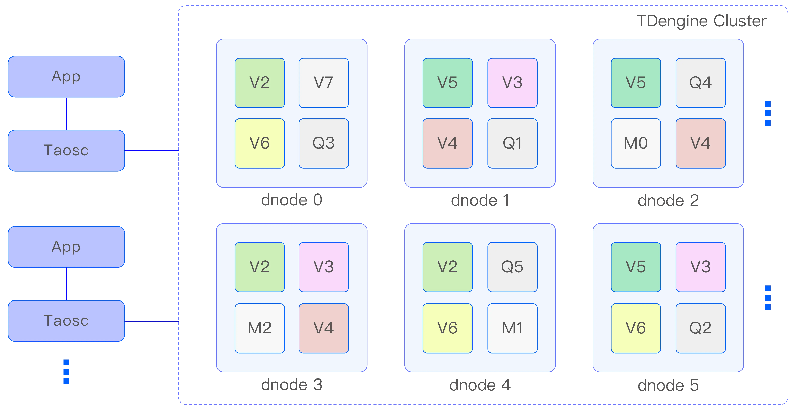

在宏观架构上，TDengine 集群由多个数据节点（DNode）组成。DNode 是服务器侧执行代码 `taosd` 在物理节点上的一个运行实例。系统中存在一到多个数据节点，这些数据节点组成一个集群（Cluster）。每个数据节点内部包含多个虚拟节点（VNode），每个 VNode 作为独立的存储与计算单元，负责管理一部分数据的存储与查询请求。VNode 通过虚拟节点组（VGroup）实现数据的分片与复制，确保数据的高可用性与负载均衡。

##### 4.1.1.1 物理节点（PNode）

PNode 是一独立运行、拥有自己的计算、存储和网络能力的计算机，可以是安装有 OS 的物理机、虚拟机或 Docker 容器。物理节点由其配置的 FQDN（Fully Qualified Domain Name）来标识。TDengine 完全依赖 FQDN 来进行网络通讯。

##### 4.1.1.2 数据节点（DNode）

DNode 是 TDengine 服务器侧执行代码 `taosd` 在物理节点上的一个运行实例。在一个 TDengine 系统中，至少需要一个 DNode 来确保系统的正常运行。每个 DNode 包含零到多个逻辑的虚拟节点（VNode），但管理节点有 0 个或 1 个逻辑实例。
DNode 在 TDengine 集群中的唯一标识由其实例的 endpoint（EP）决定。endpoint 是由 DNode 所在物理节点的 FQDN 和配置的网络端口组合而成。通过配置不同的端口，一个 PNode（无论是物理机、虚拟机还是 Docker 容器）可以运行多个实例，即拥有多个 DNode。

##### 4.1.1.3 虚拟节点（VNode）

为了更好地支持数据分片、负载均衡以及防止数据过热或倾斜，TDengine 引入了 VNode（虚拟节点）的概念。虚拟节点被虚拟化为多个独立的 VNode 实例（如上面架构图中的 V2、V3、V4 等），每个 VNode 都是一个相对独立的工作单元，负责存储和管理一部分时序数据。
每个 VNode 都拥有独立的运行线程、内存空间和持久化存储路径，确保数据的隔离性和高效访问。一个 VNode 可以包含多张表（即数据采集点），这些表在物理上分布在不 同的 VNode 上，以实现数据的均匀分布和负载均衡。
当在集群中创建一个新的数据库时，系统会自动为该数据库创建相应的 VNode。一个 DNode 上能够创建的 VNode 数量取决于该 dnode 所在物理节点的硬件资源，如 CPU、内存和存储容量等。需要注意的是，一个 VNode 只能属于一个数据库，但一个数据库可以包含多个 VNode。
除了存储时序数据以外，每个 VNode 还保存了其包含的表的 schema 信息和标签值等元数据。这些信息对于数据的查询和管理至关重要。
在集群内部，一个 VNode 由其所归属的 DNode 的 endpoint 和所属的 VGroup ID 唯一标识。管理节点负责创建和管理这些 VNode，确保它们能够正常运行并协同工作。

##### 4.1.1.4 管理节点（MNode）

MNode（管理节点）是 TDengine 集群中的核心逻辑单元，负责监控和维护所有 DNode 的运行状态，并在节点之间实现负载均衡（如图 1 中的 M1、M2、M3 所示）。作为元数据（包括用户、数据库、超级表等）的存储和管理中心，MNode 也被称为 MetaNode。
为了提高集群的高可用性和可靠性，TDengine 集群允许有多个（最多不超过 3 个）MNode。这些 MNode 自动组成一个虚拟的 MNode 组，共同承担管理职责。MNode 支持多副本，并采用 Raft 一致性协议来确保数据的一致性和操作的可靠性。在 MNode 集群中，任何数据更新操作都必须在 leader 节点上执行。
MNode 集群的第 1 个节点在集群部署时自动创建，而其他节点的创建和删除则由用户通过 SQL 手动完成。每个 DNode 上最多有一个 MNode，并由其所归属的 DNode 的 endpoint 唯一标识。
为了实现集群内部的信息共享和通信，每个 DNode 通过内部消息交互机制自动获取整个集群中所有 MNode 所在的 DNode 的 endpoint。

##### 4.1.1.5 虚拟节点组（VGroup）

VGroup（虚拟节点组）是由不同 DNode 上的 VNode 组成的一个逻辑单元。这些 VNode 之间采用 Raft 一致性协议，确保集群的高可用性和高可靠性。在 VGroup 中，写操作只能在 Leader VNode 上执行，而数据则以异步复制的方式同步到其他 Follower VNode，从而在多个物理节点上保留数据副本。
VGroup 中的 VNode 数量决定了数据的副本数。要创建一个副本数为 N 的数据库，集群必须至少包含 N 个 DNode。副本数可以在创建数据库时通过参数 `replica` 指定，默认值为 1。利用 TDengine 的多副本特性，企业可以摒弃昂贵的硬盘阵列等传统存储设备，依然实现数据的高可靠性。
VGroup 由 MNode 负责创建和管理，并为其分配一个集群唯一的 ID，即 VGroup ID。如果两个 VNode 的 VGroup ID 相同，则说明它们属于同一组，数据互为备份。值得注意的是，VGroup 中的 VNode 数量可以动态调整，但 VGroup ID 始终保持不变，即使 VGroup 被删除，其 ID 也不会被回收和重复利用。
通过这种设计，TDengine 在保证数据安全性的同时，实现了灵活的副本管理和动态扩展能力

### 4.2 技术

TDengine 存储引擎主要基于 C 语言开发，为了实现高性能、低延迟和高压缩比，采用了以下关键技术和框架：
1. **编程语言**:
  - **C (C99/C11)**: 核心存储引擎完全采用 C 语言编写，以确保对内存布局的精确控制和极致的执行效率，避免 GC（垃圾回收）带来的延迟抖动。
1. **存储与压缩**:
  - **列式存储 (Columnar Storage)**: 数据在磁盘上按列组织，极大提高了针对特定列的聚合查询性能，并为高压缩比提供了基础。
  - **LZ4**: 一种极速无损压缩算法，用于实时性要求较高的数据块压缩，平衡了压缩率与解压速度。
  - **Zstandard (Zstd)**: Facebook 开源的实时压缩算法，提供比 LZ4 更高的压缩率，用于对历史数据的深度压缩。
  - **Delta-of-Delta**: 针对时间戳和浮点数等特定数据类型的专用压缩算法，显著减少存储空间。
  - **Bit-packing / RLE (Run-Length Encoding)**: 针对整数和布尔值的编码技术。
1. **并发与网络**:
  - **Pthreads (POSIX Threads)**: 使用标准的 POSIX 线程库进行多线程并发控制，实现高效的并行写入和查询处理。
  - **RPC (Remote Procedure Call)**: 自研的高效二进制 RPC 协议，用于节点间（DNode、MNode）的低开销通信。
1. **数据结构与算法**:
  - **B+ Tree**: 用于索引管理，支持高效的范围查询和顺序遍历。
  - **LSM Tree (Log-Structured Merge Tree)**: 借鉴 LSM 树思想优化写入流程，通过 WAL 和 MemTable 将随机写转换为顺序写，大幅提升写入吞吐量。
  - **Skip List (跳表)**: 在内存（MemTable）中用于维护有序数据，支持高效的插入和查找操作。
  - **Bloom Filter (布隆过滤器)**: 用于快速判断数据块中是否存在特定数据，减少不必要的磁盘 I/O。
1. **一致性与分布式**:
  - **Raft**: 用于 MNode 集群元数据的一致性同步，以及 VGroup 内数据副本的高可用复制。
  - **Consistent Hashing (一致性哈希)**: 用于数据分片和负载均衡，确保节点动态扩缩容时数据迁移量最小化。
1. **操作系统接口**:
  - **Direct I/O**: 针对特定的大块数据写入场景，绕过操作系统页缓存，直接写入磁盘以避免缓存污染。

### 4.3 依赖项

TDengine 存储引擎的设计力求精简，旨在减少外部依赖以提高部署便捷性和系统稳定性。以下是主要的构建与运行依赖：
1. **操作系统 (Operating System)**
  - **Linux**: 主要支持的生产环境平台（Kernel 3.10 及以上），包括 CentOS、Ubuntu、Debian、RedHat 等主流发行版。
  - **Windows / macOS**: 主要用于开发和测试环境。
1. **构建工具与编译器 (Build Tools & Compilers)**
  - **CMake (2.8+)**: 用于跨平台的项目构建配置。
  - **GCC (4.8+) / Clang (3.8+)**: 支持 C99/C11 标准的编译器。
  - **Make**: 构建执行工具。
1. **第三方库 (Third-party Libraries)**
  - **LZ4**: 用于数据块的实时压缩（通常源码集成，无需额外安装）。
  - **Zstandard (Zstd)**: 用于历史数据的高压缩比存储。
  - **cJSON**: 轻量级 JSON 解析器，用于配置文件解析和部分 API 交互。
  - **iconv**: 用于处理不同字符集之间的编码转换。
  - **libuv**: 提供跨平台的异步 I/O 支持。
  - **GTest (Google Test)**: 用于单元测试框架。
  - **Jemalloc / TCMalloc**: 可选的高性能内存分配器，用于替代系统默认的 malloc。
 等。
1. **硬件环境 (Hardware Environment)**
  - **CPU**: 支持 X86-64、ARM64、MIPS 等主流架构。
  - **存储**: 推荐使用 SSD 以获得最佳读写性能，文件系统推荐 XFS 或 ext4。
  - **内存**: 需预留足够的物理内存用于 MemTable 缓冲池和查询缓存。

## 5. 设计考虑

### 5.1 假设和限制

在设计 TDengine 存储引擎时，基于时序数据的典型应用场景和工程实现的权衡，我们设定了以下假设与限制：

#### 5.1.1 假设 (Assumptions)

1. **数据时序性**: 假设绝大多数写入的数据是按照时间戳递增顺序到达的。虽然系统具备处理乱序（Out-of-order）数据的能力，但内部存储结构（如内存块和数据文件组织）主要针对顺序写入进行了极致优化。
2. **读写特征**: 假设系统负载呈现“写多读少”的特征。写入操作通常是高并发、持续性的流式插入；查询操作通常是基于时间范围的聚合分析，而非频繁的点查（Point Query）。
3. **数据关联性**: 假设属于同一超级表（Super Table）下的子表具有相同的 Schema，且标签（Tags）数据相对于时序数据（Metrics）变化频率极低。
4. **基础设施**: 假设节点间网络延迟在可控范围内（局域网环境），且磁盘 I/O 吞吐量是主要性能瓶颈之一，因此设计上优先考虑减少磁盘 I/O 次数和优化顺序读写。

#### 5.1.2 限制 (Constraints)

1. **事务范围**: 存储引擎仅保证单次写入请求（Batch Write）在 VNode 级别的原子性。不支持跨 VNode、跨表的复杂分布式事务（如两阶段提交），以换取更高的写入吞吐量。
2. **修改与删除**: 由于采用追加写（Append-only）和列式压缩存储，对历史数据的修改（Update）和删除（Delete）操作代价较高。系统将其视为一种特殊的写入操作，物理层面的数据清理依赖于后台的合并（Compaction）过程。
3. **主键约束**: 时间戳是数据的主键。对于同一张表，默认情况下，具有相同时间戳的新数据将覆盖旧数据（Last Write Wins），不支持同一时间戳存储多条记录（除非使用特殊配置）。
4. **资源限制**:
  - **VNode 数量**: 单个 DNode 上可创建的 VNode 数量受限于物理内存大小（每个 VNode 需占用固定的内存缓冲区）和操作系统文件句柄限制。
  - **单行大小**: 单行数据记录的最大长度受限于内部协议缓冲区大小。
1. **Schema 变更**: 虽然支持动态添加列，但修改列类型或删除列操作成本较高，建议在设计初期规划好 Schema。

### 5.2 设计模式和原则

TDengine 存储引擎的设计遵循了一系列经典的软件工程原则和针对高性能数据处理的特定模式，以确保系统在保持高性能的同时，具备良好的可维护性和扩展性。
1. **KISS 原则 (Keep It Simple, Stupid)**
  - **原则**: 在设计和实现过程中，始终优先选择最简单、最直接的解决方案。避免过度设计和不必要的复杂性。
  - **应用**: 存储引擎的核心逻辑（如文件格式、索引结构）力求简洁。例如，采用固定大小的数据块管理，简化内存分配和回收逻辑；使用简单的追加写模式替代复杂的原地更新逻辑。
1. **数据局部性 (Data Locality)**
  - **原则**: 优化数据在时间和空间上的局部性，以最大化 CPU 缓存命中率和磁盘 I/O 效率。
  - **应用**: * **列式存储**: 将同一列的数据连续存储，使得聚合计算时 CPU 缓存极其高效。 * **时间分片**: 将相近时间段的数据存储在同一文件或相邻位置，符合时序数据按时间范围查询的特性。
1. **零拷贝 (Zero Copy)**
  - **原则**: 减少数据在内核态与用户态之间、以及不同内存缓冲区之间的拷贝次数。
  - **应用**: 在数据写入和查询路径上，尽量传递指针而非数据本身。对于大块数据的读取。
1. **追加写模式 (Append-Only / Log-Structured)**
  - **原则**: 将随机写转换为顺序写，以利用磁盘（尤其是 HDD）的高顺序写入带宽。
  - **应用**: 借鉴 LSM-Tree 思想，所有新数据首先追加写入 WAL，然后写入内存 MemTable。磁盘文件一旦生成即为不可变（Immutable），修改和删除操作通过写入新的标记记录来实现。
1. **无共享架构 (Shared-Nothing)**
  - **原则**: 分布式节点之间不共享内存或磁盘存储，完全通过网络消息传递进行通信。
  - **应用**: 每个 VNode 独立管理自己的数据和元数据。这种架构消除了锁竞争，使得系统能够通过增加节点实现线性扩展（Linear Scalability）。
1. **单一职责原则 (Single Responsibility Principle)**
  - **原则**: 每个模块或函数只负责一项特定的功能。
  - **应用**: 写入引擎只负责数据的持久化和内存缓冲，不处理复杂的查询逻辑；查询引擎专注于数据的过滤和聚合，不关心数据的物理落盘细节。

### 5.3 风险和缓解措施

在存储引擎的设计与实现过程中，我们识别了以下潜在的技术风险，并制定了相应的缓解措施以确保系统的稳定性和可靠性。

| 风险类别 | 风险描述 | 缓解措施 |
| --- | --- | --- |
| **数据持久性** | **断电或崩溃导致数据丢失** 在极端情况下（如突然断电），内存中尚未刷写到磁盘的数据（MemTable）可能会丢失。 | 1. **WAL 机制**：所有写入操作在进入内存前必须先写入 WAL。支持配置 `fsync` 策略（如 `fsync` 每秒或每次写入）以平衡性能与安全性。 1. **多副本复制**：通过 Raft 协议将数据实时复制到其他节点，单节点故障不影响数据完整性。 |
| **性能稳定性** | **写入流量突增导致系统过载** 面对海量时序数据的瞬时写入高峰，可能导致内存耗尽或 I/O 阻塞，进而引发服务不可用。 | 1. **LSM 树优化**：确保写入路径主要为顺序写，最大化磁盘吞吐。 |
| **元数据管理** | **高基数问题 (High Cardinality)** 当标签（Tags）组合数量呈指数级增长时，元数据索引会急剧膨胀，导致写入和查询性能显著下降。 | 1. **元数据分离**：将元数据与时序数据分开存储和缓存，防止元数据操作阻塞时序数据写入。 1. **限制策略**：在系统层面提供配置项，限制单表的标签数量或长度。 |
| **存储空间** | **磁盘空间耗尽** 时序数据持续累积，若未及时清理或压缩，可能导致磁盘写满，服务停止。 | 1. **多级压缩**：对历史数据应用更高压缩比的算法（如 Zstd）。 1. **自动过期清理**：严格执行基于 TTL（Time To Live）的数据保留策略，自动删除过期文件。 1. **分级存储**：支持将冷数据自动迁移到廉价存储介质（如 S3 或 NAS）。 |
| **分布式一致性** | **脑裂 (Split Brain)** 网络分区可能导致多个节点认为自己是 Leader，从而产生数据冲突。 | 1. **Raft 共识算法**：严格遵循 Raft 协议，只有获得多数派投票的节点才能成为 Leader 并处理写入。 1. **租约机制 (Lease)**：Leader 需定期续约，确保同一时刻只有一个有效的 Leader。 |

## 6. 详细设计

### 6.1 时序数据的数据特征及查询特征

时序数据是一种按时间顺序排列的数据，通常由物联网设备产生，包含时间戳和多个字段值。时序数据有其他类型的数据所不具备的显著特征，利用这些特征设计存储引擎，可以大幅提高引擎的性能，节省硬件资源。时序数据的特点如下：
1. **时序性**：同一个采集设备的数据时间戳是递增的，数据按时间顺序写入。少量的乱序数据通常是由于设备故障或网络延迟引起的。
2. **结构化**：时序数据通常包含多个字段值，每个字段值对应一个采集项，如温度、湿度、压力等。时序数据的结构是固定的，不会频繁发生变化。
3. **数据量大**：时序数据通常是海量的且源源不断产生的，数据量可达 PB 级别。时序数据的数据量通常来自于两个因素：*高基数的测点数*或*高采集频率*。
4. **数据归档**：时序数据的价值随时间递减，过期数据通常会被删除或归档。
5. **极少更新或删除**：时序数据通常是追加写入的，很少更新或删除。
6. **数据变动幅度小**：同一采集设备采集的同一数据项变动幅度不大，通常是连续的趋势或周期性变化，甚至是恒定值。这决定了列式存储在时序数据中的优势。
7. **查询需求**：时序数据的查询通常是基于时间范围的过滤查询或聚合查询，最新的数据查询需求也是时序场景下的重要查询需求。基于非时间戳列的过滤查询很少或没有。
以上特征决定了 TDengine 存储引擎的设计要充分利用时序数据的特点，提高数据的存储效率和查询性能。

### 6.2 时序数据模型

高效数据模型可以有效利用时序数据的特点，在算法层面提高数据的写入性能。TDengine 采用如下数据模型：
1. **一个采集设备一张表****：**同一个采集设备采集的数据属于同一张表，不同采集设备采集的数据属于不同的表。
2. **超级表**：超级表是多个表的集合，属于同一个超级表的子表具有相同的采集数据结构和标签结构，但不同的子表的标签值不同。
TDengine 采用一个采集点一张表的设计主要利用了时序数据的时序性。将同一个采集设备的数据存储在同一张表中，表中的数据按时间戳递增写入。有序数据写入的时间复杂度是 O(1)，而乱序数据写入的时间复杂度是 O(logN)，这样可以提高数据写入的效率。下图展示了 TDengine 的数据模型对于时序数据的优势：
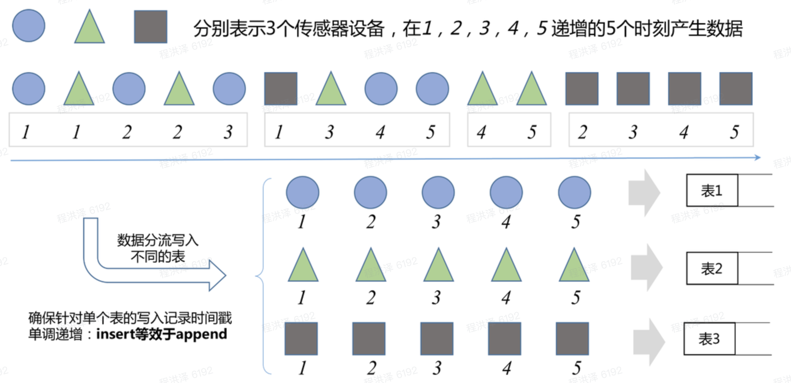

来自不同采集点的数据聚到服务端时，若未采用分表的数据模型，数据是杂乱无章的，对数据的排列的算法时间复杂度是 O(NlogN)。若采用分表模型，每张表的数据时间戳都是递增，则数据的排序写入操作变成了追加写入操作，时间复杂度降低为 O(N)，在数据量巨大的时序场景下，写入性能可提升几个数量级。
一个采集点一张表的数据模型对于利用时序特点提高写入性能提升巨大，但是也带来了另一个问题：表的数量可能会非常大，表的运维管理会成为一个挑战。为了解决这个问题，TDengine 引入了超级表的概念。超级表是多个表的集合，属于同一个超级表的子表具有相同的采集数据结构和标签结构，但不同的子表的标签值不同。超级表的引入可以有效降低表管理的难度，对超级表的修改会自动应用到所有子表上，提高了表的管理效率。对超级表的查询相当于对所有子表的查询，大大降低了 TDengine 的使用复杂度。

### 6.3 时序数据行格式

真实的时序场景会遇到两种场景：
1. **稀疏数据场景**
某些采集点可以采集的变量非常多，但是大部分的变量在大多数场景下都是空值，如某采集点可采集 1000 个采集量，但是只有 100 个采集量会采集数值，其他采集量为 None 值，即未指定值，这种数据我们叫做稀疏数据。
1. **密集数据场景**
与稀疏数据相反，某些场景下的采集点采集绝大多数的可采集量，这种数据我们叫做稀疏数据。
为了有效利用内存资源处理两种采集数据场景，TDengine 设计如下两种行格式：
1. **Key-Value 行格式**
Key-Value 的行格式适合存储
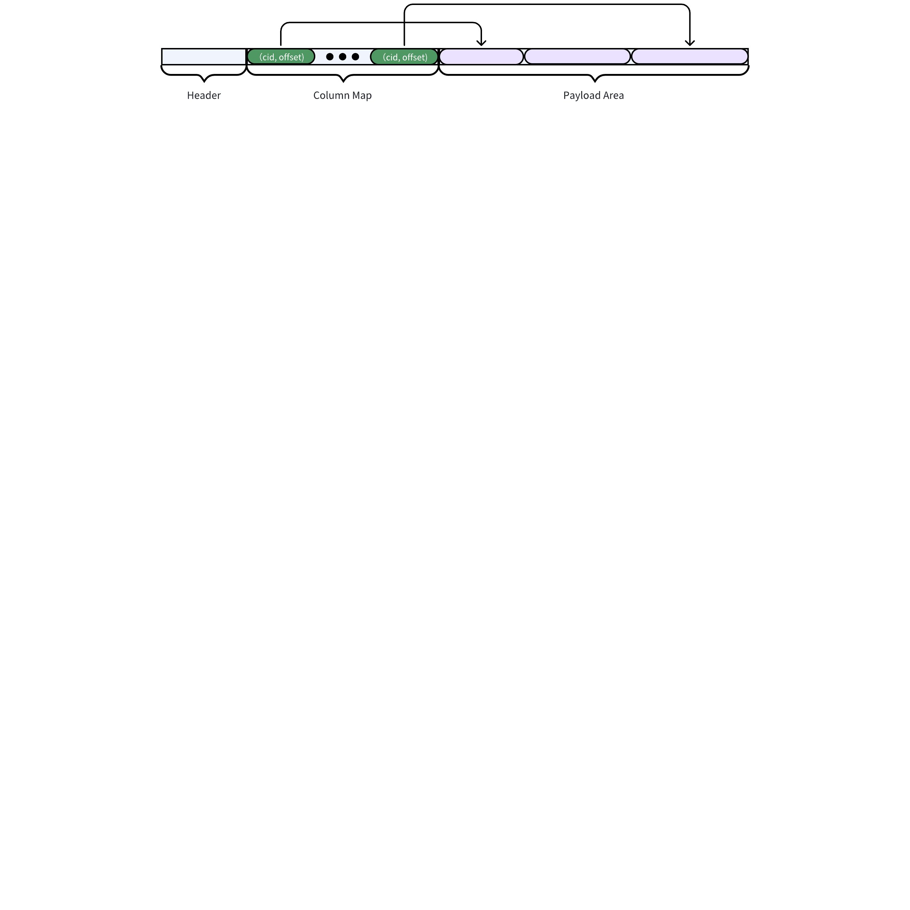

1. **Tuple 行格式**
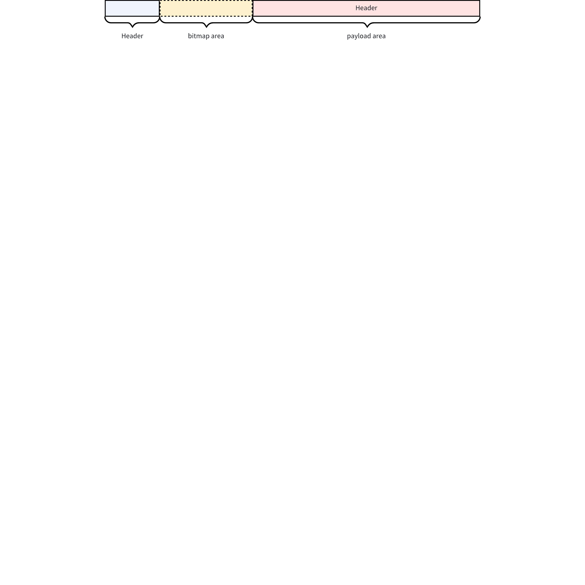

### 6.4 时序数据存储的基本单元--VNode

#### 6.4.1 VNode 架构

`VNode` 是 TDengine 中数据存储和备份的基本单元，其存储了部分表的元数据及时序数据。表的分布由集群统一管理。VNode 可以被视为一个单机版的时序数据存储引擎，其架构如下图所示：
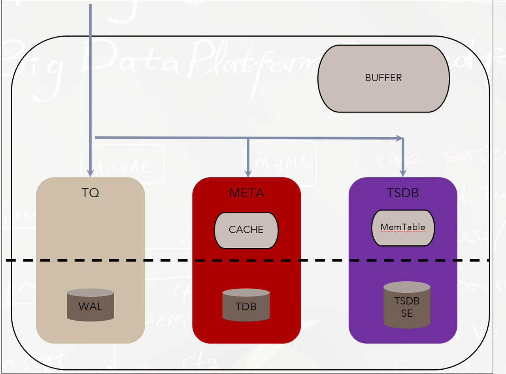

其包括三大主要的存储单元：
1. **WAL**：写前日志，用于保证数据的持久性和一致性。
2. **META**：元数据管理引擎，用于管理表的结构信息、索引信息等。
3. **TSDB**：时序数据管理引擎，用于管理时序数据的存储、查询、聚合等。
VNode 维护自己的写入内存池，供 META、TSDB 等模块共享使用，保证写入内存占用的可控性。

#### 6.4.2 数据在 VNode 中的流转

TDengine 的数据写入流程如下图所示：
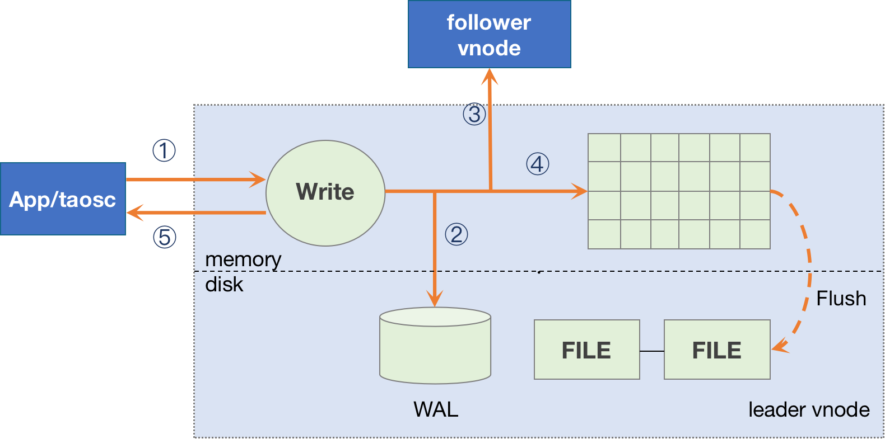

当写入请求到达 VNODE 时，首先将数据写入 WAL 中持久化，保证数据的可靠性。然后将数据发送到互为备份的 VNODE 中，实现数据的实时备份。写入请求根据类型的不同，分别由 META 和 TSDB 进行处理。META 负责元数据的管理，包括表的创建、删除、更新等。TSDB 负责时序数据的管理，包括数据的写入、查询、聚合等。每个 VNODE 都维护自己的内存池，并用于分配内存给 META 和 TSDB 模块。内存池的大小可以根据配置进行调整，以适应不同的业务场景。当内存池中的数据达到一定阈值时会触发 VNODE 的 flush 操作，将内存中的数据刷入磁盘，以释放内存空间。

#### 6.4.3 写前日志（WAL）

Write-Ahead Logging (WAL) 是 TDengine 中用于确保数据持久性和一致性的关键组件。WAL 的设计目标是在系统崩溃或故障时，能够通过日志恢复数据，确保数据的完整性和可靠性。除此之外，TDengine 中的 WAL 还提供了 Raft 协议的 LogStore 接口，用于实现数据的备份和恢复，避免数据的重复写入。
WAL 日志由多个日志条目（Log Entry）组成，每个日志条目包含以下信息：
1. **日志序列号（LSN**）：唯一标识日志条目的序列号。
2. **操作类型**：标识操作的类型，如插入、删除、更新等。
3. **数据**：操作所涉及的具体数据。
4. **校验和**：用于验证日志条目的完整性。
日志写入流程如下：
1. **接收写请求**：当客户端发起写请求时，TDengine 首先将写操作记录到 WAL 中。
2. **写入日志缓冲区**：将日志条目写入内存中的日志缓冲区。
3. **刷盘**：根据配置的策略（如定时刷盘或同步刷盘），将日志缓冲区的内容写入磁盘。
4. **写入内存表**：在日志写入磁盘后，将数据写入内存中。
5. **返回成功**：向客户端返回写操作成功的响应。
WAL 写入流程如下图所示：
<add-ons component-id="" component-type-id="blk_631fefbbae02400430b8f9f4" record="{"data":"sequenceDiagram\n    participant Client as 客户端\n    participant WAL as WAL 模块\n    participant Buffer as 日志缓冲区\n    participant Disk as 磁盘存储\n    participant MemTable as 内存表\n    \n    Client-\u003e\u003eWAL: 发送写请求\n    WAL-\u003e\u003eWAL: 生成日志条目\u003cbr/\u003e包含 LSN、操作类型、数据、校验和\n    WAL-\u003e\u003eBuffer: 写入日志缓冲区\n    Note over Buffer: 批量写入优化\u003cbr/\u003e减少 I/O 次数\n    \n    alt 同步刷盘模式\n        WAL-\u003e\u003eDisk: 立即刷盘 (fsync)\n        Disk--\u003e\u003eWAL: 刷盘完成\n    else 异步刷盘模式\n        WAL-\u003e\u003eDisk: 异步刷盘 (根据 fsyncPeriod)\n    end\n    \n    WAL-\u003e\u003eMemTable: 写入内存表\n    WAL--\u003e\u003eClient: 返回写入成功\n    \n    Note over WAL,Disk: WAL 文件结构\u003cbr/\u003e.log 文件：日志数据\u003cbr/\u003e.idx 文件：索引映射\u003cbr/\u003e文件轮转：基于时间/大小\n    Note over WAL: Raft 协议集成\u003cbr/\u003eLeader 写入 WAL\u003cbr/\u003e同步到 Follower\u003cbr/\u003e确保一致性\n","theme":"default","view":"chart"}"/>

WAL 的具体技术实现细节如下：
1. **WAL 文件结构**：
  - **日志文件 (.log)**: 存储实际的日志条目数据，按顺序追加写入。文件命名包含版本号和时间戳，便于管理和恢复。
  - **索引文件 (.idx)**: 存储日志条目的索引信息，包括 LSN (日志序列号) 到文件偏移的映射，加速日志回放和查询。
  - **文件轮转**: 支持基于时间 (rollPeriod) 和大小 (segSize) 的日志文件轮转策略，防止单个文件过大。
1. **WAL 配置参数**：
  - **fsyncPeriod**: WAL 刷盘频率（毫秒），控制持久化粒度。值越小数据安全性越高，但 I/O 开销越大。
  - **retentionPeriod**: 日志保留时间（秒），过期日志文件自动清理。
  - **retentionSize**: 日志保留大小限制，防止磁盘空间耗尽。
  - **rollPeriod**: 日志文件轮转时间间隔（秒）。
  - **segSize**: 单个日志文件最大大小，达到阈值后创建新文件。
  - **level**: WAL 级别，支持 `TAOS_WAL_SKIP`（关闭 WAL）、`TAOS_WAL_WRITE`（仅写入不刷盘）、`TAOS_WAL_FSYNC`（写入并同步刷盘）。
1. **WAL 与 Raft 协议集成**：
  - WAL 实现了 Raft 协议的 LogStore 接口，为分布式一致性提供底层日志存储。
  - 每个 VGroup 的 Leader 节点将 Raft 日志条目写入 WAL，并同步到 Follower 节点。
  - 通过 WAL 的序列号 (LSN) 和 Raft 的任期号 (term) 确保日志的全局有序和一致性。
1. **恢复机制**：
  - **崩溃恢复**: 节点重启时，扫描 WAL 日志文件，从最后一个持久化的检查点开始重放日志，恢复内存状态。
  - **数据一致性**: 通过校验和 (CRC32) 验证日志条目完整性，防止静默数据损坏。
  - **并行恢复**: 支持多个 VNode 的 WAL 并行恢复，加速集群启动过程。
1. **性能优化**：
  - **批量写入**: 将多个日志条目合并为批量写入，减少磁盘 I/O 次数。
  - **异步刷盘**: 根据配置的 fsyncPeriod 异步执行刷盘操作，平衡性能与数据安全性。
  - **内存缓冲区**: 使用环形缓冲区作为日志写入缓存，避免频繁的磁盘操作。
WAL 的设计在确保数据持久性和一致性的同时，通过灵活的配置策略和优化手段，满足不同场景下对性能和安全性的权衡需求。

#### 6.4.4 元数据管理引擎（META）

在 TDengine 中，元数据是描述时序数据相关属性的数据，对应到 TDengine 的数据模型中，元数据包含以下信息：
1. **表结构**：表名、表的字段、数据类型、索引等信息
2. **Tag 信息**：表的标签信息，用于标识表的属性
3. **超级表与子表的关系**：超级表的信息，包括超级表的名称、子表的名称等
在 TDengine 中，元数据与时序数据分开存储，这样有效降低了元数据的存储和查询成本。元数据的存储和查询由 META 模块负责，META 模块的设计目标是提供高效的元数据管理功能，包括元数据的存储、更新、删除、查询等。
在 META 模块中，元数据的存储采用 B+ Tree 数据结构，B+ Tree 是一种高效的数据结构，适合存储元数据。B+ Tree 的特点是有序存储、支持范围查询、支持高效的插入和删除操作等，适合存储元数据。在 META 模块中，B+ Tree 用于存储表的元数据，包括表的结构信息、索引信息等。在 META 模块中，不同的索引被存储在了不同的 B+ Tree 中，以提高查询效率。
下图展示了 META 模块的主要结构。
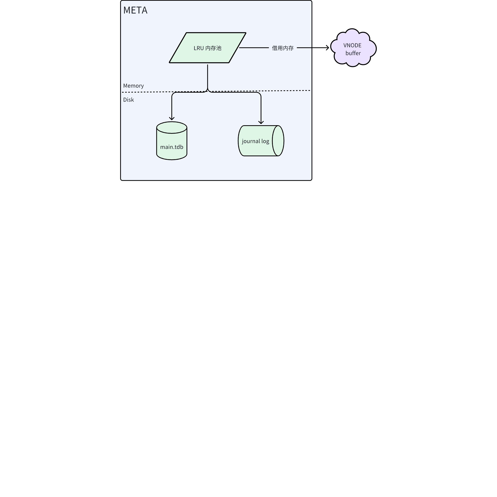

元数据管理模块拥有自己的内存池，用于高效管理元数据的存储和访问。同时，为了优化内存使用，元数据管理引擎可以从 VNODE （虚拟节点）借用内存。META 模块的内存池采用 LRU （Least Recently Used）算法进行管理，以保证内存的高效利用。
META 模块中有两种文件：
1. **ma****i****n.tdb**：B+ Tree 存储的数据库文件
2. **Journal log**：存储元数据的变更日志，用于恢复元数据
META 模块的 B+ Tree 采用 Journal Log 的技术保证数据的安全性。当需要修改 B+ Tree 中页的内容时，首先将页面未修改前的内容写入 Journal Log，然后再修改页内容。这样可以保证即使在修改过程中出现故障，也可以通过 Journal Log 恢复数据。

#### 6.4.5 时序数据存储引擎（TSDB）

在 TDengine 中，时序数据由 TSDB 模块负责管理，TSDB 模块的设计目标是提供高效的时序数据存储和查询功能，包括数据的写入、查询、聚合等。TSDB 模块采用 LSM 树（Log-Structured Merge-Tree）数据结构，LSM 树是一种高效的数据结构，在海量有序数据存储场景下表现优异。不同于 B+ Tree，LSM 树将数据分为多个层级。当数据写入时，先写入内存表（MemTable），当内存表达到一定大小时，将内存表的数据写入磁盘，形成一个新的 SSTable（Sorted String Table）。当 SSTable 达到一定数量时，会进行合并操作，将多个 SSTable 合并成一个更大的 SSTable。这样可以有效减少磁盘 I/O 操作，提高数据写入性能。TSDB 模块对通用的 LSM 树进行了优化，以便于更高效地处理时序场景。
在 MemTable 中，TSDB 模块采用了哈希表索引和跳表（Skip List）索引，以提高数据的写入和查询效率。哈希表索引用于加速表数据的查找，以 UID 为键，表的时序数据存储结构为值。哈希表索引可以使得对于表数据的查找效率达到 O(1)。对于表中的时序数据，TSDB 模块采用了跳表索引，且针对时序场景，做了从后向前查找的优化，从而使得对于大量有序数据写入的时间复杂度降低到 O(1)，对于少量乱序数据的写入，时间复杂度为 O(logN)。下图为调表结构示意图：
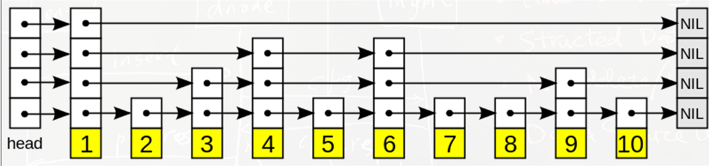

与 META 模块中的 LRU 内存池类似，TSDB 模块的 MemTable 也从 VNODE 借用内存，以提高内存的利用率。当 MemTable 达到一定大小时，会触发 MemTable 的 flush 操作，具体工作流程如下图所示：
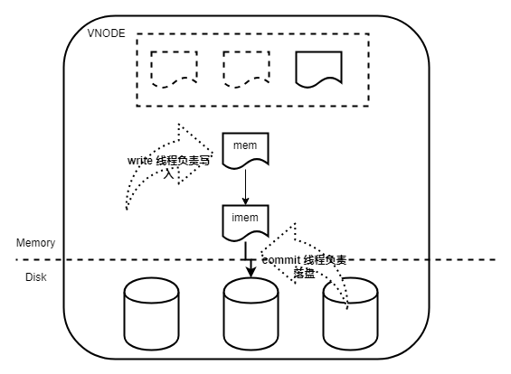

当 MemTable 达到一定大小时， MemTable 变为 immutable（不可更改的），不再接受新的写入请求，并交由后台线程进行 flush 操作。与此同时，TSDB 模块会从 VNODE 的内存池中申请一块新的内存，生成新的 MemTable，用于接收新的写入请求。
时序数据在硬盘上按时间范围分段存储，每个时间段对应 TSDB 中的一个文件组，每个文件组包含了 VNODE 中的所有表在该时间段内的数据。TSDB 模块会根据查询请求的时间范围，选择合适的文件组进行查询，以提高查询效率。如下图所示为 TSDB 文件组的存储示例：
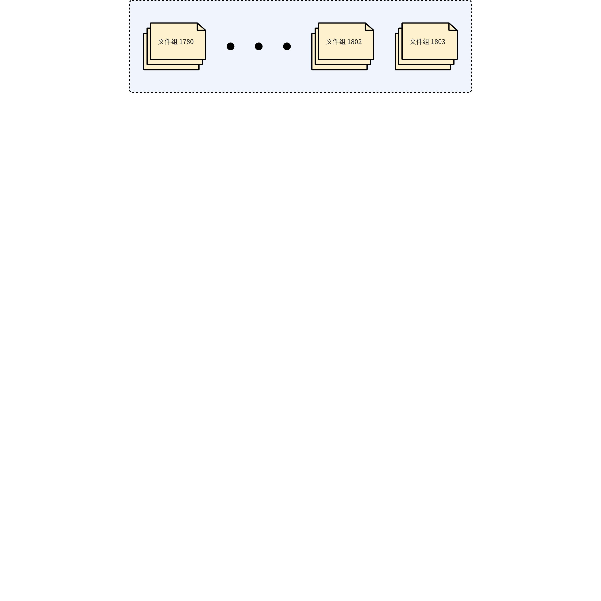

每个文件组包含了多个类型的文件，不同类型的文件存储了不同时间范围的数据。主要文件类型包括：

| 文件类型 | 文件后缀 | 描述 |
| --- | --- | --- |
| 数据文件 | .data | TSDB 中存储时序数据的文件，按块列式存储。每个数据块只包含一个表的数据。同一个数据块的数据按时间戳递增排序。 |
| 索引文件 | .head | 数据文件的索引文件，存储了 .data 文件中各数据块所属表、时间范围、数据条数、在文件中的偏移量以及压缩算法等信息。 |
| 预计算文件 | .sma | 存储数据块的预计算结果，如 sum、max、min 等，避免直接读取原始数据，提高查询效率。 |
| tombstone 文件 | .tomb | 数据删除标记文件。 |
| STT 文件 | .stt | 与 .data 文件一样，都是存储时序数据的文件，不同的是，STT 文件中的数据块不只可以存储同一张表的数据，而且可以同时存储同一个超级表的多张子表的时序数据。数据按照 (suid, uid, ts) 进行排序。 |

下图为一个文件组中文件结构示意图：
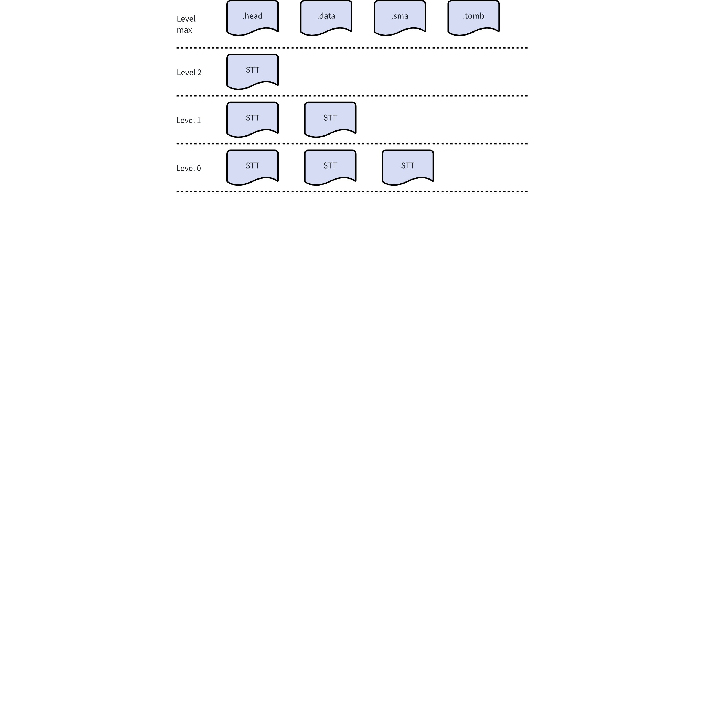

### 6.5 共享存储架构设计（企业版功能）

TDengine 企业版提供共享存储（Shared Storage）支持，实现存储与计算的分离架构。该功能允许将数据持久化到对象存储（如 AWS S3、Azure Blob Storage 等），同时本地节点仅保留热数据，显著降低存储成本并提高系统弹性。

#### 6.5.1 架构概览

共享存储架构基于以下核心设计原则：
1. **存储计算分离**：计算节点（DNode）负责数据处理和查询执行，对象存储负责数据持久化。
2. **本地缓存加速**：频繁访问的热数据保留在本地 SSD/HDD，提供低延迟访问。
3. **透明数据访问**：查询引擎自动判断数据位置，对用户透明地访问本地或远程数据。
4. **异步数据上传**：数据写入本地后，后台异步上传到对象存储，不影响写入性能。
架构如下图所示：
<add-ons component-id="" component-type-id="blk_631fefbbae02400430b8f9f4" record="{"data":"graph TB\n    Client[客户端应用程序]\n    DNode[DNode 计算节点]\n    LocalStorage[本地存储\u003cbr/\u003eSSD/HDD\u003cbr/\u003e热数据]\n    S3[对象存储 S3\u003cbr/\u003e全量数据]\n    Cache[查询缓存]\n    \n    Client --\u003e|写入请求| DNode\n    DNode --\u003e|写入热数据| LocalStorage\n    LocalStorage --\u003e|异步上传\u003cbr/\u003e超时数据| S3\n    S3 --\u003e|透明拉取\u003cbr/\u003e查询时按需| Cache\n    Cache --\u003e|快速访问| DNode\n    DNode --\u003e|查询结果| Client\n    \n    subgraph \"共享存储架构\"\n        LocalStorage\n        S3\n        Cache\n    end\n    \n    style Client fill:#e1f5fe\n    style DNode fill:#f3e5f5\n    style LocalStorage fill:#e8f5e8\n    style S3 fill:#fff3e0\n    style Cache fill:#fce4ec\n","theme":"default","view":"chart"}"/>

#### 6.5.2 关键技术实现

1. **数据生命周期管理**：
  - **SS_KEEPLOCAL 参数**：控制数据在本地保留的时间（秒）。在此期间，数据可被快速访问。
  - **SS_CHUNKPAGES 参数**：定义数据上传到对象存储的块大小（页数）。影响上传效率和存储粒度。
  - **SS_COMPACT 参数**：控制是否在数据老化时执行压缩操作，优化存储空间。
1. **数据上传机制**：
  - **后台异步上传**：独立的上传线程定期扫描本地数据文件，将超过 `SS_KEEPLOCAL` 时间的数据上传到对象存储。
  - **断点续传**：支持上传过程中的断点续传，确保网络异常时数据不丢失。
  - **数据校验**：上传前后计算数据校验和（CRC32），确保数据完整性。
1. **查询透明访问**：
  - **元数据索引**：维护本地和远程数据的元数据索引，快速定位数据位置。
  - **智能预取**：对于范围查询，预测可能需要的远程数据块并提前预取到本地缓存。
  - **缓存管理**：采用 LRU（最近最少使用）策略管理本地缓存，自动淘汰不常访问的数据。
1. **存储格式兼容**：
  - 共享存储使用与本地存储相同的列式存储格式（`.data`、`.head`、`.sma` 文件），确保数据一致性。
  - 支持数据压缩算法（LZ4、Zstandard）在对象存储中的透明应用。

#### 6.5.3 配置与部署

共享存储功能通过以下配置启用：
1. **对象存储配置**：
  ```properties
  # S3 兼容对象存储配置
  sharedStorage  1
  s3Endpoint     http://s3.amazonaws.com
  s3AccessKey    YOUR_ACCESS_KEY
  s3SecretKey    YOUR_SECRET_KEY
  s3Bucket       your-bucket-name
  s3Region       us-east-1
  ```

1. **本地保留策略**：
  ```sql
  CREATE DATABASE mydb 
  KEEP 3650d 
  SS_KEEPLOCAL 86400  -- 本地保留 24 小时
  SS_CHUNKPAGES 1024  -- 每 1024 页为一个上传块
  SS_COMPACT 1;       -- 启用压缩
  ```

1. **监控与运维**：
  - **上传进度监控**：通过系统表监控数据上传状态和进度。
  - **存储成本分析**：统计对象存储的使用量和成本。
  - **性能指标**：跟踪远程数据访问延迟和缓存命中率。

#### 6.5.4 优势与适用场景

1. **成本优化**：将冷数据迁移到廉价的对象存储，显著降低存储成本。
2. **弹性扩展**：存储容量随对象存储无限扩展，计算节点可独立扩缩容。
3. **高可用性**：数据在对象存储中多副本保存，提供地域级容灾能力。
4. **运维简化**：无需管理本地存储扩容和数据迁移。
该功能特别适用于数据保留周期长、存储成本敏感的场景，如历史数据归档、监管合规存储等。

### 6.6 多级存储（冷热分层）设计（企业版功能）

TDengine 企业版支持多级存储（Multi-tier Storage），也称为冷热数据分层存储。该功能根据数据的新旧程度（热度）自动将数据迁移到不同性能/成本的存储介质，实现存储成本与访问性能的最佳平衡。

#### 6.6.1 架构设计

多级存储支持最多 3 个存储层级，每级可配置多个挂载点：
1. **Level 0（热数据层）**：高性能存储（如 NVMe SSD），存储最新写入的数据，提供最低延迟访问。
2. **Level 1（温数据层）**：大容量存储（如 SAS/SATA HDD），存储次新数据，平衡性能与成本。
3. **Level 2（冷数据层）**：廉价存储（如 S3 对象存储或 NAS），存储历史数据，最大化成本效益。
数据根据时间自动在层级间迁移：
<add-ons component-id="" component-type-id="blk_631fefbbae02400430b8f9f4" record="{"data":"graph LR\n    subgraph \"数据生命周期\"\n        direction LR\n        NewData[新数据写入]\n        Level0[Level 0\u003cbr/\u003e热数据层\u003cbr/\u003eNVMe SSD]\n        Level1[Level 1\u003cbr/\u003e温数据层\u003cbr/\u003eSAS/HDD]\n        Level2[Level 2\u003cbr/\u003e冷数据层\u003cbr/\u003eS3/NAS]\n        \n        NewData --\u003e|实时写入| Level0\n        Level0 --\u003e|KEEP时间到期| Level1\n        Level1 --\u003e|KEEP时间到期| Level2\n        \n        Query[查询请求] --\u003e|智能路由| Level0\n        Query --\u003e|智能路由| Level1\n        Query --\u003e|智能路由| Level2\n        \n        Background[后台迁移服务] -.-\u003e|批量迁移| Level0\n        Background -.-\u003e|增量迁移| Level1\n        Background -.-\u003e|并发迁移| Level2\n    end\n    \n    style NewData fill:#c8e6c9\n    style Level0 fill:#ffcdd2,stroke:#f44336,stroke-width:2px\n    style Level1 fill:#bbdefb,stroke:#2196f3,stroke-width:2px\n    style Level2 fill:#fff9c4,stroke:#ff9800,stroke-width:2px\n    style Query fill:#e1bee7\n    style Background fill:#f5f5f5\n    \n    subgraph \"性能与成本特征\"\n        Perf0[延迟 \u003c 1ms\u003cbr/\u003e吞吐 \u003e 2GB/s]\n        Perf1[延迟 5-10ms\u003cbr/\u003e吞吐 200MB/s]\n        Perf2[延迟 50-200ms\u003cbr/\u003e吞吐受网络限制]\n        \n        Cost0[成本: $$$]\n        Cost1[成本: $$]\n        Cost2[成本: $]\n    end\n    \n    Level0 --\u003e Perf0\n    Level1 --\u003e Perf1\n    Level2 --\u003e Perf2\n    \n    Level0 --\u003e Cost0\n    Level1 --\u003e Cost1\n    Level2 --\u003e Cost2\n","theme":"default","view":"chart"}"/>

#### 6.6.2 数据迁移策略

1. **基于时间的自动迁移**：
  - 通过 `KEEP` 参数配置各层级的数据保留时间，如 `KEEP 100h,100d,3650d`。
  - 系统后台任务定期扫描数据时间戳，将过期数据迁移到下一层级。
  - 迁移过程原子化，确保数据一致性。
1. **迁移算法优化**：
  - **批量迁移**：将多个数据文件打包迁移，减少迁移操作开销。
  - **增量迁移**：仅迁移发生变化的数据块，避免全量数据移动。
  - **并发迁移**：支持多个 VNode 的数据并行迁移，提高迁移效率。
1. **迁移过程容错**：
  - 迁移前创建检查点，支持迁移失败后的回滚和重试。
  - 网络中断或存储故障时自动暂停迁移，恢复后继续执行。

#### 6.6.3 查询透明性

1. **统一查询接口**：无论数据位于哪个存储层级，用户都使用相同的 SQL 接口查询。
2. **智能查询路由**：查询引擎根据查询时间范围自动判断数据位置，从相应层级读取数据。
3. **跨层级查询优化**：对于跨多个层级的时间范围查询，并行从各层级读取数据，减少查询延迟。

#### 6.6.4 配置与管理

1. **存储层级配置**：
  ```properties
  # taos.cfg 配置示例
  dataDir /mnt/ssd1 0 1   # Level 0，主挂载点
  dataDir /mnt/ssd2 0 0   # Level 0，扩展挂载点
  dataDir /mnt/hdd1 1 0   # Level 1
  dataDir /mnt/hdd2 1 0   # Level 1
  dataDir /mnt/s3   2 0   # Level 2（S3 挂载点）
  ```

1. **数据库级配置**：
  ```sql
  CREATE DATABASE mydb 
  KEEP 100h, 100d, 3650d  -- 三级存储保留策略
  BUFFER 1024             -- 内存缓冲区大小
  CACHEMODEL 'none';      -- 缓存模式
  ```

1. **监控与调优**：
  - **层级使用统计**：监控各存储层级的使用量和数据分布。
  - **迁移性能监控**：跟踪数据迁移速度和成功率。
  - **查询性能分析**：分析各层级数据的查询延迟，指导存储配置优化。

#### 6.6.5 错误处理与恢复

1. **错误码设计**：
  - `TSDB_CODE_GRANT_MULTI_STORAGE_EXPIRED`：多级存储功能授权过期。
  - 层级特定的 I/O 错误代码，便于故障定位。
1. **故障恢复机制**：
  - 存储层级不可用时，自动降级到可用层级。
  - 迁移过程中的故障支持断点续传。
  - 定期校验跨层级数据一致性，防止数据损坏。

#### 6.6.6 性能与成本平衡

1. **性能基准**：
  - Level 0（SSD）：随机读延迟 < 1ms，顺序读吞吐 > 2GB/s。
  - Level 1（HDD）：随机读延迟 5-10ms，顺序读吞吐 200MB/s。
  - Level 2（对象存储）：访问延迟 50-200ms，吞吐受网络限制。
1. **成本优化**：
  - 典型场景下，多级存储可将总存储成本降低 60%-80%。
  - 通过智能数据分层，确保热点数据始终在高速存储中。
多级存储功能使得 TDengine 能够在大规模时序数据场景下，同时满足高性能查询和低成本存储的双重要求。

## 7. 接口规范

本章节重点介绍 TDengine 的数据写入接口规范。

#### 7.0.1 SQL 接口

写入记录支持两种语法，正常语法和超级表语法。正常语法下，紧跟 INSERT INTO 后名的表名是子表名或者普通表名。超级表语法下，紧跟 INSERT INTO 后名的表名是超级表名。

##### 7.0.1.1 正常语法

```sql
INSERT INTO
    tb_name
        [USING stb_name [(tag1_name, ...)] TAGS (tag1_value, ...)]
        [(field1_name, ...)]
        VALUES (field1_value, ...) [(field1_value2, ...) ...] | FILE csv_file_path
    [tb2_name
        [USING stb_name [(tag1_name, ...)] TAGS (tag1_value, ...)]
        [(field1_name, ...)]
        VALUES (field1_value, ...) [(field1_value2, ...) ...] | FILE csv_file_path
    ...];

INSERT INTO tb_name [(field1_name, ...)] subquery
```

##### 7.0.1.2 超级表语法

```sql
INSERT INTO
    stb1_name [(field1_name, ...)]
        VALUES (field1_value, ...) [(field1_value2, ...) ...] | FILE csv_file_path
    [stb2_name [(field1_name, ...)]
        VALUES (field1_value, ...) [(field1_value2, ...) ...] | FILE csv_file_path
    ...];

INSERT INTO stb_name (tbname, field1_name, ...) subquery
```

###### 7.0.1.2.1 关于主键时间戳

TDengine 要求插入的数据必须要有时间戳，插入数据的时间戳要注意以下几点：
1. 不同的时间戳格式有不同的精度影响。字符串格式的时间戳写法不受所在 DATABASE 的时间精度影响；而长整形格式的时间戳写法会受到所在 DATABASE 的时间精度影响。例如，时间戳 "2021-07-13 16:16:48" 的 UNIX 秒数为 1626164208。其在毫秒精度下需要写作 1626164208000，微秒精度下需要写为 1626164208000000，纳秒精度下需要写为 1626164208000000000。
2. 一次插入多行数据时，不要把首列的时间戳的值都写 NOW。否则会导致语句中的多条记录使用相同的时间戳，可能出现相互覆盖以致这些数据行无法全部被正确保存。其原因在于，NOW 函数在执行中会被解析为所在 SQL 语句的客户端执行时间，在同一语句中的多个 NOW 标记会被替换为完全相同的时间戳。
3. 允许插入的最大时间戳为当前时间加上 100 年，比如当前时间为 `2024-11-11 12:00:00`，允许插入的最大时间戳为`2124-11-11 12:00:00`。允许插入的最小时间戳取决于数据库的 KEEP 设置。企业版支持三级存储，可以设置多个 KEEP 时间，如下图所示，如果数据库的 KEEP 配置为 `100h,100d,3650d`，允许的最小时间戳为当前时间减去 3650 天。那么，时间戳在 `[Now - 100h, Now + 100y)` 内的会保存在一级存储，时间戳在 `[Now - 100d, Now - 100h)`内的会保存在二级存储，时间戳在 `[Now - 3650d, Now - 100d)` 内的会保存在三级存储。社区版不支持多级存储功能，只能配置一个 KEEP 值，如果配置多个，则取其最大者。如果时间戳不在有效时间范围内，TDengine 将返回错误 "Timestamp out of range"。


###### 7.0.1.2.2 语法说明

1. 可以指定要插入值的列，未指定的列将自动填充为 NULL。
2. VALUES 语法表示了要插入的一行或多行数据。
3. FILE 语法表示数据来自于 CSV 文件（英文逗号分隔、英文单引号括住每个值），CSV 文件无需表头。如仅需创建子表，请参考 [表](https://docs.taosdata.com/reference/taos-sql/table/#%E6%89%B9%E9%87%8F%E5%88%9B%E5%BB%BA%E5%AD%90%E8%A1%A8) 章节。
4. `INSERT ... VALUES` 语句和 `INSERT ... FILE` 语句均可以在一条 INSERT 语句中同时向多个表插入数据。
5. INSERT 语句是完整解析后再执行的，对如下语句，不会再出现数据错误但建表成功的情况：
```sql
INSERT INTO d1001 USING meters TAGS('Beijing.Chaoyang', 2) VALUES('a');
```

1. 向多个子表插入数据时，会有部分数据写入失败，部分数据写入成功的情况。这是因为多个子表可能分布在不同的 VNODE 上，客户端将 INSERT 语句完整解析后，将数据发往各个涉及的 VNODE 上，每个 VNODE 独立进行写入操作。如果某个 VNODE 因为某些原因（比如网络问题或磁盘故障）导致写入失败，并不会影响其他 VNODE 节点的写入。
2. 主键列值必须指定且不能为 NULL。

###### 7.0.1.2.3 正常语法说明

1. USING 子句是自动建表语法。用户在写数据时如不确定表是否存在，可以在写入数据时使用自动建表语法来创建不存在的表。若该表已存在，不会建立新表，也不会触发标签值的修改。自动建表时，必须以超级表为模板，写明数据表的 TAGS 取值。可以指定部分 TAGS 列的取值，未被指定的 TAGS 列将置为 NULL。
2. 可以使用 `INSERT ... subquery` 语句将 TDengine 中的数据插入到指定表中。subquery 可以是任意的查询语句。

###### 7.0.1.2.4 超级表语法说明

1. 在 field_name 列表中必须指定 tbname 列，否则报错。tbname 列是子表名，类型是字符串。字符不用转义，不能包含点‘.‘。
2. 在 field_name 列表中支持标签列，当子表已经存在时，指定标签值不会触发标签值的修改；当子表不存在时，会使用所指定的标签值建立子表；如果没有指定任何标签列，则把所有标签列的值设置为 NULL。
3. 不支持参数绑定写入。
4. 使用`INSERT ... subquery` 语句将 TDengine 中的数据插入到指定超级表中。field_name 必须指定，并且的第一个 field_name 必须是 tbname，否则报错。支持自动建表。

##### 7.0.1.3 插入一条记录

指定已经创建好的数据子表的表名，并通过 VALUES 关键字提供一行或多行数据，即可向数据库写入这些数据。例如，执行如下语句可以写入一行记录：
```sql
INSERT INTO d1001 VALUES (NOW, 10.2, 219, 0.32);
```

##### 7.0.1.4 插入多条记录

或者，可以通过如下语句写入两行记录：
```sql
INSERT INTO d1001 VALUES ('2021-07-13 14:06:32.272', 10.2, 219, 0.32) (1626164208000, 10.15, 217, 0.33);
```

##### 7.0.1.5 指定列插入

向数据子表中插入记录时，无论插入一行还是多行，都可以让数据对应到指定的列。对于 SQL 语句中没有出现的列，数据库将自动填充为 NULL。主键（时间戳）不能为 NULL。例如：
```sql
INSERT INTO d1001 (ts, current, phase) VALUES ('2021-07-13 14:06:33.196', 10.27, 0.31);
```

##### 7.0.1.6 向多个表插入记录

可以在一条语句中，分别向多个表插入一条或多条记录，也可以在插入过程中指定列。例如：
```sql
INSERT INTO d1001 VALUES ('2021-07-13 14:06:34.630', 10.2, 219, 0.32) ('2021-07-13 14:06:35.779', 10.15, 217, 0.33)
            d1002 (ts, current, phase) VALUES ('2021-07-13 14:06:34.255', 10.27, 0.31);
```

##### 7.0.1.7 插入记录时自动建表

如果用户在写数据时并不确定某个表是否存在，可以在写入数据时使用自动建表语法来创建不存在的表；若该表已存在，不会建立新表，也不会触发标签值的修改。自动建表时，要求必须以超级表为模板，并写明数据表的 TAGS 取值。例如：
```sql
INSERT INTO d21001 USING meters TAGS ('California.SanFrancisco', 2) VALUES ('2021-07-13 14:06:32.272', 10.2, 219, 0.32);
```

可以在自动建表时，只指定部分 TAGS 列的取值，未被指定的 TAGS 列将置为 NULL。例如：
```sql
INSERT INTO d21001 USING meters (groupId) TAGS (2) VALUES ('2021-07-13 14:06:33.196', 10.15, 217, 0.33);
```

自动建表语法支持在一条语句中向多个表插入记录。例如：
```sql
INSERT INTO d21001 USING meters TAGS ('California.SanFrancisco', 2) VALUES ('2021-07-13 14:06:34.630', 10.2, 219, 0.32) ('2021-07-13 14:06:35.779', 10.15, 217, 0.33)
            d21002 USING meters (groupId) TAGS (2) VALUES ('2021-07-13 14:06:34.255', 10.15, 217, 0.33)
            d21003 USING meters (groupId) TAGS (2) (ts, current, phase) VALUES ('2021-07-13 14:06:34.255', 10.27, 0.31);
```

##### 7.0.1.8 插入来自文件的数据记录

除了使用 VALUES 关键字插入一行或多行数据外，可以把要写入的数据放在 CSV 文件中（英文逗号分隔、时间戳和字符串类型的值需要用英文单引号括住），供 SQL 指令读取。其中 CSV 文件无需表头。例如，如果 /tmp/csvfile.csv 文件的内容为：
```plaintext
'2021-07-13 14:07:34.630', 10.2, 219, 0.32
'2021-07-13 14:07:35.779', 10.15, 217, 0.33
```

通过如下指令可以把该文件中的数据写入子表中：
```sql
INSERT INTO d1001 FILE '/tmp/csvfile.csv';
```

##### 7.0.1.9 插入来自文件的数据记录，并自动建表

```sql
INSERT INTO d21001 USING meters TAGS ('California.SanFrancisco', 2) FILE '/tmp/csvfile.csv';
```

可以在一条语句中向多个表以自动建表的方式插入记录（表已经存在时，不会触发标签值的修改）。例如：
```sql
INSERT INTO d21001 USING meters TAGS ('California.SanFrancisco', 2) FILE '/tmp/csvfile_21001.csv'
            d21002 USING meters (groupId) TAGS (2) FILE '/tmp/csvfile_21002.csv';
```

##### 7.0.1.10 向超级表插入数据并自动创建子表

自动建表，表名通过 tbname 列指定
```sql
INSERT INTO meters(tbname, location, groupId, ts, current, voltage, phase)
                VALUES ('d31001', 'California.SanFrancisco', 2, '2021-07-13 14:06:34.630', 10.2, 219, 0.32)
                ('d31001', 'California.SanFrancisco', 2, '2021-07-13 14:06:35.779', 10.15, 217, 0.33)
                ('d31002', NULL, 2, '2021-07-13 14:06:34.255', 10.15, 217, 0.33)
```

##### 7.0.1.11 通过 CSV 文件向超级表插入数据并自动创建子表

根据 csv 文件内容，为超级表创建子表，并填充相应 column 与 tag
```sql
INSERT INTO meters(tbname, location, groupId, ts, current, voltage, phase)
                FILE '/tmp/csvfile_21002.csv'
```

#### 7.0.2 无模式接口 (NoSQL API)

在物联网应用中，为了实现自动化管理、业务分析和设备监控等多种功能，通常需要采集大量的数据项。然而，由于应用逻辑的版本升级和设备自身的硬件调整等原因，数据采集项可能会频繁发生变化。为了应对这种挑战，TDengine 提供无模式（schemaless）写入方式，旨在简化数据记录过程。
采用无模式写入方式，用户无须预先创建超级表或子表，因为 TDengine 会根据实际写入的数据自动创建相应的存储结构。此外，在必要时，无模式写入方式还能自动添加必要的数据列或标签列，确保用户写入的数据能够被正确存储。
值得注意的是，通过无模式写入方式创建的超级表及其对应的子表与通过 SQL 直接创建的超级表和子表在功能上没有区别，用户仍然可以使用 SQL 直接向其中写入数据。然而，由于无模式写入方式生成的表名是基于标签值按照固定的映射规则生成的，因此这些表名可能缺乏可读性，不易于理解。
**采用无模式写入方式时会自动创建表，无须手动创建表。手动建表的话可能会出现未知的错误。**

##### 7.0.2.1 无模式写入行协议

TDengine 的无模式写入行协议兼容 InfluxDB 的行协议、OpenTSDB 的 TELNET 行协议和 OpenTSDB 的 JSON 格式协议。InfluxDB、OpenTSDB 的标准写入协议请参考各自的官方文档。
下面首先以 InfluxDB 的行协议为基础，介绍 TDengine 扩展的协议内容。该协议允许用户采用更加精细的方式控制（超级表）模式。采用一个字符串来表达一个数据行，可以向写入 API 中一次传入多行字符串来实现多个数据行的批量写入，其格式约定如下。
```plaintext
measurement,tag_set field_set timestamp
```

各参数说明如下。
- **measurement**: 数据表名，与 tag_set 之间使用一个英文逗号来分隔。
- **tag_set**: 格式形如 `<tag_key>=<tag_value>, <tag_key>=<tag_value>`，表示标签列数据，使用英文逗号分隔，与 field_set 之间使用一个半角空格分隔。
- **field_set**: 格式形如 `<field_key>=<field_value>, <field_key>=<field_value>`，表示普通列，同样使用英文逗号来分隔，与 timestamp 之间使用一个半角空格分隔。
- **timestamp**: 为本行数据对应的主键时间戳。
- 无模式写入不支持含第二主键列的表的数据写入。
`tag_set` 中的所有的数据自动转化为 nchar 数据类型，并不需要使用双引号。 在无模式写入数据行协议中，`field_set` 中的每个数据项都需要对自身的数据类型进行描述，具体要求如下。
- 如果两边有英文双引号，表示 varchar 类型，例如 "abc"。
- 如果两边有英文双引号而且带有 L 或 l 前缀，表示 nchar 类型，例如 L" 报错信息 "。
- 如果两边有英文双引号而且带有 G 或 g 前缀，表示 geometry 类型，例如 G"Point(4.343 89.342)"。
- 如果两边有英文双引号而且带有 B 或 b 前缀，表示 varbinary 类型，双引号内可以为 \x 开头的十六进制或者字符串，例如 B"\x98f46e" 和 B"hello"。
- 对于空格、等号（=）、逗号（,）、双引号（"）、反斜杠（\），前面需要使用反斜杠（\）进行转义（均为英文半角符号）。无模式写入协议的域转义规则如下表所示。

| **序号** | **域** | **需转义字符** |
| --- | --- | --- |
| 1 | 超级表名 | 逗号，空格 |
| 2 | 标签名 | 逗号，等号，空格 |
| 3 | 标签值 | 逗号，等号，空格 |
| 4 | 列名 | 逗号，等号，空格 |
| 5 | 列值 | 双引号，反斜杠 |

如果使用两个连续的反斜杠，则第 1 个反斜杠作为转义符，当只有一个反斜杠时则无须转义。无模式写入协议的反斜杠转义规则如下表所示。

| **序号** | **反斜杠** | **转义为** |
| --- | --- | --- |
| 1 | \ | \ |
| 2 | \\ | \ |
| 3 | \\\ | \\ |
| 4 | \\\\ | \\ |
| 5 | \\\\\ | \\\ |
| 6 | \\\\\\ | \\\ |

数值类型将通过后缀来区分数据类型。无模式写入协议的数值类型转义规则如下表所示。

| **序号** | **后缀** | **映射类型** | **大小 (字节)** |
| --- | --- | --- | --- |
| 1 | 无或 f64 | double | 8 |
| 2 | f32 | float | 4 |
| 3 | i8/u8 | TinyInt/UTinyInt | 1 |
| 4 | i16/u16 | SmallInt/USmallInt | 2 |
| 5 | i32/u32 | Int/UInt | 4 |
| 6 | i64/i/u64/u | BigInt/BigInt/UBigInt/UBigInt | 8 |

- t、T、true、True、TRUE、f、F、false、False 将直接作为 BOOL 型来处理。
例如如下数据行表示：向名为 st 的超级表下的 t1 标签为 "3"（NCHAR）、t2 标签为 "4"（NCHAR）、t3 标签为 "t3"（NCHAR）的数据子表，写入 c1 列为 3（BIGINT）、c2 列为 false（BOOL）、c3 列为 "passit"（BINARY）、c4 列为 4（DOUBLE）、主键时间戳为 1626006833639000000 的一行数据。
```json
st,t1=3,t2=4,t3=t3 c1=3i64,c3="passit",c2=false,c4=4f64 1626006833639000000
```

需要注意的是，如果描述数据类型后缀时出现大小写错误，或者为数据指定的数据类型有误，均可能引发报错提示而导致数据写入失败。
TDengine 提供数据写入的幂等性保证，即您可以反复调用 API 进行出错数据的写入操作。但是不提供多行数据写入的原子性保证。即在多行数据一批次写入过程中，会出现部分数据写入成功，部分数据写入失败的情况。

##### 7.0.2.2 无模式写入处理规则

无模式写入按照如下原则来处理行数据：
1. 将使用如下规则来生成子表名：首先将 measurement 的名称和标签的 key 和 value 组合成为如下的字符串
```json
"measurement,tag_key1=tag_value1,tag_key2=tag_value2"
```

1. 如果解析行协议获得的超级表不存在，则会创建这个超级表（不建议手动创建超级表，不然插入数据可能异常）。
2. 如果解析行协议获得子表不存在，则 schemaless 会按照步骤 1 或 2 确定的子表名来创建子表。
3. 如果数据行中指定的标签列或普通列不存在，则在超级表中增加对应的标签列或普通列（只增不减）。
4. 如果超级表中存在一些标签列或普通列未在一个数据行中被指定取值，那么这些列的值在这一行中会被置为 NULL。
5. 对 BINARY 或 NCHAR 列，如果数据行中所提供值的长度超出了列类型的限制，自动增加该列允许存储的字符长度上限（只增不减），以保证数据的完整保存。
6. 整个处理过程中遇到的错误会中断写入过程，并返回错误代码。
7. 为了提高写入的效率，默认假设同一个超级表中 field_set 的顺序是一样的（第一条数据包含所有的 field，后面的数据按照这个顺序），如果顺序不一样，需要配置参数 smlDataFormat 为 false，否则，数据写入按照相同顺序写入，库中数据会异常，从 3.0.3.0 开始，自动检测顺序是否一致，该配置废弃。
8. 由于 sql 建表表名不支持点号（.），所以 schemaless 也对点号（.）做了处理，如果 schemaless 自动建表的表名如果有点号（.），会自动替换为下划线（_）。如果手动指定子表名的话，子表名里有点号（.），同样转化为下划线（_）。
9. taos.cfg 增加 smlTsDefaultName 配置（字符串类型），只在 client 端起作用，配置后，schemaless 自动建表的时间列名字可以通过该配置设置。不配置的话，默认为 _ts。
10. 无模式写入的数据超级表或子表名区分大小写。
11. 无模式写入仍然遵循 TDengine 对数据结构的底层限制，例如每行数据的总长度不能超过 48KB（从 3.0.5.0 版本开始为 64KB），标签值的总长度不超过 16KB。

##### 7.0.2.3 时间分辨率识别

无模式写入支持 3 个指定的模式，如下表所示：

| **序号** | **值** | **说明** |
| --- | --- | --- |
| 1 | SML_LINE_PROTOCOL | InfluxDB 行协议（Line Protocol) |
| 2 | SML_TELNET_PROTOCOL | OpenTSDB 文本行协议 |
| 3 | SML_JSON_PROTOCOL | JSON 协议格式 |

在 SML_LINE_PROTOCOL 解析模式下，需要用户指定输入的时间戳的时间分辨率。可用的时间分辨率如下表所示：

| **序号** | **时间分辨率定义** | **含义** |
| --- | --- | --- |
| 1 | TSDB_SML_TIMESTAMP_NOT_CONFIGURED | 未定义（无效） |
| 2 | TSDB_SML_TIMESTAMP_HOURS | 小时 |
| 3 | TSDB_SML_TIMESTAMP_MINUTES | 分钟 |
| 4 | TSDB_SML_TIMESTAMP_SECONDS | 秒 |
| 5 | TSDB_SML_TIMESTAMP_MILLI_SECONDS | 毫秒 |
| 6 | TSDB_SML_TIMESTAMP_MICRO_SECONDS | 微秒 |
| 7 | TSDB_SML_TIMESTAMP_NANO_SECONDS | 纳秒 |

在 SML_TELNET_PROTOCOL 和 SML_JSON_PROTOCOL 模式下，根据时间戳的长度来确定时间精度（与 OpenTSDB 标准操作方式相同），此时会忽略用户指定的时间分辨率。

##### 7.0.2.4 数据模式映射规则

InfluxDB 行协议的数据将被映射成具有模式的数据，其中，measurement 映射为超级表名称，tag_set 中的标签名称映射为数据模式中的标签名，field_set 中的名称映射为列名称。例如下面的数据。
```json
st,t1=3,t2=4,t3=t3 c1=3i64,c3="passit",c2=false,c4=4f64 1626006833639000000
```

该行数据映射生成一个超级表：st，其包含了 3 个类型为 nchar 的标签，分别是：t1、t2、t3。五个数据列，分别是 ts（timestamp）、c1 (bigint）、c3(binary)、c2 (bool)、c4 (bigint）。映射成为如下 SQL 语句：
```json
create stable st (_ts timestamp, c1 bigint, c2 bool, c3 binary(6), c4 bigint) tags(t1 nchar(1), t2 nchar(1), t3 nchar(2))
```

##### 7.0.2.5 数据模式变更处理

本节将说明不同行数据写入情况下，对于数据模式的影响。
在使用行协议写入一个明确的标识的字段类型的时候，后续更改该字段的类型定义，会出现明确的数据模式错误，即会触发写入 API 报告错误。如下所示，
```json
st,t1=3,t2=4,t3=t3 c1=3i64,c3="passit",c2=false,c4=4    1626006833639000000
st,t1=3,t2=4,t3=t3 c1=3i64,c3="passit",c2=false,c4=4i   1626006833640000000
```

第一行的数据类型映射将 c4 列定义为 Double，但是第二行的数据又通过数值后缀方式声明该列为 bigInt，由此会触发无模式写入的解析错误。
如果列前面的行协议将数据列声明为了 binary，后续的要求长度更长的 binary 长度，此时会触发超级表模式的变更。
```json
st,t1=3,t2=4,t3=t3 c1=3i64,c5="pass"     1626006833639000000
st,t1=3,t2=4,t3=t3 c1=3i64,c5="passit"   1626006833640000000
```

第一行中行协议解析会声明 c5 列是一个 binary(4) 的字段，第二次行数据写入会提取列 c5 仍然是 binary 列，但是其宽度为 6，此时需要将 binary 的宽度增加到能够容纳 新字符串的宽度。
```json
st,t1=3,t2=4,t3=t3 c1=3i64               1626006833639000000
st,t1=3,t2=4,t3=t3 c1=3i64,c6="passit"   1626006833640000000
```

第二行数据相对于第一行来说增加了一个列 c6，类型为 binary(6)。那么此时会自动增加一个列 c6，类型为 binary(6)。

## 8. 安全考虑

### 8.1 数据加密

为了保障时序数据在存储和传输过程中的机密性，TDengine 存储引擎在设计上支持多层次的加密机制：
1. **传输层加密 (TLS/SSL)**:
  - 客户端与服务端（DNode）、以及集群内部节点（DNode 与 MNode）之间的所有网络通信均支持协议加密。
  - 防止数据在网络传输过程中被窃听或篡改。
1. **落盘加密 (Encryption at Rest)**:
  - **文件级加密**: 支持对二进制存储文件进行透明加密。
  - **算法标准**: 采用 AES-128 或 AES-256 工业级加密算法。
  - **密钥管理**: 集成密钥管理服务（KMS）接口，支持密钥的轮转与外部托管，确保密钥与数据分离存储。

### 8.2 访问控制与鉴权

存储引擎严格遵循最小权限原则，通过以下机制控制对数据的访问：
1. **用户认证 (Authentication)**:
  - 基于用户名/密码的认证机制，密码在存储时经过加盐哈希（Salted Hash）处理。
1. **权限管理 (Authorization)**:
  - **RBAC 模型**: 采用基于角色的访问控制（Role-Based Access Control）。
  - **细粒度权限**: 权限控制粒度可达数据库级和表级，支持定义读（Read）、写（Write）、管理（Admin）等不同操作权限。
  - **白名单机制**: 支持基于 IP 地址的访问白名单，限制特定网段的客户端连接。

### 8.3 数据完整性与审计

1. **完整性校验**:
  - 所有数据块（Data Block）和 WAL 条目在写入时均计算 CRC32 校验和。
  - 读取时自动验证校验和，防止因磁盘静默错误（Bit Rot）导致的数据损坏。
1. **安全审计 (Audit Logging)**:
  - 记录所有关键操作日志，包括登录尝试、权限变更、Schema 修改及敏感数据的批量查询。
  - 审计日志独立存储，并支持防篡改保护，便于事后追溯与合规性检查。
*详细信息请参考安全相关文档。（TODO：安全相关文档链接）*

## 9. 性能和可扩展性

### 9.1 性能要求

TDengine 存储引擎旨在满足物联网、工业互联网及车联网等场景下海量时序数据的高并发处理需求。具体的性能指标期望如下：

| 类别 | 指标项 | 性能期望 |
| --- | --- | --- |
| **高吞吐量** | 单核每秒处理至少 20,000 个数据点。标准服务器（如 16 核）单节点写入吞吐量达百万级数据点/秒。 |
| **低延迟** | 平均响应时间 < 10ms，P99 延迟 < 100ms，支持实时采集。 |
| **资源占用** | 高负载下 CPU 线性增长，内存占用稳定在 Buffer Pool 范围内，避免 Swap。 |
| **点查与范围查询** | 最新数据查询（Last Value）亚毫秒级返回；亿级数据量的简单聚合（Count, Avg, Sum）秒级返回。 |
| **降采样查询** | 支持高效时间窗口降采样，利用预计算统计信息加速，响应时间不随数据量线性显著增加。 |
| **并发查询** | 支持数十到数百并发查询，高并发下延迟抖动小。 |
| **压缩比** | 典型时序数据磁盘存储压缩比达 5:1 至 10:1 以上。 |
| **空间回收** | 过期清理和文件合并后台平滑进行，不显著影响前台读写。 |
| **快速启动** | 数万张表场景下，DNode 启动时间控制在分钟级以内。 |
| **故障恢复** | 非正常停机后，WAL 重放速度快，确保节点迅速恢复服务。 |

### 9.2 可扩展性

TDengine 存储引擎设计充分考虑了业务增长带来的负载压力，通过以下策略确保系统的水平与垂直扩展能力：
1. **水平扩展 (Scale-out)**:
  - **基于 vnode 的分片**: 通过增加物理节点（DNode），可以将新建的 vnode 自动分配到新节点上，或者将现有的 vnode 迁移至新节点，从而线性提升集群的整体存储容量和计算能力。
  - **无共享架构**: 节点间无状态共享，扩容时只需进行少量元数据同步和数据均衡，无需停机。
1. **垂直扩展 (Scale-up)**:
  - **多核并行**: 充分利用多核 CPU 资源，通过多线程并发处理写入和查询请求。
  - **分级存储**: 支持挂载多块磁盘，并利用分级存储策略（如 SSD + HDD/S3），在单节点内最大化存储性价比。

## 10. 部署和配置

### 10.1 部署流程

TDengine 存储引擎作为核心组件集成在 `taosd` 服务中，其部署流程通常伴随整个 TDengine 集群的部署进行。以下是标准的生产环境部署流程建议：
1. **环境准备 (Staging)**
  - **硬件检查**: 确认服务器满足最低硬件要求（CPU、内存、磁盘空间），建议使用 SSD 以获得最佳 I/O 性能。
  - **系统配置**: 调整 Linux 内核参数，如最大打开文件数 (`ulimit -n`)、TCP 连接参数等，关闭 Swap 分区以避免性能抖动。
  - **依赖安装**: 确保安装了必要的运行时库（如 `liblz4` 等，视具体发行版而定）。
1. **测试环境验证 (Testing)**
  - 在独立的测试环境中部署与生产环境相同版本的 TDengine。
  - **功能测试**: 验证基本的写入、查询、数据压缩及过期清理功能。
  - **压力测试**: 使用 `taosBenchmark` 工具模拟生产流量，观察系统在高负载下的稳定性及资源消耗。
  - **故障演练**: 模拟节点断电、网络分区等故障，验证 Raft 副本同步与故障恢复机制。
1. **生产环境部署 (Production)**
  - **安装**: 使用官方提供的安装包（RPM/DEB/Tarball）在所有物理节点上安装 TDengine。
  - **配置**: 修改 `/etc/taos/taos.cfg` 配置文件。 * 设置 `firstEp` 指向集群的首个管理节点。 * 配置 `dataDir` 和 `logDir` 到独立的挂载磁盘路径。 * 根据硬件资源调整 `buffer`、`pages` 等内存参数。
  - **启动**: 按顺序启动首个 MNode 节点，随后启动其他 DNode 节点加入集群。
  - **验证**: 使用 `taos` 客户端连接集群，执行 `show dnodes;` 确认所有节点状态为 `ready`。
1. **灰度发布 (Canary Release)**
  - 对于大规模集群升级，建议先升级部分非核心节点或从节点，观察运行状态无误后，再全量升级整个集群。

### 10.2 配置管理

#### 10.2.1 配置文件

主要的配置文件为 `taos.cfg`，通常位于 `/etc/taos/` 目录下。

#### 10.2.2 多级存储配置

TDengine 支持最多 3 级存储分层，每级最多可配置 128 个挂载点。系统会根据数据的新旧程度，自动将数据在不同层级间迁移（0 级 -> 1 级 -> 2 级），用户无需干预。
**典型配置方案**：
- **Level 0 (热数据)**: 配置高性能存储（如 NVMe SSD 或 SAS 硬盘），用于存储最新写入的数据。
- **Level 1 (温数据)**: 配置大容量存储（如 SATA HDD），用于存储次新数据。
- **Level 2 (冷数据)**: 配置廉价存储（如 S3 对象存储或 NAS），用于归档历史数据。
**配置格式**： 在 `/etc/taos/taos.cfg` 中使用 `dataDir` 参数进行配置：
```properties
dataDir [path] <level> <primary>
```

- **path**: 挂载点的文件夹路径。
- **level**: 存储等级（0, 1, 2）。默认为 0。
- **primary**: 是否为主挂载点（0=否, 1=是）。默认为 1。整个系统中只允许存在一个主挂载点（level=0, primary=1）。
**配置示例**：
```properties
dataDir /mnt/data1 0 1  # Level 0, 主挂载点dataDir /mnt/data2 0 0  # Level 0, 扩展挂载点dataDir /mnt/data3 1 0  # Level 1dataDir /mnt/data4 1 0  # Level 1dataDir /mnt/data5 2 0  # Level 2dataDir /mnt/data6 2 0  # Level 2
```

<quote-container>
**注意**：
1. **连续性要求**: 多级存储不允许跨级配置。合法的组合为：[0], [0, 1], [0, 1, 2]。不允许跳过 Level 1 直接配置 Level 0 和 Level 2。
2. **操作限制**: 禁止手动移除正在使用中的挂载盘。
3. **介质限制**: 目前挂载盘主要支持本地磁盘路径，对非本地网络盘的支持有限制（Level 2 除外）。
</quote-container>

#### 10.2.3 动态配置

部分参数支持通过 SQL 指令在运行时动态修改，无需重启服务。例如：
```sql
ALTER DNODE <dnode_id> 'walLevel' '2';
```

这允许运维人员在系统负载变化时灵活调整策略。详情参考 TDengine [官方文档](https://docs.taosdata.com/)。

### 10.3 版本控制

#### 10.3.1 向后兼容性

TDengine 存储引擎在版本迭代中严格遵循向后兼容原则，以保障用户数据的安全与业务的连续性。
1. **数据文件兼容**: 新版本的存储引擎必须能够直接读取旧版本生成的 `.data` 和 `.head` 文件，无需强制进行全量数据迁移或格式转换。
2. **WAL 兼容**: 在升级过程中，新版本应能识别并正确重放旧版本的 WAL 日志，确保升级期间的数据完整性。
3. **协议兼容**: 保持节点间 RPC 通信协议的兼容性，支持在滚动升级过程中，不同版本的 DNode 暂时共存（通常限制在相邻的大版本或小版本之间）。

#### 10.3.2 发布说明

每次版本发布均需附带详细的 Release Notes，内容应包含：
1. **新特性 (Features)**: 存储引擎新增的功能模块或优化点（如新的压缩算法支持、索引结构优化）。
2. **缺陷修复 (Bug Fixes)**: 修复的具体问题描述及其影响范围。
3. **配置变更 (Configuration Changes)**: 新增、废弃或修改默认值的配置参数说明。
4. **兼容性警告 (Compatibility Alerts)**: 如果存在破坏性变更（Breaking Changes），必须显著标示，并提供详细的数据迁移指南或升级脚本。

#### 10.3.3 回滚策略

为了应对升级失败或新版本运行不稳定的情况，必须制定明确的回滚策略：
1. **二进制回滚**: 如果新版本未对磁盘数据格式进行不可逆的修改，可直接停止服务，替换回旧版本二进制文件并重启。
2. **数据备份**: 在执行涉及存储格式变更的重大升级前，强制要求对核心数据目录（Data Dir）和元数据（Meta Data）进行快照或备份。
3. **不兼容回滚**: 若新版本已对数据文件进行了格式升级且旧版本无法读取，需使用备份数据进行恢复，或使用专门提供的降级工具将数据格式还原。

## 11. 监控和维护

TDengine 存储引擎采用分级日志记录机制，旨在平衡生产环境的性能开销与故障排查时的信息完整性。日志系统是系统可观测性的基石，为运维人员和开发人员提供了透视系统内部运行状态的窗口。

### 11.1 日志策略

1. **日志级别 (Log Levels)**: 系统支持动态调整日志级别，通常在配置文件 `taos.cfg` 中设置 `debugFlag` 参数。
  - **FATAL**: 导致进程无法继续运行的严重错误（如内存分配失败、磁盘不可写、关键元数据损坏）。记录此类日志后，进程通常会立即退出。
  - **ERROR**: 处理请求时发生的错误，但不影响系统整体运行（如 SQL 语法错误、单次写入因配额不足被拒绝、网络连接瞬时中断）。此类日志需重点监控并配置告警。
  - **WARN**: 潜在的问题或非预期状态，但系统仍能自动恢复或降级运行（如慢查询警告、配置项被忽略、磁盘空间不足预警）。
  - **INFO**: 关键的系统生命周期事件（如服务启动/停止、节点加入/离开集群、VGroup 选主成功）及低频的重要操作。生产环境通常建议设置为此级别。
  - **DEBUG**: 详细的调试信息，包含关键函数的入口/出口、变量状态变化等。通常仅在开发测试或排查特定疑难问题时开启，生产环境开启可能会带来显著的 I/O 和 CPU 开销。
  - **TRACE**: 极其详尽的执行路径跟踪，包含数据包内容的十六进制转储等，仅用于深度内核调试。
1. **日志内容**: 为了便于自动化解析和人工阅读，每条日志记录遵循统一的格式标准，通常包含以下字段：
  - **时间戳**: 精确到微秒（如 `01/15 10:00:01.123456`），用于精确关联事件发生的时间顺序。
  - **线程 ID**: 标识执行操作的线程（如 `0x7f...`），便于在多线程并发环境下追踪特定任务的执行流。
  - **模块标识**: 指出日志来源的内部模块（如 `WAL`, `TSDB`, `MND`, `QRY`），帮助快速定位问题所属的功能域。
  - **日志级别**: 上述的级别标识。
  - **消息体**: 具体的事件描述、错误码（Error Code）及关键上下文参数（如涉及的 VNode ID、Table ID、IP 地址）。
1. **日志管理**:
  - **文件轮转 (Rotation)**: 支持按文件大小（如默认 1GB）或时间周期自动切割日志文件，防止单文件过大导致难以打开或管理。
  - **保留策略**: 支持配置保留的日志文件数量（`numOfLogLines`）或总大小，系统会自动清理最旧的日志文件，防止日志占满磁盘空间。
  - **异步写入**: 采用独立的异步日志线程将缓冲区数据写入磁盘，确保日志记录操作不会阻塞核心业务线程（如写入或查询处理）。

### 11.2 诊断与追踪

1. **故障排查流程**:
  - **定位错误**: 运维人员应首先检查 `taosdlog` 目录下的日志文件，过滤 `ERROR` 和 `FATAL` 关键字，获取错误发生的时间点和具体的错误码。
  - **上下文还原**: 根据日志中的线程 ID 或相关对象 ID（如 VGroup ID），使用 `grep` 检索该时间段前后的 `INFO` 或 `DEBUG` 日志，还原故障发生前的操作序列和状态变化。
  - **慢查询分析**: 开启慢查询日志功能（配置 `slowLog` 参数），系统将自动记录执行时间超过阈值的 SQL 语句及其资源消耗情况（扫描行数、内存使用等），帮助 DBA 定位性能瓶颈并优化 SQL 或 Schema 设计。
1. **请求追踪 (Request Tracing)**:
  - 对于跨节点的操作（如分布式聚合查询或多副本写入），系统在 RPC 消息头中传递唯一的 **Request ID**。
  - 通过在不同节点（DNode, MNode）的日志中搜索该 Request ID，可以串联起一个请求在整个集群中的流转路径，快速定位是哪个节点、哪个网络环节出现了延迟或错误。
1. **调试工具**:
  - **Core Dump 分析**: 对于进程异常崩溃（Crash），系统会生成 Core Dump 文件。开发人员可使用 `gdb` 加载 Core 文件和符号表，查看崩溃时的函数调用堆栈（Backtrace）和内存状态。

### 11.3 维护

为了确保存储引擎在长期运行中的稳定性，并能够灵活适应不断变化的业务需求，本节规定了系统的日常维护、版本更新、漏洞修复及功能扩展的标准流程。

#### 11.3.1 日常维护任务

日常维护旨在预防潜在故障并优化系统性能，主要包括：
1. **数据整理 (Compaction Management)**: 虽然系统后台会自动执行合并任务，但在数据删除频繁或乱序写入严重的场景下，运维人员可视情况手动触发全量合并（Full Compaction），以彻底回收磁盘空间并优化读取性能。
2. **一致性巡检**: 定期利用工具扫描数据文件与索引文件的完整性，验证 Raft 副本间的数据校验和（Checksum），及时发现并修复静默数据损坏。
3. **容量规划与清理**: 根据监控指标预测磁盘使用趋势，及时扩容或调整数据保留策略（Retention Policy），确保系统始终有足够的缓冲空间。

#### 11.3.2 更新与升级策略

1. **滚动升级 (Rolling Upgrade)**:
  - TDengine 集群支持滚动升级机制，允许在不中断整体服务的前提下逐个升级节点。
  - **流程**: 停止单个 DNode -> 备份配置文件与关键元数据 -> 替换二进制程序 -> 重启 DNode -> 等待节点状态恢复为 Ready -> 进行下一个节点。
  - 在此过程中，Raft 协议会自动处理 Leader 的切换，确保写入请求的高可用性。
1. **版本兼容性**: 严格遵守语义化版本控制。小版本升级（Patch）保证二进制兼容；中版本升级（Minor）保证数据文件兼容；大版本升级（Major）若涉及存储格式变更，将提供专门的迁移工具。

#### 11.3.3 漏洞修复流程

1. **分级响应**:
  - **P0 级（紧急）**: 导致数据丢失、安全漏洞或服务不可用的 Bug。需立即启动 Hotfix 流程，并在 24 小时内发布紧急补丁。
  - **P1/P2 级（常规）**: 功能缺陷或性能问题。纳入正常的迭代开发计划，随下一个维护版本发布。
1. **修复闭环**:
  - **复现与定位**: 依据日志和 Core Dump 定位根因。
  - **测试覆盖**: 编写针对性的单元测试（Unit Test）复现该 Bug，并确保修复后测试通过，防止回归。
  - **发布与公告**: 发布修复版本并更新 Release Notes，详细说明触发条件和规避方案。

## 12. 参考资料

1. [Introduction to TDengine Storage Engine](https://taosdata.feishu.cn/docx/RIFgdN2J9o1CI7xVBbPcqerOnib)
