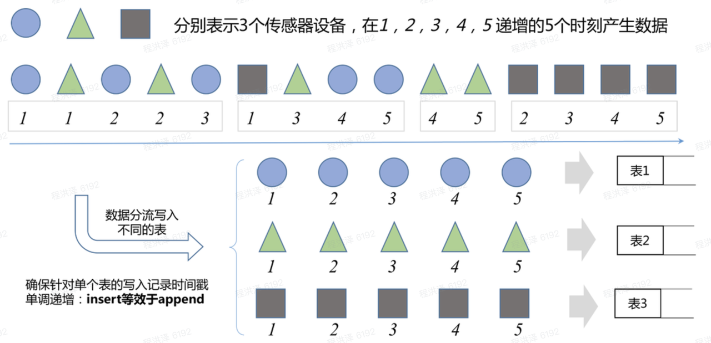
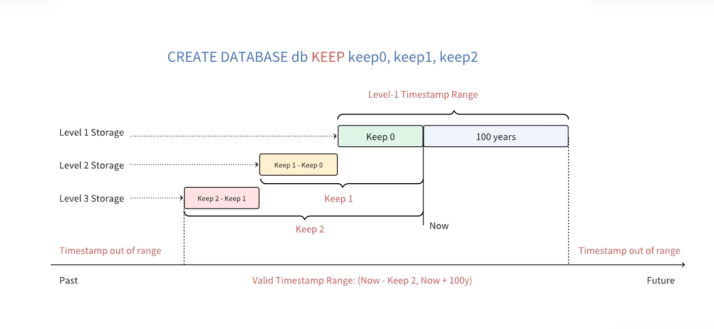

# 时序数据存储模块-Function Spec

## 1. 修订记录

| 编写日期 | 发布日期 | 版本 | 修订人 | 主要修改内容 |
| --- | --- | --- | --- | --- |
| 2025-01-13 | 2025-01-13 | 1.0 | 程洪泽 | 安可送测第一版 |
| 2025-11-24 | 2025-11-24 | 1.1 | 程洪泽 | 重构文档 |
| 2025-12-08 | 2025-12-08 | 1.2 | 程洪泽 | 按评审内容进行修改 |

## 2. 背景

随着物联网设备数量的激增和数据采集频率的提高，现有的大数据解决方案在面对海量的时序数据高并发写入和复杂查询场景时，逐渐显露出性能瓶颈。特别是在数据压缩率、磁盘 I/O 效率以及冷热数据分层存储方面，当前的实现方式存在优化空间。为了进一步提升系统的吞吐量，降低存储成本，并增强对大规模数据集的查询响应速度，我们需要针对时序数据设计并实现一套新的存储引擎，从而可以大幅提高时序场景下海量数据的存储和查询能力。
本特性旨在通过改重新设计存储引擎，充分利用时序数据特点，达成以下目标：
1. **提升写入性能**：通过减少随机 I/O 和优化 WAL 机制，提高数据摄入速度。
2. **提高压缩比**：引入针对时序数据特性的新型压缩算法，显著降低磁盘空间占用。
3. **优化查询效率**：改进数据块的索引和过滤机制，减少查询时的数据扫描量，提升点查和范围查询的响应速度。
4. **增强稳定性**：优化异常恢复流程，确保在断电或系统崩溃后的数据一致性和快速恢复能力。
5. **保障安全可控**：强化数据加密、完整性校验及访问控制机制，确保数据全生命周期的安全性与合规性。

## 3. 定义

| 术语 | 定义及说明 |
| --- | --- |
| **采集量** | 采集量是指通过各种传感器、设备或其他类型的采集点所获取的物理量，如电流、电压、温度、压力、GPS 等。由于这些物理量随时间不断变化，因此采集的数据类型多样，包括整型、浮点型、布尔型以及字符串等。随着时间的积累，存储的数据将持续增长。以智能电表为例，其中的 current、voltage 和 phase 便是典型的采集量。 |
| **标签** | 标签是指附着在传感器、设备或其他类型采集点上的静态属性，这些属性不会随时间发生变化，例如设备型号、颜色、设备所在地等。标签的数据类型可以是任意类型。尽管标签本身是静态的，但在实际应用中，用户可能需要对标签进行修改、删除或添加。与采集量不同，随着时间的推移，存储的标签数据量保持相对稳定，不会呈现明显的增长趋势。在智能电表的示例中，location 和 Group ID 就是典型的标签。 |
| **数据采集点** | 数据采集点是指在一定的预设时间周期内或受到特定事件触发时，负责采集物理量的硬件或软件设备。一个数据采集点可以同时采集一个或多个采集量，但这些采集量都是在同一时刻获取的，并拥有相同的时间戳。对于结构复杂的设备，通常会有多个数据采集点，每个数据采集点的采集周期可能各不相同，它们之间完全独立，互不干扰。以一辆汽车为例，可能有专门的数据采集点用于采集 GPS，有的数据采集点负责监控发动机状态，还有的数据采集点则专注于车内环境的监测。这样，一辆汽车就包含了 3 个不同类型的数据采集点。在智能电表的示例中，d1001、d1002、d1003、d1004 等标识符即代表了不同的数据采集点。 |
| **表** | 鉴于采集的数据通常是结构化数据，为了降低用户的学习难度，TDengine 采用传统的关系型数据库模型来管理数据。同时，为了充分发挥时序数据的特性，TDengine 采取了“一个数据采集点一张表”的设计策略，即要求为每个数据采集点单独建立一张表。 |
| **超级表** | 在 TDengine 中，表代表具体的数据采集点，而超级表则代表一组具有相同属性的数据采集点集合。超级表是一种数据结构，它能将某一特定类型的数据采集点聚集在一起，形成一张逻辑上的统一表。这些数据采集点具有相同的表结构，但各自的静态属性（如标签）可能不同。对一张超级表的查询等操作相当于对其下所有相同表结构的表的集合进行操作。 |
| **子表** | 子表是数据采集点在逻辑上的一种抽象表示，它是隶属于某张超级表的具体表。用户可以将超级表的定义作为模板，并通过指定子表的标签值来创建子表。 |
| **虚拟表** | 虚拟表是一种不存储实际数据而可以用于分析计算的表，数据来源为其它真实存储数据的子表、普通表，通过将各个原始表的不同列的数据按照时间戳排序、对齐、合并的方式来生成虚拟表。 |
| **数据库** | 库是 TDengine 中用于管理一组表的集合。 |
| **数据节点（DNode）** | 是 TDengine 服务器侧执行代码 taosd 在物理节点上的一个运行实例。它是 TDengine 分布式集群中最基本的物理组成单元，负责实际的数据存储、查询和管理任务。 |
| **虚拟节点（VNode）** | 为了进行数据分片和负载均衡而创建的，是 TDengine 基本存储与计算单元。 |
| **虚拟节点组（VGroup）** | TDengine集群中为实现数据高可用、高可靠及水平扩展而引入的核心逻辑单元。一个 VGroup 由分布在不同 DNode 上的多个 VNode 构成。这些 VNode 之间通过 Raft 一致性协议确保数据强一致性（对于元数据）或最终一致性（对于时序数据）。在 VGroup 内部，写操作仅在 Leader VNode 上执行，并异步复制到 Follower VNode，从而在多个物理节点上保留数据副本，使得即便部分节点故障，只要超过半数的节点存活，该 VGroup 就能继续提供服务 |
| **少表高频** | 采集点基数不大，但采集频率很高的时序场景。时序数据主要来自于高频采集。 |
| **多表低频** | 采集点基数大，但采集频率不高的时序场景。时序数据主要来自于测点的高基数 |
| **WAL ** | Write-Ahead Logging，预写式日志。一种数据持久化技术，在将数据写入最终存储文件之前，先写入日志文件，以保证在系统崩溃时数据的持久性和一致性。 |
| **时间戳** | 时序数据自带的时间属性。 |
| **LSM-Tree ** | Log-Structured Merge-Tree，日志结构合并树。一种针对高吞吐写入场景优化的数据结构，常用于时序数据库的存储层设计。 |
| **Compaction** | 数据合并，存储引擎后台运行的一种维护操作，将多个小的、重叠的数据文件合并成较大的、有序的文件，同时清理已删除或过期的数据，以提高查询效率和回收空间。 |
| **Block** | 数据块，存储引擎中数据读写的最小单元，通常包含一定数量的时序数据点，并经过压缩和编码。 |
| **Tombstone ** | 墓碑标记，在追加写模式的存储系统中，用于标记数据已被删除的一种特殊记录。实际数据在 Compaction 阶段才会被物理清除。 |

## 4. 行为说明

### 4.1 产品组件

TDengine 采用典型的 Client-Server 架构，主要包含以下核心组件：
- 服务端 （taosd）：
  - 提供可执行文件，负责处理客户端请求，管理数据存储和查询。
  - 包含存储引擎模块，负责数据的持久化存储、读取和管理。
- 客户端链接库（taosc）：
  - 提供动态链接库 `libtaos.so`。
  - 各种编程语言的客户端连接器都基于该动态连接库开发。
- 命令行终端（taos）：
  - 提供可执行的命令行终端，可在终端中连接 TDengine 服务端并用 SQL 语句进行操作。
  - 基于客户端开发的客户端应用之一。

### 4.2 数据模型

#### 4.2.1 时序数据特征

时序数据是一种按时间顺序排列的数据，通常由物联网设备产生，包含时间戳和多个字段值。时序数据有其他类型的数据所不具备的显著特征，利用这些特征设计存储引擎，可以大幅提高引擎的性能，节省硬件资源。时序数据的特点如下：
1. **时序性**：同一个采集设备的数据时间戳是递增的，数据按时间顺序写入。少量的乱序数据通常是由于设备故障或网络延迟引起的。
2. **结构化**：时序数据通常包含多个字段值，每个字段值对应一个采集项，如温度、湿度、压力等。时序数据的结构是固定的，不会频繁发生变化。
3. **数据量大**：时序数据通常是海量的且源源不断产生的，数据量可达 PB 级别。时序数据的数据量通常来自于两个因素：高基数的测点数或高采集频率。
4. **数据归档**：时序数据的价值随时间递减，过期数据通常会被删除或归档。
5. **极少更新或删除**：时序数据通常是追加写入的，很少更新或删除。
6. **数据变动幅度小**：同一采集设备采集的同一数据项变动幅度不大，通常是连续的趋势或周期性变化，甚至是恒定值。这决定了列式存储在时序数据中的优势。
7. **查询需求**：时序数据的查询通常是基于时间范围的过滤查询或聚合查询，最新的数据查询需求也是时序场景下的重要查询需求。基于非时间戳列的过滤查询很少或没有。
以上特征决定了 TDengine 存储引擎的设计要充分利用时序数据的特点，提高数据的存储效率和查询性能。

#### 4.2.2 时序数据模型

为了充分发挥时序数据的特性，TDengine 采用了如下的数据模型：
1. **一个数据采集点****一张表：**一个采集设备采集的数据属于同一张表，不同采集设备采集的数据属于不同的表。该模型具有以下优点：
   - 由于不同数据采集点产生数据的过程完全独立，每个数据采集点的数据源是唯一的，一张表也就只有一个写入者，这样就可采用无锁方式来写数据，写入速度能大幅提升。同时，时序特征在此数据模型下可将时间复杂度为 O(logN) 的乱序数据写入转化为时间复杂度为 O(1) 的数据追加操作，在算法层面上大幅提高数据的写入性能。
   - 对于一个数据采集点而言，其产生的数据是按照时间递增的，因此写的操作可用追加的方式实现，进一步大幅提高数据写入速度。
   - 一个数据采集点的数据是以块为单位连续存储的。这样，每次读取一个时间段的数据，能大幅减少随机读取操作，成数量级的提升读取和查询速度。
   - 一个数据块内部，采用列式存储，对于不同的数据类型，可以采用不同压缩算法来提高压缩率。并且，由于采集量的变化通常是缓慢的，压缩率会更高。


1. **超级表**：超级表是多个表的集合，属于同一个超级表的子表具有相同的采集数据结构和标签结构，但不同的子表的标签值不同。
   - “一个数据采集点一张表”的数据模型会引入复杂的表管理工作，为了解决这个问题，引入了超级表的概念。
   - 超级表是多个表的集合，属于同一个超级表的子表具有相同的采集数据结构和标签结构，但不同的子表的标签值不同。
   - 超级表的引入可以有效降低表管理的难度，对超级表的修改会自动应用到所有子表上，提高了表的管理效率。对超级表的查询相当于对所有子表的查询，大大降低了 TDengine 的使用复杂度。
2. **虚拟表**：虚拟表（View）是基于 SQL 查询语句定义的逻辑表，它本身不存储数据，而是动态地从基础表中获取数据。
   - 虚拟表提供了一种灵活的数据访问方式，用户可以将复杂的查询逻辑（如聚合、过滤等）封装在虚拟表中，简化上层应用的开发。
   - 通过虚拟表，可以实现数据的逻辑隔离和安全控制，仅向特定用户暴露部分数据或经过处理的数据，而无需授予其对底层物理表的完全访问权限。
   - 虚拟表还增强了数据模型的独立性，当底层表结构发生变化时，可以通过修改虚拟表的定义来保持对外接口的稳定性。

### 4.3 元数据管理

#### 4.3.1 数据库管理

与其他数据库一样，TDengine 在进行时序数据的操作时，需要指定相应的数据库。TDengine 提供了丰富的数据库 SQL 管理接口，包括数据库的创建、删除、修改等功能。

##### 4.3.1.1 创建数据库

用户可通过如下语句创建数据库：
```sql
CREATE DATABASE [IF NOT EXISTS] db_name [database_options];

database_options:
    database_option ...

database_option: {
    VGROUPS value
  | PRECISION {'ms' | 'us' | 'ns'}
  | REPLICA value
  | BUFFER value
  | PAGES value
  | PAGESIZE  value
  | CACHEMODEL {'none' | 'last_row' | 'last_value' | 'both'}
  | CACHESIZE value
  | COMP {0 | 1 | 2}
  | DURATION value
  | MAXROWS value
  | MINROWS value
  | KEEP value
  | KEEP_TIME_OFFSET value
  | STT_TRIGGER value
  | SINGLE_STABLE {0 | 1}
  | TABLE_PREFIX value
  | TABLE_SUFFIX value
  | DNODES value
  | TSDB_PAGESIZE value
  | WAL_LEVEL {1 | 2}
  | WAL_FSYNC_PERIOD value
  | WAL_RETENTION_PERIOD value
  | WAL_RETENTION_SIZE value
  | COMPACT_INTERVAL value
  | COMPACT_TIME_RANGE value
  | COMPACT_TIME_OFFSET value
  | SS_KEEPLOCAL value
  | SS_CHUNKPAGES value
  | SS_COMPACT value
}
```

参数说明：
- VGROUPS：数据库中初始 vgroup 的数目。
- PRECISION：数据库的时间戳精度。
  - ms 表示毫秒（默认值）。
  - us 表示微秒。
  - ns 表示纳秒。
- REPLICA：表示数据库副本数，取值为 1、2 或 3，默认为 1; 2 仅在企业版支持。在集群中使用时，副本数必须小于或等于 DNODE 的数目。且使用时存在以下限制：
  - 单副本数据库可变更为双副本数据库，但不支持从双副本变更为其它副本数，也不支持从三副本变更为双副本。
- BUFFER：一个 vnode 写入内存池大小，单位为 MB，默认为 256，最小为 3，最大为 16384。
- PAGES：一个 vnode 中元数据存储引擎的缓存页个数，默认为 256，最小 64。一个 vnode 元数据存储占用 PAGESIZE * PAGES，默认情况下为 1MB 内存。
- PAGESIZE：一个 vnode 中元数据存储引擎的页大小，单位为 KB，默认为 4 KB。范围为 1 到 16384，即 1 KB 到 16 MB。
- CACHEMODEL：表示是否在内存中缓存子表的最近数据。
  - none：表示不缓存（默认值）。
  - last_row：表示缓存子表最近一行数据。这将显著改善 LAST_ROW 函数的性能表现。
  - last_value：表示缓存子表每一列的最近的非 NULL 值。这将显著改善无特殊影响（WHERE、ORDER BY、GROUP BY、INTERVAL）下的 LAST 函数的性能表现。
  - both：表示同时打开缓存最近行和列功能。
- CACHESIZE：表示每个 vnode 中用于缓存子表最近数据的内存大小。默认为 1，范围是[1, 65536]，单位是 MB。
- COMP：表示数据库文件压缩标志位，缺省值为 2，取值范围为 [0, 2]。
  - 0：表示不压缩。
  - 1：表示一阶段压缩。
  - 2：表示两阶段压缩。
- DURATION：数据文件存储数据的时间跨度。缺省值为 10d，取值范围 [60m, 3650d]
  - 可以使用加单位的表示形式，如 DURATION 100h、DURATION 10d 等，支持 m（分钟）、h（小时）和 d（天）三个单位。
  - 不加时间单位时默认单位为天，如 DURATION 50 表示 50 天。
- MAXROWS：文件块中记录的最大条数，默认为 4096 条。
- MINROWS：文件块中记录的最小条数，默认为 100 条。
- KEEP：表示数据文件保存的天数，缺省值为 3650，取值范围 [1, 365000]，且必须大于或等于 3 倍的 DURATION 参数值。
  - 数据库会自动删除保存时间超过 KEEP 值的数据从而释放存储空间；
  - KEEP 可以使用加单位的表示形式，如 KEEP 100h、KEEP 10d 等，支持 m（分钟）、h（小时）和 d（天）三个单位；
  - 也可以不写单位，如 KEEP 50，此时默认单位为天；
  - 仅企业版支持多级存储功能，因此，可以设置多个保存时间（多个以英文逗号分隔，最多 3 个，满足 keep 0 <= keep 1 <= keep 2，如 KEEP 100h,100d,3650d）；
  - 社区版不支持多级存储功能（即使配置了多个保存时间，也不会生效，KEEP 会取最大的保存时间）；
- KEEP_TIME_OFFSET：删除或迁移保存时间超过 KEEP 值的数据的延迟执行时间，默认值为 0 (小时)。
  - 在数据文件保存时间超过 KEEP 后，删除或迁移操作不会立即执行，而会额外等待本参数指定的时间间隔，以实现与业务高峰期错开的目的。
- STT_TRIGGER：表示落盘文件触发文件合并的个数。
  - 对于少表高频写入场景，此参数建议使用默认配置；
  - 而对于多表低频写入场景，此参数建议配置较大的值。
- SINGLE_STABLE：表示此数据库中是否只可以创建一个超级表，用于超级表列非常多的情况。
  - 0：表示可以创建多张超级表。
  - 1：表示只可以创建一张超级表。
- TABLE_PREFIX：分配数据表到某个 vgroup 时，用于忽略或仅使用表名前缀的长度值。
  - 当其为正值时，在决定把一个表分配到哪个 vgroup 时要忽略表名中指定长度的前缀；
  - 当其为负值时，在决定把一个表分配到哪个 vgroup 时只使用表名中指定长度的前缀；
  - 例如：假定表名为 "v30001"，当 TSDB_PREFIX = 2 时，使用 "0001" 来决定分配到哪个 vgroup，当 TSDB_PREFIX = -2 时使用 "v3" 来决定分配到哪个 vgroup。
- TABLE_SUFFIX：分配数据表到某个 vgroup 时，用于忽略或仅使用表名后缀的长度值。
  - 当其为正值时，在决定把一个表分配到哪个 vgroup 时要忽略表名中指定长度的后缀；
  - 当其为负值时，在决定把一个表分配到哪个 vgroup 时只使用表名中指定长度的后缀；
- TSDB_PAGESIZE：一个 vnode 中时序数据存储引擎的页大小，单位为 KB，默认为 4 KB。范围为 1 到 16384，即 1 KB 到 16 MB。
- DNODES：指定 vnode 所在的 DNODE 列表，如 '1,2,3'，以逗号区分且字符间不能有空格（仅企业版支持）
- WAL_LEVE：WAL 级别，默认为 1。
  - 1：写 WAL，但不执行 fsync。
  - 2：写 WAL，而且执行 fsync。
- WAL_FSYNC_PERIOD：当 WAL_LEVEL 参数设置为 2 时，用于设置落盘的周期。默认为 3000，单位毫秒。最小为 0，表示每次写入立即落盘；最大为 180000，即三分钟。
- WAL_RETENTION_PERIOD：为了数据订阅消费，需要 WAL 日志文件额外保留的最大时长策略。WAL 日志清理，不受订阅客户端消费状态影响。单位为 s。默认为 3600，表示在 WAL 保留最近 3600 秒的数据，请根据数据订阅的需要修改这个参数为适当值。
- WAL_RETENTION_SIZE：为了数据订阅消费，需要 WAL 日志文件额外保留的最大累计大小策略。单位为 KB。默认为 0，表示累计大小无上限。
- COMPACT_INTERVAL：自动 compact 触发周期（从 1970-01-01T00:00:00Z 开始切分的时间周期）（仅企业版支持）。
  - 取值范围：0 或 [10m, keep2]，单位：m（分钟），h（小时），d（天）；
  - 不加时间单位默认单位为天，默认值为 0，即不触发自动 compact 功能；
  - 如果 db 中有未完成的 compact 任务，不重复下发 compact 任务。
- COMPACT_TIME_RANGE：自动 compact 任务触发的 compact 时间范围（仅企业版支持）。
  - 取值范围：[-keep2, -duration]，单位：m（分钟），h（小时），d（天）；
  - 不加时间单位时默认单位为天，默认值为 [0, 0]；
  - 取默认值 [0, 0] 时，如果 COMPACT_INTERVAL 大于 0，会按照 [-keep2, -duration] 下发自动 compact；
  - 因此，要关闭自动 compact 功能，需要将 COMPACT_INTERVAL 设置为 0。
- COMPACT_TIME_OFFSET：自动 compact 任务触发的 compact 时间相对本地时间的偏移量（仅企业版支持）。取值范围：[0, 23]，单位：h（小时），默认值为 0。以 UTC 0 时区为例：
  - 如果 COMPACT_INTERVAL 为 1d，当 COMPACT_TIME_OFFSET 为 0 时，在每天 0 点下发自动 compact；
  - 如果 COMPACT_TIME_OFFSET 为 2，在每天 2 点下发自动 compact。
- SS_KEEPLOCAL：使用共享存储时，数据再本地保留的时长，即数据文件在本地磁盘保留多长事件后可以上传到共享存储（仅企业版支持）。取值范围为 1 天 - 36500 天，且必须大于或等于 `DURATION` 参数的 3 倍。默认为 365 天。
- SS_CHUNKPAGES：使用共享存储时，上传对象大小的阈值（仅企业版支持），小于此选项的数据文件不会上传，单位是 TSDB 的页（默认每页 4K 字节）。
  - 取值范围：[131072, 1048576]，默认值为 131072。
  - 只能在创建数据库时指定，创建后不可修改。
- SS_COMPACT：首次上传共享存储前，是否对文件组进行 Compact（仅企业版支持）。 0 表示首次迁移前不进行 Compact，1 表示首次迁移前进行 Compact。默认值是 1。

##### 4.3.1.2 使用数据库

用户可通过如下命令使用/切换数据库。切换数据库用，所有操作默认在该数据库中进行：
```sql
USE db_name;
```

##### 4.3.1.3 删除数据库

用户可通过如下命令删除数据库：
```sql
DROP DATABASE [IF EXISTS] db_name;
```

删除数据库。指定 Database 所包含的全部数据表将被删除，该数据库的所有 vgroups 也会被全部销毁，需谨慎使用。

##### 4.3.1.4 修改数据库

用户可以通过以下 SQL 语句修改数据库的相关参数：
```sql
ALTER DATABASE db_name [alter_database_options]

alter_database_options:
    alter_database_option ...

alter_database_option: {
    CACHEMODEL {'none' | 'last_row' | 'last_value' | 'both'}
  | CACHESIZE value
  | BUFFER value
  | PAGES value
  | REPLICA value
  | STT_TRIGGER value
  | WAL_LEVEL value
  | WAL_FSYNC_PERIOD value
  | KEEP value
  | WAL_RETENTION_PERIOD value
  | WAL_RETENTION_SIZE value
  | MINROWS value
  | COMPACT_INTERVAL value
  | COMPACT_TIME_RANGE value
  | COMPACT_TIME_OFFSET value  
}
```

相关参数参照 [创建数据库](https://taosdata.feishu.cn/wiki/BDwcwr9iqid0wKk8u07cJyrRn5d#share-ShYVdaUDhoG3B9xOFIacNutLnZd) 章节。

##### 4.3.1.5 数据库相关查询

###### 4.3.1.5.1 查看数据库

用户可通过下面的`SQL`语句查看系统中有权限查看的所有数据库：
```sql
SHOW DATABASES;
```

###### 4.3.1.5.2 显示数据库的创建语句

用户可通过下面的`SQL`语句查看数据库的创建语句：
```sql
SHOW CREATE DATABASE db_name \G;
```

#### 4.3.2 超级表管理

超级表是 TDengine 中定义数据采集表结构的模板，该模板定义了其下子表的采集点结构及静态属性（标签）结构。用户可以通过`SQL`指令对超级表进行生命周期管理，主要包括创建、删除、修改、和查询等操作。

##### 4.3.2.1 创建超级表

用户可通过下面的 `SQL` 语句创建一个超级表：
```sql
CREATE STABLE [IF NOT EXISTS] stb_name (create_definition [, create_definition] ...) TAGS (create_definition [, create_definition] ...) [table_options]
 
create_definition:
    col_name column_definition
 
column_definition:
    type_name [COMPOSITE KEY] [ENCODE 'encode_type'] [COMPRESS 'compress_type'] [LEVEL 'level_type']

table_options:
    table_option ...

table_option: {
    COMMENT 'string_value'
  | SMA(col_name [, col_name] ...)  
  | KEEP value
  | VIRTUAL {0 | 1}
}
```

说明：
1. 超级表中列的最大个数为 4096，需要注意，这里的 4096 是包含 TAG 列在内的，最小个数为 3，包含一个时间戳主键、一个 TAG 列和一个数据列。
2. 除时间戳主键列之外，还可以通过 COMPOSITE KEY 关键字指定第二列为额外的主键列，该列与时间戳列共同组成复合主键。当设置了复合主键时，两条记录的时间戳列与 COMPOSITE KEY 列都相同，才会被认为是重复记录，数据库只保留最新的一条；否则视为两条记录，全部保留。注意：被指定为主键列的第二列必须为整型或字符串类型（varchar）。
3. TAGS 语法指定超级表的标签列，标签列需要遵循以下约定：
  - TAGS 中的 TIMESTAMP 列写入数据时需要提供给定值，而暂不支持四则运算，例如 NOW + 10s 这类表达式。
  - TAGS 列名不能与其他列名相同。
  - TAGS 列名不能为预留关键字。
  - TAGS 最多允许 128 个，至少 1 个，总长度不超过 16 KB。
1. 关于 `ENCODE` 和 `COMPRESS` 的使用，请参考 [按列压缩](https://docs.taosdata.com/reference/taos-sql/compress/)
2. 关于 table_option 中的参数说明，请参考 [建表 SQL 说明](https://docs.taosdata.com/reference/taos-sql/table/)
3. 关于 table_option 中的 keep 参数，仅对超级表生效，keep 参数的详细说明可以参考 [数据库说明](https://docs.taosdata.com/reference/taos-sql/database/)，但是超级表的 keep 参数与 db 的 keep 参数有以下不同：
  - 超级表 keep 参数不会立即影响查询结果，只有在 compact 完成后，数据才会被清理，并对查询不可见。
  - 超级表的 keep 参数需小于数据库的 keep 参数。
  - compact 前必须进行 flush 否则可能不生效。
  - compact 之后，alter stable 的 keep 再 compact ,部分数据有可能无法被正确清理，这取决于对应的文件在上次 compact 之后是否有新的数据写入。
1. 关于 table_option 中的 virtual 参数，仅对超级表生效，指定为 1 表示创建虚拟超级表，为 0 表示创建超级表，默认为 0。创建虚拟超级表时，column_definition 中只支持 type_name 选项，不支持定义额外主键列以及压缩选项。

##### 4.3.2.2 删除超级表

用户可通过如下 SQL 语句删除超级表：
```sql
DROP STABLE [IF EXISTS] [db_name.]stb_name
```

- 删除 STable 会自动删除通过 STable 创建的子表以及子表中的所有数据。
- 删除超级表并不会立即释放该表所占用的磁盘空间，而是把该表的数据标记为已删除，在查询时这些数据将不会再出现，但释放磁盘空间会延迟到系统自动或用户手动进行数据重整时。

##### 4.3.2.3 修改超级表

用户可通过如下 SQL 语句修改超级表：
```sql
ALTER STABLE [db_name.]tb_name alter_table_clause
 
alter_table_clause: {
    alter_table_options
  | ADD COLUMN col_name column_type
  | DROP COLUMN col_name
  | MODIFY COLUMN col_name column_type
  | ADD TAG tag_name tag_type
  | DROP TAG tag_name
  | MODIFY TAG tag_name tag_type
  | RENAME TAG old_tag_name new_tag_name
}
 
alter_table_options:
    alter_table_option ...
 
alter_table_option: {
    COMMENT 'string_value'
  | KEEP value
}

```

**使用说明**
修改超级表的结构会对其下的所有子表生效。无法针对某个特定子表修改表结构。标签结构的修改需要对超级表下发，TDengine 会自动作用于此超级表的所有子表。
- **ADD COLUMN**：添加列。
- **DROP COLUMN**：删除列。
- **MODIFY COLUMN**：修改列的宽度，数据列的类型必须是 nchar 和 binary，使用此指令可以修改其宽度，只能改大，不能改小。
- **ADD TAG**：给超级表添加一个标签。
- **DROP TAG**：删除超级表的一个标签。从超级表删除某个标签后，该超级表下的所有子表也会自动删除该标签。
- **MODIFY TAG**：修改超级表的一个标签的列宽度。标签的类型只能是 nchar 和 binary，使用此指令可以修改其宽度，只能改大，不能改小。
- **RENAME TAG**：修改超级表的一个标签的名称。从超级表修改某个标签名后，该超级表下的所有子表也会自动更新该标签名。
- 与普通表一样，超级表的主键列不允许被修改，也不允许通过 ADD/DROP COLUMN 来添加或删除主键列。

##### 4.3.2.4 超级表相关查询

###### 4.3.2.4.1 显示当前数据库下的所有超级表信息

```sql
SHOW STABLES [LIKE tb_name_wildcard];
```

###### 4.3.2.4.2 显示一个超级表的创建语句

```sql
SHOW CREATE STABLE stb_name;
```

###### 4.3.2.4.3 获取超级表的结构信息

```sql
DESCRIBE [db_name.]stb_name;
```

###### 4.3.2.4.4 获取超级表中所有子表的标签信息

```sql
SHOW TABLE TAGS FROM table_name [FROM db_name];
SHOW TABLE TAGS FROM [db_name.]table_name;
```

###### 4.3.2.4.5 获取某个子表的标签信息

用 `SHOW` 命令获取某个子表的标签信息：
```sql
SHOW TAGS FROM ctb_name;
```

也可通过 SELECT 命令获取部分标签列的信息：
```sql
SELECT DISTINCT col1, col2, col3 FROM ctb_name;
```

#### 4.3.3 子表与普通表管理

创建超级表后，用户可以以该超级表作为模板创建子表，并通过子表写入时序数据。

##### 4.3.3.1 创建表

用户可通过如下 `SQL` 语句创建表：
```sql
CREATE TABLE [IF NOT EXISTS] [db_name.]tb_name (create_definition [, create_definition] ...) [table_options]

CREATE TABLE create_subtable_clause

CREATE TABLE [IF NOT EXISTS] [db_name.]tb_name (create_definition [, create_definition] ...)
    [TAGS (create_definition [, create_definition] ...)]
    [table_options]

create_subtable_clause: {
    create_subtable_clause [create_subtable_clause] ...
  | [IF NOT EXISTS] [db_name.]tb_name USING [db_name.]stb_name [(tag_name [, tag_name] ...)] TAGS (tag_value [, tag_value] ...)
}

create_definition:
    col_name column_definition

column_definition:
    type_name [COMPOSITE KEY] [ENCODE 'encode_type'] [COMPRESS 'compress_type'] [LEVEL 'level_type']

table_options:
    table_option ...

table_option: {
    COMMENT 'string_value'
  | SMA(col_name [, col_name] ...)
  | TTL value
}

```

**使用说明**
1. 表（列）名命名规则参见 [名称命名规则](https://docs.taosdata.com/reference/taos-sql/limit/#%E5%90%8D%E7%A7%B0%E5%91%BD%E5%90%8D%E8%A7%84%E5%88%99)。
2. 表名最大长度为 192。
3. 表的第一个字段必须是 TIMESTAMP，并且系统自动将其设为主键。
4. 除时间戳主键列之外，还可以通过 COMPOSITE KEY 关键字指定第二列为额外的主键列，该列与时间戳列共同组成复合主键。当设置了复合主键时，两条记录的时间戳列与 COMPOSITE KEY 列都相同，才会被认为是重复记录，数据库只保留最新的一条；否则视为两条记录，全部保留。注意：被指定为主键列的第二列必须为整型 (INT32、INT64、UINT32、UINT64) 或字符串类型（VARCHAR、BINARY）。
5. 表的每行长度不能超过 64KB;（注意：每个 VARCHAR/NCHAR/GEOMETRY 类型的列还会额外占用 2 个字节的存储位置）。
6. 使用数据类型 VARCHAR/NCHAR/GEOMETRY，需指定其最长的字节数，如 VARCHAR(20)，表示 20 字节。
7. 关于 `ENCODE` 和 `COMPRESS` 的使用，请参考 [按列压缩](https://docs.taosdata.com/reference/taos-sql/compress/)。
**参数说明**
1. COMMENT：表注释。可用于超级表、子表和普通表。最大长度为 1024 个字节。
2. SMA：Small Materialized Aggregates，提供基于数据块的自定义预计算功能。预计算类型包括 MAX、MIN 和 SUM。可用于超级表/普通表。
3. TTL：Time to Live，是用户用来指定表的生命周期的参数。如果创建表时指定了这个参数，当该表的存在时间超过 TTL 指定的时间后，TDengine 自动删除该表。这个 TTL 的时间只是一个大概时间，系统不保证到了时间一定会将其删除，而只保证存在这样一个机制且最终一定会删除。TTL 单位是天，取值范围为[0, 2147483647]，默认为 0，表示不限制，到期时间为表创建时间加上 TTL 时间。TTL 与数据库 KEEP 参数没有关联，如果 KEEP 比 TTL 小，在表被删除之前数据也可能已经被删除。

###### 4.3.3.1.1 创建普通表

```sql
CREATE TABLE [IF NOT EXISTS] tb_name (create_definition [, create_definition] ...);
```

###### 4.3.3.1.2 创建子表

```sql
CREATE TABLE [IF NOT EXISTS] tb_name USING stb_name TAGS (tag_value1, ...);
```

###### 4.3.3.1.3 创建子表并指定标签

```sql
CREATE TABLE [IF NOT EXISTS] tb_name USING stb_name (tag_name1, ...) TAGS (tag_value1, ...);
```

###### 4.3.3.1.4 批量创建子表

```sql
CREATE TABLE [IF NOT EXISTS] tb_name1 USING stb_name TAGS (tag_value1, ...) [IF NOT EXISTS] tb_name2 USING stb_name TAGS (tag_value2, ...) ...;
```

##### 4.3.3.2 删除表

可通过如下 `SQL` 语句删除普通表或子表：
```sql
DROP TABLE [IF EXISTS] [db_name.]tb_name [, [IF EXISTS] [db_name.]tb_name] ...
```

##### 4.3.3.3 修改表

###### 4.3.3.3.1 修改普通表

可通过如下 `SQL` 语句修改普通表：
```sql
ALTER TABLE [db_name.]tb_name alter_table_clause

alter_table_clause: {
    alter_table_options
  | ADD COLUMN col_name column_type
  | DROP COLUMN col_name
  | MODIFY COLUMN col_name column_type
  | RENAME COLUMN old_col_name new_col_name
}

alter_table_options:
    alter_table_option ...

alter_table_option: {
    TTL value
  | COMMENT 'string_value'
}
```

**使用说明** 对普通表可以进行如下修改操作
1. ADD COLUMN：添加列。
2. DROP COLUMN：删除列。
3. MODIFY COLUMN：修改列定义，如果数据列的类型是可变长类型，那么可以使用此指令修改其宽度，只能改大，不能改小。
4. RENAME COLUMN：修改列名称。
5. 普通表的主键列不能被修改，也不能通过 ADD/DROP COLUMN 来添加/删除主键列。
**参数说明**
1. COMMENT：表注释。可用于超级表、子表和普通表。最大长度为 1024 个字节。
2. TTL：Time to Live，是用户用来指定表的生命周期的参数。如果创建表时指定了这个参数，当该表的存在时间超过 TTL 指定的时间后，TDengine 自动删除该表。这个 TTL 的时间只是一个大概时间，系统不保证到了时间一定会将其删除，而只保证存在这样一个机制且最终一定会删除。TTL 单位是天，取值范围为[0, 2147483647]，默认为 0，表示不限制，到期时间为表创建时间加上 TTL 时间。TTL 与数据库 KEEP 参数没有关联，如果 KEEP 比 TTL 小，在表被删除之前数据也可能已经被删除。

###### 4.3.3.3.2 修改子表

通过下列语句修改子表：
```sql
ALTER TABLE [db_name.]tb_name alter_table_clause

alter_table_clause: {
    alter_table_options
  | SET TAG tag_name = new_tag_value, tag_name2=new_tag2_value ...
}

alter_table_options:
    alter_table_option ...

alter_table_option: {
    TTL value
  | COMMENT 'string_value'
}
```

**使用说明**
1. 对子表的列和标签的修改，除了更改标签值以外，都要通过超级表才能进行。
**参数说明**
1. COMMENT：表注释。可用于超级表、子表和普通表。最大长度为 1024 个字节。
2. TTL：Time to Live，是用户用来指定表的生命周期的参数。如果创建表时指定了这个参数，当该表的存在时间超过 TTL 指定的时间后，TDengine 自动删除该表。这个 TTL 的时间只是一个大概时间，系统不保证到了时间一定会将其删除，而只保证存在这样一个机制且最终一定会删除。TTL 单位是天，取值范围为[0, 2147483647]，默认为 0，表示不限制，到期时间为表创建时间加上 TTL 时间。TTL 与数据库 KEEP 参数没有关联，如果 KEEP 比 TTL 小，在表被删除之前数据也可能已经被删除。

##### 4.3.3.4 表信息查询

###### 4.3.3.4.1 显示所有表

如下 `SQL` 语句可以列出当前数据库中的所有表名：
```sql
SHOW TABLES [LIKE tb_name_wildcard];
```

###### 4.3.3.4.2 显示表创建语句

```sql
SHOW CREATE TABLE tb_name;
```

###### 4.3.3.4.3 获取表结构信息

```sql
DESCRIBE [db_name.]tb_name;
```

#### 4.3.4 虚拟表管理

##### 4.3.4.1 创建虚拟表

`CREATE VTABLE` 语句用于创建虚拟普通表和以虚拟超级表为模板创建虚拟子表。

###### 4.3.4.1.1 创建虚拟超级表

见 [创建超级表](https://docs.taosdata.com/reference/taos-sql/stable/#%E5%88%9B%E5%BB%BA%E8%B6%85%E7%BA%A7%E8%A1%A8) 中的 `VIRTUAL` 参数。

###### 4.3.4.1.2 创建虚拟普通表

```sql
CREATE VTABLE [IF NOT EXISTS] [db_name].vtb_name 
    ts_col_name timestamp, 
    (create_definition[ ,create_definition] ...) 
     
  create_definition:
    vtb_col_name column_definition
    
  column_definition:
    type_name [FROM [db_name.]table_name.col_name]
```

###### 4.3.4.1.3 创建虚拟子表

```sql
CREATE VTABLE [IF NOT EXISTS] [db_name].vtb_name 
    (create_definition[ ,create_definition] ...) 
    USING [db_name.]stb_name 
    [(tag_name [, tag_name] ...)] 
    TAGS (tag_value [, tag_value] ...)
     
  create_definition:
    [stb_col_name FROM] [db_name.]table_name.col_name
  tag_value:
     const_value
```

**使用说明**
1. 虚拟表（列）名命名规则参见 [名称命名规则](https://docs.taosdata.com/reference/taos-sql/limit/#%E5%90%8D%E7%A7%B0%E5%91%BD%E5%90%8D%E8%A7%84%E5%88%99)。
2. 表名最大长度为 192。
3. 表的第一个字段必须是 TIMESTAMP，并且系统自动将其设为主键。
4. 表的每行长度不能超过 64KB（注意：每个 VARCHAR/NCHAR/GEOMETRY 类型的列还会额外占用 2 个字节的存储位置）。
5. 使用数据类型 VARCHAR/NCHAR/GEOMETRY，需指定其最长的字节数，如 VARCHAR(20)，表示 20 字节。
6. 创建虚拟表时使用 FROM 来指定列的数据源，支持使用 db_name 跨库指定数据源，不指定 db_name 时默认使用当前 use 的数据库，若不指定 db_name 且未 use 数据库，则会报错。
7. 创建虚拟表时不显式的指定 ts 列的数据源，ts 列的取值是查询虚拟表时查询语句中包含的所有列对应的原始表的主键时间戳合并的结果。
8. 虚拟超级表下只支持创建虚拟子表，虚拟子表也只能以虚拟超级表为模版来创建。
9. 创建虚拟表时需要保证虚拟表中的列、标签和指定的数据来源列、标签的数据类型相同，否则会报错。
10. 在同一个数据库内，虚拟表名称不允许重名，虚拟表名和表名也不允许重名。虚拟表名和视图名允许重名（不推荐）当出现视图与虚拟表名重名时，写入、查询、授权、回收权限等操作优先使用同名表。
11. 创建虚拟子表和虚拟普通表时，使用 FROM 指定某一列的数据来源时，该列只能来源于普通子表或普通表，不支持来源于超级表、视图或其他虚拟表。也不支持来源于有复合主键的表。

##### 4.3.4.2 删除虚拟表

```sql
DROP VTABLE [IF EXISTS] [dbname].vtb_name;
```

##### 4.3.4.3 修改虚拟表

###### 4.3.4.3.1 修改虚拟普通表

```sql
ALTER VTABLE [db_name.]vtb_name alter_table_clause

alter_table_clause: {
  ADD COLUMN vtb_col_name vtb_column_type [FROM table_name.col_name]
  | DROP COLUMN vtb_col_name
  | ALTER COLUMN vtb_col_name SET {table_name.col_name | NULL }
  | MODIFY COLUMN col_name column_type
  | RENAME COLUMN old_col_name new_col_name
}
```

**使用说明** 对虚拟普通表可以进行如下修改操作
1. ADD COLUMN：添加列。
2. DROP COLUMN：删除列。
3. MODIFY COLUMN：修改列定义，如果数据列的类型是可变长类型，那么可以使用此指令修改其宽度，只能改大，不能改小。如果虚拟表该列已指定数据源，那么修改列宽会因为修改后的列宽和数据源的列宽不匹配而报错，可以先将数据源置为空后再修改列宽。
4. RENAME COLUMN：修改列名称。
5. ALTER COLUMN .. SET：修改列的数据源。SET NULL 表示将虚拟表某列的数据源置为空。

###### 4.3.4.3.2 修改虚拟子表

```sql
ALTER VTABLE [db_name.]vtb_name alter_table_clause

alter_table_clause: {
  ALTER COLUMN vtb_col_name SET table_name.col_name
  | SET TAG tag_name = new_tag_value
}
```

**使用说明**
1. 对虚拟子表的列和标签的修改，除了更改标签值以外，都要通过虚拟超级表才能进行。

##### 4.3.4.4 查看虚拟表信息

###### 4.3.4.4.1 显示某个数据库下所有虚拟表

如下 SQL 语句可以列出当前数据库中的所有虚拟表名。
```sql
SHOW [NORMAL | CHILD] [db_name.]VTABLES [LIKE 'pattern'];
```

**使用说明**
1. 如果没有指定 db_name，显示当前数据库下的所有虚拟普通表和虚拟子表的信息。若没有使用数据库并且没有指定 db_name, 则会报错 database not specified。可以使用 LIKE 对表名进行模糊匹配。NORMAL 指定只显示虚拟普通表信息，CHILD 指定只显示虚拟子表信息。

###### 4.3.4.4.2 显示虚拟表创建语句

```sql
SHOW CREATE VTABLE [db_name.]vtable_name;
```

显示 vtable_name 指定的虚拟表的创建语句。支持虚拟普通表和虚拟子表。常用于数据库迁移。对一个已经存在的虚拟表，返回其创建语句；在另一个集群中执行该语句，就能得到一个结构完全相同的虚拟表。

###### 4.3.4.4.3 获取虚拟表结构信息

```sql
DESCRIBE [db_name.]vtb_name;
```

###### 4.3.4.4.4 查看所有虚拟表信息

```sql
SELECT ... FROM information_schema.ins_tables where type = 'VIRTUAL_NORMAL_TABLE' or type = 'VIRTUAL_CHILD_TABLE';
```

### 4.4 时序数据管理

#### 4.4.1 数据写入

写入记录支持两种语法，正常语法和超级表语法。正常语法下，紧跟 INSERT INTO 后名的表名是子表名或者普通表名。超级表语法下，紧跟 INSERT INTO 后名的表名是超级表名。

##### 4.4.1.1 正常语法

```sql
INSERT INTO
    tb_name
        [USING stb_name [(tag1_name, ...)] TAGS (tag1_value, ...)]
        [(field1_name, ...)]
        VALUES (field1_value, ...) [(field1_value2, ...) ...] | FILE csv_file_path
    [tb2_name
        [USING stb_name [(tag1_name, ...)] TAGS (tag1_value, ...)]
        [(field1_name, ...)]
        VALUES (field1_value, ...) [(field1_value2, ...) ...] | FILE csv_file_path
    ...];

INSERT INTO tb_name [(field1_name, ...)] subquery
```

##### 4.4.1.2 超级表语法

```sql
INSERT INTO
    stb1_name [(field1_name, ...)]
        VALUES (field1_value, ...) [(field1_value2, ...) ...] | FILE csv_file_path
    [stb2_name [(field1_name, ...)]
        VALUES (field1_value, ...) [(field1_value2, ...) ...] | FILE csv_file_path
    ...];

INSERT INTO stb_name (tbname, field1_name, ...) subquery
```

关于主键时间戳
TDengine 要求插入的数据必须要有时间戳，插入数据的时间戳要注意以下几点：
1. 不同的时间戳格式有不同的精度影响。字符串格式的时间戳写法不受所在 DATABASE 的时间精度影响；而长整形格式的时间戳写法会受到所在 DATABASE 的时间精度影响。例如，时间戳 "2021-07-13 16:16:48" 的 UNIX 秒数为 1626164208。其在毫秒精度下需要写作 1626164208000，微秒精度下需要写为 1626164208000000，纳秒精度下需要写为 1626164208000000000。
2. 一次插入多行数据时，不要把首列的时间戳的值都写 NOW。否则会导致语句中的多条记录使用相同的时间戳，可能出现相互覆盖以致这些数据行无法全部被正确保存。其原因在于，NOW 函数在执行中会被解析为所在 SQL 语句的客户端执行时间，在同一语句中的多个 NOW 标记会被替换为完全相同的时间戳。
3. 允许插入的最大时间戳为当前时间加上 100 年，比如当前时间为 `2024-11-11 12:00:00`，允许插入的最大时间戳为`2124-11-11 12:00:00`。允许插入的最小时间戳取决于数据库的 KEEP 设置。企业版支持三级存储，可以设置多个 KEEP 时间，如下图所示，如果数据库的 KEEP 配置为 `100h,100d,3650d`，允许的最小时间戳为当前时间减去 3650 天。那么，时间戳在 `[Now - 100h, Now + 100y)` 内的会保存在一级存储，时间戳在 `[Now - 100d, Now - 100h)` 内的会保存在二级存储，时间戳在 `[Now - 3650d, Now - 100d)` 内的会保存在三级存储。社区版不支持多级存储功能，只能配置一个 KEEP 值，如果配置多个，则取其最大者。如果时间戳不在有效时间范围内，TDengine 将返回错误 "Timestamp out of range"。


##### 4.4.1.3 语法说明

1. 可以指定要插入值的列，未指定的列将自动填充为 NULL。
2. VALUES 语法表示了要插入的一行或多行数据。
3. FILE 语法表示数据来自于 CSV 文件（英文逗号分隔、英文单引号括住每个值），CSV 文件无需表头。如仅需创建子表，请参考 [表](https://docs.taosdata.com/reference/taos-sql/table/#%E6%89%B9%E9%87%8F%E5%88%9B%E5%BB%BA%E5%AD%90%E8%A1%A8) 章节。
4. `INSERT ... VALUES` 语句和 `INSERT ... FILE` 语句均可以在一条 INSERT 语句中同时向多个表插入数据。
5. INSERT 语句是完整解析后再执行的，对如下语句，不会再出现数据错误但建表成功的情况：
```sql
INSERT INTO d1001 USING meters TAGS('Beijing.Chaoyang', 2) VALUES('a');
```

1. 向多个子表插入数据时，会有部分数据写入失败，部分数据写入成功的情况。这是因为多个子表可能分布在不同的 VNODE 上，客户端将 INSERT 语句完整解析后，将数据发往各个涉及的 VNODE 上，每个 VNODE 独立进行写入操作。如果某个 VNODE 因为某些原因（比如网络问题或磁盘故障）导致写入失败，并不会影响其他 VNODE 节点的写入。
2. 主键列值必须指定且不能为 NULL。

###### 4.4.1.3.1 正常语法说明

1. USING 子句是自动建表语法。用户在写数据时如不确定表是否存在，可以在写入数据时使用自动建表语法来创建不存在的表。若该表已存在，不会建立新表，也不会触发标签值的修改。自动建表时，必须以超级表为模板，写明数据表的 TAGS 取值。可以指定部分 TAGS 列的取值，未被指定的 TAGS 列将置为 NULL。
2. 可以使用 `INSERT ... subquery` 语句将 TDengine 中的数据插入到指定表中。subquery 可以是任意的查询语句。

###### 4.4.1.3.2 超级表语法说明

1. 在 field_name 列表中必须指定 tbname 列，否则报错。tbname 列是子表名，类型是字符串。字符不用转义，不能包含点‘.‘。
2. 在 field_name 列表中支持标签列，当子表已经存在时，指定标签值不会触发标签值的修改；当子表不存在时，会使用所指定的标签值建立子表；如果没有指定任何标签列，则把所有标签列的值设置为 NULL。
3. 不支持参数绑定写入。
4. 使用`INSERT ... subquery` 语句将 TDengine 中的数据插入到指定超级表中。field_name 必须指定，并且的第一个 field_name 必须是 tbname，否则报错。支持自动建表。

##### 4.4.1.4 插入一条记录

指定已经创建好的数据子表的表名，并通过 VALUES 关键字提供一行或多行数据，即可向数据库写入这些数据。例如，执行如下语句可以写入一行记录：
```sql
INSERT INTO d1001 VALUES (NOW, 10.2, 219, 0.32);
```

##### 4.4.1.5 插入多条记录

或者，可以通过如下语句写入两行记录：
```sql
INSERT INTO d1001 VALUES ('2021-07-13 14:06:32.272', 10.2, 219, 0.32) (1626164208000, 10.15, 217, 0.33);
```

##### 4.4.1.6 指定列插入

向数据子表中插入记录时，无论插入一行还是多行，都可以让数据对应到指定的列。对于 SQL 语句中没有出现的列，数据库将自动填充为 NULL。主键（时间戳）不能为 NULL。例如：
```sql
INSERT INTO d1001 (ts, current, phase) VALUES ('2021-07-13 14:06:33.196', 10.27, 0.31);
```

##### 4.4.1.7 向多个表插入记录

可以在一条语句中，分别向多个表插入一条或多条记录，也可以在插入过程中指定列。例如：
```sql
INSERT INTO d1001 VALUES ('2021-07-13 14:06:34.630', 10.2, 219, 0.32) ('2021-07-13 14:06:35.779', 10.15, 217, 0.33)
            d1002 (ts, current, phase) VALUES ('2021-07-13 14:06:34.255', 10.27, 0.31);
```

##### 4.4.1.8 插入记录时自动建表

如果用户在写数据时并不确定某个表是否存在，可以在写入数据时使用自动建表语法来创建不存在的表；若该表已存在，不会建立新表，也不会触发标签值的修改。自动建表时，要求必须以超级表为模板，并写明数据表的 TAGS 取值。例如：
```sql
INSERT INTO d21001 USING meters TAGS ('California.SanFrancisco', 2) VALUES ('2021-07-13 14:06:32.272', 10.2, 219, 0.32);
```

可以在自动建表时，只指定部分 TAGS 列的取值，未被指定的 TAGS 列将置为 NULL。例如：
```sql
INSERT INTO d21001 USING meters (groupId) TAGS (2) VALUES ('2021-07-13 14:06:33.196', 10.15, 217, 0.33);
```

自动建表语法支持在一条语句中向多个表插入记录。例如：
```sql
INSERT INTO d21001 USING meters TAGS ('California.SanFrancisco', 2) VALUES ('2021-07-13 14:06:34.630', 10.2, 219, 0.32) ('2021-07-13 14:06:35.779', 10.15, 217, 0.33)
            d21002 USING meters (groupId) TAGS (2) VALUES ('2021-07-13 14:06:34.255', 10.15, 217, 0.33)
            d21003 USING meters (groupId) TAGS (2) (ts, current, phase) VALUES ('2021-07-13 14:06:34.255', 10.27, 0.31);
```

##### 4.4.1.9 插入来自文件的数据记录

除了使用 VALUES 关键字插入一行或多行数据外，可以把要写入的数据放在 CSV 文件中（英文逗号分隔、时间戳和字符串类型的值需要用英文单引号括住），供 SQL 指令读取。其中 CSV 文件无需表头。例如，如果 /tmp/csvfile.csv 文件的内容为：
```plaintext
'2021-07-13 14:07:34.630', 10.2, 219, 0.32
'2021-07-13 14:07:35.779', 10.15, 217, 0.33
```

通过如下指令可以把该文件中的数据写入子表中：
```sql
INSERT INTO d1001 FILE '/tmp/csvfile.csv';
```

##### 4.4.1.10 插入来自文件的数据记录，并自动建表

```sql
INSERT INTO d21001 USING meters TAGS ('California.SanFrancisco', 2) FILE '/tmp/csvfile.csv';
```

可以在一条语句中向多个表以自动建表的方式插入记录（表已经存在时，不会触发标签值的修改）。例如：
```sql
INSERT INTO d21001 USING meters TAGS ('California.SanFrancisco', 2) FILE '/tmp/csvfile_21001.csv'
            d21002 USING meters (groupId) TAGS (2) FILE '/tmp/csvfile_21002.csv';
```

##### 4.4.1.11 向超级表插入数据并自动创建子表

自动建表，表名通过 tbname 列指定
```sql
INSERT INTO meters(tbname, location, groupId, ts, current, voltage, phase)
                VALUES ('d31001', 'California.SanFrancisco', 2, '2021-07-13 14:06:34.630', 10.2, 219, 0.32)
                ('d31001', 'California.SanFrancisco', 2, '2021-07-13 14:06:35.779', 10.15, 217, 0.33)
                ('d31002', NULL, 2, '2021-07-13 14:06:34.255', 10.15, 217, 0.33)
```

##### 4.4.1.12 通过 CSV 文件向超级表插入数据并自动创建子表

根据 csv 文件内容，为超级表创建子表，并填充相应 column 与 tag
```sql
INSERT INTO meters(tbname, location, groupId, ts, current, voltage, phase)
                FILE '/tmp/csvfile_21002.csv'
```

#### 4.4.2 数据删除

删除数据是 TDengine 提供的根据指定时间段删除指定表或超级表中数据记录的功能，方便用户清理由于设备故障等原因产生的异常数据。
**注意**：删除数据并不会立即释放该表所占用的磁盘空间，而是把该表的数据标记为已删除，在查询时这些数据将不会再出现，但释放磁盘空间会延迟到系统自动清理（建库参数 keep 生效）或用户手动进行数据重整时（企业版功能 compact）。
**语法：**
```sql
DELETE FROM [ db_name. ] tb_name [WHERE condition];
```

**功能**：删除指定表或超级表中的数据记录
**参数**：
- `db_name` ：可选参数，指定要删除表所在的数据库名，不填写则在当前数据库中
- `tb_name` ：必填参数，指定要删除数据的表名，可以是普通表、子表，也可以是超级表。
- `condition`：可选参数，指定删除数据的过滤条件，不指定过滤条件则为表中所有数据，请慎重使用。特别说明，这里的 where 条件中只支持对第一列时间列的过滤。
**特别说明**：
数据删除后不可恢复，请慎重使用。为了确保删除的数据确实是自己要删除的，建议可以先使用 `select` 语句加 `where` 后的删除条件查看要删除的数据内容，确认无误后再执行 `delete` 命令。
**示例**：
`meters` 是一个超级表，`groupid` 是 int 类型的 tag 列，现在要删除 `meters` 表中时间小于 2021-10-01 10:40:00.100 的所有数据，sql 如下：
```sql
delete from meters where ts < '2021-10-01 10:40:00.100' ;
```

执行后显示结果为：
```plaintext
Deleted 102000 row(s) from 1020 table(s) (0.421950s)
```

表示从 1020 个子表中共删除了 102000 行数据

### 4.5 数据存储与管理

#### 4.5.1 数据压缩

从 v3.3.0.0 开始，TDengine 提供了更高级的压缩功能，用户可以在建表时针对每一列配置是否进行压缩、以及使用的压缩算法和压缩级别。

##### 4.5.1.1 压缩术语定义

###### 4.5.1.1.1 压缩等级

- 一级压缩：对数据进行编码，本质也是一种压缩
- 二级压缩：在编码的基础上对数据块进行压缩

###### 4.5.1.1.2 压缩级别

在本文中特指二级压缩算法内部的级别，比如 zstd，至少 8 个 level 可选，每个 level 下都有不同表现，本质是压缩率、压缩速度、解压速度之间的 tradeoff，为了避免选择困难，特简化定义为如下三种级别：
- high：压缩率最高，压缩速度和解压速度相对最差。
- low：压缩速度和解压速度最好，压缩率相对最低。
- medium：兼顾压缩率、压缩速度和解压速度。

###### 4.5.1.1.3 压缩算法列表

- 编码算法列表（一级压缩）：simple8b、bit-packing、delta-i、delta-d、disabled、bss(byte-stream-split)
- 压缩算法列表（二级压缩）：lz4、zlib、zstd、tsz、xz、disabled
- 各个数据类型的默认压缩算法列表和适用范围

| 数据类型 | 可选编码算法 | 编码算法默认值 | 可选压缩算法 | 压缩算法默认值 | 压缩等级默认值 |
| --- | --- | --- | --- | --- | --- |
| int/uint | disabled/simple8b | simple8b | lz4/zlib/zstd/xz | lz4 | medium |
| tinyint/untinyint/smallint/usmallint | disabled/simple8b | simple8b | lz4/zlib/zstd/xz | zlib | medium |
| bigint/ubigint/timestamp | disabled/simple8b/delta-i | delta-i | lz4/zlib/zstd/xz | lz4 | medium |
| float/double | disabled/delta-d/bss | bss | lz4/zlib/zstd/xz/tsz | lz4 | medium |
| binary/nchar | disabled | disabled | lz4/zlib/zstd/xz | zstd | medium |
| bool | disabled/bit-packing | bit-packing | lz4/zlib/zstd/xz | zstd | medium |
| decimal | disabled | disabled | lz4/zlib/zstd/xz | zstd | medium |

##### 4.5.1.2 SQL 语法

###### 4.5.1.2.1 建表时指定压缩

```sql
CREATE [dbname.]tabname (colName colType [ENCODE 'encode_type'] [COMPRESS 'compress_type' [LEVEL 'level'], [, other create_definition]...])
```

参数说明
- tabname：超级表或者普通表名称
- encode_type：一级压缩，具体参数见上面列表
- compress_type：二级压缩，具体参数见上面列表
- level：特指二级压缩的级别，默认值为 medium，支持简写为 'h'、'l'、'm'
功能说明
- 创建表的时候指定列的压缩方式

###### 4.5.1.2.2 更改列的压缩方式

```sql
ALTER TABLE [db_name.]tabName MODIFY COLUMN colName [ENCODE 'ecode_type'] [COMPRESS 'compress_type'] [LEVEL "high"]
```

参数说明
- tabName：表名，可以为超级表、普通表
- colName：待更改压缩算法的列，只能为普通列
功能说明
- 更改列的压缩方式

###### 4.5.1.2.3 查看列的压缩方式

```sql
DESCRIBE [dbname.]tabName
```

功能说明
- 显示列的基本信息，包括类型、压缩方式

#### 4.5.2 共享存储支持

TDengine 支持共享存储架构，允许将数据存储在共享对象存储（如 S3）中，实现存储计算分离。该功能仅在企业版中提供。

##### 4.5.2.1 配置参数

在创建数据库时，可以通过以下参数配置共享存储：
- `SS_KEEPLOCAL`：数据在本地保留的时长，即数据文件在本地磁盘保留多长时间后可以上传到共享存储。取值范围为 1 天 - 36500 天，且必须大于或等于 `DURATION` 参数的 3 倍。默认为 365 天。
- `SS_CHUNKPAGES`：上传对象大小的阈值，小于此选项的数据文件不会上传，单位是 TSDB 的页（默认每页 4K 字节）。取值范围：[131072, 1048576]，默认值为 131072。只能在创建数据库时指定，创建后不可修改。
- `SS_COMPACT`：首次上传共享存储前，是否对文件组进行 Compact。0 表示首次迁移前不进行 Compact，1 表示首次迁移前进行 Compact。默认值是 1。

##### 4.5.2.2 工作原理

1. **数据本地保留**：新写入的数据首先存储在本地磁盘，以保证高性能写入和读取。
2. **异步上传**：当数据文件在本地保留时间超过 `SS_KEEPLOCAL` 设置的时长后，后台任务会将其上传到共享存储。
3. **本地清理**：上传成功后，本地文件可以被删除以释放磁盘空间，但元数据会保留以支持从共享存储查询。
4. **查询透明**：查询引擎自动判断数据所在位置（本地或共享存储），并从相应位置读取数据，对用户透明。

#### 4.5.3 多级存储冷热分离

TDengine 支持多级存储策略，根据数据热度自动将数据在不同存储介质间迁移，以平衡性能与成本。该功能仅在企业版中提供。

##### 4.5.3.1 配置参数

通过数据库的 `KEEP` 参数配置多级存储策略，最多支持三级存储：
- 一级存储（热数据）：高性能存储介质（如 NVMe SSD），保留最近的数据。
- 二级存储（温数据）：容量型存储介质（如 HDD）。
- 三级存储（冷数据）：低成本对象存储（如 S3）。
`KEEP` 参数可以配置多个保留时间，如 `KEEP 100h,100d,3650d`，分别对应一级、二级、三级存储的保留时间。

##### 4.5.3.2 数据迁移策略

1. **自动迁移**：系统根据数据时间戳自动将超过当前级别保留时间的数据迁移到下一级存储。
2. **查询优化**：查询时优先从高级别存储读取数据，若数据已迁移到低级别存储，则自动从低级别存储读取。
3. **存储成本优化**：冷数据存储在低成本存储介质上，显著降低长期数据存储成本。

#### 4.5.4 删除过期数据

```sql
TRIM DATABASE db_name;
```

删除过期数据，并根据多级存储的配置归整数据。

#### 4.5.5 手动删除过期 WAL

```sql
TRIM DATABASE db_name WAL;
```

删除过期的 WAL 日志。使用 `trim wal` 删除过期 WAL 日志时，会忽略 vgroup 的 `keep_version` 限制。

#### 4.5.6 落盘内存数据

```sql
FLUSH DATABASE db_name;
```

落盘内存中的数据。在关闭节点之前，执行这条命令可以避免重启后的预写数据日志回放，加速启动过程。

## 5. 性能

### 5.1 服务端启停性能

#### 5.1.1 服务端启动与恢复性能

- **目标**：在包含百万级数据表和 TB 级数据的场景下，服务端（taosd）的冷启动时间应控制在 **5 分钟**以内。
- **优化策略**：
  - **并行加载**：利用多线程并行加载不同 vnode 的索引文件和元数据，避免单线程 I/O 瓶颈。
  - **延迟加载 (Lazy Loading)**：仅在启动时加载必要的元数据（如 vnode 目录结构、最新的 WAL 头部信息），历史数据文件的索引块（Index Blocks）推迟到首次查询访问时再加载。
  - **WAL 恢复优化**：优化 WAL 重放逻辑，通过检查点（Checkpoint）机制减少启动时需要重放的日志量，加快异常关闭后的恢复速度。

#### 5.1.2 服务端退出性能

- **目标**：在系统高负载（如高并发写入）状态下，服务端（taosd）的优雅关闭时间应控制在 **60 秒**以内，完成所有资源的释放和数据的落盘。
- **优化策略**：
  - **快速落盘 (Fast Flush)**：优化内存表（MemTable）到磁盘（SSTable）的强制刷新流程，支持并行 Flush 操作，减少关闭时的 I/O 等待时间。
  - **中断机制**：在接收到停止信号时，能够迅速中断正在进行的非关键后台任务（如 Compaction、数据迁移），优先保证数据一致性落盘后立即退出。
  - **资源释放优化**：优化文件句柄、网络连接和内存池的释放逻辑，避免在关闭过程中出现资源死锁或长时间阻塞。

### 5.2 元数据操作性能

#### 5.2.1 元数据创建及更新性能

- **目标**：
  - **高并发建表**：支持每秒创建 **2 万** 张新表，以满足大规模物联网设备上线时的注册需求。
  - **低延迟更新**：元数据更新操作（如修改表结构、更新标签）的平均响应时间应低于 **100 毫秒**。
- **优化策略**：
  - **批量处理 (Batching)**：在元数据存储层实现批量提交机制，将多个创建或更新请求合并为一次磁盘 I/O 操作，显著提升吞吐量。
  - **无锁设计**：优化元数据管理模块的并发控制，采用无锁数据结构或细粒度锁（Fine-grained Locking），减少高并发下的锁竞争。
  - **索引优化**：针对元数据查询（如根据标签过滤表）构建高效的内存索引，加速元数据定位，从而间接提升更新操作的前置检查速度。
  - **异步持久化**：对于非强一致性要求的元数据变更，支持异步写入 WAL 或延迟落盘，以换取更高的写入性能。

#### 5.2.2 元数据删除性能

- **目标**：
  - **批量删除效率**：支持每秒删除 **1000** 张表，确保在清理过期数据或大规模设备下线时系统负载可控。
  - **快速响应**：`DROP DATABASE` 或 `DROP TABLE` 操作的客户端响应时间应控制在 **100 毫秒**以内，不阻塞后续请求。
- **优化策略**：
  - **逻辑删除 (Soft Delete)**：删除操作仅在内存和 WAL 中标记元数据为“已删除”状态（Tombstone），立即返回成功，避免同步等待物理 I/O。
  - **异步清理 (Async Cleanup)**：实际的物理文件删除（unlink）和资源回收动作放入后台任务队列异步执行，防止因文件系统操作耗时过长阻塞主服务线程。
  - **分批回收**：对于包含大量文件的数据库或超级表删除，后台清理线程采用分批次回收策略，避免瞬间产生大量的磁盘 I/O 压力影响读写性能。

### 5.3 时序数据操作性能

#### 5.3.1 写入/更新性能

- **目标**：
  - **单机吞吐量**：在标准硬件配置下，单节点写入吞吐量应达到 **2000 万点/秒**。
  - **低延迟写入**：99% 的写入请求延迟（P99 Latency）应控制在 **100 毫秒**以内，确保在高并发场景下的系统响应能力。
  - **乱序数据处理**：对于乱序到达的数据（Out-of-order Data），写入性能下降幅度应控制在 **50%** 以内。
- **优化策略**：
  - **追加写优化 (Append-only Optimization)**：充分利用时序数据的时间递增特性，确保持久化文件主要执行顺序写操作，最大化磁盘 I/O 带宽。
  - **WAL 批处理**：优化预写式日志（WAL）的写入逻辑，支持 Group Commit 机制，将多个并发写入请求合并为一次 fsync 操作，减少磁盘同步开销。
  - **内存表结构优化**：改进 MemTable 的数据结构，提升内存数据的插入和排序效率，减少锁竞争。
  - **列式缓冲**：在内存中即按照列式结构组织数据，减少 Flush 到磁盘时的格式转换开销，并提前进行轻量级压缩。

#### 5.3.2 删除性能

- **目标**：
  - **高效标记**：数据删除操作（如 `DELETE FROM table WHERE time < ...`）应在 **100 毫秒**内完成返回，无论涉及的数据量大小。
  - **后台清理**：物理数据的清理（Compaction）不应显著影响前台的写入和查询性能。
- **优化策略**：
  - **墓碑机制 (Tombstone)**：采用标记删除策略，删除请求仅向存储引擎写入一条带有时间范围的 Tombstone 记录，不立即修改或重写已有的数据文件，从而将删除操作转化为一次快速的顺序写。
  - **查询过滤**：在查询路径上，读取数据时自动加载并应用 Tombstone 记录，过滤掉已标记为删除的数据点，确保查询结果的正确性。
  - **延迟合并 (Lazy Compaction)**：实际的物理空间回收推迟到后台的 Compaction 阶段执行。当数据文件与 Tombstone 记录合并时，才真正丢弃被删除的数据，减少不必要的 I/O 开销。
  - **范围删除优化**：针对时序数据库常见的“按时间范围删除”或“保留策略（Retention Policy）自动删除”场景，优化文件系统的元数据操作，支持直接丢弃整个过期的 vnode 文件或数据块，实现零 I/O 成本的物理删除。

### 5.4 存储效率

- **目标**：
  - **空间利用率**：通过优化文件结构和元数据管理，在相同压缩算法下，额外节省 **90%** 的磁盘空间。
- **优化策略**：
  - **紧凑文件布局**：重新设计数据文件（.tsm）的物理布局，采用变长编码存储元数据（如 Offset, Length），减少文件头和索引块的固定开销。
  - **冷热分层**：支持基于时间的数据分层存储策略。热数据驻留在高性能存储（如 NVMe SSD）以保证写入和近期查询性能，冷数据自动迁移至大容量存储（如 HDD 或 NAS），降低长期存储成本。
  - **增量合并**：改进 Compaction 策略，支持分级合并（Leveled Compaction）或时间窗口合并（Time-window Compaction），避免对全量历史数据的频繁重写，仅针对碎片化严重的文件进行合并。

## 6. 安全可控

### 6.1 数据机密性 (Confidentiality)

- **静态数据加密 (Encryption at Rest)**：规划对落盘的数据文件、日志文件进行加密存储的策略。
- **密钥管理 (Key Management)**：规划加密密钥的生成、存储、轮转及销毁机制。
- **敏感信息保护**：确保配置文件或元数据中的敏感信息（如密码、密钥）不以明文形式存储。
详细参考（TODO）。

### 6.2 数据完整性 (Integrity)

- **数据校验 (Checksum)**：规划在 Block 和 File 级别引入校验和机制（如 CRC32C），防止磁盘静默错误或数据篡改。
- **写入验证**：规划数据写入过程中的完整性检查流程。
- **读取验证**：规划数据读取时的校验逻辑及发现错误后的处理策略。
详细参考（TODO）。

### 6.3 访问控制 (Access Control)

- **文件系统权限**：定义存储引擎生成的数据目录和文件的默认操作系统权限（如 600/700），防止非授权用户访问。
- **内部鉴权集成**：简述存储引擎如何配合上层数据库服务的用户鉴权机制，防止越权访问底层数据。
详细参考（TODO）。

### 6.4 审计与合规 (Audit & Compliance)

- **操作审计**：规划对关键存储操作（如物理删除、配置变更、强制恢复）的日志记录。
- **合规性支持**：列举需满足的数据安全标准或法规要求。
详细参考（TODO）。

### 6.5 可用性安全 (Availability Security)

- **资源配额与限制**：规划防止恶意写入耗尽磁盘空间或文件句柄的保护机制。
- **备份与恢复安全**：确保备份数据的安全性及恢复过程的可信度。
详细参考（TODO）。

### 6.6 自主可控

- **核心技术自主可控**：存储引擎核心代码（LSM Tree 实现、WAL 机制、压缩算法集成等）需具备完全自主知识产权，不依赖闭源或有商业限制的第三方组件。
- **第三方库审查**：引入的所有第三方开源库必须经过安全审查，确保无高危漏洞，且开源协议（如 MIT, Apache 2.0）符合商业分发要求，避免传染性协议。

## 7. 兼容性

### 7.1 数据格式兼容性

- **底层存储格式**：本特性引入了全新的存储引擎（FS）及相应的文件格式，与旧版本（如 v2.x）的底层数据文件 **二进制不兼容**。这意味着无法直接通过替换二进制文件的方式读取旧版本数据。
- **兼容方向**：新存储引擎设计时充分考虑了向后兼容性，确保在数据迁移过程中不会丢失任何信息。新格式在设计上保留了旧格式中的关键元数据字段，并在此基础上进行了扩展和优化。
- **升级路径**：
  - **不支持**原地热升级（In-place Upgrade）。
  - 提供数据迁移工具或升级脚本，支持将旧版本数据导出并转换为新格式导入。
  - 对于存量数据较大的场景，建议使用 `taosdump` 工具进行逻辑备份与恢复。

### 7.2 接口兼容性

- **客户端 API**：所有官方提供的客户端连接库（C/C++, Java, Python, Go, Rust 等）保持完全向后兼容。上层应用程序无需修改代码即可无缝接入新存储引擎。
- **SQL 语法**：
  - 标准 SQL（DML, DQL）语法保持不变。
  - DDL 语法中涉及存储策略的关键字（如 `KEEP`, `DURATION`）语义保持一致。
  - 部分涉及旧引擎内部实现的特定参数或指令可能会被忽略或调整，具体差异将在发布说明（Release Notes）中列出。
- **消息协议**：客户端与服务端之间的通信协议保持向后兼容，确保现有客户端工具（如 taos shell, taos Explorer）能够正常工作。
- **错误码**：新增错误码以反映新存储引擎的特定异常情况，但现有错误码保持不变，确保应用程序的错误处理逻辑无需修改。

### 7.3 配置兼容性

- **配置文件 (taos.cfg)**：
  - **废弃参数**：随着存储架构的重构，部分旧引擎特有的配置参数（例如控制旧版碎片整理或特定块大小的参数）将被废弃。系统启动时若检测到废弃参数，将打印警告日志但不会阻止启动。
  - **新增参数**：引入一系列针对 FS 引擎的新配置项（如 WAL 刷盘策略、LSM 层级参数、压缩算法选择等）。新参数将提供合理的默认值，以确保开箱即用。

### 7.4 平台与环境兼容性

- **操作系统**：保持与当前 TDengine 支持的操作系统列表一致（Linux x64/arm64, Windows, macOS）。
- **文件系统**：完全兼容主流文件系统（ext4, xfs, zfs 等）。
- **硬件依赖**：虽然新引擎针对 HDD 进行了顺序写优化，但为了获得最佳的随机查询性能，生产环境强烈建议配置 SSD。

## 8. 运维

### 8.1 部署与升级

- **目录结构**：新存储引擎将沿用现有的数据目录结构（`/var/lib/taos`），但在 `vnode` 目录下会生成新的文件类型（`.wal` 等）。运维人员需确保数据目录所在磁盘有足够的空间。
- **升级流程**：
  - 由于数据格式不兼容，升级前必须进行全量数据备份。
  - 推荐使用双写或数据迁移工具进行平滑迁移，避免长时间停机。
  - 升级后首次启动可能会触发元数据重建或索引加载，启动时间可能稍长，需预留维护窗口。

### 8.2 监控指标

为了保障存储引擎的健康运行，新增以下关键监控指标，建议集成至 Grafana 或 TDinsight 中：
- **存储容量**：
  - `disk_used_bytes`: 已使用的磁盘空间总量。
  - `wal_size_bytes`: WAL 文件占用的空间大小。
- **I/O 性能**：
  - `write_throughput`: 每秒写入的数据点数/字节数。
  - `read_throughput`: 每秒读取的数据点数/字节数。
  - `fsync_latency`: WAL 刷盘（fsync）的平均延迟。
- **Compaction 状态**：
  - `compaction_running`: 当前正在运行的 Compaction 任务数。
  - `compaction_duration`: Compaction 任务的平均耗时。
- **缓存命中率**：
  - `block_cache_hit_rate`: 数据块缓存的命中率。
  - `index_cache_hit_rate`: 索引缓存的命中率。

### 8.3 备份与恢复

- **物理备份**：支持基于文件系统的快照备份（Snapshot）。
- **逻辑备份**：继续支持使用 `taosdump` 工具进行逻辑备份，该方式与底层存储引擎无关，适用于跨版本迁移或部分数据恢复。
- **灾难恢复**：
  - 若发生磁盘损坏，可利用副本机制（Replica）自动从其他节点恢复数据。

### 8.4 日志与诊断

- **运行日志**：存储引擎的关键操作（如文件创建、删除、Compaction 开始/结束、错误异常）均会记录在 `taosdlog` 中。
- **调试模式**：支持通过配置开启详细的 Debug 日志，记录每次 I/O 操作的细节，用于排查性能瓶颈或数据异常问题（生产环境慎用）。
- **工具支持**：提供工具，允许运维人员在离线状态下查看二进制文件的内部结构、元数据信息及统计数据，辅助故障定位。

### 8.5 扩容与缩容

- **水平扩容**：新增节点后，提供有效命令使系统会进行负载均衡（Rebalance），将部分 vnode 迁移至新节点。新存储引擎优化了数据迁移过程中的文件传输效率。
- **磁盘扩容**：支持多级存储配置，运维人员可以动态挂载新的磁盘并配置为冷数据存储层，系统将自动把旧数据迁移至新磁盘，释放热数据盘空间。

## 9. 使用场景

### 9.1 大规模物联网设备监控

- **场景描述**：在智慧城市、智能家居或能源管理场景中，存在数百万甚至上亿的传感器设备（如智能电表、水表、温湿度传感器）。这些设备持续不断地上传状态数据，虽然单台设备频率不高，但汇聚后的并发写入量极大。
- **痛点**：传统存储方案难以支撑每秒千万级的数据点写入，且海量历史数据带来的存储成本极高。
- **FS 优势**：
  - **高吞吐写入**：利用追加写和 WAL 批处理机制，轻松应对海量设备的并发上报。
  - **极致压缩**：针对时序数据的列式压缩算法，可将存储空间压缩至原来的 1/10 甚至更低，大幅降低硬件成本。
  - **冷热分层**：自动将数月前的历史数据迁移至廉价存储，兼顾性能与成本。

### 9.2 工业互联网与高频采集

- **场景描述**：在高端制造或化工领域，关键生产设备（如汽轮机、离心机）需要进行高频振动监测，采样频率可能达到 kHz 级别。
- **痛点**：数据产生速度极快，瞬间流量巨大，且对数据的完整性要求极高，不允许丢失。同时，工程师需要快速调取故障发生前后几秒内的精细数据进行分析。
- **FS 优势**：
  - **LSM 架构优化**：内存表（MemTable）能够快速吸收高频突发流量，随后异步刷盘，保证写入不阻塞。
  - **范围查询加速**：通过稀疏索引和数据块预读，能够毫秒级响应针对特定时间窗口的精细化查询请求。

### 9.3 IT 运维监控 (DevOps)

- **场景描述**：监控大规模服务器集群、容器或微服务的运行状态（CPU、内存、网络流量等）。
- **痛点**：既需要对最新的指标数据进行实时报警（低延迟点查），又需要对长周期的历史趋势进行分析（大范围聚合查询）。
- **FS 优势**：
  - **实时性**：最新的热数据驻留在内存或高性能 SSD 中，确保报警规则的计算延迟极低。
  - **聚合性能**：向量化执行引擎配合列式存储，使得计算“过去 30 天 CPU 平均负载”这类聚合查询极其高效。

### 9.4 车联网 (IoV)

- **场景描述**：收集行驶车辆的 GPS 轨迹、发动机参数、驾驶行为数据。车辆在行驶过程中可能会进入网络盲区，导致数据在网络恢复后批量上传，造成数据到达时间乱序。
- **痛点**：处理乱序数据（Out-of-order Data）通常会导致存储引擎性能大幅下降。
- **FS 优势**：
  - **乱序处理能力**：新引擎在设计上优化了乱序写入流程，通过内存排序和后台合并机制，确保存储性能在乱序场景下依然保持稳定，适合处理车载终端补传的历史数据。

## 10. 约束和限制

### 10.1 约束

- **文件系统要求**：只支持主流的文件系统（如 ext4 等）。不支持在 FAT32 或某些旧版网络文件系统（NFS v3）上运行。
- **内核版本**：建议 Linux 内核版本不低于 3.10，以确保文件系统特性的稳定性和性能。
- **不可逆升级**：一旦将数据迁移至新存储引擎格式，无法自动回滚至旧版本格式。在生产环境升级前，**必须**进行全量数据备份。
- **时间戳精度**：数据库创建时设定的时间戳精度（PRECISION）在生命周期内不可更改。若需更改，必须新建数据库并迁移数据。

### 10.2 限制

- **单行数据大小**：虽然支持长字符串（Binary/Nchar），但建议单行数据总大小不超过 **2 M**。过大的单行数据会显著降低压缩效率，增加内存压力，并可能导致查询时的 I/O 延迟抖动。
- **标签数量**：建议单表的标签（Tag）数量控制在 **128 个**以内，标签总长度不超过 **4KB**。过多的标签会增加元数据索引的构建成本，影响写入和元数据查询性能。
- **乱序写入窗口**：虽然引擎支持乱序写入，但为了保持最佳性能，建议乱序数据的时间跨度不要超过 **10% 的 KEEP 周期**。极度久远的历史数据补录可能会触发大规模的文件合并（Compaction），导致短期的 I/O 压力升高。
- **列数限制**：单表最大支持 **4096 列**。虽然理论上限较高，但过宽的表结构会降低列式存储的优势，建议根据业务场景合理拆分表结构。

## 11. 常见错误和排查

### 11.1 常见错误码

本特性引入了新的存储引擎，详细错误码参考 [TDengine 错误码](https://docs.taosdata.com/reference/error-code/)。

### 11.2 故障排查指南

#### 11.2.1 写入速度慢

1. **现象**：客户端写入延迟增加，吞吐量下降，`taosd` 日志中出现 `queued too long` 或 `sync write stall` 警告。
2. **排查步骤**：
   - **检查磁盘 I/O**：使用 `iostat -x 1` 查看磁盘利用率 (`%util`) 和等待时间 (`await`)。如果磁盘长期处于饱和状态，考虑升级 SSD 或增加磁盘。
   - **检查 WAL 配置**：确认 `taos.cfg` 中的 `walLevel` 和 `fsync` 策略。过于激进的刷盘策略（如每次写入都 fsync）会严重影响性能。
   - **检查内存使用**：如果系统内存不足，导致频繁 Swap，会拖慢写入速度。检查 `free -h` 和 `vmstat`。
   - **检查乱序数据**：查看日志中是否有大量关于乱序数据（Out-of-order）的处理记录。大量的乱序写入会触发频繁的合并操作，消耗 CPU 和 I/O。

#### 11.2.2 查询响应慢

1. **现象**：特定查询耗时过长，甚至超时。
2. **排查步骤**：
   - **分析查询计划**：使用 `EXPLAIN` 语句查看查询执行计划，确认是否命中了索引，还是进行了全表扫描。
   - **检查缓存命中率**：通过监控指标查看。如果命中率过低，尝试增大 `buffer` 或 `cacheSize` 配置。
   - **检查 Compaction 状态**：如果后台正在进行大规模的 Compaction 任务，可能会抢占 I/O 资源。检查监控中的指标。
   - **检查数据分布**：如果某个 vnode 的数据量远超其他节点（数据倾斜），会导致该节点成为查询瓶颈。

#### 11.2.3 启动失败

1. **现象**：`taosd` 进程无法启动，立即退出。
2. **排查步骤**：
   - **查看日志**：第一时间查看 `/var/log/taos/taosdlog`，寻找 `ERROR` 级别的日志。
   - **检查端口占用**：确认 6030-6042 等关键端口未被其他进程占用 (`netstat -tlnp`)。
   - **检查文件权限**：确认 `taosd` 运行用户（通常是 `taos`）对数据目录 `/var/lib/taos` 拥有读写权限。
   - **检查锁文件**：如果上次非正常退出，可能遗留了 `.lock` 文件。确认进程未运行后，可尝试手动删除锁文件。

## 12. 可观测性

为了确保运维人员和开发者能够深入了解存储引擎的内部运行状态，本特性在可观测性方面进行了全面增强，涵盖了日志系统、指标监控以及追踪能力。

### 12.1 日志系统 (Logging)

存储引擎集成了分级的日志记录机制，支持动态调整日志级别，以便在生产环境和调试场景之间灵活切换。
- **提供详细的日志信息**
- **关键日志事件**
  - **Compaction**: 详细记录每次合并任务的输入文件、输出文件、耗时、压缩比以及释放的空间大小。
  - **WAL**: 记录 WAL 文件的轮转（Rotation）、截断（Truncate）以及重放（Replay）进度。
  - **Slow Query**: 当查询耗时超过阈值（可配置）时，记录完整的 SQL 语句、执行计划摘要及各阶段耗时。

### 12.2 监控指标 (Metrics)

详见 8.2 相关章节

### 12.3. 链路追踪 (Tracing)

为了排查复杂的性能瓶颈，存储引擎在关键路径上植入了追踪点（Trace Points）。
- **查询链路**：能够追踪一个查询请求从解析、计划生成、索引扫描、数据块读取到结果聚合的全过程，清晰展示每个阶段的耗时占比。
- **写入链路**：追踪数据从接收、写入 WAL、写入 MemTable 到最终刷盘的完整路径。

### 12.4. 诊断工具

提供内置的诊断命令或工具，用于实时查看系统内部状态：
- `SHOW VNODES`: 查看当前节点上所有 vnode 的状态、所属数据库及磁盘占用。
- `SHOW COMPACTION`: 查看当前正在运行及排队中的 Compaction 任务详情。
- `SHOW TRANSACTIONS`: 查看当前活跃的长事务或未提交的写入操作。

## 13. 安装和卸载

### 13.1 安装说明

1. **获取方式**：用户需下载包含本特性的 TDengine Server 安装包（版本号需 >= X.X.X）。
2. **安装步骤**：
   - 按照 TDengine 官方文档提供的标准安装指南，使用安装脚本（`install.sh`）或系统包管理器（`rpm`, `deb`）进行安装。
   - 安装完成后，系统会自动生成默认配置文件 `/etc/taos/taos.cfg`。若需调整存储引擎相关参数（如 `walLevel`, `dataDir` 等），请在启动服务前修改该文件。
3. **验证**：启动 `taosd` 服务后，可通过查看日志文件 `/var/log/taos/taosdlog` 确认存储引擎初始化成功。日志中应包含类似 `FS engine initialized successfully` 的关键信息。

### 13.2 卸载说明

1. **卸载步骤**：
   - 停止 `taosd` 服务：`systemctl stop taosd`。
   - 执行卸载脚本 `rmtaos` 或使用包管理器移除软件。
2. **数据清理**：
   - 默认的卸载操作**不会**删除数据目录（默认为 `/var/lib/taos`）和日志目录，以保障数据安全。
   - 由于新引擎采用了全新的文件格式，若用户决定彻底移除 TDengine 并释放磁盘空间，需手动执行命令删除数据目录：`rm -rf /var/lib/taos`。
   - **注意**：执行手动删除前，请务必确认数据已备份或不再需要，该操作不可恢复。

## 14. 文档

1. [TDengine 存储引擎](https://docs.taosdata.com/tdinternal/storage/)

## 15. 参考文档

1. [TDengine 错误码](https://docs.taosdata.com/reference/error-code/)

## 16. 附录

无
